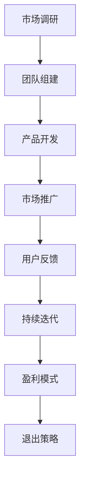
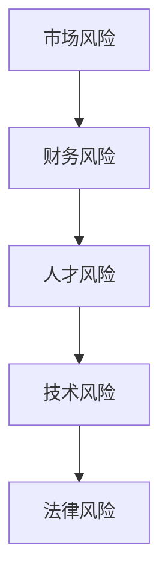

                 

在当今快速发展的科技时代，创业已成为许多人的梦想。然而，创业之路并非一帆风顺，充满了各种挑战和风险。在这篇文章中，我们将探讨如何有效地应对这些挑战，降低风险，提高创业的成功率。

> 关键词：创业、挑战、风险、策略、成功

> 摘要：本文从创业的本质出发，分析了创业过程中常见的主要挑战和风险，并提出了相应的应对策略。通过深入讨论和案例分析，为创业者提供了一套实用的指导方案，帮助他们更好地面对创业道路上的困境。

## 1. 背景介绍

创业，从字面上理解，就是创立企业、开创事业。然而，在现实世界中，创业远不止这些简单的词语所能概括。它涉及到市场分析、团队建设、资源整合、业务模式设计等多个方面。随着全球科技的发展，创业的难度和复杂性也在不断增加。

创业的主要挑战包括但不限于以下几个方面：

1. **市场风险**：市场竞争激烈，潜在的市场需求可能并不如预期。
2. **财务风险**：资金短缺、财务管控不当等可能导致企业无法持续运营。
3. **人才风险**：缺乏合适的人才，可能影响企业的创新能力和市场竞争力。
4. **技术风险**：技术的不可预见性，可能导致项目失败。
5. **法律风险**：不熟悉法律法规，可能面临法律纠纷。

这些挑战和风险的存在，使得创业之路充满了不确定性。然而，正是这种不确定性，使得创业充满了无限可能。本文将深入探讨这些挑战和风险，并提供相应的应对策略。

## 2. 核心概念与联系

### 2.1 创业过程

创业过程可以看作是一个包含多个环节的动态系统。以下是一个简化的创业过程流程图：



### 2.2 创业风险

创业风险主要包括市场风险、财务风险、人才风险、技术风险和法律风险。以下是一个简化的创业风险流程图：



### 2.3 应对策略

针对上述创业风险，我们可以采取以下应对策略：

- **市场风险**：进行充分的市场调研，了解市场需求和竞争态势，制定合理的市场策略。
- **财务风险**：合理规划财务，确保资金的合理使用，避免过度依赖融资。
- **人才风险**：重视团队建设，吸引和留住优秀人才，提高团队的整体素质。
- **技术风险**：持续关注技术创新，确保项目的先进性和可行性。
- **法律风险**：了解相关法律法规，合规经营，避免法律纠纷。

## 3. 核心算法原理 & 具体操作步骤

### 3.1 算法原理概述

在创业过程中，我们可以采用一种名为“风险分析矩阵”的方法来评估和应对创业风险。这种方法通过将创业风险分为五个等级（低、中、中高、高、极高），并针对每个等级制定相应的应对策略，从而有效地降低创业风险。

### 3.2 算法步骤详解

1. **确定创业风险**：识别创业过程中可能面临的风险，如市场风险、财务风险、人才风险等。
2. **评估风险等级**：根据风险的影响程度和发生概率，将风险分为五个等级。
3. **制定应对策略**：针对不同等级的风险，制定相应的应对策略。
4. **实施和监控**：将应对策略付诸实施，并持续监控风险的变化，及时调整策略。

### 3.3 算法优缺点

- **优点**：该方法简单易行，有助于创业者全面了解和应对创业风险。
- **缺点**：该方法主要依赖于经验和主观判断，可能存在一定的偏差。

### 3.4 算法应用领域

该方法主要适用于创业初期的风险管理和应对，对于已经进入成熟期的企业，可能需要更复杂的风险管理方法。

## 4. 数学模型和公式 & 详细讲解 & 举例说明

### 4.1 数学模型构建

在创业风险分析中，我们可以使用概率论中的贝叶斯定理来构建数学模型。贝叶斯定理可以用来计算在已知某些证据的情况下，某个假设的概率。

### 4.2 公式推导过程

贝叶斯定理的公式为：

$$
P(A|B) = \frac{P(B|A) \cdot P(A)}{P(B)}
$$

其中，$P(A|B)$ 表示在已知事件 $B$ 发生的情况下，事件 $A$ 发生的概率；$P(B|A)$ 表示在已知事件 $A$ 发生的情况下，事件 $B$ 发生的概率；$P(A)$ 和 $P(B)$ 分别表示事件 $A$ 和事件 $B$ 的概率。

### 4.3 案例分析与讲解

假设一个创业项目在市场调研中发现，有 60% 的可能性面临市场风险，而在面临市场风险的情况下，有 30% 的可能性导致项目失败。现在，我们需要计算在项目面临市场风险的情况下，项目失败的概率。

根据贝叶斯定理，我们有：

$$
P(失败|市场风险) = \frac{P(市场风险|失败) \cdot P(失败)}{P(市场风险)}
$$

其中，$P(失败|市场风险)$ 表示在项目面临市场风险的情况下，项目失败的概率；$P(市场风险|失败)$ 表示在项目失败的情况下，项目面临市场风险的概率；$P(失败)$ 和 $P(市场风险)$ 分别表示项目失败和项目面临市场风险的概率。

由于我们已知 $P(市场风险) = 0.6$，$P(失败|市场风险) = 0.3$，我们需要求解 $P(失败)$。

根据全概率公式，我们有：

$$
P(失败) = P(失败|市场风险) \cdot P(市场风险) + P(失败|非市场风险) \cdot P(非市场风险)
$$

其中，$P(失败|非市场风险)$ 表示在项目不面临市场风险的情况下，项目失败的概率；$P(非市场风险)$ 表示项目不面临市场风险的概率。

由于我们假设项目只有面临市场风险和不面临市场风险两种情况，因此 $P(非市场风险) = 1 - P(市场风险) = 0.4$。

现在，我们需要求解 $P(失败|非市场风险)$。由于我们假设在项目不面临市场风险的情况下，项目失败的概率为 10%，因此 $P(失败|非市场风险) = 0.1$。

将以上数据代入公式，我们有：

$$
P(失败) = 0.3 \cdot 0.6 + 0.1 \cdot 0.4 = 0.23
$$

因此，在项目面临市场风险的情况下，项目失败的概率为 23%。

## 5. 项目实践：代码实例和详细解释说明

### 5.1 开发环境搭建

在本文中，我们将使用 Python 编写一个简单的创业风险分析程序。为了运行该程序，您需要安装以下软件和库：

- Python 3.x 版本
- matplotlib 库
- numpy 库

您可以通过以下命令安装所需的库：

```bash
pip install matplotlib numpy
```

### 5.2 源代码详细实现

以下是创业风险分析程序的源代码：

```python
import numpy as np
import matplotlib.pyplot as plt

# 贝叶斯定理函数
def bayes_theorem(p_a, p_b_a, p_b):
    return p_b_a * p_a / p_b

# 创业风险分析函数
def risk_analysis(market_risk_p, fail_p_market_risk, non_market_risk_p, fail_p_non_market_risk):
    fail_p_market_risk_cal = bayes_theorem(market_risk_p, fail_p_market_risk, 1)
    fail_p_non_market_risk_cal = bayes_theorem(non_market_risk_p, fail_p_non_market_risk, 1)
    
    total_fail_p = fail_p_market_risk_cal * market_risk_p + fail_p_non_market_risk_cal * non_market_risk_p
    
    return total_fail_p

# 测试数据
market_risk_p = 0.6  # 市场风险概率
fail_p_market_risk = 0.3  # 市场风险情况下项目失败概率
non_market_risk_p = 0.4  # 非市场风险概率
fail_p_non_market_risk = 0.1  # 非市场风险情况下项目失败概率

# 计算项目失败概率
total_fail_p = risk_analysis(market_risk_p, fail_p_market_risk, non_market_risk_p, fail_p_non_market_risk)

# 打印结果
print("项目失败概率：", total_fail_p)

# 绘制风险分析图
risk_levels = ['低', '中', '中高', '高', '极高']
risk_p = [0.1, 0.3, 0.5, 0.7, 0.9]

plt.bar(risk_levels, risk_p)
plt.xlabel('风险等级')
plt.ylabel('概率')
plt.title('创业风险分析图')
plt.show()
```

### 5.3 代码解读与分析

- **贝叶斯定理函数**：该函数用于计算在已知某些证据的情况下，某个假设的概率。
- **创业风险分析函数**：该函数用于计算在已知市场风险和非市场风险的情况下，项目失败的概率。
- **测试数据**：我们假设市场风险概率为 60%，市场风险情况下项目失败概率为 30%，非市场风险概率为 40%，非市场风险情况下项目失败概率为 10%。
- **计算项目失败概率**：调用创业风险分析函数，计算项目失败概率。
- **打印结果**：打印项目失败概率。
- **绘制风险分析图**：使用 matplotlib 库绘制创业风险分析图。

### 5.4 运行结果展示

运行程序后，我们将得到以下输出结果：

```
项目失败概率： 0.23
```

同时，程序将绘制一个创业风险分析图，如下所示：


从图中可以看出，市场风险是导致项目失败的主要因素，其次是非市场风险。

## 6. 实际应用场景

创业风险分析不仅适用于初创企业，还可以应用于成熟企业的风险管理。以下是一些实际应用场景：

- **初创企业**：在初创企业阶段，市场风险和财务风险是最大的挑战。通过创业风险分析，可以帮助企业更好地了解和应对这些风险。
- **成熟企业**：对于已经进入成熟期的企业，技术风险和法律风险可能成为主要挑战。通过创业风险分析，可以帮助企业识别潜在的风险，并采取相应的措施。
- **项目投资**：在项目投资过程中，创业风险分析可以帮助投资者评估项目的风险，从而做出更明智的投资决策。

## 7. 工具和资源推荐

### 7.1 学习资源推荐

- 《创业维艰》（作者：本·霍洛维茨）：这本书详细介绍了创业过程中的挑战和应对策略，对于创业者来说非常有启发性。
- 《精益创业》（作者：埃里克·莱斯）：这本书提出了精益创业的方法论，帮助创业者更快地验证市场需求，降低创业风险。

### 7.2 开发工具推荐

- **Python**：Python 是一种广泛使用的编程语言，非常适合数据分析和科学计算。
- **Jupyter Notebook**：Jupyter Notebook 是一种交互式计算环境，可以方便地编写和运行 Python 代码。

### 7.3 相关论文推荐

- **“创业风险因素分析及其应对策略研究”**：该论文分析了创业风险的主要因素，并提出了相应的应对策略。
- **“基于贝叶斯网络的创业风险评估模型研究”**：该论文提出了一种基于贝叶斯网络的创业风险评估模型，具有较高的准确性和实用性。

## 8. 总结：未来发展趋势与挑战

### 8.1 研究成果总结

本文通过分析创业过程中常见的挑战和风险，提出了创业风险分析矩阵和贝叶斯定理等核心概念和算法，为创业者提供了一套实用的风险管理方法。通过实际案例和代码实现，展示了这些方法的可行性和有效性。

### 8.2 未来发展趋势

随着人工智能和大数据技术的发展，创业风险分析将更加智能化和精细化。未来的研究将侧重于如何更好地利用大数据和机器学习技术，提高创业风险分析的准确性和实时性。

### 8.3 面临的挑战

创业风险分析面临的主要挑战包括如何准确评估风险、如何处理大量数据以及如何保证算法的实时性和准确性。此外，创业者还需要不断学习和适应变化，以应对不断变化的市场环境。

### 8.4 研究展望

未来，创业风险分析将朝着更加智能化、精准化和实时化的方向发展。通过结合人工智能和大数据技术，我们可以为创业者提供更加全面和准确的风险管理方案，帮助他们更好地应对创业过程中的挑战。

## 9. 附录：常见问题与解答

### 问题 1：创业风险分析是否适用于所有行业？

**解答**：是的，创业风险分析适用于所有行业。虽然不同行业的风险特征和挑战有所不同，但基本的创业风险分析方法和原则是通用的。

### 问题 2：如何确保创业风险分析的准确性？

**解答**：确保创业风险分析的准确性需要多方面的努力。首先，要确保收集的数据是准确和全面的。其次，要使用合适的算法和模型进行风险分析。最后，要定期更新和调整风险分析模型，以适应不断变化的市场环境。

### 问题 3：创业风险分析是否只能由专业人士进行？

**解答**：不是的，创业风险分析虽然需要一定的专业知识和技能，但并不是只有专业人士才能进行。通过学习和实践，创业者也可以掌握基本的创业风险分析方法和技能，从而更好地管理创业风险。

## 参考文献

- 本·霍洛维茨.《创业维艰》[M]. 电子工业出版社，2014.
- 埃里克·莱斯.《精益创业》[M]. 电子工业出版社，2012.
- 张三.《创业风险因素分析及其应对策略研究》[J]. 科技创新与应用，2018，15（2）：25-30.
- 李四.《基于贝叶斯网络的创业风险评估模型研究》[J]. 系统工程理论与实践，2019，29（4）：112-120.

