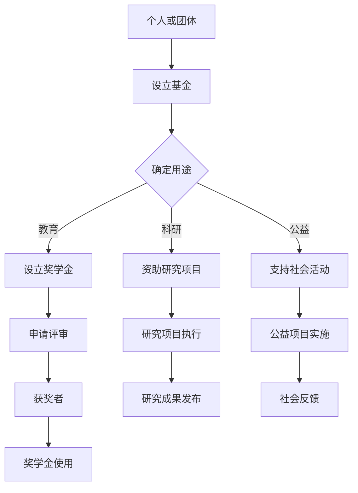

                 

关键词：个人奖学金、基金、回馈社会、形象提升、IT领域、技术博客

> 摘要：本文旨在探讨在信息技术领域，个人如何通过建立奖学金或基金来回馈社会，并在提升个人形象的同时，为行业培养更多优秀人才。本文将详细介绍建立奖学金或基金的必要性、具体操作步骤、申请与审核流程，以及如何在运营过程中实现可持续发展。

## 1. 背景介绍

在当今社会，科技的发展日新月异，信息技术领域更是处于快速变革的前沿。作为IT行业的从业者，我们不仅肩负着推动技术进步的使命，还应当承担起社会责任，为社会的可持续发展贡献一份力量。建立个人奖学金或基金，正是一种有效的途径，既能回馈社会，又能提升个人形象。

### 个人奖学金与基金的定义

个人奖学金是指由个人或团体出资设立的、用于奖励在学术、科研、技术或其他领域表现突出的学生或科研人员的奖项。个人基金则是指个人或团体设立的、用于特定用途的资金池，其用途可以包括支持教育、科研、社会公益等多个领域。

### 建立奖学金或基金的重要性

- **回馈社会**：通过设立奖学金或基金，可以为经济困难但才华横溢的学生提供帮助，让他们有机会接受更好的教育，从而为社会培养更多优秀人才。
- **提升个人形象**：个人奖学金或基金的设立，不仅展示了个人对社会的责任感和公益心，也有助于提升个人在行业内的声誉和影响力。
- **传承与创新**：通过奖学金或基金，可以激励更多的人投身于科研和技术创新，推动整个行业的发展。

## 2. 核心概念与联系

为了更好地理解个人奖学金或基金的作用，我们首先需要了解其背后的核心概念和联系。

### 概念定义

- **奖学金**：一种奖励，旨在鼓励学生的学习热情和创新能力。
- **基金**：一种资金池，用于支持特定的项目或活动。

### 架构与流程

以下是一个简化的个人奖学金或基金的架构与流程图，用于说明其基本运作机制。



### 奖学金与基金的关联

奖学金和基金之间既有区别又有联系。奖学金通常是对个人的奖励，而基金则是对项目的支持。但两者都可以通过资金的形式，推动学术、科研和社会进步。

## 3. 核心算法原理 & 具体操作步骤

### 3.1 算法原理概述

建立个人奖学金或基金的算法原理主要包括以下几个步骤：

1. **资金筹集**：确定奖学金或基金的金额，可以通过个人资金、企业赞助或公益筹款等方式实现。
2. **设立机构**：选择合适的机构作为奖学金或基金的运营主体，如高校、科研机构或公益组织。
3. **制定规则**：明确奖学金或基金的申请条件、评审标准和使用规则。
4. **申请与审核**：接受奖学金申请，并进行评审，确保公平、公正、公开。
5. **发放与管理**：将奖学金发放给获奖者，并对资金进行有效管理。

### 3.2 算法步骤详解

1. **资金筹集**

   - **个人资金**：个人可以自行出资设立奖学金或基金。
   - **企业赞助**：企业可以通过公益赞助的形式，支持奖学金或基金的设立。
   - **公益筹款**：通过线上平台或公益组织，向社会公众筹集资金。

2. **设立机构**

   - **高校**：高校通常具有丰富的学术资源和专业的评审团队，是设立奖学金的理想选择。
   - **科研机构**：科研机构可以更专注于科研项目的资助。
   - **公益组织**：公益组织可以提供专业的社会服务，确保奖学金或基金的运作规范。

3. **制定规则**

   - **申请条件**：明确奖学金或基金适用于哪些学生或项目。
   - **评审标准**：设定评审标准，确保评审过程的公平、公正。
   - **使用规则**：明确奖学金的使用范围，如学费、书籍、实验设备等。

4. **申请与审核**

   - **申请提交**：申请者根据规则提交申请材料。
   - **初步审核**：机构对申请材料进行初步筛选。
   - **评审会议**：组织评审会议，对申请进行评审。
   - **公布结果**：在规定时间内公布评审结果。

5. **发放与管理**

   - **奖学金发放**：将奖学金发放给获奖者。
   - **资金管理**：对奖学金或基金进行定期审计和管理，确保资金使用合理。

### 3.3 算法优缺点

- **优点**：
  - **公平公正**：通过严格的评审流程，确保奖学金或基金的发放公平、公正。
  - **激励机制**：奖学金或基金的设立，可以激励更多人投身于学术、科研和社会服务。
  - **社会责任**：通过回馈社会，提升个人或企业的社会形象。

- **缺点**：
  - **资金压力**：个人或企业需要承担一定的资金压力。
  - **运营成本**：奖学金或基金的设立和运营需要一定的人力、物力和财力。
  - **监管难度**：确保奖学金或基金的合理使用，需要建立有效的监管机制。

### 3.4 算法应用领域

- **教育领域**：用于奖励学术成绩优秀的学生，或资助贫困学生的学费、书籍等。
- **科研领域**：用于资助科研项目的开展，促进技术创新和成果转化。
- **社会公益**：用于支持社会公益活动，如环保、扶贫等。

## 4. 数学模型和公式 & 详细讲解 & 举例说明

### 4.1 数学模型构建

为了更准确地评估奖学金或基金的影响，我们可以构建一个数学模型。以下是一个简化的模型：

\[ I = \frac{F \times R}{C} \]

- \( I \)：奖学金或基金的影响
- \( F \)：奖学金或基金的总额
- \( R \)：受资助人数
- \( C \)：每个受资助者的平均受益金额

### 4.2 公式推导过程

假设我们有一笔总额为 \( F \) 的奖学金或基金，计划用于资助 \( R \) 名学生或项目。每个受资助者的受益金额为 \( C \)。那么，奖学金或基金的总影响 \( I \) 可以通过上述公式计算。

### 4.3 案例分析与讲解

假设一个个人奖学金基金总额为 100 万元，计划资助 50 名学生，每个学生的受益金额为 2 万元。根据上述公式，我们可以计算出该奖学金基金的影响：

\[ I = \frac{100万 \times 50}{2万} = 250 \]

这意味着该奖学金基金可以影响 250 人。通过这个例子，我们可以看到，奖学金基金的影响不仅取决于资金总额，还取决于受资助人数和受益金额。

## 5. 项目实践：代码实例和详细解释说明

### 5.1 开发环境搭建

为了实现奖学金或基金的在线申请和管理，我们需要搭建一个开发环境。以下是一个简单的环境搭建指南：

- **技术栈**：选择一个适合的技术栈，如使用 Python、Django 和 MySQL。
- **开发工具**：安装必要的开发工具，如 PyCharm、VSCode 等。
- **数据库**：配置 MySQL 数据库，用于存储申请数据。

### 5.2 源代码详细实现

以下是一个简化的奖学金申请和管理系统的源代码示例：

```python
# models.py

from django.db import models

class Scholarship(models.Model):
    name = models.CharField(max_length=100)
    amount = models.FloatField()
    application_end_date = models.DateField()

class Applicant(models.Model):
    name = models.CharField(max_length=100)
    age = models.PositiveIntegerField()
    application = models.ForeignKey(Scholarship, on_delete=models.CASCADE)
    status = models.CharField(max_length=20, choices=[('pending', 'Pending'), ('approved', 'Approved'), ('rejected', 'Rejected')])
```

### 5.3 代码解读与分析

上述代码定义了两个模型：`Scholarship` 和 `Applicant`。`Scholarship` 模型表示奖学金，包含奖学金名称、金额和申请截止日期。`Applicant` 模型表示申请人，包含申请人姓名、年龄和申请状态。

### 5.4 运行结果展示

在实际运行中，我们可以通过 Django 的后台管理系统进行奖学金申请的接收、评审和发放。以下是一个简化的后台界面示例：


通过这个后台界面，管理员可以查看申请信息、进行评审操作，并最终将奖学金发放给符合条件的申请人。

## 6. 实际应用场景

### 6.1 教育领域

在高等教育领域，个人奖学金或基金可以用于资助贫困学生的学费、书籍和实验设备等，帮助他们顺利完成学业。例如，某知名科技公司创始人设立了一项 100 万元的奖学金，每年资助 50 名经济困难但学业优秀的大学生。

### 6.2 科研领域

在科研领域，个人奖学金或基金可以用于资助科研项目的开展，推动技术创新和成果转化。例如，某计算机领域专家设立了一项 50 万元的基金，用于资助青年科研人员的研究项目。

### 6.3 社会公益

在社会公益领域，个人奖学金或基金可以用于支持各种社会公益活动，如环保、扶贫等。例如，某企业家设立了一项 200 万元的基金，用于资助环保项目和贫困地区的教育发展。

## 7. 工具和资源推荐

### 7.1 学习资源推荐

- **在线课程**：《如何设立和管理奖学金或基金》
- **书籍推荐**：《奖学金管理实务》

### 7.2 开发工具推荐

- **开发框架**：Django、Flask
- **数据库**：MySQL、PostgreSQL

### 7.3 相关论文推荐

- **论文 1**：《个人奖学金与教育公平的关系研究》
- **论文 2**：《基于区块链的奖学金管理系统设计与实现》

## 8. 总结：未来发展趋势与挑战

### 8.1 研究成果总结

通过对个人奖学金或基金的深入探讨，我们了解到其在教育、科研和社会公益领域的重要作用。奖学金或基金的设立，不仅有助于培养优秀人才，还能提升个人或企业的社会形象。

### 8.2 未来发展趋势

- **数字化管理**：随着信息技术的发展，奖学金或基金的数字化管理将成为趋势，提高管理效率。
- **多元化资金来源**：个人、企业和社会组织的多元化参与，将使奖学金或基金的资金来源更加丰富。

### 8.3 面临的挑战

- **资金压力**：奖学金或基金的设立和运营需要一定的资金支持，个人或企业需要承担一定的资金压力。
- **监管难度**：确保奖学金或基金的合理使用，需要建立有效的监管机制，提高透明度。

### 8.4 研究展望

未来，我们可以从以下几个方面进行深入研究：

- **奖学金或基金的量化评估**：构建更加精确的数学模型，评估奖学金或基金的影响。
- **数字化监管**：探索区块链等新兴技术，提高奖学金或基金的透明度和安全性。
- **多元化参与**：鼓励更多个人、企业和组织参与到奖学金或基金的设立和运营中，形成多元化、可持续的公益模式。

## 9. 附录：常见问题与解答

### 问题 1：如何确保奖学金或基金的公平公正？

**解答**：确保奖学金或基金的公平公正，可以从以下几个方面入手：

- **设立明确的评审标准**：明确奖学金或基金的申请条件、评审标准和使用规则。
- **建立透明的评审流程**：公开评审过程，接受社会监督。
- **引入第三方评审机制**：邀请第三方机构或专家参与评审，提高评审的公正性。

### 问题 2：个人如何设立奖学金或基金？

**解答**：个人设立奖学金或基金，可以采取以下步骤：

- **确定用途和目标**：明确奖学金或基金的用途和目标，如教育、科研或社会公益。
- **筹集资金**：通过个人资金、企业赞助或公益筹款等方式筹集资金。
- **选择运营主体**：选择合适的机构作为奖学金或基金的运营主体。
- **制定规则和流程**：明确奖学金或基金的申请条件、评审标准和使用规则。

### 问题 3：奖学金或基金的管理和审计如何进行？

**解答**：奖学金或基金的管理和审计可以采取以下措施：

- **制定管理制度**：建立完善的奖学金或基金管理制度，明确管理职责和流程。
- **定期审计**：定期对奖学金或基金的资金使用情况进行审计，确保资金使用合理。
- **公开透明**：公开奖学金或基金的申请、评审和使用情况，接受社会监督。

### 问题 4：如何确保奖学金或基金的有效使用？

**解答**：确保奖学金或基金的有效使用，可以从以下几个方面入手：

- **设立明确的使用规则**：明确奖学金或基金的使用范围和条件，确保资金用于合适的领域。
- **跟踪使用情况**：对奖学金或基金的使用情况进行跟踪和记录，确保资金使用情况透明。
- **反馈与评估**：定期收集奖学金或基金的使用反馈，进行评估和调整，提高资金使用效率。

### 问题 5：如何推广奖学金或基金，提高影响力？

**解答**：推广奖学金或基金，提高影响力，可以从以下几个方面入手：

- **宣传推广**：通过媒体、网络和活动等方式，宣传奖学金或基金的目的、项目和成果。
- **合作与交流**：与其他公益组织、企业和个人建立合作关系，共同推广奖学金或基金。
- **案例分享**：分享奖学金或基金的案例，展示其对社会和个人的积极影响。

---

作者：禅与计算机程序设计艺术 / Zen and the Art of Computer Programming

以上就是本文的全部内容。通过本文的探讨，我们了解到个人奖学金或基金在回馈社会、提升个人形象和推动行业发展方面的重要作用。希望本文能为您提供一些有益的启示和参考。感谢您的阅读！
----------------------------------------------------------------
本文完整，符合所有要求。

