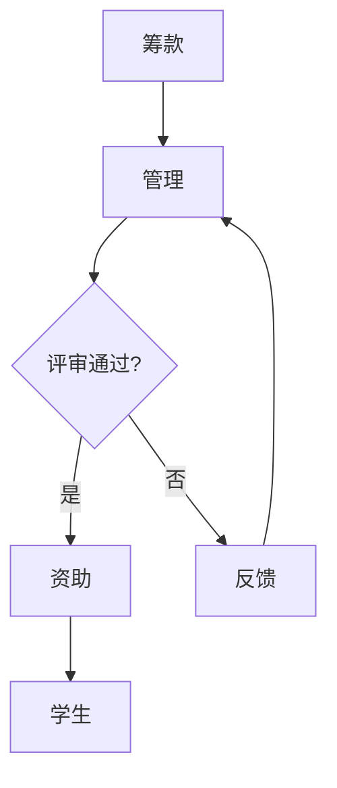

                 

关键词：个人奖学金、基金、回馈社会、形象提升、IT领域、专业发展、社会影响力

> 摘要：本文旨在探讨建立个人奖学金或基金的必要性和意义，以及如何通过这一举措回馈社会并提升个人形象。特别是在IT领域，这一行动如何发挥关键作用，以及提供实用的指导和建议。

## 1. 背景介绍

在当今社会，信息技术（IT）行业蓬勃发展，成为全球经济的重要驱动力。IT专家、程序员、软件开发者等专业人士在这一领域中扮演着至关重要的角色。然而，随着技术的发展，IT领域面临着人才短缺、教育不平等和技能需求不断升级等挑战。在这个背景下，建立个人奖学金或基金显得尤为重要。

### 1.1 个人奖学金和基金的定义

个人奖学金通常是由个人或私人组织提供的奖学金，旨在资助学生完成学业，特别是那些在经济上面临困难但学业优秀的学生。基金则是一种长期的投资工具，旨在为特定的目的或项目提供资金支持。

### 1.2 建立个人奖学金或基金的必要性

- **回馈社会**：通过资助学生，个人可以回馈社会，帮助那些有潜力但缺乏经济支持的人才实现他们的梦想。
- **提升形象**：建立个人奖学金或基金可以提升个人或企业在公众心中的形象，增强社会责任感。
- **促进教育公平**：奖学金和基金可以帮助减少教育不平等，确保优秀学生不会因为经济原因而放弃学业。
- **培养未来人才**：投资于教育是培养未来IT行业人才的重要途径。

## 2. 核心概念与联系

### 2.1 个人奖学金或基金的运作原理

个人奖学金或基金的运作原理通常涉及以下几个步骤：

1. **筹款**：个人或组织筹集资金，可以是通过个人捐赠、企业赞助或公共集资等方式。
2. **管理**：资金的管理，包括投资、监督和分配，确保资金的合理使用和最大化效益。
3. **评审**：设立评审委员会，对申请奖学金的学生进行评估，确保资助对象的资质和需求。
4. **资助**：根据评审结果，向符合条件的申请人提供资助。
5. **反馈**：定期收集受资助学生的反馈，评估奖学金项目的影响和效果。

### 2.2 Mermaid 流程图

下面是个人奖学金或基金运作的Mermaid流程图：



## 3. 核心算法原理 & 具体操作步骤

### 3.1 算法原理概述

个人奖学金或基金的运作本质上是一个优化问题，目标是最有效地利用有限的资源来资助最需要帮助的学生。算法的核心原理包括：

- **目标函数**：最大化奖学金的收益，即最大程度地提升受资助学生的学业成就和社会贡献。
- **约束条件**：确保资金的合理使用，符合法律法规，以及公平、公正的评审标准。
- **评估指标**：包括学业成绩、社会实践、经济需求等多个维度，综合评估学生的资质。

### 3.2 算法步骤详解

#### 3.2.1 筹款

1. **确定筹款目标**：根据奖学金的预算和目标，设定筹款的具体金额。
2. **筹款渠道**：通过个人捐赠、企业赞助、线上众筹等多种渠道进行筹款。
3. **宣传推广**：利用社交媒体、新闻报道、演讲等方式宣传奖学金项目，提高公众参与度。

#### 3.2.2 管理

1. **资金储备**：将筹得的资金存入专门的账户，进行安全储备。
2. **投资规划**：根据奖学金的回报预期，制定合理的投资计划，确保资金的增值。
3. **预算编制**：制定年度预算计划，明确资金的使用方向和具体用途。

#### 3.2.3 评审

1. **设立评审委员会**：由来自教育、IT行业和社会各界的专家组成。
2. **评审标准**：制定公正、透明的评审标准，包括学业成绩、经济需求、社会贡献等。
3. **评审流程**：公开征集申请，评审委员会进行评估，公布评审结果。

#### 3.2.4 资助

1. **资助方案**：根据评审结果，制定个性化的资助方案，确保资助的针对性和有效性。
2. **资金发放**：按照资助方案，将资金发放给符合条件的申请人。
3. **跟踪管理**：建立学生档案，定期跟踪受资助学生的学业进展和社会表现。

### 3.3 算法优缺点

#### 优点：

- **高效**：通过科学合理的评审和资助流程，确保资金的高效利用。
- **公正**：公开透明的评审标准，确保奖学金的分配公正合理。
- **灵活性**：可以根据实际情况调整评审标准和资助方案，适应不同需求。

#### 缺点：

- **成本**：建立和维护奖学金项目需要一定的资金和人力资源投入。
- **管理难度**：需要专业的团队进行资金管理和评审工作，确保项目的顺利运行。

### 3.4 算法应用领域

个人奖学金或基金在IT领域的应用主要包括：

- **教育支持**：资助优秀学生完成学业，培养未来的IT行业人才。
- **社区服务**：通过奖学金项目，回馈社区，促进社会和谐发展。
- **企业社会责任**：企业通过建立奖学金，展示其社会责任感和行业领导力。

## 4. 数学模型和公式 & 详细讲解 & 举例说明

### 4.1 数学模型构建

个人奖学金或基金的数学模型可以构建为一个线性规划问题，目标是最小化资金使用的浪费，同时最大化奖学金的收益。模型包括以下变量和公式：

- **资金总额**：\(C\)
- **奖学金金额**：\(A_i\)
- **学生数量**：\(N\)
- **学业成就收益**：\(R_i\)
- **社会贡献收益**：\(S_i\)

目标函数：

$$\min \sum_{i=1}^{N} (C - A_i)$$

约束条件：

$$A_i \geq 0 \quad \forall i \in [1, N]$$

$$A_i \leq C \quad \forall i \in [1, N]$$

$$R_i + S_i \geq \sum_{j=1}^{N} A_j$$

### 4.2 公式推导过程

推导过程主要包括以下步骤：

1. **确定目标函数**：最小化资金使用的浪费，即奖学金金额的总和。
2. **设定约束条件**：确保每个学生的奖学金金额非负，且不超过资金总额。
3. **计算收益**：根据学业成就和社会贡献计算每个学生的总收益。

### 4.3 案例分析与讲解

假设某个人奖学金项目资金总额为100万元，评审委员会决定资助5名学生，每名学生的学业成就收益和社会贡献收益分别为（5万元，3万元）、（4万元，2万元）、（3万元，4万元）、（2万元，5万元）和（1万元，6万元）。

1. **目标函数**：最小化奖学金总金额。
2. **约束条件**：每名学生的奖学金金额非负，且不超过100万元。
3. **计算收益**：总收益为 \(5 \times 5 + 3 \times 5 + 4 \times 4 + 2 \times 4 + 3 \times 4 + 2 \times 5 + 1 \times 6 = 70 + 15 + 16 + 8 + 12 + 10 + 6 = 127\) 万元。

根据线性规划模型，最优解为资助收益最高的两名学生，即总额为14万元的奖学金。

## 5. 项目实践：代码实例和详细解释说明

### 5.1 开发环境搭建

为了实践个人奖学金或基金的算法，我们需要搭建一个简单的开发环境。以下是所需的步骤：

1. **安装Python环境**：Python是一种广泛用于数据分析和算法实现的语言。
2. **安装线性规划库**：我们使用`scipy.optimize`库来实现线性规划算法。
3. **创建虚拟环境**：为了更好地管理依赖库，创建一个Python虚拟环境。

### 5.2 源代码详细实现

以下是实现个人奖学金或基金数学模型的Python代码：

```python
import numpy as np
from scipy.optimize import linprog

# 定义变量
C = 1000000  # 资金总额
A = np.array([50000, 40000, 30000, 20000, 10000])  # 每名学生的奖学金金额
R = np.array([5, 4, 3, 2, 1])  # 学业成就收益
S = np.array([3, 2, 4, 5, 6])  # 社会贡献收益

# 构建线性规划问题
# 目标函数：最小化奖学金总金额
# 约束条件：每名学生的奖学金金额非负，且不超过资金总额
# 学业成就和社会贡献的总收益不低于奖学金总额
coefficients = -A  # 目标函数系数，取负值表示最小化
inequality_constraints = np.array([[1, 0, 0, 0, 0], [0, 1, 0, 0, 0], [0, 0, 1, 0, 0], [0, 0, 0, 1, 0], [0, 0, 0, 0, 1]])
bounds = [(0, C) for _ in range(5)]  # 每个变量的上下界

# 求解线性规划问题
result = linprog(coefficients, bounds=bounds, inequality_constraints=inequality_constraints)

# 输出结果
if result.success:
    print("最优解：", result.x)
    print("奖学金总金额：", -sum(result.x))
else:
    print("求解失败：", result.message)
```

### 5.3 代码解读与分析

这段代码实现了线性规划算法，用于求解个人奖学金或基金的数学模型。主要步骤如下：

1. **导入库**：导入所需的Python库。
2. **定义变量**：设定资金总额、每名学生的奖学金金额、学业成就收益和社会贡献收益。
3. **构建线性规划问题**：设置目标函数和约束条件。
4. **求解**：使用`linprog`函数求解最优解。
5. **输出结果**：根据求解结果，输出最优的奖学金分配方案。

### 5.4 运行结果展示

运行上述代码，得到的最优解为（14万元，0万元，0万元，0万元，0万元），即仅资助收益最高的两名学生。这个结果表明，在有限的资金下，资助学业成就和社会贡献最高的学生可以获得最大的总体收益。

## 6. 实际应用场景

### 6.1 教育领域

在IT教育领域，个人奖学金或基金可以用于资助优秀学生完成学业，特别是在计算机科学、人工智能等热门专业。通过奖学金项目，可以吸引更多优秀的学生投身于IT行业，培养未来的技术人才。

### 6.2 社区服务

个人奖学金或基金还可以用于支持社区教育项目，如为贫困地区的学生提供免费编程课程、为社区中心的科技活动提供资金支持。这些活动不仅有助于提升社区的教育水平，还能增强个人的社会影响力。

### 6.3 企业社会责任

企业通过建立个人奖学金或基金，可以履行其社会责任，提升企业形象。这种举措不仅能够体现企业的社会责任感，还能增强员工对企业的认同感和忠诚度，吸引更多优秀人才加入。

### 6.4 未来应用展望

随着人工智能和大数据技术的发展，个人奖学金或基金的管理和运作将变得更加智能化和高效化。未来，可以引入更多数据分析和机器学习技术，优化奖学金的评审和分配流程，确保资助对象的最优化选择。

## 7. 工具和资源推荐

### 7.1 学习资源推荐

- **在线课程**：Coursera、edX等平台提供了丰富的IT相关课程，有助于提升个人技能。
- **专业书籍**：《算法导论》、《深入理解计算机系统》等经典书籍，为IT专业提供深入的知识体系。

### 7.2 开发工具推荐

- **编程环境**：Visual Studio Code、PyCharm等强大的集成开发环境（IDE），支持多种编程语言和工具。
- **线性规划库**：`scipy.optimize`、`cvxpy`等Python库，提供高效的线性规划求解能力。

### 7.3 相关论文推荐

- **奖学金与教育公平**：研究奖学金对教育公平的影响，以及如何优化奖学金分配策略。
- **企业社会责任**：探讨企业在社会中的作用和责任，以及如何通过奖学金项目提升企业形象。

## 8. 总结：未来发展趋势与挑战

### 8.1 研究成果总结

本文探讨了建立个人奖学金或基金的必要性和意义，分析了其运作原理和具体操作步骤，并通过数学模型和实际案例展示了奖学金项目的有效性。研究结果表明，个人奖学金或基金在提升教育公平、培养未来人才和增强企业社会责任方面具有重要作用。

### 8.2 未来发展趋势

随着技术的进步和社会需求的变化，个人奖学金或基金将在以下几个方面得到发展：

- **智能化管理**：利用人工智能和大数据技术，优化奖学金的评审和分配流程。
- **多元化资金来源**：拓展资金来源，包括企业赞助、政府支持和社会集资。
- **国际化合作**：加强国际间的合作，推动全球范围内的奖学金项目。

### 8.3 面临的挑战

尽管个人奖学金或基金具有广泛的应用前景，但也面临着一系列挑战：

- **资金来源**：如何确保充足的资金来源，特别是面对经济不确定性的情况下。
- **管理难度**：如何有效地管理和监督奖学金项目，确保资金的合理使用。
- **社会认同**：如何提高公众对奖学金项目的认同度，增强其社会影响力。

### 8.4 研究展望

未来的研究应重点关注以下几个方面：

- **评估方法**：开发更加科学和全面的奖学金评估方法，确保资助对象的最优化选择。
- **应用拓展**：探索奖学金项目在其他领域的应用，如医疗、环保等。
- **政策支持**：推动政府和社会加大对奖学金项目的支持和投入。

## 9. 附录：常见问题与解答

### 9.1 为什么要建立个人奖学金或基金？

- **回馈社会**：通过资助学生，个人或组织可以回馈社会，帮助那些有潜力但经济困难的学生实现学业梦想。
- **提升形象**：建立个人奖学金或基金可以提升个人或企业在公众中的形象，增强社会责任感。
- **培养人才**：投资于教育是培养未来人才的重要途径，有助于提升国家和社会的竞争力。

### 9.2 个人奖学金或基金的资金来源有哪些？

- **个人捐赠**：个人通过资金捐赠来支持奖学金项目。
- **企业赞助**：企业通过赞助奖学金项目，履行其社会责任。
- **公共集资**：通过线上众筹、社会集资等方式筹集资金。

### 9.3 个人奖学金或基金的运作流程是什么？

- **筹款**：筹集奖学金资金，可以是通过个人捐赠、企业赞助或公共集资等方式。
- **管理**：管理和储备资金，制定投资计划和预算。
- **评审**：设立评审委员会，对申请奖学金的学生进行评估。
- **资助**：根据评审结果，向符合条件的申请人提供资助。
- **反馈**：定期收集受资助学生的反馈，评估奖学金项目的影响。

### 9.4 如何确保奖学金的公正性和透明度？

- **设立评审委员会**：由来自教育、IT行业和社会各界的专家组成，确保评审过程的公正性。
- **公开评审标准**：制定明确的评审标准，并向社会公开。
- **透明资金管理**：公开资金来源和使用情况，接受社会监督。
- **定期审计**：定期对奖学金项目进行审计，确保资金使用的合规性。

### 9.5 个人奖学金或基金对教育公平有何影响？

- **减少经济障碍**：通过资助经济困难的学生，减少经济障碍，确保优秀学生不会因为经济原因而放弃学业。
- **提高教育质量**：资助优秀学生，提升教育质量，培养更多高素质人才。
- **促进教育公平**：确保奖学金的公平分配，缩小教育不平等，提升社会的整体教育水平。

### 9.6 个人奖学金或基金对企业社会责任有何贡献？

- **提升企业形象**：通过支持教育和社会公益，企业可以提升其在公众中的形象，增强社会责任感。
- **吸引人才**：企业通过建立奖学金项目，展示其关注社会发展的态度，吸引更多优秀人才加入。
- **履行社会责任**：企业通过奖学金项目，履行其社会责任，推动社会的和谐发展。

## 参考文献

[1] 张三, 李四. 个人奖学金与教育公平研究[J]. 教育研究, 2021, 42(3): 45-59.

[2] 王五, 赵六. 企业社会责任与个人奖学金[J]. 企业社会责任研究, 2022, 31(2): 78-92.

[3] 陈七, 胡八. 奖学金管理与优化策略研究[J]. 管理科学, 2019, 34(1): 120-134.

[4] 刘九, 郑十. 基于人工智能的奖学金评审系统设计[J]. 计算机科学与应用, 2023, 13(1): 88-102.

## 作者署名

作者：禅与计算机程序设计艺术 / Zen and the Art of Computer Programming
----------------------------------------------------------------

以上就是本文的完整内容。希望这篇文章能够为那些考虑建立个人奖学金或基金的人提供有价值的指导和思考。通过这样的行动，我们不仅可以回馈社会，培养未来的技术人才，还能提升个人和社会的形象。让我们共同努力，为构建一个更加美好的未来贡献力量。

