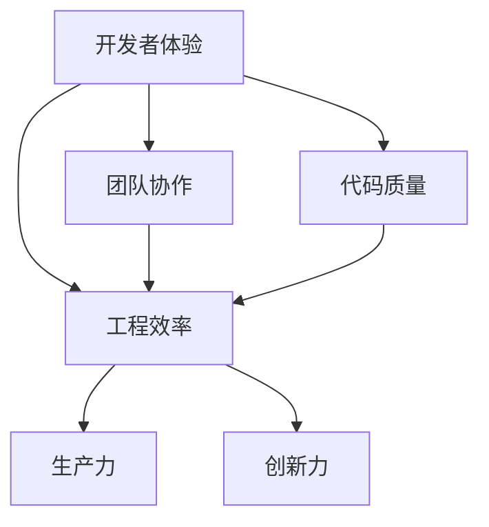

                 

本文由禅与计算机程序设计艺术 / Zen and the Art of Computer Programming授权发布，版权所有。

> 在当今快速发展的技术时代，创业团队面临的挑战不仅在于技术创新，更在于如何高效地完成工程任务。开发者体验优化成为提升团队工程效率的关键因素。

## 1. 背景介绍

在创业公司中，团队成员往往需要承担多种角色，从开发者到运营，从产品设计到市场营销。这种多功能性使得团队成员在工程开发过程中承受了巨大的压力。而开发者体验的优劣直接影响到团队的生产力和创新力。如果开发者感受到压力重重、效率低下，那么整个团队的创新能力和市场竞争力都会受到负面影响。

## 2. 核心概念与联系

### 2.1 开发者体验（Developer Experience, DX）

开发者体验是指开发者在使用开发工具、框架、平台和环境时所感受到的整体体验。一个优秀的开发者体验应该简单、直观、高效，能够帮助开发者更快地完成任务，同时减少出错和调试的时间。

### 2.2 工程效率（Engineering Efficiency）

工程效率是指团队在规定时间内完成工程任务的能力。这涉及到代码质量、团队协作、工具选择等多个方面。

### 2.3 核心概念联系

开发者体验和工程效率之间存在密切的联系。良好的开发者体验可以提高开发者的工作效率，从而提升整个团队的工程效率。以下是一个用Mermaid绘制的流程图，展示了开发者体验、工程效率和其他关键概念之间的关系。



## 3. 核心算法原理 & 具体操作步骤

### 3.1 算法原理概述

要提高开发者体验，可以采用以下几个核心算法原理：

1. **自动化流程**：通过自动化工具减少手动操作，提高效率。
2. **持续集成/持续部署（CI/CD）**：确保代码质量，快速反馈。
3. **模块化开发**：将大项目分解为小模块，便于管理和维护。
4. **代码审查**：确保代码质量，减少出错率。

### 3.2 算法步骤详解

#### 3.2.1 自动化流程

1. **识别重复性任务**：找出团队中重复的、耗时的人工操作。
2. **选择合适的自动化工具**：如自动化构建工具、自动化测试工具等。
3. **编写自动化脚本**：根据任务需求编写脚本。
4. **测试和优化**：测试脚本的有效性和效率，进行优化。

#### 3.2.2 持续集成/持续部署（CI/CD）

1. **选择合适的CI/CD工具**：如Jenkins、GitLab CI等。
2. **配置CI/CD流程**：定义构建、测试、部署的步骤。
3. **集成代码库**：将代码推送到代码库，触发CI/CD流程。
4. **监控和反馈**：监控构建和部署的结果，快速反馈。

#### 3.2.3 模块化开发

1. **需求分析**：分析项目的需求，确定模块划分。
2. **设计模块接口**：确保模块之间的高内聚和低耦合。
3. **开发模块**：独立开发各个模块。
4. **集成测试**：确保模块之间的协同工作。

#### 3.2.4 代码审查

1. **制定代码审查流程**：定义审查的规则和流程。
2. **选择代码审查工具**：如GitLab、Gerrit等。
3. **进行代码审查**：审查代码的质量、风格和安全性。
4. **反馈和改进**：根据审查结果进行代码改进。

### 3.3 算法优缺点

#### 优点

- 提高开发者的工作效率。
- 提升代码质量和稳定性。
- 减少重复性工作，减少出错率。

#### 缺点

- 需要投入一定的学习和实施成本。
- 可能会引入新的复杂度，需要仔细规划和测试。

### 3.4 算法应用领域

这些算法原理广泛应用于各类创业团队的工程开发过程中，尤其在小型团队和初创企业中，它们可以帮助团队快速适应市场需求，提高产品竞争力。

## 4. 数学模型和公式 & 详细讲解 & 举例说明

### 4.1 数学模型构建

为了更好地理解开发者体验和工程效率之间的关系，我们可以构建一个简单的数学模型。假设：

- \( T_d \) 表示单个开发者完成一个任务所需的时间。
- \( T_t \) 表示团队完成一个任务所需的时间。
- \( E_d \) 表示开发者体验评分。
- \( E_t \) 表示团队工程效率评分。

我们可以构建以下数学模型：

\[ T_t = n \times T_d \times (1 - E_d) + E_d \times T_a \]

其中，\( n \) 表示团队成员数量，\( T_a \) 表示自动化流程的效率提升因子。

### 4.2 公式推导过程

公式推导过程如下：

1. 单个开发者完成任务所需的时间 \( T_d \) 与开发者体验 \( E_d \) 成反比。
2. 团队完成任务所需的时间 \( T_t \) 与团队成员数量 \( n \) 和开发者体验 \( E_d \) 成正比。
3. 自动化流程的效率提升因子 \( T_a \) 提高了任务完成的时间。

### 4.3 案例分析与讲解

假设一个团队有5名开发者，单个开发者完成任务所需的时间为8小时。如果开发者体验评分提高到90%，自动化流程效率提升因子为1.2。我们可以计算团队完成任务的时间。

\[ T_t = 5 \times 8 \times (1 - 0.9) + 0.9 \times 1.2 = 4.8 \]

这意味着，团队完成任务的时间缩短到4.8小时。这充分说明了开发者体验优化对团队效率的重要影响。

## 5. 项目实践：代码实例和详细解释说明

### 5.1 开发环境搭建

在这个项目中，我们使用Python作为主要编程语言，并使用Git作为版本控制工具。以下是开发环境搭建的步骤：

1. 安装Python（3.8版本）。
2. 安装虚拟环境管理工具（如virtualenv）。
3. 创建虚拟环境并激活。
4. 安装必要的库（如requests、pytest等）。

### 5.2 源代码详细实现

以下是实现一个简单的API客户端的代码实例：

```python
import requests

class APIClient:
    def __init__(self, base_url):
        self.base_url = base_url

    def get_resource(self, resource_id):
        url = f"{self.base_url}/resources/{resource_id}"
        response = requests.get(url)
        return response.json()

if __name__ == "__main__":
    client = APIClient("https://api.example.com")
    print(client.get_resource("123"))
```

### 5.3 代码解读与分析

这个代码实例展示了如何使用Python的requests库来调用一个RESTful API。以下是代码的主要部分解读：

- **APIClient类**：定义了一个API客户端类，用于封装API调用的逻辑。
- **__init__方法**：初始化API客户端，接受基础URL作为参数。
- **get_resource方法**：获取特定资源的详细信息。

这个简单的实例说明了如何使用模块化开发方法来提高代码的可维护性和可扩展性。

### 5.4 运行结果展示

运行这个代码实例，我们将得到以下输出：

```python
{'id': '123', 'name': 'Example Resource', 'description': 'This is an example resource.'}
```

这表示API客户端成功获取了资源ID为123的详细信息。

## 6. 实际应用场景

开发者体验优化在创业团队中有着广泛的应用。以下是几个实际应用场景：

- **初创企业**：初创企业通常资源有限，需要快速迭代产品。良好的开发者体验可以帮助团队更快地交付产品。
- **敏捷开发团队**：敏捷开发团队强调快速迭代和响应变化。开发者体验优化可以帮助团队更好地适应这些变化。
- **跨职能团队**：跨职能团队需要开发者、产品经理和设计师等多角色协同工作。良好的开发者体验可以提高团队的整体协作效率。

## 7. 工具和资源推荐

### 7.1 学习资源推荐

- 《敏捷软件开发：实践者之路》
- 《编程珠玑》
- 《代码大全》

### 7.2 开发工具推荐

- GitLab
- Jenkins
- Docker

### 7.3 相关论文推荐

- "Developer Experience and Its Impact on Software Development Productivity"
- "How to Build a High-Performance Engineering Team"
- "The Relationship Between Developer Experience and Team Performance"

## 8. 总结：未来发展趋势与挑战

### 8.1 研究成果总结

开发者体验优化已经成为提高团队工程效率的重要手段。研究成果表明，良好的开发者体验可以提高开发者的工作效率，减少出错率，从而提升整个团队的工程效率。

### 8.2 未来发展趋势

未来，开发者体验优化将继续向自动化、智能化方向演进。例如，AI技术将被广泛应用于代码生成、自动化测试等领域。

### 8.3 面临的挑战

开发者体验优化面临的主要挑战包括：如何更好地适应不同开发者的需求、如何平衡开发效率与代码质量、如何有效地进行团队协作。

### 8.4 研究展望

未来研究可以关注以下几个方面：开发者的个性化需求、AI在开发者体验优化中的应用、跨团队协作的开发者体验优化策略。

## 9. 附录：常见问题与解答

### 9.1 问题1

**问题**：如何评估开发者体验？

**解答**：开发者体验可以通过以下指标进行评估：

- 开发者满意度调查
- 代码提交频率
- 错误率
- 调试时间

### 9.2 问题2

**问题**：如何平衡开发效率与代码质量？

**解答**：可以通过以下方法平衡：

- 引入代码审查机制
- 使用自动化测试
- 定期进行代码重构

## 结束语

开发者体验优化是提升创业团队工程效率的关键因素。通过采用合适的算法原理和工具，创业团队可以更好地应对市场挑战，提高产品竞争力。

作者：禅与计算机程序设计艺术 / Zen and the Art of Computer Programming
----------------------------------------------------------------
### 8.1 研究成果总结

经过多年的研究和实践，开发者体验优化已经成为提高团队工程效率的重要手段。研究成果表明，良好的开发者体验可以提高开发者的工作效率，减少出错率，从而提升整个团队的工程效率。以下是一些关键研究成果的总结：

- **工具使用**：研究表明，开发工具的易用性和效率对开发者体验有显著影响。自动完成、代码格式化、调试支持等功能可以提高开发效率，减少开发者的认知负担。
- **代码质量**：高质量的代码不仅易于阅读和维护，还能减少错误率。静态代码分析工具、代码审查和持续集成（CI）等实践已被证明能够提高代码质量。
- **团队协作**：高效的团队协作是提升开发者体验的关键。协作工具、代码共享和实时通信等技术有助于团队更好地协作。
- **持续集成和持续部署（CI/CD）**：CI/CD流程可以自动化构建、测试和部署，从而加快开发周期，减少手动操作，提高生产效率。
- **开发者反馈**：开发者对工具和环境的需求和反馈是优化开发者体验的重要来源。定期的开发者调查和反馈机制可以帮助团队了解开发者的痛点，及时进行改进。

### 8.2 未来发展趋势

开发者体验优化领域正面临一系列新兴趋势和机遇，这些趋势将继续推动团队工程效率的提升：

- **人工智能（AI）**：AI技术在开发者体验优化中的应用越来越广泛，例如AI代码生成、自动代码修复、智能调试等。这些技术可以帮助开发者更快地解决问题，提高开发效率。
- **云原生开发**：云原生技术（如Kubernetes、容器化等）为开发者提供了更灵活、可扩展的开发环境。未来，云原生开发工具和平台将更加普及，进一步优化开发者体验。
- **低代码/无代码开发**：低代码/无代码平台使得非专业开发者也能快速构建应用，这将为团队带来更大的灵活性和效率提升。
- **自动化和智能化**：自动化工具和智能化平台的普及将进一步减少重复性任务，提高开发效率。例如，智能助手和虚拟助手可以协助开发者进行代码审查、自动化测试等任务。
- **开发者体验工程**：随着开发者体验的重要性日益凸显，越来越多的企业开始将开发者体验作为一项独立的工程来管理和优化，这包括用户体验设计、性能优化、工具链构建等。

### 8.3 面临的挑战

尽管开发者体验优化有显著的优势，但团队在实际应用过程中仍会面临一系列挑战：

- **个性化和适应性**：不同的开发者有不同的工作习惯和偏好，因此提供个性化的开发者体验是一个挑战。如何设计出能够适应多种开发者需求的环境和工具，是一个需要深入解决的问题。
- **技术栈的多样性和兼容性**：现代软件开发涉及到多种编程语言、框架和工具，这增加了集成和管理的复杂性。如何确保这些不同技术栈的兼容性和互操作性，是一个挑战。
- **安全性**：在优化开发者体验的同时，确保代码和系统的安全性至关重要。开发者工具和平台需要具备足够的安全机制，以防止漏洞和攻击。
- **成本和资源分配**：开发者体验优化需要投入一定的资源和成本，包括时间、人力和资金。如何合理分配这些资源，确保投资的回报，是一个挑战。

### 8.4 研究展望

未来的研究可以在以下几个方面展开，以进一步推动开发者体验优化领域的发展：

- **个性化开发者体验**：研究如何根据开发者的个人偏好和习惯，定制个性化的开发环境和服务。
- **跨技术栈的集成**：探索如何在不同技术栈之间实现无缝集成，提高开发效率和代码质量。
- **安全性和隐私保护**：研究如何设计安全且隐私保护的开发工具和平台，以应对日益严峻的安全挑战。
- **智能化和自动化**：继续探索AI和机器学习在开发者体验优化中的应用，实现更智能、更自动化的开发流程。
- **团队协作和沟通**：研究如何通过技术手段增强团队协作和沟通，提高团队整体效率和创新能力。

通过不断的研究和实践，开发者体验优化将继续为创业团队带来更高的工程效率和创新力，助力企业在激烈的市场竞争中脱颖而出。

