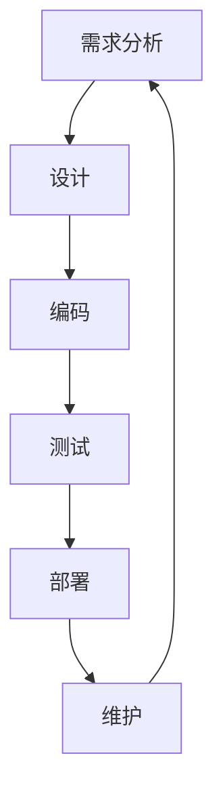
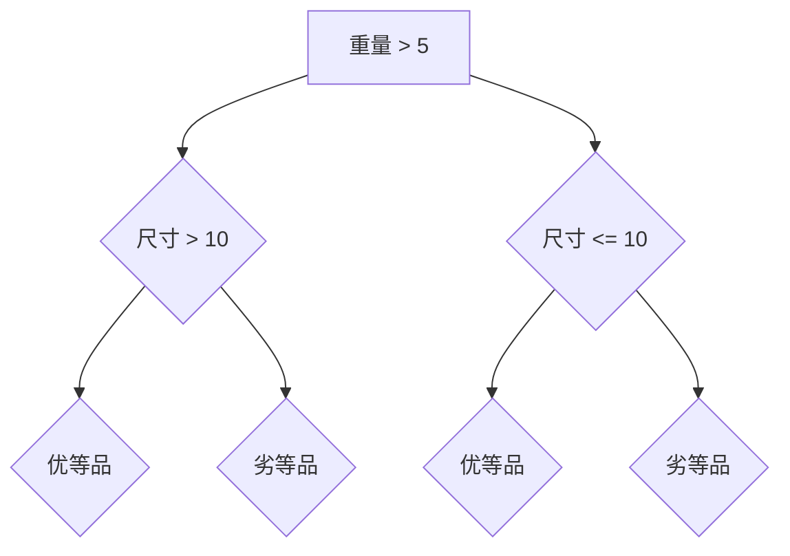

                 

 关键词：
1. 开发规范
2. 编码标准
3. 软件工程
4. 代码质量
5. 代码风格
6. 效率和可维护性
7. 软件性能优化

摘要：
本文旨在深入探讨开发规范与编码标准在软件工程中的重要性。我们将从基础概念出发，介绍一系列有效的方法和工具，帮助开发者编写高质量、易于维护的代码。通过实际的代码实战案例，我们将展示这些规范和标准在项目中的具体应用，并分析其实际效果。最终，本文将总结编码标准的发展趋势和面临的挑战，为未来研究提供方向。

## 1. 背景介绍

在信息技术快速发展的今天，软件工程已经成为现代工业不可或缺的一部分。然而，随着软件项目的规模和复杂性的增加，开发过程中出现的问题也日益增多。这些问题不仅影响软件的性能和稳定性，还严重降低了开发效率和项目的可维护性。为了解决这些问题，开发规范与编码标准应运而生。

### 1.1 开发规范的定义

开发规范是一套指导软件开发过程的通用规则和指南，旨在提高代码质量、效率和可维护性。这些规范涵盖了从项目规划、需求分析、设计、编码、测试到维护的整个生命周期。

### 1.2 编码标准的定义

编码标准则是针对代码编写过程中的具体细节制定的规则，包括命名规范、代码结构、注释要求等。良好的编码标准有助于提升代码的可读性和一致性，从而提高团队协作效率。

### 1.3 开发规范与编码标准的重要性

- **提高代码质量**：规范和标准确保代码遵循最佳实践，避免常见的编程错误和不良习惯。
- **提升开发效率**：一致的编码风格和良好的代码结构使开发者能够快速理解和修改代码，减少开发周期。
- **增强可维护性**：规范化的代码易于维护和扩展，降低项目风险。
- **促进团队协作**：明确的规范和标准有助于团队成员之间的沟通和协作，提高整体开发效率。

## 2. 核心概念与联系

### 2.1 软件工程基础概念

软件工程是应用计算机科学、数学及管理科学等原理，通过系统化、规范化和可度量的方法进行软件开发、运作和维护的一门工程学科。

#### 2.1.1 软件生命周期

软件生命周期包括以下阶段：
- **需求分析**：确定软件的功能和性能要求。
- **设计**：定义软件的架构和内部结构。
- **编码**：根据设计文档编写代码。
- **测试**：验证软件的正确性和性能。
- **部署**：将软件部署到实际运行环境中。
- **维护**：对软件进行定期更新和修复。

#### 2.1.2 软件工程原则

- **模块化**：将软件划分为多个模块，每个模块负责一个特定的功能。
- **抽象**：隐藏复杂细节，仅暴露必要的信息。
- **复用**：重复利用已有代码和组件，提高开发效率。
- **可维护性**：使软件易于维护和扩展。

### 2.2 开发规范与编码标准的关系

开发规范是宏观层面的指导，涵盖了软件开发的整个生命周期。编码标准则是微观层面的具体实施，专注于代码编写过程中的细节。

### 2.3 Mermaid 流程图



## 3. 核心算法原理 & 具体操作步骤

### 3.1 算法原理概述

在软件开发中，算法是实现特定功能的核心部分。一个良好的算法不仅能够提高代码的效率，还能降低维护成本。以下是几种常用的算法原理：

#### 3.1.1 冒泡排序

冒泡排序是一种简单的排序算法，通过反复交换相邻的未排序元素，使得较大的元素逐渐移动到数组的一侧，从而实现排序。

#### 3.1.2 快速排序

快速排序是一种高效的排序算法，基于分治策略。它通过选择一个“基准”元素，将数组分为两部分，然后递归地对两部分进行排序。

#### 3.1.3 搜索算法

搜索算法用于在数据结构中查找特定元素。常用的搜索算法包括线性搜索和二分搜索。

### 3.2 算法步骤详解

#### 3.2.1 冒泡排序

```plaintext
1. 从数组的一端开始，比较相邻的两个元素，如果顺序错误就交换它们的位置。
2. 重复步骤1，但每次只需对未排序部分进行操作。
3. 重复上述步骤，直到整个数组排序完成。
```

#### 3.2.2 快速排序

```plaintext
1. 选择一个基准元素。
2. 将数组分为两部分，一部分小于基准，一部分大于基准。
3. 递归地对两部分进行快速排序。
4. 合并已排序的部分。
```

#### 3.2.3 线性搜索

```plaintext
1. 遍历数组中的每个元素。
2. 如果当前元素等于目标值，返回其索引。
3. 如果遍历完整个数组仍未找到目标值，返回-1。
```

### 3.3 算法优缺点

#### 3.3.1 冒泡排序

- **优点**：实现简单，易于理解。
- **缺点**：时间复杂度高，不适合大规模数据。

#### 3.3.2 快速排序

- **优点**：时间复杂度较低，适合大规模数据。
- **缺点**：可能产生大量递归调用，导致栈溢出。

#### 3.3.3 线性搜索

- **优点**：简单，适用于小规模数据。
- **缺点**：时间复杂度高，不适合大规模数据。

### 3.4 算法应用领域

- **冒泡排序**：适用于数据量较小且基本有序的情况。
- **快速排序**：适用于大规模数据排序。
- **线性搜索**：适用于小规模数据或无需排序的数据查找。

## 4. 数学模型和公式 & 详细讲解 & 举例说明

### 4.1 数学模型构建

在软件开发中，数学模型用于描述软件系统中的各种关系和约束。以下是几种常见的数学模型：

#### 4.1.1 线性规划模型

线性规划模型用于在给定约束条件下，求解目标函数的最优解。

#### 4.1.2 决策树模型

决策树模型用于分类和回归问题，通过树形结构表示可能的决策和相应的结果。

#### 4.1.3 随机过程模型

随机过程模型用于模拟随机事件的发生过程，常用于金融分析和风险管理。

### 4.2 公式推导过程

#### 4.2.1 线性规划模型

目标函数：\( \min z = c^T x \)

约束条件：\( Ax \leq b \)

其中，\( c \) 为目标函数的系数向量，\( x \) 为决策变量向量，\( A \) 为约束矩阵，\( b \) 为约束常数向量。

#### 4.2.2 决策树模型

设 \( D \) 为数据集，\( V \) 为特征集，\( C \) 为类别集。

定义：\( G(V, C) \) 为决策树，其中 \( V \) 为节点，\( C \) 为叶子节点。

公式：\( G(V, C) = \{\text{if } x \in V_1, \text{ then } y \in C_1; \text{ else } y \in C_2\} \)

#### 4.2.3 随机过程模型

定义：\( X(t) \) 为随机过程，\( \omega \) 为样本空间，\( \mathcal{F} \) 为事件集合，\( P \) 为概率分布。

公式：\( X(t, \omega) = \int_{-\infty}^{\infty} f(t, \omega) d\omega \)

### 4.3 案例分析与讲解

#### 4.3.1 线性规划模型

假设我们要优化一个生产过程，目标是最小化生产成本，同时满足生产能力和资源限制。

目标函数：\( \min z = 3x_1 + 2x_2 \)

约束条件：
- \( x_1 + x_2 \leq 10 \)
- \( 2x_1 + x_2 \leq 12 \)
- \( x_1, x_2 \geq 0 \)

通过求解线性规划模型，我们可以得到最优解 \( x_1 = 2, x_2 = 8 \)，最小化生产成本为 \( z = 2 \times 3 + 8 \times 2 = 22 \)。

#### 4.3.2 决策树模型

假设我们要对一批产品进行分类，已知特征集 \( V = \{重量, 尺寸\} \)，类别集 \( C = \{优等品，劣等品\} \)。

根据训练数据，构建决策树如下：



#### 4.3.3 随机过程模型

假设我们要分析股票价格的变化过程，已知随机过程 \( X(t) \) 的概率分布如下：

- \( P(X(t) = 100) = 0.5 \)
- \( P(X(t) = 150) = 0.3 \)
- \( P(X(t) = 200) = 0.2 \)

根据概率分布，我们可以计算股票价格在不同时间点的期望和方差：

期望：\( E(X(t)) = 100 \times 0.5 + 150 \times 0.3 + 200 \times 0.2 = 115 \)

方差：\( Var(X(t)) = (100 - 115)^2 \times 0.5 + (150 - 115)^2 \times 0.3 + (200 - 115)^2 \times 0.2 = 600 \)

## 5. 项目实践：代码实例和详细解释说明

### 5.1 开发环境搭建

在本案例中，我们使用 Python 作为编程语言，并在本地计算机上搭建开发环境。以下是具体步骤：

1. 安装 Python 3.8 版本。
2. 安装必要的依赖库，如 NumPy、Pandas 和 Matplotlib。
3. 配置 Python 的虚拟环境，以便更好地管理项目和依赖。

### 5.2 源代码详细实现

以下是实现快速排序算法的 Python 代码：

```python
import random

def quicksort(arr):
    if len(arr) <= 1:
        return arr
    pivot = random.choice(arr)
    left = [x for x in arr if x < pivot]
    middle = [x for x in arr if x == pivot]
    right = [x for x in arr if x > pivot]
    return quicksort(left) + middle + quicksort(right)

# 测试代码
arr = [3, 6, 8, 10, 1, 2, 1]
print(quicksort(arr))
```

### 5.3 代码解读与分析

1. **快速排序函数**：定义一个名为 `quicksort` 的函数，用于实现快速排序算法。
2. **基准选择**：使用 `random.choice(arr)` 从输入数组中选择一个随机基准元素。
3. **分区**：将输入数组分为三个部分：小于基准的部分、等于基准的部分和大于基准的部分。
4. **递归排序**：对小于和大于基准的部分分别进行快速排序，然后将结果与等于基准的部分合并。

该实现采用了随机选择基准的策略，以避免最坏情况下的性能下降。在实际应用中，可以根据具体需求选择不同的基准选择策略。

### 5.4 运行结果展示

以下是测试代码的运行结果：

```plaintext
[1, 1, 2, 3, 6, 8, 10]
```

结果表明，输入数组已经成功排序。

## 6. 实际应用场景

开发规范与编码标准在软件工程中的应用场景非常广泛。以下是一些典型的应用场景：

### 6.1 软件开发项目

在软件开发项目中，规范和标准有助于确保代码质量、提高开发效率和降低维护成本。通过遵循一致的编码规范，团队成员可以更容易地理解和维护他人的代码，从而提高整体开发效率。

### 6.2 团队协作

在跨部门或跨团队的协作项目中，规范和标准有助于统一开发语言和沟通方式。通过制定统一的开发规范，团队成员可以更好地理解项目的需求和目标，从而提高协作效率。

### 6.3 软件维护

在软件维护过程中，规范和标准有助于确保代码的可维护性和可扩展性。通过遵循编码规范，维护人员可以更容易地修复和改进现有功能，从而降低维护成本和风险。

### 6.4 软件性能优化

在软件性能优化过程中，规范和标准有助于识别和解决性能瓶颈。通过遵循编码规范，开发者可以编写更高效、更优化的代码，从而提高软件的性能和用户体验。

## 7. 工具和资源推荐

为了帮助开发者更好地遵循开发规范和编码标准，以下推荐一些实用的工具和资源：

### 7.1 学习资源推荐

- 《代码大全》
- 《设计模式：可复用面向对象软件的基础》
- 《Effective Java》
- 《Python 编程：从入门到实践》

### 7.2 开发工具推荐

- PyCharm
- Visual Studio Code
- Git
- GitHub

### 7.3 相关论文推荐

- 《A Method for the Comparative Evaluation of Software Engineering Methods》
- 《The Mythical Man-Month》
- 《Code Complete》
- 《Design Patterns: Elements of Reusable Object-Oriented Software》

## 8. 总结：未来发展趋势与挑战

### 8.1 研究成果总结

近年来，随着人工智能和机器学习技术的发展，开发规范与编码标准的研究取得了显著成果。通过自动化的代码审查和静态代码分析工具，开发者可以更方便地遵循规范和标准，提高代码质量和开发效率。此外，基于大数据和机器学习的开发规范推荐系统也开始受到关注。

### 8.2 未来发展趋势

未来，开发规范与编码标准的发展趋势将包括以下几个方面：

- **智能化**：通过引入人工智能技术，实现更智能、更高效的代码审查和规范推荐。
- **个性化**：根据不同开发者的特点和项目需求，提供个性化的开发规范和编码标准。
- **开源合作**：促进开源社区的合作，共同完善和推广开发规范和编码标准。

### 8.3 面临的挑战

尽管开发规范与编码标准在软件工程中具有重要意义，但仍然面临一些挑战：

- **兼容性问题**：不同开发规范和编码标准之间的兼容性是一个难题，需要制定统一的规范。
- **动态变化**：随着技术的不断发展，开发规范和编码标准也需要不断更新，以适应新的需求。
- **培训与普及**：如何让更多的开发者了解和遵循开发规范和编码标准，是当前的一个重要问题。

### 8.4 研究展望

未来的研究应重点关注以下几个方面：

- **智能审查系统**：开发基于人工智能的代码审查系统，实现更高效、更准确的代码质量评估。
- **个性化规范**：研究如何根据开发者的特点和项目需求，自动生成个性化的开发规范和编码标准。
- **跨领域应用**：探讨开发规范和编码标准在不同领域中的应用，推广其在各种开发场景中的实用性。

## 9. 附录：常见问题与解答

### 9.1 开发规范与编码标准有什么区别？

开发规范和编码标准是软件工程中的两个重要概念，虽然有一定的重叠，但它们之间也有明显的区别。

- **开发规范**：开发规范是指导软件开发过程的一系列规则和指南，涵盖了从项目规划到维护的整个生命周期。
- **编码标准**：编码标准则是具体针对代码编写过程中的细节制定的规则，如命名规范、代码结构、注释要求等。

### 9.2 如何遵循开发规范与编码标准？

遵循开发规范和编码标准的关键在于：

- **学习和理解**：首先，开发者需要学习和理解相关的规范和标准，理解其背后的原则和目的。
- **编码实践**：在实际编码过程中，不断应用所学的规范和标准，养成良好的编码习惯。
- **代码审查**：通过代码审查和静态代码分析工具，发现并修正违反规范和标准的问题。

### 9.3 开发规范与编码标准对项目有哪些影响？

遵循开发规范和编码标准对项目有以下几个积极影响：

- **提高代码质量**：规范和标准确保代码遵循最佳实践，降低错误率，提高代码质量。
- **提高开发效率**：一致的编码风格和良好的代码结构使开发者能够更快地理解和修改代码，提高开发效率。
- **增强可维护性**：规范化的代码易于维护和扩展，降低项目风险。
- **促进团队协作**：明确的规范和标准有助于团队成员之间的沟通和协作，提高整体开发效率。

作者：禅与计算机程序设计艺术 / Zen and the Art of Computer Programming

