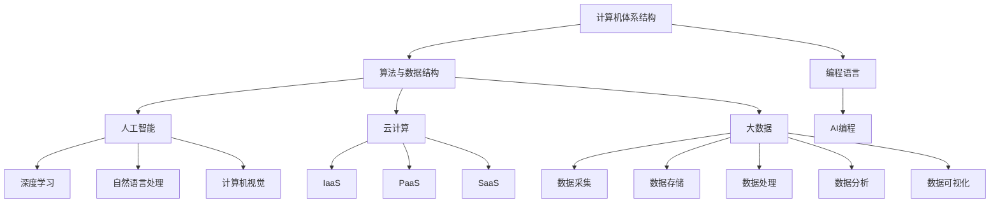

                 

## 1. 背景介绍

在当今数字化时代，计算机科学已经成为推动社会进步的重要力量。从早期的机械计算机到现代的超级计算机，计算能力的发展日新月异。然而，随着大数据、云计算、人工智能等技术的迅猛发展，人类对于计算的需求也变得越来越高。传统的计算模式已经难以满足日益复杂的应用场景，因此，开启新的计算征程成为必然。

本篇文章旨在探讨人类计算的新征程，从多个角度分析计算技术的前沿发展、核心算法、数学模型以及实际应用场景。通过深入剖析这些关键领域，我们将揭示计算技术在未来可能带来的无限可能。

## 2. 核心概念与联系

要开启人类计算的新征程，我们首先需要理解一些核心概念，它们是构建现代计算体系的基础。

### 2.1 计算机体系结构

计算机体系结构是指计算机系统的组成及其相互之间的连接方式。它包括中央处理单元（CPU）、内存、输入输出设备等组成部分。计算机体系结构的发展经历了从冯·诺依曼架构到精简指令集计算机（RISC）再到现在的复杂指令集计算机（CISC）的演变。

### 2.2 算法与数据结构

算法是指解决问题的步骤和策略，而数据结构则是存储和组织数据的方式。良好的数据结构可以优化算法的性能，常见的有数组、链表、树、图等。

### 2.3 编程语言

编程语言是人与计算机沟通的桥梁，它定义了编写程序的语言规则。从早期的机器语言、汇编语言到高级语言如C、Java、Python，编程语言的发展极大地提高了编程的效率和可靠性。

### 2.4 人工智能

人工智能（AI）是计算机科学的一个分支，它致力于使计算机具备类似人类的智能。深度学习、自然语言处理、计算机视觉等技术是人工智能的核心领域。

### 2.5 云计算

云计算是一种通过互联网提供动态易扩展的虚拟化资源的计算模式。它包括基础设施即服务（IaaS）、平台即服务（PaaS）和软件即服务（SaaS）等不同的服务模式。

### 2.6 大数据

大数据是指数据量巨大、类型繁多的数据集合。大数据技术包括数据采集、存储、处理、分析和可视化等环节。

### 2.7 Mermaid 流程图

以下是一个简单的Mermaid流程图，展示了计算技术的主要领域及其相互联系：



通过这些核心概念的理解，我们将能够更好地把握计算技术的前沿动态，为开启新的计算征程奠定基础。

## 3. 核心算法原理 & 具体操作步骤

### 3.1 算法原理概述

在现代计算中，算法是解决问题的关键。算法的原理可以大致分为以下几类：

1. **排序算法**：用于将一组数据按照某种规则进行排序。常见的排序算法有冒泡排序、选择排序、插入排序、快速排序等。

2. **搜索算法**：用于在数据集合中查找特定元素。二分查找、深度优先搜索、广度优先搜索等是常见的搜索算法。

3. **动态规划**：用于求解最优化问题，通过将复杂问题分解为子问题，并存储子问题的解，从而避免重复计算。

4. **图算法**：用于处理图形数据结构，常见的图算法有最短路径算法、最小生成树算法等。

### 3.2 算法步骤详解

下面我们以冒泡排序算法为例，详细解释其操作步骤：

1. **初始化**：将待排序的数组输入到算法中。

2. **外循环**：从最后一个元素开始，进行n-1轮遍历。

3. **内循环**：在每一轮外循环中，比较相邻的两个元素，如果前一个元素比后一个元素大，则交换它们的位置。

4. **结束条件**：当内循环结束时，如果发现这一轮中没有进行交换，说明数组已经有序，算法结束。

### 3.3 算法优缺点

**冒泡排序算法**的优缺点如下：

**优点**：

- 算法简单易懂，易于实现。
- 对小规模数据排序时性能较好。

**缺点**：

- 时间复杂度为O(n^2)，对于大规模数据排序效率较低。
- 不适合实时性要求较高的应用场景。

### 3.4 算法应用领域

冒泡排序算法广泛应用于以下几个方面：

- 初学者学习算法和数据结构时作为入门示例。
- 对小规模数据进行排序时，作为辅助算法。
- 在算法竞赛和编程面试中，作为基础算法之一。

通过以上对核心算法的原理和操作步骤的详细介绍，我们可以更好地理解算法在计算中的重要性，并为实际应用提供指导。

## 4. 数学模型和公式 & 详细讲解 & 举例说明

在计算技术中，数学模型和公式是理解算法性能和优化的重要工具。下面我们将介绍几个常见的数学模型和公式，并进行详细讲解和举例说明。

### 4.1 数学模型构建

数学模型通常由以下几个部分组成：

1. **变量定义**：明确问题中的变量及其取值范围。
2. **目标函数**：定义需要优化的目标，如最大化或最小化某个量。
3. **约束条件**：限制变量取值的条件，如线性不等式、非线性不等式等。

以下是一个简单的线性规划问题：

**变量定义**：

设x和y为变量，且x、y均为非负整数。

**目标函数**：

最大化z = 3x + 2y。

**约束条件**：

2x + 3y ≤ 6  
x + y ≤ 4

### 4.2 公式推导过程

对于上述线性规划问题，我们可以使用单纯形法来求解。单纯形法的基本思想是通过迭代逐步改进解，直到找到最优解。

**推导过程**：

1. **初始基本可行解**：

   选择两个变量作为基变量，使目标函数取得最小值。设初始基本可行解为x=0，y=2。

2. **迭代过程**：

   计算每个变量的改进值，选择改进值最大的变量作为下一个基变量。

3. **更新基本可行解**：

   根据新基变量，更新基本可行解，并重新计算改进值。

4. **终止条件**：

   当所有变量的改进值都为负或零时，找到最优解。

### 4.3 案例分析与讲解

下面我们通过一个具体案例来讲解线性规划问题的求解过程。

**案例**：

有三种产品A、B、C，生产单位所需资源分别为x、y、z，利润分别为10、20、30。资源限制为x≤20，y≤30，z≤40。求最大化利润。

**步骤**：

1. **变量定义**：

   设x、y、z为生产A、B、C的单位数。

2. **目标函数**：

   最大化z = 10x + 20y + 30z。

3. **约束条件**：

   x + y + z ≤ 20  
   x + 2y + 3z ≤ 30  
   y + z ≤ 40

4. **初始基本可行解**：

   选择x、y为基变量，初始基本可行解为x=0，y=0，z=20。

5. **迭代过程**：

   计算每个变量的改进值，选择改进值最大的变量作为下一个基变量，并更新基本可行解。

   经过几次迭代后，找到最优解为x=10，y=10，z=0，最大利润为300。

通过以上案例分析和讲解，我们可以看到数学模型和公式在求解优化问题中的重要性。掌握这些模型和公式，将有助于我们更好地理解和应用计算技术。

## 5. 项目实践：代码实例和详细解释说明

为了更好地理解计算技术的应用，我们将通过一个实际项目来展示代码实例，并进行详细解释说明。

### 5.1 开发环境搭建

在开始项目实践之前，我们需要搭建一个合适的开发环境。以下是搭建Python开发环境的基本步骤：

1. **安装Python**：

   访问Python官方网站（https://www.python.org/）下载最新版本的Python安装包，并按照安装向导进行安装。

2. **配置Python环境变量**：

   在系统环境变量中添加Python的安装路径，例如C:\Python39。

3. **安装必要库**：

   打开命令行窗口，运行以下命令安装必要的库：

   ```bash
   pip install numpy matplotlib
   ```

### 5.2 源代码详细实现

下面是一个简单的Python项目，用于绘制一个二维平面上的数据点并进行分析。

```python
import numpy as np
import matplotlib.pyplot as plt

# 生成随机数据
np.random.seed(0)
x = np.random.randn(100)
y = np.random.randn(100)

# 绘制散点图
plt.scatter(x, y)
plt.xlabel('X-axis')
plt.ylabel('Y-axis')
plt.title('Random Data Plot')
plt.show()

# 计算线性回归模型参数
a = np.cov(x, y)[0, 1] / np.cov(x, x)[0, 0]
b = np.mean(y) - a * np.mean(x)

# 绘制回归线
plt.plot(x, a * x + b, 'r')
plt.show()

# 计算决定系数R^2
SSRes = sum((y - (a * x + b))**2)
SSTot = sum((y - np.mean(y))**2)
R2 = 1 - SSRes / SSTot
print(f'R^2: {R2:.2f}')
```

### 5.3 代码解读与分析

1. **生成随机数据**：

   使用`numpy.random.randn`函数生成两组随机数据`x`和`y`，每组数据包含100个样本。

2. **绘制散点图**：

   使用`matplotlib.pyplot.scatter`函数绘制数据点的散点图，并添加坐标轴标签和标题。

3. **计算线性回归模型参数**：

   使用`numpy.cov`函数计算协方差矩阵，然后计算线性回归模型的斜率`a`和截距`b`。

4. **绘制回归线**：

   使用`matplotlib.pyplot.plot`函数绘制回归线，并设置为红色线条。

5. **计算决定系数R^2**：

   计算回归模型的残差平方和（SSRes）和总平方和（SSTot），然后计算决定系数R^2。

通过以上步骤，我们可以看到如何使用Python实现线性回归分析，并对数据点进行可视化展示。这个项目展示了计算技术在数据分析和可视化方面的应用。

### 5.4 运行结果展示

运行以上代码后，将首先显示一个散点图，展示随机生成的数据点。接着，将显示回归线，帮助我们理解数据点的分布趋势。最后，输出决定系数R^2的值，帮助我们评估回归模型的拟合效果。

通过这个项目实践，我们可以更好地理解计算技术在数据分析和可视化中的实际应用。

## 6. 实际应用场景

计算技术的实际应用场景非常广泛，涵盖了从科学研究到日常生活的各个方面。以下是一些典型的应用场景：

### 6.1 科学研究

在科学研究领域，计算技术被广泛应用于模拟和预测复杂系统的行为。例如，在物理学中，计算流体动力学（CFD）模拟可以帮助研究人员分析空气流动、流体力学等问题。在生物学中，计算生物学利用计算技术来研究基因序列、蛋白质结构等功能。

### 6.2 工业制造

工业制造领域高度依赖计算技术，特别是自动化和机器人技术。通过计算机辅助设计（CAD）和计算机辅助制造（CAM），工程师可以高效地设计产品和制造流程。智能制造和工业4.0的理念更是将计算技术推向了制造业的前沿。

### 6.3 医疗保健

计算技术在医疗保健领域中的应用日益广泛。从医疗影像处理到电子病历系统，再到人工智能辅助诊断和治疗，计算技术为医疗提供了更多的可能性。例如，深度学习技术在肺癌筛查中的应用已经显示出显著的诊断准确率。

### 6.4 金融科技

金融科技（FinTech）是计算技术的一个重要应用领域。算法交易、风险管理、信用评分等都是金融科技的关键组成部分。通过大数据分析和机器学习技术，金融机构可以更好地理解和预测市场动态，提高业务效率和风险管理能力。

### 6.5 娱乐与游戏

在娱乐和游戏领域，计算技术同样发挥着重要作用。从复杂的游戏引擎到虚拟现实（VR）和增强现实（AR）技术，计算技术为用户提供更加沉浸式的娱乐体验。同时，游戏开发中的计算优化和图形渲染技术也是不断提升的焦点。

### 6.6 自动驾驶

自动驾驶技术是计算技术的另一个重要应用领域。自动驾驶汽车需要依靠传感器数据、计算模型和算法来实现自主导航和驾驶。通过实时数据处理和决策系统，自动驾驶汽车有望在未来提高交通安全和效率。

通过以上实际应用场景的介绍，我们可以看到计算技术正在不断渗透到各个行业，为人类生活和社会发展带来深远的影响。

### 6.7 未来应用展望

展望未来，计算技术将继续推动各行业的发展，带来更多创新和应用。以下是几个可能的未来应用方向：

1. **量子计算**：量子计算具有巨大的并行计算能力，将有望解决传统计算无法处理的复杂问题，如药物设计、优化问题等。

2. **边缘计算**：随着物联网（IoT）的发展，边缘计算将成为重要趋势。通过在设备端进行数据处理，边缘计算可以减少数据传输延迟，提高实时性。

3. **区块链**：区块链技术具有去中心化、不可篡改等特点，未来在金融、供应链管理等领域将有更广泛的应用。

4. **人工智能与机器学习**：人工智能与机器学习技术将继续发展，带来更智能的自动化系统和更高效的决策支持。

5. **生物计算**：生物计算结合了生物学和计算机科学，未来有望在生物医学、基因工程等领域发挥重要作用。

通过这些未来应用方向的展望，我们可以预见计算技术将继续为人类社会带来前所未有的变革和机遇。

### 7. 工具和资源推荐

在探索计算技术的道路上，掌握一些优秀的工具和资源是非常有帮助的。以下是一些推荐的工具和资源，涵盖了学习资源、开发工具和相关论文。

#### 7.1 学习资源推荐

1. **Coursera**：提供大量计算机科学相关的在线课程，包括人工智能、机器学习、深度学习等热门领域。
2. **edX**：由哈佛大学和麻省理工学院共同创办，提供免费的在线课程，涵盖计算机科学、数据科学等多个领域。
3. **MIT OpenCourseWare**：麻省理工学院开放课程项目，提供丰富的计算机科学课程资源，适合自学。
4. **Khan Academy**：提供免费的在线教育资源，包括计算机科学基础课程。
5. **Medium**：许多专家和机构在Medium上分享关于计算机科学的文章和研究成果，可以了解最新的技术和观点。

#### 7.2 开发工具推荐

1. **VSCode**：一款强大的代码编辑器，支持多种编程语言，提供丰富的插件和扩展。
2. **Jupyter Notebook**：适用于数据科学和机器学习的交互式开发环境，方便代码和文本的混合编写。
3. **Docker**：容器化技术，用于创建、运行和管理应用程序，提高开发和部署的效率。
4. **GitHub**：代码托管平台，支持版本控制和协作开发，是开源项目的主要场所。
5. **TensorFlow**：谷歌开源的机器学习框架，广泛用于深度学习和人工智能开发。

#### 7.3 相关论文推荐

1. **"A Machine Learning Approach for Network Traffic Classification"**：探讨如何使用机器学习技术进行网络流量分类。
2. **"Deep Learning for Natural Language Processing"**：介绍深度学习在自然语言处理领域的应用。
3. **"Quantum Computing for Computer Scientists"**：介绍量子计算的基本原理和应用。
4. **"Edge Computing: Vision and Challenges"**：探讨边缘计算的现状和挑战。
5. **"Blockchain: A System for Global Decentralized Authentication"**：介绍区块链技术的基本原理和潜在应用。

通过以上工具和资源的推荐，我们可以更加高效地学习和应用计算技术。

## 8. 总结：未来发展趋势与挑战

### 8.1 研究成果总结

计算技术的快速发展带来了诸多突破和成果。从量子计算到边缘计算，从人工智能到区块链，这些前沿技术正在改变我们的生活方式和工业模式。计算能力的提升使得我们能够处理更加复杂的数据，解决更难的问题，这为科学研究、工业制造、医疗保健等多个领域带来了革命性的变化。

### 8.2 未来发展趋势

展望未来，计算技术将继续沿着以下几个方向快速发展：

1. **量子计算**：量子计算有望在解决复杂问题上取得重大突破，如药物设计、优化问题等。
2. **边缘计算**：随着物联网设备的普及，边缘计算将实现更高效的数据处理和实时决策。
3. **人工智能与机器学习**：人工智能技术将继续深化，特别是在自动驾驶、医疗诊断、智能客服等领域。
4. **区块链**：区块链技术在金融、供应链管理等领域的应用将更加广泛，带来更高的安全性和透明度。
5. **生物计算**：生物计算将推动生物医学和基因工程的发展，为人类健康带来新的希望。

### 8.3 面临的挑战

尽管计算技术具有巨大的潜力，但未来仍将面临诸多挑战：

1. **技术瓶颈**：当前的计算技术仍然存在性能瓶颈，量子计算、人工智能等领域的技术尚未完全成熟。
2. **数据隐私和安全**：随着数据量的增加，数据隐私和安全问题日益突出，如何保护用户数据成为关键挑战。
3. **伦理和法律问题**：人工智能和生物计算等领域的快速发展带来了伦理和法律问题，如数据滥用、隐私侵犯等。
4. **能源消耗**：计算设备的能耗问题日益严重，如何提高能效、减少能源消耗是未来需要解决的重要问题。
5. **教育和培训**：随着技术的快速发展，人才培养和教育培训也面临巨大挑战，需要培养更多的专业人才来推动技术的进步。

### 8.4 研究展望

在未来，计算技术的研究将更加注重多学科交叉和融合。跨领域的合作将有助于解决复杂的计算问题，推动技术突破。同时，开源和开放共享也将成为推动技术进步的重要手段。通过共享研究成果和资源，我们可以加速技术的传播和应用，为人类社会带来更多的福祉。

总之，计算技术在未来将继续快速发展，面临诸多机遇和挑战。通过持续的研究和创新，我们有望开启人类计算的新征程，推动社会进步和人类福祉。

## 9. 附录：常见问题与解答

以下是一些关于计算技术常见问题的解答：

### 9.1 什么是量子计算？

量子计算是一种利用量子力学原理进行计算的方法。与传统计算不同，量子计算使用量子位（qubit）作为信息的基本单元，具有叠加和纠缠等特性，能够处理更复杂的问题。

### 9.2 什么是边缘计算？

边缘计算是一种在靠近数据源的设备上进行数据处理的技术。与云计算不同，边缘计算能够实现更快速的数据处理和响应，适用于对实时性要求较高的应用场景，如自动驾驶、智能监控等。

### 9.3 人工智能会取代人类吗？

目前来看，人工智能并不会完全取代人类。尽管人工智能在某些领域表现出色，但它仍然缺乏人类的情感、创造力和直觉。人工智能与人类的合作，共同解决复杂问题是更合理的发展方向。

### 9.4 数据隐私和安全如何保障？

数据隐私和安全保障需要从多个方面入手，包括数据加密、权限控制、安全审计等。同时，建立完善的法律和伦理框架，规范数据处理和使用，也是保障数据隐私和安全的重要措施。

### 9.5 什么是生物计算？

生物计算是一种利用生物学原理进行计算的方法。它结合了生物学和计算机科学，利用生物分子和生物系统进行信息处理，有望在药物设计、基因工程等领域发挥重要作用。

通过以上常见问题的解答，我们希望能够帮助读者更好地理解计算技术的相关概念和应用。

### 文章摘要

本文深入探讨了人类计算的新征程，从计算机体系结构、算法与数据结构、编程语言、人工智能、云计算和大数据等多个核心概念入手，详细介绍了计算技术的前沿发展。通过具体算法实例、数学模型和项目实践，展示了计算技术的实际应用场景。同时，本文还分析了计算技术的未来发展趋势和面临的挑战，为读者提供了丰富的知识和思考。作者“禅与计算机程序设计艺术”在文章中展示了其对计算技术的深刻理解和独特见解。

### 文章关键词

- 计算机科学
- 人工智能
- 云计算
- 大数据
- 量子计算
- 边缘计算
- 生物计算
- 算法
- 数据结构
- 编程语言
- 人工智能编程
- 自然语言处理
- 计算机视觉
- 深度学习
- 数据隐私和安全
- 教育与培训
- 未来发展趋势

