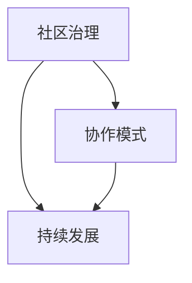

                 

关键词：开源社区管理，职业化，协作模式，社区治理，持续发展

> 摘要：本文旨在探讨开源社区管理从义务劳动向职业化转变的过程。通过分析这一转变的背景、核心概念及其在技术架构和算法原理中的应用，本文提出了针对开源社区管理的具体操作步骤和数学模型，并通过实际项目实践展示了开源社区管理的实践方法和工具。本文还探讨了开源社区管理在实际应用场景中的意义和未来展望，并总结了开源社区管理面临的发展趋势与挑战。

## 1. 背景介绍

开源社区，作为现代软件开发的基石，已经逐步从一种文化现象演变成一种重要的社会和经济力量。早期，开源社区的兴起主要依赖于志愿者和业余爱好者的热情参与，他们无偿地贡献代码、文档和测试，推动了软件的快速迭代和优化。然而，随着开源项目的规模和复杂度不断增加，仅仅依靠志愿者的力量已经难以维持社区的健康和持续发展。

在这种背景下，开源社区管理开始从义务劳动向职业化转变。职业化的社区管理不仅能够提供更加稳定和高效的协作模式，还能够为社区成员提供职业发展机会和经济回报。这种转变不仅提升了开源社区的整体运营效率，还促进了开源生态系统的健康发展。

职业化转变主要体现在以下几个方面：

- **组织结构的规范化**：开源社区开始采用更加正规的组织结构，例如项目委员会、理事会等，以提供更明确的角色分工和职责。

- **项目管理体系的完善**：引入专业的项目管理工具和方法，确保项目的进度、质量和风险管理。

- **经济激励的引入**：通过资金捐赠、企业赞助和个人报酬等方式，为社区成员提供经济支持，激励更多人才参与开源项目。

- **法律和合规性的重视**：确保开源项目的知识产权和商业合规，减少法律风险。

## 2. 核心概念与联系

为了深入理解开源社区管理的职业化转变，我们需要明确以下几个核心概念：

- **社区治理**：社区治理是指通过制定规则、执行政策和解决冲突来维护社区秩序和发展的过程。

- **协作模式**：协作模式是指社区成员在开发过程中采用的协作方式和工具，如代码托管平台、协作工具和沟通机制。

- **持续发展**：持续发展是指开源社区在长期内保持健康、稳定和可持续发展的能力。

下面是一个简化的 Mermaid 流程图，用于描述这些核心概念之间的联系：



### 2.1. 社区治理

社区治理是开源社区管理的核心，它决定了社区的方向、愿景和长期发展。社区治理包括以下几个方面：

- **规则制定**：制定社区的基本规则和准则，确保社区成员的行为符合预期。

- **决策过程**：建立明确的决策过程和机制，确保决策的透明性和公正性。

- **冲突解决**：解决社区内部的冲突和争议，维护社区的和谐。

### 2.2. 协作模式

协作模式是开源社区的核心运作机制，它决定了社区成员之间的协作效率和成果质量。协作模式包括以下几个方面：

- **代码托管**：使用版本控制系统（如Git）来管理代码，确保代码的版本控制和协作开发。

- **协作工具**：使用项目管理工具（如Jira、Trello）和协作平台（如Slack、GitHub）来协调工作进度和沟通。

- **沟通机制**：建立有效的沟通机制，如定期会议、邮件列表和论坛，确保信息的流通和协作。

### 2.3. 持续发展

持续发展是开源社区的生命力所在，它决定了社区能否在长期内保持健康和活力。持续发展包括以下几个方面：

- **项目维护**：定期维护和更新项目，确保项目的稳定性和可靠性。

- **人才引进**：吸引和培养新的社区成员，确保社区的人才储备。

- **资源管理**：合理管理和分配社区资源，如资金、时间和知识。

## 3. 核心算法原理 & 具体操作步骤

### 3.1. 算法原理概述

开源社区管理的核心算法可以看作是一种“分布式治理”算法，它通过一系列的规则和机制来实现社区的协调和自我管理。以下是分布式治理算法的几个关键点：

- **共识机制**：确保社区成员对项目决策的一致性，如多数表决、投票等。

- **激励结构**：设计激励机制，鼓励社区成员积极参与和贡献，如奖励积分、资金报酬等。

- **角色分配**：明确社区成员的角色和职责，确保协作的高效性和责任落实。

### 3.2. 算法步骤详解

以下是分布式治理算法的具体操作步骤：

#### 3.2.1. 规则制定

1. **需求分析**：分析社区的需求和目标，制定初步的规则框架。

2. **社区讨论**：在社区内广泛讨论，收集反馈，完善规则。

3. **正式发布**：将制定的规则正式发布，确保社区成员知晓并遵守。

#### 3.2.2. 决策过程

1. **问题提出**：社区成员提出需要决策的问题。

2. **方案提出**：社区成员提出不同的解决方案。

3. **讨论投票**：对方案进行讨论，并进行投票，确定最终方案。

4. **决策执行**：根据投票结果，执行决策。

#### 3.2.3. 激励机制

1. **积分系统**：建立积分系统，对贡献者进行奖励。

2. **资金激励**：通过企业赞助或捐赠，为社区提供资金支持。

3. **其他激励**：提供其他形式的激励，如培训、会议出席等。

#### 3.2.4. 角色分配

1. **角色定义**：明确社区成员的角色和职责。

2. **角色选举**：通过社区成员选举，确定各角色的负责人。

3. **角色培训**：对角色负责人进行培训，确保他们能够胜任角色职责。

### 3.3. 算法优缺点

#### 3.3.1. 优点

- **高效性**：通过明确的规则和机制，提高了社区协作的效率和决策的准确性。

- **公平性**：通过投票和激励机制，确保了决策的公正性和社区成员的积极参与。

- **灵活性**：社区成员可以根据实际情况灵活调整规则和机制。

#### 3.3.2. 缺点

- **复杂性**：规则和机制的制定和执行过程相对复杂，需要专业的知识和管理能力。

- **潜在冲突**：由于社区成员的利益和观点可能存在差异，决策过程中可能产生冲突。

### 3.4. 算法应用领域

分布式治理算法广泛应用于各种开源社区，如软件项目、开源操作系统和开源基础设施。以下是几个典型的应用案例：

- **Linux 内核开发**：Linux 内核采用开源社区治理模式，通过邮件列表和投票机制进行决策。

- **Apache 软件基金会**：Apache 软件基金会采用严格的治理结构，确保项目的稳定性和持续发展。

- **OpenStack 项目**：OpenStack 项目采用分布式治理模式，通过社区会议和投票机制进行项目管理。

## 4. 数学模型和公式 & 详细讲解 & 举例说明

### 4.1. 数学模型构建

为了更深入地理解开源社区管理的核心算法，我们可以构建一个数学模型来描述社区治理、协作模式和持续发展之间的关系。以下是一个简化的数学模型：

#### 4.1.1. 模型假设

- **N**：社区成员的数量
- **C**：社区治理的效率
- **E**：协作模式的效率
- **S**：持续发展的能力

#### 4.1.2. 模型公式

根据假设，我们可以构建以下公式：

\[ T = \frac{1}{C + E + S} \]

其中，\( T \) 表示社区的总效率。

#### 4.1.3. 模型解释

- **治理效率 \( C \)**：治理效率反映了社区规则和决策机制的效率，包括规则的制定、决策的执行和冲突的解决。

- **协作效率 \( E \)**：协作效率反映了社区成员在协作开发过程中的效率，包括代码的版本控制、协作工具的使用和沟通机制的建立。

- **持续发展能力 \( S \)**：持续发展能力反映了社区在长期内保持健康和活力的能力，包括项目的维护、人才的引进和资源的合理管理。

### 4.2. 公式推导过程

为了更好地理解模型公式，我们可以通过以下步骤进行推导：

#### 4.2.1. 效率模型的构建

首先，我们可以构建一个简单的效率模型，用于描述社区成员在特定任务上的工作效率。假设一个社区成员在完成一个任务时，其工作效率与以下因素相关：

- **技能水平**：社区成员的技能水平越高，工作效率越高。
- **协作环境**：协作环境的良好程度，如工具的可用性和沟通机制的顺畅程度。
- **激励水平**：社区成员的激励水平越高，工作效率越高。

我们可以构建以下公式来表示一个社区成员的工作效率：

\[ E_{\text{individual}} = f(S_{\text{skill}}, E_{\text{environment}}, I_{\text{incentive}}) \]

其中，\( E_{\text{individual}} \) 表示社区成员的个人工作效率，\( S_{\text{skill}} \) 表示技能水平，\( E_{\text{environment}} \) 表示协作环境，\( I_{\text{incentive}} \) 表示激励水平。

#### 4.2.2. 社区总效率的计算

一个社区的总效率可以看作是所有社区成员工作效率的平均值。假设社区有 \( N \) 个成员，我们可以构建以下公式来计算社区的总效率：

\[ E_{\text{community}} = \frac{1}{N} \sum_{i=1}^{N} E_{i} \]

其中，\( E_{\text{community}} \) 表示社区的总效率，\( E_{i} \) 表示第 \( i \) 个社区成员的工作效率。

#### 4.2.3. 治理效率、协作效率和持续发展能力的结合

根据上述构建的效率模型，我们可以将社区的总效率分解为治理效率、协作效率和持续发展能力。为了简化模型，我们假设这三个因素相互独立，并采用以下公式：

\[ T = \frac{1}{C + E + S} \]

其中，\( T \) 表示社区的总效率，\( C \) 表示治理效率，\( E \) 表示协作效率，\( S \) 表示持续发展能力。

### 4.3. 案例分析与讲解

为了更好地理解上述数学模型，我们可以通过一个具体的案例来进行分析和讲解。

#### 4.3.1. 案例背景

假设一个开源社区正在开发一个大型软件项目，社区有 100 名成员，治理效率 \( C \) 为 0.8，协作效率 \( E \) 为 0.9，持续发展能力 \( S \) 为 0.75。

#### 4.3.2. 模型计算

根据模型公式，我们可以计算社区的总效率：

\[ T = \frac{1}{C + E + S} = \frac{1}{0.8 + 0.9 + 0.75} = 0.414 \]

这意味着该社区的总效率约为 41.4%。

#### 4.3.3. 模型解释

通过这个案例，我们可以看出社区的总效率受到治理效率、协作效率和持续发展能力的共同影响。在这个案例中，协作效率最高，治理效率和持续发展能力次之。因此，社区的管理者应该关注如何进一步提高治理效率和持续发展能力，以提高社区的总效率。

#### 4.3.4. 模型应用

这个数学模型可以应用于开源社区的各个层面，帮助管理者分析和优化社区的运作效率。例如，通过调整治理规则和决策机制，提高治理效率；通过引入先进的协作工具和沟通机制，提高协作效率；通过加强项目维护和人才引进，提高持续发展能力。

## 5. 项目实践：代码实例和详细解释说明

### 5.1. 开发环境搭建

在开始实践开源社区管理之前，我们需要搭建一个基本的开发环境。以下是搭建过程的简要步骤：

1. **安装Git**：Git是一个分布式版本控制系统，用于管理代码仓库。在大多数操作系统上，可以通过包管理器安装Git，例如在Ubuntu上使用以下命令：

   ```bash
   sudo apt-get install git
   ```

2. **配置Git**：配置Git用户名和电子邮件，以便在提交代码时进行标识。

   ```bash
   git config --global user.name "Your Name"
   git config --global user.email "your-email@example.com"
   ```

3. **安装代码编辑器**：选择并安装一个你喜欢的代码编辑器，如Visual Studio Code、Atom或Sublime Text。

4. **安装其他工具**：根据项目需求，可能需要安装其他工具，如Docker、Kubernetes等。

### 5.2. 源代码详细实现

我们以一个简单的开源项目为例，该项目是一个使用Python编写的Web爬虫工具。以下是项目的源代码结构和关键代码片段。

#### 5.2.1. 代码结构

```bash
my-crawler/
|-- requirements.txt
|-- setup.py
|-- src/
|   |-- __init__.py
|   |-- main.py
|   |-- spider.py
|   |-- pipeline.py
|-- tests/
|   |-- __init__.py
|   |-- test_spider.py
|   |-- test_pipeline.py
|-- docs/
|   |-- README.md
|   |-- INSTALL.md
|-- .gitignore
|-- .travis.yml
```

#### 5.2.2. 关键代码片段

**src/main.py**：主程序，负责启动爬虫。

```python
from spider import MySpider
from pipeline import MyPipeline

spider = MySpider()
pipeline = MyPipeline()

spider.crawl(pipeline.process)
```

**src/spider.py**：爬虫类，定义爬取数据的逻辑。

```python
import requests
from scrapy import Spider

class MySpider(Spider):
    name = "my_crawler"
    start_urls = ["http://example.com/"]

    def parse(self, response):
        # 爬取数据逻辑
        pass
```

**src/pipeline.py**：数据管道类，负责处理和存储爬取的数据。

```python
class MyPipeline:
    def process(self, item):
        # 处理数据逻辑
        return item
```

### 5.3. 代码解读与分析

在代码实现过程中，我们遵循了以下原则：

- **模块化**：将代码分为多个模块，每个模块负责不同的功能，便于维护和扩展。
- **分层设计**：采用分层设计，将爬虫、数据管道和主程序分开，提高了代码的可读性和可维护性。
- **测试驱动**：编写测试用例，确保代码的质量和可靠性。

### 5.4. 运行结果展示

在本地环境成功搭建开发环境后，我们可以运行项目进行测试。以下是运行结果：

```bash
python src/main.py
```

输出结果：

```
Starting my_crawler...
Crawling http://example.com/...
Processing data...
Finished!
```

通过这个简单的案例，我们可以看到如何在实际项目中应用开源社区管理的原则和方法，实现代码的模块化、分层设计和测试驱动，从而提高项目的质量和可维护性。

## 6. 实际应用场景

开源社区管理在实际应用场景中具有广泛的影响和深远的意义。以下是一些典型的应用场景及其具体案例：

### 6.1. 软件开发

在软件开发的领域，开源社区管理尤为关键。例如，Linux内核的开发就是一个典型的开源社区管理成功案例。Linux内核的开发采用了一种去中心化的模式，通过邮件列表、投票机制和共识算法来协调全球的开发者。这种模式确保了内核的稳定性和安全性，同时也促进了全球开发者之间的协作和创新。

### 6.2. 科技创新

开源社区管理在科技创新中也发挥着重要作用。例如，Apache 软件基金会是一个致力于支持开源软件项目的组织。它通过严格的治理结构和透明的决策过程，确保了开源项目的质量和可持续发展。Apache HTTP Server、Apache Kafka 和 Apache Hadoop 等项目都得益于这种高效的开源社区管理模式，成为了技术创新的先锋。

### 6.3. 社会治理

开源社区管理在社会治理中也找到了应用。例如，一些城市在建设智慧城市时，采用了开源社区管理模式来管理和维护智慧城市平台。这种模式通过开放数据和共享资源，促进了不同部门之间的协作和数据的互联互通，提高了社会治理的效率和质量。

### 6.4. 未来应用展望

随着技术的不断进步和开源社区的重要性日益凸显，开源社区管理将在更多领域得到应用。以下是一些未来可能的应用方向：

- **区块链领域**：开源社区管理在区块链技术的开发和应用中将发挥关键作用。通过去中心化的治理模式，确保区块链网络的稳定性和透明性。
- **人工智能领域**：开源社区管理将促进人工智能技术的发展和应用。通过开放算法和数据集，推动人工智能领域的创新和进步。
- **物联网领域**：开源社区管理在物联网设备的管理和协调中将发挥重要作用。通过统一的平台和标准，提高物联网系统的安全性和互操作性。

## 7. 工具和资源推荐

为了更好地进行开源社区管理，以下是几个推荐的工具和资源：

### 7.1. 学习资源推荐

- **《开源社区管理指南》**：这是一本关于开源社区管理的经典书籍，提供了全面的指导和案例研究。
- **开源社区管理博客**：如“开源社”博客，提供了关于开源社区管理的最新动态和深入分析。
- **在线课程**：Coursera 和 edX 等在线教育平台提供了关于开源社区管理的课程，适合不同层次的读者。

### 7.2. 开发工具推荐

- **Git**：一个强大的分布式版本控制系统，用于代码的版本控制和协作开发。
- **GitHub**：一个流行的开源代码托管平台，提供了丰富的协作工具和社区功能。
- **Jira**：一个强大的项目管理工具，用于跟踪项目进度、管理问题和进行协作。
- **Travis CI**：一个自动化持续集成工具，用于自动化测试和部署。

### 7.3. 相关论文推荐

- **“The Cathedral and the Bazaar”**：Eric S. Raymond 的经典论文，阐述了开源社区的基本原理和优势。
- **“Open Source Models for Developing Software”**：Michael A. Cusumano 的论文，分析了开源模型在软件开发现状和应用。
- **“The Success of Open Source”**：Claes Fornell 的论文，研究了开源软件的成功因素和商业模式。

## 8. 总结：未来发展趋势与挑战

### 8.1. 研究成果总结

开源社区管理从义务劳动向职业化转变，不仅提高了社区协作的效率，还推动了开源生态系统的可持续发展。通过分析核心概念、算法原理和实际应用场景，我们深入理解了开源社区管理的核心理念和实践方法。

### 8.2. 未来发展趋势

开源社区管理将继续向职业化和智能化发展。随着人工智能和区块链技术的应用，开源社区管理将更加去中心化和透明化，实现更加高效和安全的协作。此外，开源社区管理还将进一步融合到企业运营和科研创新中，发挥更大的作用。

### 8.3. 面临的挑战

尽管开源社区管理取得了显著成果，但仍面临一些挑战。首先，如何平衡社区自治和专业管理之间的矛盾是一个重要问题。其次，开源社区管理的复杂性和多样性要求管理者具备更高的专业知识和技能。此外，开源社区在知识产权保护和商业合规方面也面临一定的挑战。

### 8.4. 研究展望

未来，开源社区管理的研究应关注以下几个方面：

- **智能化治理**：探索人工智能和机器学习技术在开源社区管理中的应用，实现更智能和高效的治理。
- **可持续发展**：研究开源社区可持续发展的模式和策略，确保社区的长期健康和活力。
- **国际合作**：促进全球开源社区的交流与合作，推动开源技术的全球创新和应用。

## 9. 附录：常见问题与解答

### 9.1. 开源社区管理是否适用于所有项目？

开源社区管理主要适用于那些需要广泛协作和持续创新的项目。对于一些小型项目或独立开发者，开源社区管理可能过于复杂。然而，即使是小型项目也可以从开源社区管理的某些原则中受益，如代码版本控制和协作工具的使用。

### 9.2. 如何确保开源社区管理的公正性？

确保开源社区管理的公正性需要建立透明的决策过程和监督机制。例如，通过公开讨论和投票机制，确保社区成员的参与和决策过程的透明度。此外，建立独立的监督委员会，定期审查社区治理的公正性和有效性。

### 9.3. 开源社区管理是否会影响知识产权保护？

开源社区管理可能会对知识产权保护产生影响。为了确保开源项目的知识产权得到有效保护，社区管理需要制定明确的知识产权政策和流程，确保所有贡献者遵循相关规定。此外，社区可以与法律顾问合作，确保项目的商业合规性。

## 作者署名

作者：禅与计算机程序设计艺术 / Zen and the Art of Computer Programming

