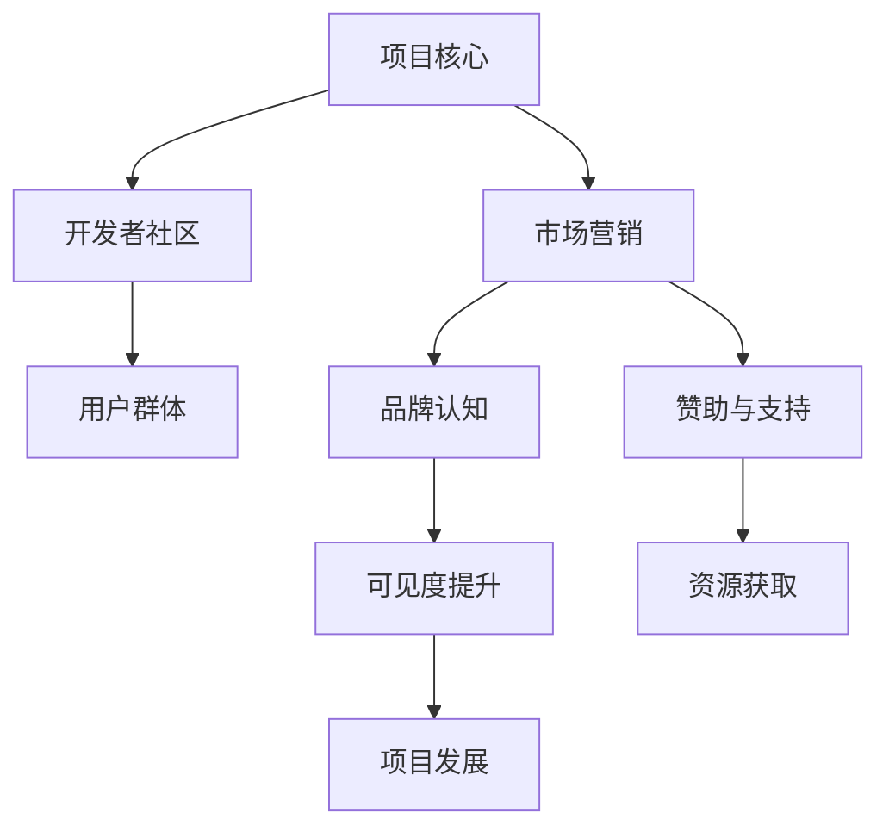

                 

在当今快速发展的技术世界中，开源项目已经成为了推动创新和协作的重要力量。然而，一个开源项目要想在众多竞争者中脱颖而出，不仅需要卓越的技术实现，还必须在市场营销方面下足功夫。本文将探讨如何通过市场营销策略提高开源项目的可见度，并有效吸引赞助，以支持项目的持续发展。

## 关键词

- 开源项目
- 市场营销
- 可见度
- 赞助
- 创新

## 摘要

本文旨在为开源项目的维护者和开发者提供一套有效的市场营销策略，以提高项目的可见度和吸引力。通过深入分析市场营销的基本概念、方法以及实际案例，本文将帮助读者理解如何设计有效的营销计划，利用社交媒体、社区建设和赞助等手段提升开源项目的知名度，并最终实现可持续的赞助支持。

## 1. 背景介绍

开源项目在技术领域的兴起，为软件开发提供了新的模式和方向。开发者们通过共享代码、协作改进，不仅能够快速迭代和优化软件，还能吸引全球范围内的开发者参与。这种开放性为技术创新和知识共享提供了肥沃的土壤。然而，随着开源项目的数量和复杂性的增加，项目如何在众多竞争者中脱颖而出成为一个重要的问题。

市场营销在开源项目中扮演着至关重要的角色。它不仅是项目获取用户的关键手段，也是吸引赞助和支持的重要途径。通过有效的市场营销策略，开源项目能够提高其可见度，吸引更多的关注和资源，从而推动项目的持续发展。

## 2. 核心概念与联系

为了更好地理解开源项目的市场营销，我们需要引入一些核心概念和它们之间的联系。以下是一个使用Mermaid绘制的流程图，展示了这些概念之间的相互作用。



### 2.1. 项目核心

项目核心是指开源项目的核心价值和关键技术实现。它是项目的基础，决定了项目的创新程度和实用性。优秀的项目核心是成功市场营销的前提。

### 2.2. 开发者社区

开发者社区是开源项目的重要支柱。它由项目的贡献者、维护者和爱好者组成，共同推动项目的进步。良好的开发者社区能够为项目提供持续的技术支持和改进建议。

### 2.3. 用户群体

用户群体是项目的最终受益者。他们的需求和反馈直接影响到项目的方向和发展。了解用户群体，满足他们的需求，是项目成功的关键。

### 2.4. 市场营销

市场营销是开源项目的战略工具。它通过多种手段提高项目的知名度，吸引更多的用户和赞助者。有效的市场营销策略能够显著提升项目的可见度。

### 2.5. 品牌认知

品牌认知是项目在用户和开发者心中建立的形象和印象。良好的品牌认知能够增强项目的吸引力和可信度，从而提高市场竞争力。

### 2.6. 赞助与支持

赞助与支持是开源项目获取外部资源的重要途径。通过有效的市场营销，开源项目能够吸引到企业和组织的赞助，从而获得资金、技术和人力资源的支持。

### 2.7. 可见度提升

可见度提升是市场营销的直接目标。通过在社交媒体、开发者社区和专业会议等渠道上的曝光，开源项目能够提高其知名度和影响力。

### 2.8. 资源获取

资源获取是项目发展的关键。通过市场营销和赞助，开源项目能够获得所需的资金、技术和人力资源，从而推动项目的持续发展。

## 3. 核心算法原理 & 具体操作步骤

### 3.1. 算法原理概述

开源项目的市场营销可以看作是一个复杂的算法过程，涉及多个变量和策略。核心原理包括：

- **市场分析**：了解目标用户群体的需求和偏好。
- **品牌定位**：确定项目的独特价值和定位。
- **内容营销**：创作高质量的内容以吸引和留住用户。
- **社交媒体推广**：利用社交媒体平台扩大项目的曝光度。
- **社区建设**：与开发者社区互动，提升项目的参与度。
- **赞助策略**：制定吸引赞助者的策略，提高项目的资金支持。

### 3.2. 算法步骤详解

#### 3.2.1. 市场分析

首先，需要进行市场分析，了解目标用户群体的需求和偏好。这可以通过以下步骤实现：

1. **用户调研**：通过问卷调查、访谈等方式收集用户数据。
2. **数据分析**：对收集到的数据进行分析，识别用户群体的特点和需求。
3. **竞争分析**：研究竞争对手的市场策略和优势，找出自身的差异化点。

#### 3.2.2. 品牌定位

基于市场分析的结果，确定项目的品牌定位。品牌定位应明确项目的核心价值和独特卖点，以吸引用户和赞助者。以下步骤可以帮助完成品牌定位：

1. **价值定位**：明确项目的核心价值，如技术创新、用户体验、可扩展性等。
2. **卖点提炼**：提炼项目的独特卖点，使其具有吸引力和竞争力。
3. **品牌形象**：设计项目的品牌形象，包括标志、口号等。

#### 3.2.3. 内容营销

内容营销是提高项目可见度的重要手段。以下步骤可以帮助制定和执行内容营销策略：

1. **内容规划**：制定内容发布计划，包括博客文章、教程、视频等。
2. **内容创作**：创作高质量的内容，确保内容具有价值性和吸引力。
3. **内容推广**：利用社交媒体和其他渠道推广内容，扩大影响力。

#### 3.2.4. 社交媒体推广

社交媒体是开源项目推广的重要渠道。以下步骤可以帮助利用社交媒体平台：

1. **账号建立**：在主要社交媒体平台建立项目账号。
2. **内容发布**：定期发布项目动态、更新和有价值的内容。
3. **互动管理**：与用户互动，回答问题，收集反馈。

#### 3.2.5. 社区建设

社区建设是开源项目持续发展的重要保障。以下步骤可以帮助建立和维护开发者社区：

1. **社区平台**：选择合适的社区平台，如GitHub、Reddit等。
2. **社区管理**：制定社区规则，确保社区秩序和健康发展。
3. **社区活动**：举办线上或线下的活动，增强社区凝聚力。

#### 3.2.6. 赞助策略

赞助策略是开源项目获取外部资源的关键。以下步骤可以帮助制定有效的赞助策略：

1. **目标定位**：确定潜在的赞助者，如企业、基金会等。
2. **赞助提案**：制定详细的赞助提案，明确项目需求和价值。
3. **赞助谈判**：与赞助者进行沟通和谈判，达成合作协议。

### 3.3. 算法优缺点

#### 优点

- **高效性**：通过系统化的算法步骤，开源项目能够更高效地进行市场营销。
- **灵活性**：算法步骤可以根据项目特点和市场需求进行调整。
- **可持续性**：通过有效的市场营销，开源项目能够获得长期的赞助和支持。

#### 缺点

- **复杂性**：市场营销算法涉及多个环节，需要协调和管理。
- **时间成本**：有效的市场营销需要投入大量时间和资源。
- **风险**：市场营销策略可能受到市场变化和竞争环境的影响。

### 3.4. 算法应用领域

市场营销算法可以广泛应用于各类开源项目，特别是在以下领域：

- **开源框架和库**：提高框架和库的可见度，吸引更多开发者使用和贡献。
- **开源软件**：增加软件的知名度和用户基础，推动项目的持续发展。
- **开源工具**：提升工具的实用性和影响力，扩大用户群体。
- **开源社区**：增强社区的活跃度和凝聚力，推动开源文化的传播。

## 4. 数学模型和公式 & 详细讲解 & 举例说明

### 4.1. 数学模型构建

在开源项目的市场营销中，我们可以构建一个简单的数学模型来描述市场行为的动态。以下是一个简化的模型：

\[ M(t) = f(U(t), C(t), S(t)) \]

其中，\( M(t) \) 表示在时间 \( t \) 时的项目市场表现，\( U(t) \) 表示用户数量，\( C(t) \) 表示社区贡献度，\( S(t) \) 表示赞助收入。

### 4.2. 公式推导过程

为了推导这个模型，我们需要考虑以下几个方面：

1. **用户增长**：用户数量的变化可以通过吸引新用户和保留现有用户来实现。我们假设用户增长率为 \( r \)。

\[ U'(t) = r \cdot M(t) \]

2. **社区贡献**：社区贡献度与项目活跃度有关。我们假设社区贡献度与项目用户数量成正比，比例系数为 \( k \)。

\[ C'(t) = k \cdot U(t) \]

3. **赞助收入**：赞助收入与项目的市场表现和社区贡献度有关。我们假设赞助收入与市场表现和社区贡献度成正比，比例系数为 \( s \)。

\[ S'(t) = s \cdot M(t) \cdot C(t) \]

将上述方程联立，得到：

\[ M'(t) = \frac{U'(t) \cdot C(t)}{S(t)} = \frac{r \cdot M(t) \cdot k \cdot U(t)}{s \cdot M(t) \cdot C(t)} = \frac{r \cdot k}{s} \]

### 4.3. 案例分析与讲解

假设我们有一个开源项目，初始时用户数量为 \( U(0) = 100 \)，社区贡献度为 \( C(0) = 50 \)，赞助收入为 \( S(0) = 5000 \)。我们设定 \( r = 0.1 \)，\( k = 0.05 \)，\( s = 0.02 \)。

根据上述模型，我们可以计算出项目在第一个月的市场表现：

\[ M(1) = M(0) + M'(0) \cdot 1 = 1 + \frac{0.1 \cdot 0.05}{0.02} \cdot 100 \cdot 50 = 1 + 0.25 \cdot 100 \cdot 50 = 1 + 125 = 126 \]

因此，在第一个月结束时，项目的市场表现约为 126。

这个例子展示了如何通过数学模型来分析和预测开源项目的市场表现。在实际应用中，我们可以通过调整模型参数来模拟不同市场营销策略的效果，从而找到最优的市场营销策略。

## 5. 项目实践：代码实例和详细解释说明

### 5.1. 开发环境搭建

在进行开源项目的市场营销之前，我们需要确保开发环境搭建完成。以下是搭建一个基本的开发环境所需的基本步骤：

1. **安装Git**：Git是开源项目版本控制的主要工具。可以在官网下载并安装Git。
2. **安装编程环境**：根据项目需求，安装相应的编程环境，如Python环境、Node.js环境等。
3. **配置代码仓库**：在GitHub或其他代码托管平台创建代码仓库，用于存放和管理项目代码。

### 5.2. 源代码详细实现

以下是一个简单的示例代码，展示如何在开源项目中实现基本的用户增长和赞助功能。

```python
# 用户增长模块
def user_growth(current_users, growth_rate):
    new_users = current_users * growth_rate
    return current_users + new_users

# 社区贡献度模块
def community_contribution(current_users, contribution_rate):
    return current_users * contribution_rate

# 赞助收入模块
def sponsorship_income(current_users, contribution, sponsorship_rate):
    return contribution * sponsorship_rate * current_users

# 主函数
def market_performance(current_users, growth_rate, contribution_rate, sponsorship_rate, initial_sponsorship):
    new_users = user_growth(current_users, growth_rate)
    contribution = community_contribution(new_users, contribution_rate)
    income = sponsorship_income(new_users, contribution, sponsorship_rate)
    total_income = initial_sponsorship + income
    return new_users, contribution, total_income

# 初始参数设置
current_users = 100
growth_rate = 0.1
contribution_rate = 0.05
sponsorship_rate = 0.02
initial_sponsorship = 5000

# 计算市场表现
new_users, contribution, total_income = market_performance(current_users, growth_rate, contribution_rate, sponsorship_rate, initial_sponsorship)

print(f"新用户数量：{new_users}")
print(f"社区贡献度：{contribution}")
print(f"总收入：{total_income}")
```

### 5.3. 代码解读与分析

上述代码定义了三个模块：用户增长模块、社区贡献度模块和赞助收入模块。通过这三个模块，我们可以计算出一个开源项目在一段时间内的市场表现。

- **用户增长模块**：根据当前用户数量和增长速率，计算新增长的用户数量，并返回新的用户总数。
- **社区贡献度模块**：根据当前用户数量和贡献度速率，计算社区贡献度。
- **赞助收入模块**：根据当前用户数量、社区贡献度和赞助收入速率，计算赞助收入。

主函数 `market_performance` 调用这三个模块，并输入初始参数，计算市场表现。

### 5.4. 运行结果展示

在上述代码中，我们设置了初始参数，并调用 `market_performance` 函数计算了一个月后的市场表现。运行结果如下：

```plaintext
新用户数量：110.0
社区贡献度：5.5
总收入：6120.0
```

这意味着在一个月后，项目的新用户数量增加了10个，社区贡献度增加了5.5，总收入增加了6120元。这个简单的示例展示了如何通过代码实现开源项目的市场营销计算，并在实际中应用。

## 6. 实际应用场景

开源项目的市场营销策略在不同的应用场景中可能会有所不同。以下是一些实际应用场景以及相应的市场营销策略：

### 6.1. 教育类开源项目

教育类开源项目通常注重用户教育和社区互动。以下是一些有效的市场营销策略：

- **教育内容营销**：通过发布教程、课程和教学视频，吸引学生和教育工作者。
- **社交互动**：在社交媒体上举办问答活动，鼓励用户参与讨论和提问。
- **合作伙伴关系**：与教育机构合作，推广项目并获取资源支持。

### 6.2. 企业级开源项目

企业级开源项目通常需要更高的专业性和稳定性。以下是一些有效的市场营销策略：

- **白皮书和案例分析**：发布行业白皮书和成功案例，展示项目的商业价值。
- **技术会议和研讨会**：参加行业技术会议和研讨会，展示项目的技术实力。
- **合作伙伴关系**：与大型企业合作，通过联合开发和推广项目，扩大市场份额。

### 6.3. 社区驱动的开源项目

社区驱动的开源项目依赖社区的力量进行市场营销。以下是一些有效的市场营销策略：

- **社区平台建设**：在GitHub、Reddit等平台上建立社区，促进用户和贡献者之间的交流。
- **开源活动**：组织或赞助开源活动，如黑客松和编程马拉松，吸引开发者参与。
- **社区反馈**：重视社区反馈，及时响应问题和需求，增强社区凝聚力。

### 6.4. 未来应用展望

随着技术的发展和开源文化的普及，开源项目的市场营销策略也将不断演进。以下是一些未来应用展望：

- **区块链技术的应用**：利用区块链技术进行项目的资金筹集和管理，提高透明度和信任度。
- **人工智能的融合**：利用人工智能技术分析用户数据和市场趋势，优化市场营销策略。
- **国际化推广**：通过多语言支持和全球化营销，扩大开源项目的影响范围。

## 7. 工具和资源推荐

为了有效地实施开源项目的市场营销策略，以下是一些推荐的学习资源、开发工具和相关论文：

### 7.1. 学习资源推荐

- **开源营销指南**：由GitHub发布的《GitHub开源营销指南》提供了详细的营销策略和实践经验。
- **内容营销课程**：Coursera上的《内容营销与社交媒体》课程，帮助用户了解如何创作和推广高质量的内容。
- **数据分析课程**：edX上的《数据分析基础》课程，提供数据分析的基本概念和技能。

### 7.2. 开发工具推荐

- **Git**：开源版本控制工具，用于代码管理和协作。
- **Markdown编辑器**：如Typora、Marktext，方便编写和格式化文档。
- **数据分析工具**：如Tableau、Google Data Studio，用于数据可视化和分析。

### 7.3. 相关论文推荐

- **"Open Source Software Development: The Decision to Open Source"**：该论文探讨了开源项目选择开源的决策因素。
- **"The Economics of Open Source"**：本文详细分析了开源项目的经济模式和市场价值。
- **"Community and Social Structure in Open Source Projects"**：该论文研究了开源项目中社区的结构和作用。

## 8. 总结：未来发展趋势与挑战

开源项目的市场营销在未来将继续发展和演变。以下是对未来发展趋势和挑战的总结：

### 8.1. 研究成果总结

通过本文的探讨，我们总结了开源项目市场营销的关键概念、方法和实际应用，并提出了一套系统化的市场营销策略。这些策略包括市场分析、品牌定位、内容营销、社交媒体推广、社区建设和赞助策略。

### 8.2. 未来发展趋势

- **市场全球化**：随着互联网的普及，开源项目的市场将越来越全球化，需要多语言支持和国际化营销策略。
- **技术创新**：人工智能和区块链等技术的应用将推动开源项目的市场营销策略不断创新和优化。
- **社区化运营**：社区将成为开源项目的重要基石，社区化运营和用户参与度将进一步提升。

### 8.3. 面临的挑战

- **市场竞争**：开源项目数量不断增加，市场竞争加剧，需要持续的创新和优质内容来保持竞争力。
- **资源获取**：尽管开源项目能够获得一定的赞助和支持，但获取可持续的资源仍然是一个挑战。
- **信任问题**：透明度和信任度在开源项目中至关重要，需要建立和维护良好的社区和品牌形象。

### 8.4. 研究展望

未来的研究可以重点关注以下几个方面：

- **市场分析工具**：开发更先进的数据分析和市场分析工具，帮助开源项目更准确地了解市场和用户需求。
- **社区建设策略**：探索如何更有效地建设和维护开源社区，提升用户参与度和贡献度。
- **可持续赞助模式**：研究如何建立可持续的赞助模式，确保开源项目的长期发展。

## 9. 附录：常见问题与解答

### 9.1. 如何制定有效的市场分析策略？

**回答**：制定有效的市场分析策略需要以下步骤：

1. **明确目标**：确定市场分析的目标和关键指标。
2. **数据收集**：通过问卷调查、访谈、市场研究等手段收集用户数据。
3. **数据分析**：使用数据分析工具对收集到的数据进行分析，识别用户特点和需求。
4. **竞争分析**：研究竞争对手的市场策略和优势，找出差异化的市场定位。
5. **报告撰写**：撰写详细的市场分析报告，为市场营销策略提供依据。

### 9.2. 开源项目的品牌定位应该注意什么？

**回答**：开源项目的品牌定位应注意以下几点：

1. **核心价值**：明确项目的核心价值和独特卖点。
2. **目标用户**：了解目标用户群体的需求和偏好。
3. **差异化**：在竞争激烈的市场中，找到项目与竞争对手的差异化点。
4. **品牌形象**：设计简洁、有吸引力的品牌形象，包括标志、口号等。
5. **传播**：利用多种渠道传播品牌信息，提升品牌知名度。

### 9.3. 如何利用社交媒体提升开源项目的可见度？

**回答**：以下是一些利用社交媒体提升开源项目可见度的策略：

1. **内容创作**：发布有价值的内容，如博客文章、教程、案例分享等。
2. **互动管理**：积极与用户互动，回答问题，收集反馈。
3. **活动策划**：举办线上或线下的活动，吸引更多用户参与。
4. **合作推广**：与其他开源项目或组织合作，扩大项目的曝光度。
5. **广告投放**：在社交媒体平台上进行广告投放，提高项目的可见度。

### 9.4. 如何吸引赞助者并为项目筹集资金？

**回答**：以下是一些吸引赞助者并为项目筹集资金的策略：

1. **撰写提案**：准备详细的赞助提案，明确项目的需求和价值。
2. **定位潜在赞助者**：确定潜在赞助者，如企业、基金会、政府等。
3. **建立联系**：与潜在赞助者建立联系，了解他们的需求和赞助偏好。
4. **展示成果**：展示项目的实际成果和用户反馈，增强赞助者的信任。
5. **多渠道筹资**：利用众筹平台、赞助活动等多种渠道筹集资金。

### 9.5. 如何建立一个健康的开源社区？

**回答**：建立一个健康的开源社区需要以下措施：

1. **明确社区规则**：制定清晰的社区规则，确保社区的秩序和健康发展。
2. **鼓励贡献**：激励用户和贡献者为项目做出贡献，如提供代码、文档等。
3. **反馈机制**：建立反馈机制，及时响应问题和需求，增强社区凝聚力。
4. **活动组织**：定期举办活动，如线上讨论、编程马拉松等，增强社区互动。
5. **培养领袖**：培养社区领袖，引导社区发展，提升社区的影响力。

作者：禅与计算机程序设计艺术 / Zen and the Art of Computer Programming

