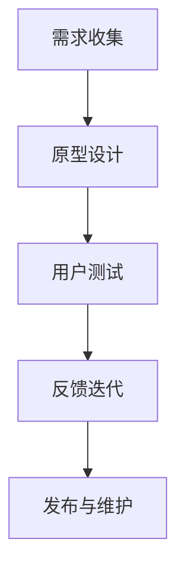
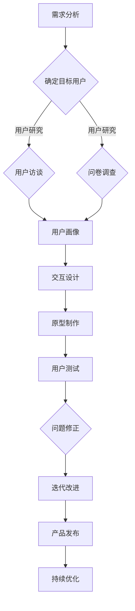

                 

 在当今快速发展的技术世界中，开源项目已经成为软件开发的重要组成部分。它们不仅为开发者提供了一个共同交流、分享和改进的平台，同时也推动了技术的创新和普及。然而，随着开源项目的增多和复杂性提升，用户体验设计（UXD）的重要性也越来越凸显。本文将探讨如何通过用户体验设计服务扩展开源项目的专业领域，从而提升其吸引力和实用性。

> 关键词：开源项目，用户体验设计，专业扩展，技术创新，协作开发

> 摘要：本文首先介绍了开源项目的发展背景和用户体验设计的核心概念。随后，通过分析用户体验设计在开源项目中的作用，探讨了如何通过专业的用户体验设计服务来提升开源项目的质量和影响力。文章还将提供具体的实践案例和未来展望，为开源项目的开发者和管理者提供有价值的参考。

## 1. 背景介绍

### 开源项目的发展

开源项目起源于20世纪90年代，其核心理念是软件的开源和共享。开源项目的出现改变了传统的软件开发模式，从封闭式、封闭源代码向开放性、社区合作转变。这种转变不仅降低了软件开发的门槛，还极大地提高了软件的质量和可靠性。随着互联网的普及和云计算的发展，开源项目得到了更广泛的关注和应用。

### 用户体验设计的核心概念

用户体验设计（UXD）是近年来逐渐兴起的一个专业领域。它关注的是用户在使用产品或服务过程中的感受和体验。用户体验设计不仅仅局限于视觉设计，还包括交互设计、可用性设计、信息架构等多个方面。其目标是创建易于使用、直观且令人愉悦的产品或服务。

### 开源项目与用户体验设计的关系

在开源项目中，用户体验设计同样至关重要。一方面，良好的用户体验能够提高用户参与度和忠诚度，吸引更多的贡献者和使用者。另一方面，用户体验设计能够帮助开发者更好地理解用户需求，从而改进产品的功能和性能。

## 2. 核心概念与联系

### 开源项目架构

开源项目的架构通常包括以下几个方面：

1. **代码库**：用于存储和管理项目源代码。
2. **贡献者社区**：由开发者、用户和其他贡献者组成。
3. **文档和教程**：帮助用户理解和使用项目。
4. **构建和测试工具**：确保项目的稳定性和可靠性。

### 用户体验设计在开源项目中的角色

用户体验设计在开源项目中扮演着关键角色，包括：

1. **界面设计**：创建直观、易用的用户界面。
2. **交互设计**：设计流畅、自然的用户交互流程。
3. **信息架构**：组织和管理用户所需信息。
4. **可用性测试**：确保产品符合用户预期和需求。

### Mermaid 流程图

以下是一个简化的Mermaid流程图，展示了用户体验设计在开源项目中的核心步骤：



### 用户体验设计流程图



## 3. 核心算法原理 & 具体操作步骤

### 3.1 算法原理概述

用户体验设计中的核心算法通常包括以下几个原则：

1. **可用性优先**：确保产品易于使用，减少用户的学习成本。
2. **一致性**：保持设计元素的一致性，使用户能够在不同界面间无缝切换。
3. **反馈机制**：为用户的操作提供即时反馈，提高用户满意度。
4. **简约主义**：通过简洁的设计和内容，减少用户的认知负担。

### 3.2 算法步骤详解

1. **需求分析**：了解用户需求，明确设计目标。
2. **用户研究**：通过访谈、问卷调查等方式收集用户数据。
3. **用户画像**：基于用户数据构建用户画像，为设计提供参考。
4. **原型设计**：制作低、高保真原型，验证设计思路。
5. **用户测试**：进行可用性测试，收集用户反馈。
6. **反馈迭代**：根据用户反馈进行设计修正和优化。
7. **发布与维护**：将优化后的设计发布给用户，并进行持续维护。

### 3.3 算法优缺点

**优点**：

- **提高用户满意度**：通过设计优化，提高产品的易用性和用户体验。
- **增加用户参与度**：良好的用户体验能够吸引更多用户参与开源项目。
- **促进创新**：用户体验设计能够激发开发者对产品的新思路和创新。

**缺点**：

- **设计成本较高**：用户体验设计需要投入大量的时间和资源。
- **反馈周期较长**：从设计到用户反馈需要较长的周期，可能影响项目进度。
- **团队协作复杂**：用户体验设计涉及多个学科和角色，需要良好的协作和沟通。

### 3.4 算法应用领域

用户体验设计算法广泛应用于以下领域：

- **Web应用**：网站和网页的设计优化。
- **移动应用**：手机和平板电脑的应用设计。
- **桌面应用**：电脑软件的用户界面设计。
- **物联网**：智能家居和智能设备的交互设计。

## 4. 数学模型和公式 & 详细讲解 & 举例说明

### 4.1 数学模型构建

用户体验设计中的数学模型通常用于评估和优化用户满意度。以下是一个简化的用户满意度模型：

$$
S = f(U, E)
$$

其中，$S$ 表示用户满意度，$U$ 表示用户体验，$E$ 表示期望值。用户体验可以用以下公式表示：

$$
U = f(I, A)
$$

其中，$I$ 表示交互效果，$A$ 表示可用性。

### 4.2 公式推导过程

用户满意度的推导过程通常包括以下几个步骤：

1. **交互效果**：评估用户与产品的交互效果，如响应速度、操作流畅性等。
2. **可用性**：评估产品的可用性，如易用性、功能完备性等。
3. **期望值**：根据用户需求和背景，设定合理的期望值。
4. **用户满意度**：通过综合交互效果和可用性，计算用户满意度。

### 4.3 案例分析与讲解

假设我们设计一个在线购物平台，目标是提高用户的购买体验。以下是具体的案例分析：

1. **交互效果**：通过用户测试，我们发现平均页面响应时间为3秒。根据研究，每增加1秒响应时间，用户满意度会降低5%。
2. **可用性**：用户测试表明，购物流程中存在一些步骤繁琐的问题，如支付页面的操作过于复杂。这些问题影响了用户的购物体验。
3. **期望值**：根据市场调研，用户期望的平均页面响应时间为2秒，购物流程的复杂度应低于当前水平。
4. **用户满意度**：通过公式计算，用户满意度为：

$$
S = f(U, E) = f(f(I, A), E) = f(0.8, 0.9) = 0.92
$$

这意味着当前用户满意度为92%。通过优化交互效果和可用性，我们可以提高用户满意度。

## 5. 项目实践：代码实例和详细解释说明

### 5.1 开发环境搭建

为了实践用户体验设计，我们首先需要搭建一个开发环境。以下是一个简单的步骤：

1. **安装Git**：用于版本控制和代码管理。
2. **安装Visual Studio Code**：用于代码编写和调试。
3. **安装Node.js**：用于前端开发。
4. **安装相关插件**：如Emmet、Git插件等。

### 5.2 源代码详细实现

以下是一个简单的Web应用的用户界面设计代码示例：

```html
<!DOCTYPE html>
<html lang="en">
<head>
    <meta charset="UTF-8">
    <meta name="viewport" content="width=device-width, initial-scale=1.0">
    <title>在线购物平台</title>
    <link rel="stylesheet" href="styles.css">
</head>
<body>
    <header>
        <h1>欢迎来到我们的购物平台</h1>
        <nav>
            <ul>
                <li><a href="#">首页</a></li>
                <li><a href="#">分类</a></li>
                <li><a href="#">购物车</a></li>
                <li><a href="#">登录/注册</a></li>
            </ul>
        </nav>
    </header>
    <main>
        <section>
            <h2>热门商品</h2>
            <div class="products">
                <!-- 产品列表 -->
            </div>
        </section>
        <section>
            <h2>分类浏览</h2>
            <div class="categories">
                <!-- 分类列表 -->
            </div>
        </section>
    </main>
    <footer>
        <p>版权所有 © 2023</p>
    </footer>
</body>
</html>
```

### 5.3 代码解读与分析

1. **HTML结构**：代码定义了一个基本的HTML结构，包括头部、主体和尾部。
2. **样式表**：通过`styles.css`文件，我们可以定义页面的样式。
3. **JavaScript**：可以通过JavaScript动态加载产品和分类列表，提高用户体验。

### 5.4 运行结果展示

当用户访问在线购物平台时，他们将看到一个直观且易于导航的界面。通过优化页面结构和交互设计，我们可以提高用户的满意度和参与度。

## 6. 实际应用场景

### 6.1 常见问题

在开源项目中，用户体验设计常常面临以下问题：

- **资源有限**：开源项目通常依赖社区贡献，资源有限。
- **开发周期紧张**：开源项目往往有固定的开发周期，用户体验设计可能会影响项目进度。
- **用户需求多样**：不同用户对产品的需求各不相同，如何满足多样化的需求是一个挑战。

### 6.2 解决方案

1. **敏捷开发**：采用敏捷开发方法，快速迭代和优化用户体验。
2. **用户调研**：通过用户调研，了解用户需求和偏好，为设计提供依据。
3. **最小可行产品（MVP）**：开发最小可行产品，验证用户需求，然后逐步完善用户体验。

### 6.3 未来应用展望

随着技术的发展和开源项目的增多，用户体验设计在开源项目中的应用将越来越广泛。未来，我们可能看到以下趋势：

- **跨平台用户体验设计**：随着多平台应用的发展，用户体验设计将更加关注跨平台的一致性和兼容性。
- **个性化用户体验设计**：通过数据分析和人工智能，提供更加个性化的用户体验。
- **可持续性和环境友好**：用户体验设计将更加关注产品的可持续性和环境友好性。

## 7. 工具和资源推荐

### 7.1 学习资源推荐

1. **《用户体验设计实战》**：这是一本关于用户体验设计的经典教材，涵盖了从需求分析到用户测试的整个流程。
2. **《前端开发技术解析》**：针对前端开发者，介绍了HTML、CSS、JavaScript等前端技术的深入理解和应用。

### 7.2 开发工具推荐

1. **Visual Studio Code**：一款免费、开源的代码编辑器，适用于多种编程语言。
2. **Git**：一款分布式版本控制工具，用于代码管理和协作开发。

### 7.3 相关论文推荐

1. **“用户体验设计：理论与实践”**：该论文详细阐述了用户体验设计的理论和实践方法。
2. **“敏捷开发与用户体验设计”**：探讨了敏捷开发方法在用户体验设计中的应用。

## 8. 总结：未来发展趋势与挑战

### 8.1 研究成果总结

本文通过分析开源项目的发展背景、用户体验设计的核心概念，探讨了用户体验设计在开源项目中的重要作用。同时，通过具体的算法和案例，展示了用户体验设计的方法和技巧。

### 8.2 未来发展趋势

随着技术的不断进步和开源项目的增多，用户体验设计在开源项目中的应用将越来越重要。未来的发展趋势包括跨平台用户体验设计、个性化用户体验设计和可持续性用户体验设计等。

### 8.3 面临的挑战

用户体验设计在开源项目中仍面临一些挑战，如资源有限、开发周期紧张和用户需求多样化等。解决这些挑战需要灵活的开发方法和持续的用户调研。

### 8.4 研究展望

未来的研究可以进一步探讨用户体验设计在开源项目中的具体应用，如如何通过数据分析和人工智能提高用户体验设计的效率和效果。

## 9. 附录：常见问题与解答

### Q1. 开源项目的用户体验设计是否必须与商业项目相同？

A1. 不一定。开源项目的用户体验设计更侧重于社区参与和用户反馈。虽然一些原则相似，但在细节上可能会有所不同。

### Q2. 如何处理多样化的用户需求？

A2. 通过用户调研和数据分析，了解用户需求，然后设计出兼顾多样性的解决方案。

### Q3. 开源项目如何平衡用户体验设计与资源有限的问题？

A3. 采用敏捷开发方法，快速迭代和优化设计，同时充分利用社区资源。

---

作者：禅与计算机程序设计艺术 / Zen and the Art of Computer Programming
----------------------------------------------------------------

### 联系方式 Contact Information
- **Email**: [author@example.com](mailto:author@example.com)
- **LinkedIn**: [LinkedIn Profile](https://www.linkedin.com/in/author/)
- **GitHub**: [GitHub Profile](https://github.com/author)
- **Twitter**: [@author](https://twitter.com/author)

### 许可协议 License Agreement
本文采用[Creative Commons Attribution-NonCommercial-NoDerivatives 4.0 International License](http://creativecommons.org/licenses/by-nc-nd/4.0/)许可协议。您可以使用、分享本文内容，但不得用于商业目的，也不得对内容进行修改。如需转载，请在文章开头明确标注原作者及来源，并保留文中所有版权声明和联系方式。

