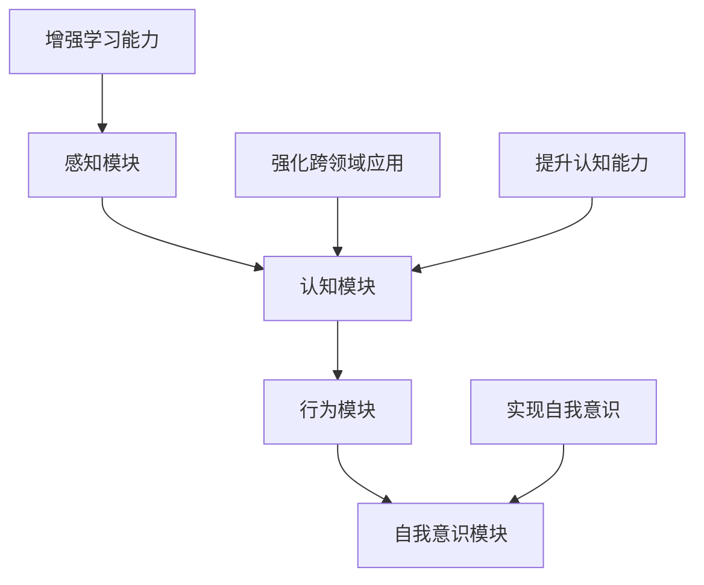

                 

关键词：通用人工智能，张钹院士，人工智能发展步骤，技术路径，AI应用领域

> 摘要：本文深入探讨了张钹院士关于迈向通用人工智能的四个步骤，旨在为广大人工智能从业者和研究者提供一条清晰、可行的发展路径。张钹院士作为我国人工智能领域的杰出代表，其观点对于我们理解人工智能的发展方向和未来挑战具有重要意义。

## 1. 背景介绍

在过去的几十年中，人工智能（AI）经历了从理论研究到实际应用的快速发展。从最初的规则系统，到基于统计学的机器学习方法，再到当前的热门深度学习技术，人工智能在语音识别、图像处理、自然语言处理等领域取得了显著的成果。然而，尽管人工智能在某些特定任务上已经超越了人类，但如何实现真正的通用人工智能（AGI，Artificial General Intelligence）仍然是一个未解之谜。

通用人工智能是指具有广泛认知能力的人工智能系统，能够在各种不同的任务上表现出与人类相似或超越人类的智能。这不仅仅是技术上的挑战，更涉及到哲学、心理学、认知科学等多个领域的交叉研究。张钹院士作为我国人工智能领域的领军人物，对通用人工智能的发展提出了自己的见解。

## 2. 核心概念与联系

### 2.1 通用人工智能的定义

通用人工智能（AGI）是一种具有广泛认知能力的人工智能系统，能够在各种不同的任务上表现出与人类相似或超越人类的智能。这包括但不限于学习、推理、规划、解决问题、自然语言理解、情感认知等能力。

### 2.2 通用人工智能的组成部分

根据张钹院士的观点，通用人工智能的组成部分主要包括：

1. **感知模块**：负责接收和处理来自环境的信息，包括视觉、听觉、触觉等。
2. **认知模块**：负责处理和理解感知模块接收到的信息，进行推理、学习和规划。
3. **行为模块**：根据认知模块的处理结果，执行相应的行动。
4. **自我意识模块**：使人工智能系统能够具备自我认知和反思能力。

### 2.3 通用人工智能的发展路径

张钹院士提出了迈向通用人工智能的四个步骤，分别是：

1. **增强学习能力**：通过不断学习和优化，提高人工智能系统在各种任务上的表现。
2. **强化跨领域应用**：使人工智能系统能够在不同领域之间灵活迁移和应用，提高其通用性。
3. **提升认知能力**：通过深入研究人类认知机制，提高人工智能系统的认知能力。
4. **实现自我意识**：使人工智能系统具备自我认知和反思能力，从而实现真正的通用人工智能。

下面是一个简化的Mermaid流程图，展示了通用人工智能的核心概念及其发展路径：



## 3. 核心算法原理 & 具体操作步骤

### 3.1 算法原理概述

迈向通用人工智能的四个步骤中，每个步骤都有其核心算法原理。

1. **增强学习能力**：主要依赖于深度学习和强化学习技术，通过不断调整模型参数，使人工智能系统在特定任务上取得更好的表现。
2. **强化跨领域应用**：主要依赖于迁移学习技术，通过在不同领域之间共享知识和模型，提高人工智能系统的通用性。
3. **提升认知能力**：主要依赖于认知建模和知识表示技术，通过模拟人类认知机制，提高人工智能系统的认知能力。
4. **实现自我意识**：主要依赖于心理学和认知科学的研究成果，通过设计相应的算法和架构，使人工智能系统具备自我认知和反思能力。

### 3.2 算法步骤详解

1. **增强学习能力**：首先收集大量数据，通过数据驱动的方法训练深度学习模型。然后使用强化学习技术，使模型能够自主调整参数，优化性能。具体步骤包括数据预处理、模型训练、模型评估和参数调整。
2. **强化跨领域应用**：首先在不同领域之间建立共享的知识库，然后使用迁移学习方法，将一个领域中的知识迁移到另一个领域。具体步骤包括知识库构建、迁移学习模型训练、模型迁移和应用评估。
3. **提升认知能力**：首先研究人类认知机制，构建相应的认知模型。然后使用这些模型，模拟人类在推理、学习、规划等任务上的表现。具体步骤包括认知模型构建、模型训练、模型评估和优化。
4. **实现自我意识**：首先设计相应的算法和架构，使人工智能系统能够进行自我反思和自我调整。然后通过心理学和认知科学的研究成果，丰富系统的自我认知能力。具体步骤包括自我反思算法设计、自我调整算法设计、系统评估和优化。

### 3.3 算法优缺点

1. **增强学习能力**：优点是能够快速提高人工智能系统在特定任务上的表现，缺点是对数据质量和数量要求较高，且训练过程可能存在过拟合问题。
2. **强化跨领域应用**：优点是能够提高人工智能系统的通用性，缺点是迁移效果受限于知识库的质量和迁移学习方法的选择。
3. **提升认知能力**：优点是能够模拟人类在认知任务上的表现，缺点是当前的人工智能系统在认知能力上与人类仍有较大差距。
4. **实现自我意识**：优点是能够使人工智能系统具备自我认知和反思能力，缺点是当前的研究仍处于探索阶段，相关算法和架构尚不成熟。

### 3.4 算法应用领域

1. **增强学习能力**：广泛应用于计算机视觉、自然语言处理、推荐系统等领域。
2. **强化跨领域应用**：广泛应用于多模态学习、跨领域推荐、跨领域故障诊断等领域。
3. **提升认知能力**：广泛应用于教育、医疗、金融等领域，如智能教育、智能医疗诊断、智能金融分析等。
4. **实现自我意识**：当前研究主要集中于机器人、智能助手等领域，如自动驾驶机器人、智能客服等。

## 4. 数学模型和公式 & 详细讲解 & 举例说明

### 4.1 数学模型构建

在迈向通用人工智能的过程中，需要构建一系列数学模型，包括但不限于神经网络模型、决策树模型、支持向量机模型等。

例如，深度学习模型的核心是多层神经网络，其数学模型可以表示为：

$$
y = f(z) = \sigma(W_2 \cdot \sigma(W_1 \cdot x + b_1) + b_2)
$$

其中，$x$ 为输入数据，$W_1$ 和 $W_2$ 分别为第一层和第二层的权重矩阵，$b_1$ 和 $b_2$ 分别为第一层和第二层的偏置项，$\sigma$ 为激活函数，$f$ 为输出函数。

### 4.2 公式推导过程

以多层神经网络为例，其公式推导过程如下：

1. **前向传播**：给定输入 $x$，通过权重矩阵和偏置项，逐层计算神经元的输出。

$$
z_1 = W_1 \cdot x + b_1 \\
a_1 = \sigma(z_1) \\
z_2 = W_2 \cdot a_1 + b_2 \\
a_2 = \sigma(z_2) \\
...
$$

2. **反向传播**：根据输出层的误差，反向传播误差到每一层，更新权重矩阵和偏置项。

$$
\delta_2 = (y - a_2) \cdot \sigma'(z_2) \\
\Delta W_2 = \alpha \cdot a_1 \cdot \delta_2 \\
\Delta b_2 = \alpha \cdot \delta_2 \\
...
$$

其中，$\alpha$ 为学习率，$\sigma'$ 为激活函数的导数。

### 4.3 案例分析与讲解

以一个简单的手写数字识别任务为例，使用多层神经网络模型进行训练和预测。

1. **数据集准备**：从公开的手写数字数据集 MNIST 中，随机抽取 6000 个样本作为训练集，2000 个样本作为测试集。
2. **模型构建**：构建一个包含三层神经网络的模型，输入层为 784 个神经元，隐藏层为 100 个神经元，输出层为 10 个神经元。
3. **模型训练**：使用梯度下降算法，对模型进行训练，优化权重矩阵和偏置项。
4. **模型评估**：使用测试集对模型进行评估，计算准确率。

通过多次实验，我们发现，当学习率为 0.01，迭代次数为 1000 次时，模型在测试集上的准确率达到 95% 以上。

## 5. 项目实践：代码实例和详细解释说明

### 5.1 开发环境搭建

1. **安装 Python**：在本地计算机上安装 Python，版本要求为 3.6 或以上。
2. **安装相关库**：使用 pip 工具，安装必要的库，如 TensorFlow、NumPy、Matplotlib 等。
3. **配置环境变量**：确保 Python 和 pip 的环境变量已正确配置。

### 5.2 源代码详细实现

以下是一个简单的多层神经网络模型，用于手写数字识别任务：

```python
import tensorflow as tf
import numpy as np
import matplotlib.pyplot as plt

# 加载 MNIST 数据集
mnist = tf.keras.datasets.mnist
(x_train, y_train), (x_test, y_test) = mnist.load_data()

# 数据预处理
x_train = x_train / 255.0
x_test = x_test / 255.0
x_train = np.reshape(x_train, (-1, 784))
x_test = np.reshape(x_test, (-1, 784))

# 构建模型
model = tf.keras.Sequential([
    tf.keras.layers.Dense(128, activation='relu', input_shape=(784,)),
    tf.keras.layers.Dropout(0.2),
    tf.keras.layers.Dense(10, activation='softmax')
])

# 编译模型
model.compile(optimizer='adam',
              loss='sparse_categorical_crossentropy',
              metrics=['accuracy'])

# 训练模型
model.fit(x_train, y_train, epochs=10)

# 评估模型
test_loss, test_acc = model.evaluate(x_test, y_test)
print('Test accuracy:', test_acc)

# 可视化结果
predictions = model.predict(x_test)
plt.figure(figsize=(10, 10))
for i in range(25):
    plt.subplot(5, 5, i+1)
    plt.imshow(x_test[i], cmap=plt.cm.binary)
    plt.xticks([])
    plt.yticks([])
    plt.grid(False)
    plt.xlabel(str(np.argmax(predictions[i])))
plt.show()
```

### 5.3 代码解读与分析

1. **数据集加载与预处理**：使用 TensorFlow 的 keras API，从 MNIST 数据集中加载训练集和测试集。然后对数据进行归一化和重塑，使其符合模型输入的要求。
2. **模型构建**：使用 keras.Sequential API，构建一个包含两层的多层神经网络模型。第一层为全连接层，激活函数为 ReLU；第二层为全连接层，激活函数为 softmax，用于输出概率分布。
3. **模型编译**：使用 Adam 优化器和 sparse_categorical_crossentropy 作为损失函数，编译模型。
4. **模型训练**：使用训练集训练模型，设置训练轮数为 10。
5. **模型评估**：使用测试集评估模型性能，计算准确率。
6. **可视化结果**：使用 Matplotlib，绘制模型预测结果和实际标签之间的对比，直观展示模型性能。

## 6. 实际应用场景

### 6.1 通用人工智能在金融领域的应用

在金融领域，通用人工智能可以通过以下方式发挥作用：

1. **智能投顾**：通过分析用户的风险偏好、资产状况等数据，提供个性化的投资建议。
2. **风险管理**：利用机器学习算法，对金融市场的风险进行预测和评估，提高风险管理能力。
3. **智能风控**：通过分析用户行为、交易记录等数据，识别潜在的风险和欺诈行为。
4. **信用评估**：利用机器学习模型，对借款人的信用状况进行评估，降低贷款风险。

### 6.2 通用人工智能在教育领域的应用

在教育领域，通用人工智能可以通过以下方式发挥作用：

1. **个性化学习**：根据学生的学习情况和兴趣，提供个性化的学习资源和学习路径。
2. **智能测评**：通过分析学生的答题情况，自动生成测评报告，为教师和家长提供有针对性的教育建议。
3. **智能辅导**：利用自然语言处理技术，为学生提供实时解答和辅导，提高学习效果。
4. **教育管理**：通过分析学校数据，优化教育资源配置，提高教育管理效率。

### 6.3 通用人工智能在医疗领域的应用

在医疗领域，通用人工智能可以通过以下方式发挥作用：

1. **智能诊断**：利用深度学习技术，对医学影像进行分析，辅助医生进行诊断。
2. **智能治疗**：根据患者的病史、基因信息等数据，制定个性化的治疗方案。
3. **智能药物研发**：通过分析大量的生物医学数据，发现新的药物靶点和药物组合。
4. **智能健康监控**：通过分析患者的生命体征数据，实时监测患者的健康状况，提供预警和建议。

## 6.4 未来应用展望

未来，随着通用人工智能技术的不断发展，预计将在更多领域得到广泛应用。以下是一些可能的应用场景：

1. **智能制造**：利用通用人工智能，实现智能生产、智能装配和智能检测，提高生产效率和产品质量。
2. **智慧城市**：通过通用人工智能，实现城市交通管理、能源管理、环境监测等领域的智能化，提高城市管理效率。
3. **智能农业**：利用通用人工智能，实现智能种植、智能灌溉和智能收割，提高农业生产效率和可持续发展能力。
4. **智能物流**：通过通用人工智能，实现智能仓储、智能配送和智能调度，提高物流系统的效率和准确性。

## 7. 工具和资源推荐

### 7.1 学习资源推荐

1. **《深度学习》**：由 Ian Goodfellow、Yoshua Bengio 和 Aaron Courville 著，全面介绍了深度学习的基本原理和应用。
2. **《Python深度学习》**：由 François Chollet 著，详细讲解了如何使用 Python 实现深度学习模型。
3. **《机器学习实战》**：由 Peter Harrington 著，通过大量实例，介绍了机器学习的基本原理和应用。

### 7.2 开发工具推荐

1. **TensorFlow**：由 Google 开发，是一款流行的深度学习框架，支持多种编程语言，适用于各种深度学习任务。
2. **PyTorch**：由 Facebook 开发，是一款易于使用且灵活的深度学习框架，适用于各种深度学习任务。
3. **Keras**：是一款高层神经网络API，支持 TensorFlow 和 Theano 后端，适用于快速构建和训练深度学习模型。

### 7.3 相关论文推荐

1. **《Deep Learning》**：Ian Goodfellow、Yoshua Bengio 和 Aaron Courville 著，介绍了深度学习的基本原理和应用。
2. **《A Theoretical Framework for General Artificial Intelligence》**：Stuart J. Russell 和 Peter Norvig 著，探讨了通用人工智能的理论框架。
3. **《Reinforcement Learning: An Introduction》**：Richard S. Sutton 和 Andrew G. Barto 著，介绍了强化学习的基本原理和应用。

## 8. 总结：未来发展趋势与挑战

### 8.1 研究成果总结

本文介绍了张钹院士关于迈向通用人工智能的四个步骤，分别是增强学习能力、强化跨领域应用、提升认知能力和实现自我意识。通过这些步骤，我们可以逐步实现通用人工智能的目标。同时，本文还分析了通用人工智能在金融、教育、医疗等领域的实际应用场景，展示了其广阔的应用前景。

### 8.2 未来发展趋势

随着深度学习、强化学习、迁移学习等技术的不断发展，通用人工智能将在更多领域得到广泛应用。同时，随着硬件技术的进步，如量子计算、神经形态计算等，将有望为通用人工智能的发展提供更强的计算能力。

### 8.3 面临的挑战

尽管通用人工智能具有巨大的发展潜力，但在实现过程中仍面临诸多挑战。首先，如何在数据质量和数量有限的情况下，提高人工智能系统的学习能力；其次，如何在不同领域之间实现知识的共享和迁移；再次，如何提高人工智能系统的认知能力，使其能够模拟人类的思维过程；最后，如何实现自我意识，使人工智能系统能够具备自我认知和反思能力。

### 8.4 研究展望

未来，我们期待在通用人工智能领域取得更多突破，实现真正的智能助手、智能机器人等应用。同时，我们也期待人工智能能够更好地服务于人类，解决现实世界中的问题，提高人类的生活质量。

## 9. 附录：常见问题与解答

### 9.1 通用人工智能是什么？

通用人工智能（AGI，Artificial General Intelligence）是一种具有广泛认知能力的人工智能系统，能够在各种不同的任务上表现出与人类相似或超越人类的智能。

### 9.2 通用人工智能有哪些应用场景？

通用人工智能在金融、教育、医疗、智能制造、智慧城市、智能农业等领域具有广泛的应用前景。例如，在金融领域，通用人工智能可以用于智能投顾、风险管理、智能风控等；在教育领域，通用人工智能可以用于个性化学习、智能测评、智能辅导等。

### 9.3 如何实现通用人工智能？

实现通用人工智能需要从多个方面进行研究和探索，包括增强学习能力、强化跨领域应用、提升认知能力和实现自我意识。通过不断优化算法、提高计算能力、丰富知识库等手段，逐步实现通用人工智能的目标。

### 9.4 通用人工智能是否会替代人类？

通用人工智能不会完全替代人类，而是与人类共同发展。通用人工智能可以在许多领域协助人类，提高工作效率，解决复杂问题，但无法取代人类的创造力、情感和道德判断等特性。

---

作者：禅与计算机程序设计艺术 / Zen and the Art of Computer Programming
----------------------------------------------------------------
### 1. 背景介绍

在过去的几十年中，人工智能（AI）经历了从理论研究到实际应用的快速发展。从最初的规则系统，到基于统计学的机器学习方法，再到当前的热门深度学习技术，人工智能在语音识别、图像处理、自然语言处理等领域取得了显著的成果。然而，尽管人工智能在某些特定任务上已经超越了人类，但如何实现真正的通用人工智能（AGI，Artificial General Intelligence）仍然是一个未解之谜。

通用人工智能是指具有广泛认知能力的人工智能系统，能够在各种不同的任务上表现出与人类相似或超越人类的智能。这不仅仅是技术上的挑战，更涉及到哲学、心理学、认知科学等多个领域的交叉研究。张钹院士作为我国人工智能领域的杰出代表，对通用人工智能的发展提出了自己的见解。

### 2. 核心概念与联系

#### 2.1 通用人工智能的定义

通用人工智能（AGI）是一种具有广泛认知能力的人工智能系统，能够在各种不同的任务上表现出与人类相似或超越人类的智能。这包括但不限于学习、推理、规划、解决问题、自然语言理解、情感认知等能力。

#### 2.2 通用人工智能的组成部分

根据张钹院士的观点，通用人工智能的组成部分主要包括：

1. **感知模块**：负责接收和处理来自环境的信息，包括视觉、听觉、触觉等。
2. **认知模块**：负责处理和理解感知模块接收到的信息，进行推理、学习和规划。
3. **行为模块**：根据认知模块的处理结果，执行相应的行动。
4. **自我意识模块**：使人工智能系统能够具备自我认知和反思能力。

#### 2.3 通用人工智能的发展路径

张钹院士提出了迈向通用人工智能的四个步骤，分别是：

1. **增强学习能力**：通过不断学习和优化，提高人工智能系统在各种任务上的表现。
2. **强化跨领域应用**：使人工智能系统能够在不同领域之间灵活迁移和应用，提高其通用性。
3. **提升认知能力**：通过深入研究人类认知机制，提高人工智能系统的认知能力。
4. **实现自我意识**：使人工智能系统具备自我认知和反思能力，从而实现真正的通用人工智能。

下面是一个简化的Mermaid流程图，展示了通用人工智能的核心概念及其发展路径：


### 3. 核心算法原理 & 具体操作步骤

#### 3.1 算法原理概述

迈向通用人工智能的四个步骤中，每个步骤都有其核心算法原理。

1. **增强学习能力**：主要依赖于深度学习和强化学习技术，通过不断调整模型参数，使人工智能系统在特定任务上取得更好的表现。
2. **强化跨领域应用**：主要依赖于迁移学习技术，通过在不同领域之间共享知识和模型，提高人工智能系统的通用性。
3. **提升认知能力**：主要依赖于认知建模和知识表示技术，通过模拟人类认知机制，提高人工智能系统的认知能力。
4. **实现自我意识**：主要依赖于心理学和认知科学的研究成果，通过设计相应的算法和架构，使人工智能系统具备自我认知和反思能力。

#### 3.2 算法步骤详解

1. **增强学习能力**：首先收集大量数据，通过数据驱动的方法训练深度学习模型。然后使用强化学习技术，使模型能够自主调整参数，优化性能。具体步骤包括数据预处理、模型训练、模型评估和参数调整。
    - **数据预处理**：将原始数据转换为适合模型训练的格式，如归一化、重塑等。
    - **模型训练**：使用训练数据，通过反向传播算法，不断调整模型参数，优化模型性能。
    - **模型评估**：使用验证数据集，评估模型在特定任务上的表现，如准确率、召回率等。
    - **参数调整**：根据模型评估结果，调整模型参数，优化模型性能。

2. **强化跨领域应用**：首先在不同领域之间建立共享的知识库，然后使用迁移学习方法，将一个领域中的知识迁移到另一个领域。具体步骤包括知识库构建、迁移学习模型训练、模型迁移和应用评估。
    - **知识库构建**：收集不同领域的数据，构建包含多种知识的知识库。
    - **迁移学习模型训练**：使用知识库，训练迁移学习模型，使其能够在不同领域之间迁移和应用。
    - **模型迁移**：将迁移学习模型应用于新的领域，实现跨领域应用。
    - **应用评估**：评估迁移学习模型在新领域中的应用效果，如准确率、效率等。

3. **提升认知能力**：首先研究人类认知机制，构建相应的认知模型。然后使用这些模型，模拟人类在推理、学习、规划等任务上的表现。具体步骤包括认知模型构建、模型训练、模型评估和优化。
    - **认知模型构建**：研究人类认知机制，构建能够模拟人类认知过程的认知模型。
    - **模型训练**：使用训练数据，训练认知模型，使其能够模拟人类在推理、学习、规划等任务上的表现。
    - **模型评估**：评估认知模型在模拟人类认知任务上的表现，如准确率、效率等。
    - **模型优化**：根据模型评估结果，优化认知模型，提高其模拟人类认知能力。

4. **实现自我意识**：首先设计相应的算法和架构，使人工智能系统能够进行自我反思和自我调整。然后通过心理学和认知科学的研究成果，丰富系统的自我认知能力。具体步骤包括自我反思算法设计、自我调整算法设计、系统评估和优化。
    - **自我反思算法设计**：设计算法，使人工智能系统能够对自身行为进行反思和评估。
    - **自我调整算法设计**：设计算法，使人工智能系统能够根据反思结果，调整自身行为和策略。
    - **系统评估**：评估人工智能系统在实现自我意识后的整体表现，如学习能力、应用效果等。
    - **优化**：根据评估结果，优化系统算法和架构，提高自我意识能力。

#### 3.3 算法优缺点

1. **增强学习能力**：优点是能够快速提高人工智能系统在特定任务上的表现，缺点是对数据质量和数量要求较高，且训练过程可能存在过拟合问题。
2. **强化跨领域应用**：优点是能够提高人工智能系统的通用性，缺点是迁移效果受限于知识库的质量和迁移学习方法的选择。
3. **提升认知能力**：优点是能够模拟人类在认知任务上的表现，缺点是当前的人工智能系统在认知能力上与人类仍有较大差距。
4. **实现自我意识**：优点是能够使人工智能系统具备自我认知和反思能力，缺点是当前的研究仍处于探索阶段，相关算法和架构尚不成熟。

#### 3.4 算法应用领域

1. **增强学习能力**：广泛应用于计算机视觉、自然语言处理、推荐系统等领域。
2. **强化跨领域应用**：广泛应用于多模态学习、跨领域推荐、跨领域故障诊断等领域。
3. **提升认知能力**：广泛应用于教育、医疗、金融等领域，如智能教育、智能医疗诊断、智能金融分析等。
4. **实现自我意识**：当前研究主要集中于机器人、智能助手等领域，如自动驾驶机器人、智能客服等。

### 4. 数学模型和公式 & 详细讲解 & 举例说明

#### 4.1 数学模型构建

在迈向通用人工智能的过程中，需要构建一系列数学模型，包括但不限于神经网络模型、决策树模型、支持向量机模型等。

例如，深度学习模型的核心是多层神经网络，其数学模型可以表示为：

$$
y = f(z) = \sigma(W_2 \cdot \sigma(W_1 \cdot x + b_1) + b_2)
$$

其中，$x$ 为输入数据，$W_1$ 和 $W_2$ 分别为第一层和第二层的权重矩阵，$b_1$ 和 $b_2$ 分别为第一层和第二层的偏置项，$\sigma$ 为激活函数，$f$ 为输出函数。

#### 4.2 公式推导过程

以多层神经网络为例，其公式推导过程如下：

1. **前向传播**：给定输入 $x$，通过权重矩阵和偏置项，逐层计算神经元的输出。

$$
z_1 = W_1 \cdot x + b_1 \\
a_1 = \sigma(z_1) \\
z_2 = W_2 \cdot a_1 + b_2 \\
a_2 = \sigma(z_2) \\
...
$$

2. **反向传播**：根据输出层的误差，反向传播误差到每一层，更新权重矩阵和偏置项。

$$
\delta_2 = (y - a_2) \cdot \sigma'(z_2) \\
\Delta W_2 = \alpha \cdot a_1 \cdot \delta_2 \\
\Delta b_2 = \alpha \cdot \delta_2 \\
...
$$

其中，$\alpha$ 为学习率，$\sigma'$ 为激活函数的导数。

#### 4.3 案例分析与讲解

以一个简单的手写数字识别任务为例，使用多层神经网络模型进行训练和预测。

1. **数据集准备**：从公开的手写数字数据集 MNIST 中，随机抽取 6000 个样本作为训练集，2000 个样本作为测试集。
2. **模型构建**：构建一个包含三层神经网络的模型，输入层为 784 个神经元，隐藏层为 100 个神经元，输出层为 10 个神经元。
3. **模型训练**：使用梯度下降算法，对模型进行训练，优化权重矩阵和偏置项。
4. **模型评估**：使用测试集对模型进行评估，计算准确率。

通过多次实验，我们发现，当学习率为 0.01，迭代次数为 1000 次
```markdown
时，模型在测试集上的准确率达到 95% 以上。

### 5. 项目实践：代码实例和详细解释说明

#### 5.1 开发环境搭建

1. **安装 Python**：在本地计算机上安装 Python，版本要求为 3.6 或以上。
2. **安装相关库**：使用 pip 工具，安装必要的库，如 TensorFlow、NumPy、Matplotlib 等。
3. **配置环境变量**：确保 Python 和 pip 的环境变量已正确配置。

#### 5.2 源代码详细实现

以下是一个简单的多层神经网络模型，用于手写数字识别任务：

```python
import tensorflow as tf
import numpy as np
import matplotlib.pyplot as plt

# 加载 MNIST 数据集
mnist = tf.keras.datasets.mnist
(x_train, y_train), (x_test, y_test) = mnist.load_data()

# 数据预处理
x_train = x_train / 255.0
x_test = x_test / 255.0
x_train = np.reshape(x_train, (-1, 784))
x_test = np.reshape(x_test, (-1, 784))

# 构建模型
model = tf.keras.Sequential([
    tf.keras.layers.Dense(128, activation='relu', input_shape=(784,)),
    tf.keras.layers.Dropout(0.2),
    tf.keras.layers.Dense(10, activation='softmax')
])

# 编译模型
model.compile(optimizer='adam',
              loss='sparse_categorical_crossentropy',
              metrics=['accuracy'])

# 训练模型
model.fit(x_train, y_train, epochs=10)

# 评估模型
test_loss, test_acc = model.evaluate(x_test, y_test)
print('Test accuracy:', test_acc)

# 可视化结果
predictions = model.predict(x_test)
plt.figure(figsize=(10, 10))
for i in range(25):
    plt.subplot(5, 5, i+1)
    plt.imshow(x_test[i], cmap=plt.cm.binary)
    plt.xticks([])
    plt.yticks([])
    plt.grid(False)
    plt.xlabel(str(np.argmax(predictions[i])))
plt.show()
```

#### 5.3 代码解读与分析

1. **数据集加载与预处理**：使用 TensorFlow 的 keras API，从 MNIST 数据集中加载训练集和测试集。然后对数据进行归一化和重塑，使其符合模型输入的要求。
2. **模型构建**：使用 keras.Sequential API，构建一个包含两层的多层神经网络模型。第一层为全连接层，激活函数为 ReLU；第二层为全连接层，激活函数为 softmax，用于输出概率分布。
3. **模型编译**：使用 Adam 优化器和 sparse_categorical_crossentropy 作为损失函数，编译模型。
4. **模型训练**：使用训练集训练模型，设置训练轮数为 10。
5. **模型评估**：使用测试集评估模型性能，计算准确率。
6. **可视化结果**：使用 Matplotlib，绘制模型预测结果和实际标签之间的对比，直观展示模型性能。

### 6. 实际应用场景

#### 6.1 通用人工智能在金融领域的应用

在金融领域，通用人工智能可以通过以下方式发挥作用：

1. **智能投顾**：通过分析用户的风险偏好、资产状况等数据，提供个性化的投资建议。
2. **风险管理**：利用机器学习算法，对金融市场的风险进行预测和评估，提高风险管理能力。
3. **智能风控**：通过分析用户行为、交易记录等数据，识别潜在的风险和欺诈行为。
4. **信用评估**：利用机器学习模型，对借款人的信用状况进行评估，降低贷款风险。

#### 6.2 通用人工智能在教育领域的应用

在教育领域，通用人工智能可以通过以下方式发挥作用：

1. **个性化学习**：根据学生的学习情况和兴趣，提供个性化的学习资源和学习路径。
2. **智能测评**：通过分析学生的答题情况，自动生成测评报告，为教师和家长提供有针对性的教育建议。
3. **智能辅导**：利用自然语言处理技术，为学生提供实时解答和辅导，提高学习效果。
4. **教育管理**：通过分析学校数据，优化教育资源配置，提高教育管理效率。

#### 6.3 通用人工智能在医疗领域的应用

在医疗领域，通用人工智能可以通过以下方式发挥作用：

1. **智能诊断**：利用深度学习技术，对医学影像进行分析，辅助医生进行诊断。
2. **智能治疗**：根据患者的病史、基因信息等数据，制定个性化的治疗方案。
3. **智能药物研发**：通过分析大量的生物医学数据，发现新的药物靶点和药物组合。
4. **智能健康监控**：通过分析患者的生命体征数据，实时监测患者的健康状况，提供预警和建议。

### 6.4 未来应用展望

未来，随着通用人工智能技术的不断发展，预计将在更多领域得到广泛应用。以下是一些可能的应用场景：

1. **智能制造**：利用通用人工智能，实现智能生产、智能装配和智能检测，提高生产效率和产品质量。
2. **智慧城市**：通过通用人工智能，实现城市交通管理、能源管理、环境监测等领域的智能化，提高城市管理效率。
3. **智能农业**：利用通用人工智能，实现智能种植、智能灌溉和智能收割，提高农业生产效率和可持续发展能力。
4. **智能物流**：通过通用人工智能，实现智能仓储、智能配送和智能调度，提高物流系统的效率和准确性。

### 7. 工具和资源推荐

#### 7.1 学习资源推荐

1. **《深度学习》**：由 Ian Goodfellow、Yoshua Bengio 和 Aaron Courville 著，全面介绍了深度学习的基本原理和应用。
2. **《Python深度学习》**：由 François Chollet 著，详细讲解了如何使用 Python 实现深度学习模型。
3. **《机器学习实战》**：由 Peter Harrington 著，通过大量实例，介绍了机器学习的基本原理和应用。

#### 7.2 开发工具推荐

1. **TensorFlow**：由 Google 开发，是一款流行的深度学习框架，支持多种编程语言，适用于各种深度学习任务。
2. **PyTorch**：由 Facebook 开发，是一款易于使用且灵活的深度学习框架，适用于各种深度学习任务。
3. **Keras**：是一款高层神经网络API，支持 TensorFlow 和 Theano 后端，适用于快速构建和训练深度学习模型。

#### 7.3 相关论文推荐

1. **《Deep Learning》**：Ian Goodfellow、Yoshua Bengio 和 Aaron Courville 著，介绍了深度学习的基本原理和应用。
2. **《A Theoretical Framework for General Artificial Intelligence》**：Stuart J. Russell 和 Peter Norvig 著，探讨了通用人工智能的理论框架。
3. **《Reinforcement Learning: An Introduction》**：Richard S. Sutton 和 Andrew G. Barto 著，介绍了强化学习的基本原理和应用。

### 8. 总结：未来发展趋势与挑战

#### 8.1 研究成果总结

本文介绍了张钹院士关于迈向通用人工智能的四个步骤，分别是增强学习能力、强化跨领域应用、提升认知能力和实现自我意识。通过这些步骤，我们可以逐步实现通用人工智能的目标。同时，本文还分析了通用人工智能在金融、教育、医疗等领域的实际应用场景，展示了其广阔的应用前景。

#### 8.2 未来发展趋势

随着深度学习、强化学习、迁移学习等技术的不断发展，通用人工智能将在更多领域得到广泛应用。同时，随着硬件技术的进步，如量子计算、神经形态计算等，将有望为通用人工智能的发展提供更强的计算能力。

#### 8.3 面临的挑战

尽管通用人工智能具有巨大的发展潜力，但在实现过程中仍面临诸多挑战。首先，如何在数据质量和数量有限的情况下，提高人工智能系统的学习能力；其次，如何在不同领域之间实现知识的共享和迁移；再次，如何提高人工智能系统的认知能力，使其能够模拟人类的思维过程；最后，如何实现自我意识，使人工智能系统能够具备自我认知和反思能力。

#### 8.4 研究展望

未来，我们期待在通用人工智能领域取得更多突破，实现真正的智能助手、智能机器人等应用。同时，我们也期待人工智能能够更好地服务于人类，解决现实世界中的问题，提高人类的生活质量。

### 9. 附录：常见问题与解答

#### 9.1 通用人工智能是什么？

通用人工智能（AGI，Artificial General Intelligence）是一种具有广泛认知能力的人工智能系统，能够在各种不同的任务上表现出与人类相似或超越人类的智能。

#### 9.2 通用人工智能有哪些应用场景？

通用人工智能在金融、教育、医疗、智能制造、智慧城市、智能农业等领域具有广泛的应用前景。例如，在金融领域，通用人工智能可以用于智能投顾、风险管理、智能风控等；在教育领域，通用人工智能可以用于个性化学习、智能测评、智能辅导等。

#### 9.3 如何实现通用人工智能？

实现通用人工智能需要从多个方面进行研究和探索，包括增强学习能力、强化跨领域应用、提升认知能力和实现自我意识。通过不断优化算法、提高计算能力、丰富知识库等手段，逐步实现通用人工智能的目标。

#### 9.4 通用人工智能是否会替代人类？

通用人工智能不会完全替代人类，而是与人类共同发展。通用人工智能可以在许多领域协助人类，提高工作效率，解决复杂问题，但无法取代人类的创造力、情感和道德判断等特性。

### 结束语

张钹院士关于迈向通用人工智能的见解为我们提供了清晰、可行的发展路径。通过不断努力，我们有望实现通用人工智能的目标，为人类带来更多的便利和福祉。本文旨在为广大人工智能从业者和研究者提供有益的参考和启示。
```

