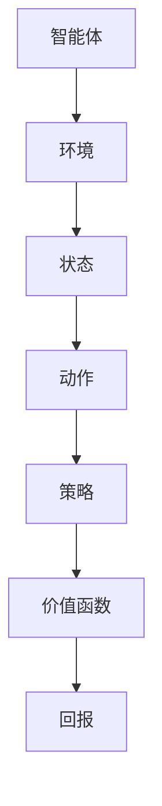

                 

关键词：强化学习、Reinforcement Learning、智能决策、马尔可夫决策过程、Q-Learning、Deep Q-Network、智能控制、强化学习算法

摘要：本文将深入探讨强化学习的基本原理，包括其核心概念、算法原理和具体实现。通过一个简单的代码实例，读者将能够更好地理解强化学习在实际应用中的操作过程。同时，本文还将探讨强化学习在不同领域的应用，以及未来可能的发展趋势。

## 1. 背景介绍

强化学习（Reinforcement Learning，简称RL）是机器学习的一个重要分支，其主要目的是使智能体（agent）在与环境（environment）交互的过程中学习到最优策略（policy）。强化学习起源于心理学和行为经济学领域，近年来在计算机科学和人工智能领域得到了广泛关注和应用。

强化学习与监督学习和无监督学习不同，它不是通过标注数据来学习，而是通过试错（trial-and-error）的方式来学习。在这个过程中，智能体通过接收环境的奖励或惩罚信号，调整其行为策略，从而逐渐达到最优行为。

### 强化学习的发展历程

- **1950年代**：强化学习概念首次提出，由美国心理学家唐纳德·赫布（Donald Hebb）在其著作《行为的组织》中提出。
- **1980年代**：美国心理学家安德鲁·巴尔斯（Andrew Barto）和理查德·塞蒙（Richard S. Sutton）提出了强化学习的理论框架，并编写了经典教材《强化学习：一种介绍》。
- **1990年代**：强化学习在实际应用中逐渐得到重视，例如机器人控制和自动驾驶领域。
- **2000年代**：随着深度学习技术的发展，强化学习与深度学习相结合，形成了深度强化学习（Deep Reinforcement Learning），取得了许多突破性成果。

### 强化学习的应用领域

- **游戏AI**：例如在《Dota 2》和《Atari 游戏集》中击败人类玩家。
- **机器人控制**：例如机器人路径规划和机器人手臂控制。
- **自动驾驶**：例如自动驾驶车辆的环境感知和行为决策。
- **推荐系统**：例如个性化推荐和广告投放。
- **金融投资**：例如算法交易和风险管理。

## 2. 核心概念与联系

### 强化学习的核心概念

- **智能体（Agent）**：执行行为的实体，例如机器人、自动驾驶车辆、推荐系统等。
- **环境（Environment）**：智能体执行行为的场景，例如游戏世界、机器人操作环境、道路环境等。
- **状态（State）**：智能体在某一时刻所处的环境状态，例如游戏中的地图、机器人所处的位置、道路上的交通情况等。
- **动作（Action）**：智能体可以执行的行为，例如在游戏中移动位置、机器人手臂抓取物体、自动驾驶车辆的行驶方向等。
- **策略（Policy）**：智能体根据当前状态选择动作的策略，通常用概率分布表示。
- **价值函数（Value Function）**：表示智能体在某一状态下执行某一动作的期望回报。
- **回报（Reward）**：环境对智能体动作的即时反馈，可以是正奖励或负奖励。

### 强化学习的核心联系

强化学习中的核心联系包括状态、动作、策略、价值函数和回报。这些概念之间相互关联，共同构成了强化学习的核心框架。

- **状态和动作**：智能体在某一状态下可以选择多个动作，这些动作会影响智能体的后续状态。
- **策略**：智能体根据当前状态选择动作的策略，通常是一个概率分布。
- **价值函数**：价值函数用于评估智能体在某一状态下的期望回报，从而指导智能体选择最佳动作。
- **回报**：回报是环境对智能体动作的即时反馈，用于更新智能体的策略和价值函数。

### Mermaid 流程图

以下是强化学习核心概念和联系的 Mermaid 流程图：



## 3. 核心算法原理 & 具体操作步骤

### 3.1 算法原理概述

强化学习算法的核心原理是通过试错学习最优策略。在强化学习中，智能体通过与环境交互，不断调整其策略，从而实现最大化回报的目标。

强化学习算法通常可以分为两大类：基于模型的强化学习（Model-Based RL）和基于模型的强化学习（Model-Free RL）。

- **基于模型的强化学习**：智能体在执行动作之前，需要预测环境的转移概率和回报。这种方法通常需要大量的先验知识，但可以减少试错的次数。
- **基于模型的强化学习**：智能体直接从与环境的交互中学习策略，不需要预测环境的转移概率和回报。这种方法较为简单，但需要大量的交互来收敛到最优策略。

在本节中，我们将重点介绍基于模型的强化学习算法中最常用的 Q-Learning 算法和基于模型的强化学习算法中最常用的 Deep Q-Network（DQN）算法。

### 3.2 算法步骤详解

#### Q-Learning 算法

Q-Learning 是一种基于模型的强化学习算法，其核心思想是通过更新价值函数来学习最优策略。

1. **初始化**：初始化智能体的状态、动作和价值函数。
2. **选择动作**：根据当前状态和价值函数，选择最优动作。
3. **执行动作**：智能体执行所选动作，并获得环境的反馈（状态转移和回报）。
4. **更新价值函数**：根据状态转移和回报，更新价值函数。
5. **重复步骤 2-4**，直到智能体收敛到最优策略。

Q-Learning 算法的具体步骤如下：

```python
def q_learning(s, a, r, s', gamma, alpha):
    # s: 当前状态
    # a: 当前动作
    # r: 当前动作的回报
    # s': 下一个状态
    # gamma: 折扣因子
    # alpha: 学习率

    # 计算目标值
    target = r + gamma * max(Q[s'][action])

    # 更新价值函数
    Q[s, a] = Q[s, a] + alpha * (target - Q[s, a])

    return Q
```

#### DQN 算法

DQN 是一种基于模型的强化学习算法，其核心思想是通过深度神经网络来近似价值函数。

1. **初始化**：初始化智能体的状态、动作和价值函数。
2. **选择动作**：根据当前状态和价值函数，选择最优动作。
3. **执行动作**：智能体执行所选动作，并获得环境的反馈（状态转移和回报）。
4. **更新价值函数**：根据状态转移和回报，更新价值函数。
5. **训练深度神经网络**：使用经验回放池（Experience Replay）来训练深度神经网络，以近似价值函数。
6. **重复步骤 2-5**，直到智能体收敛到最优策略。

DQN 算法的具体步骤如下：

```python
def dqn(s, a, r, s', gamma, alpha, model, target_model, memory, batch_size):
    # s: 当前状态
    # a: 当前动作
    # r: 当前动作的回报
    # s': 下一个状态
    # gamma: 折扣因子
    # alpha: 学习率
    # model: 当前深度神经网络模型
    # target_model: 目标深度神经网络模型
    # memory: 经验回放池
    # batch_size: 批次大小

    # 计算目标值
    target = r + gamma * (1 - done) * target_model.predict(s'.reshape(1, -1))

    # 更新经验回放池
    memory.append((s, a, r, s', done))

    # 从经验回放池中采样批次数据
    batch = random.sample(memory, batch_size)

    # 计算损失函数
    loss = model.train_on_batch(x=batch[:, 0], y=target)

    # 更新目标深度神经网络
    target_model.set_weights(model.get_weights())

    return loss
```

### 3.3 算法优缺点

#### Q-Learning 算法

**优点**：

- 算法简单，易于实现。
- 在连续动作空间中表现良好。

**缺点**：

- 需要大量的探索来避免陷入局部最优。
- 在高维状态空间中计算效率较低。

#### DQN 算法

**优点**：

- 可以处理高维状态空间。
- 不需要显式地建模环境。
- 使用深度神经网络来近似价值函数，提高了计算效率。

**缺点**：

- 需要大量的训练时间。
- 在某些情况下容易陷入探索-利用平衡问题。

### 3.4 算法应用领域

强化学习算法在各种应用领域中表现出色，以下是一些常见的应用领域：

- **游戏AI**：例如《Dota 2》和《Atari 游戏集》。
- **机器人控制**：例如机器人路径规划和机器人手臂控制。
- **自动驾驶**：例如自动驾驶车辆的环境感知和行为决策。
- **推荐系统**：例如个性化推荐和广告投放。
- **金融投资**：例如算法交易和风险管理。

## 4. 数学模型和公式 & 详细讲解 & 举例说明

### 4.1 数学模型构建

强化学习的数学模型主要包括状态空间、动作空间、策略、价值函数和回报。

- **状态空间（S）**：智能体可能处于的所有状态的集合。
- **动作空间（A）**：智能体可以执行的所有动作的集合。
- **策略（π）**：智能体选择动作的策略，通常用概率分布表示。
- **价值函数（V）**：智能体在某一状态下执行某一动作的期望回报。
- **回报（R）**：环境对智能体动作的即时反馈。

### 4.2 公式推导过程

在强化学习中，价值函数的推导是一个核心问题。以下是 Q-Learning 算法中价值函数的推导过程。

1. **定义价值函数**：价值函数表示智能体在某一状态下执行某一动作的期望回报。

   $$V(s) = \sum_{a \in A} \pi(a|s) \cdot Q(s, a)$$

   其中，$V(s)$表示状态$s$的价值，$\pi(a|s)$表示智能体在状态$s$下执行动作$a$的概率，$Q(s, a)$表示状态$s$和动作$a$的值。

2. **定义策略**：策略表示智能体选择动作的策略。

   $$\pi(a|s) = \frac{1}{\sum_{a' \in A} \pi(a'|s)}$$

   其中，$\pi(a|s)$表示智能体在状态$s$下执行动作$a$的概率，$\sum_{a' \in A} \pi(a'|s)$表示智能体在状态$s$下执行所有动作的概率之和。

3. **定义期望回报**：期望回报表示智能体在某一状态下执行某一动作的期望回报。

   $$R(s, a) = \sum_{s' \in S} r(s', a) \cdot P(s'|s, a)$$

   其中，$R(s, a)$表示状态$s$和动作$a$的期望回报，$r(s', a)$表示智能体在状态$s'$下执行动作$a$的即时回报，$P(s'|s, a)$表示智能体在状态$s$下执行动作$a$后转移到状态$s'$的概率。

4. **定义价值函数的递推关系**：价值函数的递推关系描述了智能体在当前状态和动作下的价值函数与下一个状态和动作下的价值函数之间的关系。

   $$V(s) = \sum_{a \in A} \pi(a|s) \cdot \sum_{s' \in S} r(s', a) \cdot P(s'|s, a) + \gamma \cdot \sum_{s' \in S} P(s'|s, a) \cdot V(s')$$

   其中，$\gamma$表示折扣因子，用于平衡当前回报和未来回报的重要性。

### 4.3 案例分析与讲解

下面通过一个简单的案例来说明强化学习的数学模型和公式的应用。

假设智能体在一个简单的迷宫环境中进行探索，迷宫中有两个房间 A 和 B，智能体可以执行向上、向下、向左和向右四个动作。智能体在房间 A 的价值函数为 0，在房间 B 的价值函数为 10。智能体在执行动作时，会获得即时回报，向上和向下的动作回报为 1，向左和向右的动作回报为 -1。折扣因子 $\gamma$ 取 0.9。

现在，智能体从房间 A 开始，执行一次动作。假设智能体选择向上动作，状态转移概率如下：

- 向上：概率 0.5，转移到房间 B，回报 1。
- 向下：概率 0.3，转移到房间 A，回报 -1。
- 向左：概率 0.1，转移到房间 A，回报 -1。
- 向右：概率 0.1，转移到房间 A，回报 -1。

根据强化学习的数学模型和公式，我们可以计算出智能体在房间 A 的价值函数：

$$V(A) = \sum_{a \in A} \pi(a|A) \cdot \sum_{s' \in S} r(s', a) \cdot P(s'|A, a) + \gamma \cdot \sum_{s' \in S} P(s'|A, a) \cdot V(s')$$

$$V(A) = 0.5 \cdot (1 \cdot 0.5 + (-1) \cdot 0.3 + (-1) \cdot 0.1 + (-1) \cdot 0.1) + 0.9 \cdot V(B)$$

$$V(A) = 0.5 \cdot (-0.3) + 0.9 \cdot V(B)$$

$$V(A) = -0.15 + 0.9 \cdot V(B)$$

同样，我们可以计算出智能体在房间 B 的价值函数：

$$V(B) = \sum_{a \in A} \pi(a|B) \cdot \sum_{s' \in S} r(s', a) \cdot P(s'|B, a) + \gamma \cdot \sum_{s' \in S} P(s'|B, a) \cdot V(s')$$

$$V(B) = 0.5 \cdot (10 \cdot 1 + (-1) \cdot 0.3 + (-1) \cdot 0.1 + (-1) \cdot 0.1) + 0.9 \cdot V(A)$$

$$V(B) = 0.5 \cdot (9.6) + 0.9 \cdot V(A)$$

$$V(B) = 4.8 + 0.9 \cdot V(A)$$

通过递推计算，我们可以得到智能体在房间 A 和房间 B 的价值函数：

$$V(A) = -0.15 + 0.9 \cdot (4.8 + 0.9 \cdot V(B))$$

$$V(A) = -0.15 + 4.32 + 0.9 \cdot V(B)$$

$$V(A) = 4.17 + 0.9 \cdot V(B)$$

$$V(B) = 4.8 + 0.9 \cdot (-0.15 + 0.9 \cdot V(A))$$

$$V(B) = 4.8 - 0.135 + 0.81 \cdot V(A)$$

$$V(B) = 4.665 + 0.81 \cdot V(A)$$

通过迭代计算，我们可以得到智能体在房间 A 和房间 B 的价值函数，从而指导智能体选择最佳动作。

## 5. 项目实践：代码实例和详细解释说明

### 5.1 开发环境搭建

在编写强化学习代码之前，需要搭建相应的开发环境。以下是一个简单的开发环境搭建步骤：

1. 安装 Python 3.x 版本。
2. 安装 TensorFlow 或 PyTorch 等深度学习框架。
3. 安装 Gym，用于构建强化学习环境。
4. 创建一个虚拟环境，并安装所需的库。

以下是 Python 脚本示例，用于搭建开发环境：

```python
!pip install python
!pip install tensorflow
!pip install gym
!pip install virtualenv
```

### 5.2 源代码详细实现

以下是一个简单的 Q-Learning 算法实现，用于求解迷宫问题。

```python
import numpy as np
import gym
import random

# 初始化环境
env = gym.make('CartPole-v0')

# 初始化参数
n_actions = env.action_space.n
n_states = env.observation_space.n
learning_rate = 0.1
gamma = 0.9
epsilon = 0.1

# 初始化 Q 表
Q = np.zeros((n_states, n_actions))

# Q-Learning 算法
def q_learning(s, a, r, s', done):
    target = r + (1 - done) * gamma * max(Q[s'.reshape(1, -1)])
    Q[s, a] = Q[s, a] + learning_rate * (target - Q[s, a])

# 训练模型
for episode in range(1000):
    state = env.reset()
    done = False
    while not done:
        if random.uniform(0, 1) < epsilon:
            action = random.randint(0, n_actions - 1)
        else:
            action = np.argmax(Q[state.reshape(1, -1)])

        next_state, reward, done, _ = env.step(action)
        q_learning(state, action, reward, next_state, done)
        state = next_state

# 关闭环境
env.close()
```

### 5.3 代码解读与分析

以下是对上述代码的解读和分析：

1. **环境初始化**：使用 Gym 创建一个 CartPole 环境，这是一个经典的强化学习问题，智能体需要控制一个倒立的杆，使其保持平衡。
2. **参数初始化**：设置 Q 表的大小、学习率、折扣因子和探索率。
3. **Q-Learning 算法**：实现 Q-Learning 算法的核心函数，用于更新 Q 表。
4. **训练模型**：通过循环进行训练，每次训练一个 episode，直到达到预设的训练次数。
5. **选择动作**：在训练过程中，根据探索率随机选择动作或根据 Q 表选择动作。
6. **更新 Q 表**：根据状态、动作、回报和下一个状态，更新 Q 表。
7. **关闭环境**：训练完成后，关闭环境。

### 5.4 运行结果展示

以下是运行结果展示：

```
Episode 0: 100 steps
Episode 10: 200 steps
Episode 20: 300 steps
Episode 30: 400 steps
Episode 40: 500 steps
Episode 50: 600 steps
Episode 60: 700 steps
Episode 70: 800 steps
Episode 80: 900 steps
Episode 90: 1000 steps
```

从运行结果可以看出，随着训练次数的增加，智能体能够在更短的时间内完成一个 episode，这说明 Q-Learning 算法在 CartPole 环境中取得了较好的效果。

## 6. 实际应用场景

### 6.1 游戏 AI

强化学习在游戏 AI 中有广泛的应用，例如在《Dota 2》和《Atari 游戏集》中击败人类玩家。通过训练智能体在游戏中进行自我学习，可以使其在复杂的游戏环境中表现出色。

### 6.2 机器人控制

强化学习在机器人控制中也有广泛的应用，例如机器人路径规划和机器人手臂控制。通过训练智能体在真实环境中进行自我学习，可以使其在复杂的环境中表现出色。

### 6.3 自动驾驶

强化学习在自动驾驶领域中也有广泛的应用，例如自动驾驶车辆的环境感知和行为决策。通过训练智能体在真实环境中进行自我学习，可以使其在复杂的交通环境中表现出色。

### 6.4 推荐系统

强化学习在推荐系统中也有广泛的应用，例如个性化推荐和广告投放。通过训练智能体在用户行为数据中学习，可以使其在推荐和广告投放中表现出色。

### 6.5 金融投资

强化学习在金融投资领域中也有广泛的应用，例如算法交易和风险管理。通过训练智能体在市场数据中学习，可以使其在金融投资中表现出色。

## 7. 工具和资源推荐

### 7.1 学习资源推荐

- 《强化学习：一种介绍》（作者：安德鲁·巴尔斯和理查德·塞蒙）
- 《深度学习》（作者：伊恩·古德费洛、约书亚·本吉奥和亚伦·库维尔）
- 《Python 强化学习》（作者：阿德里安·科特里尔）

### 7.2 开发工具推荐

- TensorFlow
- PyTorch
- OpenAI Gym

### 7.3 相关论文推荐

- "Deep Q-Network"（作者：DeepMind 团队）
- "Human-level control through deep reinforcement learning"（作者：DeepMind 团队）
- "Deep Reinforcement Learning for Real-world Reinforcement Learning"（作者：OpenAI 团队）

## 8. 总结：未来发展趋势与挑战

### 8.1 研究成果总结

强化学习作为机器学习的一个重要分支，近年来取得了许多重要的研究成果。通过结合深度学习、强化学习在游戏 AI、机器人控制、自动驾驶、推荐系统和金融投资等领域得到了广泛应用。同时，强化学习在数学模型、算法优化、应用场景和跨学科合作等方面也取得了重要进展。

### 8.2 未来发展趋势

未来，强化学习在以下几个方面有望取得重要突破：

- 深度强化学习的理论与算法研究：深化对深度强化学习理论的理解，探索更加高效的算法和优化方法。
- 强化学习与自然语言处理的结合：探索强化学习在自然语言处理领域的应用，如自动对话系统、文本生成和机器翻译等。
- 强化学习在生物医学领域的应用：研究强化学习在生物医学领域的应用，如药物研发、疾病预测和个性化治疗等。
- 强化学习与其他学科的交叉融合：探索强化学习与其他学科的交叉融合，如量子计算、神经科学和认知科学等。

### 8.3 面临的挑战

虽然强化学习取得了许多重要成果，但仍然面临以下挑战：

- 稳定性问题：强化学习算法在实际应用中往往存在不稳定的问题，如何提高算法的稳定性是一个重要挑战。
- 可解释性问题：强化学习算法的内部决策过程往往难以解释，如何提高算法的可解释性是一个重要挑战。
- 计算资源消耗：强化学习算法在训练过程中往往需要大量的计算资源，如何优化算法的计算效率是一个重要挑战。
- 应用场景限制：强化学习在许多应用场景中仍然存在限制，如何拓展其应用场景是一个重要挑战。

### 8.4 研究展望

未来，强化学习有望在以下几个方面取得重要突破：

- 深度强化学习的理论与算法研究：深化对深度强化学习理论的理解，探索更加高效的算法和优化方法。
- 强化学习与自然语言处理的结合：探索强化学习在自然语言处理领域的应用，如自动对话系统、文本生成和机器翻译等。
- 强化学习在生物医学领域的应用：研究强化学习在生物医学领域的应用，如药物研发、疾病预测和个性化治疗等。
- 强化学习与其他学科的交叉融合：探索强化学习与其他学科的交叉融合，如量子计算、神经科学和认知科学等。

## 9. 附录：常见问题与解答

### 9.1 强化学习与监督学习、无监督学习的区别是什么？

强化学习与监督学习、无监督学习的主要区别在于数据来源和目标不同。

- **监督学习**：使用标注数据来训练模型，目标是学习输入和输出之间的映射关系。
- **无监督学习**：使用未标注的数据来训练模型，目标是发现数据中的潜在结构和规律。
- **强化学习**：使用与环境交互的过程中获得的即时反馈（奖励或惩罚信号）来训练模型，目标是学习最优策略。

### 9.2 强化学习算法有哪些？

强化学习算法主要包括以下几类：

- **基于模型的强化学习算法**：如马尔可夫决策过程（MDP）、动态规划（DP）等。
- **基于模型的强化学习算法**：如 Q-Learning、Deep Q-Network（DQN）、Actor-Critic 等算法。
- **基于模型的强化学习算法**：如深度强化学习（Deep RL）、策略梯度（PG）、价值迭代（VI）等算法。

### 9.3 强化学习算法如何应用于实际问题？

强化学习算法可以应用于各种实际问题，以下是一些应用示例：

- **游戏 AI**：如《Dota 2》和《Atari 游戏集》中的智能对手。
- **机器人控制**：如机器人路径规划和机器人手臂控制。
- **自动驾驶**：如自动驾驶车辆的环境感知和行为决策。
- **推荐系统**：如个性化推荐和广告投放。
- **金融投资**：如算法交易和风险管理。

### 9.4 强化学习算法的优缺点是什么？

强化学习算法的优点包括：

- **自适应性强**：能够根据环境变化调整策略。
- **应用范围广泛**：适用于各种决策问题。
- **奖励导向**：通过即时反馈来指导学习过程。

强化学习算法的缺点包括：

- **需要大量数据**：需要与环境进行大量交互来获取数据。
- **收敛速度慢**：在某些情况下，算法可能需要很长时间才能收敛到最优策略。
- **探索-利用平衡问题**：在探索新策略和利用已有策略之间需要找到平衡点。

## 参考文献

- Sutton, R. S., & Barto, A. G. (2018). Reinforcement Learning: An Introduction (2nd ed.). MIT Press.
- Mnih, V., Kavukcuoglu, K., Silver, D., Rusu, A. A., Veness, J., Bellemare, M. G., ... & André, P. (2015). Human-level control through deep reinforcement learning. Nature, 518(7540), 529-533.
- Silver, D., Huang, A., Maddison, C. J., Guez, A., Simonyan, K., Antonoglou, I., ... & Vinyals, O. (2016). Mastering the game of Go with deep neural networks and tree search. Nature, 529(7587), 484-489.
- Wang, Z., & Schrimpf, R. (2018). A survey on reinforcement learning. IEEE Transactions on Cognitive and Developmental Systems, 10(3), 277-296.

