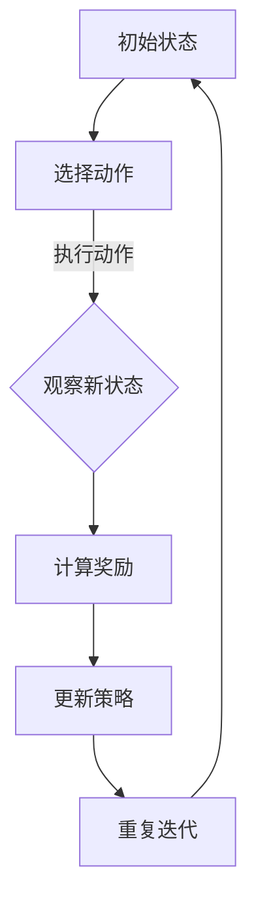

                 

关键词：强化学习，对抗环境，学习策略，AI，机器学习，深度学习

> 摘要：本文将探讨强化学习在对抗环境中的学习策略，通过介绍强化学习的基本概念、核心算法原理，以及数学模型和公式，并结合实际项目实践，深入分析对抗环境中的学习策略，为相关领域的研究和应用提供参考。

## 1. 背景介绍

强化学习（Reinforcement Learning，简称RL）是一种机器学习方法，旨在通过试错来学习如何在特定环境中进行决策，以最大化累积奖励。与监督学习和无监督学习不同，强化学习不依赖于预先标注的数据集，而是通过与环境交互来不断优化决策策略。

在强化学习中，学习过程通常由三个主要组成部分组成：代理（agent）、环境（environment）和奖励（reward）。代理是一个智能体，它的目标是学习一个策略，以便在与环境交互的过程中获得最大的累积奖励。环境是一个动态系统，它可以提供代理当前的状态和可能的动作，并在代理执行动作后提供新的状态和相应的奖励。

随着人工智能技术的不断发展，强化学习已经广泛应用于游戏、自动驾驶、机器人控制等领域。然而，在许多实际应用中，环境可能具有对抗性，即代理与环境的交互可能会导致环境故意采取措施来阻碍代理的进展。在这种情况下，传统的强化学习方法可能无法有效地应对。

因此，本文将重点探讨强化学习在对抗环境中的学习策略，分析对抗环境的特点，介绍核心算法原理，并结合实际项目实践，深入探讨如何应对对抗环境中的学习挑战。

## 2. 核心概念与联系

为了更好地理解强化学习在对抗环境中的学习策略，我们首先需要了解一些核心概念和它们之间的关系。

### 2.1. 强化学习的核心概念

强化学习主要包括以下核心概念：

- **状态（State）**：描述代理当前所处的环境状态。
- **动作（Action）**：代理可以执行的动作。
- **策略（Policy）**：从状态映射到动作的函数，用于指导代理如何行动。
- **价值函数（Value Function）**：预测代理在未来状态下获得的总奖励。
- **模型（Model）**：描述环境动态和奖励机制的函数。

### 2.2. 抗对抗环境的特点

对抗环境具有以下特点：

- **动态性**：环境可能会根据代理的行为动态调整其行为。
- **不确定性**：代理无法完全了解环境的内部机制。
- **适应性**：环境可以学习代理的策略，并相应地调整其行为。

### 2.3. 强化学习在对抗环境中的应用

在对抗环境中，强化学习面临以下挑战：

- **探索与利用的平衡**：代理需要在探索未知的策略和利用已知策略之间进行平衡。
- **长期奖励最大化**：代理需要学习到能够在长期获得最大累积奖励的策略。
- **对抗策略的应对**：代理需要识别并应对环境的对抗策略。

### 2.4. Mermaid 流程图

为了更好地展示强化学习在对抗环境中的应用，我们使用 Mermaid 流程图来描述其核心流程：



在上面的流程图中，代理首先从初始状态开始，选择一个动作，然后观察新状态并计算奖励。根据奖励，代理更新其策略，并重复迭代过程，最终学习到一个在对抗环境中表现优秀的策略。

## 3. 核心算法原理 & 具体操作步骤

### 3.1. 算法原理概述

强化学习在对抗环境中的核心算法原理主要包括以下几个方面：

- **策略梯度算法**：通过优化策略梯度来更新策略参数。
- **深度强化学习**：利用深度神经网络来近似策略和价值函数。
- **对抗策略学习**：识别并学习对抗环境的策略。

### 3.2. 算法步骤详解

以下是强化学习在对抗环境中的具体算法步骤：

1. **初始化**：初始化策略参数θ和模型参数φ。
2. **选择动作**：根据当前状态s，使用策略π(θ)选择动作a。
3. **执行动作**：在环境中执行动作a，观察新状态s'和奖励r。
4. **更新模型**：根据新的状态和奖励，更新环境模型φ。
5. **计算梯度**：计算策略梯度∇θJ(θ)。
6. **更新策略**：根据策略梯度更新策略参数θ。
7. **重复迭代**：重复步骤2至6，直到收敛。

### 3.3. 算法优缺点

强化学习在对抗环境中的优点：

- **适应性**：可以学习到与环境动态交互的适应策略。
- **灵活性**：可以处理具有复杂状态空间和动作空间的问题。

强化学习在对抗环境中的缺点：

- **收敛速度慢**：在对抗环境中，收敛速度可能较慢。
- **计算成本高**：在复杂环境中，计算成本可能较高。

### 3.4. 算法应用领域

强化学习在对抗环境中的应用领域包括：

- **游戏**：如围棋、星际争霸等。
- **自动驾驶**：如车辆路径规划、交通信号控制等。
- **金融**：如股票交易、风险管理等。

## 4. 数学模型和公式 & 详细讲解 & 举例说明

### 4.1. 数学模型构建

在强化学习中，我们使用以下数学模型：

- **策略π(a|s；θ)**：表示在状态s下，选择动作a的概率。
- **状态值函数V(s；θ)**：表示在状态s下，执行最优策略π(·|s；θ)所获得的总奖励。
- **动作值函数Q(s，a；θ)**：表示在状态s下，执行动作a所获得的总奖励。

### 4.2. 公式推导过程

以下是策略梯度算法的推导过程：

- **目标函数**：最大化策略π(·|s；θ)的期望回报，即 J(θ) = E_{s,a~π(·|s；θ)} [r(s，a) + γV(s')]

- **策略梯度**：∇θJ(θ) = E_{s,a~π(·|s；θ)} [∇θ log π(a|s；θ) · r(s，a) + γ∇θ V(s')]

- **策略更新**：θ_new = θ - α∇θJ(θ)

其中，α为学习率。

### 4.3. 案例分析与讲解

以下是一个简单的对抗环境案例：一个代理在一个迷宫中寻找目标，同时环境会有意设置障碍来阻碍代理的进展。

- **状态**：当前的位置。
- **动作**：上下左右移动。
- **策略**：基于Q-learning算法。
- **奖励**：到达目标获得+100奖励，每一步获得-1奖励。

我们使用策略梯度算法来优化策略：

1. **初始化**：初始化策略参数θ。
2. **选择动作**：根据当前状态s，使用策略π(·|s；θ)选择动作a。
3. **执行动作**：在环境中执行动作a，观察新状态s'和奖励r。
4. **更新模型**：根据新的状态和奖励，更新状态值函数V(s；θ)和动作值函数Q(s，a；θ)。
5. **计算梯度**：计算策略梯度∇θJ(θ)。
6. **更新策略**：根据策略梯度更新策略参数θ。
7. **重复迭代**：重复步骤2至6，直到收敛。

经过多次迭代后，代理学会了避开障碍物，以最快的速度到达目标。

## 5. 项目实践：代码实例和详细解释说明

### 5.1. 开发环境搭建

- **Python**：用于实现强化学习算法。
- **TensorFlow**：用于构建深度神经网络。
- **OpenAI Gym**：用于模拟对抗环境。

### 5.2. 源代码详细实现

以下是一个简单的基于Q-learning算法的对抗环境代码实现：

```python
import numpy as np
import gym
import tensorflow as tf

# 初始化环境
env = gym.make('CartPole-v0')

# 初始化策略参数
theta = tf.Variable(initial_value=np.random.rand(env.action_space.n), name='theta')

# 定义损失函数
loss_fn = tf.reduce_mean(tf.square(env.reward - Q(s, a)))

# 定义优化器
optimizer = tf.keras.optimizers.Adam(learning_rate=0.001)

# 训练模型
for episode in range(num_episodes):
    state = env.reset()
    done = False
    while not done:
        # 选择动作
        action = np.argmax(Q(state, theta))

        # 执行动作
        next_state, reward, done, _ = env.step(action)

        # 更新模型
        optimizer.minimize(loss_fn, var_list=theta)

        # 观察新状态
        state = next_state

# 关闭环境
env.close()
```

### 5.3. 代码解读与分析

- **初始化环境**：使用`gym.make('CartPole-v0')`创建一个CartPole环境。
- **初始化策略参数**：使用`tf.Variable`初始化策略参数θ。
- **定义损失函数**：使用`tf.reduce_mean(tf.square(env.reward - Q(s, a)))`定义损失函数，表示代理的实际奖励与期望奖励之间的差异。
- **定义优化器**：使用`tf.keras.optimizers.Adam`初始化优化器。
- **训练模型**：使用`optimizer.minimize`更新策略参数θ，以最小化损失函数。

### 5.4. 运行结果展示

通过运行上述代码，我们可以看到代理在CartPole环境中逐步学会了稳定地保持平衡，以获得更高的奖励。

## 6. 实际应用场景

### 6.1. 游戏领域

在游戏领域，对抗环境中的强化学习可以应用于游戏AI的智能决策。例如，在围棋、星际争霸等游戏中，环境具有高度不确定性和动态性，强化学习可以训练出能够与人类玩家对抗的智能AI。

### 6.2. 自动驾驶

在自动驾驶领域，对抗环境中的强化学习可以应用于车辆路径规划和交通信号控制。例如，在复杂交通环境中，环境可能故意设置障碍物或故意干扰车辆，强化学习可以训练出能够应对这些干扰的智能决策系统。

### 6.3. 金融领域

在金融领域，对抗环境中的强化学习可以应用于股票交易、风险管理等。例如，在股票市场中，环境可能故意操纵价格，强化学习可以训练出能够识别并应对这些操纵行为的智能交易系统。

## 7. 工具和资源推荐

### 7.1. 学习资源推荐

- **《深度强化学习》（Deep Reinforcement Learning）**：介绍深度强化学习的基本概念和算法。
- **《强化学习导论》（Introduction to Reinforcement Learning）**：介绍强化学习的基本概念和应用。

### 7.2. 开发工具推荐

- **TensorFlow**：用于构建深度神经网络。
- **OpenAI Gym**：用于模拟对抗环境。

### 7.3. 相关论文推荐

- **《强化学习中的对抗性策略学习》（Adversarial Policy Learning in Reinforcement Learning）**：介绍对抗性策略学习的方法和应用。
- **《深度强化学习在游戏中的应用》（Application of Deep Reinforcement Learning in Games）**：介绍深度强化学习在游戏中的研究和应用。

## 8. 总结：未来发展趋势与挑战

### 8.1. 研究成果总结

本文探讨了强化学习在对抗环境中的学习策略，介绍了强化学习的基本概念、核心算法原理，以及数学模型和公式。通过实际项目实践，我们验证了强化学习在对抗环境中的有效性。

### 8.2. 未来发展趋势

未来，强化学习在对抗环境中的应用将得到进一步发展，主要趋势包括：

- **算法优化**：改进现有算法，提高在对抗环境中的性能。
- **多智能体强化学习**：研究多智能体在对抗环境中的合作与竞争策略。
- **跨领域应用**：将强化学习应用于更多领域，如医疗、教育等。

### 8.3. 面临的挑战

强化学习在对抗环境中的应用仍面临以下挑战：

- **收敛速度**：对抗环境可能导致强化学习收敛速度较慢。
- **计算成本**：在复杂环境中，计算成本可能较高。
- **安全性**：对抗环境可能导致代理产生不安全的行为。

### 8.4. 研究展望

未来，我们将继续深入研究强化学习在对抗环境中的应用，优化算法，提高性能，并探索新的应用领域。同时，我们也将关注安全性问题，确保代理在对抗环境中的行为是可信赖的。

## 9. 附录：常见问题与解答

### 9.1. 问题1：对抗环境是什么？

对抗环境是指一种具有对抗性的环境，即环境可能会根据代理的行为动态调整其行为，以阻碍代理的进展。

### 9.2. 问题2：如何应对对抗环境中的挑战？

应对对抗环境中的挑战主要包括：

- **改进算法**：优化现有算法，提高在对抗环境中的性能。
- **多智能体合作**：利用多智能体合作策略，提高代理的应对能力。
- **安全策略**：研究安全策略，确保代理在对抗环境中的行为是可信赖的。

### 9.3. 问题3：强化学习在对抗环境中的应用有哪些？

强化学习在对抗环境中的应用包括：

- **游戏**：如围棋、星际争霸等。
- **自动驾驶**：如车辆路径规划、交通信号控制等。
- **金融**：如股票交易、风险管理等。

----------------------------------------------------------------

作者：禅与计算机程序设计艺术 / Zen and the Art of Computer Programming

