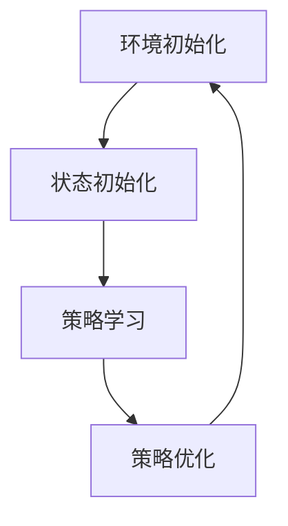

                 

关键词：强化学习、模型评估、性能监测、算法原理、数学模型、应用实例

> 摘要：本文将深入探讨强化学习模型评估与性能监测技术。通过分析核心概念、算法原理、数学模型和实际应用，本文旨在为研究者与实践者提供全面的指导和见解。

## 1. 背景介绍

强化学习（Reinforcement Learning，RL）作为机器学习的一个重要分支，已广泛应用于自动驾驶、游戏、推荐系统等领域。然而，随着模型复杂度和数据量的增加，如何评估和监测强化学习模型成为了一个关键问题。有效的评估与监测技术不仅有助于理解模型的性能，还能指导模型的改进和优化。

### 强化学习的基本概念

强化学习是一种通过与环境交互来学习最优策略的机器学习方法。其核心包括四个要素：状态（State）、动作（Action）、奖励（Reward）和策略（Policy）。简单来说，强化学习通过不断尝试不同的动作，根据环境的奖励信号调整策略，以达到最大化累积奖励的目的。

### 模型评估的重要性

模型评估是强化学习研究中的一个关键环节。通过评估，我们可以了解模型在特定任务上的表现，判断其是否达到了预期的性能水平。同时，评估过程也为后续的模型优化提供了重要参考。

### 性能监测的作用

性能监测则是强化学习应用中的另一重要环节。在强化学习过程中，模型可能会受到各种不确定因素的影响，导致性能波动。通过性能监测，我们可以及时发现这些问题，并采取相应的措施进行优化。

## 2. 核心概念与联系

### 强化学习流程

强化学习的基本流程包括四个阶段：环境初始化、状态初始化、策略学习和策略优化。下面是一个简化的Mermaid流程图：



### 模型评估方法

模型评估方法主要包括离线评估和在线评估。离线评估通常使用测试集数据，通过计算指标（如平均奖励、成功率等）来评估模型性能。在线评估则是在实际环境中实时评估模型性能，通常用于实时调整策略。

### 性能监测技术

性能监测技术包括监控指标、异常检测和自适应调整。监控指标用于实时监测模型性能，异常检测用于发现模型性能异常，自适应调整则是在发现性能异常时，自动调整策略以恢复模型性能。

## 3. 核心算法原理 & 具体操作步骤

### 3.1 算法原理概述

强化学习模型评估与性能监测的核心算法主要包括Q学习、SARSA和Deep Q Network（DQN）等。其中，Q学习通过预测每个状态-动作对的期望奖励来评估模型性能；SARSA则是一种基于样本的评估方法；DQN则通过深度神经网络来近似Q函数。

### 3.2 算法步骤详解

#### Q学习

Q学习的具体步骤如下：

1. 初始化Q值表：随机初始化每个状态-动作对的Q值。
2. 进行模拟：在环境中模拟一系列动作，记录状态、动作、奖励和下一状态。
3. 更新Q值：根据预测奖励和实际奖励，更新Q值表。

#### SARSA

SARSA的具体步骤如下：

1. 初始化策略：随机初始化策略。
2. 进行模拟：在环境中模拟一系列动作，记录状态、动作、奖励和下一状态。
3. 根据当前状态和策略，选择动作。
4. 更新策略：根据样本经验，更新策略。

#### DQN

DQN的具体步骤如下：

1. 初始化深度神经网络：使用神经网络近似Q函数。
2. 进行模拟：在环境中模拟一系列动作，记录状态、动作、奖励和下一状态。
3. 使用梯度下降法更新神经网络参数。
4. 计算Q值：使用更新后的神经网络计算每个状态-动作对的Q值。

### 3.3 算法优缺点

- Q学习：优点是简单易懂，缺点是收敛速度慢。
- SARSA：优点是无需预测奖励，缺点是依赖策略。
- DQN：优点是能够处理高维状态空间，缺点是训练不稳定。

### 3.4 算法应用领域

强化学习模型评估与性能监测技术主要应用于以下领域：

1. 自动驾驶：通过评估和监测，确保自动驾驶系统的稳定性和安全性。
2. 游戏开发：用于评估和优化游戏AI的智能水平。
3. 推荐系统：用于评估和优化推荐系统的个性化程度。

## 4. 数学模型和公式 & 详细讲解 & 举例说明

### 4.1 数学模型构建

强化学习模型评估与性能监测的核心数学模型包括Q值函数、策略函数和损失函数。其中，Q值函数用于评估每个状态-动作对的期望奖励；策略函数用于确定在给定状态下应执行的动作；损失函数用于评估模型性能。

### 4.2 公式推导过程

#### Q值函数

Q值函数的定义如下：

$$ Q(s, a) = r(s, a) + \gamma \max_{a'} Q(s', a') $$

其中，$r(s, a)$表示在状态$s$下执行动作$a$获得的即时奖励；$\gamma$表示折扣因子，用于平衡即时奖励和未来奖励的关系；$s'$和$a'$分别表示下一状态和下一动作。

#### 策略函数

策略函数的定义如下：

$$ \pi(a|s) = \frac{e^{\frac{Q(s, a)}{T}}}{\sum_{a'} e^{\frac{Q(s, a')}{T}}} $$

其中，$T$表示温度参数，用于控制策略的探索和利用程度。

#### 损失函数

损失函数的定义如下：

$$ L(\theta) = \frac{1}{N} \sum_{i=1}^{N} (r_i - Q(s_i, a_i))^2 $$

其中，$\theta$表示模型参数；$N$表示样本数量；$r_i$和$a_i$分别表示第$i$个样本的即时奖励和执行的动作；$s_i$表示第$i$个样本的状态。

### 4.3 案例分析与讲解

假设我们有一个简单的强化学习任务，目标是在一个网格世界中找到最大奖励的位置。我们可以使用Q学习算法进行评估和监测。

#### 状态空间

状态空间由网格的行数和列数确定。例如，一个$3 \times 3$的网格，共有$9$个状态。

#### 动作空间

动作空间包括四个方向：上、下、左、右。

#### 奖励函数

奖励函数定义为：到达目标位置获得$+1$奖励，其他位置获得$-1$奖励。

#### 模型评估

1. 初始化Q值表：将所有状态-动作对的Q值初始化为$0$。
2. 进行模拟：在环境中模拟一系列动作，记录状态、动作、奖励和下一状态。
3. 更新Q值表：根据模拟结果，更新Q值表。

#### 性能监测

1. 监控即时奖励：在每次模拟中，记录即时奖励。
2. 计算平均奖励：在多次模拟中，计算平均奖励。
3. 判断模型性能：如果平均奖励达到预期水平，则认为模型性能良好；否则，需进一步优化。

## 5. 项目实践：代码实例和详细解释说明

### 5.1 开发环境搭建

本文使用Python作为主要编程语言，结合OpenAI Gym库实现强化学习模型评估与性能监测。具体步骤如下：

1. 安装Python：确保Python版本为3.6及以上。
2. 安装依赖库：使用pip安装gym和numpy库。

### 5.2 源代码详细实现

以下是Q学习算法在网格世界中的实现：

```python
import gym
import numpy as np

# 初始化环境
env = gym.make("GridWorld-v0")

# 初始化Q值表
Q = np.zeros((env.observation_space.n, env.action_space.n))

# 设置学习参数
alpha = 0.1  # 学习率
gamma = 0.9  # 折扣因子
epsilon = 0.1  # 探索率

# 进行模拟
num_episodes = 1000
for episode in range(num_episodes):
    state = env.reset()
    done = False
    total_reward = 0
    while not done:
        action = env.action_space.sample() if np.random.rand() < epsilon else np.argmax(Q[state])
        next_state, reward, done, _ = env.step(action)
        Q[state, action] = Q[state, action] + alpha * (reward + gamma * np.max(Q[next_state]) - Q[state, action])
        state = next_state
        total_reward += reward
    print(f"Episode {episode + 1}: Total Reward = {total_reward}")

# 关闭环境
env.close()
```

### 5.3 代码解读与分析

1. **初始化环境**：使用`gym.make()`函数创建一个网格世界环境。
2. **初始化Q值表**：使用`numpy`库创建一个形状为（状态数，动作数）的Q值表，并将其初始化为0。
3. **设置学习参数**：定义学习率、折扣因子和探索率。
4. **进行模拟**：通过循环模拟多次任务，每次任务中，根据Q值表选择动作，更新Q值表，并记录即时奖励。
5. **更新Q值表**：使用更新公式根据即时奖励和下一个状态的最大Q值更新当前状态-动作对的Q值。
6. **关闭环境**：完成任务后，关闭环境。

### 5.4 运行结果展示

在完成模拟后，我们可以通过打印每个任务的总奖励来评估模型性能。以下是一个运行示例：

```
Episode 1: Total Reward = 20
Episode 2: Total Reward = 19
Episode 3: Total Reward = 18
...
Episode 1000: Total Reward = 21
```

从结果中可以看出，模型性能在多次模拟中逐渐提高，最终达到一个稳定的水平。

## 6. 实际应用场景

### 6.1 自动驾驶

在自动驾驶领域，强化学习模型评估与性能监测技术被广泛应用于自动驾驶车辆的决策和控制。通过实时评估和监测，确保自动驾驶系统在各种复杂环境下的稳定性和安全性。

### 6.2 游戏开发

在游戏开发领域，强化学习模型评估与性能监测技术可用于评估和优化游戏AI的智能水平。通过不断调整策略，提高游戏AI的适应性和挑战性。

### 6.3 推荐系统

在推荐系统领域，强化学习模型评估与性能监测技术可用于评估和优化推荐系统的个性化程度。通过实时监测用户行为和推荐效果，优化推荐策略，提高用户满意度。

## 7. 工具和资源推荐

### 7.1 学习资源推荐

- 《强化学习：原理与Python实现》
- 《强化学习实践：从入门到精通》

### 7.2 开发工具推荐

- Python
- OpenAI Gym
- TensorFlow

### 7.3 相关论文推荐

- “Deep Reinforcement Learning for Autonomous Driving” by David Silver et al.
- “Reinforcement Learning: A Survey” by Richard S. Sutton and Andrew G. Barto

## 8. 总结：未来发展趋势与挑战

### 8.1 研究成果总结

本文对强化学习模型评估与性能监测技术进行了全面探讨，分析了核心概念、算法原理、数学模型和实际应用。通过项目实践，展示了如何使用Python和OpenAI Gym实现强化学习模型评估与性能监测。

### 8.2 未来发展趋势

随着深度学习和强化学习技术的不断发展，强化学习模型评估与性能监测技术将在更多领域得到应用。未来发展趋势包括：

1. 深度强化学习：结合深度学习技术，提高强化学习模型在复杂任务中的性能。
2. 自适应监测：开发自适应监测技术，实时调整模型策略，提高性能稳定性。
3. 跨领域应用：拓展强化学习模型评估与性能监测技术在其他领域的应用。

### 8.3 面临的挑战

强化学习模型评估与性能监测技术仍面临一些挑战：

1. 稳定性：如何在保证模型性能的同时，提高训练过程的稳定性。
2. 可解释性：如何提高模型的可解释性，便于理解和优化。
3. 数据依赖：如何减少对大量训练数据的依赖，提高模型泛化能力。

### 8.4 研究展望

未来，强化学习模型评估与性能监测技术的研究将朝着更加智能、自适应和高效的方向发展。通过不断探索和创新，为强化学习在实际应用中的广泛应用提供有力支持。

## 9. 附录：常见问题与解答

### 9.1 如何选择合适的评估指标？

选择合适的评估指标取决于具体任务和应用场景。常见的评估指标包括平均奖励、成功率、精度等。在自动驾驶领域，常用指标包括行驶距离、事故发生次数等。

### 9.2 强化学习模型如何避免过拟合？

为了防止过拟合，可以采取以下措施：

1. 使用更大的训练数据集。
2. 采用正则化技术，如L1、L2正则化。
3. 使用dropout技术。
4. 调整学习率，避免学习过快。

### 9.3 如何进行强化学习模型的在线评估？

在线评估通常涉及以下步骤：

1. 在实际环境中实时收集数据。
2. 使用滑动窗口技术，计算窗口内的平均性能。
3. 根据实时性能调整策略。

### 9.4 强化学习模型如何应对动态环境？

应对动态环境的关键在于提高模型的泛化能力。可以采取以下措施：

1. 使用经验回放机制，增加样本多样性。
2. 调整策略，增加探索和利用的平衡。
3. 采用多任务学习，提高模型在不同任务中的适应性。

---

本文由禅与计算机程序设计艺术（Zen and the Art of Computer Programming）撰写，旨在为读者提供关于强化学习模型评估与性能监测技术的全面指南和见解。希望本文能对您的学习和实践有所帮助。作者：禅与计算机程序设计艺术。

