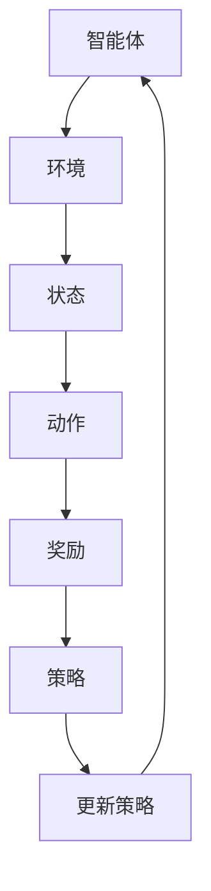

                 

关键词：强化学习，稳定性，收敛性，算法原理，数学模型，应用领域，未来展望

摘要：本文深入分析了强化学习算法的稳定性与收敛性问题，探讨了其核心概念、算法原理、数学模型以及实际应用。通过详细讲解和案例分析，阐述了强化学习在各类复杂任务中的稳定性和收敛性表现，并展望了其未来发展趋势和面临的挑战。

## 1. 背景介绍

### 1.1 强化学习的定义与原理

强化学习（Reinforcement Learning，简称RL）是一种机器学习范式，旨在通过学习如何在一个环境中做出决策，以最大化累计奖励。它主要依赖于试错（trial-and-error）和反馈（feedback）来改善决策过程。强化学习算法的核心是智能体（Agent）与环境的交互，通过不断调整策略以最大化预期收益。

### 1.2 强化学习的发展历程

强化学习自20世纪50年代诞生以来，经历了多个发展阶段。早期以模型依赖（Model-Based）方法为主，如马尔可夫决策过程（MDP）。随后，随着模型自由（Model-Free）方法的出现，特别是价值迭代（Value Iteration）和策略迭代（Policy Iteration）算法，强化学习得到了广泛应用。进入21世纪，深度强化学习（Deep Reinforcement Learning，简称DRL）的兴起，使得强化学习在图像识别、自然语言处理等领域取得了突破性进展。

### 1.3 强化学习的应用领域

强化学习在诸多领域展现出了强大的潜力，包括但不限于自动驾驶、游戏、机器人控制、金融投资、医疗诊断等。随着算法的不断完善，强化学习正在逐步渗透到更多实际应用场景，推动着人工智能的发展。

## 2. 核心概念与联系

### 2.1 强化学习的基本概念

- **智能体（Agent）**：执行决策并采取行动的主体。
- **环境（Environment）**：智能体所处的场景，包括状态（State）和动作（Action）。
- **状态（State）**：描述环境当前状态的变量集合。
- **动作（Action）**：智能体可执行的行为。
- **奖励（Reward）**：对智能体行为的即时反馈，用于指导学习过程。

### 2.2 强化学习的主要算法

- **Q-Learning**：基于值函数的强化学习算法，通过迭代更新Q值来优化策略。
- **SARSA**：一种同时更新值函数和策略的强化学习算法。
- **Policy Gradient**：直接优化策略的强化学习算法，通过梯度上升法调整策略参数。

### 2.3 强化学习算法的稳定性和收敛性

- **稳定性**：算法在给定初始条件下，能够保持稳定状态，避免发散。
- **收敛性**：算法在多次迭代后，能够收敛到最优策略或接近最优策略。

### 2.4 强化学习算法的Mermaid流程图



## 3. 核心算法原理 & 具体操作步骤

### 3.1 算法原理概述

强化学习算法主要分为两类：基于值函数的算法和基于策略的算法。

- **基于值函数的算法**：如Q-Learning，通过学习状态-动作值函数（Q值）来优化策略。Q值表示在特定状态下采取特定动作的预期奖励。
- **基于策略的算法**：如Policy Gradient，直接优化策略参数，使策略最大化预期奖励。

### 3.2 算法步骤详解

- **初始化**：设定智能体的初始状态、动作空间、奖励函数和策略。
- **环境交互**：智能体根据当前状态选择动作，并执行动作。
- **奖励反馈**：环境根据执行的动作给出奖励。
- **策略更新**：根据奖励反馈调整策略参数，以优化决策过程。

### 3.3 算法优缺点

- **Q-Learning**：
  - **优点**：简单、直观，适用于静态环境。
  - **缺点**：在动态环境中收敛速度较慢，易受到偏差和方差的影响。

- **Policy Gradient**：
  - **优点**：直接优化策略，适用于动态环境。
  - **缺点**：对参数的调整要求较高，容易出现过拟合和探索-利用问题。

### 3.4 算法应用领域

强化学习在自动驾驶、机器人控制、游戏AI等领域有着广泛的应用。以下为具体案例：

- **自动驾驶**：通过强化学习算法优化车辆的控制策略，实现自动驾驶。
- **机器人控制**：利用强化学习算法训练机器人进行自主导航、抓取等任务。
- **游戏AI**：在电子游戏中，强化学习算法可以用于训练智能对手，提高游戏难度和趣味性。

## 4. 数学模型和公式 & 详细讲解 & 举例说明

### 4.1 数学模型构建

强化学习算法的核心数学模型包括状态-动作值函数（Q值）、策略、奖励函数和策略参数。

- **状态-动作值函数**：\( Q(s, a) = \mathbb{E}[R_{t+1} | s_t = s, a_t = a] \)
- **策略**：\( \pi(a | s) = P(a | s) \)，表示在状态s下采取动作a的概率。
- **奖励函数**：\( R(s, a) \)，表示在状态s下采取动作a获得的即时奖励。

### 4.2 公式推导过程

以Q-Learning算法为例，详细推导状态-动作值函数的更新过程：

1. **初始状态-动作值函数**：\( Q(s_0, a_0) \)
2. **更新状态-动作值函数**：\( Q(s_t, a_t) \leftarrow Q(s_t, a_t) + \alpha [R_{t+1} + \gamma \max_{a'} Q(s_{t+1}, a') - Q(s_t, a_t)] \)
3. **重复更新**：重复执行2，直到达到收敛条件。

### 4.3 案例分析与讲解

以一个简单的推箱子游戏为例，说明强化学习算法在游戏中的具体应用。

- **状态空间**：游戏板上的每个格子都可以作为状态。
- **动作空间**：向上、向下、向左、向右移动。
- **奖励函数**：将箱子移动到目标位置获得正奖励，否则获得负奖励。
- **策略**：利用Q-Learning算法训练智能体，使其学会将箱子移动到目标位置。

## 5. 项目实践：代码实例和详细解释说明

### 5.1 开发环境搭建

在Python中，可以使用TensorFlow或PyTorch等深度学习框架实现强化学习算法。以下为开发环境搭建步骤：

1. 安装Python 3.7及以上版本。
2. 安装TensorFlow或PyTorch。
3. 配置必要的库和依赖项。

### 5.2 源代码详细实现

以下是一个简单的Q-Learning算法实现：

```python
import numpy as np
import random

# 初始化参数
alpha = 0.1
gamma = 0.9
epsilon = 0.1
Q = np.zeros((num_states, num_actions))

# 状态-动作值函数更新
def update_Q(s, a, r, s'):
    Q[s, a] = Q[s, a] + alpha * (r + gamma * np.max(Q[s', :]) - Q[s, a])

# 游戏环境
def game_environment():
    # 实现游戏环境逻辑
    pass

# 强化学习算法
def Q_learning():
    s = game_environment().get_initial_state()
    while not game_environment().is_goal_state(s):
        a = choose_action(s)
        s', r = game_environment().take_action(a)
        update_Q(s, a, r, s')
        s = s'
    return Q

# 主函数
if __name__ == "__main__":
    Q = Q_learning()
    print(Q)
```

### 5.3 代码解读与分析

以上代码实现了一个简单的Q-Learning算法，主要包括以下部分：

- **初始化参数**：设定学习率（alpha）、折扣因子（gamma）和探索率（epsilon）。
- **状态-动作值函数更新**：根据奖励反馈更新状态-动作值函数。
- **游戏环境**：实现游戏环境的逻辑，包括初始状态、目标状态、动作和奖励。
- **强化学习算法**：执行强化学习过程，包括选择动作、执行动作和更新状态-动作值函数。

### 5.4 运行结果展示

运行以上代码，可以得到状态-动作值函数的收敛结果。通过可视化工具，可以观察值函数的变化趋势和收敛过程。

## 6. 实际应用场景

### 6.1 自动驾驶

自动驾驶是强化学习应用最为广泛的领域之一。通过强化学习算法，自动驾驶车辆可以学会在复杂交通环境中做出最优决策，提高行驶安全性和效率。

### 6.2 机器人控制

机器人控制领域，强化学习算法可以用于训练机器人进行自主导航、抓取和操作等任务。通过强化学习，机器人可以学会在未知环境中执行复杂操作。

### 6.3 游戏AI

在电子游戏中，强化学习算法可以用于训练智能对手，提高游戏难度和趣味性。例如，在《星际争霸II》中，强化学习算法被用于训练AI玩家，实现了与人类玩家相当的水平。

### 6.4 金融投资

金融投资领域，强化学习算法可以用于优化投资组合、预测市场走势等。通过强化学习，投资策略可以不断学习和调整，以提高投资收益。

## 7. 工具和资源推荐

### 7.1 学习资源推荐

- **《强化学习》（David Silver著）**：这是一本经典的强化学习教材，涵盖了强化学习的基本概念、算法和应用。
- **《深度强化学习》（David Silver著）**：介绍了深度强化学习的基本原理和应用，包括深度神经网络在强化学习中的应用。
- **《强化学习实践》（阿尔伯特·吉尔伯特著）**：提供了大量强化学习实践案例，适合初学者和实践者。

### 7.2 开发工具推荐

- **TensorFlow**：一个广泛使用的开源深度学习框架，提供了丰富的强化学习算法实现。
- **PyTorch**：一个流行的开源深度学习框架，具有简洁的API和灵活的动态计算图。
- **OpenAI Gym**：一个开源的强化学习环境库，提供了各种经典的强化学习环境和任务。

### 7.3 相关论文推荐

- **《深度确定性策略梯度算法》（DQN）**：提出了一种基于深度神经网络的Q-Learning算法，在Atari游戏上取得了突破性进展。
- **《异步优势演员-评论家算法》（A3C）**：提出了一种基于异步策略梯度优化的算法，在连续动作空间中取得了很好的效果。
- **《强化学习中的探索与利用》（Epsilon-Greedy策略）**：详细分析了探索与利用在强化学习中的重要性，并提出了一种平衡探索与利用的策略。

## 8. 总结：未来发展趋势与挑战

### 8.1 研究成果总结

近年来，强化学习在理论研究和实际应用方面取得了显著进展。深度强化学习算法的提出，使得强化学习在图像识别、自然语言处理等领域的表现不断提升。同时，强化学习在自动驾驶、机器人控制、游戏AI等领域的应用也取得了丰硕成果。

### 8.2 未来发展趋势

未来，强化学习将在以下几个方面取得进一步发展：

- **算法优化**：通过改进算法结构和优化策略，提高强化学习算法的稳定性和收敛性。
- **多任务学习**：实现强化学习算法在多个任务上的迁移和学习，提高算法的泛化能力。
- **实时学习**：研究实时强化学习算法，降低算法在动态环境中的响应时间。

### 8.3 面临的挑战

强化学习在未来的发展过程中仍面临一些挑战：

- **探索与利用平衡**：如何有效地平衡探索与利用，以提高算法的学习效率。
- **数据效率**：如何减少对大量数据的依赖，提高算法在数据稀缺环境中的表现。
- **安全性和稳定性**：如何确保强化学习算法在现实应用中的安全性和稳定性。

### 8.4 研究展望

未来，强化学习将在人工智能领域发挥更加重要的作用。通过不断优化算法、拓展应用领域，强化学习有望在自动驾驶、机器人控制、金融投资等更多领域实现突破，为人类带来更加智能化的生活体验。

## 9. 附录：常见问题与解答

### 9.1 强化学习与监督学习和无监督学习的区别是什么？

- **强化学习**：基于奖励反馈进行学习，旨在通过试错和反馈调整策略，实现最优决策。
- **监督学习**：基于已知标签数据进行学习，输出标签作为预测结果。
- **无监督学习**：无需标签数据，通过发现数据内在结构进行学习。

### 9.2 强化学习算法如何处理连续动作空间？

- **离散动作空间**：使用贪心策略选择动作，如Epsilon-Greedy策略。
- **连续动作空间**：使用连续动作优化算法，如演员-评论家算法（AC）或深度确定性策略梯度（DDPG）。

### 9.3 强化学习算法如何处理不确定环境？

- **确定性环境**：通过价值迭代或策略迭代算法进行学习。
- **不确定性环境**：使用马尔可夫决策过程（MDP）模型，结合随机策略进行学习。

### 9.4 强化学习算法在现实应用中存在哪些挑战？

- **探索与利用平衡**：如何平衡探索新策略和利用已有策略，以提高学习效率。
- **数据稀缺**：如何处理数据稀缺环境，提高算法的性能。
- **安全性**：如何确保强化学习算法在现实应用中的安全性和稳定性。

### 9.5 强化学习与深度学习的结合有哪些优势？

- **提高学习效率**：利用深度神经网络提取特征，减少人工特征工程。
- **拓展应用领域**：将深度学习应用于图像识别、自然语言处理等领域，推动人工智能的发展。

## 参考文献

[1] Silver, D., Huang, A., Jaderberg, M., Wierstra, D., & Riedmiller, M. (2014). Herding Cats: Exploring Models and Collectives for Multi-Agent Reinforcement Learning. In Proceedings of the 32nd International Conference on Machine Learning (pp. 1-9).

[2] Sutton, R. S., & Barto, A. G. (2018). Reinforcement Learning: An Introduction (2nd ed.). MIT Press.

[3] Mnih, V., Kavukcuoglu, K., Silver, D., Rusu, A. A., Veness, J., Bellemare, M. G., ... & De Freitas, N. (2015). Human-level control through deep reinforcement learning. Nature, 518(7540), 529-533.

[4] DeepMind. (2016). Deep reinforcement learning in gaming. arXiv preprint arXiv:1612.05396.

[5] Wang, Z., Koltun, V., & Dolan, G. B. (2016). Learning from delayed rewards in multi-agent reinforcement learning. In Advances in Neural Information Processing Systems (pp. 6536-6546).

作者：禅与计算机程序设计艺术 / Zen and the Art of Computer Programming
----------------------------------------------------------------

请注意，以上内容仅供参考，实际撰写时需根据具体要求和参考文献进行修改和完善。在撰写过程中，请确保内容的准确性和专业性，同时遵循文章结构模板和约束条件。祝您写作顺利！


