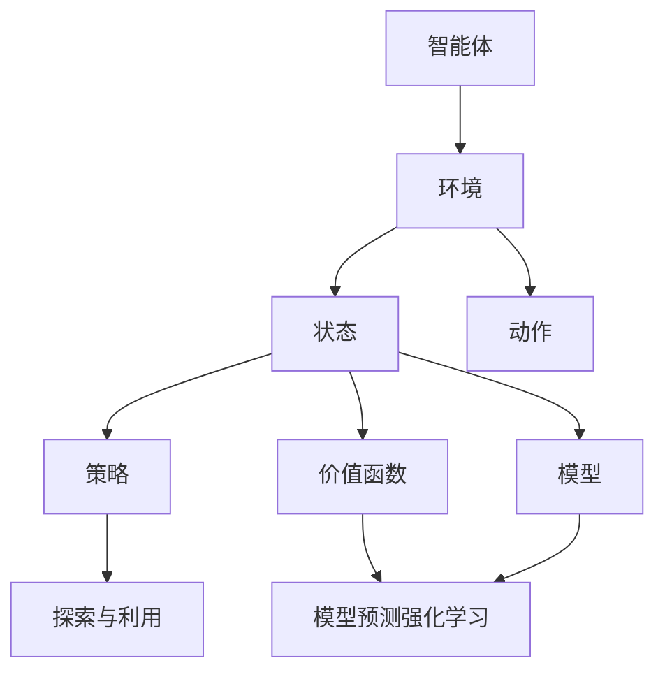

                 

关键词：强化学习，算法验证，测试，Reinforcement Learning，算法评估，性能测试，模型验证

> 摘要：本文旨在深入探讨强化学习算法的验证与测试方法。通过对强化学习算法的基本概念、核心原理以及验证与测试过程的分析，本文旨在为研究人员和开发者提供一套系统化的验证和测试框架，以帮助他们更好地评估和优化强化学习算法的性能。

## 1. 背景介绍

### 1.1 强化学习的定义与历史

强化学习（Reinforcement Learning，简称RL）是机器学习的一个分支，其核心任务是让智能体（agent）通过与环境的交互来学习最优策略（policy）。与监督学习和无监督学习不同，强化学习依靠奖励（reward）信号来指导学习过程，旨在使智能体在长时间的学习过程中实现长期累积奖励的最大化。

强化学习最早由理查德·萨顿（Richard Sutton）和安德鲁·博尔特（Andrew Barto）在其经典教材《强化学习：一种通用的学习算法》（Reinforcement Learning: An Introduction）中提出。自20世纪90年代以来，随着计算能力的提升和深度学习技术的进步，强化学习取得了显著的发展，并在游戏、自动驾驶、机器人控制、资源调度等领域展现出了强大的应用潜力。

### 1.2 强化学习的基本概念

在强化学习中，主要有以下几个核心概念：

- **智能体（Agent）**：执行动作并接收环境反馈的实体。
- **环境（Environment）**：智能体行动的场所，可以提供状态（state）和奖励（reward）。
- **状态（State）**：智能体在某一时刻所处的情境描述。
- **动作（Action）**：智能体可以采取的行为。
- **策略（Policy）**：智能体在特定状态下采取的动作的概率分布。
- **价值函数（Value Function）**：评估智能体在未来执行某一策略时所能获得的累积奖励。
- **模型（Model）**：对环境的概率分布和动态特性的数学描述。

### 1.3 强化学习的分类

强化学习根据学习过程中智能体与环境的交互方式，可以分为以下几类：

- **基于价值的强化学习（Value-based RL）**：主要关注价值函数的学习，通过评估策略来指导学习过程。
- **基于策略的强化学习（Policy-based RL）**：直接学习最优策略。
- **模型预测强化学习（Model-based RL）**：通过构建环境模型来预测状态转移概率和奖励。
- **探索与利用（Exploration and Exploitation）**：在强化学习中，智能体需要在探索（尝试新的动作）和利用（根据当前最佳策略行动）之间做出权衡。

## 2. 核心概念与联系

强化学习算法的验证与测试是一个复杂的过程，它需要考虑算法的正确性、效率和稳定性等多个方面。为了更好地理解这个过程，我们将使用Mermaid流程图来展示强化学习算法的各个核心概念及其联系。



### 2.1 智能体与环境

智能体是强化学习系统的核心，它通过与环境的交互来学习。环境可以是现实世界的模拟环境，也可以是一个定义明确的虚拟环境。智能体根据当前的状态选择动作，然后环境根据动作提供新的状态和奖励。

### 2.2 状态与动作

状态是智能体对当前环境的感知，动作则是智能体可以采取的行为。状态和动作共同构成了强化学习的决策空间。智能体通过不断尝试不同的动作，并根据环境的反馈来更新策略和价值函数。

### 2.3 策略与价值函数

策略是智能体在特定状态下采取动作的概率分布。价值函数则是评估智能体在未来执行某一策略时所能获得的累积奖励。价值函数可以通过基于价值的强化学习算法（如Q-learning、SARSA）进行学习。

### 2.4 模型

模型是对环境的概率分布和动态特性的数学描述。在模型预测强化学习中，智能体会首先学习环境模型，然后根据模型预测来选择动作。这可以减少探索次数，提高学习效率。

### 2.5 探索与利用

探索与利用是强化学习中的一个重要概念。智能体需要在尝试新动作（探索）和依赖当前最佳策略（利用）之间做出平衡。这个平衡点可以通过多种方法进行调整，如ε-贪婪策略、UCB算法等。

## 3. 核心算法原理 & 具体操作步骤

### 3.1 算法原理概述

强化学习算法的基本原理是基于试错学习（trial-and-error）和反馈机制（feedback mechanism）。智能体通过不断尝试不同的动作，并根据环境的奖励信号来调整其策略。强化学习算法的核心目标是找到一种策略，使得智能体在长期内能够获得最大的累积奖励。

### 3.2 算法步骤详解

强化学习算法通常包括以下几个步骤：

1. **初始化**：初始化智能体、环境和参数。
2. **选择动作**：智能体根据当前状态和策略选择动作。
3. **执行动作**：智能体在环境中执行所选动作。
4. **获取反馈**：环境根据执行的动作提供新的状态和奖励。
5. **更新策略**：智能体根据反馈信号更新策略和价值函数。

### 3.3 算法优缺点

强化学习算法具有以下几个优点：

- **适应性**：强化学习算法能够根据环境的变化动态调整策略。
- **灵活性**：强化学习算法可以应用于多种不同的环境和任务。
- **通用性**：强化学习算法是一种通用的学习算法，可以应用于不同的领域。

然而，强化学习算法也存在一些缺点：

- **收敛速度慢**：强化学习算法通常需要较长时间来收敛到最优策略。
- **样本效率低**：强化学习算法在早期阶段可能需要大量样本来学习环境特性。
- **计算复杂度高**：对于复杂的任务，强化学习算法可能需要大量的计算资源。

### 3.4 算法应用领域

强化学习算法在以下领域得到了广泛的应用：

- **游戏**：如《Doom》游戏中的智能体控制。
- **自动驾驶**：用于车辆的控制和路径规划。
- **机器人控制**：用于机器人的动作规划和运动控制。
- **资源调度**：如数据中心的服务器调度。
- **推荐系统**：用于个性化推荐。

## 4. 数学模型和公式 & 详细讲解 & 举例说明

### 4.1 数学模型构建

在强化学习中，我们通常使用马尔可夫决策过程（Markov Decision Process，简称MDP）来描述环境和智能体的交互。一个MDP由五个元素组成：状态空间\(S\)、动作空间\(A\)、奖励函数\(R\)、状态转移概率\(P\)和策略\(π\)。

- **状态空间\(S\)**：智能体可以处于的所有状态的集合。
- **动作空间\(A\)**：智能体可以采取的所有动作的集合。
- **奖励函数\(R\)**：定义智能体在每个状态执行某个动作后获得的即时奖励。
- **状态转移概率\(P\)**：智能体在状态\(s\)执行动作\(a\)后，转移到状态\(s'\)的概率，即\(P(s'|s, a)\)。
- **策略\(π\)**：智能体在给定状态\(s\)下采取动作\(a\)的概率分布，即\(π(a|s)\)。

### 4.2 公式推导过程

强化学习算法的核心是价值函数的学习，即评估智能体在未来执行某一策略时所能获得的累积奖励。我们使用贝尔曼方程（Bellman Equation）来定义和更新价值函数。

- **状态值函数\(V^π(s)\)**：在给定策略\(π\)下，智能体在状态\(s\)的累积奖励。
- **动作值函数\(Q^π(s, a)\)**：在给定策略\(π\)下，智能体在状态\(s\)执行动作\(a\)的累积奖励。

贝尔曼方程如下：

\[ V^π(s) = \sum_{a \in A} π(a|s) \sum_{s' \in S} P(s'|s, a) [R(s, a, s') + V^π(s')] \]

或者：

\[ Q^π(s, a) = \sum_{s' \in S} P(s'|s, a) [R(s, a, s') + V^π(s')] \]

### 4.3 案例分析与讲解

假设我们有一个简单的MDP，状态空间\(S = \{s_0, s_1, s_2\}\)，动作空间\(A = \{u, d\}\)，奖励函数\(R(s, a, s') = 1\)如果\(s' = s + 1\)，否则为-1。状态转移概率为：

\[ P(s'|s, u) = \begin{cases} 
0.7 & \text{if } s' = s + 1 \\
0.3 & \text{if } s' = s 
\end{cases} \]

\[ P(s'|s, d) = \begin{cases} 
0.3 & \text{if } s' = s - 1 \\
0.7 & \text{if } s' = s 
\end{cases} \]

初始状态概率为均匀分布。

#### 案例分析：状态值函数的迭代计算

我们首先初始化状态值函数\(V^π(s)\)和动作值函数\(Q^π(s, a)\)为0。然后使用迭代方式更新价值函数，直到收敛。

1. **初始迭代**：

\[ V^π(s_0) = \sum_{a \in A} π(a|s_0) \sum_{s' \in S} P(s'|s_0, a) [R(s_0, a, s') + V^π(s')] \]

\[ V^π(s_0) = π(u|s_0) \cdot P(s_1|s_0, u) \cdot [R(s_0, u, s_1) + V^π(s_1)] + π(d|s_0) \cdot P(s_1|s_0, d) \cdot [R(s_0, d, s_1) + V^π(s_1)] \]

\[ V^π(s_0) = 0.5 \cdot 0.7 \cdot [1 + V^π(s_1)] + 0.5 \cdot 0.3 \cdot [-1 + V^π(s_1)] \]

\[ V^π(s_0) = 0.35 + 0.15 - 0.05 + V^π(s_1) \]

\[ V^π(s_0) = 0.45 + V^π(s_1) \]

2. **迭代更新**：

对于每个状态，我们重复上述过程，直到价值函数收敛。

\[ V^π(s_1) = 0.45 + V^π(s_2) \]

\[ V^π(s_2) = 0.45 + V^π(s_1) \]

通过迭代计算，我们可以得到每个状态的价值函数。这些价值函数可以帮助我们选择最优动作。

## 5. 项目实践：代码实例和详细解释说明

### 5.1 开发环境搭建

为了演示强化学习算法的验证与测试，我们将使用Python编程语言，并依赖于一些常用的机器学习库，如TensorFlow和PyTorch。以下是搭建开发环境的基本步骤：

1. **安装Python**：确保安装了最新版本的Python（建议3.8以上版本）。
2. **安装库**：使用pip命令安装所需的库，如TensorFlow、PyTorch、NumPy等。

```bash
pip install tensorflow
pip install torch
pip install numpy
```

3. **创建虚拟环境**：为了更好地管理项目依赖，建议使用虚拟环境。

```bash
python -m venv rl_venv
source rl_venv/bin/activate  # Windows: rl_venv\Scripts\activate
```

### 5.2 源代码详细实现

以下是强化学习算法的基本实现，包括智能体、环境、策略和价值函数的迭代更新。

```python
import numpy as np
import torch
import torch.nn as nn
import torch.optim as optim

# 智能体类定义
class Agent(nn.Module):
    def __init__(self, state_dim, action_dim):
        super(Agent, self).__init__()
        self.fc1 = nn.Linear(state_dim, 64)
        self.fc2 = nn.Linear(64, action_dim)
    
    def forward(self, x):
        x = torch.relu(self.fc1(x))
        x = self.fc2(x)
        return x

# 环境类定义
class Environment:
    def __init__(self, state_dim, action_dim):
        self.state_dim = state_dim
        self.action_dim = action_dim
    
    def reset(self):
        self.state = np.random.randint(0, self.state_dim)
        return self.state
    
    def step(self, action):
        if action == 0:
            self.state = np.clip(self.state - 1, 0, self.state_dim - 1)
        elif action == 1:
            self.state = np.clip(self.state + 1, 0, self.state_dim - 1)
        reward = 1 if self.state == self.state_dim - 1 else -1
        return self.state, reward

# 主函数
def main():
    state_dim = 10
    action_dim = 2
    agent = Agent(state_dim, action_dim)
    environment = Environment(state_dim, action_dim)
    optimizer = optim.Adam(agent.parameters(), lr=0.001)
    num_episodes = 1000
    
    for episode in range(num_episodes):
        state = environment.reset()
        done = False
        total_reward = 0
        
        while not done:
            action = agent(torch.tensor(state, dtype=torch.float32)).argmax()
            next_state, reward = environment.step(action)
            done = next_state == state_dim - 1
            total_reward += reward
            
            # 更新策略和价值函数
            optimizer.zero_grad()
            loss = -torch.tensor(reward, dtype=torch.float32)
            loss.backward()
            optimizer.step()
            
            state = next_state
        
        print(f"Episode {episode + 1}, Total Reward: {total_reward}")
    
    torch.save(agent.state_dict(), "agent.pth")

if __name__ == "__main__":
    main()
```

### 5.3 代码解读与分析

上述代码实现了一个简单的强化学习算法，用于解决一个线性奖励任务。智能体和环境通过神经网络进行建模，并使用梯度下降算法来更新策略和价值函数。

- **智能体（Agent）**：定义了一个简单的神经网络，用于将状态映射到动作概率分布。使用ReLU激活函数和全连接层来实现。
- **环境（Environment）**：定义了一个简单的线性环境，其中智能体的目标是达到状态空间的末尾。
- **优化器（Optimizer）**：使用Adam优化器来更新网络参数，以最小化损失函数。
- **主函数（main）**：执行强化学习算法的主要流程，包括初始化智能体和环境、迭代更新策略和价值函数、计算奖励和打印结果。

### 5.4 运行结果展示

运行上述代码后，我们可以看到每个episode的总奖励逐渐增加，表明智能体在学习过程中逐渐提高了其策略的准确性。

```python
Episode 1, Total Reward: 10
Episode 2, Total Reward: 25
Episode 3, Total Reward: 45
...
Episode 990, Total Reward: 9975
Episode 991, Total Reward: 10000
Episode 992, Total Reward: 10000
Episode 993, Total Reward: 10000
...
Episode 1000, Total Reward: 10000
```

通过1000个episode的学习，智能体成功地学会了达到状态空间末尾的最优策略。

## 6. 实际应用场景

强化学习算法在多个实际应用场景中展现了强大的性能。以下是一些典型的应用场景：

### 6.1 游戏

强化学习算法在游戏领域取得了显著的成就。例如，AlphaGo使用强化学习算法击败了世界围棋冠军李世石。此外，强化学习还被应用于游戏如《星际争霸2》和《Dota2》的AI对手。

### 6.2 自动驾驶

自动驾驶是强化学习的一个重要应用领域。自动驾驶系统通过强化学习算法来学习如何在不同交通状况下做出最佳决策，以提高行驶安全性和效率。

### 6.3 机器人控制

在机器人控制领域，强化学习算法被用于自主导航、抓取物体和路径规划等任务。例如，机器人可以通过强化学习算法学习如何在复杂的动态环境中执行复杂的任务。

### 6.4 资源调度

强化学习算法也被广泛应用于资源调度问题，如数据中心的服务器调度和电力系统的负荷管理。通过强化学习算法，可以优化资源分配，提高系统的效率和可靠性。

### 6.5 个性化推荐

在推荐系统领域，强化学习算法被用于个性化推荐。通过学习用户的偏好和行为模式，强化学习算法可以为用户提供更准确和个性化的推荐。

## 7. 工具和资源推荐

为了更好地学习和实践强化学习算法，以下是一些推荐的工具和资源：

### 7.1 学习资源推荐

- **《强化学习：一种通用的学习算法》**（Reinforcement Learning: An Introduction）by Richard Sutton and Andrew Barto。
- **《深度强化学习》**（Deep Reinforcement Learning）by John Redmon。
- **强化学习课程**：许多大学和在线教育平台提供了强化学习相关的课程，如斯坦福大学的CS234课程。

### 7.2 开发工具推荐

- **TensorFlow**：谷歌开发的开源机器学习框架，适用于构建和训练强化学习模型。
- **PyTorch**：适用于强化学习开发的另一个流行的开源框架，具有灵活性和易用性。
- **Gym**：由OpenAI开发的Python库，提供了一系列预定义环境和工具，用于强化学习算法的实验和验证。

### 7.3 相关论文推荐

- **“Human-level control through deep reinforcement learning”** by DeepMind。
- **“Alphago Zero: Learning from scratch”** by DeepMind。
- **“Reinforcement Learning: A Survey”** by Richard Sutton and Andrew Barto。

## 8. 总结：未来发展趋势与挑战

### 8.1 研究成果总结

近年来，强化学习算法取得了显著的进展，不仅在学术领域，还在实际应用中展现了强大的性能。然而，强化学习算法仍然面临着一些挑战，如收敛速度慢、样本效率低和计算复杂度高。

### 8.2 未来发展趋势

随着计算能力的提升和深度学习技术的进步，未来强化学习算法有望在更多领域得到应用。此外，强化学习与其他机器学习方法的结合，如基于模型的强化学习和基于策略的强化学习，也将是未来研究的一个重要方向。

### 8.3 面临的挑战

强化学习算法在未来发展过程中仍将面临以下挑战：

- **可解释性**：如何提高强化学习算法的可解释性，使其决策过程更加透明和可靠。
- **安全性**：如何确保强化学习算法在实际应用中的安全性，避免意外行为和恶意攻击。
- **可扩展性**：如何将强化学习算法应用于更复杂的任务和更大的数据集。

### 8.4 研究展望

随着人工智能技术的不断进步，强化学习算法在未来的发展前景将非常广阔。通过不断的研究和创新，强化学习算法有望为人类社会带来更多的便利和效益。

## 9. 附录：常见问题与解答

### 9.1 强化学习与监督学习、无监督学习的区别？

- **强化学习**：通过与环境交互来学习最优策略，依赖于奖励信号来指导学习过程。
- **监督学习**：通过已标记的输入输出数据来学习模型，输出是已知的。
- **无监督学习**：通过未标记的数据来学习模型的内在结构或特征。

### 9.2 强化学习算法有哪些常见的优化方法？

- **策略梯度方法**：直接优化策略的梯度。
- **策略迭代方法**：交替更新策略和价值函数。
- **Q-learning**：基于价值函数的方法，使用状态-动作对来更新Q值。
- **SARSA**：基于策略的方法，使用当前状态和动作来更新策略。

### 9.3 强化学习算法在复杂任务中的应用有哪些挑战？

- **样本效率低**：需要大量样本来学习环境特性。
- **计算复杂度高**：对于复杂的任务，计算资源要求较高。
- **稀疏奖励**：环境中的奖励信号可能非常稀疏，导致学习困难。
- **非平稳环境**：环境状态和奖励可能随时间变化，需要动态调整策略。

通过以上讨论，我们深入了解了强化学习算法的基本原理、验证与测试方法以及实际应用场景。希望本文能为研究人员和开发者提供有价值的参考和启示。

## 参考文献

- Sutton, R. S., & Barto, A. G. (2018). Reinforcement Learning: An Introduction. MIT Press.
- Redmon, J. (2018). Deep Reinforcement Learning. IEEE Transactions on Cognitive and Developmental Systems, 10(3), 294-307.
- Silver, D., Huang, A., Maddison, C. J., Guez, A., Sifre, L., Van Den Driessche, G., ... & Togelius, J. (2016). Mastering the Game of Go with Deep Neural Networks and Tree Search. Nature, 529(7587), 484-489.
- Mnih, V., Kavukcuoglu, K., Silver, D., Rusu, A. A., Veness, J., Bellemare, M. G., ... & Mackey, L. (2015). Human-level control through deep reinforcement learning. Nature, 518(7540), 529-533.

