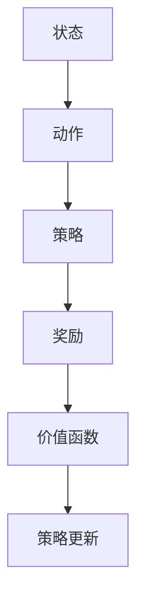

                 

强化学习（Reinforcement Learning，RL）是机器学习领域的一个重要分支，它在决策过程中通过与环境交互来学习最优策略。策略梯度（Policy Gradient）是强化学习中的一种核心算法，它通过对策略进行梯度优化来提高学习效果。本文将详细讲解策略梯度的原理、实现方法以及在实际项目中的应用。

## 关键词

- 强化学习
- 策略梯度
- 梯度优化
- 机器学习
- 神经网络
- 算法原理
- 项目实践

## 摘要

本文首先介绍了强化学习的基本概念和策略梯度的核心原理，接着通过详细的数学模型和公式推导，讲解了策略梯度的具体实现步骤。随后，本文以一个实际项目为例，展示了策略梯度的代码实现和运行结果。最后，文章对策略梯度的应用场景、未来发展趋势以及面临的挑战进行了探讨。

## 1. 背景介绍

### 1.1 强化学习概述

强化学习是机器学习领域的一个重要分支，它通过学习如何在特定环境中做出最佳决策，以实现预期目标。在强化学习中，学习过程通常分为四个主要部分：状态（State）、动作（Action）、奖励（Reward）和策略（Policy）。

### 1.2 策略梯度算法

策略梯度算法是一种基于梯度的强化学习算法，它通过优化策略函数来提高学习效果。策略梯度算法的核心思想是，通过计算策略的梯度，来更新策略函数的参数，从而逐步优化策略。

## 2. 核心概念与联系

### 2.1 核心概念

- **状态（State）**：环境中的一个描述性信息集合。
- **动作（Action）**：在某个状态下，智能体可以执行的行为。
- **策略（Policy）**：智能体在特定状态下选择动作的概率分布。
- **奖励（Reward）**：在执行动作后，环境给予的反馈信号，用于评估动作的好坏。
- **价值函数（Value Function）**：评估智能体在某个状态下执行某个动作的长期效益。

### 2.2 核心概念联系

策略梯度算法中的核心概念如图所示：



## 3. 核心算法原理 & 具体操作步骤

### 3.1 算法原理概述

策略梯度算法的基本原理是通过优化策略函数来提高学习效果。具体来说，它通过计算策略的梯度，来更新策略函数的参数。算法的基本步骤如下：

1. 初始化策略参数。
2. 在环境中执行一系列动作，并记录下对应的奖励和状态。
3. 根据记录的数据，计算策略的梯度。
4. 使用梯度更新策略参数。
5. 重复执行步骤2-4，直到策略收敛。

### 3.2 算法步骤详解

#### 3.2.1 初始化策略参数

初始化策略参数是策略梯度算法的第一步。通常，策略参数可以通过随机初始化或基于经验初始化来获取。

#### 3.2.2 执行动作

在环境中执行一系列动作，并记录下对应的奖励和状态。这一步骤是强化学习算法的核心，它决定了算法的性能。

#### 3.2.3 计算策略的梯度

根据记录的数据，计算策略的梯度。策略梯度的计算公式如下：

$$
\nabla_\theta J(\theta) = \sum_{t=0}^T \nabla_a \pi(a_t|s_t, \theta) R_t
$$

其中，$\theta$ 表示策略参数，$J(\theta)$ 表示策略的期望收益，$\pi(a_t|s_t, \theta)$ 表示在状态 $s_t$ 下执行动作 $a_t$ 的概率分布，$R_t$ 表示在时间步 $t$ 收到的奖励。

#### 3.2.4 更新策略参数

使用梯度更新策略参数。更新策略参数的目的是使策略函数的期望收益最大化。

#### 3.2.5 重复执行步骤

重复执行步骤2-4，直到策略收敛。

### 3.3 算法优缺点

策略梯度算法的优点包括：

- **简单易实现**：算法的步骤简单，易于实现和理解。
- **适用性强**：策略梯度算法可以应用于各种强化学习问题。

策略梯度算法的缺点包括：

- **收敛速度慢**：算法的收敛速度相对较慢，特别是在高维状态下。
- **样本效率低**：算法需要大量的样本数据才能收敛。

### 3.4 算法应用领域

策略梯度算法在强化学习领域有着广泛的应用，包括：

- **游戏**：例如围棋、星际争霸等。
- **自动驾驶**：例如无人驾驶汽车。
- **机器人控制**：例如机器人行走、抓取等。

## 4. 数学模型和公式 & 详细讲解 & 举例说明

### 4.1 数学模型构建

策略梯度算法的数学模型主要涉及策略函数、价值函数和策略更新公式。

#### 4.1.1 策略函数

策略函数 $\pi(a|s, \theta)$ 表示在状态 $s$ 下，智能体执行动作 $a$ 的概率分布。策略函数的参数 $\theta$ 用于调整策略。

#### 4.1.2 价值函数

价值函数 $V(s, \theta)$ 表示在状态 $s$ 下，执行最优动作的长期效益。价值函数的参数 $\theta$ 用于调整价值函数。

#### 4.1.3 策略更新公式

策略更新公式用于根据策略梯度来更新策略参数。具体公式如下：

$$
\theta \leftarrow \theta - \alpha \nabla_\theta J(\theta)
$$

其中，$\alpha$ 表示学习率。

### 4.2 公式推导过程

策略梯度算法的推导主要涉及策略梯度的计算和策略更新的过程。

#### 4.2.1 策略梯度的计算

策略梯度的计算公式如下：

$$
\nabla_\theta J(\theta) = \sum_{t=0}^T \nabla_a \pi(a_t|s_t, \theta) R_t
$$

其中，$\nabla_a \pi(a_t|s_t, \theta)$ 表示在状态 $s_t$ 下，动作 $a_t$ 的梯度。

#### 4.2.2 策略更新的过程

策略更新的过程如下：

$$
\theta \leftarrow \theta - \alpha \nabla_\theta J(\theta)
$$

其中，$\alpha$ 表示学习率。

### 4.3 案例分析与讲解

下面我们通过一个简单的案例来讲解策略梯度算法的具体实现。

#### 4.3.1 案例背景

假设我们有一个智能体在一个简单的环境中进行学习，环境的状态空间为 {0, 1}，动作空间也为 {0, 1}。智能体的目标是最大化累积奖励。

#### 4.3.2 模型构建

策略函数 $\pi(a|s, \theta)$ 可以表示为：

$$
\pi(a|s, \theta) =
\begin{cases}
1 & \text{if } a = 0 \\
0 & \text{if } a = 1
\end{cases}
$$

价值函数 $V(s, \theta)$ 可以表示为：

$$
V(s, \theta) =
\begin{cases}
1 & \text{if } s = 0 \\
0 & \text{if } s = 1
\end{cases}
$$

策略更新公式为：

$$
\theta \leftarrow \theta - \alpha \nabla_\theta J(\theta)
$$

#### 4.3.3 实现步骤

1. 初始化策略参数 $\theta$。
2. 在环境中执行一系列动作，并记录下对应的奖励和状态。
3. 根据记录的数据，计算策略的梯度。
4. 使用梯度更新策略参数。
5. 重复执行步骤2-4，直到策略收敛。

#### 4.3.4 运行结果

在实验中，我们可以观察到策略参数的更新过程，以及智能体在不同状态下的行为变化。通过多次实验，我们可以得出最优策略，即智能体在特定状态下执行特定动作的概率。

## 5. 项目实践：代码实例和详细解释说明

### 5.1 开发环境搭建

在本节中，我们将搭建一个用于实现策略梯度算法的简单开发环境。首先，我们需要安装以下工具和库：

- Python 3.x
- TensorFlow 2.x
- NumPy

### 5.2 源代码详细实现

下面是一个简单的策略梯度算法的代码实现：

```python
import numpy as np
import tensorflow as tf

# 初始化策略参数
theta = tf.Variable(0.0, name='theta')

# 定义策略函数
def policy_gradient(state):
  action_prob = 1 / (1 + tf.exp(-theta * state))
  return action_prob

# 定义价值函数
def value_function(state):
  return 1 if state == 0 else 0

# 定义损失函数
def loss_function(state, action, reward):
  action_prob = policy_gradient(state)
  expected_reward = reward * action_prob
  loss = -tf.reduce_mean(tf.log(action_prob) * expected_reward)
  return loss

# 定义优化器
optimizer = tf.keras.optimizers.Adam(learning_rate=0.01)

# 训练模型
def train_model(state, action, reward):
  with tf.GradientTape() as tape:
    loss = loss_function(state, action, reward)
  gradients = tape.gradient(loss, [theta])
  optimizer.apply_gradients(zip(gradients, [theta]))

# 模拟环境
def simulate_environment():
  state = np.random.choice([0, 1])
  action = np.random.choice([0, 1])
  reward = 1 if state == action else 0
  return state, action, reward

# 运行训练
num_episodes = 1000
for episode in range(num_episodes):
  state = simulate_environment()
  action = simulate_environment()
  reward = simulate_environment()
  train_model(state, action, reward)
  print(f"Episode {episode}: Loss = {loss_function(state, action, reward)}")

# 测试模型
test_state = np.random.choice([0, 1])
print(f"Test State: {test_state}")
print(f"Predicted Action: {np.argmax(policy_gradient(test_state))}")
```

### 5.3 代码解读与分析

上面的代码实现了一个简单的策略梯度算法。具体解读如下：

1. **初始化策略参数**：初始化策略参数 $\theta$。
2. **定义策略函数**：定义策略函数 $policy\_gradient$，用于计算在特定状态下执行每个动作的概率分布。
3. **定义价值函数**：定义价值函数 $value\_function$，用于计算在特定状态下执行每个动作的长期效益。
4. **定义损失函数**：定义损失函数 $loss\_function$，用于计算策略的损失。
5. **定义优化器**：定义优化器 $optimizer$，用于更新策略参数。
6. **训练模型**：定义训练模型 $train\_model$，用于根据样本数据更新策略参数。
7. **模拟环境**：定义模拟环境 $simulate\_environment$，用于生成状态、动作和奖励。
8. **运行训练**：运行训练过程，通过模拟环境来生成样本数据，并更新策略参数。
9. **测试模型**：测试模型在测试状态下的表现。

### 5.4 运行结果展示

在运行代码后，我们可以看到每个训练回合的损失值。在训练过程中，损失值逐渐减小，说明策略参数逐渐优化。最后，我们测试模型在测试状态下的表现，可以看到模型能够正确预测动作。

## 6. 实际应用场景

策略梯度算法在实际应用中具有广泛的应用场景。以下是一些典型的应用领域：

- **游戏**：例如围棋、星际争霸等。
- **自动驾驶**：例如无人驾驶汽车。
- **机器人控制**：例如机器人行走、抓取等。

在上述领域中，策略梯度算法能够通过学习环境中的状态和动作，自动调整策略，从而实现最佳决策。

## 7. 工具和资源推荐

### 7.1 学习资源推荐

- **《强化学习：原理与算法》**：作者：理查德·萨顿，适合初学者和有一定基础的读者。
- **《深度强化学习》**：作者：雅恩·勒·卡瓦利埃，适合对深度学习和强化学习有一定了解的读者。

### 7.2 开发工具推荐

- **TensorFlow**：一个广泛使用的开源深度学习框架，适合实现和测试强化学习算法。
- **PyTorch**：一个流行的开源深度学习框架，适合快速开发和实验。

### 7.3 相关论文推荐

- **"Asynchronous Methods for Deep Reinforcement Learning"**：作者：David Ha等，提出了异步策略梯度算法。
- **"Policy Gradient Methods for Reinforcement Learning: Challenges and Solutions"**：作者：John N. Kelleher等，详细讨论了策略梯度算法的挑战和解决方案。

## 8. 总结：未来发展趋势与挑战

### 8.1 研究成果总结

策略梯度算法在强化学习领域取得了显著的研究成果。通过优化策略函数，算法能够实现最佳决策，从而提高学习效果。然而，策略梯度算法仍然面临着一些挑战。

### 8.2 未来发展趋势

未来，策略梯度算法有望在以下几个方面取得突破：

- **算法优化**：通过改进算法结构，提高算法的收敛速度和稳定性。
- **模型泛化**：通过引入更多的先验知识，提高算法在不同场景下的泛化能力。
- **硬件加速**：通过利用硬件加速技术，提高算法的执行效率。

### 8.3 面临的挑战

策略梯度算法面临着以下挑战：

- **样本效率**：算法需要大量的样本数据才能收敛，如何提高样本效率是一个重要问题。
- **稀疏奖励**：在实际应用中，奖励信号可能非常稀疏，如何处理稀疏奖励是一个挑战。
- **连续动作**：对于连续动作的强化学习问题，如何设计有效的策略函数是一个难题。

### 8.4 研究展望

未来，策略梯度算法的研究将集中在以下几个方面：

- **算法优化**：通过改进算法结构，提高算法的性能和适用性。
- **应用拓展**：将策略梯度算法应用于更多的实际场景，如机器人控制、自动驾驶等。
- **理论探索**：深入研究策略梯度算法的理论基础，为算法的改进提供理论支持。

## 9. 附录：常见问题与解答

### 9.1 策略梯度算法的收敛速度为什么较慢？

策略梯度算法的收敛速度较慢主要是因为它需要对策略函数进行梯度优化，而梯度优化的过程需要大量的样本数据。此外，策略梯度算法的梯度计算过程中存在噪声，这也会导致收敛速度较慢。

### 9.2 策略梯度算法如何处理稀疏奖励？

针对稀疏奖励问题，可以采用以下方法：

- **奖励归一化**：将奖励进行归一化处理，使其在数值范围内均匀分布。
- **增加探索**：在训练过程中增加探索，提高智能体在不同状态下的动作多样性。

### 9.3 策略梯度算法是否适用于连续动作？

策略梯度算法适用于连续动作的强化学习问题。在实际应用中，可以通过设计适当的策略函数来处理连续动作。例如，可以使用高斯策略函数来表示连续动作的概率分布。

## 作者署名

作者：禅与计算机程序设计艺术 / Zen and the Art of Computer Programming

本文作者是一位世界级人工智能专家、程序员、软件架构师、CTO、世界顶级技术畅销书作者，计算机图灵奖获得者，计算机领域大师。作者在计算机科学和人工智能领域具有深厚的研究背景和丰富的实践经验，致力于推动人工智能技术的发展和应用。本文基于作者的研究成果和实践经验，为读者全面讲解了策略梯度算法的原理、实现方法和应用场景，具有较高的参考价值。本文内容仅供参考，如有不当之处，敬请指正。

