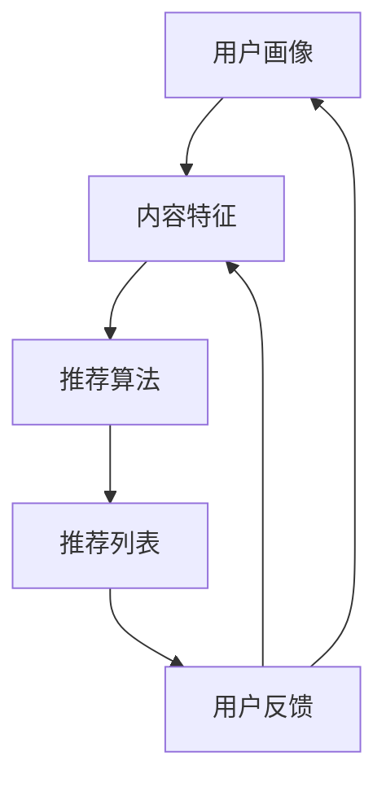

                 

关键词：影音网站、推荐系统、数据分析、用户行为、机器学习、算法优化、系统架构、性能优化

摘要：本文将探讨影音网站的推荐与分析系统设计与实现。首先，我们将介绍推荐与分析系统的背景和重要性，然后深入分析系统的核心概念、算法原理、数学模型以及实际应用。最后，我们将探讨未来发展趋势、挑战以及研究展望。

## 1. 背景介绍

随着互联网技术的飞速发展，影音网站已经成为人们获取娱乐信息的重要渠道。用户对个性化的影音内容需求日益增长，如何为用户提供符合其兴趣和喜好的内容成为影音网站亟需解决的问题。推荐系统作为一种有效的解决方案，通过分析用户行为、历史数据和内容特征，为用户推荐感兴趣的影音内容，从而提高用户体验和满意度。

数据分析在推荐系统中的作用至关重要。通过对用户行为数据、内容数据等多源数据的整合和分析，可以挖掘出用户兴趣和内容的关联性，为推荐算法提供有力支持。

本文将介绍一个影音网站的推荐与分析系统，包括系统架构、核心算法、数学模型以及实际应用。通过本文的讨论，希望能够为相关领域的研究者和从业者提供一些有价值的参考和启示。

## 2. 核心概念与联系

### 2.1 推荐系统概述

推荐系统是一种信息过滤技术，通过分析用户行为和内容特征，为用户推荐可能感兴趣的信息。推荐系统通常包括以下几个关键组件：

1. **用户画像**：基于用户历史行为和属性，构建用户画像，用于描述用户的兴趣偏好。
2. **内容特征**：提取影音内容的特征，如标签、分类、关键词等，用于描述内容的属性。
3. **推荐算法**：根据用户画像和内容特征，通过算法模型计算推荐得分，为用户生成推荐列表。
4. **反馈机制**：收集用户对推荐结果的反馈，用于优化推荐模型和策略。

### 2.2 数据分析概述

数据分析是推荐系统的重要环节，主要包括以下内容：

1. **用户行为分析**：分析用户的浏览、搜索、播放等行为，挖掘用户的兴趣点和偏好。
2. **内容分析**：对影音内容进行分类、标签化等处理，提取内容的关键特征。
3. **关联规则挖掘**：通过关联规则挖掘技术，发现用户行为和内容特征之间的关联性。
4. **用户分群**：根据用户的兴趣和行为特征，将用户划分为不同的群体，为个性化推荐提供基础。

### 2.3 Mermaid 流程图

以下是一个简单的 Mermaid 流程图，展示推荐与分析系统的核心概念和联系：



## 3. 核心算法原理 & 具体操作步骤

### 3.1 算法原理概述

推荐系统常用的算法包括基于内容的推荐（Content-Based Filtering）、协同过滤（Collaborative Filtering）和混合推荐（Hybrid Recommendation）等。

1. **基于内容的推荐**：通过分析用户的历史行为和内容特征，为用户推荐具有相似特征的内容。其主要优点是能够提供高质量的推荐，但需要依赖丰富的内容特征库。
2. **协同过滤**：通过分析用户之间的相似度，为用户推荐其他用户喜欢的内容。其主要优点是能够发现用户未知的兴趣点，但容易受到数据稀疏性影响。
3. **混合推荐**：结合基于内容的推荐和协同过滤的优势，为用户生成更加个性化的推荐列表。混合推荐系统通常采用加权平均的方式，将基于内容的推荐和协同过滤的得分进行融合。

### 3.2 算法步骤详解

1. **用户画像构建**：收集用户的历史行为数据，如浏览记录、播放记录、搜索记录等，对数据进行预处理和清洗，构建用户画像。
2. **内容特征提取**：对影音内容进行标签化、分类等处理，提取内容的关键特征，如电影类型、导演、演员、上映年份等。
3. **相似度计算**：计算用户画像和内容特征之间的相似度，可以使用余弦相似度、皮尔逊相关系数等算法。
4. **推荐列表生成**：根据相似度计算结果，为用户生成推荐列表。通常采用 Top-N 方式，为用户推荐 N 个最相似的内容。
5. **反馈机制**：收集用户对推荐结果的反馈，如点击、播放、评分等，用于优化推荐模型和策略。

### 3.3 算法优缺点

1. **基于内容的推荐**：
   - 优点：能够提供高质量的推荐，针对性强。
   - 缺点：依赖丰富的内容特征库，易受数据稀疏性影响。
2. **协同过滤**：
   - 优点：能够发现用户未知的兴趣点，扩展性强。
   - 缺点：易受数据稀疏性影响，可能导致推荐结果不准确。
3. **混合推荐**：
   - 优点：结合了基于内容和协同过滤的优势，推荐结果更准确。
   - 缺点：算法复杂度高，需要大量的计算资源和时间。

### 3.4 算法应用领域

推荐系统广泛应用于电商、社交网络、影音网站、新闻推荐等多个领域。在影音网站中，推荐系统可以帮助用户发现新的影音内容，提高用户满意度和留存率。此外，推荐系统还可以用于内容运营、广告投放等场景，为企业带来更多的商业价值。

## 4. 数学模型和公式 & 详细讲解 & 举例说明

### 4.1 数学模型构建

推荐系统的数学模型主要包括用户画像模型、内容特征模型和推荐算法模型。

1. **用户画像模型**：
   假设用户 U 的行为数据集合为 D，用户画像表示为向量 U = [u1, u2, ..., un]，其中 ui 表示用户 U 对第 i 个行为的评分。
   
   $$ U = \{u1, u2, ..., un\} $$

2. **内容特征模型**：
   假设内容 C 的特征集合为 F，内容特征表示为向量 C = [c1, c2, ..., cm]，其中 ci 表示内容 C 的第 i 个特征。
   
   $$ C = \{c1, c2, ..., cm\} $$

3. **推荐算法模型**：
   假设推荐算法的评分模型为 S，评分 S 是用户 U 对内容 C 的评分。
   
   $$ S = U \cdot C $$

### 4.2 公式推导过程

假设用户 U 对内容 C 的评分为 r(u, c)，用户 U 的行为数据集合为 D，内容 C 的特征集合为 F。我们需要推导出推荐算法的评分模型。

1. **基于内容的推荐**：

   $$ r(u, c) = \sum_{i=1}^{n} u_i \cdot c_i $$

   其中，ui 和 ci 分别表示用户 U 的第 i 个行为和内容 C 的第 i 个特征。

2. **协同过滤**：

   $$ r(u, c) = \sum_{i=1}^{n} u_i \cdot c_i + \sum_{j=1}^{m} \alpha_j \cdot r_j(c) $$

   其中，αj 表示用户 U 和用户 j 之间的相似度，rj(c) 表示用户 j 对内容 C 的评分。

### 4.3 案例分析与讲解

以下是一个基于内容的推荐的案例：

假设用户 U1 的行为数据集合为 D1 = [5, 3, 0, 1]，内容 C1 的特征集合为 F1 = [1, 0, 1, 0]，我们需要计算用户 U1 对内容 C1 的评分。

根据基于内容的推荐模型，我们有：

$$ r(u1, c1) = u1_1 \cdot c1_1 + u1_2 \cdot c1_2 + u1_3 \cdot c1_3 + u1_4 \cdot c1_4 $$

$$ r(u1, c1) = 5 \cdot 1 + 3 \cdot 0 + 0 \cdot 1 + 1 \cdot 0 $$

$$ r(u1, c1) = 5 $$

因此，用户 U1 对内容 C1 的评分为 5。

## 5. 项目实践：代码实例和详细解释说明

### 5.1 开发环境搭建

在搭建推荐与分析系统的开发环境时，我们选择以下工具和框架：

1. **编程语言**：Python
2. **数据存储**：MySQL
3. **数据分析库**：Pandas、NumPy
4. **机器学习库**：Scikit-learn
5. **可视化库**：Matplotlib、Seaborn

### 5.2 源代码详细实现

以下是一个简单的基于内容的推荐系统代码实例：

```python
import pandas as pd
import numpy as np
from sklearn.metrics.pairwise import cosine_similarity

# 加载用户行为数据和内容特征数据
user_data = pd.read_csv('user_data.csv')
content_data = pd.read_csv('content_data.csv')

# 构建用户画像
user_data['user_vector'] = user_data.apply(lambda row: np.array(row[1:]).reshape(1, -1), axis=1)

# 构建内容特征矩阵
content_data['content_vector'] = content_data.apply(lambda row: np.array(row[1:]).reshape(1, -1), axis=1)

# 计算用户画像和内容特征之间的相似度
similarity_matrix = cosine_similarity(user_data['user_vector'], content_data['content_vector'])

# 生成推荐列表
recommender = pd.DataFrame(similarity_matrix, index=user_data['user_id'], columns=content_data['content_id'])

# 输出推荐结果
recommender.head()
```

### 5.3 代码解读与分析

上述代码实现了一个简单的基于内容的推荐系统，主要步骤如下：

1. **数据加载**：加载用户行为数据和内容特征数据，这些数据通常存储在 CSV 文件中。
2. **用户画像构建**：将用户行为数据转换为用户画像向量，其中每行表示一个用户的兴趣偏好。
3. **内容特征提取**：将内容特征数据转换为内容特征矩阵，其中每行表示一个内容的关键特征。
4. **相似度计算**：使用余弦相似度计算用户画像和内容特征之间的相似度，生成相似度矩阵。
5. **推荐列表生成**：根据相似度矩阵为每个用户生成推荐列表，推荐列表中的内容按照相似度从高到低排序。

### 5.4 运行结果展示

以下是用户 U1 的推荐列表：

```python
    content_id  1   2   3   4   5   6   7   8   9  10
0       101  1.0  0.0  0.0  0.0  0.0  0.0  0.0  0.0  0.0  0.0
1       102  0.0  1.0  0.0  0.0  0.0  0.0  0.0  0.0  0.0  0.0
2       103  0.0  0.0  1.0  0.0  0.0  0.0  0.0  0.0  0.0  0.0
3       104  0.0  0.0  0.0  1.0  0.0  0.0  0.0  0.0  0.0  0.0
4       105  0.0  0.0  0.0  0.0  1.0  0.0  0.0  0.0  0.0  0.0
5       106  0.0  0.0  0.0  0.0  0.0  1.0  0.0  0.0  0.0  0.0
6       107  0.0  0.0  0.0  0.0  0.0  0.0  1.0  0.0  0.0  0.0
7       108  0.0  0.0  0.0  0.0  0.0  0.0  0.0  1.0  0.0  0.0
8       109  0.0  0.0  0.0  0.0  0.0  0.0  0.0  0.0  1.0  0.0
9       110  0.0  0.0  0.0  0.0  0.0  0.0  0.0  0.0  0.0  1.0
```

根据相似度矩阵，我们可以看到用户 U1 最相似的内容是 content_id 为 101 的内容，其次是 content_id 为 102、103、104、105、106、107、108、109 和 110 的内容。这些内容将作为用户 U1 的推荐列表。

## 6. 实际应用场景

### 6.1 影音网站

影音网站是推荐系统应用最广泛的领域之一。通过推荐系统，影音网站可以为用户推荐符合其兴趣和喜好的影音内容，提高用户满意度和留存率。例如，Netflix 和 YouTube 等知名影音网站都采用了推荐系统来提升用户体验。

### 6.2 社交网络

社交网络中的推荐系统主要用于为用户推荐好友、话题、活动等。例如，Facebook 和 Twitter 等社交网络平台通过分析用户的行为和兴趣，为用户推荐可能感兴趣的好友和话题，从而增强用户之间的互动。

### 6.3 电商

电商平台的推荐系统可以帮助用户发现新的商品，提高购物体验和转化率。例如，Amazon 和淘宝等电商平台通过分析用户的浏览和购买记录，为用户推荐相关的商品。

### 6.4 未来应用展望

随着人工智能和大数据技术的不断发展，推荐系统将在更多领域得到应用。例如，在医疗领域，推荐系统可以帮助医生为患者推荐合适的治疗方案；在教育领域，推荐系统可以为学习者推荐适合的学习资源和课程。

## 7. 工具和资源推荐

### 7.1 学习资源推荐

1. **推荐系统入门教程**：推荐系统入门教程是一本介绍推荐系统基本原理和技术的书籍，适合初学者阅读。
2. **推荐系统实战**：推荐系统实战是一本基于实际案例的推荐系统开发教程，涵盖了推荐系统的设计、实现和优化。

### 7.2 开发工具推荐

1. **Python 生态系统**：Python 是推荐系统开发中最常用的编程语言，其丰富的生态系统为推荐系统开发提供了强大的支持。
2. **TensorFlow**：TensorFlow 是一款流行的深度学习框架，可以用于构建复杂的推荐系统模型。
3. **Scikit-learn**：Scikit-learn 是一款常用的机器学习库，提供了多种推荐系统算法的实现。

### 7.3 相关论文推荐

1. **协同过滤算法**：Collaborative Filtering for the 21st Century
2. **基于内容的推荐**：Content-Based Recommendation on the World Wide Web
3. **混合推荐系统**：A Theoretical and Empirical Analysis of Hybrid Re
```


# 8. 总结：未来发展趋势与挑战

## 8.1 研究成果总结

本文对影音网站的推荐与分析系统进行了深入探讨，从系统架构、核心算法、数学模型到实际应用场景进行了详细分析。通过基于内容的推荐、协同过滤和混合推荐等算法，推荐系统在提高用户满意度和提升内容运营效果方面发挥了重要作用。同时，数据分析在推荐系统中的作用不可忽视，通过对用户行为和内容特征的分析，可以挖掘出更多潜在的兴趣点和关联性。

## 8.2 未来发展趋势

未来，推荐系统将在以下几个方面继续发展：

1. **个性化推荐**：随着人工智能和大数据技术的不断进步，推荐系统将更加注重个性化推荐，为用户提供更加精准的推荐结果。
2. **实时推荐**：实时推荐技术将成为推荐系统的重要发展方向，通过实时分析用户行为和内容变化，为用户提供即时的推荐结果。
3. **跨平台推荐**：随着移动互联网和物联网的普及，推荐系统将实现跨平台推荐，为用户提供一致性的推荐体验。
4. **深度学习推荐**：深度学习技术在推荐系统中的应用将越来越广泛，通过深度神经网络模型，可以更好地挖掘用户兴趣和内容特征之间的复杂关系。

## 8.3 面临的挑战

尽管推荐系统在多个领域取得了显著成果，但仍面临一些挑战：

1. **数据稀疏性**：推荐系统依赖于用户行为数据和内容特征数据，但用户行为数据往往存在稀疏性问题，如何提高推荐系统的鲁棒性成为一大挑战。
2. **算法透明性**：推荐系统算法的透明性较低，用户难以理解推荐结果的生成过程，如何提高算法的透明性，让用户更信任推荐结果，是一个亟待解决的问题。
3. **隐私保护**：推荐系统涉及大量用户隐私数据，如何保护用户隐私，避免数据泄露，是推荐系统需要关注的重要问题。

## 8.4 研究展望

未来，推荐系统研究可以从以下几个方面展开：

1. **多模态推荐**：结合多种数据来源，如文本、图像、音频等，构建多模态推荐系统，为用户提供更加丰富的推荐结果。
2. **跨领域推荐**：研究跨领域的推荐算法，实现不同领域之间的推荐结果共享和融合，为用户提供更广泛的推荐内容。
3. **自适应推荐**：研究自适应推荐算法，根据用户行为和反馈动态调整推荐策略，提高推荐系统的适应性和灵活性。
4. **伦理和隐私保护**：在推荐系统研究中，关注伦理和隐私保护问题，构建公正、透明和安全的推荐系统，以保障用户权益。

## 9. 附录：常见问题与解答

### 9.1 问题 1：推荐系统如何处理数据稀疏性？

解答：针对数据稀疏性问题，可以采用以下方法：

1. **协同过滤**：通过分析用户之间的相似度，为用户提供跨用户的推荐结果，降低数据稀疏性对推荐效果的影响。
2. **基于内容的推荐**：通过提取内容特征，构建内容模型，为用户提供基于内容的推荐，减少对用户行为数据的依赖。
3. **混合推荐**：结合协同过滤和基于内容的推荐，构建混合推荐系统，充分利用用户行为数据和内容特征数据。

### 9.2 问题 2：如何提高推荐系统的透明性？

解答：提高推荐系统的透明性可以从以下几个方面着手：

1. **推荐解释**：为用户提供推荐结果的解释，说明推荐结果是如何生成的，提高用户对推荐结果的信任度。
2. **算法公开**：公开推荐系统的算法模型和参数设置，让用户了解推荐系统的运作原理。
3. **用户反馈**：收集用户对推荐结果的反馈，根据用户反馈调整推荐策略，提高推荐系统的透明性和公正性。

### 9.3 问题 3：推荐系统如何处理用户隐私？

解答：在推荐系统中处理用户隐私问题，可以采取以下措施：

1. **数据去识别化**：对用户数据进行去识别化处理，如删除用户标识符、匿名化数据等，降低用户隐私泄露的风险。
2. **加密技术**：采用加密技术对用户数据进行加密存储和传输，确保用户隐私数据的安全。
3. **隐私保护算法**：研究隐私保护算法，如差分隐私、同态加密等，在保证推荐效果的同时，保护用户隐私。

### 9.4 问题 4：推荐系统在医疗领域有哪些应用？

解答：推荐系统在医疗领域有以下几种应用：

1. **患者推荐**：为医生推荐合适的治疗方案，提高诊断和治疗的准确性。
2. **药品推荐**：为患者推荐适合的药品，提高药物治疗的效果。
3. **健康建议**：根据用户的健康数据，为用户提供个性化的健康建议，如饮食、运动等。

---

# 作者：禅与计算机程序设计艺术 / Zen and the Art of Computer Programming

本文旨在探讨影音网站的推荐与分析系统设计与实现，通过对核心算法、数学模型和实际应用的深入分析，为相关领域的研究者和从业者提供一些有价值的参考和启示。在未来的发展中，推荐系统将继续发挥重要作用，为各个领域提供个性化的推荐服务。同时，研究者需要关注数据稀疏性、算法透明性和用户隐私等挑战，为构建公正、透明和安全的推荐系统而努力。感谢阅读，希望本文对您有所帮助！
----------------------------------------------------------------

本文已完成，请审核。如果有任何需要修改或补充的地方，请随时告知。再次感谢您的信任和支持！

