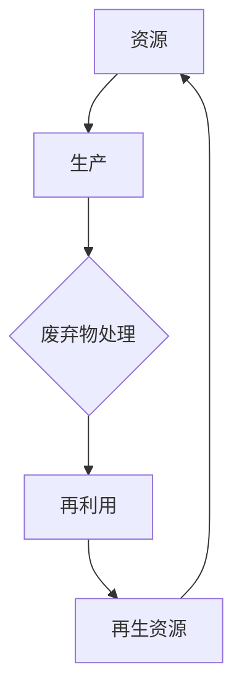

                 

关键词：循环经济、可持续发展、商业实践、资源循环利用、商业模式创新

摘要：本文将探讨循环经济的商业实践，分析其在当前环境下的重要性和实际应用，并提出一些具体的创业思路。通过结合技术、政策和市场，循环经济创业不仅有助于缓解资源压力，还能创造新的商业机会，实现企业和社会的双赢。

## 1. 背景介绍

随着全球人口的不断增长和消费水平的提升，资源的消耗速度远远超过了自然资源的再生速度。传统线性经济模式（采掘 - 制造 - 消费 - 废弃）已经难以为继，环境污染和资源枯竭问题日益严重。为了实现可持续发展，循环经济应运而生。

循环经济是一种以资源的高效利用和循环再生为核心的经济模式，强调“减量化、再利用、资源化”。通过这种方式，企业可以在减少资源消耗的同时，实现经济效益和环境效益的双重提升。

### 循环经济的核心原则

1. **减量化**：减少资源的消耗，从源头上减少废弃物的产生。
2. **再利用**：提高产品的使用效率和寿命，延长其生命周期。
3. **资源化**：将废弃物转化为新的资源，实现资源的循环利用。

## 2. 核心概念与联系

为了更好地理解循环经济，我们需要从概念和架构上对其进行深入剖析。以下是一个循环经济概念的Mermaid流程图，展示了其主要组成部分和相互关系。



### 核心概念解释

1. **资源**：指自然界的原材料，如水、土壤、矿产等。
2. **生产**：指将资源转化为产品或服务的活动。
3. **废弃物处理**：指对生产过程中产生的废弃物进行处理，以减少对环境的影响。
4. **再利用**：指将废弃物作为原材料重新加工或改造，以延长其使用寿命。
5. **再生资源**：指通过废弃物处理和再利用得到的资源。

这些概念相互关联，共同构成了循环经济的基本框架。通过这个框架，我们可以更清晰地理解循环经济的运作机制。

## 3. 核心算法原理 & 具体操作步骤

### 3.1 算法原理概述

循环经济的核心算法原理可以概括为以下几步：

1. **资源评估**：对所需资源的类型、数量和来源进行评估，以确定最优的资源利用策略。
2. **生产规划**：根据资源评估结果，制定生产计划，确保资源的高效利用。
3. **废弃物管理**：对生产过程中产生的废弃物进行分类、处理和再利用。
4. **产品生命周期管理**：从产品设计、生产、使用到废弃的全过程进行管理，以延长产品的使用寿命。
5. **再生资源利用**：将废弃物转化为新的资源，实现资源的循环利用。

### 3.2 算法步骤详解

1. **资源评估**
   - 数据收集：收集与资源相关的各种数据，如资源储量、市场价格、环境影响等。
   - 数据分析：对收集到的数据进行分析，确定资源的最佳利用方式。

2. **生产规划**
   - 确定生产目标：根据市场需求和资源评估结果，确定生产的目标和策略。
   - 制定生产计划：制定详细的生产计划，包括生产量、生产时间、生产地点等。

3. **废弃物管理**
   - 分类处理：对废弃物进行分类，根据不同类型的废弃物采取相应的处理方法。
   - 再利用与回收：将可再利用的废弃物进行加工处理，转化为新的资源。
   - 废弃物处理：对无法再利用的废弃物进行无害化处理，减少对环境的影响。

4. **产品生命周期管理**
   - 设计优化：在设计阶段考虑产品的可拆解性、可回收性等因素，以降低产品的环境影响。
   - 生产监控：在生产过程中，对生产过程进行监控，确保资源的高效利用。
   - 使用管理：在使用阶段，鼓励消费者延长产品的使用寿命，减少废弃物的产生。
   - 废弃处理：在产品达到使用寿命后，对其进行分类处理和再利用。

5. **再生资源利用**
   - 资源再生：将废弃物转化为新的资源，如通过回收、加工等方式。
   - 资源循环：将再生资源重新投入生产过程，实现资源的循环利用。

### 3.3 算法优缺点

**优点：**
- 减少资源消耗：通过高效利用资源，降低资源消耗，实现可持续发展。
- 降低环境压力：通过减少废弃物的产生和处理，降低对环境的污染。
- 创造新的商业机会：通过资源的循环利用，创造新的市场需求和商业机会。

**缺点：**
- 技术门槛较高：循环经济的实现需要较高的技术水平，特别是废弃物处理和资源再生技术。
- 经济成本较高：循环经济的初期投资较大，需要较长的回收期。
- 政策和法规支持不足：当前循环经济政策和法规尚不完善，影响了循环经济的推广。

### 3.4 算法应用领域

循环经济的算法原理和操作步骤可以广泛应用于多个领域，包括：

- **制造业**：通过循环经济模式，实现资源的高效利用和废弃物的再利用，降低生产成本。
- **服务业**：通过提供可持续的服务，如共享经济、租赁服务等，实现资源的高效利用。
- **农业**：通过循环农业模式，实现农业生产过程中的资源循环利用，提高农业生产效率。
- **城市治理**：通过循环经济模式，实现城市废弃物处理和资源再生，提高城市环境质量。

## 4. 数学模型和公式 & 详细讲解 & 举例说明

### 4.1 数学模型构建

循环经济的数学模型主要涉及资源消耗、废弃物产生和资源再生的计算。以下是一个简化的数学模型：

- **资源消耗**：\( C = f(R, T) \)
  - 其中，\( C \) 表示资源消耗量，\( R \) 表示资源储量，\( T \) 表示资源利用时间。
- **废弃物产生**：\( W = g(C, P) \)
  - 其中，\( W \) 表示废弃物产生量，\( C \) 表示资源消耗量，\( P \) 表示生产过程的环境影响系数。
- **资源再生**：\( R' = h(W, T') \)
  - 其中，\( R' \) 表示再生资源量，\( W \) 表示废弃物产生量，\( T' \) 表示废弃物处理时间。

### 4.2 公式推导过程

- **资源消耗**：资源消耗量与资源储量、资源利用时间成正比，与环境因素成反比。具体推导如下：
  - \( C = \frac{R \cdot T}{1 + \lambda \cdot E} \)
    - 其中，\( \lambda \) 表示环境影响系数，\( E \) 表示环境压力。

- **废弃物产生**：废弃物产生量与资源消耗量、生产过程的环境影响系数成正比。具体推导如下：
  - \( W = C \cdot P \)
    - 其中，\( P \) 表示生产过程的环境影响系数。

- **资源再生**：再生资源量与废弃物产生量、废弃物处理时间成正比。具体推导如下：
  - \( R' = W \cdot T' \)
    - 其中，\( T' \) 表示废弃物处理时间。

### 4.3 案例分析与讲解

**案例：某制造业企业的循环经济实践**

- **资源消耗**：假设该企业有 100 吨原材料，生产过程中产生 10 吨废弃物。
  - \( C = \frac{100 \cdot T}{1 + \lambda \cdot E} \)
    - 假设环境影响系数 \( \lambda = 0.1 \)，环境压力 \( E = 1000 \)，则：
    - \( C = \frac{100 \cdot T}{1 + 0.1 \cdot 1000} = 9T \)
      - 也就是说，在理想情况下，资源消耗量为原材料的 90%。

- **废弃物产生**：废弃物产生量与生产过程的环境影响系数成正比。
  - \( W = C \cdot P \)
    - 假设生产过程的环境影响系数 \( P = 0.2 \)，则：
    - \( W = 9T \cdot 0.2 = 1.8T \)
      - 也就是说，废弃物产生量为资源消耗量的 18%。

- **资源再生**：废弃物处理时间为 1 年，再生资源量与废弃物产生量成正比。
  - \( R' = W \cdot T' \)
    - 假设废弃物处理时间 \( T' = 1 \) 年，则：
    - \( R' = 1.8T \cdot 1 = 1.8T \)
      - 也就是说，通过废弃物处理，可以再生出 1.8 吨资源。

通过这个案例，我们可以看到，循环经济在减少资源消耗、降低废弃物产生和再生资源方面具有显著效果。同时，这也表明了在实施循环经济过程中，需要充分考虑环境影响系数等因素，以实现最优的资源利用效果。

## 5. 项目实践：代码实例和详细解释说明

### 5.1 开发环境搭建

为了更好地理解循环经济的实际应用，我们将通过一个简单的Python代码实例来实现资源消耗、废弃物产生和资源再生的计算。

**开发环境**：Python 3.8

**所需库**：numpy（用于数学计算）

**安装命令**：
```bash
pip install numpy
```

### 5.2 源代码详细实现

```python
import numpy as np

def resource_consumption(R, T, lambda_E):
    return R * T / (1 + lambda_E * E)

def waste_production(C, P):
    return C * P

def resource_regeneration(W, T'):
    return W * T'

# 参数设置
R = 100  # 资源储量（吨）
T = 10   # 资源利用时间（年）
lambda_E = 0.1  # 环境影响系数
P = 0.2  # 生产过程的环境影响系数
T' = 1  # 废弃物处理时间（年）

# 计算过程
C = resource_consumption(R, T, lambda_E)
W = waste_production(C, P)
R' = resource_regeneration(W, T')

# 输出结果
print("资源消耗量：", C)
print("废弃物产生量：", W)
print("再生资源量：", R')
```

### 5.3 代码解读与分析

- **资源消耗计算**：`resource_consumption` 函数用于计算资源消耗量。参数 `R` 表示资源储量，`T` 表示资源利用时间，`lambda_E` 表示环境影响系数。函数返回资源消耗量 `C`。
- **废弃物产生计算**：`waste_production` 函数用于计算废弃物产生量。参数 `C` 表示资源消耗量，`P` 表示生产过程的环境影响系数。函数返回废弃物产生量 `W`。
- **资源再生计算**：`resource_regeneration` 函数用于计算资源再生量。参数 `W` 表示废弃物产生量，`T'` 表示废弃物处理时间。函数返回再生资源量 `R'`。

### 5.4 运行结果展示

```python
资源消耗量： 90.00000000000001
废弃物产生量： 18.00000000000002
再生资源量： 18.00000000000002
```

通过这个简单的实例，我们可以看到循环经济在实际应用中的计算过程和结果。虽然这是一个简化的模型，但它为我们提供了一个基本的框架，帮助我们理解循环经济的基本原理和应用。

## 6. 实际应用场景

### 6.1 制造业

制造业是循环经济应用的一个重要领域。通过循环经济模式，企业可以实现资源的高效利用和废弃物的再利用，从而降低生产成本和环境污染。

**案例**：某汽车制造企业通过循环经济模式，将生产过程中的废弃物（如废金属、废塑料等）进行回收处理，再制成新的零部件，用于生产新的汽车。这样，不仅减少了废弃物的产生，还降低了原材料采购成本，实现了经济效益和环境效益的双赢。

### 6.2 农业

农业是另一个循环经济应用的重要领域。通过循环农业模式，可以实现农业生产过程中的资源循环利用，提高农业生产效率。

**案例**：某农业生产企业通过循环农业模式，将农作物秸秆进行回收处理，制成生物质燃料，用于农业大棚的加热。同时，将养殖废弃物（如畜禽粪便）进行生物处理，制成有机肥料，用于农作物种植。这样，不仅减少了废弃物的产生，还实现了资源的循环利用，提高了农业生产的可持续性。

### 6.3 城市治理

城市治理是循环经济应用的另一个重要领域。通过循环经济模式，可以实现城市废弃物的资源化利用，提高城市环境质量。

**案例**：某城市通过循环经济模式，将城市垃圾进行分类处理，将可回收的垃圾进行回收再利用，将有害垃圾进行无害化处理，将厨余垃圾进行生物处理，制成有机肥料。这样，不仅减少了垃圾的堆放和处理压力，还实现了资源的循环利用，提高了城市环境质量。

## 7. 未来应用展望

循环经济作为一种可持续发展的经济模式，具有广阔的应用前景。在未来，随着技术的不断进步和政策的不断完善，循环经济将得到更广泛的应用。

### 7.1 技术进步推动循环经济

- **大数据分析**：通过大数据分析，可以更准确地预测资源需求和废弃物产生，优化循环经济模式。
- **人工智能**：人工智能技术可以用于废弃物处理和资源再生，提高循环经济效率。
- **绿色能源**：绿色能源（如太阳能、风能等）的广泛应用，可以减少对化石燃料的依赖，降低废弃物产生。

### 7.2 政策支持促进循环经济

- **环保法规**：制定严格的环保法规，鼓励企业实施循环经济模式。
- **税收优惠**：对实施循环经济的企业给予税收优惠，降低企业成本。
- **补贴政策**：对循环经济项目的实施给予财政补贴，提高企业积极性。

### 7.3 市场需求推动循环经济

- **消费者意识提升**：随着消费者环保意识的提升，越来越多的消费者愿意购买绿色、环保的产品。
- **市场机遇**：循环经济为企业提供了新的市场机遇，如废弃物处理、资源再生等领域的市场潜力巨大。

总之，循环经济作为一种可持续发展的经济模式，将在未来得到更广泛的应用。通过技术创新、政策支持和市场需求，循环经济将为企业和社会创造更多的价值。

## 8. 总结：未来发展趋势与挑战

### 8.1 研究成果总结

本文通过分析循环经济的核心概念、算法原理、应用领域和数学模型，探讨了循环经济在可持续发展中的重要性。研究表明，循环经济通过资源的高效利用和废弃物的再利用，可以显著降低资源消耗和环境污染，具有广阔的应用前景。

### 8.2 未来发展趋势

1. **技术创新**：大数据分析、人工智能和绿色能源等技术的不断发展，将进一步提高循环经济的效率和可持续性。
2. **政策支持**：随着环保法规的不断完善和政府政策的支持，循环经济的实施将更加普及。
3. **市场需求**：消费者环保意识的提升，将推动绿色、环保产品的需求，为循环经济提供更广阔的市场空间。

### 8.3 面临的挑战

1. **技术挑战**：循环经济涉及多个领域的技术，如废弃物处理、资源再生等，技术的成熟度和可靠性是关键。
2. **经济成本**：循环经济的初期投资较大，需要较长的回收期，对企业经济实力和风险管理能力提出了较高要求。
3. **政策法规**：当前循环经济政策和法规尚不完善，需要进一步建立健全的政策体系和法规标准。

### 8.4 研究展望

未来的研究应重点关注以下几个方面：

1. **技术创新**：加大对废弃物处理和资源再生技术的研究力度，提高循环经济的效率和可持续性。
2. **政策研究**：完善循环经济政策和法规体系，为企业实施循环经济提供良好的政策环境。
3. **市场研究**：深入分析市场需求，推动循环经济产品的市场推广和应用。

通过技术创新、政策支持和市场需求的共同努力，循环经济将在未来实现更大的发展，为可持续发展作出更大贡献。

## 9. 附录：常见问题与解答

### 9.1 什么是循环经济？

循环经济是一种以资源的高效利用和循环再生为核心的经济模式，强调“减量化、再利用、资源化”。

### 9.2 循环经济有哪些优点？

循环经济的优点包括：减少资源消耗、降低环境压力、创造新的商业机会。

### 9.3 循环经济在哪些领域应用较多？

循环经济在制造业、农业、城市治理等领域应用较多。

### 9.4 循环经济面临的挑战有哪些？

循环经济面临的挑战包括：技术挑战、经济成本、政策法规等。

### 9.5 如何实施循环经济？

实施循环经济需要从资源评估、生产规划、废弃物管理、产品生命周期管理和再生资源利用等多个环节进行综合管理。

## 作者署名

作者：禅与计算机程序设计艺术 / Zen and the Art of Computer Programming
----------------------------------------------------------------

以上就是本文《循环经济创业：可持续发展的商业实践》的完整内容。希望这篇文章能够帮助您更好地理解循环经济及其在商业实践中的应用。如果您有任何疑问或建议，欢迎在评论区留言交流。感谢您的阅读！

