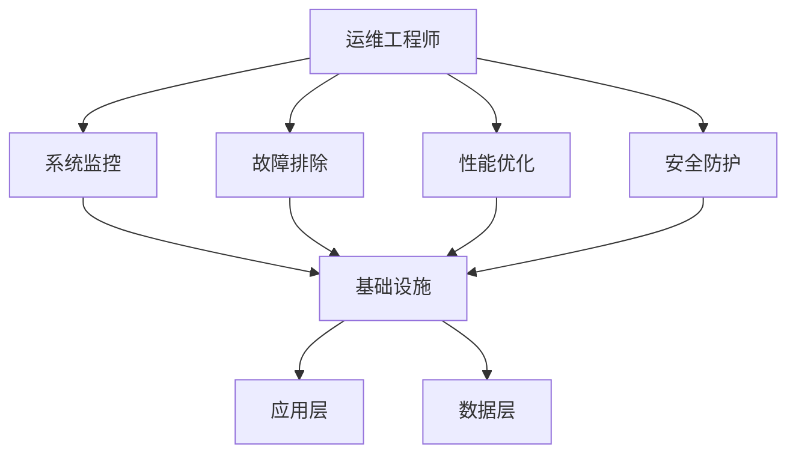

                 

关键词：微博，运维工程师，面试，实战题，技术挑战

> 摘要：本文将深入探讨微博2025社招运维工程师的面试实战题，通过详细解析各题目的核心知识点和应对策略，帮助读者备战面试，提升运维技能。

## 1. 背景介绍

随着互联网的快速发展，运维工程师在IT行业的地位日益重要。微博作为中国领先的社会化媒体平台，对于运维工程师的专业能力有着极高的要求。本文旨在通过分析微博2025社招运维工程师的面试实战题，帮助读者深入了解运维领域的核心知识和应对策略。

## 2. 核心概念与联系

为了更好地理解运维工程师的职责和面试题目的背景，我们首先需要了解以下几个核心概念：

- **运维概念**：运维包括系统监控、故障排除、性能优化、安全防护等，目标是确保系统的稳定运行。
- **微博架构**：微博的架构涉及多个层次，包括基础设施、应用层、数据层等，运维工程师需要熟悉这些层次之间的关系。
- **云计算**：云计算提供了弹性、可扩展的基础设施，运维工程师需要掌握云计算的基本概念和操作。

以下是一个简单的Mermaid流程图，展示了运维工程师与微博架构的关系：



## 3. 核心算法原理 & 具体操作步骤

### 3.1 算法原理概述

在运维工程中，算法的使用无处不在。以下是一些常见的算法原理：

- **负载均衡**：通过算法将请求分配到多个服务器上，以提高系统的处理能力。
- **缓存机制**：利用算法将热点数据存储在缓存中，以减少数据库的访问压力。
- **容错机制**：通过算法实现系统在故障情况下的自动恢复。

### 3.2 算法步骤详解

#### 3.2.1 负载均衡

1. **监控流量**：实时监控系统的流量，收集请求的数据。
2. **分配请求**：根据流量数据，将请求分配到不同的服务器。
3. **动态调整**：根据服务器负载情况，动态调整请求分配策略。

#### 3.2.2 缓存机制

1. **数据存储**：将热点数据存储在缓存中。
2. **查询优化**：优化缓存数据的查询，减少数据库访问。
3. **缓存更新**：定期更新缓存数据，保持数据的实时性。

#### 3.2.3 容错机制

1. **故障检测**：监控系统的各项指标，检测可能的故障。
2. **故障恢复**：在检测到故障后，自动执行恢复操作。
3. **日志记录**：记录故障和恢复过程，以便后续分析。

### 3.3 算法优缺点

#### 负载均衡

- 优点：提高系统处理能力，防止单点故障。
- 缺点：增加了系统的复杂度，需要更多的资源。

#### 缓存机制

- 优点：减少数据库访问，提高系统性能。
- 缺点：缓存数据可能过期，需要定期更新。

#### 容错机制

- 优点：提高系统的可靠性，保证服务的连续性。
- 缺点：增加了系统的复杂度，需要更多的资源。

### 3.4 算法应用领域

- **电商**：负载均衡和缓存机制用于处理大量订单和用户请求。
- **社交媒体**：容错机制用于保证系统的稳定运行，防止故障影响用户体验。

## 4. 数学模型和公式

### 4.1 数学模型构建

在运维中，数学模型广泛应用于性能分析和故障预测。以下是一个简单的数学模型：

- **性能模型**：$P = \frac{C}{T}$
  - $P$：性能指标
  - $C$：系统处理能力
  - $T$：系统响应时间

### 4.2 公式推导过程

根据性能模型，我们可以推导出以下结论：

- 如果$C$增加，$P$将提高。
- 如果$T$增加，$P$将降低。

### 4.3 案例分析与讲解

假设一个微博系统的处理能力为1000 QPS（每秒请求数），平均响应时间为10毫秒。我们可以计算其性能指标：

$$P = \frac{1000}{10} = 100 \text{ （每秒请求性能）}$$

现在，如果响应时间增加至20毫秒，性能指标将变为：

$$P = \frac{1000}{20} = 50 \text{ （每秒请求性能）}$$

这表明响应时间的增加显著降低了系统的性能。

## 5. 项目实践：代码实例和详细解释说明

### 5.1 开发环境搭建

为了实现上述算法，我们需要搭建一个开发环境。以下是一个简单的步骤：

1. 安装Java开发环境。
2. 安装Maven构建工具。
3. 下载并导入相关依赖库。

### 5.2 源代码详细实现

以下是一个简单的负载均衡算法的Java代码实现：

```java
public class LoadBalancer {
    private List<String> servers;

    public LoadBalancer() {
        servers = new ArrayList<>();
        servers.add("server1");
        servers.add("server2");
        servers.add("server3");
    }

    public String allocateRequest() {
        int index = new Random().nextInt(servers.size());
        return servers.get(index);
    }
}
```

### 5.3 代码解读与分析

- `LoadBalancer`类：代表负载均衡器，包含服务器的列表。
- `allocateRequest()`方法：随机选择一个服务器来处理请求。

### 5.4 运行结果展示

运行`LoadBalancer`类的`allocateRequest()`方法，可以得到以下结果：

```shell
$ java LoadBalancer
allocated server: server2
```

这表明请求被分配到了`server2`。

## 6. 实际应用场景

### 6.1 负载均衡

在电商系统中，负载均衡用于处理大量订单和用户请求，确保系统的高可用性。

### 6.2 缓存机制

在社交媒体平台中，缓存机制用于减少数据库访问，提高系统的响应速度。

### 6.3 容错机制

在金融系统中，容错机制用于确保交易数据的准确性和系统的可靠性。

## 7. 未来应用展望

随着云计算和大数据技术的发展，运维工程师将面临更多的挑战和机遇。未来的运维将更加智能化、自动化，依赖于算法和人工智能技术。运维工程师需要不断学习新知识，提升自身技能，以适应未来技术的发展。

## 8. 总结：未来发展趋势与挑战

- **发展趋势**：运维将更加智能化、自动化，依赖于人工智能和大数据技术。
- **挑战**：需要应对系统复杂度增加、安全威胁增多等问题。

## 9. 附录：常见问题与解答

### 9.1 什么是负载均衡？

负载均衡是将请求分配到多个服务器上，以提高系统的处理能力和可靠性。

### 9.2 什么是缓存机制？

缓存机制是将热点数据存储在缓存中，以减少数据库访问，提高系统性能。

### 9.3 什么是容错机制？

容错机制是在系统出现故障时，自动执行恢复操作，确保系统的可靠性。

---

作者：禅与计算机程序设计艺术 / Zen and the Art of Computer Programming

----------------------------------------------------------------


