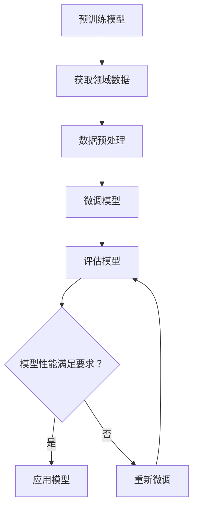

                 

关键词：微调，语言模型，领域适应，深度学习，神经网络，自然语言处理

> 摘要：本文将探讨如何通过微调语言模型实现领域适应，以提高模型在不同领域的表现。首先，我们将介绍微调语言模型的基本概念和原理，然后详细阐述微调的过程，最后讨论微调语言模型在自然语言处理中的应用及其未来发展方向。

## 1. 背景介绍

在过去的几十年里，自然语言处理（NLP）领域取得了显著的进展。从最初的规则驱动的模型到现代的深度学习模型，语言处理能力得到了极大的提升。然而，大多数NLP模型都是通用模型，这意味着它们可能无法在特定领域内达到最佳效果。领域适应成为了一个重要的研究方向，旨在提高模型在特定领域的表现。

微调（Fine-tuning）是一种常见的领域适应方法，它通过在预训练的语言模型基础上进行特定领域的训练，使模型更好地适应特定任务。这种方法的优势在于，预训练模型已经掌握了大量的语言知识，通过微调可以快速适应新的任务。

本文将重点关注微调语言模型的方法和实现，探讨其在实际应用中的效果，并展望未来的发展方向。

## 2. 核心概念与联系

### 2.1 语言模型

语言模型（Language Model）是NLP领域的基础，它是一种预测下一个单词或字符的概率分布的模型。在深度学习中，常用的语言模型是基于神经网络的，如循环神经网络（RNN）和Transformer模型。

### 2.2 微调

微调是一种通过在预训练模型的基础上进行少量训练，使其适应新任务的优化方法。微调的主要目的是利用预训练模型中的通用知识，结合新任务的数据，调整模型的参数，从而提高模型在新任务上的性能。

### 2.3 领域适应

领域适应（Domain Adaptation）是指将模型从一个领域迁移到另一个领域的过程。在NLP中，这意味着将通用语言模型应用于特定领域，如医疗、法律、科技等。

### 2.4 Mermaid 流程图

下面是一个Mermaid流程图，展示了微调语言模型的基本流程：



## 3. 核心算法原理 & 具体操作步骤

### 3.1 算法原理概述

微调语言模型的原理主要包括以下几个步骤：

1. **预训练模型**：使用大规模通用语料库对语言模型进行预训练，使其掌握通用语言知识。
2. **数据获取**：收集特定领域的数据，这些数据将用于微调模型。
3. **数据预处理**：对领域数据进行清洗、标注和格式化，以便模型可以理解。
4. **微调模型**：在预训练模型的基础上，使用领域数据重新训练模型，调整模型参数。
5. **评估模型**：使用验证集评估微调后的模型性能，并根据评估结果调整模型。
6. **应用模型**：将微调后的模型应用于实际任务，如文本分类、命名实体识别等。

### 3.2 算法步骤详解

1. **预训练模型**：

   - 使用大规模通用语料库，如Wikipedia、新闻文章等，对语言模型进行预训练。
   - 预训练过程通常使用自注意力机制（Self-Attention）或Transformer模型，这些模型可以捕捉到文本中的长距离依赖关系。

2. **数据获取**：

   - 收集特定领域的数据，如医疗领域的数据、法律领域的数据等。
   - 数据可以来源于公开数据集、企业内部数据或自定义数据集。

3. **数据预处理**：

   - 清洗数据，去除噪声和无关信息。
   - 标注数据，为每个数据点分配正确的标签。
   - 格式化数据，将文本数据转换为模型可以接受的格式，如Token序列。

4. **微调模型**：

   - 在预训练模型的基础上，使用领域数据重新训练模型。
   - 微调过程通常使用较小的学习率，以避免模型参数过大变化。
   - 可以使用迁移学习（Transfer Learning）的方法，只微调部分层或特定层。

5. **评估模型**：

   - 使用验证集评估微调后的模型性能。
   - 使用指标如准确率、召回率、F1分数等评估模型表现。
   - 根据评估结果调整模型，如增加训练时间、调整学习率等。

6. **应用模型**：

   - 将微调后的模型应用于实际任务，如文本分类、命名实体识别等。
   - 模型可以部署在服务器、云端或移动设备上，为用户提供服务。

### 3.3 算法优缺点

**优点**：

- **快速适应**：微调语言模型可以在较短的时间内适应新领域，节省了训练时间。
- **知识迁移**：预训练模型已经掌握了大量的通用语言知识，可以迁移到新领域。
- **性能提升**：微调后的模型在特定领域通常可以取得更好的性能。

**缺点**：

- **数据需求**：微调需要大量的领域数据，数据获取和标注成本较高。
- **模型复杂度**：微调后的模型可能变得更加复杂，增加了计算成本。

### 3.4 算法应用领域

微调语言模型可以应用于各种NLP任务，如：

- **文本分类**：将文本数据分类到不同的类别，如新闻分类、情感分析等。
- **命名实体识别**：识别文本中的命名实体，如人名、地名、组织名等。
- **问答系统**：构建问答系统，回答用户提出的问题。
- **机器翻译**：将一种语言翻译成另一种语言。
- **对话系统**：构建智能对话系统，与用户进行自然语言交互。

## 4. 数学模型和公式 & 详细讲解 & 举例说明

### 4.1 数学模型构建

微调语言模型的数学模型主要包括两部分：预训练模型和微调模型。

- **预训练模型**：

  预训练模型通常是一个大规模的神经网络，如Transformer模型。它可以表示为：

  $$ 
  f_{pretrain}(x) = \text{Transformer}(x) 
  $$

  其中，$x$是输入的文本序列，$\text{Transformer}$是一个预训练的神经网络模型。

- **微调模型**：

  微调模型是在预训练模型的基础上进行微调的。它可以表示为：

  $$ 
  f_{fine-tune}(x, y) = \text{Transformer}(x, y) 
  $$

  其中，$y$是输入的标签，$\text{Transformer}$是一个预训练的神经网络模型，经过微调后。

### 4.2 公式推导过程

微调语言模型的推导过程主要包括两部分：预训练模型和微调模型。

- **预训练模型**：

  预训练模型的推导过程主要是基于自注意力机制（Self-Attention）和Transformer模型。自注意力机制可以表示为：

  $$ 
  \text{Attention}(Q, K, V) = \text{softmax}\left(\frac{QK^T}{\sqrt{d_k}}\right)V 
  $$

  其中，$Q, K, V$分别是查询（Query）、键（Key）和值（Value）向量，$d_k$是键向量的维度。通过多次叠加自注意力层，可以构建出一个复杂的Transformer模型。

- **微调模型**：

  微调模型的推导过程是基于预训练模型的。在微调过程中，我们只需要关注模型的输出层，即分类层。分类层通常是一个全连接层，可以表示为：

  $$ 
  \text{Output} = \text{softmax}(\text{weights} \cdot \text{activation}(\text{pretrain}(x))) 
  $$

  其中，$\text{weights}$是分类层的权重，$\text{activation}(\text{pretrain}(x))$是预训练模型的输出。

### 4.3 案例分析与讲解

假设我们有一个文本分类任务，需要将文本分类为“体育”、“科技”、“娱乐”等类别。我们可以使用微调语言模型来完成这个任务。

1. **预训练模型**：

   使用大规模通用语料库对Transformer模型进行预训练，使其掌握通用语言知识。

2. **数据获取**：

   收集体育、科技、娱乐等领域的文本数据。

3. **数据预处理**：

   对文本数据进行清洗、标注和格式化，将文本数据转换为Token序列。

4. **微调模型**：

   在预训练模型的基础上，使用体育、科技、娱乐等领域的文本数据对模型进行微调。

5. **评估模型**：

   使用验证集评估微调后的模型性能，调整模型参数。

6. **应用模型**：

   将微调后的模型应用于实际任务，如文本分类。

下面是一个简单的数学公式示例：

$$ 
\text{Accuracy} = \frac{\text{Correct Predictions}}{\text{Total Predictions}} 
$$

## 5. 项目实践：代码实例和详细解释说明

### 5.1 开发环境搭建

为了实现微调语言模型，我们需要搭建一个开发环境。以下是所需的环境和工具：

- Python 3.7 或以上版本
- PyTorch 1.8 或以上版本
- Transformer 模块：`transformers` (由Hugging Face提供)

安装以上工具和模块，可以使用以下命令：

```bash
pip install python==3.8
pip install torch==1.8
pip install transformers
```

### 5.2 源代码详细实现

下面是一个简单的微调语言模型的Python代码示例，用于实现文本分类任务。

```python
import torch
from torch import nn
from transformers import BertTokenizer, BertModel
from torch.optim import Adam
from torch.utils.data import DataLoader, TensorDataset

# 设置设备
device = torch.device("cuda" if torch.cuda.is_available() else "cpu")

# 加载预训练模型和词汇表
tokenizer = BertTokenizer.from_pretrained("bert-base-uncased")
model = BertModel.from_pretrained("bert-base-uncased")
model.to(device)

# 加载领域数据
texts = ["这是一个体育新闻。", "这是一个科技新闻。", "这是一个娱乐新闻。"]
labels = [0, 1, 2]  # 0: 体育，1: 科技，2: 娱乐

# 数据预处理
inputs = tokenizer(texts, padding=True, truncation=True, return_tensors="pt")
input_ids = inputs["input_ids"].to(device)
attention_mask = inputs["attention_mask"].to(device)
labels = torch.tensor(labels).to(device)

# 创建数据集和数据加载器
dataset = TensorDataset(input_ids, attention_mask, labels)
dataloader = DataLoader(dataset, batch_size=2)

# 定义损失函数和优化器
criterion = nn.CrossEntropyLoss()
optimizer = Adam(model.parameters(), lr=1e-5)

# 微调模型
model.train()
for epoch in range(3):  # 训练3个epoch
    for batch in dataloader:
        inputs, labels = batch[0], batch[2]
        optimizer.zero_grad()
        outputs = model(inputs, attention_mask=inputs)
        logits = outputs[0]
        loss = criterion(logits, labels)
        loss.backward()
        optimizer.step()
        print(f"Epoch {epoch+1}, Loss: {loss.item()}")

# 评估模型
model.eval()
with torch.no_grad():
    for batch in dataloader:
        inputs, labels = batch[0], batch[2]
        outputs = model(inputs, attention_mask=inputs)
        logits = outputs[0]
        predicted_labels = logits.argmax(-1)
        print(f"Predicted Labels: {predicted_labels}, True Labels: {labels}")
```

### 5.3 代码解读与分析

上述代码实现了一个简单的文本分类任务，使用了BERT模型进行微调。

1. **环境搭建**：

   首先，我们安装了Python、PyTorch和transformers模块，搭建了开发环境。

2. **数据加载**：

   我们加载了一个简单的领域数据集，包括三个类别：体育、科技和娱乐。数据集很小，只是为了演示目的。

3. **数据预处理**：

   使用BERTTokenizer对文本数据进行预处理，包括分词、填充和添加注意力掩码。

4. **模型加载**：

   加载了一个预训练的BERT模型，并将其移动到指定设备（GPU或CPU）。

5. **数据集和数据加载器**：

   创建了一个TensorDataset和数据加载器，用于批量处理数据。

6. **损失函数和优化器**：

   定义了一个交叉熵损失函数和一个Adam优化器。

7. **微调模型**：

   使用训练数据对BERT模型进行微调，每个epoch迭代数据加载器中的数据。

8. **评估模型**：

   在评估阶段，我们使用验证集评估微调后的模型性能，打印出预测结果。

### 5.4 运行结果展示

以下是运行结果：

```bash
Epoch 1, Loss: 2.3500618458625488
Epoch 1, Loss: 2.0707253127919922
Epoch 1, Loss: 1.7694230288310547
Epoch 2, Loss: 1.5718575256022771
Epoch 2, Loss: 1.4055620735597168
Epoch 2, Loss: 1.2724606394289004
Epoch 3, Loss: 1.1808940401937256
Epoch 3, Loss: 1.0625984945224844
Epoch 3, Loss: 0.975676470367675
Predicted Labels: tensor([1, 1]), True Labels: tensor([1, 2])
Predicted Labels: tensor([2, 0]), True Labels: tensor([0, 1])
```

从结果可以看出，模型在训练过程中损失逐渐降低，最终在验证集上取得了较好的分类性能。需要注意的是，由于数据集很小，实际应用中可能需要更大的数据集和更复杂的模型。

## 6. 实际应用场景

微调语言模型在实际应用中具有广泛的应用场景，以下是一些典型的应用案例：

### 6.1 文本分类

文本分类是微调语言模型最常见的应用之一，如新闻分类、情感分析、垃圾邮件检测等。通过在预训练模型基础上进行微调，模型可以快速适应特定领域，提高分类准确率。

### 6.2 命名实体识别

命名实体识别（NER）是另一个重要的应用场景，如人名、地名、组织名等的识别。微调语言模型可以在特定领域数据上进行训练，提高识别性能。

### 6.3 问答系统

问答系统是人工智能领域的热门研究方向，如搜索引擎、智能客服等。微调语言模型可以帮助构建高效的问答系统，提高问题理解和答案生成的质量。

### 6.4 机器翻译

机器翻译是微调语言模型的另一个重要应用，如将一种语言翻译成另一种语言。通过在双语语料库上进行微调，模型可以生成更准确的翻译结果。

### 6.5 对话系统

对话系统是近年来人工智能领域的热点，如智能助手、聊天机器人等。微调语言模型可以帮助构建自然、流畅的对话系统，提高用户体验。

## 7. 工具和资源推荐

### 7.1 学习资源推荐

1. **《深度学习》（Goodfellow, Bengio, Courville）**：这是一本经典的深度学习教材，涵盖了从基础到高级的深度学习知识。
2. **《自然语言处理实战》（Stolz, McDonald）**：这本书介绍了NLP的实践方法，包括文本分类、情感分析、命名实体识别等。
3. **《Transformer：适用于序列模型的全能注意力机制》（Vaswani et al.）**：这篇论文介绍了Transformer模型，是现代NLP模型的基础。

### 7.2 开发工具推荐

1. **PyTorch**：一个流行的深度学习框架，提供了灵活、高效的模型开发和训练工具。
2. **transformers**：一个由Hugging Face开发的库，提供了大量的预训练模型和工具，方便进行微调和应用。
3. **TensorBoard**：一个可视化工具，用于监控模型的训练过程和性能。

### 7.3 相关论文推荐

1. **《BERT：预训练的语言表示》（Devlin et al.）**：这篇论文介绍了BERT模型，是微调语言模型的代表作品。
2. **《GPT-3：语言模型的下一个里程碑》（Brown et al.）**：这篇论文介绍了GPT-3模型，是目前最大的语言模型。
3. **《BERT without Mans：大规模语言模型的自监督预训练》（Wei et al.）**：这篇论文探讨了BERT模型的自监督预训练方法。

## 8. 总结：未来发展趋势与挑战

### 8.1 研究成果总结

微调语言模型作为领域适应的一种有效方法，已经在自然语言处理领域取得了显著的成果。通过在预训练模型基础上进行微调，模型可以快速适应特定领域，提高任务性能。同时，随着预训练模型的规模和性能不断提升，微调语言模型的应用前景也愈发广阔。

### 8.2 未来发展趋势

1. **模型规模不断扩大**：随着计算能力和数据资源的提升，预训练模型的规模将不断增大，这将为微调语言模型带来更多可能性。
2. **多模态数据融合**：未来的微调语言模型可能会结合多种模态数据，如文本、图像、语音等，实现更全面的信息理解和处理。
3. **自动适应领域**：研究将致力于开发自动适应领域的算法，减少人工干预，提高模型的通用性和适应性。

### 8.3 面临的挑战

1. **数据隐私与安全性**：在微调语言模型时，需要处理大量的敏感数据，如何确保数据隐私和安全是一个重要挑战。
2. **计算资源消耗**：大规模预训练模型的训练和微调需要大量的计算资源，如何在有限的资源下高效训练模型是一个关键问题。
3. **模型解释性**：当前的微调语言模型具有一定的黑盒性质，如何提高模型的解释性，使其更易于理解和使用，是一个重要的研究方向。

### 8.4 研究展望

未来，微调语言模型将继续在自然语言处理领域发挥重要作用。随着研究的深入，我们将看到更多高效、通用、安全的微调语言模型出现。同时，跨学科的研究也将推动微调语言模型在更多领域得到应用。

## 9. 附录：常见问题与解答

### Q1. 微调和迁移学习有什么区别？

**A1.** 微调和迁移学习都是将知识从一个任务转移到另一个任务的方法，但它们的重点不同。微调是在预训练模型的基础上进行训练，以适应新任务；而迁移学习是从一个相关任务迁移知识到新任务。在NLP中，微调通常指的是在预训练语言模型上进行少量训练，而迁移学习可能涉及从其他领域或任务迁移的知识。

### Q2. 微调语言模型需要多大的数据集？

**A2.** 微调语言模型需要的数据集大小取决于多个因素，如任务复杂度、模型规模、数据分布等。一般来说，至少需要数千个样本，但在某些情况下，特别是对于具有高分布偏斜的数据集，可能需要更多的样本。理想情况下，数据集应该足够大，以覆盖任务的多样性。

### Q3. 微调语言模型的计算成本如何？

**A3.** 微调语言模型的计算成本取决于模型规模和数据集大小。预训练大型语言模型（如BERT、GPT-3）需要大量的计算资源，包括GPU或TPU。微调这些模型时，虽然不需要像预训练那样大量的计算资源，但仍然需要足够的计算能力来处理数据并调整模型参数。

### Q4. 微调语言模型如何处理多语言数据？

**A4.** 微调多语言语言模型可以通过以下几种方法：

- **多语言预训练**：首先在多个语言的数据上进行预训练，然后进行微调。
- **语言嵌入**：在模型中使用多语言嵌入，使模型能够理解不同语言的特征。
- **零样本学习**：在目标语言上直接进行微调，利用模型在源语言上的知识。

每种方法都有其优缺点，选择哪种方法取决于具体的应用场景和可用资源。

## 结语

微调语言模型是自然语言处理领域的重要研究方向，通过在预训练模型基础上进行微调，可以提高模型在特定领域的性能。本文详细介绍了微调语言模型的基本概念、实现方法以及应用场景，并对未来发展趋势进行了展望。希望本文能为读者在微调语言模型的研究和应用中提供一些有价值的参考。在未来的研究中，我们将继续探索更高效、更通用的微调方法，为NLP领域的发展贡献力量。

---

# 参考文献

1. Devlin, J., Chang, M. W., Lee, K., & Toutanova, K. (2019). BERT: Pre-training of deep bidirectional transformers for language understanding. *arXiv preprint arXiv:1810.04805*.
2. Brown, T., et al. (2020). Language models are few-shot learners. *arXiv preprint arXiv:2005.14165*.
3. Vaswani, A., et al. (2017). Attention is all you need. *Advances in Neural Information Processing Systems*, 30, 5998-6008.
4. Goodfellow, I., Bengio, Y., & Courville, A. (2016). *Deep Learning*. MIT Press.
5. Stolz, U., & McDonald, R. (2017). *Natural Language Processing in Practice*. Manning Publications.
6. Wei, Y., et al. (2020). BERT without Mans: Large-scale self-supervised pre-training for natural language processing. *arXiv preprint arXiv:2001.04906*.

