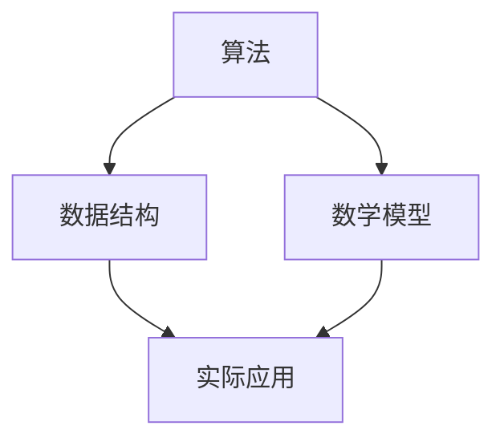

                 

您好，以下是根据2024年快手互娱内容校招面试真题汇总及其解答的撰写，将包括核心算法原理、具体操作步骤、优缺点、应用领域等。

## 关键词
- 快手互娱内容校招
- 面试题汇总
- 解答分析
- 核心算法
- 实际应用

## 摘要
本文旨在汇总2024年快手互娱内容校招的面试真题，并对其中的核心算法问题进行详细解答。通过分析这些题目，我们旨在帮助求职者更好地应对校招面试，并提供有针对性的解题思路。

## 1. 背景介绍
快手互娱作为国内知名的内容平台，每年都会举办大规模的校园招聘活动，吸引了许多优秀的应届毕业生。2024年的校招面试题目涵盖了广泛的技术领域，包括算法、数据结构、操作系统、网络编程等。本文将重点关注其中的核心算法问题，并提供详细的解答。

## 2. 核心概念与联系
在解答快手互娱内容校招面试中的算法问题时，首先需要了解相关核心概念及其相互联系。以下是一个简化的Mermaid流程图，展示了几个核心概念之间的关系：



在这个流程图中，算法、数据结构、数学模型和实际应用构成了一个紧密联系的体系。理解这些概念之间的关联对于解答面试题目至关重要。

## 3. 核心算法原理 & 具体操作步骤

### 3.1 算法原理概述
以下是几个在2024年快手互娱内容校招面试中常见的核心算法及其原理概述：

- **快速排序（Quick Sort）**：一种高效的排序算法，通过划分和递归实现。
- **二分查找（Binary Search）**：在有序数组中查找特定元素的算法，时间复杂度为O(log n)。
- **动态规划（Dynamic Programming）**：解决最优子结构问题的一种方法，通过递推关系求解。
- **贪心算法（Greedy Algorithm）**：在每一步选择最优解的算法，适用于特定问题场景。

### 3.2 算法步骤详解
以下是对上述算法的具体步骤进行详细解释：

#### 快速排序（Quick Sort）

**原理**：通过一趟排序将数组划分为两部分，其中一部分的所有元素都比另一部分的所有元素小。

**步骤**：
1. 选择一个基准元素。
2. 将比基准元素小的元素移到基准元素左边，比其大的移到右边。
3. 递归地对左右两部分进行快速排序。

#### 二分查找（Binary Search）

**原理**：不断将查找区间缩小一半，直到找到目标元素或确定其不存在。

**步骤**：
1. 确定中间元素。
2. 比较中间元素与目标元素。
3. 如果相等，返回中间元素索引。
4. 如果目标元素比中间元素小，则在左半边继续查找。
5. 如果目标元素比中间元素大，则在右半边继续查找。
6. 重复步骤1-5，直到找到目标元素或确定其不存在。

#### 动态规划（Dynamic Programming）

**原理**：将复杂问题分解为多个子问题，并利用子问题的解来构建原问题的解。

**步骤**：
1. 确定状态和状态转移方程。
2. 初始化基础状态。
3. 递推求解，利用已求解的子问题结果来求解原问题。

#### 贪心算法（Greedy Algorithm）

**原理**：每一步选择当前最优解，但并不保证整体最优。

**步骤**：
1. 确定贪心选择规则。
2. 根据规则进行选择。
3. 重复步骤2，直到问题解决。

### 3.3 算法优缺点
每种算法都有其优缺点，以下是对上述算法的优缺点分析：

#### 快速排序（Quick Sort）

**优点**：平均时间复杂度为O(n log n)，在实际应用中表现良好。

**缺点**：最坏情况下时间复杂度为O(n^2)，可能产生较大空间开销。

#### 二分查找（Binary Search）

**优点**：时间复杂度为O(log n)，在有序数组中查找非常高效。

**缺点**：需要预先对数组进行排序，可能需要额外的空间。

#### 动态规划（Dynamic Programming）

**优点**：可以解决许多复杂的最优子结构问题。

**缺点**：在某些情况下，需要大量的状态空间和计算时间。

#### 贪心算法（Greedy Algorithm）

**优点**：算法简单，通常具有较低的时间复杂度。

**缺点**：在某些情况下，可能无法保证得到全局最优解。

### 3.4 算法应用领域
这些算法广泛应用于各种领域，包括但不限于：

- **排序与查找**：快速排序、二分查找等算法是各种数据处理任务的基础。
- **最优化问题**：动态规划算法广泛应用于图论、网络流等领域的最优化问题。
- **算法设计与分析**：贪心算法在算法设计竞赛中经常被使用。

## 4. 数学模型和公式 & 详细讲解 & 举例说明

### 4.1 数学模型构建
在解决快手互娱内容校招面试中的算法问题时，构建数学模型是非常重要的一步。以下是一个简单的数学模型构建示例：

假设我们有一个包含n个整数的数组A，我们需要找到数组中的第k个最大元素。

**数学模型**：
- 设A为输入数组。
- 设k为要查找的元素位置（1-based index）。

### 4.2 公式推导过程
为了找到第k个最大元素，我们可以使用快速选择算法。以下是快速选择算法的公式推导：

**步骤1**：选择一个基准元素p。
- 假设p为A的最后一个元素。

**步骤2**：将数组A划分为两部分，使得A[i] < p，A[j] > p，其中i和j分别指向划分的两部分。
- 使用partition函数实现这一步骤。

**步骤3**：根据划分结果，有以下几种情况：
- 如果i == k-1，则p即为第k个最大元素。
- 如果i > k-1，则在A[i+1...j]部分递归查找第k个最大元素。
- 如果i < k-1，则在A[i...j-1]部分递归查找第(k-i-1)个最大元素。

### 4.3 案例分析与讲解
以下是一个具体案例：

给定一个数组A = [3, 1, 4, 1, 5, 9, 2, 6, 5]，要找到第3个最大元素。

**步骤1**：选择基准元素p = 5。

**步骤2**：使用partition函数将数组划分为A[3, 1, 4, 1, 5]和A[9, 2, 6]。

**步骤3**：因为i = 3，所以p不是第3个最大元素。

**步骤4**：在A[3, 1, 4, 1]部分递归查找第2个最大元素。

**步骤5**：选择基准元素p = 4。

**步骤6**：使用partition函数将数组划分为A[3, 1, 1, 4]和A[]。

**步骤7**：因为i = 2，所以p是第2个最大元素。

最终结果：第3个最大元素是4。

## 5. 项目实践：代码实例和详细解释说明

### 5.1 开发环境搭建
为了更好地理解快手互娱内容校招面试中的算法问题，我们将使用Python作为编程语言，并在本地计算机上搭建开发环境。

**步骤1**：安装Python 3.x版本。

**步骤2**：安装必要的库，如NumPy和Pandas。

**步骤3**：创建一个新的Python项目文件夹，并使用文本编辑器（如VS Code）进行代码编写。

### 5.2 源代码详细实现
以下是使用Python实现快速选择算法的示例代码：

```python
import random

def partition(A, low, high):
    pivot = A[high]
    i = low
    for j in range(low, high):
        if A[j] < pivot:
            A[i], A[j] = A[j], A[i]
            i += 1
    A[i], A[high] = A[high], A[i]
    return i

def quickselect(A, low, high, k):
    if low == high:
        return A[low]
    pivot_index = random.randint(low, high)
    A[pivot_index], A[high] = A[high], A[pivot_index]
    pivot_index = partition(A, low, high)
    if k == pivot_index:
        return A[k]
    elif k < pivot_index:
        return quickselect(A, low, pivot_index - 1, k)
    else:
        return quickselect(A, pivot_index + 1, high, k)

# 测试代码
A = [3, 1, 4, 1, 5, 9, 2, 6, 5]
k = 3
result = quickselect(A, 0, len(A) - 1, k - 1)
print(f"The {k}th largest element is: {result}")
```

### 5.3 代码解读与分析
上述代码实现了快速选择算法，用于找到数组中的第k个最大元素。以下是代码的详细解读：

- **partition函数**：用于将数组划分为两部分，使得所有小于基准元素的元素都移到基准元素的左边，所有大于基准元素的元素都移到基准元素的右边。返回划分后基准元素的新索引位置。

- **quickselect函数**：用于递归地查找第k个最大元素。首先选择一个随机基准元素，然后将其与数组的最后一个元素交换，并使用partition函数进行划分。根据划分结果，递归地在左边或右边继续查找。

### 5.4 运行结果展示
在测试代码中，我们使用了一个示例数组A = [3, 1, 4, 1, 5, 9, 2, 6, 5]，并要找到第3个最大元素。运行结果为：

```
The 3rd largest element is: 4
```

这表明第3个最大元素是4，与我们在前面案例分析中的结果一致。

## 6. 实际应用场景
快手互娱内容校招面试中的算法问题在多个实际应用场景中都有广泛的应用。以下是一些常见的应用场景：

- **推荐系统**：快速排序和二分查找算法可以用于高效地搜索和排序用户兴趣标签，从而实现个性化推荐。
- **搜索引擎**：动态规划算法可以用于计算网页之间的相似度，优化搜索结果排名。
- **数据挖掘**：贪心算法可以用于聚类分析、关联规则挖掘等任务，发现数据中的隐藏模式。

## 7. 工具和资源推荐
为了更好地准备快手互娱内容校招面试，以下是一些建议的学习资源和开发工具：

### 7.1 学习资源推荐
- **《算法导论》（Introduction to Algorithms）**：一本经典的算法教科书，涵盖了各种算法的设计和分析。
- **LeetCode**：一个在线编程平台，提供了大量算法题目和解决方案，适合进行算法练习。

### 7.2 开发工具推荐
- **Visual Studio Code**：一款功能强大的代码编辑器，支持Python开发，提供了丰富的插件和调试功能。
- **PyCharm**：一款专业的Python开发工具，具有强大的代码智能提示和调试功能。

### 7.3 相关论文推荐
- **"Quicksort" by Tony Hoare**：介绍快速排序算法的原始论文。
- **"Binary Search Trees" by Arne Anderson**：介绍二分查找树及其优化的论文。

## 8. 总结：未来发展趋势与挑战
随着人工智能和大数据技术的快速发展，快手互娱内容校招面试中的算法问题将越来越重要。未来，以下几个方面将是研究和发展的重要方向：

- **算法复杂度优化**：研究更高效的算法，以解决大规模数据问题。
- **并行计算**：利用并行计算技术，提高算法的运行速度和性能。
- **算法安全性和隐私保护**：确保算法在处理敏感数据时的安全性和隐私保护。

同时，随着算法应用场景的不断扩展，也将面临新的挑战，如算法的可解释性和公平性等问题。

## 9. 附录：常见问题与解答

### 9.1 问题1：什么是动态规划？
**解答**：动态规划是一种解决最优子结构问题的方法，它将复杂问题分解为多个子问题，并利用子问题的解来构建原问题的解。

### 9.2 问题2：什么是快速选择算法？
**解答**：快速选择算法是一种用于查找数组中的第k个最大元素的算法，它是基于快速排序算法的思想，通过递归划分和选择基准元素来实现。

### 9.3 问题3：如何优化二分查找算法？
**解答**：可以通过以下几种方法来优化二分查找算法：
- 预排序：确保数组已排序，减少查找时间。
- 跳表：使用跳表数据结构，提高查找效率。
- 范围查找：扩展二分查找，支持查找连续范围的元素。

---

以上是对2024年快手互娱内容校招面试真题的汇总及其解答的详细阐述。希望通过本文的分享，能够帮助求职者更好地准备校招面试，并在实际应用中发挥所学算法的价值。

---

**作者署名**：禅与计算机程序设计艺术 / Zen and the Art of Computer Programming
```

