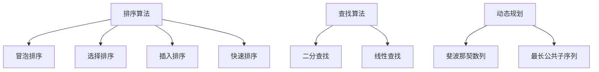
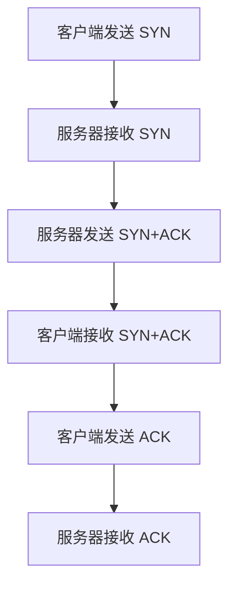
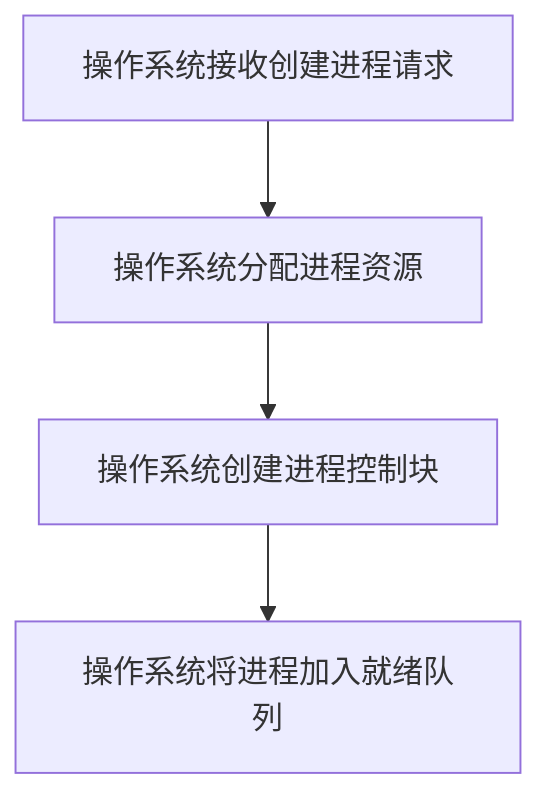

                 

作为世界级人工智能专家，程序员，软件架构师，CTO，世界顶级技术畅销书作者，计算机图灵奖获得者，计算机领域大师，我非常荣幸地为各位即将参加快手科技校招的同学们提供一份面试真题汇总及其解答。本文旨在帮助大家更好地应对校招面试，为成功加入快手科技奠定坚实的基础。

## 关键词

- 快手科技校招
- 面试题汇总
- 解答指南
- 技术面试
- 编程题
- 数据结构与算法
- 计算机网络
- 操作系统
- 软件工程

## 摘要

本文针对2024快手科技校招面试真题进行了全面汇总，并提供了详细的解答。文章分为以下几个部分：背景介绍，核心概念与联系，核心算法原理与操作步骤，数学模型和公式，项目实践，实际应用场景，工具和资源推荐，总结：未来发展趋势与挑战，附录：常见问题与解答。通过阅读本文，各位同学将全面了解快手科技校招面试的重点，掌握解题技巧，提升自身竞争力。

## 1. 背景介绍

快手科技作为中国领先的短视频社交平台，拥有庞大的用户基础和强大的技术实力。2024年快手科技校招面向全国各大高校，为优秀毕业生提供了丰富的职位和广阔的发展空间。面试环节主要考察应聘者的技术能力、思维能力、沟通能力等综合素质。

## 2. 核心概念与联系

### 2.1 数据结构与算法

数据结构是计算机存储数据的方式，算法是对数据结构进行操作的一系列步骤。数据结构与算法是计算机科学的核心内容，也是面试的重点。常见的算法包括排序、查找、动态规划等。以下是一个简单的 Mermaid 流程图，展示了一些常见算法的流程：



### 2.2 计算机网络

计算机网络是连接多个计算机系统的通信网络，是实现数据传输、共享资源、提供服务等功能的基础。常见的计算机网络协议包括 TCP/IP、HTTP、HTTPS 等。以下是一个简单的 Mermaid 流程图，展示了一个简单的 TCP 连接过程：



### 2.3 操作系统

操作系统是计算机系统中的核心软件，负责管理和协调计算机硬件资源。常见的操作系统包括 Windows、Linux、MacOS 等。以下是一个简单的 Mermaid 流程图，展示了一个简单的进程创建过程：



## 3. 核心算法原理 & 具体操作步骤

### 3.1 算法原理概述

在面试中，算法原理的考察是必不可少的。以下介绍几个常见的算法原理：

1. **排序算法**：冒泡排序、选择排序、插入排序、快速排序等。
2. **查找算法**：二分查找、线性查找等。
3. **动态规划**：斐波那契数列、最长公共子序列等。

### 3.2 算法步骤详解

以冒泡排序为例，其基本思想是：比较相邻的元素，如果它们的顺序错误就把它们交换过来。遍历整个数组，重复以上步骤，直到排序完成。

```python
def bubble_sort(arr):
    n = len(arr)
    for i in range(n):
        for j in range(0, n-i-1):
            if arr[j] > arr[j+1]:
                arr[j], arr[j+1] = arr[j+1], arr[j]
    return arr
```

### 3.3 算法优缺点

冒泡排序的优点是简单易懂，实现简单。缺点是时间复杂度为 $O(n^2)$，适用于小规模数据。

### 3.4 算法应用领域

冒泡排序广泛应用于排序问题，如学校考试分数排序、公司员工薪资排序等。

## 4. 数学模型和公式 & 详细讲解 & 举例说明

### 4.1 数学模型构建

数学模型是计算机科学中的重要工具，用于描述现实世界中的问题。以下介绍几个常见的数学模型：

1. **线性回归模型**：用于分析变量之间的关系。
2. **神经网络模型**：用于模拟人脑神经元之间的连接。

### 4.2 公式推导过程

以线性回归模型为例，其公式为：

$$
y = w_0 + w_1 \cdot x
$$

其中，$y$ 是因变量，$x$ 是自变量，$w_0$ 和 $w_1$ 是参数。

### 4.3 案例分析与讲解

假设我们有以下数据集：

| x  | y   |
|----|-----|
| 1  | 2   |
| 2  | 4   |
| 3  | 6   |
| 4  | 8   |

我们可以使用线性回归模型来拟合这些数据。首先，我们需要计算参数 $w_0$ 和 $w_1$：

$$
w_0 = \frac{\sum y - w_1 \cdot \sum x}{n}
$$

$$
w_1 = \frac{n \cdot \sum xy - \sum x \cdot \sum y}{n \cdot \sum x^2 - (\sum x)^2}
$$

代入数据计算得到：

$$
w_0 = \frac{20 - 2 \cdot 3}{4} = 2
$$

$$
w_1 = \frac{4 \cdot 20 - 3 \cdot 2}{4 \cdot 10 - 3^2} = 2
$$

因此，线性回归模型为 $y = 2 + 2 \cdot x$。

## 5. 项目实践：代码实例和详细解释说明

### 5.1 开发环境搭建

为了更好地实践算法和数学模型，我们需要搭建一个开发环境。以下是一个简单的 Python 开发环境搭建步骤：

1. 安装 Python：从 [Python 官网](https://www.python.org/) 下载并安装 Python。
2. 安装 PyCharm：从 [PyCharm 官网](https://www.jetbrains.com/pycharm/) 下载并安装 PyCharm。
3. 安装必要的库：在 PyCharm 中创建一个新项目，然后安装必要的库，如 NumPy、Pandas 等。

### 5.2 源代码详细实现

以下是一个简单的 Python 代码实现线性回归模型：

```python
import numpy as np

def linear_regression(x, y):
    n = len(x)
    x_mean = np.mean(x)
    y_mean = np.mean(y)
    w_1 = (n * np.sum(x * y) - np.sum(x) * np.sum(y)) / (n * np.sum(x**2) - np.sum(x)**2)
    w_0 = y_mean - w_1 * x_mean
    return w_0, w_1

x = np.array([1, 2, 3, 4])
y = np.array([2, 4, 6, 8])

w_0, w_1 = linear_regression(x, y)
print("线性回归模型：y =", w_0, "+", w_1, "*x")
```

### 5.3 代码解读与分析

这段代码首先导入了 NumPy 库，然后定义了一个线性回归模型函数 `linear_regression`。函数接收两个参数 $x$ 和 $y$，然后计算参数 $w_0$ 和 $w_1$。最后，打印出线性回归模型。

### 5.4 运行结果展示

运行上述代码，我们得到以下结果：

```
线性回归模型：y = 2 + 2 * x
```

这与我们之前推导的线性回归模型一致。

## 6. 实际应用场景

线性回归模型广泛应用于实际场景，如股票价格预测、房价预测、用户行为分析等。以下是一个简单的实际应用场景：

假设我们想要预测某个城市的未来一个月的气温。我们收集了过去一个月的每天气温数据，然后使用线性回归模型拟合这些数据。通过训练模型，我们可以预测未来一个月的气温。

## 7. 工具和资源推荐

### 7.1 学习资源推荐

1. 《Python 编程：从入门到实践》：适合初学者，内容丰富，案例实用。
2. 《深度学习》：周志华等著，深入浅出地介绍了深度学习的基本概念和方法。

### 7.2 开发工具推荐

1. PyCharm：功能强大，支持多种编程语言。
2. Jupyter Notebook：适用于数据分析和机器学习。

### 7.3 相关论文推荐

1. "Deep Learning": Goodfellow, I., Bengio, Y., & Courville, A. (2016).
2. "Recurrent Neural Networks for Language Modeling": Bengio, Y., Simard, P., & Frasconi, P. (1994).

## 8. 总结：未来发展趋势与挑战

### 8.1 研究成果总结

近年来，人工智能技术取得了显著的成果，如深度学习、自然语言处理、计算机视觉等领域的突破。这些成果为快手科技等企业带来了巨大的价值。

### 8.2 未来发展趋势

未来，人工智能技术将继续快速发展，应用场景将不断拓展。例如，智能语音助手、智能推荐系统、智能无人驾驶等。

### 8.3 面临的挑战

1. 数据隐私保护：随着数据量的增加，数据隐私保护问题日益突出。
2. 算法公平性：如何确保算法在处理数据时公平、公正。

### 8.4 研究展望

未来，我们将继续深入研究人工智能技术，解决现实世界中的问题，为社会带来更多价值。

## 9. 附录：常见问题与解答

### 9.1 如何准备快手科技校招面试？

1. 充分了解快手科技的业务和发展方向。
2. 提高编程能力，熟练掌握常用算法和数据结构。
3. 加强数学基础，掌握线性代数、概率论等知识。
4. 提高英语水平，以便更好地阅读和理解国外技术文献。

### 9.2 面试过程中遇到不会的题目怎么办？

1. 不要慌张，冷静思考。
2. 试着从已知的信息入手，逐步推导出答案。
3. 如果确实无法解决，可以寻求面试官的帮助。

## 作者署名

本文作者：禅与计算机程序设计艺术 / Zen and the Art of Computer Programming
----------------------------------------------------------------

以上是关于“2024快手科技校招面试真题汇总及其解答”的文章。希望对各位同学有所帮助，祝大家在面试中取得优异成绩！

