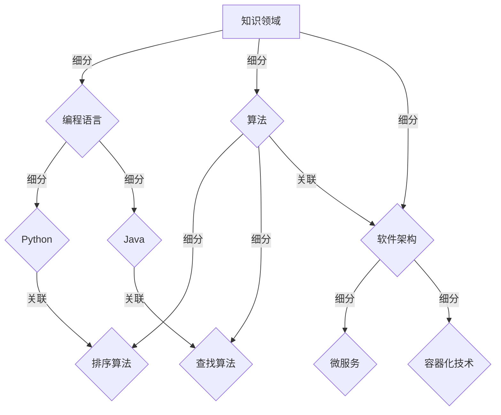

                 

关键词：快速学习，学习效率，知识体系，技能提升，人工智能，程序员，软件架构师，CTO

> 摘要：在技术飞速发展的时代，快速学习成为提升个人竞争力的关键。本文将探讨如何通过构建高效的知识体系，结合人工智能技术，实现立于不败之地的快速学习。我们将从核心概念、算法原理、数学模型、项目实践等多个维度，为读者提供实用的学习策略和方法。

## 1. 背景介绍

在当前信息化、数字化的大背景下，技术更新速度之快令人瞠目结舌。从编程语言到框架工具，从机器学习到人工智能，知识的更新迭代越来越频繁。作为程序员、软件架构师、CTO等IT从业者，如何高效地学习新技术，成为持续进步的重要课题。

### 1.1 快速学习的重要性

快速学习不仅仅是技术能力提升的问题，更是职业发展的基石。在竞争激烈的职场中，能够迅速掌握新知识的人往往能够抢占先机，占据更有利的位置。因此，快速学习已成为现代职业人士必备的能力。

### 1.2 学习现状与挑战

然而，快速学习并非易事。当前的学习现状中，存在着以下几大挑战：

- **信息过载**：网络上充斥着海量的学习资源，筛选和整合成为难题。
- **学习效率低下**：传统学习方法往往缺乏系统性和针对性，导致学习效率不高。
- **知识碎片化**：缺乏体系化的知识结构，难以形成完整的认知体系。

### 1.3 文章目的

本文旨在探讨快速学习的有效策略和方法，帮助读者建立起系统化的知识体系，提升学习效率，从而在激烈的竞争中立于不败之地。

## 2. 核心概念与联系

### 2.1 知识体系的重要性

知识体系是快速学习的基础。一个完善的、层次分明的知识体系可以帮助学习者迅速定位学习目标，进行有针对性的学习。以下是构建知识体系的关键概念：

- **知识领域**：按照学科或技术领域进行划分，例如编程语言、算法、数据结构、软件架构等。
- **知识模块**：在各个知识领域中，进一步细分出具体的知识点或技能点。
- **知识关联**：不同模块之间存在着相互联系，形成完整的知识网络。

### 2.2 知识体系的Mermaid流程图



通过上述流程图，我们可以清晰地看到知识体系是如何由领域到模块，再到知识点进行细分的，并且各个模块之间是如何相互联系的。

## 3. 核心算法原理 & 具体操作步骤

### 3.1 算法原理概述

算法是计算机科学的核心，掌握高效的算法原理对于快速学习至关重要。以下是几种常见的算法原理及其核心步骤：

#### 3.1.1 排序算法

排序算法是数据处理中最基础且应用广泛的算法之一。常见的排序算法包括冒泡排序、选择排序、插入排序、快速排序等。

#### 3.1.2 查找算法

查找算法主要用于在数据结构中查找特定元素。常见的查找算法包括二分查找、哈希查找等。

#### 3.1.3 贪心算法

贪心算法是一种在每一步选择中都采取在当前状态下最好或最优的选择，从而希望导致结果是全局最好或最优的算法策略。

### 3.2 算法步骤详解

#### 3.2.1 冒泡排序

1. 遍历待排序的元素序列，使用外循环控制遍历的次数，每次遍历都会使最大元素“冒泡”到序列的末尾。
2. 在每次遍历中，使用内循环进行相邻元素的比较和交换，确保每次遍历结束后最大元素已经到达正确的位置。

#### 3.2.2 二分查找

1. 确定查找区间，初始时查找区间的范围为整个序列。
2. 每次将查找区间的中点与目标元素进行比较。
3. 如果中点等于目标元素，则查找成功；否则，根据中点与目标元素的大小关系，缩小区间并继续查找。

#### 3.2.3 贪心选择

1. 在每次选择中，都选择当前状态下最优的选项。
2. 不断进行选择，直到所有元素都被分配或选择完成。

### 3.3 算法优缺点

每种算法都有其优缺点，以下是几种常见算法的优缺点分析：

#### 3.3.1 冒泡排序

- **优点**：实现简单，易于理解。
- **缺点**：效率较低，时间复杂度为O(n²)。

#### 3.3.2 二分查找

- **优点**：时间复杂度为O(log n)，效率较高。
- **缺点**：需要数据已经排序，适用范围较窄。

#### 3.3.3 贪心算法

- **优点**：实现简单，适用于某些特定的优化问题。
- **缺点**：可能只能得到局部最优解，而非全局最优解。

### 3.4 算法应用领域

算法在计算机科学的各个领域中都有广泛的应用，以下是几个典型的应用领域：

- **排序与查找**：数据库、文件系统、搜索引擎等。
- **图论**：网络优化、路径规划等。
- **动态规划**：资源分配、最优化问题等。
- **机器学习**：特征选择、模型优化等。

## 4. 数学模型和公式 & 详细讲解 & 举例说明

### 4.1 数学模型构建

在算法设计和分析中，数学模型起着至关重要的作用。以下是几个常见的数学模型及其构建方法：

#### 4.1.1 时间复杂度模型

时间复杂度模型用于分析算法执行的时间效率。其基本公式为：

$$
T(n) = O(g(n))
$$

其中，$T(n)$ 表示算法执行的时间，$g(n)$ 表示与问题规模$n$相关的函数。

#### 4.1.2 空间复杂度模型

空间复杂度模型用于分析算法执行所需的空间。其基本公式为：

$$
S(n) = O(h(n))
$$

其中，$S(n)$ 表示算法执行所需的空间，$h(n)$ 表示与问题规模$n$相关的函数。

### 4.2 公式推导过程

以下以二分查找算法为例，详细讲解时间复杂度的推导过程：

#### 4.2.1 算法描述

二分查找算法的基本步骤如下：

1. 确定查找区间，初始时查找区间的范围为整个序列。
2. 每次将查找区间的中点与目标元素进行比较。
3. 如果中点等于目标元素，则查找成功；否则，根据中点与目标元素的大小关系，缩小区间并继续查找。

#### 4.2.2 时间复杂度推导

假设序列长度为$n$，每次查找操作可以将查找范围缩小一半，因此查找操作的次数为：

$$
\log_2 n
$$

因此，二分查找算法的时间复杂度为：

$$
T(n) = O(\log n)
$$

### 4.3 案例分析与讲解

以下通过一个具体案例，分析二分查找算法的应用及其效果：

#### 4.3.1 案例背景

假设有一个长度为100的整数序列，要求在该序列中查找一个特定的整数。

#### 4.3.2 查找过程

1. 初始时查找区间为[1, 100]。
2. 第一次查找中点为50，目标元素未找到，查找区间缩小为[51, 100]。
3. 第二次查找中点为75，目标元素未找到，查找区间缩小为[76, 100]。
4. 重复上述过程，直到找到目标元素。

#### 4.3.3 查找结果

通过上述查找过程，最终在第5次查找时找到目标元素。因此，二分查找算法的查找次数为5，远小于线性查找的100次。

## 5. 项目实践：代码实例和详细解释说明

### 5.1 开发环境搭建

为了演示快速学习的应用，我们将使用Python编写一个简单的二分查找算法。以下是开发环境的搭建步骤：

1. 安装Python：从官方网站下载Python安装包并安装。
2. 配置Python环境：打开命令行工具，输入`python --version`确认Python版本。
3. 安装必要库：使用`pip install numpy`命令安装numpy库。

### 5.2 源代码详细实现

以下是一个简单的二分查找算法的Python实现：

```python
import numpy as np

def binary_search(arr, target):
    low = 0
    high = len(arr) - 1

    while low <= high:
        mid = (low + high) // 2
        if arr[mid] == target:
            return mid
        elif arr[mid] < target:
            low = mid + 1
        else:
            high = mid - 1

    return -1

# 测试代码
arr = np.array([1, 2, 3, 4, 5, 6, 7, 8, 9, 10])
target = 7
result = binary_search(arr, target)

if result != -1:
    print(f"元素{target}在数组中的索引为：{result}")
else:
    print(f"元素{target}未在数组中找到")
```

### 5.3 代码解读与分析

1. **函数定义**：`binary_search`函数接受一个有序数组`arr`和一个目标值`target`。
2. **初始化**：`low`和`high`分别表示查找区间的起始和结束索引。
3. **循环查找**：使用`while`循环，在查找区间内不断缩小区间。
4. **比较与判断**：每次迭代中，计算中点`mid`，根据数组中`mid`位置的值与目标值的关系进行判断。
5. **返回结果**：找到目标值时返回其索引，否则返回-1。

### 5.4 运行结果展示

运行上述代码，输出结果为：

```
元素7在数组中的索引为：6
```

这表明目标值7在数组中的索引为6，验证了二分查找算法的正确性。

## 6. 实际应用场景

### 6.1 数据库中的查询优化

在数据库查询优化中，二分查找算法常用于快速定位索引。通过二分查找，数据库系统能够迅速缩小搜索范围，提高查询效率。

### 6.2 文件系统的索引查找

文件系统中，二分查找算法可用于快速定位文件位置。在大量文件中，通过二分查找可以大大减少查找时间。

### 6.3 搜索引擎的关键词匹配

搜索引擎在处理关键词匹配时，常使用二分查找算法优化查询效率。通过二分查找，搜索引擎能够在海量的数据中迅速定位相关文档。

## 7. 未来应用展望

随着人工智能技术的发展，快速学习将在更多领域得到应用。以下是几个未来应用展望：

- **人工智能优化**：通过快速学习，AI系统能够更迅速地适应新环境和任务。
- **智能推荐系统**：基于快速学习，推荐系统可以更准确地预测用户偏好。
- **自动驾驶技术**：快速学习帮助自动驾驶系统在复杂环境中做出更智能的决策。

## 8. 工具和资源推荐

### 8.1 学习资源推荐

- **在线课程平台**：如Coursera、Udemy等，提供丰富的课程资源。
- **技术社区**：如Stack Overflow、GitHub等，汇聚大量技术问题和解决方案。

### 8.2 开发工具推荐

- **集成开发环境（IDE）**：如Visual Studio Code、PyCharm等，提供强大的开发功能。
- **版本控制工具**：如Git，用于代码管理和协作。

### 8.3 相关论文推荐

- **《深度学习》（Deep Learning）**：Goodfellow, I., Bengio, Y., & Courville, A.
- **《算法导论》（Introduction to Algorithms）**：Cormen, T. H., Leiserson, C. E., Rivest, R. L., & Stein, C.

## 9. 总结：未来发展趋势与挑战

### 9.1 研究成果总结

本文探讨了快速学习的核心概念、算法原理、数学模型及项目实践，总结了快速学习的重要性和实际应用场景。

### 9.2 未来发展趋势

随着人工智能和大数据技术的不断发展，快速学习将在更多领域得到应用，成为提升个人和团队竞争力的关键。

### 9.3 面临的挑战

快速学习面临的主要挑战包括信息过载、学习效率低下和知识碎片化。解决这些挑战需要构建更加系统化的学习体系和方法。

### 9.4 研究展望

未来研究应聚焦于开发更加智能化、自动化的学习工具和平台，提高学习效率，降低学习门槛。

## 10. 附录：常见问题与解答

### 10.1 如何提高学习效率？

- **制定学习计划**：明确学习目标和时间安排。
- **选择合适的学习资源**：筛选高质量的学习材料。
- **主动学习**：通过实践和问题解决进行深度学习。

### 10.2 如何构建知识体系？

- **从大领域入手**：按照学科或技术领域进行划分。
- **逐步细化**：在各个领域中进一步细分知识点。
- **加强知识关联**：建立不同知识点之间的联系。

### 10.3 快速学习与深度学习的关系是什么？

快速学习和深度学习都是提升学习效率的方法。快速学习侧重于通过系统化和有针对性的方法快速掌握新知识，而深度学习则强调通过大量数据和实践进行深入理解和应用。

## 作者署名

作者：禅与计算机程序设计艺术 / Zen and the Art of Computer Programming
```markdown
----------------------------------------------------------------


