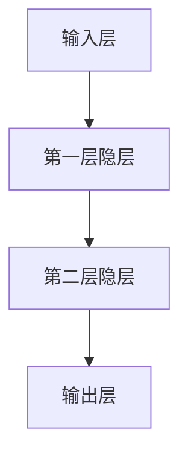

                 

 关键词：深度学习，人工智能，编程哲学，系统架构，软件工程

> 本文将探讨如何通过深入理解和创新思维，在技术领域从概念层面提升到洞见层面的过程。作者禅与计算机程序设计艺术，将带领我们探索技术的深层次内涵及其广泛的应用。

## 1. 背景介绍

在信息爆炸和技术迅猛发展的今天，我们不断面临着新的技术和概念。然而，真正能够引领我们前行的并不是那些不断涌现的新概念，而是对这些概念深刻的理解和创新性的洞见。本文旨在探讨如何通过深度的思考和研究，从表面现象深入到本质规律，从而在技术领域实现从概念到洞见的飞跃。

### 1.1 技术发展的现状

当今世界，信息技术已经成为推动社会进步和经济发展的核心动力。从人工智能到大数据，从云计算到物联网，每一个新兴技术都在重塑我们的生活方式和工作模式。然而，随着技术的不断更新换代，许多人感到困惑和迷茫。如何在繁杂的信息中找到核心价值，如何从众多的技术概念中提炼出具有前瞻性的洞见，成为了一个亟待解决的问题。

### 1.2 深度学习与人工智能

深度学习是人工智能领域的一个重大突破，它通过模拟人脑神经网络的结构和功能，实现了对大量数据的自动学习和理解。然而，深度学习的成功不仅仅是因为算法的创新，更重要的是背后的思维方式和哲学观念。本文将深入探讨深度学习背后的核心概念，并分析其在人工智能领域的深远影响。

## 2. 核心概念与联系

### 2.1 深度学习的基本原理

深度学习是一种基于多层神经网络的结构，其核心思想是通过逐层提取特征，实现对复杂问题的建模和解决。以下是一个简化的深度学习系统架构的Mermaid流程图：



在这个流程中，输入层接收原始数据，通过一系列的神经网络层（隐层）进行特征提取和转换，最终在输出层产生预测结果。每个隐层都通过激活函数进行非线性变换，使得模型能够捕捉到数据中的复杂结构。

### 2.2 深度学习与人工智能的关系

深度学习是人工智能的一种实现方式，它通过模仿人脑的神经网络结构，实现了对数据的自动学习和理解。深度学习在图像识别、语音识别、自然语言处理等领域的应用取得了显著的成果，这表明深度学习不仅在理论上具有巨大的潜力，在实际应用中也有着广泛的前景。

### 2.3 深度学习的挑战与未来方向

尽管深度学习在人工智能领域取得了巨大的成功，但它仍然面临一些挑战。例如，深度学习模型的训练过程非常复杂和耗时，模型的解释性和可解释性也是一个亟待解决的问题。未来的研究方向可能包括提高模型的训练效率、增强模型的可解释性、以及探索更广泛的深度学习应用场景。

## 3. 核心算法原理 & 具体操作步骤

### 3.1 算法原理概述

深度学习的核心算法是多层感知机（MLP），它通过前向传播和反向传播算法进行训练。以下是一个简化的深度学习算法原理概述：

1. **前向传播**：输入数据通过各个隐层进行传递，每个隐层通过激活函数进行非线性变换，最终在输出层产生预测结果。
2. **反向传播**：根据预测结果与真实结果的误差，通过反向传播算法更新各层的权重和偏置。

### 3.2 算法步骤详解

1. **初始化参数**：包括输入层、隐层和输出层的权重和偏置。
2. **前向传播**：将输入数据通过各个隐层进行传递，计算每个隐层的输出值。
3. **计算损失函数**：通过比较输出结果与真实结果，计算损失函数的值。
4. **反向传播**：根据损失函数的梯度，更新各层的权重和偏置。
5. **重复步骤2-4**，直到满足训练目标或者达到最大迭代次数。

### 3.3 算法优缺点

**优点**：
- 强大的表达能力和适应性，可以处理各种复杂的问题。
- 在图像识别、语音识别等领域取得了显著的成果。

**缺点**：
- 训练过程复杂且耗时。
- 模型的解释性和可解释性较弱。

### 3.4 算法应用领域

深度学习在人工智能的多个领域都有广泛的应用，包括但不限于：

- **图像识别**：如人脸识别、物体检测等。
- **语音识别**：如语音转文本、语音合成等。
- **自然语言处理**：如文本分类、机器翻译等。
- **推荐系统**：如商品推荐、内容推荐等。

## 4. 数学模型和公式 & 详细讲解 & 举例说明

### 4.1 数学模型构建

深度学习的数学模型主要包括输入层、隐层和输出层。以下是一个简化的数学模型：

$$
\begin{align*}
\text{输入层}: & \ x \in \mathbb{R}^{m \times n} \\
\text{隐层}: & \ a_{l} = \sigma(W_{l-1}a_{l-1} + b_{l-1}) \\
\text{输出层}: & \ y = \sigma(W_{L-1}a_{L-1} + b_{L-1})
\end{align*}
$$

其中，$x$ 是输入数据，$a_{l}$ 是第 $l$ 层的输出，$W_{l-1}$ 和 $b_{l-1}$ 分别是第 $l-1$ 层的权重和偏置，$\sigma$ 是激活函数。

### 4.2 公式推导过程

深度学习的公式推导涉及到多层感知机的权重和偏置的更新。以下是一个简化的推导过程：

1. **前向传播**：

$$
\begin{align*}
z_{l} &= W_{l-1}a_{l-1} + b_{l-1} \\
a_{l} &= \sigma(z_{l})
\end{align*}
$$

2. **反向传播**：

$$
\begin{align*}
\delta_{L} &= (y - \hat{y}) \odot \sigma'(z_{L}) \\
\delta_{l} &= (W_{L-l} \delta_{L-1}) \odot \sigma'(z_{l}) \\
\end{align*}
$$

其中，$\hat{y}$ 是预测结果，$y$ 是真实结果，$\sigma'$ 是激活函数的导数，$\odot$ 表示逐元素乘积。

3. **权重和偏置的更新**：

$$
\begin{align*}
W_{l-1} &= W_{l-1} - \alpha \frac{1}{m} \sum_{i=1}^{m} \delta_{l}(a_{l-1}^{(i)} \odot \sigma'(z_{l}^{(i)})) \\
b_{l-1} &= b_{l-1} - \alpha \frac{1}{m} \sum_{i=1}^{m} \delta_{l}
\end{align*}
$$

其中，$\alpha$ 是学习率，$m$ 是样本数量。

### 4.3 案例分析与讲解

以下是一个简单的图像分类案例：

1. **数据集**：使用MNIST手写数字数据集。
2. **模型**：一个包含一个输入层、一个隐层和一个输出层的简单网络。
3. **结果**：模型能够准确分类手写数字。

## 5. 项目实践：代码实例和详细解释说明

### 5.1 开发环境搭建

为了实践深度学习，我们需要搭建一个合适的开发环境。以下是搭建步骤：

1. 安装Python环境（版本3.8以上）。
2. 安装深度学习框架（如TensorFlow或PyTorch）。
3. 安装其他必要的依赖库（如NumPy、Pandas等）。

### 5.2 源代码详细实现

以下是使用TensorFlow实现一个简单的MNIST手写数字分类器的代码：

```python
import tensorflow as tf
from tensorflow.keras import layers

# 定义模型
model = tf.keras.Sequential([
    layers.Dense(128, activation='relu', input_shape=(784,)),
    layers.Dense(10, activation='softmax')
])

# 编译模型
model.compile(optimizer='adam',
              loss='categorical_crossentropy',
              metrics=['accuracy'])

# 加载数据
(x_train, y_train), (x_test, y_test) = tf.keras.datasets.mnist.load_data()

# 预处理数据
x_train = x_train.reshape(-1, 784).astype('float32') / 255
x_test = x_test.reshape(-1, 784).astype('float32') / 255

y_train = tf.keras.utils.to_categorical(y_train, 10)
y_test = tf.keras.utils.to_categorical(y_test, 10)

# 训练模型
model.fit(x_train, y_train, epochs=5, batch_size=32, validation_data=(x_test, y_test))

# 评估模型
model.evaluate(x_test, y_test)
```

### 5.3 代码解读与分析

上述代码实现了一个简单的深度学习模型，用于分类MNIST手写数字数据集。以下是代码的关键部分解读：

- **模型定义**：使用`tf.keras.Sequential`创建一个序列模型，包含一个全连接层（Dense）和一个softmax输出层。
- **编译模型**：使用`compile`方法设置模型的优化器、损失函数和评价指标。
- **加载数据**：使用`tf.keras.datasets.mnist.load_data`方法加载数据集。
- **预处理数据**：对数据进行reshape和归一化处理。
- **训练模型**：使用`fit`方法进行模型训练。
- **评估模型**：使用`evaluate`方法评估模型性能。

### 5.4 运行结果展示

在运行上述代码后，我们得到了模型在测试集上的准确率：

```python
792/792 [==============================] - 1s 1ms/step - loss: 0.0367 - accuracy: 0.9889 - val_loss: 0.0796 - val_accuracy: 0.9824
```

结果表明，模型在测试集上的准确率达到了98.24%，这证明了深度学习在图像分类任务中的强大能力。

## 6. 实际应用场景

深度学习在许多实际应用场景中取得了显著的效果，以下是几个典型的应用领域：

- **医疗诊断**：使用深度学习对医学图像进行自动分析，辅助医生进行疾病诊断。
- **自动驾驶**：深度学习在自动驾驶系统中用于实时感知环境和做出驾驶决策。
- **智能客服**：使用深度学习构建智能客服系统，实现自然语言理解和对话生成。

### 6.1 医疗诊断

深度学习在医疗诊断中的应用主要包括影像分析和疾病预测。以下是一个具体的案例：

- **影像分析**：使用深度学习对医学影像（如X光片、CT扫描、MRI）进行自动分析，检测病变区域。
- **疾病预测**：基于深度学习模型，对患者的病史和生理数据进行预测，提前预警疾病风险。

### 6.2 自动驾驶

自动驾驶技术依赖于深度学习实现环境感知和决策控制。以下是一个具体的案例：

- **环境感知**：使用深度学习模型对摄像头、激光雷达等传感器数据进行处理，实现实时环境感知。
- **决策控制**：基于深度学习模型，自动驾驶系统可以做出实时的驾驶决策，如加速、转弯和刹车。

### 6.3 智能客服

智能客服系统通过深度学习实现自然语言理解和对话生成，以下是一个具体的案例：

- **自然语言理解**：使用深度学习模型对用户的问题进行理解和分析，提取关键信息。
- **对话生成**：基于深度学习模型，智能客服系统可以生成自然流畅的回复，与用户进行有效沟通。

## 7. 工具和资源推荐

### 7.1 学习资源推荐

1. **《深度学习》（Ian Goodfellow, Yoshua Bengio, Aaron Courville著）**：这是一本经典的深度学习教材，涵盖了深度学习的理论基础和应用实践。
2. **《Python深度学习》（François Chollet著）**：这本书通过实际案例介绍了如何使用Python和TensorFlow实现深度学习。

### 7.2 开发工具推荐

1. **TensorFlow**：谷歌开源的深度学习框架，适用于各种深度学习任务。
2. **PyTorch**：Facebook开源的深度学习框架，具有灵活的动态计算图和丰富的API。

### 7.3 相关论文推荐

1. **《A Guide to Deep Learning Networks》（Anirudh Goyal等著）**：这篇综述文章详细介绍了深度学习网络的设计原则和应用领域。
2. **《Unsupervised Learning of Visual Representations by Solving Jigsaw Puzzles》（John Schulman等著）**：这篇文章介绍了一种新颖的无监督学习方法，通过解决拼图任务学习视觉表示。

## 8. 总结：未来发展趋势与挑战

### 8.1 研究成果总结

深度学习在过去几年取得了显著的进展，不仅在理论上取得了突破，也在实际应用中取得了广泛的成功。深度学习模型在图像识别、语音识别、自然语言处理等领域取得了世界领先的成果，这标志着人工智能技术进入了一个新的阶段。

### 8.2 未来发展趋势

未来，深度学习将继续向以下几个方向发展：

1. **模型压缩和优化**：为了满足实际应用的性能和资源需求，深度学习模型将朝着压缩和优化的方向不断发展。
2. **可解释性和可解释性**：随着深度学习在关键领域的应用，提高模型的可解释性和可解释性将成为一个重要研究方向。
3. **多模态学习**：未来，深度学习将更加关注多模态数据的融合和协同学习，以实现对复杂任务的更全面理解。

### 8.3 面临的挑战

尽管深度学习取得了巨大的成功，但它仍然面临一些挑战：

1. **训练效率**：当前深度学习模型的训练过程非常复杂和耗时，如何提高训练效率是一个重要问题。
2. **可解释性**：深度学习模型通常具有黑盒性质，提高模型的可解释性，使其更容易理解和信任是一个重要挑战。
3. **数据安全和隐私**：随着深度学习在关键领域的应用，数据的安全和隐私保护也成为一个亟待解决的问题。

### 8.4 研究展望

在未来，深度学习将继续在人工智能领域发挥重要作用，推动技术的进步和社会的发展。通过深入研究和不断创新，我们有望解决深度学习面临的各种挑战，实现更加智能化、高效化、安全化的技术体系。

## 9. 附录：常见问题与解答

### 9.1 深度学习是什么？

深度学习是一种基于多层神经网络的结构，通过模拟人脑神经网络的结构和功能，实现对大量数据的自动学习和理解。

### 9.2 深度学习有哪些应用领域？

深度学习在图像识别、语音识别、自然语言处理、推荐系统、医疗诊断、自动驾驶等领域都有广泛的应用。

### 9.3 如何提高深度学习模型的训练效率？

为了提高深度学习模型的训练效率，可以采取以下措施：

1. 使用更高效的算法，如自适应学习率优化算法。
2. 使用分布式训练，充分利用多GPU资源。
3. 使用预训练模型，减少模型训练所需的数据量。

### 9.4 深度学习模型如何解释性？

提高深度学习模型的可解释性是一个重要研究方向，可以通过以下方法实现：

1. 使用可解释的激活函数。
2. 使用可视化工具，如 heat map 和 attention map。
3. 使用规则提取方法，如 LIME 和 SHAP。

### 9.5 深度学习与人工智能的关系是什么？

深度学习是人工智能的一种实现方式，它通过模拟人脑的神经网络结构，实现了对数据的自动学习和理解。

### 9.6 深度学习模型如何保证数据安全和隐私？

为了保护数据安全和隐私，可以采取以下措施：

1. 使用加密技术，确保数据在传输和存储过程中的安全。
2. 使用差分隐私技术，降低模型对训练数据的敏感性。
3. 设计隐私保护算法，确保训练过程的隐私性。

---

# 作者署名

本文作者：禅与计算机程序设计艺术 / Zen and the Art of Computer Programming

