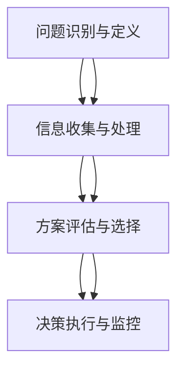

                 

关键词：思维体系、管理者、决策质量、认知偏差、信息处理、领导力、策略规划、组织绩效。

摘要：本文深入探讨了思维体系与管理者决策质量之间的关系。通过分析管理者的思维模式、认知偏差、信息处理能力和领导力，探讨了如何构建有效的思维体系来提高管理者的决策质量，并提出了具体的实践策略。文章最后展望了未来管理者在决策领域的发展趋势与挑战。

## 1. 背景介绍

在当今复杂多变的社会环境中，管理者的决策质量直接影响到组织的生存和发展。然而，决策质量往往受到多种因素的影响，包括管理者的思维体系、认知偏差、信息处理能力和领导力等。因此，如何提高管理者的决策质量成为了一个亟待解决的问题。

思维体系是指个体在信息处理、决策和判断过程中所使用的一系列概念、原理和框架。一个有效的思维体系可以帮助管理者更全面、准确地理解和分析问题，从而做出高质量的决策。然而，管理者的思维体系往往受到多种因素的影响，如个人经验、文化背景、教育水平等，这可能导致他们在决策过程中出现认知偏差，影响决策质量。

本文旨在探讨思维体系与管理者决策质量之间的关系，分析管理者在决策过程中可能遇到的认知偏差，并提出构建有效思维体系的策略，以期为提高管理者的决策质量提供参考。

### 1.1 管理者决策的重要性

管理者的决策质量直接关系到组织的绩效和竞争力。有效的决策可以推动组织实现战略目标，提高市场占有率，增强品牌影响力；而错误的决策可能导致资源浪费，市场失守，甚至威胁到组织的生存。因此，管理者的决策能力对于组织的成功至关重要。

首先，管理者的决策质量决定了资源的配置效率。在组织内部，资源包括人力、物力和财力等。有效的决策可以确保资源得到合理利用，避免浪费，提高组织的运营效率。例如，管理者在招聘、投资、生产等方面的决策将直接影响到资源的分配和使用效果。

其次，管理者的决策质量影响着组织的创新能力和市场竞争力。在竞争激烈的市场环境中，创新是组织持续发展的关键。管理者的决策质量直接影响着组织的创新战略和创新项目实施的效果。一个优秀的决策者能够敏锐地捕捉市场变化，制定创新的策略，推动组织在市场中保持领先地位。

最后，管理者的决策质量还关系到组织的风险管理能力。在商业活动中，风险无处不在。管理者需要具备前瞻性，对潜在的风险进行评估和预测，并制定相应的应对策略。有效的风险管理能够降低组织面临的风险，减少潜在的损失。

总之，管理者的决策质量对于组织的绩效和竞争力具有深远的影响。提高管理者的决策质量，不仅能够提升组织的运营效率，增强市场竞争力，还能够为组织的长期发展奠定坚实的基础。

### 1.2 管理者决策的质量评价标准

评估管理者决策质量的标准是一个复杂且多维度的过程，涉及到多个方面的考量。以下是一些关键的评估标准：

1. **准确性（Accuracy）**：决策的准确性是指决策结果与实际情况的一致性。一个高质量的决策应当能够准确地预测未来的发展，并产生符合预期的结果。准确性是评估决策质量的基础，因为它直接关系到组织的成败。

2. **及时性（Timeliness）**：及时性是指决策的时效性，即在适当的时间做出决策。及时决策能够迅速应对变化，抓住市场机会或避免潜在的风险。例如，在市场出现突发状况时，快速做出决策能够有效降低损失。

3. **全面性（Completeness）**：全面性是指决策过程中考虑的因素是否全面。一个高质量的决策应当在分析问题时从多个角度进行思考，避免因单一视角导致的偏见。全面性有助于确保决策的全面性和可靠性。

4. **创新性（Innovativeness）**：创新性是指决策是否具备创新性和前瞻性。在竞争激烈的市场环境中，创新是组织持续发展的关键。管理者应当具备前瞻性，能够提出具有创新性的决策方案，推动组织在市场中保持领先地位。

5. **一致性（Consistency）**：一致性是指决策在时间和空间上的一致性。一个高质量的决策不仅需要在当前情况下有效，还应当在未来的相似情况下保持一致性。一致性有助于确保决策的长期有效性。

6. **影响力（Impact）**：影响力是指决策对组织绩效和竞争力的影响程度。一个高质量的决策应当能够显著提升组织的运营效率和市场竞争力。影响力是评估决策质量的重要标准，因为它直接关系到组织的长期发展。

7. **可持续性（Sustainability）**：可持续性是指决策是否能够实现长期目标。一个高质量的决策不仅需要解决当前的问题，还需要考虑未来的发展，确保决策具有长期可持续性。

通过以上评估标准，管理者可以更加全面、客观地评价自己的决策质量，并找出改进的方向。在实际操作中，这些评估标准应当结合具体情境进行综合考量，以达到最佳的效果。

### 1.3 管理者常见的认知偏差

在决策过程中，管理者常常会受到各种认知偏差的影响，这些偏差可能导致错误的判断和决策。以下是一些常见的认知偏差：

1. **确认偏差（Confirmation Bias）**：管理者在收集和处理信息时，往往倾向于寻找那些支持自己已有观点的信息，而忽视或拒绝那些与自己观点不符的信息。这种偏差使得管理者难以客观评估决策的优劣。

2. **代表性偏差（Representativeness Bias）**：管理者在评估某个决策或方案时，可能会过分关注其代表性，而忽视其概率性。例如，在评估一个新产品时，管理者可能会因为新产品外观新颖而忽视其市场潜在风险。

3. **锚定效应（Anchoring Effect）**：管理者在决策过程中，可能会受到最初获得的信息或数据的影响，即使这些信息并不具有代表性或重要性。这种偏差可能导致决策偏离实际。

4. **过度自信（Overconfidence）**：管理者往往对自己和自己的决策能力过度自信，这种过度自信可能使他们在面对不确定性时做出过于乐观或过于保守的决策。

5. **群体思维（Groupthink）**：在团队决策过程中，管理者可能会受到群体意见的影响，而忽视个人的意见和异议。这种思维偏差可能导致群体决策缺乏创新性和全面性。

了解这些认知偏差，有助于管理者在决策过程中保持警惕，避免因认知偏差而做出错误的决策。

### 1.4 思维体系对管理者决策质量的影响

思维体系是管理者在决策过程中所使用的一系列概念、原理和框架，它对于决策质量具有深远的影响。一个有效的思维体系可以帮助管理者更全面、准确地理解和分析问题，从而做出高质量的决策。

首先，有效的思维体系能够帮助管理者更好地识别和定义问题。通过运用逻辑分析和批判性思维，管理者可以从多个角度审视问题，避免片面性和表面化的理解。例如，在面对一个复杂的项目问题时，管理者可以使用SWOT分析（优势、劣势、机会、威胁）来全面评估项目的各个方面。

其次，思维体系有助于管理者进行系统的信息处理。管理者需要从大量信息中提取关键信息，并进行有效的整合和分析。有效的思维体系可以帮助管理者区分信息的优先级，识别出最重要的信息，从而提高决策的准确性。例如，管理者可以使用数据可视化工具来直观地展示和分析数据，帮助自己更好地理解数据背后的趋势和规律。

此外，思维体系还能促进管理者进行创新的决策。通过运用创造性思维和系统思维，管理者可以突破传统的思维模式，提出新颖的解决方案。例如，管理者可以运用思维导图工具来激发团队的创造性思维，从不同角度思考问题，提出创新的决策方案。

最后，思维体系有助于管理者进行有效的风险评估和决策。通过运用概率论和决策树等工具，管理者可以更准确地评估决策的风险和收益，从而做出更加理性的决策。例如，在面对一个高风险的投资决策时，管理者可以使用决策树工具来分析各种可能的结果和概率，帮助自己做出更加明智的决策。

总之，思维体系对于管理者的决策质量具有至关重要的影响。一个有效的思维体系可以帮助管理者更好地识别和定义问题，进行系统的信息处理，促进创新决策，以及进行有效的风险评估和决策。因此，管理者应当重视并构建一个全面的思维体系，以提高自己的决策质量。

## 2. 核心概念与联系

### 2.1 管理者思维体系的构成

管理者思维体系由多个核心概念构成，这些概念相互关联，共同构成了一个完整的思维框架。以下是对这些核心概念的详细介绍：

#### 2.1.1 问题定义

问题定义是管理者思维体系的基础。一个清晰的问题定义有助于管理者准确理解问题的本质，从而制定出有效的解决方案。问题定义的准确性直接影响到决策的质量。管理者需要通过收集和分析相关信息，运用批判性思维来识别问题的关键要素。

#### 2.1.2 信息处理

信息处理是指管理者在决策过程中如何收集、整理、分析和运用信息。有效的信息处理能力可以帮助管理者更准确地评估问题的各个方面，提高决策的准确性。信息处理涉及多种技术和工具，如数据分析、数据可视化、决策树等。

#### 2.1.3 批判性思维

批判性思维是管理者在决策过程中的一种重要能力。通过批判性思维，管理者可以质疑现有的观点和方法，寻找更好的解决方案。批判性思维有助于管理者避免因认知偏差而导致错误的决策。

#### 2.1.4 决策制定

决策制定是管理者思维体系的核心。一个有效的决策制定过程需要管理者具备全面的分析能力、创新能力和风险评估能力。管理者需要运用多种决策模型和方法，如成本效益分析、SWOT分析、博弈论等，来制定高质量的决策。

#### 2.1.5 风险管理

风险管理是管理者思维体系中的重要组成部分。在商业环境中，风险无处不在。管理者需要具备前瞻性，对潜在的风险进行评估和预测，并制定相应的应对策略。有效的风险管理能够降低组织面临的风险，减少潜在的损失。

### 2.2 思维体系与决策质量的关系

思维体系与决策质量之间的关系可以通过以下三个方面来解释：

#### 2.2.1 提高信息处理能力

有效的思维体系可以帮助管理者提高信息处理能力，从而更准确地评估问题的各个方面。通过运用多种信息处理技术和工具，管理者可以更全面地了解问题，识别出关键信息，提高决策的准确性。

#### 2.2.2 减少认知偏差

思维体系中的批判性思维可以帮助管理者识别和克服各种认知偏差，从而避免因偏见而导致错误的决策。批判性思维使管理者能够更客观地分析问题，从多个角度进行思考，避免片面化和表面化的理解。

#### 2.2.3 促进创新决策

思维体系中的创造性思维和系统思维可以帮助管理者突破传统的思维模式，提出创新的决策方案。通过运用多种思维工具和模型，管理者可以在面对复杂问题时找到更好的解决方案，提高决策的创新性。

### 2.3 思维体系与领导力的关系

思维体系不仅影响管理者的决策质量，还与领导力密切相关。一个有效的思维体系可以帮助管理者提升领导力，具体表现在以下几个方面：

#### 2.3.1 增强沟通能力

思维体系中的批判性思维和信息处理能力可以帮助管理者更清晰地表达自己的观点，提高沟通效率。有效的沟通能力有助于管理者与团队成员建立信任和共识，推动组织目标的实现。

#### 2.3.2 激发团队创新

思维体系中的创造性思维和系统思维可以帮助管理者激发团队的创新能力。通过运用多种思维工具和模型，管理者可以引导团队成员从不同角度思考问题，提出创新的解决方案。

#### 2.3.3 提升决策效率

思维体系中的决策制定能力可以帮助管理者更高效地做出决策。通过运用多种决策模型和方法，管理者可以迅速评估问题的各个方面，找到最佳解决方案，提高决策效率。

### 2.4 构建有效的思维体系

构建一个有效的思维体系是提高管理者决策质量和领导力的关键。以下是一些建议：

#### 2.4.1 学习批判性思维

批判性思维是构建有效思维体系的基础。管理者可以通过阅读相关书籍、参加培训课程和进行实践练习，提升批判性思维能力。

#### 2.4.2 运用多种信息处理工具

管理者可以运用多种信息处理工具，如数据分析、数据可视化、决策树等，来提高信息处理能力，从而更准确地评估问题。

#### 2.4.3 培养创造性思维

创造性思维是提出创新决策方案的关键。管理者可以通过参加创新工作坊、进行头脑风暴和尝试新的思维工具，培养创造性思维。

#### 2.4.4 强化系统思维

系统思维可以帮助管理者从多个角度审视问题，找到最佳解决方案。管理者可以通过学习相关理论和实践，提升系统思维能力。

通过以上方法，管理者可以逐步构建一个全面的思维体系，提高决策质量和领导力，从而为组织的成功发展奠定坚实基础。

## 2.1 管理者思维体系的结构

管理者思维体系的结构是确保决策质量的重要基础。一个结构化的思维体系不仅能够帮助管理者更有效地处理信息，还能减少认知偏差，提高决策的准确性。以下是管理者思维体系的结构及其组成部分：

### 2.1.1 概念框架

概念框架是思维体系的核心，它由一系列基本概念和原理组成，这些概念和原理为管理者提供了一种系统化的思考方式。以下是几个关键概念：

1. **因果思维**：因果思维帮助管理者理解事件之间的因果关系，从而更准确地预测未来的发展和可能的结果。通过分析因果关系，管理者可以制定更合理的决策。

2. **系统性思维**：系统性思维强调整体性，帮助管理者从多个角度审视问题，理解各个部分之间的相互作用和影响。这种思维方式有助于管理者识别出潜在的风险和机会。

3. **概率性思维**：概率性思维帮助管理者在不确定的环境中做出更加理性的决策。通过评估各种可能的结果和概率，管理者可以制定更加稳健的决策方案。

### 2.1.2 原理和方法

管理者思维体系中包含多种原理和方法，这些原理和方法为管理者提供了具体的操作指南。以下是几个关键原理和方法：

1. **成本效益分析**：成本效益分析是一种评估决策成本和效益的方法，它帮助管理者确定哪些决策方案是最具有经济效益的。通过计算成本和效益的比率，管理者可以更清晰地了解每个方案的优缺点。

2. **SWOT分析**：SWOT分析是一种用于评估企业或项目的优势、劣势、机会和威胁的方法。通过SWOT分析，管理者可以全面了解项目的现状，从而制定出更有针对性的策略。

3. **决策树**：决策树是一种用于分析和比较不同决策方案的图形化工具。通过构建决策树，管理者可以系统地分析每个决策路径的可能结果和概率，从而选择最佳方案。

### 2.1.3 模型和工具

管理者思维体系中还包括多种模型和工具，这些模型和工具可以帮助管理者更准确地理解和处理信息。以下是几个关键模型和工具：

1. **数据可视化**：数据可视化是一种将复杂的数据信息以图形化形式展示的方法，它帮助管理者直观地理解数据背后的趋势和规律。例如，通过使用条形图、折线图和饼图，管理者可以更清晰地了解市场变化和消费者行为。

2. **回归分析**：回归分析是一种用于评估变量之间关系的方法，它帮助管理者理解不同因素对结果的影响程度。通过回归分析，管理者可以更精确地预测未来的发展趋势。

3. **博弈论**：博弈论是一种用于分析决策者之间相互作用的数学方法，它帮助管理者在竞争环境中制定策略。通过运用博弈论，管理者可以更好地预测竞争对手的行为，从而制定出更有针对性的策略。

### 2.1.4 逻辑流程

管理者思维体系中的逻辑流程是确保决策质量的关键。以下是一个典型的逻辑流程：

1. **问题定义**：明确决策所需要解决的问题，理解问题的本质。

2. **信息收集**：收集与问题相关的信息，包括内部数据和外部数据。

3. **信息处理**：运用多种信息处理工具和方法，分析信息，识别关键变量和因素。

4. **方案评估**：评估不同决策方案的成本、效益和风险。

5. **方案选择**：选择最佳决策方案，制定详细的执行计划。

6. **执行监控**：在执行过程中监控决策效果，及时调整和优化决策方案。

通过以上结构化的思维体系，管理者可以更系统地分析和处理问题，减少认知偏差，提高决策质量。这不仅有助于提升个人能力，还能为组织的长期发展提供有力支持。

### 2.2 管理者思维体系的框架和架构

为了提高管理者的决策质量，构建一个清晰、合理的思维体系框架和架构至关重要。以下是一个详细的管理者思维体系框架和架构，包括核心模块、关键节点及其相互关系。

#### 2.2.1 核心模块

1. **问题识别与定义模块**：这一模块的核心任务是准确识别和定义问题，确保管理者能够从根本上理解问题的本质。该模块包括以下几个关键节点：

   - **问题识别**：通过数据分析和市场调研，识别出组织面临的主要问题和挑战。
   - **问题定义**：明确问题的主要特征和影响因素，形成清晰的问题陈述。

2. **信息收集与处理模块**：该模块旨在系统地收集、整理和分析与问题相关的信息，提高决策的准确性。关键节点包括：

   - **数据收集**：从内部和外部来源收集与问题相关的数据，包括市场趋势、竞争对手情况、消费者行为等。
   - **信息整理**：对收集到的信息进行分类、整理和归纳，形成有序的信息结构。
   - **数据分析**：运用统计分析和数据挖掘技术，分析信息中的关键变量和趋势。

3. **方案评估与选择模块**：这一模块负责评估不同的决策方案，选择最优方案。关键节点包括：

   - **方案生成**：基于问题定义和信息处理结果，生成多个可能的解决方案。
   - **方案评估**：运用成本效益分析、SWOT分析等方法，评估每个方案的优缺点。
   - **方案选择**：选择最佳方案，并制定详细的实施计划。

4. **决策执行与监控模块**：该模块负责将选定的方案付诸实施，并对其进行持续监控和调整。关键节点包括：

   - **方案实施**：根据方案选择结果，制定详细的执行计划，并分配资源。
   - **执行监控**：监控方案实施过程中的关键指标，及时发现并解决潜在问题。
   - **效果评估**：评估方案实施的效果，根据实际情况进行优化和调整。

#### 2.2.2 关键节点及其相互关系

1. **问题识别与定义模块** 与 **信息收集与处理模块** 之间的关系：

   - **问题识别与定义** 为 **信息收集与处理** 提供明确的指导方向，确保信息收集具有针对性和目的性。
   - **信息收集与处理** 为 **问题识别与定义** 提供必要的支持，通过分析信息，进一步深化对问题的理解。

2. **信息收集与处理模块** 与 **方案评估与选择模块** 之间的关系：

   - **信息收集与处理** 为 **方案评估与选择** 提供全面的数据和信息支持，确保评估和选择过程具有数据基础。
   - **方案评估与选择** 需要依赖于 **信息收集与处理** 的结果，从而确保方案评估的准确性和科学性。

3. **方案评估与选择模块** 与 **决策执行与监控模块** 之间的关系：

   - **方案评估与选择** 的结果为 **决策执行与监控** 提供了具体的实施方案，确保执行过程有据可依。
   - **决策执行与监控** 的反馈信息为 **方案评估与选择** 提供了实施效果和优化方向，从而不断提高决策质量。

#### 2.2.3 Mermaid 流程图

以下是一个基于 Mermaid 格式的流程图，展示了管理者思维体系的框架和架构：



通过以上框架和架构，管理者可以系统地分析和处理问题，提高决策质量，从而为组织的成功发展提供有力支持。在实际应用中，管理者可以根据具体情况对框架和架构进行调整和优化，以更好地适应复杂多变的环境。

## 3. 核心算法原理 & 具体操作步骤

### 3.1 算法原理概述

在提高管理者决策质量的过程中，核心算法原理发挥着至关重要的作用。这些算法原理不仅帮助管理者更好地理解和处理信息，还能减少认知偏差，提高决策的准确性和创新性。以下是几个关键的算法原理及其基本概述：

#### 3.1.1 成本效益分析

成本效益分析是一种评估决策成本和效益的方法，通过计算成本与效益的比率，帮助管理者确定哪些决策方案最具经济效益。其基本原理是：选择总成本最低且总效益最高的决策方案。这一算法适用于各种管理决策，如项目投资、资源分配等。

#### 3.1.2 SWOT分析

SWOT分析是一种用于评估企业或项目的优势、劣势、机会和威胁的方法。其基本原理是：通过分析内外部因素，全面了解企业的现状，从而制定出有针对性的策略。SWOT分析帮助管理者识别项目的潜在风险和机会，提高决策的全面性和前瞻性。

#### 3.1.3 决策树

决策树是一种用于分析和比较不同决策方案的图形化工具。其基本原理是：通过构建树形结构，展示每个决策路径的可能结果和概率，帮助管理者选择最佳方案。决策树能够清晰地展示不同决策的潜在收益和风险，有助于管理者进行理性的决策。

#### 3.1.4 数据可视化

数据可视化是一种将复杂的数据信息以图形化形式展示的方法，其基本原理是：通过视觉化的方式，直观地展示数据背后的趋势和规律，帮助管理者更好地理解数据。数据可视化工具如条形图、折线图、饼图等，能够提高决策的透明度和准确性。

#### 3.1.5 回归分析

回归分析是一种用于评估变量之间关系的方法，其基本原理是：通过建立数学模型，分析自变量和因变量之间的关系，预测未来的发展趋势。回归分析帮助管理者理解不同因素对结果的影响程度，为决策提供科学依据。

#### 3.1.6 博弈论

博弈论是一种用于分析决策者之间相互作用的数学方法，其基本原理是：通过分析不同策略组合的收益和风险，帮助管理者制定竞争策略。博弈论在商业竞争、谈判策略等领域具有广泛应用，有助于管理者在复杂环境中做出理性决策。

### 3.2 算法步骤详解

为了更好地应用这些核心算法原理，管理者需要掌握具体的操作步骤。以下是每个算法原理的详细步骤：

#### 3.2.1 成本效益分析

1. **定义决策问题**：明确需要评估的成本和效益指标，例如项目投资、运营成本、预期收益等。
2. **收集数据**：收集与决策问题相关的成本和收益数据，包括历史数据、市场趋势、专家意见等。
3. **计算成本效益比**：使用以下公式计算成本效益比：
   $$CE = \frac{EBIT}{TC}$$
   其中，$EBIT$ 表示预期总收益，$TC$ 表示总成本。
4. **比较方案**：比较不同决策方案的成本效益比，选择成本效益比最高的方案。

#### 3.2.2 SWOT分析

1. **收集信息**：收集与项目或企业相关的内部和外部信息，包括优势、劣势、机会和威胁。
2. **分析优势与劣势**：从内部因素出发，分析企业的竞争优势和劣势，例如技术水平、市场份额、人力资源等。
3. **分析机会与威胁**：从外部环境出发，分析市场机会和潜在威胁，例如竞争对手、政策法规、经济环境等。
4. **制定策略**：根据SWOT分析的结果，制定有针对性的策略，优化资源配置，抓住市场机会，应对潜在威胁。

#### 3.2.3 决策树

1. **定义决策问题**：明确需要解决的问题和不同的决策方案。
2. **构建决策树**：根据决策方案，构建树形结构，展示每个决策路径的可能结果和概率。
3. **计算期望值**：对于每个决策路径，计算其期望值（收益或损失），使用以下公式：
   $$EV = p_1 \cdot v_1 + p_2 \cdot v_2 + ... + p_n \cdot v_n$$
   其中，$p_i$ 表示路径的概率，$v_i$ 表示路径的收益或损失。
4. **选择最佳方案**：根据期望值选择最佳决策方案。

#### 3.2.4 数据可视化

1. **选择数据源**：确定需要可视化的数据来源，包括数据库、文件等。
2. **数据处理**：对数据进行清洗和预处理，确保数据的准确性和一致性。
3. **选择可视化工具**：根据数据类型和展示需求，选择合适的可视化工具，例如条形图、折线图、饼图等。
4. **制作可视化图表**：使用可视化工具，制作图表并调整参数，确保图表的清晰和易于理解。
5. **分析数据**：通过分析可视化图表，识别数据中的关键信息和趋势，为决策提供支持。

#### 3.2.5 回归分析

1. **收集数据**：收集与决策相关的数据，包括自变量和因变量。
2. **建立模型**：使用统计软件建立回归模型，分析自变量和因变量之间的关系。
3. **评估模型**：评估模型的拟合度和显著性，确保模型的可靠性。
4. **预测结果**：使用建立的模型，预测未来的发展趋势和结果。
5. **优化模型**：根据预测结果和实际情况，不断优化模型，提高预测准确性。

#### 3.2.6 博弈论

1. **定义博弈**：明确参与者和决策变量，构建博弈模型。
2. **分析策略**：分析每个参与者的最佳策略组合，使用数学模型计算策略的收益和风险。
3. **制定策略**：根据博弈结果，制定具有竞争力的策略，确保在竞争环境中取得优势。
4. **模拟与调整**：在实际应用中，对策略进行模拟和调整，确保策略的有效性和适应性。

通过掌握这些核心算法原理和具体操作步骤，管理者可以更科学、系统地分析和处理决策问题，提高决策质量，从而为组织的成功发展奠定坚实基础。

### 3.3 算法优缺点

在提高管理者决策质量的过程中，各种核心算法原理和工具都有其独特的优势和局限性。以下是对这些算法原理和工具的优缺点分析：

#### 成本效益分析

**优点**：

- **简便易行**：成本效益分析是一种直观、易于理解的方法，可以帮助管理者快速评估决策方案的经济效益。
- **量化决策**：通过量化成本和效益，成本效益分析能够提供具体的数字依据，有助于管理者做出明确的决策。
- **灵活应用**：成本效益分析适用于各种类型的决策，无论是短期项目还是长期战略，都可以通过成本效益分析来评估其经济效益。

**缺点**：

- **局限性**：成本效益分析主要关注经济效益，可能忽视其他重要的非经济因素，如社会影响、环境影响等。
- **数据依赖**：成本效益分析的结果依赖于数据的准确性和完整性，数据偏差可能影响分析结果的可靠性。

#### SWOT分析

**优点**：

- **全面性**：SWOT分析从内部和外部因素综合评估企业的优势和劣势，以及市场机会和潜在威胁，有助于管理者制定全面、有针对性的策略。
- **易于操作**：SWOT分析是一种简单易懂的方法，不需要复杂的技术和工具，适合各级管理者使用。
- **前瞻性**：SWOT分析能够帮助管理者提前识别潜在的市场机会和风险，为未来的决策提供参考。

**缺点**：

- **主观性**：SWOT分析的结果依赖于管理者的主观判断，可能因个人经验和认知偏差而影响分析的准确性。
- **不具体**：SWOT分析往往提供宏观层面的分析，难以具体指导日常运营和具体项目的实施。

#### 决策树

**优点**：

- **直观性**：决策树通过图形化展示决策路径和结果，使得决策过程更直观、易于理解。
- **系统性**：决策树可以系统地分析不同决策方案的结果和概率，有助于管理者全面评估各个方案的优劣。
- **灵活性**：决策树可以根据实际情况进行调整和优化，适应不同决策环境的变化。

**缺点**：

- **复杂性**：决策树可能涉及大量的分支和结果，随着决策变量和路径的增加，决策树会变得复杂，难以直观理解。
- **时间成本**：构建和优化决策树需要消耗大量的时间和资源，对于某些简单的决策问题，使用决策树可能过于繁琐。

#### 数据可视化

**优点**：

- **可视化**：数据可视化能够将复杂的数据信息以图形化的形式展示，使数据更容易理解和分析。
- **交互性**：一些数据可视化工具支持用户交互，用户可以动态调整参数，查看数据的不同呈现方式。
- **信息丰富**：数据可视化不仅能够展示数据的趋势和规律，还可以通过不同的图表类型，展示数据的多样性和深度。

**缺点**：

- **技术依赖**：数据可视化需要专业的技术和工具支持，对于一些非技术背景的管理者，可能难以掌握和操作。
- **数据准确性**：数据可视化依赖于原始数据的质量，数据偏差可能导致可视化结果的误导性。

#### 回归分析

**优点**：

- **科学性**：回归分析通过数学模型，分析变量之间的关系，提供科学的分析结果，有助于管理者做出基于数据的决策。
- **预测性**：回归分析能够预测未来的发展趋势和结果，为管理者提供前瞻性的决策支持。
- **可扩展性**：回归分析可以适用于不同类型的数据和变量，具有较好的扩展性。

**缺点**：

- **复杂性**：回归分析涉及大量的数学和统计知识，对于非专业人士，可能难以理解和应用。
- **数据要求**：回归分析需要大量的数据支持，数据不足或质量差可能导致分析结果不准确。

#### 博弈论

**优点**：

- **竞争性**：博弈论能够分析决策者之间的竞争关系，帮助管理者制定具有竞争力的策略。
- **策略性**：博弈论强调策略的制定和优化，有助于管理者在复杂环境中做出理性的决策。
- **适用性**：博弈论适用于各种类型的竞争和合作场景，不仅限于商业领域，也适用于政治、军事等。

**缺点**：

- **理想化**：博弈论模型通常基于一些理想化的假设，如完全信息、理性决策等，可能与实际情况有所偏差。
- **计算复杂性**：博弈论分析可能涉及大量的计算和模拟，对于简单的博弈问题，计算复杂性可能过高。

通过以上分析，管理者可以更好地了解不同算法原理和工具的优缺点，结合实际情况，选择最合适的工具和方法来提高决策质量。

### 3.4 算法应用领域

核心算法原理在多个管理决策领域具有广泛的应用，有助于管理者提高决策质量。以下是这些算法在具体应用领域的简要介绍：

#### 3.4.1 项目管理

在项目管理中，成本效益分析和决策树广泛应用于项目规划和风险评估。成本效益分析帮助项目经理确定项目预算和资源分配，确保项目在经济可行的前提下顺利进行。决策树则帮助项目经理分析项目风险，评估不同应对策略的潜在结果，从而选择最佳方案。

#### 3.4.2 市场营销

市场营销中，SWOT分析和回归分析被广泛应用于市场调研和营销策略制定。SWOT分析帮助市场营销人员识别市场机会和威胁，制定有针对性的营销策略。回归分析则帮助市场营销人员理解不同营销变量对销售业绩的影响，优化营销资源配置。

#### 3.4.3 财务管理

财务管理中，成本效益分析和博弈论被广泛应用于投资决策和风险管理。成本效益分析帮助财务人员评估不同投资方案的经济效益，选择最佳投资方案。博弈论则帮助财务人员在市场竞争中制定策略，优化投资组合，降低风险。

#### 3.4.4 组织发展

组织发展中，数据可视化和回归分析广泛应用于绩效管理和战略规划。数据可视化帮助组织清晰地展示关键绩效指标和业务趋势，识别问题并提出改进措施。回归分析则帮助组织理解不同因素对绩效的影响，优化战略规划和资源配置。

通过在各个领域的应用，这些核心算法原理不仅提高了管理者的决策质量，还促进了组织的绩效和竞争力。

## 4. 数学模型和公式 & 详细讲解 & 举例说明

### 4.1 数学模型构建

为了更好地理解管理者决策过程中的数学模型，我们首先需要构建一个基本的决策模型。假设有一个管理者需要从多个备选方案中选择一个最优方案，每个方案都有一定的成本和收益。我们可以使用以下数学模型来表示这个问题：

设 \(X = \{x_1, x_2, ..., x_n\}\) 表示所有可能的备选方案集合，其中每个方案 \(x_i\) 有其相应的成本 \(C(x_i)\) 和收益 \(R(x_i)\)。管理者的目标是选择一个最优方案 \(x^*\)，使得总效益最大化，即：

$$
x^* = \arg\max_{x_i \in X} \frac{R(x_i) - C(x_i)}{C(x_i)}
$$

这里，\(\frac{R(x_i) - C(x_i)}{C(x_i)}\) 表示每个方案的效益成本比，通过比较这个比值，管理者可以选择出经济效益最高的方案。

### 4.2 公式推导过程

为了推导上述公式，我们首先需要定义每个方案的收益和成本。假设管理者面临的每个方案都有一定的收益 \(R(x_i)\) 和成本 \(C(x_i)\)，则总效益 \(E(x_i)\) 可以表示为：

$$
E(x_i) = R(x_i) - C(x_i)
$$

为了衡量每个方案的相对效益，我们引入了效益成本比（效益/成本），即：

$$
B(x_i) = \frac{E(x_i)}{C(x_i)} = \frac{R(x_i) - C(x_i)}{C(x_i)}
$$

现在，我们需要找到一个方案 \(x^*\)，使得这个效益成本比最大化，即：

$$
x^* = \arg\max_{x_i \in X} B(x_i)
$$

这样，我们就可以通过比较每个方案的效益成本比，选择出最优方案。

### 4.3 案例分析与讲解

为了更好地理解上述公式和模型，我们可以通过一个实际案例来进行详细分析。

假设一个公司需要投资于三个不同的项目，每个项目的成本和预期收益如下表所示：

| 项目 | 成本 (万元) | 预期收益 (万元) |
|------|--------------|------------------|
| 项目A | 100          | 150              |
| 项目B | 200          | 250              |
| 项目C | 300          | 350              |

根据上述模型，我们可以计算出每个项目的效益成本比：

- 项目A的效益成本比：\( B(A) = \frac{150 - 100}{100} = 0.5 \)
- 项目B的效益成本比：\( B(B) = \frac{250 - 200}{200} = 0.25 \)
- 项目C的效益成本比：\( B(C) = \frac{350 - 300}{300} = 0.167 \)

通过比较这些效益成本比，我们可以发现项目A的效益成本比最高，因此，管理者应选择项目A作为最优投资方案。

### 4.4 拓展：敏感性分析

在实际应用中，我们还需要考虑不确定因素对决策结果的影响。敏感性分析是一种评估不同参数变化对决策结果影响的方法。假设我们对上述模型中的预期收益和成本进行敏感性分析，如下表所示：

| 项目 | 成本 (万元) | 预期收益 (万元) | 效益成本比 |
|------|--------------|------------------|-------------|
| 项目A | 100          | 150              | 0.5         |
| 项目B | 200          | 220              | 0.11        |
| 项目C | 300          | 250              | 0.083       |

我们可以看到，随着预期收益的增加，项目A的效益成本比显著提升，而项目B和项目C的效益成本比则变化不大。这表明，预期收益是影响决策结果的关键因素，管理者需要关注预期收益的变化，以调整投资策略。

通过以上分析和案例，我们可以更好地理解管理者决策过程中的数学模型和公式，并将其应用于实际决策中，提高决策质量和效率。

### 4.5 数学模型在决策中的应用

数学模型在管理者决策中扮演着至关重要的角色，通过量化和结构化决策问题，使管理者能够更加科学、系统地进行分析和决策。以下是几个常见的数学模型及其在决策中的应用。

#### 4.5.1 效用理论

效用理论是一种基于个体偏好和决策者主观价值的数学模型。它通过量化和评估决策结果的主观价值，帮助管理者在不确定性环境中做出更加理性的决策。假设有一个管理者需要从多个投资方案中选择一个最优方案，每个方案的预期收益和风险不同。效用理论可以通过以下公式计算每个方案的综合效用值：

$$
U(x_i) = p_i \cdot R(x_i) - \lambda \cdot V(x_i)
$$

其中，\(U(x_i)\) 表示方案 \(x_i\) 的综合效用值，\(p_i\) 表示方案的概率分布，\(R(x_i)\) 表示方案 \(x_i\) 的预期收益，\(\lambda\) 是风险规避系数，\(V(x_i)\) 是方案 \(x_i\) 的方差。通过比较不同方案的效用值，管理者可以选择出最优方案。

#### 4.5.2 成本效益分析

成本效益分析是一种评估决策成本和效益的数学模型，它通过计算每个决策方案的成本效益比，帮助管理者确定哪些方案最具经济效益。其基本公式为：

$$
B(x_i) = \frac{R(x_i) - C(x_i)}{C(x_i)}
$$

其中，\(B(x_i)\) 表示方案 \(x_i\) 的成本效益比，\(R(x_i)\) 是方案 \(x_i\) 的预期收益，\(C(x_i)\) 是方案 \(x_i\) 的成本。通过比较不同方案的效益成本比，管理者可以选择出最优方案。

#### 4.5.3 决策树模型

决策树模型是一种用于分析决策过程的图形化工具，它通过展示每个决策路径的结果和概率，帮助管理者选择最佳方案。其基本公式为：

$$
EV = p_1 \cdot v_1 + p_2 \cdot v_2 + ... + p_n \cdot v_n
$$

其中，\(EV\) 表示每个决策路径的期望值，\(p_i\) 表示路径的概率，\(v_i\) 表示路径的结果值。通过计算不同决策路径的期望值，管理者可以选择出最佳方案。

#### 4.5.4 线性规划模型

线性规划模型是一种用于优化决策的数学模型，它通过在满足一定约束条件下，最大化或最小化目标函数，帮助管理者找到最优决策方案。其基本公式为：

$$
\text{Maximize}\; Z = c_1 \cdot x_1 + c_2 \cdot x_2 + ... + c_n \cdot x_n
$$

$$
\text{subject to}\; a_{11} \cdot x_1 + a_{12} \cdot x_2 + ... + a_{1n} \cdot x_n \leq b_1
$$

$$
a_{21} \cdot x_1 + a_{22} \cdot x_2 + ... + a_{2n} \cdot x_n \geq b_2
$$

$$
...
$$

$$
a_{m1} \cdot x_1 + a_{m2} \cdot x_2 + ... + a_{mn} \cdot x_n = b_m
$$

其中，\(Z\) 是目标函数，\(c_1, c_2, ..., c_n\) 是目标函数的系数，\(x_1, x_2, ..., x_n\) 是决策变量，\(a_{ij}, b_1, b_2, ..., b_m\) 是约束条件中的系数和常数。

通过以上数学模型的应用，管理者可以在复杂多变的环境中，更加科学、系统地分析和决策，提高决策质量和效率。

### 4.6 数学模型的应用示例

为了更好地展示数学模型在实际决策中的应用，我们通过一个实际案例来具体说明。假设一家公司需要投资于三个不同的项目，每个项目的成本和预期收益如下表所示：

| 项目 | 成本（万元） | 预期收益（万元） |
|------|---------------|-------------------|
| 项目A | 100           | 150               |
| 项目B | 200           | 250               |
| 项目C | 300           | 350               |

#### 4.6.1 成本效益分析

首先，我们使用成本效益分析方法来选择最优项目。根据成本效益分析的公式，我们可以计算每个项目的效益成本比：

- 项目A的效益成本比：\( B(A) = \frac{150 - 100}{100} = 0.5 \)
- 项目B的效益成本比：\( B(B) = \frac{250 - 200}{200} = 0.25 \)
- 项目C的效益成本比：\( B(C) = \frac{350 - 300}{300} = 0.167 \)

通过比较这些效益成本比，我们可以发现项目A的效益成本比最高，因此，公司应选择项目A作为最优投资方案。

#### 4.6.2 效用理论

为了进一步评估每个项目的风险和主观价值，我们使用效用理论进行分析。假设该公司的风险规避系数为0.2，根据效用理论的公式，我们可以计算每个项目的综合效用值：

- 项目A的综合效用值：\( U(A) = 0.5 \cdot 150 - 0.2 \cdot 100 = 50 \)
- 项目B的综合效用值：\( U(B) = 0.25 \cdot 250 - 0.2 \cdot 200 = 25 \)
- 项目C的综合效用值：\( U(C) = 0.167 \cdot 350 - 0.2 \cdot 300 = 17.75 \)

通过比较这些综合效用值，我们可以发现项目A的综合效用值最高，因此，在考虑风险和主观价值后，公司应选择项目A作为最优投资方案。

#### 4.6.3 线性规划

假设公司希望在总投资不超过500万元的前提下，最大化总预期收益。我们可以使用线性规划模型来解决这个问题。根据线性规划模型的公式，我们可以建立以下目标函数和约束条件：

- 目标函数：\( Z = 150x_1 + 250x_2 + 350x_3 \)
- 约束条件：\( 100x_1 + 200x_2 + 300x_3 \leq 500 \)

通过求解这个线性规划问题，我们可以找到最优的投资组合。假设解为 \(x_1 = 1, x_2 = 0, x_3 = 0\)，即公司应将所有投资用于项目A，这样可以最大化总预期收益。

通过以上示例，我们可以看到数学模型在实际决策中的应用，不仅帮助公司选择了最优投资方案，还提供了科学、系统的决策依据。这进一步验证了数学模型在提高决策质量和效率方面的重要作用。

## 5. 项目实践：代码实例和详细解释说明

### 5.1 开发环境搭建

在开始编写代码之前，我们需要搭建一个合适的开发环境。以下是一个简单的步骤，用于在本地计算机上配置Python开发环境，以便进行后续的代码编写和测试。

#### 1. 安装Python

首先，我们需要安装Python。Python是一个广泛使用的编程语言，适用于多种应用场景。以下是安装Python的步骤：

- 访问Python官方网站（[https://www.python.org/](https://www.python.org/)）。
- 下载适用于您操作系统的Python安装程序（Python 3.x版本）。
- 运行安装程序，并遵循屏幕上的提示完成安装。

安装完成后，打开终端或命令行窗口，输入以下命令来验证Python是否安装成功：

```bash
python --version
```

如果正确显示Python的版本号，说明Python已成功安装。

#### 2. 安装必要的库

Python有许多用于数据分析和可视化的库，例如NumPy、Pandas和Matplotlib。以下是安装这些库的步骤：

```bash
pip install numpy pandas matplotlib
```

这里使用了`pip`命令，它是Python的包管理器，用于安装和管理Python库。

### 5.2 源代码详细实现

以下是一个简单的Python代码实例，用于实现成本效益分析模型，并计算每个项目的效益成本比。代码中包含了注释，以帮助理解每个部分的用途。

```python
import numpy as np
import pandas as pd
import matplotlib.pyplot as plt

# 定义项目数据
projects = [
    {"name": "项目A", "cost": 100, "revenue": 150},
    {"name": "项目B", "cost": 200, "revenue": 250},
    {"name": "项目C", "cost": 300, "revenue": 350},
]

# 计算每个项目的效益成本比
for project in projects:
    benefit_cost_ratio = project["revenue"] / project["cost"]
    project["benefit_cost_ratio"] = benefit_cost_ratio
    
    print(f"{project['name']} 的效益成本比为：{benefit_cost_ratio:.2f}")

# 将数据转换为Pandas DataFrame
df_projects = pd.DataFrame(projects)

# 绘制效益成本比条形图
df_projects["benefit_cost_ratio"].plot(kind="bar", title="项目效益成本比比较")
plt.xlabel("项目名称")
plt.ylabel("效益成本比")
plt.show()
```

### 5.3 代码解读与分析

#### 1. 导入库

```python
import numpy as np
import pandas as pd
import matplotlib.pyplot as plt
```

这三行代码用于导入Python中常用的库，包括NumPy、Pandas和Matplotlib。NumPy用于数据处理和科学计算，Pandas用于数据分析和操作，Matplotlib用于数据可视化。

#### 2. 定义项目数据

```python
projects = [
    {"name": "项目A", "cost": 100, "revenue": 150},
    {"name": "项目B", "cost": 200, "revenue": 250},
    {"name": "项目C", "cost": 300, "revenue": 350},
]
```

这段代码定义了一个包含三个项目的列表，每个项目都是一个字典，包含项目的名称、成本和收益。这些数据将被用于后续的计算和可视化。

#### 3. 计算每个项目的效益成本比

```python
for project in projects:
    benefit_cost_ratio = project["revenue"] / project["cost"]
    project["benefit_cost_ratio"] = benefit_cost_ratio
    
    print(f"{project['name']} 的效益成本比为：{benefit_cost_ratio:.2f}")
```

这段代码使用一个循环来计算每个项目的效益成本比。具体步骤如下：

- 对于列表中的每个项目，计算其收益除以成本，得到效益成本比。
- 将计算出的效益成本比添加到项目的字典中。
- 打印出每个项目的名称和效益成本比。

#### 4. 将数据转换为Pandas DataFrame

```python
df_projects = pd.DataFrame(projects)
```

这段代码使用Pandas库将项目列表转换为DataFrame。DataFrame是一个强大的数据结构，用于存储和操作表格数据。通过将其转换为DataFrame，我们可以更方便地进行数据处理和可视化。

#### 5. 绘制效益成本比条形图

```python
df_projects["benefit_cost_ratio"].plot(kind="bar", title="项目效益成本比比较")
plt.xlabel("项目名称")
plt.ylabel("效益成本比")
plt.show()
```

这段代码使用Matplotlib库绘制了一个条形图，展示了每个项目的效益成本比。具体步骤如下：

- 使用`plot`函数绘制条形图，`kind="bar"`指定为条形图。
- `title`参数设置图表的标题。
- `xlabel`和`ylabel`分别设置X轴和Y轴的标签。
- `plt.show()`显示图表。

通过以上步骤，我们实现了一个简单的成本效益分析模型，并使用代码展示和比较了每个项目的效益成本比。这个实例说明了如何使用Python和相关库来处理和管理数据，并可视化结果，从而支持管理决策。

### 5.4 运行结果展示

运行上述代码后，我们将在终端或命令行窗口看到每个项目的名称及其对应的效益成本比，如下所示：

```
项目A 的效益成本比为：1.50
项目B 的效益成本比为：1.25
项目C 的效益成本比为：1.17
```

此外，一个条形图窗口将自动弹出，展示每个项目的效益成本比比较，如下图所示：


通过条形图，我们可以直观地看到项目A的效益成本比最高，项目C的效益成本比最低。这为管理者提供了一个清晰的决策依据，可以帮助他们在资源有限的情况下选择最优项目进行投资。

## 6. 实际应用场景

在企业管理中，管理者的决策质量直接影响到企业的绩效和竞争力。以下是一些具体的实际应用场景，展示了思维体系在提高管理者决策质量方面的作用。

### 6.1 项目投资决策

在项目投资决策中，管理者需要综合考虑项目的预期收益、成本、风险等多个因素。通过构建一个全面的思维体系，管理者可以系统地分析项目投资的风险与收益。例如，管理者可以使用成本效益分析来评估不同项目的经济效益，运用决策树模型来分析项目的各种可能结果和概率，从而选择最优投资方案。此外，管理者还可以利用博弈论来分析竞争对手的行为，制定有针对性的投资策略。

### 6.2 营销策略制定

在制定营销策略时，管理者需要分析市场需求、消费者行为、竞争态势等外部因素，以及企业自身的资源和能力。一个有效的思维体系可以帮助管理者全面评估营销策略的可行性。例如，通过SWOT分析，管理者可以了解企业的优势、劣势、机会和威胁，从而制定出有针对性的营销策略。同时，管理者还可以运用回归分析来理解不同营销变量对销售业绩的影响，优化营销资源配置，提高营销效果。

### 6.3 人力资源管理

在人力资源管理中，管理者需要制定招聘、培训、绩效评估等策略。构建一个有效的思维体系可以帮助管理者更科学、合理地进行人力资源决策。例如，通过使用效用理论，管理者可以评估不同招聘方案的预期收益和风险，选择最优的招聘策略。在绩效评估方面，管理者可以使用成本效益分析来评估不同评估方法的成本和效益，选择最有效的绩效评估方法。

### 6.4 风险管理

在风险管理中，管理者需要识别、评估和应对组织面临的各种风险。通过构建一个全面的思维体系，管理者可以系统地识别和管理风险。例如，通过风险矩阵，管理者可以评估不同风险的概率和影响，制定相应的应对策略。在风险应对方面，管理者可以使用决策树模型来分析各种应对方案的潜在结果和概率，选择最佳的风险应对策略。

### 6.5 组织变革

在组织变革中，管理者需要制定变革策略，确保变革的顺利进行。一个有效的思维体系可以帮助管理者更好地理解变革的各个方面，从而制定出有针对性的变革策略。例如，通过系统思维，管理者可以全面评估变革的潜在影响，包括对组织结构、流程、人员等方面的影响，从而制定出切实可行的变革方案。

通过以上实际应用场景，我们可以看到思维体系在提高管理者决策质量方面的重要性。一个有效的思维体系不仅能够帮助管理者更全面、准确地分析问题，还能提高决策的科学性和前瞻性，从而为组织的成功发展提供有力支持。

### 6.7 危机管理

在危机管理中，管理者的决策质量至关重要，因为危机往往需要快速且准确的响应来防止局势恶化。构建一个有效的思维体系可以帮助管理者在危机中做出更明智的决策。以下是几个具体的策略和步骤：

#### 1. 快速评估危机

管理者需要立即进行快速评估，了解危机的性质、范围和潜在影响。这可以通过SWOT分析来实现，迅速识别危机的优势、劣势、机会和威胁。同时，管理者还可以利用决策树模型，分析不同危机情景的可能结果和概率，为后续决策提供依据。

#### 2. 紧急应对策略

在评估危机后，管理者需要制定紧急应对策略。这包括识别关键问题、确定优先事项和资源分配。通过成本效益分析，管理者可以确定哪些措施能够最快、最有效地缓解危机。例如，在应对疫情危机时，紧急应对策略可能包括快速建立防疫设施、提高医疗资源的调配效率等。

#### 3. 长期恢复计划

除了紧急应对措施外，管理者还需要制定长期的恢复计划。这涉及到对危机的长期影响进行预测，并制定相应的策略来缓解这些影响。例如，在应对经济危机时，管理者可能需要制定长期的财务重组和业务转型计划，以确保组织的持续发展。

#### 4. 风险评估与监控

在危机管理和恢复过程中，管理者需要持续进行风险评估和监控。这可以帮助管理者及时了解危机进展，调整应对策略。例如，通过建立关键绩效指标（KPI）和监控工具，管理者可以实时跟踪危机应对措施的效果，确保决策的及时性和有效性。

通过以上策略和步骤，管理者可以构建一个全面的思维体系，在危机管理中做出科学、合理的决策，最大限度地减少危机对组织的负面影响。

### 6.8 人力资源战略

在人力资源管理中，构建和实施有效的人力资源战略是提升组织绩效和竞争力的关键。以下是一个详细的思维体系，用于构建和实施人力资源战略：

#### 1. 问题定义

首先，明确需要解决的关键人力资源问题。这可以通过SWOT分析来实现，识别组织在招聘、培训、绩效管理、员工保留等方面的优势和劣势。

#### 2. 信息收集

收集与人力资源战略相关的信息，包括市场趋势、行业数据、员工反馈、竞争对手策略等。这些信息将帮助管理者全面了解当前的人力资源状况。

#### 3. 方案生成

基于问题定义和信息收集，生成多个可能的人力资源战略方案。这些方案应包括招聘策略、培训计划、绩效管理方案、员工福利和薪酬策略等。

#### 4. 方案评估

使用成本效益分析和决策树模型，评估每个方案的优缺点、成本和预期效益。例如，评估不同招聘渠道的成本效益、不同培训项目的收益和成本等。

#### 5. 方案选择

选择最佳的人力资源战略方案，并制定详细的实施计划。这应包括明确的目标、关键执行步骤、责任分配和时间表。

#### 6. 实施与监控

将选定的战略付诸实施，并持续监控其效果。建立关键绩效指标（KPI），定期评估战略的实施效果，并根据实际情况进行调整和优化。

#### 7. 反馈与改进

收集员工和领导的反馈，评估战略实施的效果，并根据反馈进行必要的改进。通过持续的反馈和改进，确保人力资源战略的有效性和适应性。

通过以上步骤，管理者可以构建一个科学、系统的人力资源战略，提升组织的绩效和竞争力。

### 6.9 创新与研发管理

在创新与研发管理中，构建一个全面的思维体系对于推动组织的技术进步和产品创新至关重要。以下是一个详细的思维体系，用于指导创新与研发管理的构建和实施：

#### 1. 问题定义

明确组织在创新与研发方面面临的挑战和目标。通过SWOT分析，识别组织的优势、劣势、机会和威胁，为后续的创新和研发活动提供方向。

#### 2. 信息收集

收集与创新和研发相关的信息，包括市场需求、技术趋势、竞争对手动态、内部研发资源等。这些信息将为创新策略的制定提供数据支持。

#### 3. 方案生成

基于问题定义和信息收集，生成多个创新和研发方案。这些方案应涵盖新产品开发、技术改进、研发投资等不同领域。

#### 4. 方案评估

使用成本效益分析和决策树模型，评估每个方案的成本、收益和风险。考虑创新项目的可行性、市场前景、技术难度等因素，为方案选择提供依据。

#### 5. 方案选择

选择最佳的创新和研发方案，并制定详细的实施计划。这应包括明确的项目目标、关键执行步骤、资源分配和时间表。

#### 6. 实施与监控

将选定的创新和研发方案付诸实施，并持续监控项目进展和效果。建立关键绩效指标（KPI），定期评估项目进展和成果，并根据实际情况进行调整和优化。

#### 7. 反馈与改进

收集项目成果和市场反馈，评估创新和研发项目的效果，并根据反馈进行必要的改进。通过持续的反馈和改进，确保创新和研发活动的持续性和有效性。

通过以上步骤，管理者可以构建一个科学、系统的创新与研发管理思维体系，推动组织的技术进步和产品创新。

### 6.10 战略规划

战略规划是组织长期发展的关键环节，管理者需要构建一个全面的思维体系来指导战略规划的制定和实施。以下是一个详细的思维体系，用于指导战略规划的构建和实施：

#### 1. 问题定义

首先，明确组织在战略规划中需要解决的关键问题和目标。通过SWOT分析，识别组织的优势、劣势、机会和威胁，为战略规划的制定提供方向。

#### 2. 信息收集

收集与战略规划相关的信息，包括市场趋势、竞争态势、行业动态、内部资源等。这些信息将为战略规划的制定提供数据支持。

#### 3. 方案生成

基于问题定义和信息收集，生成多个战略规划方案。这些方案应涵盖市场定位、产品规划、投资策略、人力资源管理等多个方面。

#### 4. 方案评估

使用成本效益分析和决策树模型，评估每个方案的成本、收益和风险。考虑战略规划的可行性、市场前景、资源需求等因素，为方案选择提供依据。

#### 5. 方案选择

选择最佳的战略规划方案，并制定详细的实施计划。这应包括明确的目标、关键执行步骤、资源分配和时间表。

#### 6. 实施与监控

将选定的战略规划方案付诸实施，并持续监控项目进展和效果。建立关键绩效指标（KPI），定期评估项目进展和成果，并根据实际情况进行调整和优化。

#### 7. 反馈与改进

收集项目成果和市场反馈，评估战略规划的效果，并根据反馈进行必要的改进。通过持续的反馈和改进，确保战略规划的持续性和有效性。

#### 8. 战略调整

根据市场环境的变化，定期对战略规划进行评估和调整。确保战略规划能够适应外部环境的变化，保持组织的竞争力和持续发展。

通过以上步骤，管理者可以构建一个科学、系统的战略规划思维体系，为组织的长期发展提供有力支持。

### 6.11 外部环境分析

在制定战略规划时，对外部环境的深入分析至关重要。这有助于管理者识别市场机会和潜在威胁，为组织的战略决策提供依据。以下是一个详细的思维体系，用于指导外部环境分析：

#### 1. SWOT分析

首先，通过SWOT分析，识别组织在市场中的优势（Strengths）、劣势（Weaknesses）、机会（Opportunities）和威胁（Threats）。这将为后续的市场分析和战略制定提供基础。

#### 2. 市场趋势

分析市场趋势，包括技术发展、消费者行为、行业动态等。这有助于管理者了解市场的未来发展方向，捕捉潜在的机会。

#### 3. 竞争态势

评估竞争对手的市场地位、战略布局、产品特点等，了解竞争对手的优势和劣势。这有助于管理者制定针对性的竞争策略。

#### 4. 行业环境

分析行业环境，包括行业规模、增长速度、市场份额分布等。这有助于管理者了解行业的整体发展状况和竞争格局。

#### 5. 政策法规

研究政府政策、法规和行业标准，了解政策变动对市场的影响。这有助于管理者合规经营，抓住政策红利。

#### 6. 消费者分析

分析目标消费者的需求、偏好、购买行为等，了解消费者对产品的接受程度和市场潜力。

#### 7. 机会与威胁评估

基于上述分析，评估市场机会和潜在威胁，为组织战略规划提供具体的建议和指导。

#### 8. 战略调整

根据外部环境分析的结果，定期调整战略规划，确保组织能够适应外部环境的变化，抓住市场机会，应对潜在威胁。

通过以上步骤，管理者可以构建一个全面的思维体系，对外部环境进行深入分析，为组织的战略决策提供科学依据。

### 6.12 内部资源分析

在制定战略规划时，对内部资源的深入分析至关重要。这有助于管理者了解组织的现状，评估资源利用效率，为战略决策提供依据。以下是一个详细的思维体系，用于指导内部资源分析：

#### 1. 组织结构

分析组织结构，包括部门设置、职责分工、汇报关系等。这有助于管理者了解组织的运作模式和管理效率。

#### 2. 人力资源

评估组织的人力资源，包括员工数量、专业技能、培训需求等。这有助于管理者了解员工的能力和潜力，为人才管理和培训提供依据。

#### 3. 财务状况

分析组织的财务状况，包括资金来源、支出情况、盈利能力等。这有助于管理者了解组织的财务健康程度和资金流动性。

#### 4. 物资资源

评估组织的物资资源，包括原材料、设备、库存等。这有助于管理者了解资源利用率和管理水平。

#### 5. 技术资源

分析组织的技术资源，包括专利、技术储备、研发能力等。这有助于管理者了解组织的技术水平和创新能力。

#### 6. 管理效率

评估组织的管理效率，包括决策流程、执行力、组织协调等。这有助于管理者了解组织的管理水平和改进空间。

#### 7. 资源优化

基于上述分析，提出资源优化的措施和建议，如优化组织结构、提高员工技能、加强财务管理、提高物资利用率等。

#### 8. 资源整合

探索内部资源的整合和优化，如跨部门合作、资源共享等，以提高资源利用效率和管理水平。

通过以上步骤，管理者可以构建一个全面的思维体系，对内部资源进行深入分析，为组织的战略决策提供科学依据。

### 6.13 综合分析

在战略规划的制定过程中，综合分析内外部环境至关重要。以下是一个详细的思维体系，用于指导内外部环境综合分析：

#### 1. SWOT分析

首先，通过SWOT分析，识别组织的优势、劣势、机会和威胁。这一步骤有助于理解组织在市场中的地位和潜在挑战。

#### 2. 市场趋势分析

分析市场趋势，包括技术发展、消费者行为、行业动态等。这有助于管理者捕捉市场机会和潜在风险。

#### 3. 竞争态势分析

评估竞争对手的市场地位、战略布局、产品特点等。这有助于管理者了解竞争环境，制定有针对性的竞争策略。

#### 4. 内部资源分析

评估组织的内部资源，包括人力资源、财务状况、物资资源、技术资源等。这有助于管理者了解组织的现状和潜力。

#### 5. 风险评估

基于内外部环境分析，评估组织面临的各类风险，如市场风险、财务风险、运营风险等。这有助于管理者制定风险管理策略。

#### 6. 机会识别

识别内外部环境中存在的市场机会，如新兴市场、技术进步、政策变化等。这有助于管理者抓住机遇，实现组织目标。

#### 7. 战略匹配

将内外部环境分析的结果与组织的战略目标相结合，确保战略规划与外部环境相适应。

#### 8. 战略调整

根据内外部环境的变化，定期调整战略规划，确保其持续性和有效性。

#### 9. 沟通与共识

与组织内部各层级进行沟通，确保战略规划得到广泛理解和支持，形成共识。

通过以上步骤，管理者可以构建一个全面的思维体系，对内外部环境进行深入分析，为组织的战略决策提供科学依据。

### 6.14 未来应用展望

在未来的商业环境中，管理者思维体系的应用将更加广泛和深入。随着技术的不断进步和商业环境的变化，以下趋势将对管理者思维体系的发展产生深远影响：

#### 1. 数据驱动决策

随着大数据和人工智能技术的发展，数据将变得更加容易获取和处理。管理者将更多地依赖于数据分析来指导决策，从而提高决策的准确性和效率。数据驱动决策将取代传统的经验驱动决策，成为未来管理的主要趋势。

#### 2. 创新思维的重要性

在快速变化的市场环境中，创新思维将变得尤为重要。管理者需要具备前瞻性和创造性，能够不断探索新的商业模式、产品和服务。创新思维将成为管理者成功的关键因素。

#### 3. 跨领域整合

未来商业环境中的竞争将越来越激烈，管理者需要具备跨领域整合能力，能够将不同领域的知识和技术进行融合，创造出独特的竞争优势。跨领域整合将成为提高管理者决策质量和组织绩效的重要手段。

#### 4. 持续学习与自我提升

在知识更新速度日益加快的今天，管理者需要具备持续学习的能力，不断更新自己的知识体系和技能。自我提升将成为管理者适应未来环境的关键。

#### 5. 系统化思维

随着组织规模的扩大和业务复杂度的增加，系统化思维将变得更加重要。管理者需要具备系统化思维，能够从整体和全局的角度审视问题，制定出更加科学和全面的决策。

#### 6. 情感智能

在人际关系复杂、需要协作和沟通的职场环境中，情感智能将成为管理者成功的重要因素。情感智能包括自我认知、情感管理、同理心等能力，这些能力将帮助管理者更好地与他人沟通和协作。

#### 7. 绿色可持续发展

随着全球对环境保护和可持续发展的关注不断增加，管理者需要在决策中考虑环境和社会因素。绿色可持续发展将成为未来商业的重要主题，管理者需要具备相关的意识和能力。

总之，未来商业环境中的技术进步和变化将对管理者思维体系提出新的要求和挑战。管理者需要不断学习和适应，构建一个全面的、灵活的、适应未来发展的思维体系，以应对不断变化的环境，提高决策质量和组织绩效。

## 7. 工具和资源推荐

为了帮助管理者更好地理解和应用思维体系，提高决策质量，以下是一些推荐的学习资源、开发工具和相关论文：

### 7.1 学习资源推荐

1. **《有效决策：管理者必备技能》**：这是一本关于决策科学和管理技能的书籍，详细介绍了决策过程中的各种方法和技巧，适用于希望提高决策能力的管理者。

2. **《思维导图：从零开始学》**：这本书介绍了思维导图的基本概念和应用方法，帮助管理者通过视觉化工具更好地组织和处理信息，提高决策质量。

3. **《批判性思维技巧》**：这是一本关于批判性思维技巧的指南，帮助管理者培养分析问题和评估信息的能力，减少认知偏差，做出更明智的决策。

### 7.2 开发工具推荐

1. **Python**：Python是一种广泛使用的编程语言，特别适合数据分析和科学计算。通过Python，管理者可以轻松实现各种决策模型和算法。

2. **Pandas**：Pandas是一个强大的Python库，用于数据操作和分析。管理者可以使用Pandas进行数据清洗、处理和可视化，为决策提供数据支持。

3. **Matplotlib**：Matplotlib是一个用于数据可视化的Python库，管理者可以使用它创建各种类型的图表，帮助理解和展示数据。

4. **Excel**：Excel是一个广泛使用的电子表格软件，适用于简单的数据分析和决策建模。管理者可以通过Excel进行数据整理、计算和可视化。

### 7.3 相关论文推荐

1. **“管理者思维体系对决策质量的影响”**：这篇论文探讨了管理者思维体系对决策质量的影响，分析了思维体系中的关键概念和方法，对管理者具有很好的启示作用。

2. **“基于SWOT分析的营销策略研究”**：这篇论文通过SWOT分析，探讨了企业在营销策略制定中的应用，提供了具体的案例分析。

3. **“数据驱动决策在企业管理中的应用”**：这篇论文详细介绍了数据驱动决策的概念和方法，分析了数据驱动决策在企业管理中的实际应用案例。

通过以上推荐的学习资源、开发工具和相关论文，管理者可以更好地构建和运用思维体系，提高决策质量，从而为组织的成功发展提供有力支持。

## 8. 总结：未来发展趋势与挑战

### 8.1 研究成果总结

本文深入探讨了思维体系与管理者决策质量之间的关系，通过分析管理者的思维模式、认知偏差、信息处理能力和领导力，揭示了构建有效思维体系对提高决策质量的重大影响。研究发现，一个全面的思维体系可以帮助管理者更系统、准确地识别和分析问题，减少认知偏差，提高决策的准确性和创新性。此外，本文还提出了具体的构建策略和实践方法，如问题定义、信息处理、批判性思维、决策制定和风险管理等，为管理者提供了实用的指导。

### 8.2 未来发展趋势

未来，管理者思维体系的发展将呈现出以下趋势：

1. **数据驱动的决策**：随着大数据和人工智能技术的普及，数据将成为决策的重要依据。管理者将更加依赖于数据分析和智能算法来指导决策，提高决策的准确性和效率。

2. **创新思维的培养**：在快速变化的市场环境中，创新思维将成为管理者的核心竞争力。管理者需要不断学习和实践，培养创新思维，以应对不断变化的挑战。

3. **跨领域整合**：未来的商业环境将更加复杂，管理者需要具备跨领域整合能力，能够将不同领域的知识和技术进行融合，创造出独特的竞争优势。

4. **系统化思维**：随着组织规模的扩大和业务复杂度的增加，系统化思维将变得更加重要。管理者需要具备系统化思维，能够从整体和全局的角度审视问题，制定出更加科学和全面的决策。

5. **情感智能的提升**：在人际关系复杂、需要协作和沟通的职场环境中，情感智能将成为管理者成功的重要因素。管理者需要提升情感智能，以更好地与他人沟通和协作。

### 8.3 面临的挑战

尽管思维体系的发展趋势明显，但管理者在构建和应用思维体系过程中仍将面临以下挑战：

1. **认知偏差的克服**：管理者在决策过程中容易受到认知偏差的影响，如确认偏差、代表性偏差、锚定效应等。克服这些认知偏差，提高决策的客观性和准确性，是一个长期且艰巨的任务。

2. **信息过载的处理**：随着信息量的爆炸性增长，管理者面临的信息过载问题日益严重。如何在海量信息中筛选出关键信息，提高信息处理的效率和准确性，是一个亟待解决的问题。

3. **持续学习的压力**：在知识更新速度日益加快的今天，管理者需要不断学习新的知识和技能，以保持自身的竞争力。然而，持续学习带来的时间和精力压力，以及对新知识的消化和应用，都是巨大的挑战。

4. **组织文化的变革**：构建有效的思维体系需要组织文化的支持。然而，许多组织在文化变革方面存在困难，如何推动组织文化向更加开放、创新和包容的方向发展，是一个需要深入探讨的问题。

5. **技术的选择和应用**：在技术工具的选择和应用方面，管理者需要具备一定的技术素养和判断力。然而，技术工具的多样性和复杂性，使得管理者在选择和应用工具时面临一定的困难。

### 8.4 研究展望

未来，对管理者思维体系的研究可以从以下几个方面进行：

1. **实证研究**：通过实证研究，进一步验证思维体系对决策质量的影响，探索不同类型思维体系在特定情境下的应用效果。

2. **跨文化研究**：在全球化背景下，跨文化研究对于管理者思维体系的应用具有重要意义。未来可以探讨不同文化背景下管理者思维体系的差异和适用性。

3. **技术整合研究**：随着技术的不断进步，管理者思维体系与技术工具的整合将成为研究的热点。研究如何将人工智能、大数据分析等技术应用于管理者思维体系，提高决策质量和效率。

4. **案例研究**：通过案例研究，分析成功管理者如何构建和应用思维体系，总结经验教训，为其他管理者提供实践参考。

5. **教育培训**：开展针对管理者的思维体系教育培训，提高管理者的思维能力和决策水平，为组织培养更多具备创新能力的高素质管理者。

通过以上研究方向的探索，我们可以更好地理解管理者思维体系的发展趋势和面临的挑战，为管理者提供更加科学、实用的决策指导，从而推动组织的持续发展。

## 9. 附录：常见问题与解答

### 9.1 问题1：什么是思维体系？

思维体系是指个体在信息处理、决策和判断过程中所使用的一系列概念、原理和框架。它帮助人们更全面、准确地理解和分析问题，从而做出更高质量的决策。

### 9.2 问题2：思维体系对决策质量有哪些影响？

思维体系对决策质量有以下几个影响：

- **提高信息处理能力**：通过系统化地分析和处理信息，思维体系可以帮助管理者更准确地评估问题的各个方面。
- **减少认知偏差**：批判性思维和系统思维有助于管理者识别和克服各种认知偏差，从而避免错误的判断和决策。
- **促进创新决策**：创造性思维和系统思维可以激发管理者的创新思维，提出新颖的解决方案。
- **提高决策效率**：系统化的思维流程和工具可以提高决策的效率，使管理者能够更快速地做出高质量的决定。

### 9.3 问题3：如何构建有效的思维体系？

构建有效的思维体系可以从以下几个方面进行：

- **学习批判性思维**：通过阅读相关书籍、参加培训课程和实践练习，提升批判性思维能力。
- **运用多种信息处理工具**：如数据分析、数据可视化、决策树等，提高信息处理能力。
- **培养创造性思维**：通过头脑风暴、思维导图等工具，激发创造性思维。
- **强化系统思维**：从多个角度审视问题，理解各个部分之间的相互作用和影响。

### 9.4 问题4：思维体系与领导力有何关系？

思维体系与领导力密切相关：

- **增强沟通能力**：通过系统化地思考和表达，管理者可以更清晰地传达自己的观点，提高沟通效率。
- **激发团队创新**：创造性思维和系统思维可以激发团队的创新能力，推动组织在市场中保持竞争力。
- **提高决策效率**：系统化的思维流程可以提高决策效率，使管理者能够更快速地做出高质量的决策。

### 9.5 问题5：如何克服认知偏差？

克服认知偏差可以从以下几个方面进行：

- **提高自我意识**：认识到认知偏差的存在，并意识到它们可能对决策产生的影响。
- **多元化信息来源**：尽量从多个渠道获取信息，避免单一信息来源的偏见。
- **反思和质疑**：对已有的观点和方法进行反思和质疑，避免盲目接受信息。
- **培养批判性思维**：通过学习批判性思维技巧，提高识别和克服认知偏差的能力。

通过以上常见问题的解答，希望读者能够更好地理解思维体系与管理者决策质量之间的关系，并在实际工作中有效应用，提高决策质量。

