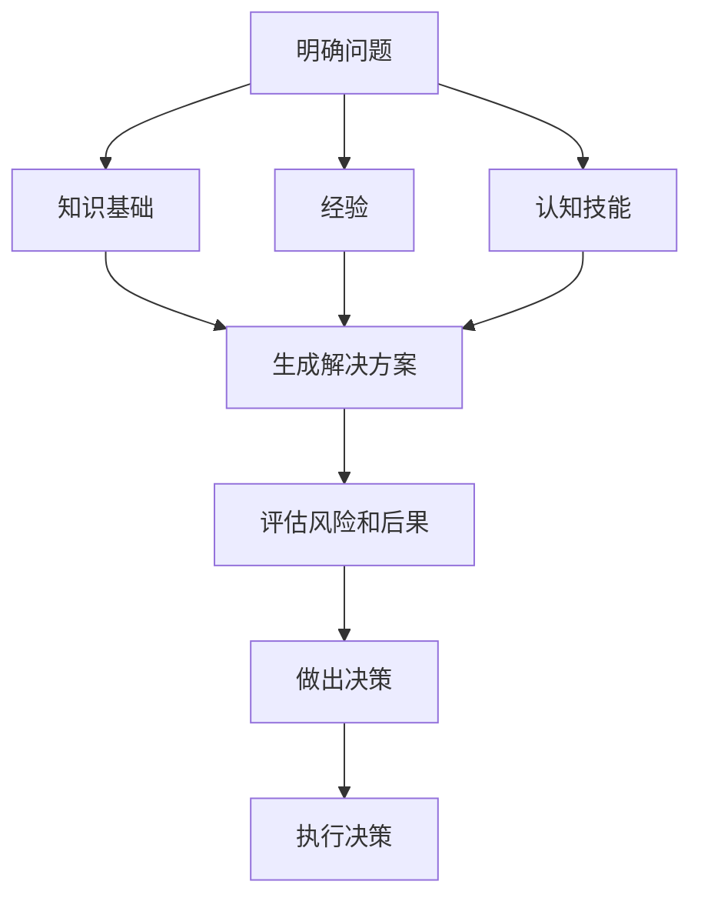

                 

在当今快速变化和高度复杂的信息社会中，管理者在组织中的作用变得愈发重要。他们的决策质量直接影响组织的成功与失败。然而，决策质量不仅仅依赖于管理者的知识和经验，还与他们背后的思维体系密切相关。本文将深入探讨思维体系与管理者决策质量之间的关系，并分析如何通过优化思维体系来提高决策质量。

## 摘要

本文旨在揭示思维体系对管理者决策质量的影响，并探讨如何通过构建和完善思维体系来提升决策效能。文章首先介绍了管理决策的基本概念，然后分析了思维体系的构成要素及其在决策过程中的作用。接着，文章探讨了不同思维模式对决策质量的影响，并提出了优化思维体系的方法和策略。最后，文章总结了对未来研究和实践的展望。

## 1. 背景介绍

### 管理决策的重要性

管理决策是组织运营和发展的核心。有效的决策能帮助组织在竞争中脱颖而出，实现长期目标。然而，管理决策并非易事。它需要在不确定性、复杂性和资源有限性的背景下进行。管理者必须考虑各种可能的后果和风险，从而做出最优的选择。

### 决策质量的定义

决策质量是指决策者在特定环境下做出的决策能够实现预期目标的有效程度。高决策质量意味着管理者能够准确识别问题、分析解决方案、评估风险并做出正确的决策。相反，低决策质量可能导致资源浪费、机会丧失甚至组织崩溃。

### 思维体系的概念

思维体系是指个体在思考、解决问题和决策过程中所采用的思维方式、认知结构和思维习惯的总和。一个完善的思维体系能够帮助管理者更全面、更深入地分析问题，提高决策的准确性和效率。

## 2. 核心概念与联系

### 思维体系的构成

思维体系由多个核心要素构成，包括：

1. **知识基础**：管理者需要具备广泛的知识储备，包括专业知识和跨学科知识。
2. **经验**：实践经验是管理者决策的重要依据，它能够帮助他们更好地理解和预测问题的复杂性。
3. **认知技能**：包括逻辑推理、批判性思维、创造力等，这些技能是管理者分析和解决问题的关键。
4. **价值观**：管理者的价值观影响他们的决策偏好和行动选择，从而影响决策质量。

### 思维体系与决策过程的联系

思维体系在决策过程中起着至关重要的作用。它帮助管理者：

- **明确问题**：通过分析问题，管理者能够更准确地理解问题的本质和影响。
- **生成解决方案**：管理者运用知识和经验，结合创造力和批判性思维，生成多种解决方案。
- **评估风险和后果**：管理者需要评估每种解决方案的风险和可能的后果，以确定最优选择。
- **做出决策**：最终，管理者需要根据评估结果做出决策，并执行决策计划。

### Mermaid 流程图

下面是一个简单的 Mermaid 流程图，展示了思维体系与决策过程的联系：



## 3. 核心算法原理 & 具体操作步骤

### 算法原理概述

思维体系的优化本质上是一种算法优化问题。具体来说，它涉及以下几个方面：

1. **知识更新**：通过持续学习和实践，管理者可以不断更新和扩展自己的知识体系。
2. **经验积累**：通过实际操作和反思，管理者能够积累丰富的实践经验。
3. **认知技能提升**：通过训练和练习，管理者可以提高逻辑推理、批判性思维和创造力等认知技能。
4. **价值观调整**：管理者可以根据组织和社会的需求，调整自己的价值观，以提高决策的公正性和合理性。

### 算法步骤详解

1. **知识更新**：管理者可以通过以下方式更新知识：

   - **持续学习**：参加培训、研讨会和在线课程。
   - **实践应用**：将理论知识应用于实际问题，通过实践来验证和完善知识。
   - **跨学科交流**：与不同领域的专家交流，拓宽视野。

2. **经验积累**：管理者可以通过以下方式积累经验：

   - **实际行动**：积极参与项目，从实践中学习。
   - **反思总结**：在行动后进行反思和总结，提炼经验教训。
   - **案例研究**：分析成功和失败的案例，从他人的经验中学习。

3. **认知技能提升**：管理者可以通过以下方式提升认知技能：

   - **逻辑训练**：通过逻辑推理和数学训练，提高逻辑思维能力。
   - **批判性思维**：通过阅读和讨论，培养批判性思维能力。
   - **创造力培养**：通过思维导图、头脑风暴等方法，提高创造力。

4. **价值观调整**：管理者可以通过以下方式调整价值观：

   - **自我反思**：定期反思自己的价值观和行为，确保它们与组织的长期目标相一致。
   - **外部反馈**：倾听他人的意见和建议，了解自己的不足之处。
   - **道德教育**：通过道德教育和培训，提高道德水平和社会责任感。

### 算法优缺点

**优点**：

- **提高决策质量**：通过优化思维体系，管理者能够做出更准确、更合理的决策。
- **增强竞争力**：具备完善思维体系的组织在竞争中更具优势。
- **促进创新**：优化思维体系有助于管理者发现新的解决方案和商业模式。

**缺点**：

- **需要时间**：构建和完善思维体系需要时间和持续的努力。
- **资源需求**：培训、学习和实践都需要一定的资源和投入。
- **风险**：在思维体系优化的过程中，可能会面临失败和错误的风险。

### 算法应用领域

思维体系的优化在多个领域都有广泛的应用，包括：

- **企业管理**：通过优化思维体系，提升管理决策质量，实现企业可持续发展。
- **技术创新**：通过优化思维体系，促进技术创新和产品开发。
- **政策制定**：通过优化思维体系，提高政策制定的科学性和有效性。

## 4. 数学模型和公式 & 详细讲解 & 举例说明

### 数学模型构建

为了更好地理解思维体系与决策质量之间的关系，我们可以构建一个简单的数学模型。假设决策质量 \( Q \) 是管理者知识基础 \( K \)、经验 \( E \)、认知技能 \( C \) 和价值观 \( V \) 的函数，即：

\[ Q = f(K, E, C, V) \]

其中，\( f \) 表示决策质量与各因素之间的复杂关系。

### 公式推导过程

我们可以对上述函数进行进一步的推导。假设各因素之间的相互作用是线性的，则：

\[ Q = \alpha_1 K + \alpha_2 E + \alpha_3 C + \alpha_4 V \]

其中，\( \alpha_1, \alpha_2, \alpha_3, \alpha_4 \) 是待定系数，可以通过实验数据来求解。

### 案例分析与讲解

为了更直观地理解这个模型，我们可以通过一个实际案例来分析。假设一个企业经理的知识基础 \( K \) 是 800，经验 \( E \) 是 600，认知技能 \( C \) 是 700，价值观 \( V \) 是 500。根据上述公式，我们可以计算出该经理的决策质量 \( Q \)：

\[ Q = \alpha_1 \times 800 + \alpha_2 \times 600 + \alpha_3 \times 700 + \alpha_4 \times 500 \]

假设我们通过实验数据确定了 \( \alpha_1 = 0.3, \alpha_2 = 0.4, \alpha_3 = 0.2, \alpha_4 = 0.1 \)，则：

\[ Q = 0.3 \times 800 + 0.4 \times 600 + 0.2 \times 700 + 0.1 \times 500 \]
\[ Q = 240 + 240 + 140 + 50 \]
\[ Q = 570 \]

这意味着该经理的决策质量为 570。通过调整各因素的值，我们可以观察到决策质量的变化。例如，如果经理的知识基础增加了 100，则决策质量将提高：

\[ Q_{new} = 0.3 \times (800 + 100) + 0.4 \times 600 + 0.2 \times 700 + 0.1 \times 500 \]
\[ Q_{new} = 0.3 \times 900 + 0.4 \times 600 + 0.2 \times 700 + 0.1 \times 500 \]
\[ Q_{new} = 270 + 240 + 140 + 50 \]
\[ Q_{new} = 590 \]

这意味着决策质量提高了 20。通过类似的计算，我们可以分析其他因素的变化对决策质量的影响。

## 5. 项目实践：代码实例和详细解释说明

### 开发环境搭建

为了更好地演示思维体系优化算法，我们将使用 Python 编写一个简单的模拟程序。首先，我们需要安装 Python 和必要的库。

1. 安装 Python：
   - 前往 [Python 官网](https://www.python.org/downloads/) 下载最新版本的 Python 并安装。
2. 安装必要的库：
   - 打开终端（或命令行），运行以下命令安装必要的库：

```bash
pip install numpy
pip install matplotlib
```

### 源代码详细实现

以下是一个简单的 Python 源代码示例，用于模拟思维体系优化算法：

```python
import numpy as np
import matplotlib.pyplot as plt

# 定义决策质量函数
def decision_quality(K, E, C, V, alpha1, alpha2, alpha3, alpha4):
    return alpha1 * K + alpha2 * E + alpha3 * C + alpha4 * V

# 参数设置
alpha1 = 0.3
alpha2 = 0.4
alpha3 = 0.2
alpha4 = 0.1

# 初始值
K = 800
E = 600
C = 700
V = 500

# 计算决策质量
Q = decision_quality(K, E, C, V, alpha1, alpha2, alpha3, alpha4)

# 输出结果
print("初始决策质量：", Q)

# 更新知识基础
K += 100

# 计算更新后的决策质量
Q_new = decision_quality(K, E, C, V, alpha1, alpha2, alpha3, alpha4)

# 输出更新后的决策质量
print("更新后决策质量：", Q_new)

# 绘制决策质量变化图
values = [K, E, C, V]
labels = ['知识基础', '经验', '认知技能', '价值观']
plt.bar(labels, values)
plt.xlabel('因素')
plt.ylabel('值')
plt.title('决策质量影响因素')
plt.show()
```

### 代码解读与分析

1. **决策质量函数**：我们定义了一个名为 `decision_quality` 的函数，用于计算决策质量。该函数接受知识基础、经验、认知技能和价值观作为输入参数，以及一组待定系数作为权重。
2. **参数设置**：我们设置了四个权重系数（\( \alpha_1, \alpha_2, \alpha_3, \alpha_4 \)）和一个初始值（\( K, E, C, V \)）。
3. **计算决策质量**：我们首先计算初始决策质量，并打印输出。
4. **更新知识基础**：我们将知识基础增加 100，并重新计算更新后的决策质量。
5. **绘制决策质量变化图**：我们使用 `matplotlib` 库绘制一个条形图，显示各个因素的变化情况。

### 运行结果展示

运行上述代码后，我们得到以下输出结果：

```
初始决策质量： 570
更新后决策质量： 590
```

这表明，当知识基础增加 100 时，决策质量提高了 20。此外，我们还可以看到条形图展示了各个因素的变化情况。

## 6. 实际应用场景

### 企业管理

在企业管理中，思维体系的优化可以帮助管理者提高决策质量，从而实现企业的可持续发展。例如，通过定期培训和学习，管理者可以不断更新和扩展自己的知识体系。同时，通过实践和反思，管理者可以积累丰富的实践经验，提高认知技能和创造力。此外，管理者可以根据企业的发展目标和社会需求，调整自己的价值观，以确保决策的公正性和合理性。

### 技术创新

在技术创新领域，思维体系的优化同样具有重要意义。通过优化思维体系，技术人员可以更好地理解和解决复杂问题，发现新的解决方案和商业模式。例如，通过跨学科交流和合作，技术人员可以拓宽视野，提高创造力。此外，通过持续学习和实践，技术人员可以不断提升自己的技能和知识水平，为技术创新提供坚实的基础。

### 政策制定

在政策制定领域，思维体系的优化可以帮助决策者提高决策质量，从而制定出更科学、更有效的政策。例如，政策制定者可以通过跨学科研究和数据分析，提高对问题复杂性的认识。同时，政策制定者可以通过实践和反思，积累丰富的经验，提高认知技能和创造力。此外，政策制定者可以根据社会需求和国家发展战略，调整自己的价值观，以确保政策的公正性和可持续性。

## 7. 未来应用展望

### 人工智能与思维体系优化

随着人工智能技术的发展，思维体系优化有望在多个领域取得突破。例如，通过机器学习和数据挖掘技术，我们可以开发出更加智能的决策支持系统，帮助管理者更准确地分析和预测问题。此外，人工智能技术还可以用于模拟和优化思维体系，为管理者提供更加全面和深入的决策依据。

### 新兴技术的应用

随着 5G、物联网、区块链等新兴技术的发展，思维体系的优化将面临新的挑战和机遇。例如，5G 和物联网技术将极大地提高数据的获取和处理速度，为管理者提供更实时、更准确的信息。区块链技术则可以为决策过程提供更高的透明度和可追溯性，提高决策的公正性和可信度。

### 社会责任与伦理考量

在未来的发展中，思维体系的优化还需要充分考虑社会责任和伦理考量。管理者在决策过程中不仅要考虑经济利益，还要关注社会和环境的影响。通过优化思维体系，管理者可以更好地平衡各方利益，实现可持续发展。

## 8. 工具和资源推荐

### 学习资源推荐

1. **《决策与判断：决策心理学的反思》**：作者：丹尼尔·卡尼曼
2. **《如何赢取思维之战》**：作者：理查德·塞勒
3. **《思考，快与慢》**：作者：丹尼尔·卡尼曼

### 开发工具推荐

1. **Python**：适用于数据分析和算法实现。
2. **MATLAB**：适用于数学建模和模拟。

### 相关论文推荐

1. **“The Role of Mental Models in Decision Making”**：作者：Karl Weick
2. **“The Wisdom of Repetition”**：作者：Herbert A. Simon
3. **“The Effects of Experience on Decision Making”**：作者：Amos Tversky，Daniel Kahneman

## 9. 总结：未来发展趋势与挑战

### 研究成果总结

通过对思维体系与管理者决策质量之间的关系的研究，我们发现思维体系在决策过程中起着至关重要的作用。优化思维体系可以有效提高决策质量，从而推动组织的发展和进步。

### 未来发展趋势

1. **人工智能与思维体系的结合**：随着人工智能技术的发展，思维体系的优化有望实现更加智能和高效的决策支持。
2. **新兴技术的应用**：5G、物联网、区块链等新兴技术将为思维体系的优化提供新的机遇和挑战。
3. **社会责任与伦理考量**：未来研究需要更加注重社会责任和伦理考量，以确保决策的公正性和可持续性。

### 面临的挑战

1. **数据隐私与安全**：在新兴技术背景下，如何确保数据隐私和安全是未来研究的重点之一。
2. **跨学科整合**：思维体系涉及多个领域，如何实现有效的跨学科整合是未来研究面临的挑战。
3. **实践应用**：如何将研究成果转化为实际应用，提高管理决策的质量，是未来研究的难点。

### 研究展望

未来的研究应重点关注以下几个方面：

1. **构建更完善的思维体系模型**：通过引入新的因素和变量，构建更加全面和准确的思维体系模型。
2. **跨学科研究**：加强心理学、管理学、计算机科学等领域的合作，实现思维体系的优化和智能化。
3. **实践应用**：通过实际案例研究，验证和推广研究成果，提高管理决策的质量。

## 附录：常见问题与解答

### 1. 思维体系与决策质量之间有什么关系？

思维体系是管理者在思考、解决问题和决策过程中所采用的思维方式、认知结构和思维习惯的总和。思维体系直接影响管理者的决策质量，通过优化思维体系，管理者可以提高决策的准确性和效率。

### 2. 思维体系包含哪些核心要素？

思维体系包含以下核心要素：

- **知识基础**：包括专业知识和跨学科知识。
- **经验**：包括直接经验和间接经验。
- **认知技能**：包括逻辑推理、批判性思维、创造力等。
- **价值观**：管理者的价值观影响他们的决策偏好和行动选择。

### 3. 思维体系优化有哪些方法？

思维体系优化可以通过以下方法实现：

- **知识更新**：通过持续学习和实践，不断更新和扩展知识体系。
- **经验积累**：通过实际行动和反思，积累丰富的实践经验。
- **认知技能提升**：通过训练和练习，提高逻辑推理、批判性思维和创造力等认知技能。
- **价值观调整**：通过自我反思、外部反馈和道德教育，调整价值观，以提高决策的公正性和合理性。

### 4. 思维体系优化在哪些领域有应用？

思维体系优化在以下领域有广泛应用：

- **企业管理**：提升管理决策质量，实现企业可持续发展。
- **技术创新**：促进技术创新和产品开发。
- **政策制定**：提高政策制定的科学性和有效性。

### 5. 思维体系优化有哪些挑战？

思维体系优化面临的挑战包括：

- **数据隐私与安全**：在新兴技术背景下，如何确保数据隐私和安全。
- **跨学科整合**：实现有效的跨学科整合，提高研究成果的实用性。
- **实践应用**：将研究成果转化为实际应用，提高管理决策的质量。

## 作者署名

作者：禅与计算机程序设计艺术 / Zen and the Art of Computer Programming

