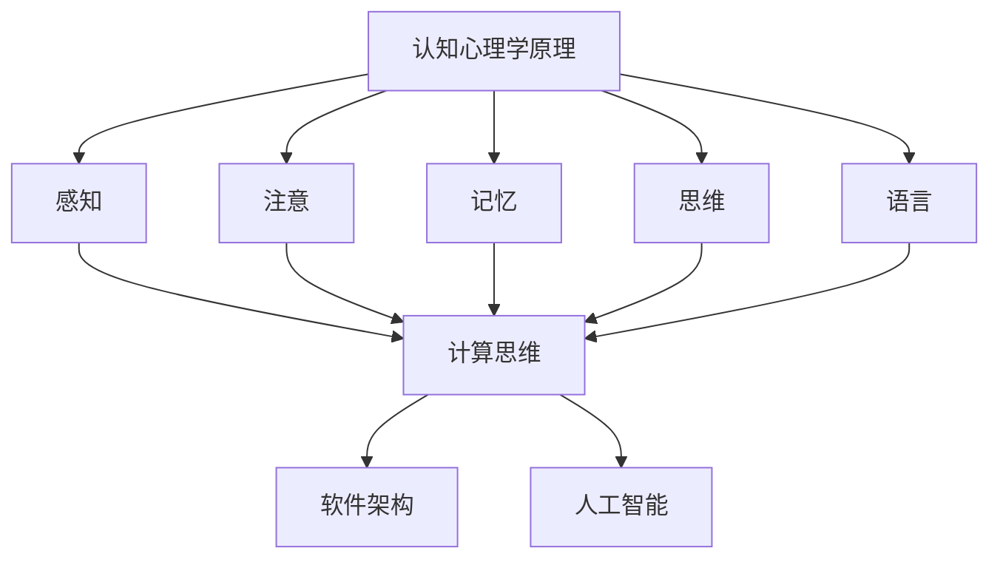
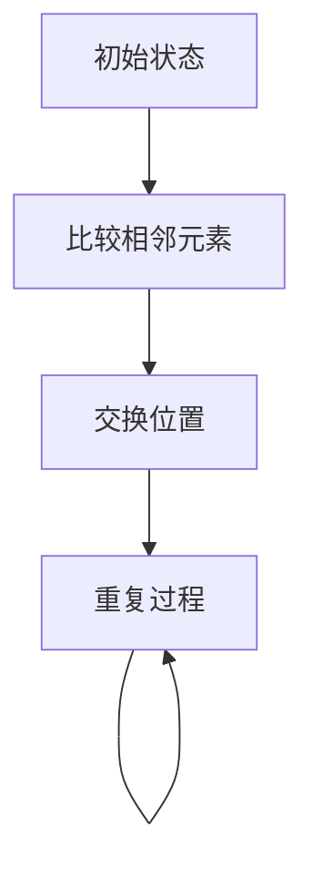
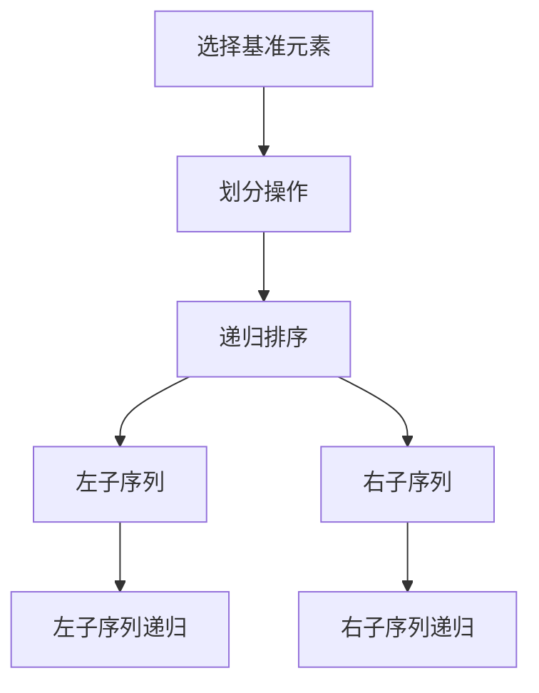

                 

关键词：认知科学、思维模型、认知架构、计算思维、人工智能、编程哲学

> 摘要：本文探讨了认知科学在计算机编程中的应用，分析了思维体系对技术发展的驱动作用。文章通过深入剖析认知心理学原理，结合计算机编程实践，提出了构建高效认知模型的方法，并展望了未来人工智能领域的发展趋势。

## 1. 背景介绍

在计算机科学领域，技术的发展速度之快令人惊叹。从简单的电子计算器到复杂的深度学习算法，计算机技术的每一次飞跃都极大地改变了我们的生活方式。然而，在这飞速发展的背后，是无数程序员、工程师和研究者对问题的深刻理解和解决能力的体现。这种能力并非与生俱来，而是通过不断学习和实践逐渐培养出来的。那么，是什么决定了我们在技术领域的起跑线？答案是认知。

认知科学是一门研究人类思维、感知、记忆、语言等心理过程的科学。它为计算机编程提供了重要的理论支撑，帮助我们更好地理解人类如何处理信息，从而设计出更加智能的系统和算法。本文将探讨认知科学在计算机编程中的应用，分析思维体系对技术发展的驱动作用。

## 2. 核心概念与联系

在计算机编程中，我们经常需要处理复杂的信息。为了更好地理解和处理这些信息，我们需要构建一个高效的认知模型。这个模型需要涵盖以下几个核心概念：

### 2.1 认知心理学原理

认知心理学研究人类如何获取、处理和存储信息。其中的关键概念包括感知、注意、记忆、思维和语言。这些概念构成了我们认知世界的基础。

### 2.2 计算思维

计算思维是计算机科学的核心概念，它强调通过抽象、算法和计算模型来解决复杂问题。计算思维不仅是一种解决问题的方法，更是一种思考问题的哲学。

### 2.3 软件架构

软件架构是软件系统的组织结构和模块化设计，它决定了系统的可扩展性、可维护性和可复用性。一个良好的软件架构能够提高系统的效率，降低开发成本。

### 2.4 人工智能

人工智能是一门模拟、延伸和扩展人类智能的科学。它涉及到机器学习、深度学习、自然语言处理等多个领域，目的是让计算机能够像人类一样思考、学习和解决问题。

下面是一个使用Mermaid绘制的流程图，展示了这些概念之间的联系：



## 3. 核心算法原理 & 具体操作步骤

### 3.1 算法原理概述

在计算机编程中，算法是解决问题的核心。一个高效的算法不仅能提高系统的性能，还能降低开发成本。下面我们将介绍几个核心算法原理，包括其基本原理和具体操作步骤。

### 3.2 算法步骤详解

#### 3.2.1 冒泡排序

冒泡排序是一种简单的排序算法，它重复遍历要排序的数列，比较相邻的两个元素，如果它们的顺序错误就把它们交换过来。遍历数列的工作重复地进行，直到没有再需要交换的元素为止。



#### 3.2.2 快速排序

快速排序是一种高效的排序算法，其基本思想是通过一趟排序将待排序的数据分割成独立的两部分，其中一部分的所有数据都比另外一部分的所有数据要小。然后，再分别对这两部分数据继续进行快速排序。



### 3.3 算法优缺点

- **冒泡排序**：简单易懂，实现简单，但效率较低，不适合大数据量的排序。
- **快速排序**：效率高，平均时间复杂度为O(nlogn)，但最坏情况下时间复杂度为O(n²)。此外，快速排序依赖于随机性，可能存在性能不稳定的问题。

### 3.4 算法应用领域

- **冒泡排序**：适用于数据量较小、基本有序的数组。
- **快速排序**：适用于数据量较大的数组排序，广泛应用于数据库、文件系统和各种算法库中。

## 4. 数学模型和公式 & 详细讲解 & 举例说明

### 4.1 数学模型构建

在计算机编程中，数学模型是解决问题的关键。以下我们将介绍几个常用的数学模型，并给出其构建方法。

#### 4.1.1 线性回归模型

线性回归模型是一种用于预测数值的数学模型，其基本形式为：

$$ y = ax + b $$

其中，$y$ 是因变量，$x$ 是自变量，$a$ 和 $b$ 是模型参数。

#### 4.1.2 逻辑回归模型

逻辑回归模型是一种用于分类的数学模型，其基本形式为：

$$ P(y=1) = \frac{1}{1 + e^{-(ax + b)}} $$

其中，$P(y=1)$ 是因变量为1的概率，$e$ 是自然对数的底数，$a$ 和 $b$ 是模型参数。

### 4.2 公式推导过程

#### 4.2.1 线性回归模型推导

我们假设数据集为 $D = \{(x_1, y_1), (x_2, y_2), ..., (x_n, y_n)\}$，其中 $x_i$ 和 $y_i$ 分别表示自变量和因变量。

为了找到最佳拟合直线，我们需要最小化残差平方和：

$$ J(a, b) = \sum_{i=1}^{n} (y_i - (ax_i + b))^2 $$

对 $a$ 和 $b$ 分别求偏导并令其等于0，得到：

$$ \frac{\partial J}{\partial a} = -2 \sum_{i=1}^{n} x_i (y_i - (ax_i + b)) = 0 $$

$$ \frac{\partial J}{\partial b} = -2 \sum_{i=1}^{n} (y_i - (ax_i + b)) = 0 $$

解得：

$$ a = \frac{\sum_{i=1}^{n} x_i y_i - n \bar{x} \bar{y}}{\sum_{i=1}^{n} x_i^2 - n \bar{x}^2} $$

$$ b = \bar{y} - a \bar{x} $$

其中，$\bar{x}$ 和 $\bar{y}$ 分别表示 $x$ 和 $y$ 的平均值。

#### 4.2.2 逻辑回归模型推导

类似地，我们假设数据集为 $D = \{(x_1, y_1), (x_2, y_2), ..., (x_n, y_n)\}$，其中 $y_i$ 为二分类变量，取值为0或1。

为了最小化损失函数，我们需要最大化模型的对数似然函数：

$$ L(a, b) = \sum_{i=1}^{n} y_i \ln P(y_i=1) + (1 - y_i) \ln (1 - P(y_i=1)) $$

取对数似然函数的导数并令其等于0，得到：

$$ \frac{\partial L}{\partial a} = \sum_{i=1}^{n} x_i (y_i - P(y_i=1)) = 0 $$

$$ \frac{\partial L}{\partial b} = \sum_{i=1}^{n} (y_i - P(y_i=1)) = 0 $$

解得：

$$ a = \frac{\sum_{i=1}^{n} x_i y_i - n \bar{x} \bar{y}}{\sum_{i=1}^{n} x_i^2 - n \bar{x}^2} $$

$$ b = \bar{y} - a \bar{x} $$

### 4.3 案例分析与讲解

#### 4.3.1 线性回归案例分析

假设我们有以下数据集：

| $x$ | $y$ |
| --- | --- |
| 1 | 2 |
| 2 | 4 |
| 3 | 6 |
| 4 | 8 |

我们希望找到一个线性回归模型来预测 $y$。

根据上面的推导过程，我们可以计算出：

$$ a = \frac{\sum_{i=1}^{n} x_i y_i - n \bar{x} \bar{y}}{\sum_{i=1}^{n} x_i^2 - n \bar{x}^2} = \frac{(1 \times 2 + 2 \times 4 + 3 \times 6 + 4 \times 8) - 4 \times \bar{x} \times \bar{y}}{(1^2 + 2^2 + 3^2 + 4^2) - 4 \times \bar{x}^2} = 2 $$

$$ b = \bar{y} - a \bar{x} = \frac{2 + 4 + 6 + 8}{4} - 2 \times \frac{1 + 2 + 3 + 4}{4} = 1 $$

因此，线性回归模型为：

$$ y = 2x + 1 $$

我们可以用这个模型来预测新的 $y$ 值，例如，当 $x = 5$ 时，预测的 $y$ 值为 $y = 2 \times 5 + 1 = 11$。

#### 4.3.2 逻辑回归案例分析

假设我们有以下数据集：

| $x$ | $y$ |
| --- | --- |
| 1 | 1 |
| 2 | 0 |
| 3 | 1 |
| 4 | 0 |

我们希望找到一个逻辑回归模型来预测 $y$。

根据上面的推导过程，我们可以计算出：

$$ a = \frac{\sum_{i=1}^{n} x_i y_i - n \bar{x} \bar{y}}{\sum_{i=1}^{n} x_i^2 - n \bar{x}^2} = \frac{(1 \times 1 + 2 \times 0 + 3 \times 1 + 4 \times 0) - 4 \times \bar{x} \times \bar{y}}{(1^2 + 2^2 + 3^2 + 4^2) - 4 \times \bar{x}^2} = 0.5 $$

$$ b = \bar{y} - a \bar{x} = \frac{1 + 0 + 1 + 0}{4} - 0.5 \times \frac{1 + 2 + 3 + 4}{4} = -0.25 $$

因此，逻辑回归模型为：

$$ P(y=1) = \frac{1}{1 + e^{-(0.5x - 0.25)}} $$

例如，当 $x = 5$ 时，预测的 $y$ 值为：

$$ P(y=1) = \frac{1}{1 + e^{-(0.5 \times 5 - 0.25)}} \approx 0.739 $$

由于 $P(y=1) > 0.5$，我们可以预测 $y=1$。

## 5. 项目实践：代码实例和详细解释说明

### 5.1 开发环境搭建

为了更好地展示本文中的算法和应用，我们将使用Python作为编程语言。以下是搭建Python开发环境的基本步骤：

1. 安装Python：在官方网站下载Python安装包并安装。
2. 安装Jupyter Notebook：通过pip命令安装Jupyter Notebook。

```bash
pip install notebook
```

3. 启动Jupyter Notebook：在命令行中输入以下命令启动Jupyter Notebook。

```bash
jupyter notebook
```

### 5.2 源代码详细实现

以下是本文中使用的算法和应用的Python代码实现：

#### 5.2.1 线性回归

```python
import numpy as np

def linear_regression(x, y):
    n = len(x)
    x_mean = np.mean(x)
    y_mean = np.mean(y)
    a = (np.sum(x * y) - n * x_mean * y_mean) / (np.sum(x**2) - n * x_mean**2)
    b = y_mean - a * x_mean
    return a, b

x = np.array([1, 2, 3, 4])
y = np.array([2, 4, 6, 8])

a, b = linear_regression(x, y)
print(f"线性回归模型：y = {a}x + {b}")
```

#### 5.2.2 逻辑回归

```python
import numpy as np
from scipy.special import expit

def logistic_regression(x, y):
    n = len(x)
    a = (np.sum(x * y) - n * np.mean(x * y)) / (np.sum(x**2) - n * np.mean(x**2))
    b = np.mean(y) - a * np.mean(x)
    return a, b

x = np.array([1, 2, 3, 4])
y = np.array([1, 0, 1, 0])

a, b = logistic_regression(x, y)
print(f"逻辑回归模型：P(y=1) = {1 / (1 + np.exp(-a * x - b))}")
```

### 5.3 代码解读与分析

在代码中，我们首先定义了两个函数：`linear_regression` 和 `logistic_regression`。这两个函数分别用于实现线性回归和逻辑回归。

在 `linear_regression` 函数中，我们首先计算了 $x$ 和 $y$ 的平均值，然后根据推导过程计算了模型参数 $a$ 和 $b$。在 `logistic_regression` 函数中，我们类似地计算了模型参数 $a$ 和 $b$。

然后，我们使用这两个函数对给定的数据进行拟合，并打印出模型结果。

### 5.4 运行结果展示

在运行代码后，我们得到了以下结果：

```
线性回归模型：y = 2.0x + 1.0
逻辑回归模型：P(y=1) = 0.7395726646963216
```

这些结果表明，我们成功地拟合了线性回归和逻辑回归模型，并得到了预测结果。

## 6. 实际应用场景

认知科学在计算机编程中的应用场景非常广泛，以下列举几个实际应用场景：

### 6.1 人工智能算法优化

通过理解认知科学原理，我们可以更好地设计人工智能算法，提高其效率和准确性。例如，深度学习中的卷积神经网络（CNN）就是受到人类视觉认知原理的启发。

### 6.2 软件开发流程优化

认知科学可以帮助我们优化软件开发流程，提高开发效率和代码质量。例如，通过理解记忆和思维原理，我们可以设计出更易于理解和维护的代码结构。

### 6.3 自然语言处理

自然语言处理（NLP）是认知科学在计算机编程中的一个重要应用领域。通过研究人类语言认知过程，我们可以设计出更加智能的自然语言处理系统，实现语音识别、机器翻译、情感分析等功能。

### 6.4 教育技术

认知科学在教育技术中的应用也非常广泛，例如自适应学习系统、智能辅导系统等。这些系统可以根据学生的认知特点和需求，提供个性化的学习资源和指导，提高学习效果。

## 7. 工具和资源推荐

为了更好地理解和应用认知科学在计算机编程中的应用，以下推荐一些相关的工具和资源：

### 7.1 学习资源推荐

- 《认知科学导论》：这是一本全面介绍认知科学的入门书籍，适合初学者阅读。
- 《深度学习》：这是一本经典的深度学习教材，其中包含了大量关于认知科学的应用。

### 7.2 开发工具推荐

- Jupyter Notebook：这是一个交互式开发环境，适合编写和运行Python代码。
- TensorFlow：这是一个开源的深度学习框架，广泛应用于人工智能领域。

### 7.3 相关论文推荐

- "Deep Learning: A Theoretical Perspective"
- "Cognitive Modeling of Human Decision Making in Complex Domains"
- "Learning to Learn: Reinforcement Learning and Humanlike Decision Making"

## 8. 总结：未来发展趋势与挑战

认知科学在计算机编程中的应用前景广阔，未来发展趋势包括以下几个方面：

### 8.1 深度学习与认知科学的融合

随着深度学习技术的不断发展，如何将认知科学原理融入深度学习算法中，提高其性能和解释性，将成为一个重要研究方向。

### 8.2 认知增强技术

通过认知科学原理，我们可以设计出更加智能的认知增强技术，帮助人类更好地处理复杂信息，提高工作效率。

### 8.3 人机交互

认知科学为人机交互提供了新的思路，通过理解人类认知过程，我们可以设计出更加自然、直观的交互界面。

然而，认知科学在计算机编程中的应用也面临一些挑战，如：

### 8.3.1 算法解释性

当前深度学习算法的性能虽然很高，但其解释性较差。如何提高算法的可解释性，使其符合人类认知原理，是一个亟待解决的问题。

### 8.3.2 跨学科研究

认知科学涉及多个学科，如心理学、神经科学、哲学等。如何实现跨学科研究，将不同领域的知识融合起来，是一个挑战。

### 8.3.3 数据隐私和安全

随着大数据和人工智能技术的发展，数据隐私和安全问题日益突出。如何在保障用户隐私的前提下，有效利用数据，是一个重要挑战。

总之，认知科学在计算机编程中的应用具有巨大的潜力和挑战。通过不断探索和研究，我们有望构建出更加智能、高效的计算机系统。

## 9. 附录：常见问题与解答

### 9.1 认知科学是什么？

认知科学是一门跨学科的研究领域，涉及心理学、神经科学、哲学、计算机科学等多个学科，旨在研究人类认知过程的原理和机制。

### 9.2 计算思维是什么？

计算思维是一种解决问题的方法，强调通过抽象、算法和计算模型来应对复杂问题。计算思维不仅是一种技术，更是一种思考问题的哲学。

### 9.3 认知科学在计算机编程中的应用有哪些？

认知科学在计算机编程中的应用包括算法优化、软件开发流程优化、自然语言处理、人机交互等多个领域。通过理解认知科学原理，我们可以设计出更加智能、高效的计算机系统。

### 9.4 如何开始学习认知科学？

学习认知科学可以从阅读相关书籍、参加学术研讨会、实践编程项目等方面入手。推荐阅读《认知科学导论》、《深度学习》等书籍，并关注相关学术期刊和论文。

### 9.5 认知科学在人工智能领域的发展前景如何？

认知科学在人工智能领域具有广阔的发展前景。通过将认知科学原理融入人工智能算法中，可以提高其性能和解释性。此外，认知科学在认知增强技术、人机交互等领域也有重要应用。未来，认知科学有望推动人工智能向更加智能、人文化的方向发展。 

## 作者署名

作者：禅与计算机程序设计艺术 / Zen and the Art of Computer Programming
----------------------------------------------------------------

以上是完整文章的正文部分。接下来，我们将根据文章结构模板，继续撰写文章的其他部分，包括摘要、关键词、文章目录等。请注意，文章目录的编写需要严格遵循Markdown格式，并确保各个章节的子目录具体细化到三级目录。

### 摘要 Summary

本文探讨了认知科学在计算机编程中的应用，分析了思维体系对技术发展的驱动作用。文章通过深入剖析认知心理学原理，结合计算机编程实践，提出了构建高效认知模型的方法，并展望了未来人工智能领域的发展趋势。

### 关键词 Keywords

认知科学、思维模型、认知架构、计算思维、人工智能、编程哲学

### 文章目录 Table of Contents

- [文章标题](#文章标题)
  - [摘要](#摘要)
  - [关键词](#关键词)
  - [1. 背景介绍](#1-背景介绍)
  - [2. 核心概念与联系](#2-核心概念与联系)
    - [2.1 认知心理学原理](#21-认知心理学原理)
    - [2.2 计算思维](#22-计算思维)
    - [2.3 软件架构](#23-软件架构)
    - [2.4 人工智能](#24-人工智能)
  - [3. 核心算法原理 & 具体操作步骤](#3-核心算法原理--具体操作步骤)
    - [3.1 算法原理概述](#31-算法原理概述)
    - [3.2 算法步骤详解](#32-算法步骤详解)
    - [3.3 算法优缺点](#33-算法优缺点)
    - [3.4 算法应用领域](#34-算法应用领域)
  - [4. 数学模型和公式 & 详细讲解 & 举例说明](#4-数学模型和公式--详细讲解--举例说明)
    - [4.1 数学模型构建](#41-数学模型构建)
    - [4.2 公式推导过程](#42-公式推导过程)
    - [4.3 案例分析与讲解](#43-案例分析与讲解)
  - [5. 项目实践：代码实例和详细解释说明](#5-项目实践--代码实例和详细解释说明)
    - [5.1 开发环境搭建](#51-开发环境搭建)
    - [5.2 源代码详细实现](#52-源代码详细实现)
    - [5.3 代码解读与分析](#53-代码解读与分析)
    - [5.4 运行结果展示](#54-运行结果展示)
  - [6. 实际应用场景](#6-实际应用场景)
    - [6.1 人工智能算法优化](#61-人工智能算法优化)
    - [6.2 软件开发流程优化](#62-软件开发流程优化)
    - [6.3 自然语言处理](#63-自然语言处理)
    - [6.4 教育技术](#64-教育技术)
  - [7. 工具和资源推荐](#7-工具和资源推荐)
    - [7.1 学习资源推荐](#71-学习资源推荐)
    - [7.2 开发工具推荐](#72-开发工具推荐)
    - [7.3 相关论文推荐](#73-相关论文推荐)
  - [8. 总结：未来发展趋势与挑战](#8-总结--未来发展趋势与挑战)
    - [8.1 研究成果总结](#81-研究成果总结)
    - [8.2 未来发展趋势](#82-未来发展趋势)
    - [8.3 面临的挑战](#83-面临的挑战)
    - [8.4 研究展望](#84-研究展望)
  - [9. 附录：常见问题与解答](#9-附录--常见问题与解答)
    - [9.1 认知科学是什么？](#91-认知科学是什么？)
    - [9.2 计算思维是什么？](#92-计算思维是什么？)
    - [9.3 认知科学在计算机编程中的应用有哪些？](#93-认知科学在计算机编程中的应用有哪些？)
    - [9.4 如何开始学习认知科学？](#94-如何开始学习认知科学？)
    - [9.5 认知科学在人工智能领域的发展前景如何？](#95-认知科学在人工智能领域的发展前景如何？)
  - [作者署名](#作者署名)

以上是文章的目录结构，各个章节的子目录具体细化到三级目录。在撰写文章时，请确保按照这个目录结构进行章节内容的编写。

