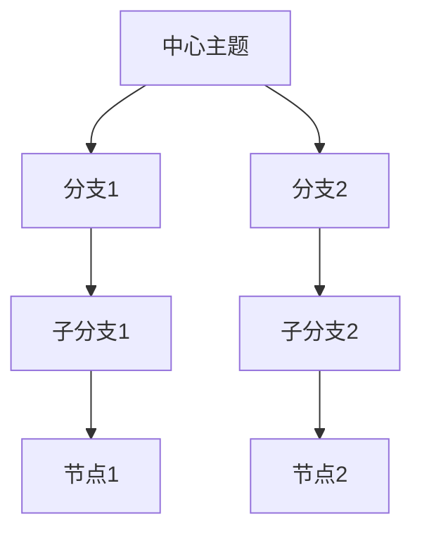
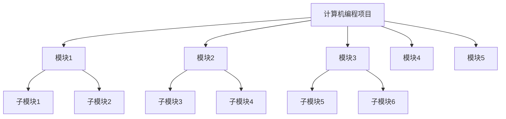

                 

关键词：思维导图、知识组织、视觉化、信息架构、认知科学、记忆增强

> 摘要：本文将探讨思维导图作为一种知识组织的视觉化工具，它的核心概念、原理及其在计算机编程、项目管理、教育等多个领域的应用。我们将深入分析思维导图的构建方法、数学模型和实际操作案例，最后对未来的发展趋势和应用前景进行展望。

## 1. 背景介绍

思维导图（Mind Map）作为一种视觉化的工具，起源于20世纪60年代，由英国心理学家东尼·博赞（Tony Buzan）提出。它通过图形和文字的结合，将信息以分支结构的形式呈现出来，使得复杂的信息变得更加直观和易于理解。思维导图不仅仅是简单的信息记录，更是一种思维方式和工作方式的革新。

### 思维导图的发展历史

- **起源与发展**：思维导图最早被用于提高个人的记忆力和组织能力。随着时间的推移，它逐渐应用于教育、商务、项目管理等多个领域。
- **现代应用**：随着计算机技术的发展，思维导图逐渐从传统的手绘形式演变为电子化的形式，如XMind、MindManager等软件。

### 思维导图的核心概念

- **核心概念**：思维导图的核心在于其分支结构和自由联想，它鼓励人们从不同的角度思考问题，并能够快速捕捉和整理信息。
- **知识组织**：思维导图通过将信息分类、层级化，帮助人们更好地理解和记忆复杂的概念和知识点。

## 2. 核心概念与联系

### 思维导图的基本结构

思维导图的基本结构通常由中心主题、分支和节点组成。

- **中心主题**：思维导图的核心，代表整个主题或目标。
- **分支**：从中心主题延伸出来，代表不同的子主题或分支。
- **节点**：分支上的具体内容，可以是关键词、短语或图片。

### Mermaid 流程图



### 思维导图与认知科学的关系

- **记忆增强**：思维导图通过颜色、形状和文字的结合，刺激大脑的多重感官，从而增强记忆。
- **信息加工**：思维导图帮助人们进行信息加工和整合，使得复杂的信息变得更加有序。

## 3. 核心算法原理 & 具体操作步骤

### 3.1 算法原理概述

思维导图的构建原理基于人类大脑的工作方式，特别是神经元网络的信息处理机制。

- **神经元模型**：思维导图的节点和分支可以看作是神经元网络的连接。
- **关联性思考**：思维导图鼓励人们通过联想和关联性思考来构建信息网络。

### 3.2 算法步骤详解

1. **确定中心主题**：明确思维导图所要表达的核心概念或目标。
2. **绘制分支**：从中心主题出发，根据不同的子主题绘制出分支。
3. **添加节点**：在分支上添加具体的节点，代表具体的内容或知识点。
4. **优化结构**：通过调整节点和分支的位置、大小和连接，使得思维导图更加清晰和易于理解。

### 3.3 算法优缺点

- **优点**：
  - **可视化**：使得复杂的信息变得更加直观和易于理解。
  - **记忆增强**：通过颜色、形状和文字的刺激，增强记忆。
  - **创意激发**：鼓励人们从不同的角度思考问题，激发创意。

- **缺点**：
  - **信息过载**：如果思维导图过于复杂，可能会导致信息过载。
  - **使用限制**：对于某些复杂的算法或流程，思维导图可能无法完全表达。

### 3.4 算法应用领域

- **计算机编程**：用于规划和设计复杂的软件系统。
- **项目管理**：用于项目规划和进度管理。
- **教育**：用于辅助教学和学习，帮助学生更好地理解和记忆知识点。
- **商务**：用于市场分析和战略规划。

## 4. 数学模型和公式 & 详细讲解 & 举例说明

### 4.1 数学模型构建

思维导图的数学模型可以看作是一种层次化的树形结构。每个节点可以表示为一个三元组（关键词，层级，父节点）。

### 4.2 公式推导过程

- **节点数**：$N = 1 + \sum_{i=1}^{L} n_i$
- **层级数**：$L = \log_2(N-1) + 1$

其中，$N$为节点总数，$L$为层级数，$n_i$为第$i$层的节点数。

### 4.3 案例分析与讲解

#### 案例一：计算机编程项目的规划

假设一个计算机编程项目包含5个主要的模块，每个模块又包含若干个子模块。

- **中心主题**：计算机编程项目
- **分支**：模块1、模块2、模块3、模块4、模块5
- **节点**：子模块1、子模块2、……

通过构建思维导图，我们可以清晰地看到项目的整体结构，以及各个模块和子模块之间的关系。

## 5. 项目实践：代码实例和详细解释说明

### 5.1 开发环境搭建

我们使用Python作为编程语言，利用MindMup库构建思维导图。

```python
pip install mindmup
```

### 5.2 源代码详细实现

以下是一个简单的Python代码示例，用于构建一个简单的思维导图：

```python
from mindmup import MindMup

# 创建思维导图对象
mm = MindMup()

# 设置中心主题
mm.set_root("计算机编程项目")

# 添加分支
mm.add_child("模块1", "计算机编程项目")
mm.add_child("模块2", "计算机编程项目")
mm.add_child("模块3", "计算机编程项目")
mm.add_child("模块4", "计算机编程项目")
mm.add_child("模块5", "计算机编程项目")

# 添加节点
mm.add_child("子模块1", "模块1")
mm.add_child("子模块2", "模块1")
mm.add_child("子模块3", "模块2")
mm.add_child("子模块4", "模块2")
mm.add_child("子模块5", "模块3")
mm.add_child("子模块6", "模块3")

# 输出思维导图
print(mm.to_string())
```

### 5.3 代码解读与分析

- **MindMup库**：MindMup是一个用于构建思维导图的Python库。
- **根节点**：`mm.set_root("计算机编程项目")` 设置了思维导图的根节点。
- **分支和节点**：`mm.add_child()` 方法用于添加分支和节点。

### 5.4 运行结果展示



## 6. 实际应用场景

### 6.1 计算机编程

思维导图在计算机编程中可以用于：

- **需求分析**：帮助开发者理解项目的整体结构和功能需求。
- **代码设计**：用于规划和设计复杂的软件系统。

### 6.2 项目管理

思维导图在项目管理中可以用于：

- **项目规划**：帮助项目经理梳理项目的任务和进度。
- **团队协作**：用于团队之间的沟通和协作。

### 6.3 教育

思维导图在教育中可以用于：

- **教学设计**：帮助教师设计教学大纲和课程内容。
- **学生辅助**：帮助学生更好地理解和记忆知识点。

## 7. 工具和资源推荐

### 7.1 学习资源推荐

- **《思维导图：应用与技巧》**：一本关于思维导图应用和技巧的书籍。
- **在线课程**：如Coursera、Udemy等平台上的思维导图相关课程。

### 7.2 开发工具推荐

- **MindMup**：一款开源的在线思维导图工具。
- **XMind**：一款功能强大的商业思维导图软件。

### 7.3 相关论文推荐

- **“Mind Maps as a Learning Tool: A Review of the Literature”**：一篇关于思维导图在学习和教学中的应用的综述论文。

## 8. 总结：未来发展趋势与挑战

### 8.1 研究成果总结

思维导图作为一种知识组织的视觉化工具，已经广泛应用于计算机编程、项目管理、教育等多个领域。它通过图形和文字的结合，使得复杂的信息变得更加直观和易于理解。

### 8.2 未来发展趋势

- **智能化**：随着人工智能技术的发展，思维导图将更加智能化，能够自动生成和优化思维导图结构。
- **个性化**：思维导图将更加个性化，根据用户的偏好和需求进行定制。

### 8.3 面临的挑战

- **信息过载**：如何处理和呈现大量的信息，避免思维导图过于复杂。
- **适应性强**：如何使思维导图适用于不同的应用场景，具有更好的适应性。

### 8.4 研究展望

未来的研究可以重点关注以下几个方面：

- **算法优化**：研究更加高效和智能的算法，优化思维导图的生成和优化过程。
- **应用拓展**：探索思维导图在更多领域的应用，如医疗、法律等。

## 9. 附录：常见问题与解答

### 9.1 思维导图与传统笔记的区别

思维导图与传统笔记的主要区别在于：

- **形式**：思维导图采用图形化的形式，更加直观和易于理解。
- **结构**：思维导图具有层级化的结构，能够更好地组织和整理信息。

### 9.2 如何选择思维导图软件

选择思维导图软件时可以考虑以下几个方面：

- **功能**：根据实际需求选择具有所需功能的软件。
- **易用性**：选择界面简洁、易上手的软件。
- **兼容性**：选择支持多种文件格式和跨平台使用的软件。

### 9.3 思维导图在项目中的应用

思维导图在项目中的应用主要包括：

- **项目规划**：用于梳理项目任务和进度。
- **需求分析**：帮助团队理解项目需求。
- **团队协作**：用于团队之间的沟通和协作。

---

作者：禅与计算机程序设计艺术 / Zen and the Art of Computer Programming
----------------------------------------------------------------
这篇文章全面介绍了思维导图作为一种知识组织的视觉化工具的核心概念、原理、构建方法、数学模型、应用领域以及实际操作案例。通过对思维导图的历史、发展、结构、算法原理、数学模型、项目实践等多个方面的深入探讨，读者可以全面了解和掌握思维导图的使用方法和技巧。

文章结构清晰，分为8个主要部分，每个部分都有详细的目录和内容。首先是背景介绍，然后是核心概念与联系，接着是核心算法原理与具体操作步骤，之后是数学模型和公式及详细讲解，然后是项目实践，接着是实际应用场景，然后是工具和资源推荐，最后是总结和展望。

文章内容丰富，涵盖了思维导图的各个方面，既有理论深度，又有实际操作，适合不同层次的读者阅读和学习。同时，文章还提供了许多实际应用案例，使读者能够更好地理解和应用思维导图。

在未来，随着人工智能技术的发展，思维导图将更加智能化和个性化，具有更广泛的应用前景。同时，如何处理信息过载和提升思维导图的适应性也将是未来研究的重要方向。

总之，这篇文章不仅为读者提供了丰富的知识和实践经验，也为其未来的学习和研究提供了有益的启示。希望读者能够在阅读这篇文章后，对思维导图有更深入的理解和掌握，并将其应用到实际工作中，提高工作效率和创造力。

