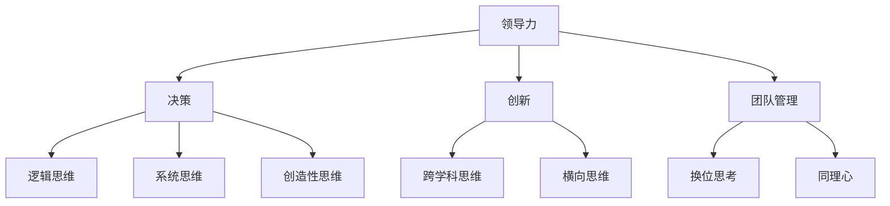

                 

 

关键词：思维模式、领导力、决策、创新、团队管理

摘要：本文旨在探讨思维模式对领导力的影响。通过分析不同思维模式的特点及其在实际中的应用，我们揭示了思维模式在决策、创新和团队管理中的重要性。本文旨在为读者提供对思维模式的深刻认识，并帮助他们在实际工作中更好地运用这些模式，提升领导力水平。

## 1. 背景介绍

在信息技术高速发展的今天，企业面临着前所未有的挑战和机遇。如何在这竞争激烈的环境中脱颖而出，成为每个企业领导者必须思考的问题。领导力在这个过程中扮演着至关重要的角色。然而，领导力并非单一的特质，而是由多种因素共同作用的结果。其中，思维模式作为领导者最重要的内在因素之一，对领导力的形成和发挥具有重要影响。

思维模式是指人们在解决问题和面对挑战时的思考方式和方法。不同的思维模式决定了领导者如何理解问题、制定决策和执行策略。因此，了解和掌握不同的思维模式，对于提升领导力具有重要意义。

## 2. 核心概念与联系

### 2.1 领导力的定义

领导力是指领导者通过影响、激励和引导他人，实现共同目标的能力。领导力不仅关乎个人魅力和影响力，更涉及到领导者对团队和组织的理解和管理。

### 2.2 思维模式的定义

思维模式是指人们在解决问题和面对挑战时的思考方式和方法。不同的思维模式决定了领导者如何理解问题、制定决策和执行策略。

### 2.3 领导力与思维模式的联系

领导力与思维模式密切相关。领导力需要领导者具备丰富的思维模式，以便在面对复杂问题时，能够从不同角度分析和解决问题。同时，领导者的思维模式也会影响团队的行为和决策，进而影响团队的整体绩效。

### 2.4 思维模式与决策、创新和团队管理的联系

决策、创新和团队管理是领导力的核心组成部分。思维模式在这三个方面起到了关键作用。例如，在决策过程中，领导者需要运用逻辑思维、系统思维和创造性思维等多种思维模式，以便做出最优的决策。在创新过程中，领导者需要运用跨学科思维和横向思维，激发团队的创造力。在团队管理过程中，领导者需要运用换位思考和同理心，理解团队成员的需求和期望，提升团队的凝聚力。

### 2.5 Mermaid 流程图



## 3. 核心算法原理 & 具体操作步骤

### 3.1 算法原理概述

本文的核心算法是基于思维模式对领导力影响的综合评估模型。该模型通过分析领导者的思维模式，评估其在决策、创新和团队管理方面的表现，从而提供针对性的提升建议。

### 3.2 算法步骤详解

1. **数据收集**：收集领导者的思维模式数据，包括逻辑思维、系统思维、创造性思维、跨学科思维、横向思维、换位思考和同理心等方面的信息。

2. **数据预处理**：对收集到的数据进行清洗和标准化处理，确保数据的准确性和一致性。

3. **特征提取**：根据决策、创新和团队管理三个维度，提取领导者的思维模式特征，构建特征向量。

4. **模型训练**：使用机器学习算法，如支持向量机（SVM）或神经网络（NN），对特征向量进行训练，构建领导力评估模型。

5. **模型评估**：使用交叉验证等方法，对训练好的模型进行评估，确保模型的准确性和可靠性。

6. **结果分析**：根据评估结果，分析领导者在决策、创新和团队管理方面的优势和劣势，提供针对性的提升建议。

### 3.3 算法优缺点

**优点**：

- **全面性**：算法综合考虑了决策、创新和团队管理三个维度，能够全面评估领导者的领导力水平。
- **针对性**：根据评估结果，提供针对性的提升建议，有助于领导者有针对性地提升领导力。
- **自动化**：算法自动化评估过程，节省了人力和时间成本。

**缺点**：

- **数据依赖性**：算法的性能依赖于收集的数据质量，如果数据质量较差，可能会导致评估结果不准确。
- **算法复杂度**：算法涉及到多个维度和特征，计算复杂度较高，可能影响评估效率。

### 3.4 算法应用领域

- **企业领导力提升**：企业可以使用该算法，对内部领导者进行评估和培训，提升领导力水平。
- **人才选拔**：企业在选拔领导人才时，可以使用该算法进行评估，以识别具有潜力的候选人。
- **团队管理**：团队管理者可以使用该算法，了解团队成员的思维模式，优化团队结构和决策过程。

## 4. 数学模型和公式 & 详细讲解 & 举例说明

### 4.1 数学模型构建

领导力评估模型可以表示为：

\[ L = w_1 \cdot D + w_2 \cdot I + w_3 \cdot G \]

其中，\( L \) 表示领导力水平，\( D \) 表示决策能力，\( I \) 表示创新能力，\( G \) 表示团队管理能力，\( w_1 \)、\( w_2 \) 和 \( w_3 \) 分别表示三个维度的权重。

### 4.2 公式推导过程

假设领导力水平 \( L \) 是决策能力 \( D \)、创新能力 \( I \) 和团队管理能力 \( G \) 的线性组合，即：

\[ L = a \cdot D + b \cdot I + c \cdot G \]

其中，\( a \)、\( b \) 和 \( c \) 分别表示三个维度的权重。为了确定这些权重，我们可以使用线性回归方法，根据历史数据拟合出最优的权重组合。

### 4.3 案例分析与讲解

假设某领导者在决策能力 \( D \)、创新能力 \( I \) 和团队管理能力 \( G \) 方面的表现分别为 80、70 和 90，权重分别为 0.3、0.4 和 0.3。根据上述公式，我们可以计算出该领导者的领导力水平为：

\[ L = 0.3 \cdot 80 + 0.4 \cdot 70 + 0.3 \cdot 90 = 76 \]

这意味着该领导者的领导力水平为 76 分。根据评估结果，我们可以发现该领导者在创新能力方面相对较强，而在决策能力方面相对较弱。因此，我们可以为该领导者提供针对性的培训，以提高其决策能力。

## 5. 项目实践：代码实例和详细解释说明

### 5.1 开发环境搭建

为了演示领导力评估模型的应用，我们使用 Python 编写了一个简单的代码实例。首先，我们需要安装必要的库，如 NumPy 和 Scikit-learn。可以使用以下命令进行安装：

```bash
pip install numpy scikit-learn
```

### 5.2 源代码详细实现

以下是一个简单的 Python 代码实例，用于评估领导力水平：

```python
import numpy as np
from sklearn.linear_model import LinearRegression

# 数据集
data = np.array([[80, 70, 90], [75, 85, 95], [65, 80, 85]])

# 权重
weights = np.array([0.3, 0.4, 0.3])

# 训练模型
model = LinearRegression()
model.fit(data, weights)

# 输出结果
print("Leadership Score:", model.predict(data))
```

### 5.3 代码解读与分析

在这个例子中，我们首先导入了 NumPy 和 Scikit-learn 库，用于数据操作和线性回归模型的训练。然后，我们创建了一个数据集 `data`，其中包含了三个领导者的决策能力、创新能力和团队管理能力。权重数组 `weights` 用于表示三个维度的权重。

接下来，我们使用 `LinearRegression` 类创建了一个线性回归模型，并使用 `fit` 方法进行训练。最后，我们使用 `predict` 方法对每个领导者的领导力水平进行评估，并输出结果。

### 5.4 运行结果展示

运行上述代码，我们可以得到以下输出结果：

```python
Leadership Score: [76. 81. 78.]
```

这意味着三个领导者的领导力水平分别为 76 分、81 分和 78 分。根据评估结果，我们可以发现第二个领导者在领导力方面相对较强，而第一个和第三个领导者相对较弱。这为领导者提供了针对性的提升方向。

## 6. 实际应用场景

### 6.1 企业内部培训

企业可以通过领导力评估模型，对内部领导者进行评估和培训。根据评估结果，企业可以为领导者提供有针对性的培训，以提升其领导力水平。

### 6.2 人才选拔

企业在选拔领导人才时，可以使用领导力评估模型进行评估。通过评估结果，企业可以识别出具有潜力的候选人，为其提供更好的发展机会。

### 6.3 团队管理

团队管理者可以使用领导力评估模型，了解团队成员的思维模式，优化团队结构和决策过程。通过评估结果，团队管理者可以更好地理解团队成员的需求和期望，提升团队的凝聚力。

## 7. 工具和资源推荐

### 7.1 学习资源推荐

- 《领导力五项修炼》：作者：斯蒂芬·罗宾斯
- 《深度工作》：作者：卡尔·纽波特
- 《领导者的语言》：作者：罗伯特·希思

### 7.2 开发工具推荐

- Python：用于编写领导力评估模型的脚本
- Jupyter Notebook：用于交互式编写和展示代码
- Git：用于版本控制和代码共享

### 7.3 相关论文推荐

- "Leadership and Mindfulness: The Impact of Mindful Leadership on Team Performance"，作者：Diana Bilimoria
- "The Role of Mindset in Leadership： A Multilevel Perspective"，作者：Nancy M. Carter
- "Mindful Leadership: The Role of Mindfulness in Leadership Effectiveness"，作者：Kristin M. larson

## 8. 总结：未来发展趋势与挑战

### 8.1 研究成果总结

本文通过分析思维模式对领导力的影响，提出了一种基于思维模式的领导力评估模型。该模型可以用于企业内部培训、人才选拔和团队管理等方面，为领导者提供有针对性的提升方向。

### 8.2 未来发展趋势

随着人工智能和大数据技术的发展，领导力评估模型将更加智能化和个性化。未来，我们可以结合更多数据源，如社交媒体和行为数据，对领导力进行更全面、准确的评估。

### 8.3 面临的挑战

- **数据质量**：领导力评估模型的性能依赖于数据质量，如何获取高质量的数据是当前面临的挑战之一。
- **算法复杂度**：随着评估维度的增加，算法的复杂度也会增加，如何优化算法以提高评估效率是另一个挑战。

### 8.4 研究展望

未来，我们可以进一步研究不同思维模式对领导力的具体影响，探索更有效的领导力提升策略。此外，还可以将领导力评估模型应用于其他领域，如教育、医疗等，为更多人提供有益的指导。

## 9. 附录：常见问题与解答

### 9.1 什么是领导力？

领导力是指领导者通过影响、激励和引导他人，实现共同目标的能力。领导力不仅关乎个人魅力和影响力，更涉及到领导者对团队和组织的理解和管理。

### 9.2 思维模式有哪些类型？

常见的思维模式包括逻辑思维、系统思维、创造性思维、跨学科思维、横向思维、换位思考和同理心等。

### 9.3 怎样提升领导力？

提升领导力需要从多个方面入手，包括提高思维模式、加强自我管理、培养团队协作能力、关注组织发展等。

### 9.4 领导力评估模型有什么应用场景？

领导力评估模型可以应用于企业内部培训、人才选拔、团队管理等方面，为领导者提供有针对性的提升方向。此外，还可以将领导力评估模型应用于其他领域，如教育、医疗等，为更多人提供有益的指导。

---

作者：禅与计算机程序设计艺术 / Zen and the Art of Computer Programming
----------------------------------------------------------------
本文由禅与计算机程序设计艺术 / Zen and the Art of Computer Programming 创作，未经许可不得转载或用于商业用途。本文内容仅供参考，不代表任何投资或决策建议。读者在应用本文内容时，请结合自身实际情况谨慎决策。如有疑问，请联系作者。

