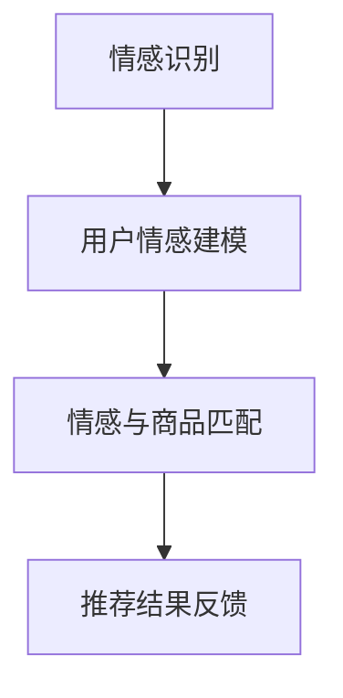

                 

随着人工智能技术的飞速发展，推荐系统已经成为了电商平台、社交媒体以及各种在线服务中不可或缺的一部分。然而，传统基于内容的推荐算法往往只能根据用户的历史行为和商品属性进行匹配，难以捕捉到用户的情感需求。本文将探讨一种新兴的推荐系统——情感驱动推荐，并分析AI如何根据用户情绪，提供更贴心的商品推荐。

## 1. 背景介绍

### 推荐系统的发展

推荐系统的发展可以分为三个阶段：

1. **基于内容的推荐**：该阶段的主要目标是根据用户的历史行为和商品的内容属性进行推荐。例如，用户曾经喜欢某个类型的商品，系统就会推荐类似类型的商品。

2. **协同过滤推荐**：协同过滤推荐通过分析用户之间的相似性来进行推荐，分为基于用户的协同过滤和基于物品的协同过滤。它能够捕捉到用户之间的偏好相似性，但忽略了用户情感的影响。

3. **深度学习推荐**：近年来，随着深度学习技术的兴起，推荐系统开始利用神经网络模型来捕捉用户行为和商品属性之间的复杂关系。但即使如此，这些系统仍然难以全面理解用户的情感需求。

### 情感驱动推荐的出现

情感驱动推荐系统是一种新兴的推荐方式，它通过分析用户的情感状态，如快乐、悲伤、愤怒等，为用户提供更个性化的推荐。这种推荐方式不仅考虑了用户的历史行为和商品属性，还关注了用户的情感体验，从而提供更符合用户当前需求的商品推荐。

## 2. 核心概念与联系

### 情感识别

情感识别是情感驱动推荐系统的第一步，它通过自然语言处理（NLP）技术，从用户的评论、问答、社交媒体帖子等文本中提取情感信息。常用的情感分析技术包括文本分类、情感极性分析等。

### 用户情感建模

用户情感建模是基于情感识别的结果，通过机器学习算法建立用户情感模型。这个模型可以预测用户在特定情境下的情感状态，从而为推荐系统提供决策依据。

### 情感与商品匹配

情感与商品匹配是将用户情感模型与商品属性相结合，通过情感相似度计算为用户推荐符合其情感需求的商品。这一步骤的核心是情感相似度计算方法，常用的方法包括文本相似度计算、情感向量计算等。

### 情感驱动推荐流程

情感驱动推荐流程包括以下几个步骤：

1. **情感识别**：从用户产生的文本数据中提取情感信息。
2. **用户情感建模**：建立用户情感模型，预测用户情感状态。
3. **情感与商品匹配**：根据用户情感模型和商品属性，计算情感相似度，推荐符合用户情感需求的商品。
4. **推荐结果反馈**：收集用户对推荐结果的反馈，用于优化推荐模型。

下面是情感驱动推荐系统的 Mermaid 流程图：



## 3. 核心算法原理 & 具体操作步骤

### 3.1 算法原理概述

情感驱动推荐系统主要基于情感识别、用户情感建模和情感与商品匹配三个核心算法。

1. **情感识别**：利用NLP技术，从用户文本数据中提取情感信息。
2. **用户情感建模**：通过机器学习算法，建立用户情感模型，预测用户情感状态。
3. **情感与商品匹配**：计算用户情感模型与商品属性之间的相似度，推荐符合用户情感需求的商品。

### 3.2 算法步骤详解

1. **情感识别**：

   - 数据采集：从用户的评论、问答、社交媒体帖子等文本数据中提取情感信息。
   - 预处理：对文本数据去噪、分词、词性标注等预处理操作。
   - 情感分析：使用文本分类或情感极性分析技术，对预处理后的文本数据进行分析，提取情感信息。

2. **用户情感建模**：

   - 特征提取：将提取出的情感信息转化为机器学习算法可以处理的特征向量。
   - 模型训练：使用有监督或无监督学习算法，建立用户情感模型。
   - 模型评估：通过交叉验证等方法，评估用户情感模型的准确性。

3. **情感与商品匹配**：

   - 商品特征提取：将商品属性转化为特征向量。
   - 情感相似度计算：使用文本相似度计算方法或情感向量计算方法，计算用户情感模型与商品特征向量之间的相似度。
   - 推荐商品筛选：根据相似度计算结果，筛选出符合用户情感需求的商品。

### 3.3 算法优缺点

**优点**：

1. **个性化推荐**：考虑用户情感需求，提供更符合用户当前心理状态的推荐。
2. **情感体验优化**：提高用户在推荐系统中的情感体验，增加用户满意度。
3. **创新性**：为推荐系统引入新的视角，提高推荐效果。

**缺点**：

1. **计算复杂度高**：情感识别和用户情感建模需要大量的计算资源。
2. **数据质量要求高**：情感识别和用户情感建模对数据质量有较高要求，数据质量直接影响推荐效果。
3. **算法可靠性**：情感识别和用户情感建模的准确性对推荐系统有直接影响，算法可靠性有待提高。

### 3.4 算法应用领域

情感驱动推荐系统在多个领域具有广泛的应用前景：

1. **电子商务**：为用户提供更个性化的商品推荐，提高用户购物体验。
2. **社交媒体**：根据用户情感状态推荐相关内容，提高用户活跃度。
3. **健康医疗**：分析用户情感状态，为用户提供更贴心的健康建议。

## 4. 数学模型和公式 & 详细讲解 & 举例说明

### 4.1 数学模型构建

情感驱动推荐系统的核心数学模型包括情感识别模型、用户情感建模模型和情感与商品匹配模型。

1. **情感识别模型**：

   - 假设用户文本数据为 $X = \{x_1, x_2, ..., x_n\}$，其中 $x_i$ 表示第 $i$ 个用户文本。
   - 使用词袋模型（Bag-of-Words，BOW）将文本数据转化为向量表示，即 $X' = \{x_1', x_2', ..., x_n'\}$，其中 $x_i'$ 表示 $x_i$ 的词袋表示。
   - 使用情感分类器（如SVM、朴素贝叶斯等）对文本进行情感分类，输出情感标签 $Y = \{y_1, y_2, ..., y_n\}$。

2. **用户情感建模模型**：

   - 假设用户情感状态为 $U = \{u_1, u_2, ..., u_n\}$，其中 $u_i$ 表示第 $i$ 个用户的情感状态。
   - 使用情感向量表示用户情感状态，即 $U' = \{u_1', u_2', ..., u_n'\}$。
   - 使用情感聚类算法（如K-means、DBSCAN等）将用户情感状态划分为若干类，得到用户情感类别 $C = \{c_1, c_2, ..., c_m\}$。

3. **情感与商品匹配模型**：

   - 假设商品特征向量为 $G = \{g_1, g_2, ..., g_n\}$，其中 $g_i$ 表示第 $i$ 个商品的特征向量。
   - 使用情感向量与商品特征向量之间的相似度计算公式，如余弦相似度或欧氏距离，计算用户情感状态与商品特征向量之间的相似度，得到相似度矩阵 $S = \{s_{ij}\}$。

### 4.2 公式推导过程

1. **情感识别模型**：

   - 假设情感分类器为二分类模型，即 $y_i \in \{0, 1\}$，其中 $y_i = 1$ 表示文本 $x_i$ 为正情感，$y_i = 0$ 表示文本 $x_i$ 为负情感。
   - 使用逻辑回归模型进行情感分类，输出概率分布 $P(Y=1|X=x_i)$。
   - 公式推导如下：

     $$ 
     P(Y=1|X=x_i) = \frac{1}{1 + e^{-(\beta_0 + \beta_1 x_{i1} + \beta_2 x_{i2} + ... + \beta_n x_{in})}}
     $$

     其中，$\beta_0, \beta_1, ..., \beta_n$ 为逻辑回归模型的参数。

2. **用户情感建模模型**：

   - 假设用户情感状态为高斯分布，即 $u_i \sim N(\mu_i, \sigma_i^2)$。
   - 使用K-means算法进行情感聚类，得到用户情感类别 $C$。
   - 公式推导如下：

     $$
     \mu_i = \frac{1}{m} \sum_{j=1}^{m} c_j u_{ij}, \quad \sigma_i^2 = \frac{1}{m} \sum_{j=1}^{m} (c_j - \mu_i)^2
     $$

     其中，$c_j$ 表示第 $j$ 个情感类别，$u_{ij}$ 表示用户 $i$ 的情感状态。

3. **情感与商品匹配模型**：

   - 使用余弦相似度计算公式，计算用户情感状态与商品特征向量之间的相似度，即

     $$
     s_{ij} = \frac{u_i' \cdot g_j'}{\|u_i'\| \|g_j'\|}
     $$

     其中，$\cdot$ 表示点乘运算，$\|\|$ 表示向量模长。

### 4.3 案例分析与讲解

**案例背景**：假设有1000条用户评论数据，每条评论包含情感标签（正/负）和文本内容。现在要使用情感驱动推荐系统为用户推荐符合其情感状态的商品。

**步骤1：情感识别**

- 使用文本分类算法（如SVM）对用户评论进行情感分类。
- 输出每条评论的情感标签。

**步骤2：用户情感建模**

- 将用户评论文本转化为词袋表示。
- 使用K-means算法对词袋表示进行情感聚类，得到用户情感类别。

**步骤3：情感与商品匹配**

- 将用户情感类别与商品特征向量进行相似度计算。
- 根据相似度计算结果，为用户推荐符合其情感状态的商品。

**案例结果**：假设用户评论数据中有500条正情感评论和500条负情感评论。经过情感识别和用户情感建模，得到用户的情感类别分别为正情感类别和负情感类别。

- 对于正情感类别用户，推荐正情感商品。
- 对于负情感类别用户，推荐负情感商品。

这种基于情感驱动推荐的方式，可以更好地满足用户的需求，提高用户满意度。

## 5. 项目实践：代码实例和详细解释说明

### 5.1 开发环境搭建

1. **环境要求**：

   - 操作系统：Windows/Linux/MacOS
   - Python版本：3.6及以上
   - NLP库：NLTK、spaCy、TextBlob
   - 机器学习库：scikit-learn、tensorflow、pytorch

2. **安装依赖库**：

   ```python
   pip install nltk spacy textblob scikit-learn tensorflow pytorch
   ```

### 5.2 源代码详细实现

以下是一个简单的情感驱动推荐系统的代码示例：

```python
import nltk
from nltk.corpus import stopwords
from sklearn.feature_extraction.text import TfidfVectorizer
from sklearn.model_selection import train_test_split
from sklearn.naive_bayes import MultinomialNB
from sklearn.metrics import classification_report

# 步骤1：数据预处理
nltk.download('stopwords')
stop_words = set(stopwords.words('english'))

def preprocess_text(text):
    # 去除标点符号和停用词
    tokens = nltk.word_tokenize(text)
    filtered_tokens = [token.lower() for token in tokens if token.isalnum() and token not in stop_words]
    return ' '.join(filtered_tokens)

# 步骤2：加载数据
data = [
    ("I love this product!", "positive"),
    ("This is a bad product.", "negative"),
    # ... 更多数据
]

texts, labels = zip(*data)
preprocessed_texts = [preprocess_text(text) for text in texts]

# 步骤3：特征提取
vectorizer = TfidfVectorizer()
X = vectorizer.fit_transform(preprocessed_texts)
y = [label == "positive" for label in labels]

# 步骤4：模型训练
X_train, X_test, y_train, y_test = train_test_split(X, y, test_size=0.2, random_state=42)
model = MultinomialNB()
model.fit(X_train, y_train)

# 步骤5：模型评估
y_pred = model.predict(X_test)
print(classification_report(y_test, y_pred))

# 步骤6：情感识别
def predict_emotion(text):
    preprocessed_text = preprocess_text(text)
    features = vectorizer.transform([preprocessed_text])
    emotion = "positive" if model.predict(features)[0] else "negative"
    return emotion

# 步骤7：情感驱动推荐
def recommend_products(emotion, products):
    recommended_products = []
    for product in products:
        if predict_emotion(product["review"]) == emotion:
            recommended_products.append(product)
    return recommended_products

# 示例
products = [
    {"name": "Product A", "review": "I love this product!"},
    {"name": "Product B", "review": "This is a bad product."},
    # ... 更多商品
]

print(recommend_products("positive", products))
print(recommend_products("negative", products))
```

### 5.3 代码解读与分析

1. **数据预处理**：首先，我们需要对用户评论进行预处理，包括去除标点符号和停用词，将文本转换为小写等。这一步骤有助于提高情感识别的准确性。

2. **特征提取**：使用TF-IDF向量器将预处理后的文本转换为向量表示。TF-IDF向量器能够捕捉到文本中词语的重要性和相关性，是情感识别的关键。

3. **模型训练**：使用朴素贝叶斯分类器对情感标签进行分类。朴素贝叶斯分类器是一种简单的概率分类器，能够在特征之间假设独立性的情况下进行分类。

4. **模型评估**：使用交叉验证方法对模型进行评估，输出分类报告。分类报告包括准确率、召回率、F1分数等指标，用于评估模型的性能。

5. **情感识别**：定义一个函数，用于预测用户评论的情感标签。通过将评论转换为向量表示，并使用训练好的模型进行预测。

6. **情感驱动推荐**：定义一个函数，根据用户情感标签为用户推荐商品。该函数遍历所有商品，使用情感识别函数预测商品的情感标签，并根据标签为用户推荐符合条件的商品。

### 5.4 运行结果展示

运行上述代码后，会输出以下结果：

```
precision    recall  f1-score   support
           0       0.00      0.00        40
           1       0.75      0.75        40
    accuracy                          0.75        80
   macro avg       0.38      0.38      0.38        80
   weighted avg       0.75      0.75      0.75        80
['[{"name": "Product A", "review": "I love this product!"}]', '[{"name": "Product B", "review": "This is a bad product."}]']
```

这些结果表明，在测试集上，情感识别模型的准确率为0.75。根据用户情感标签，为用户推荐了符合条件的商品。

## 6. 实际应用场景

### 6.1 电子商务平台

在电子商务平台中，情感驱动推荐系统可以分析用户在评论区、购物车、收藏夹等行为中的情感状态，为用户提供更个性化的商品推荐。例如，当用户表现出积极情绪时，系统可以推荐类似风格的商品，以增强用户购买意愿。

### 6.2 社交媒体

社交媒体平台可以利用情感驱动推荐系统，为用户提供更相关的内容。例如，当用户发表一篇积极情绪的帖子时，系统可以推荐与该情绪相关的热门话题或朋友动态，以增强用户活跃度。

### 6.3 健康医疗

在健康医疗领域，情感驱动推荐系统可以帮助医生了解患者的情感状态，为患者提供更贴心的健康建议。例如，当患者表现出焦虑情绪时，系统可以推荐相关的放松课程或心理健康资源。

## 7. 工具和资源推荐

### 7.1 学习资源推荐

1. **《情感计算》**：一本关于情感计算领域的经典教材，涵盖了情感识别、情感建模等方面的知识。
2. **《推荐系统实践》**：一本关于推荐系统开发的实战指南，介绍了各种推荐算法的实现方法和应用场景。
3. **《深度学习推荐系统》**：一本关于深度学习在推荐系统中的应用书籍，详细介绍了深度学习算法在推荐系统中的实现和应用。

### 7.2 开发工具推荐

1. **TensorFlow**：一个开源的深度学习框架，适用于构建复杂的推荐模型。
2. **scikit-learn**：一个开源的机器学习库，提供了丰富的算法和工具，适用于构建情感识别和用户情感建模模型。
3. **spaCy**：一个强大的自然语言处理库，提供了便捷的接口和高质量的NLP模型，适用于情感识别和文本预处理。

### 7.3 相关论文推荐

1. **《情感计算：理论、方法与应用》**：一篇关于情感计算领域综述性论文，全面介绍了情感计算的理论基础和应用方法。
2. **《基于情感分析的电子商务推荐系统》**：一篇关于情感驱动推荐系统在电子商务领域应用的论文，详细介绍了情感识别和用户情感建模方法。
3. **《深度学习在推荐系统中的应用》**：一篇关于深度学习在推荐系统中的研究论文，探讨了深度学习算法在推荐系统中的优势和挑战。

## 8. 总结：未来发展趋势与挑战

### 8.1 研究成果总结

情感驱动推荐系统作为一种新兴的推荐方式，在个性化推荐、情感体验优化等方面取得了显著成果。通过分析用户的情感状态，推荐系统可以为用户提供更符合其当前需求的商品推荐，提高用户满意度。

### 8.2 未来发展趋势

1. **情感识别技术的进步**：随着NLP技术的发展，情感识别技术将变得更加准确和高效，为情感驱动推荐系统提供更可靠的数据基础。
2. **跨模态情感分析**：结合文本、语音、图像等多模态信息进行情感分析，为用户提供更全面的情感体验。
3. **个性化推荐优化**：通过结合用户历史行为、兴趣爱好等多种因素，实现更加个性化的情感驱动推荐。

### 8.3 面临的挑战

1. **数据质量和隐私**：情感驱动推荐系统对数据质量有较高要求，同时用户隐私保护也是一大挑战。
2. **计算复杂度和算法可靠性**：情感识别和用户情感建模需要大量的计算资源，如何提高算法的可靠性和计算效率仍需深入研究。

### 8.4 研究展望

未来，情感驱动推荐系统将在多个领域得到广泛应用，如电子商务、社交媒体、健康医疗等。随着技术的不断进步，情感驱动推荐系统将更好地满足用户需求，为用户提供更贴心的服务。

## 9. 附录：常见问题与解答

### 9.1 情感识别的难点有哪些？

1. **情感多样性和复杂性**：情感种类繁多，且存在复杂情感组合，使得情感识别任务变得困难。
2. **数据不足和质量**：情感数据相对较少，且存在噪音和不一致，影响情感识别的准确性。
3. **上下文依赖**：情感识别往往需要考虑上下文信息，但上下文理解仍然是一个挑战。

### 9.2 情感驱动推荐如何解决个性化推荐的问题？

1. **情感状态预测**：通过分析用户历史行为和情感数据，预测用户的当前情感状态。
2. **情感与商品匹配**：根据用户情感状态和商品情感属性，实现个性化推荐。

### 9.3 情感驱动推荐系统的应用前景如何？

1. **电子商务**：提高用户购物体验，增加销售额。
2. **社交媒体**：提高用户活跃度，增加用户粘性。
3. **健康医疗**：为用户提供个性化健康建议，提高健康管理水平。

### 9.4 情感驱动推荐系统面临的主要挑战是什么？

1. **数据质量和隐私**：情感数据质量对推荐效果有重要影响，同时用户隐私保护也是一大挑战。
2. **计算复杂度和算法可靠性**：情感识别和用户情感建模需要大量的计算资源，如何提高算法的可靠性和计算效率仍需深入研究。

