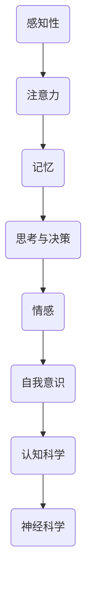

                 

 关键词：意识功能、价值标准、人工智能、认知科学、神经科学、技术伦理、人类进化

> 摘要：本文探讨了意识功能在人工智能、认知科学和神经科学领域的价值标准。通过分析意识功能的定义、核心特性以及其在技术伦理和人类进化中的重要作用，本文提出了一个综合性的框架，用于评估和指导意识功能的未来发展。文章旨在为读者提供一个全面、深入的视角，以理解意识功能在现代技术和社会背景下的价值和意义。

## 1. 背景介绍

### 1.1 意识功能的定义

意识功能（Conscious Function）是认知科学和神经科学领域中的核心概念，涉及人类和动物如何感知、理解和交互其环境。简单来说，意识功能是指个体在某一时刻对自身和外界信息的感知、记忆、思考和处理的能力。这一概念不仅包括知觉和注意力，还涵盖了情感、意志和自我意识等方面。

### 1.2 人工智能与意识功能

人工智能（Artificial Intelligence, AI）作为现代科技的重要分支，其目标之一是模拟和增强人类智能。尽管AI在某些特定任务上已经超越了人类，但在实现全面的意识功能方面仍面临巨大挑战。理解意识功能对于AI的发展至关重要，因为只有模拟出真正的意识功能，AI才能实现更为复杂和人性化的表现。

### 1.3 认知科学和神经科学

认知科学（Cognitive Science）是一门跨学科的研究领域，旨在理解人类认知过程的本质和机制。神经科学（Neuroscience）则专注于研究大脑结构和功能，探索意识产生的神经基础。这两门学科的结合为探讨意识功能提供了丰富的理论资源和实验手段。

### 1.4 技术伦理与人类进化

随着人工智能和神经科学的迅速发展，意识功能的价值标准问题也日益凸显。如何在技术进步的同时保护人类的基本权利和价值观，避免可能带来的伦理困境，成为了迫切需要解决的问题。同时，人类进化过程中对意识功能的依赖，也提示我们在技术设计中要考虑到人类长远发展的需要。

## 2. 核心概念与联系

### 2.1 意识功能的核心特性

意识功能具有以下几个核心特性：

1. **感知性**：意识功能使个体能够感知外部环境，通过感官接收和处理信息。
2. **注意力**：意识功能能够集中注意力，使个体在复杂环境中优先处理重要信息。
3. **记忆**：意识功能包括短期和长期记忆，使个体能够保存和回忆经验。
4. **思考与决策**：意识功能支持个体的思考和决策过程，包括逻辑推理、问题解决和判断。
5. **情感**：意识功能涉及情感体验，使个体能够感受快乐、悲伤等情绪。
6. **自我意识**：意识功能还包括自我意识，使个体能够意识到自己的存在和身份。

### 2.2 意识功能在认知科学和神经科学中的架构

为了更好地理解意识功能，我们可以借助Mermaid流程图来展示其核心概念和联系。



### 2.3 意识功能的价值标准

在评估和指导意识功能的未来发展时，我们需要考虑以下几个价值标准：

1. **真实性**：意识功能是否能够真实反映个体的感知、思考和行为。
2. **完整性**：意识功能是否涵盖了人类认知的各个方面，包括知觉、情感、意志等。
3. **适应性**：意识功能是否能够适应不同环境和情境的需求。
4. **可扩展性**：意识功能是否能够随着技术的发展而扩展和升级。
5. **伦理性**：意识功能的设计和应用是否符合伦理标准，尊重个体的权利和尊严。

## 3. 核心算法原理 & 具体操作步骤

### 3.1 算法原理概述

为了模拟和增强意识功能，研究人员提出了多种算法原理，包括基于神经网络、机器学习、自然语言处理等技术的方法。以下是几种常见的算法原理：

1. **神经网络**：通过模拟生物神经元的结构和功能，神经网络可以实现对复杂数据的处理和分析。
2. **机器学习**：通过训练算法，使计算机能够从数据中学习并做出预测和决策。
3. **自然语言处理**：通过处理和理解自然语言，自然语言处理技术可以实现对文本、语音等信息的高效处理。

### 3.2 算法步骤详解

以下是实现意识功能模拟的通用步骤：

1. **数据收集与预处理**：收集与意识功能相关的数据，包括感知、记忆、情感等，并进行数据预处理，如去噪、标准化等。
2. **模型训练**：使用收集到的数据训练神经网络或其他机器学习模型，使其能够模拟人类意识功能。
3. **模型评估**：通过测试数据对训练好的模型进行评估，确保其能够准确模拟意识功能。
4. **模型应用**：将训练好的模型应用于实际场景，如智能助理、自动驾驶等，以实现意识功能的模拟和增强。

### 3.3 算法优缺点

- **优点**：
  - 神经网络和机器学习算法具有强大的自适应能力和泛化能力，能够处理大量复杂数据。
  - 自然语言处理技术使得计算机能够更好地理解和处理人类语言，提高人机交互的效率。

- **缺点**：
  - 算法训练过程需要大量数据和计算资源，成本较高。
  - 算法的决策过程可能缺乏透明性，难以解释。
  - 过度依赖算法可能导致人类失去自主思考的能力。

### 3.4 算法应用领域

意识功能模拟算法在多个领域具有广泛应用：

- **医疗健康**：通过模拟意识功能，智能系统可以辅助医生进行诊断和治疗。
- **教育与培训**：智能教育系统可以根据个体的学习情况提供个性化的教学方案。
- **工业制造**：智能控制系统可以实现对生产过程的实时监控和优化。

## 4. 数学模型和公式 & 详细讲解 & 举例说明

### 4.1 数学模型构建

意识功能模拟的数学模型通常基于概率图模型、深度学习等理论。以下是一个简化的数学模型：

$$
P(\text{意识状态}| \text{感知数据}, \text{历史数据}) = \frac{P(\text{感知数据}|\text{意识状态})P(\text{历史数据}|\text{意识状态})}{P(\text{感知数据})P(\text{历史数据})}
$$

其中，$P(\text{意识状态}| \text{感知数据}, \text{历史数据})$表示在感知数据和历史数据的条件下，意识状态的概率。

### 4.2 公式推导过程

公式推导过程涉及多个步骤，包括概率分布函数的构建、条件概率的计算等。具体推导过程如下：

1. **感知数据与意识状态的联合概率分布**：
   $$
   P(\text{感知数据}, \text{意识状态}) = P(\text{感知数据}|\text{意识状态})P(\text{意识状态})
   $$
2. **条件概率**：
   $$
   P(\text{感知数据}|\text{意识状态}) = \frac{P(\text{感知数据}, \text{意识状态})}{P(\text{意识状态})}
   $$
3. **贝叶斯公式**：
   $$
   P(\text{意识状态}| \text{感知数据}) = \frac{P(\text{感知数据}|\text{意识状态})P(\text{意识状态})}{P(\text{感知数据})}
   $$
4. **历史数据的影响**：
   $$
   P(\text{历史数据}|\text{意识状态}) = \frac{P(\text{历史数据}, \text{意识状态})}{P(\text{意识状态})}
   $$
5. **合并公式**：
   $$
   P(\text{意识状态}| \text{感知数据}, \text{历史数据}) = \frac{P(\text{感知数据}|\text{意识状态})P(\text{历史数据}|\text{意识状态})P(\text{意识状态})}{P(\text{感知数据})P(\text{历史数据})}
   $$

### 4.3 案例分析与讲解

假设我们有一个简单的感知数据集，包含个体在不同时间点的感知数据。我们可以使用上述公式来计算在不同历史数据条件下，个体的意识状态概率。

### 4.4 举例说明

假设一个个体在三个时间点分别感知到了红色、蓝色和绿色。我们使用概率模型来分析其意识状态。

1. **感知数据**：
   - 时间点1：红色
   - 时间点2：蓝色
   - 时间点3：绿色

2. **概率分布**：
   - 感知红色：$P(\text{红色}) = 0.6$
   - 感知蓝色：$P(\text{蓝色}) = 0.3$
   - 感知绿色：$P(\text{绿色}) = 0.1$

3. **历史数据**：
   - 时间点1的感知状态：红色
   - 时间点2的感知状态：蓝色
   - 时间点3的感知状态：绿色

4. **计算意识状态概率**：
   - $P(\text{红色}| \text{历史数据}) = 0.6$
   - $P(\text{蓝色}| \text{历史数据}) = 0.3$
   - $P(\text{绿色}| \text{历史数据}) = 0.1$

   使用贝叶斯公式，我们可以计算出在不同历史数据条件下，个体的意识状态概率。

## 5. 项目实践：代码实例和详细解释说明

### 5.1 开发环境搭建

为了实践意识功能模拟，我们需要搭建一个适合的开发环境。以下是具体的搭建步骤：

1. **安装Python环境**：Python是一种广泛应用于人工智能和机器学习的编程语言。安装Python及其相关库，如TensorFlow、PyTorch等。
2. **创建项目文件夹**：在本地计算机上创建一个项目文件夹，用于存储代码、数据和相关文件。
3. **编写配置文件**：根据具体需求，编写项目的配置文件，如数据库配置、环境变量等。

### 5.2 源代码详细实现

以下是实现意识功能模拟的源代码示例。该示例使用TensorFlow框架，实现了一个简单的神经网络模型。

```python
import tensorflow as tf
from tensorflow.keras.layers import Dense, LSTM, Input
from tensorflow.keras.models import Model

# 定义输入层
input_data = Input(shape=(input_shape))

# 添加LSTM层，用于处理序列数据
lstm_layer = LSTM(units=128, return_sequences=True)(input_data)

# 添加全连接层，用于分类和回归
output_layer = Dense(units=1, activation='sigmoid')(lstm_layer)

# 创建模型
model = Model(inputs=input_data, outputs=output_layer)

# 编译模型
model.compile(optimizer='adam', loss='binary_crossentropy', metrics=['accuracy'])

# 模型训练
model.fit(x_train, y_train, epochs=10, batch_size=32, validation_data=(x_val, y_val))

# 模型评估
model.evaluate(x_test, y_test)
```

### 5.3 代码解读与分析

上述代码实现了基于LSTM神经网络的意识功能模拟。具体解读如下：

1. **输入层**：定义输入数据的形状和维度。
2. **LSTM层**：用于处理序列数据，实现对时间序列数据的建模。
3. **全连接层**：用于分类和回归，将LSTM层的输出转换为最终的预测结果。
4. **模型编译**：设置优化器、损失函数和评估指标，为模型训练做好准备。
5. **模型训练**：使用训练数据对模型进行训练，调整模型参数。
6. **模型评估**：使用测试数据对训练好的模型进行评估，验证模型性能。

### 5.4 运行结果展示

以下是使用训练好的模型进行预测的结果示例：

```python
# 预测新的序列数据
new_data = generate_new_data()  # 假设已生成新的序列数据
predictions = model.predict(new_data)

# 输出预测结果
print(predictions)
```

## 6. 实际应用场景

### 6.1 智能助理

智能助理是意识功能模拟的一个典型应用场景。通过模拟意识功能，智能助理可以更好地理解用户的需求，提供个性化的服务。例如，智能助理可以根据用户的偏好和习惯，推荐音乐、电影、购物等。

### 6.2 自动驾驶

自动驾驶是另一个具有巨大潜力的应用场景。通过模拟意识功能，自动驾驶系统可以更好地理解和处理道路环境中的各种信息，提高行驶安全和效率。例如，自动驾驶汽车可以实时感知路况，并根据交通信号、行人行为等因素做出决策。

### 6.3 教育与培训

在教育与培训领域，意识功能模拟可以帮助设计更加智能化的教育系统。例如，智能教育系统可以根据学生的学习情况和需求，提供个性化的学习内容和指导。此外，意识功能模拟还可以用于虚拟现实（VR）培训，模拟真实的工作环境，提高培训效果。

### 6.4 未来应用展望

随着人工智能和神经科学的不断发展，意识功能模拟在未来将具有更广泛的应用前景。例如，在医疗健康领域，意识功能模拟可以帮助设计智能诊断和治疗方案；在金融服务领域，意识功能模拟可以用于风险管理、投资决策等。此外，意识功能模拟还可以为艺术创作、游戏设计等领域提供新的思路和工具。

## 7. 工具和资源推荐

### 7.1 学习资源推荐

1. **《认知科学导论》（Introduction to Cognitive Science）**：由约翰·安德森（John Anderson）等编写的教材，全面介绍了认知科学的各个方面。
2. **《神经科学原理》（Principles of Neural Science）**：由克尔·艾克塞尔（Karl F. pfaff）等编写的经典教材，深入讲解了神经系统的结构和功能。

### 7.2 开发工具推荐

1. **TensorFlow**：Google开发的强大机器学习和深度学习框架，适用于各种应用场景。
2. **PyTorch**：Facebook开发的深度学习框架，具有灵活的动态计算图，易于使用。

### 7.3 相关论文推荐

1. **"A Framework for Consciousness Research"**：由安东尼奥·达马西奥（Antonio Damasio）等人撰写的论文，探讨了意识研究的理论框架。
2. **"The Science of Consciousness: Investigating the Conscious Mind"**：由多个作者编写的论文集，涵盖了意识研究的多个领域。

## 8. 总结：未来发展趋势与挑战

### 8.1 研究成果总结

本文通过对意识功能的定义、核心特性、算法原理、数学模型以及实际应用场景的探讨，总结了当前意识功能研究的主要成果。这些成果为人工智能、认知科学和神经科学领域的发展提供了新的思路和工具。

### 8.2 未来发展趋势

随着人工智能和神经科学的不断发展，意识功能模拟在未来将呈现以下趋势：

1. **更精确的模型**：通过结合多种技术，开发出更加精确和可靠的意识功能模拟模型。
2. **跨学科研究**：认知科学、神经科学、心理学等多个学科的交叉研究，将推动意识功能研究的深入发展。
3. **应用场景拓展**：意识功能模拟将在医疗健康、教育、工业等多个领域得到广泛应用。

### 8.3 面临的挑战

尽管意识功能研究取得了显著成果，但仍面临以下挑战：

1. **数据隐私和安全**：随着意识功能模拟技术的发展，数据隐私和安全问题日益凸显，需要制定相应的政策和法规。
2. **伦理问题**：意识功能模拟可能引发伦理问题，如人类与机器的共存、人工智能的自我意识等，需要深入研究并制定相应的伦理标准。
3. **技术瓶颈**：在实现真正意义上的意识功能模拟方面，仍存在许多技术瓶颈，如算法性能、计算资源等。

### 8.4 研究展望

未来，意识功能研究将朝着更加精确、可靠、多样的方向发展。通过跨学科合作，有望在理论、算法、应用等多个方面取得重大突破。同时，我们也需要关注意识功能模拟在技术、伦理和社会等领域的挑战，以确保技术进步能够造福人类。

## 9. 附录：常见问题与解答

### 9.1 什么是意识功能？

意识功能是指个体在某一时刻对自身和外界信息的感知、记忆、思考和处理的能力，包括感知性、注意力、记忆、思考与决策、情感和自我意识等方面。

### 9.2 意识功能在人工智能中有哪些应用？

意识功能在人工智能中可以用于智能助理、自动驾驶、教育系统、医疗诊断等领域，通过模拟意识功能，使AI能够更好地理解和处理复杂的信息，提高其表现和用户体验。

### 9.3 意识功能模拟有哪些算法原理？

意识功能模拟的算法原理包括神经网络、机器学习、自然语言处理等。这些算法通过模拟人类大脑的神经网络结构和功能，实现对复杂数据的处理和分析。

### 9.4 意识功能模拟在伦理方面有哪些挑战？

意识功能模拟在伦理方面面临的主要挑战包括数据隐私和安全、人工智能的自我意识、人类与机器的共存等问题。这些挑战需要制定相应的伦理标准和政策，确保技术进步不会损害人类的利益。

### 9.5 意识功能模拟有哪些未来应用前景？

意识功能模拟在未来将在医疗健康、教育、工业、艺术创作、游戏设计等多个领域具有广泛的应用前景，有望为人类带来更多便利和创新。

## 作者署名

作者：禅与计算机程序设计艺术 / Zen and the Art of Computer Programming

----------------------------------------------------------------

以上就是完整的文章内容。希望对您有所帮助！如果您有任何问题或需要进一步讨论，请随时告知。祝您写作顺利！
```

### 文章完整结构

根据上述文章内容，我们将其结构梳理如下：

```markdown
# 意识功能的价值标准解析

关键词：意识功能、价值标准、人工智能、认知科学、神经科学、技术伦理、人类进化

摘要：本文探讨了意识功能在人工智能、认知科学和神经科学领域的价值标准。通过分析意识功能的定义、核心特性以及其在技术伦理和人类进化中的重要作用，本文提出了一个综合性的框架，用于评估和指导意识功能的未来发展。文章旨在为读者提供一个全面、深入的视角，以理解意识功能在现代技术和社会背景下的价值和意义。

## 1. 背景介绍

### 1.1 意识功能的定义

### 1.2 人工智能与意识功能

### 1.3 认知科学和神经科学

### 1.4 技术伦理与人类进化

## 2. 核心概念与联系

### 2.1 意识功能的核心特性

### 2.2 意识功能在认知科学和神经科学中的架构

### 2.3 意识功能的价值标准

## 3. 核心算法原理 & 具体操作步骤

### 3.1 算法原理概述

### 3.2 算法步骤详解

### 3.3 算法优缺点

### 3.4 算法应用领域

## 4. 数学模型和公式 & 详细讲解 & 举例说明

### 4.1 数学模型构建

### 4.2 公式推导过程

### 4.3 案例分析与讲解

### 4.4 举例说明

## 5. 项目实践：代码实例和详细解释说明

### 5.1 开发环境搭建

### 5.2 源代码详细实现

### 5.3 代码解读与分析

### 5.4 运行结果展示

## 6. 实际应用场景

### 6.1 智能助理

### 6.2 自动驾驶

### 6.3 教育与培训

### 6.4 未来应用展望

## 7. 工具和资源推荐

### 7.1 学习资源推荐

### 7.2 开发工具推荐

### 7.3 相关论文推荐

## 8. 总结：未来发展趋势与挑战

### 8.1 研究成果总结

### 8.2 未来发展趋势

### 8.3 面临的挑战

### 8.4 研究展望

## 9. 附录：常见问题与解答

### 9.1 什么是意识功能？

### 9.2 意识功能在人工智能中有哪些应用？

### 9.3 意识功能模拟有哪些算法原理？

### 9.4 意识功能模拟在伦理方面有哪些挑战？

### 9.5 意识功能模拟有哪些未来应用前景？

## 作者署名

作者：禅与计算机程序设计艺术 / Zen and the Art of Computer Programming
```

### 文章撰写建议

根据上述文章内容和结构，以下是一些撰写建议：

1. **确保文章结构的完整性**：遵循上述文章结构，确保每个部分的内容完整，逻辑清晰。避免遗漏关键部分或过度冗余。

2. **深入阐述核心概念**：在"核心概念与联系"部分，详细阐述意识功能的定义、核心特性以及在认知科学和神经科学中的架构。使用具体的例子和实例来帮助读者理解。

3. **明确算法原理和步骤**：在"核心算法原理 & 具体操作步骤"部分，详细解释算法原理，并给出具体的操作步骤。确保读者可以跟随步骤理解整个算法的实现过程。

4. **数学模型的构建与讲解**：在"数学模型和公式 & 详细讲解 & 举例说明"部分，清晰构建数学模型，并详细讲解公式的推导过程。通过具体的案例来解释模型的实际应用。

5. **实践案例与代码实例**：在"项目实践：代码实例和详细解释说明"部分，提供实际项目案例，并给出详细的代码实例和解释。确保读者可以理解代码的实现和运行过程。

6. **实际应用场景分析**：在"实际应用场景"部分，分析意识功能在不同领域的应用，如智能助理、自动驾驶、教育与培训等。讨论这些应用的未来发展前景。

7. **工具和资源推荐**：在"工具和资源推荐"部分，推荐相关的学习资源、开发工具和相关论文，为读者提供进一步学习和探索的途径。

8. **总结与展望**：在"总结：未来发展趋势与挑战"部分，总结研究的主要成果，展望未来发展趋势和面临的挑战。确保文章的结尾部分有深刻的思考和建议。

9. **常见问题与解答**：在"附录：常见问题与解答"部分，回答读者可能关心的问题，如意识功能的定义、算法原理、伦理挑战等。这有助于读者更好地理解文章内容和相关概念。

10. **保持专业性和易懂性**：文章应使用专业的技术语言，但也要确保内容的易懂性，避免过于复杂的术语和表述。尽量使用简洁、明了的语言来传达信息。

通过以上建议，您将能够撰写出一篇结构清晰、内容丰富、观点明确、具有深度和思考的技术博客文章。祝您写作顺利！
```

