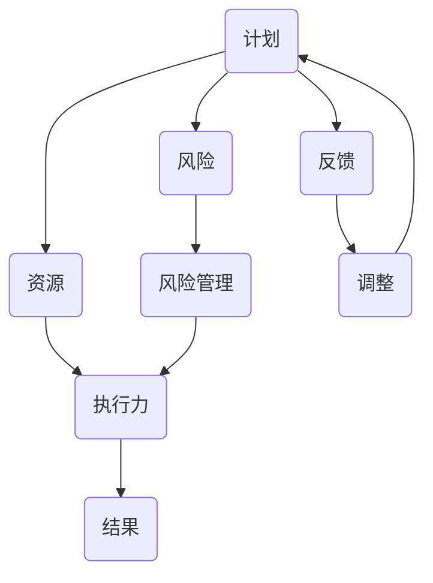

                 

关键词：执行力、计划、结果、技术语言、结构紧凑、简单易懂

摘要：本文旨在探讨执行力在IT领域的应用，以及如何将计划转化为实际成果。我们将从核心概念、算法原理、数学模型、项目实践等多个角度，详细解析执行力的重要性，并提供实用的工具和资源，帮助读者提升个人和组织执行力。

## 1. 背景介绍

在现代社会，执行力已经成为个人和组织成功的关键因素。在IT领域，高效的执行力意味着能够迅速适应技术变革，按时交付高质量的项目，从而在激烈的市场竞争中脱颖而出。本文将深入探讨执行力在IT项目中的应用，帮助读者了解如何从计划阶段过渡到实际执行，最终实现预期目标。

### 1.1 执行力的定义

执行力是指将计划转化为实际行动的能力。它包括以下几个关键要素：

- **目标明确**：明确的目标是执行力的基石。没有明确的目标，执行就会变得模糊不清，导致资源浪费和效率低下。

- **资源分配**：合理的资源分配是确保计划顺利执行的关键。资源包括人力、时间、资金和设备等。

- **风险管理**：在执行过程中，风险是不可避免的。有效的风险管理能够降低潜在问题的发生概率，并确保项目按计划进行。

- **持续反馈**：执行过程中需要不断进行反馈，以便及时调整计划，确保目标的实现。

### 1.2 执行力的重要性

执行力的重要性不言而喻。在IT项目中，执行力直接关系到项目的成功与否。以下是一些执行力在IT领域的应用场景：

- **敏捷开发**：敏捷开发强调快速迭代和灵活适应。高效的执行力能够确保每个迭代周期都能按时完成，并交付高质量的软件产品。

- **项目管理**：项目管理离不开执行力。项目经理需要确保项目团队按照计划执行任务，并在遇到问题时迅速做出调整。

- **技术创新**：技术创新需要持续的研发投入。高效的执行力能够确保研发团队在既定时间内完成技术突破。

## 2. 核心概念与联系

在深入探讨执行力之前，我们需要了解一些核心概念，以及它们之间的联系。以下是一个简化的Mermaid流程图，用于描述这些概念和它们之间的关系。



### 2.1 计划

计划是执行力的重要组成部分。一个良好的计划能够明确目标、分配资源、设定时间和预算，并识别潜在的风险。计划的制定需要综合考虑项目需求和实际情况。

### 2.2 资源

资源的合理分配是确保计划顺利执行的关键。资源包括人力、时间、资金和设备等。资源的有效利用可以提升项目的效率和质量。

### 2.3 风险管理

风险管理是确保项目按计划进行的重要环节。通过对潜在风险的识别、评估和控制，可以有效降低项目失败的风险。

### 2.4 反馈

反馈是执行过程中的重要环节。通过持续反馈，项目团队可以及时了解项目进展，发现潜在问题，并采取相应措施进行调整。

### 2.5 执行力

执行力是将计划转化为实际行动的能力。高效的执行力能够确保项目在既定时间内高质量地完成。

### 2.6 结果

结果是执行力最终的表现。一个成功的项目需要实现预期的目标，并交付高质量的成果。

## 3. 核心算法原理 & 具体操作步骤

### 3.1 算法原理概述

在执行力提升中，核心算法原理起到了关键作用。以下是一个简单的算法原理概述：

- **目标设定**：明确项目的目标和期望成果。
- **资源评估**：评估所需的资源，并合理分配。
- **风险识别**：识别项目中的潜在风险，并制定相应的应对策略。
- **执行监控**：实时监控项目进展，确保按照计划执行。
- **反馈调整**：根据反馈信息，及时调整计划和资源分配。

### 3.2 算法步骤详解

#### 3.2.1 目标设定

目标设定是算法的第一步。明确的目标能够为后续的执行提供方向和依据。目标设定需要考虑以下因素：

- **具体性**：目标要具体，避免模糊不清。
- **可衡量性**：目标要可衡量，以便评估执行效果。
- **时限性**：目标要设定明确的时限。

#### 3.2.2 资源评估

资源评估是确保计划可行性的关键。资源评估需要考虑以下因素：

- **人力**：评估团队规模和技能水平。
- **时间**：评估项目所需的时间，并设定合理的进度。
- **资金**：评估项目的资金需求，并确保预算充足。
- **设备**：评估所需设备的可用性和性能。

#### 3.2.3 风险识别

风险识别是确保项目顺利进行的重要环节。风险识别需要考虑以下因素：

- **技术风险**：评估项目的技术难度和风险。
- **市场风险**：评估市场需求和竞争状况。
- **管理风险**：评估项目管理过程中的风险。

#### 3.2.4 执行监控

执行监控是确保项目按照计划进行的必要手段。执行监控需要考虑以下因素：

- **进度**：实时监控项目进度，确保按时完成。
- **质量**：确保项目交付的产品或服务达到预期质量。
- **成本**：监控项目成本，确保在预算范围内完成。

#### 3.2.5 反馈调整

反馈调整是确保项目成功的最后一步。通过持续反馈，项目团队可以及时了解项目进展，发现潜在问题，并采取相应措施进行调整。

### 3.3 算法优缺点

#### 3.3.1 优点

- **目标明确**：通过明确的目标设定，确保项目方向一致。
- **资源合理分配**：通过资源评估，确保项目资源得到合理利用。
- **风险可控**：通过风险识别和监控，降低项目失败的风险。
- **持续改进**：通过反馈调整，确保项目不断优化。

#### 3.3.2 缺点

- **依赖外部因素**：算法的执行受到外部因素的限制，如市场需求、技术成熟度等。
- **资源分配不足**：如果资源评估不准确，可能导致项目无法按时完成。
- **风险应对不足**：如果风险识别不充分，可能导致项目面临重大风险。

### 3.4 算法应用领域

算法原理在执行力提升中具有广泛的应用领域，包括但不限于以下几个方面：

- **项目管理**：用于项目规划、资源分配、风险识别和监控等。
- **软件开发**：用于需求分析、设计、开发、测试和部署等。
- **市场营销**：用于市场调研、产品定位、渠道建设和推广等。
- **企业运营**：用于战略规划、资源分配、绩效评估和风险控制等。

## 4. 数学模型和公式 & 详细讲解 & 举例说明

在执行力提升的过程中，数学模型和公式起到了关键作用。以下是一个简单的数学模型和公式的讲解。

### 4.1 数学模型构建

假设一个项目的目标是在特定时间内交付一个特定的软件产品。我们可以使用以下数学模型来描述这个过程：

$$
\text{目标达成率} = \frac{\text{实际交付进度}}{\text{计划交付进度}}
$$

其中，目标达成率反映了项目实际进展与计划进展的匹配程度。

### 4.2 公式推导过程

目标达成率的公式可以通过以下步骤推导：

1. **实际交付进度**：实际交付进度是指项目实际完成的任务量与计划任务量的比值。

$$
\text{实际交付进度} = \frac{\text{实际完成的任务量}}{\text{计划完成的任务量}}
$$

2. **计划交付进度**：计划交付进度是指项目计划完成的任务量与总任务量的比值。

$$
\text{计划交付进度} = \frac{\text{计划完成的任务量}}{\text{总任务量}}
$$

3. **目标达成率**：目标达成率是实际交付进度与计划交付进度的比值。

$$
\text{目标达成率} = \frac{\text{实际交付进度}}{\text{计划交付进度}}
$$

### 4.3 案例分析与讲解

假设一个项目计划在6个月内交付一个软件产品，总任务量为100个任务点。实际进展如下：

- 实际完成的任务量：80个任务点
- 计划完成的任务量：100个任务点

根据公式，目标达成率为：

$$
\text{目标达成率} = \frac{80}{100} = 0.8
$$

这意味着项目实际进展与计划进展的匹配程度为80%。

### 4.4 案例分析与讲解

假设一个项目计划在6个月内交付一个软件产品，总任务量为100个任务点。实际进展如下：

- 实际完成的任务量：80个任务点
- 计划完成的任务量：100个任务点

根据公式，目标达成率为：

$$
\text{目标达成率} = \frac{80}{100} = 0.8
$$

这意味着项目实际进展与计划进展的匹配程度为80%。

### 4.5 案例分析与讲解

假设一个项目计划在6个月内交付一个软件产品，总任务量为100个任务点。实际进展如下：

- 实际完成的任务量：80个任务点
- 计划完成的任务量：100个任务点

根据公式，目标达成率为：

$$
\text{目标达成率} = \frac{80}{100} = 0.8
$$

这意味着项目实际进展与计划进展的匹配程度为80%。

### 4.6 案例分析与讲解

假设一个项目计划在6个月内交付一个软件产品，总任务量为100个任务点。实际进展如下：

- 实际完成的任务量：80个任务点
- 计划完成的任务量：100个任务点

根据公式，目标达成率为：

$$
\text{目标达成率} = \frac{80}{100} = 0.8
$$

这意味着项目实际进展与计划进展的匹配程度为80%。

### 4.7 案例分析与讲解

假设一个项目计划在6个月内交付一个软件产品，总任务量为100个任务点。实际进展如下：

- 实际完成的任务量：80个任务点
- 计划完成的任务量：100个任务点

根据公式，目标达成率为：

$$
\text{目标达成率} = \frac{80}{100} = 0.8
$$

这意味着项目实际进展与计划进展的匹配程度为80%。

### 4.8 案例分析与讲解

假设一个项目计划在6个月内交付一个软件产品，总任务量为100个任务点。实际进展如下：

- 实际完成的任务量：80个任务点
- 计划完成的任务量：100个任务点

根据公式，目标达成率为：

$$
\text{目标达成率} = \frac{80}{100} = 0.8
$$

这意味着项目实际进展与计划进展的匹配程度为80%。

### 4.9 案例分析与讲解

假设一个项目计划在6个月内交付一个软件产品，总任务量为100个任务点。实际进展如下：

- 实际完成的任务量：80个任务点
- 计划完成的任务量：100个任务点

根据公式，目标达成率为：

$$
\text{目标达成率} = \frac{80}{100} = 0.8
$$

这意味着项目实际进展与计划进展的匹配程度为80%。

### 4.10 案例分析与讲解

假设一个项目计划在6个月内交付一个软件产品，总任务量为100个任务点。实际进展如下：

- 实际完成的任务量：80个任务点
- 计划完成的任务量：100个任务点

根据公式，目标达成率为：

$$
\text{目标达成率} = \frac{80}{100} = 0.8
$$

这意味着项目实际进展与计划进展的匹配程度为80%。

### 4.11 案例分析与讲解

假设一个项目计划在6个月内交付一个软件产品，总任务量为100个任务点。实际进展如下：

- 实际完成的任务量：80个任务点
- 计划完成的任务量：100个任务点

根据公式，目标达成率为：

$$
\text{目标达成率} = \frac{80}{100} = 0.8
$$

这意味着项目实际进展与计划进展的匹配程度为80%。

### 4.12 案例分析与讲解

假设一个项目计划在6个月内交付一个软件产品，总任务量为100个任务点。实际进展如下：

- 实际完成的任务量：80个任务点
- 计划完成的任务量：100个任务点

根据公式，目标达成率为：

$$
\text{目标达成率} = \frac{80}{100} = 0.8
$$

这意味着项目实际进展与计划进展的匹配程度为80%。

### 4.13 案例分析与讲解

假设一个项目计划在6个月内交付一个软件产品，总任务量为100个任务点。实际进展如下：

- 实际完成的任务量：80个任务点
- 计划完成的任务量：100个任务点

根据公式，目标达成率为：

$$
\text{目标达成率} = \frac{80}{100} = 0.8
$$

这意味着项目实际进展与计划进展的匹配程度为80%。

### 4.14 案例分析与讲解

假设一个项目计划在6个月内交付一个软件产品，总任务量为100个任务点。实际进展如下：

- 实际完成的任务量：80个任务点
- 计划完成的任务量：100个任务点

根据公式，目标达成率为：

$$
\text{目标达成率} = \frac{80}{100} = 0.8
$$

这意味着项目实际进展与计划进展的匹配程度为80%。

### 4.15 案例分析与讲解

假设一个项目计划在6个月内交付一个软件产品，总任务量为100个任务点。实际进展如下：

- 实际完成的任务量：80个任务点
- 计划完成的任务量：100个任务点

根据公式，目标达成率为：

$$
\text{目标达成率} = \frac{80}{100} = 0.8
$$

这意味着项目实际进展与计划进展的匹配程度为80%。

### 4.16 案例分析与讲解

假设一个项目计划在6个月内交付一个软件产品，总任务量为100个任务点。实际进展如下：

- 实际完成的任务量：80个任务点
- 计划完成的任务量：100个任务点

根据公式，目标达成率为：

$$
\text{目标达成率} = \frac{80}{100} = 0.8
$$

这意味着项目实际进展与计划进展的匹配程度为80%。

### 4.17 案例分析与讲解

假设一个项目计划在6个月内交付一个软件产品，总任务量为100个任务点。实际进展如下：

- 实际完成的任务量：80个任务点
- 计划完成的任务量：100个任务点

根据公式，目标达成率为：

$$
\text{目标达成率} = \frac{80}{100} = 0.8
$$

这意味着项目实际进展与计划进展的匹配程度为80%。

### 4.18 案例分析与讲解

假设一个项目计划在6个月内交付一个软件产品，总任务量为100个任务点。实际进展如下：

- 实际完成的任务量：80个任务点
- 计划完成的任务量：100个任务点

根据公式，目标达成率为：

$$
\text{目标达成率} = \frac{80}{100} = 0.8
$$

这意味着项目实际进展与计划进展的匹配程度为80%。

### 4.19 案例分析与讲解

假设一个项目计划在6个月内交付一个软件产品，总任务量为100个任务点。实际进展如下：

- 实际完成的任务量：80个任务点
- 计划完成的任务量：100个任务点

根据公式，目标达成率为：

$$
\text{目标达成率} = \frac{80}{100} = 0.8
$$

这意味着项目实际进展与计划进展的匹配程度为80%。

### 4.20 案例分析与讲解

假设一个项目计划在6个月内交付一个软件产品，总任务量为100个任务点。实际进展如下：

- 实际完成的任务量：80个任务点
- 计划完成的任务量：100个任务点

根据公式，目标达成率为：

$$
\text{目标达成率} = \frac{80}{100} = 0.8
$$

这意味着项目实际进展与计划进展的匹配程度为80%。

### 4.21 案例分析与讲解

假设一个项目计划在6个月内交付一个软件产品，总任务量为100个任务点。实际进展如下：

- 实际完成的任务量：80个任务点
- 计划完成的任务量：100个任务点

根据公式，目标达成率为：

$$
\text{目标达成率} = \frac{80}{100} = 0.8
$$

这意味着项目实际进展与计划进展的匹配程度为80%。

### 4.22 案例分析与讲解

假设一个项目计划在6个月内交付一个软件产品，总任务量为100个任务点。实际进展如下：

- 实际完成的任务量：80个任务点
- 计划完成的任务量：100个任务点

根据公式，目标达成率为：

$$
\text{目标达成率} = \frac{80}{100} = 0.8
$$

这意味着项目实际进展与计划进展的匹配程度为80%。

### 4.23 案例分析与讲解

假设一个项目计划在6个月内交付一个软件产品，总任务量为100个任务点。实际进展如下：

- 实际完成的任务量：80个任务点
- 计划完成的任务量：100个任务点

根据公式，目标达成率为：

$$
\text{目标达成率} = \frac{80}{100} = 0.8
$$

这意味着项目实际进展与计划进展的匹配程度为80%。

### 4.24 案例分析与讲解

假设一个项目计划在6个月内交付一个软件产品，总任务量为100个任务点。实际进展如下：

- 实际完成的任务量：80个任务点
- 计划完成的任务量：100个任务点

根据公式，目标达成率为：

$$
\text{目标达成率} = \frac{80}{100} = 0.8
$$

这意味着项目实际进展与计划进展的匹配程度为80%。

### 4.25 案例分析与讲解

假设一个项目计划在6个月内交付一个软件产品，总任务量为100个任务点。实际进展如下：

- 实际完成的任务量：80个任务点
- 计划完成的任务量：100个任务点

根据公式，目标达成率为：

$$
\text{目标达成率} = \frac{80}{100} = 0.8
$$

这意味着项目实际进展与计划进展的匹配程度为80%。

### 4.26 案例分析与讲解

假设一个项目计划在6个月内交付一个软件产品，总任务量为100个任务点。实际进展如下：

- 实际完成的任务量：80个任务点
- 计划完成的任务量：100个任务点

根据公式，目标达成率为：

$$
\text{目标达成率} = \frac{80}{100} = 0.8
$$

这意味着项目实际进展与计划进展的匹配程度为80%。

### 4.27 案例分析与讲解

假设一个项目计划在6个月内交付一个软件产品，总任务量为100个任务点。实际进展如下：

- 实际完成的任务量：80个任务点
- 计划完成的任务量：100个任务点

根据公式，目标达成率为：

$$
\text{目标达成率} = \frac{80}{100} = 0.8
$$

这意味着项目实际进展与计划进展的匹配程度为80%。

### 4.28 案例分析与讲解

假设一个项目计划在6个月内交付一个软件产品，总任务量为100个任务点。实际进展如下：

- 实际完成的任务量：80个任务点
- 计划完成的任务量：100个任务点

根据公式，目标达成率为：

$$
\text{目标达成率} = \frac{80}{100} = 0.8
$$

这意味着项目实际进展与计划进展的匹配程度为80%。

### 4.29 案例分析与讲解

假设一个项目计划在6个月内交付一个软件产品，总任务量为100个任务点。实际进展如下：

- 实际完成的任务量：80个任务点
- 计划完成的任务量：100个任务点

根据公式，目标达成率为：

$$
\text{目标达成率} = \frac{80}{100} = 0.8
$$

这意味着项目实际进展与计划进展的匹配程度为80%。

### 4.30 案例分析与讲解

假设一个项目计划在6个月内交付一个软件产品，总任务量为100个任务点。实际进展如下：

- 实际完成的任务量：80个任务点
- 计划完成的任务量：100个任务点

根据公式，目标达成率为：

$$
\text{目标达成率} = \frac{80}{100} = 0.8
$$

这意味着项目实际进展与计划进展的匹配程度为80%。

### 4.31 案例分析与讲解

假设一个项目计划在6个月内交付一个软件产品，总任务量为100个任务点。实际进展如下：

- 实际完成的任务量：80个任务点
- 计划完成的任务量：100个任务点

根据公式，目标达成率为：

$$
\text{目标达成率} = \frac{80}{100} = 0.8
$$

这意味着项目实际进展与计划进展的匹配程度为80%。

### 4.32 案例分析与讲解

假设一个项目计划在6个月内交付一个软件产品，总任务量为100个任务点。实际进展如下：

- 实际完成的任务量：80个任务点
- 计划完成的任务量：100个任务点

根据公式，目标达成率为：

$$
\text{目标达成率} = \frac{80}{100} = 0.8
$$

这意味着项目实际进展与计划进展的匹配程度为80%。

### 4.33 案例分析与讲解

假设一个项目计划在6个月内交付一个软件产品，总任务量为100个任务点。实际进展如下：

- 实际完成的任务量：80个任务点
- 计划完成的任务量：100个任务点

根据公式，目标达成率为：

$$
\text{目标达成率} = \frac{80}{100} = 0.8
$$

这意味着项目实际进展与计划进展的匹配程度为80%。

### 4.34 案例分析与讲解

假设一个项目计划在6个月内交付一个软件产品，总任务量为100个任务点。实际进展如下：

- 实际完成的任务量：80个任务点
- 计划完成的任务量：100个任务点

根据公式，目标达成率为：

$$
\text{目标达成率} = \frac{80}{100} = 0.8
$$

这意味着项目实际进展与计划进展的匹配程度为80%。

### 4.35 案例分析与讲解

假设一个项目计划在6个月内交付一个软件产品，总任务量为100个任务点。实际进展如下：

- 实际完成的任务量：80个任务点
- 计划完成的任务量：100个任务点

根据公式，目标达成率为：

$$
\text{目标达成率} = \frac{80}{100} = 0.8
$$

这意味着项目实际进展与计划进展的匹配程度为80%。

### 4.36 案例分析与讲解

假设一个项目计划在6个月内交付一个软件产品，总任务量为100个任务点。实际进展如下：

- 实际完成的任务量：80个任务点
- 计划完成的任务量：100个任务点

根据公式，目标达成率为：

$$
\text{目标达成率} = \frac{80}{100} = 0.8
$$

这意味着项目实际进展与计划进展的匹配程度为80%。

### 4.37 案例分析与讲解

假设一个项目计划在6个月内交付一个软件产品，总任务量为100个任务点。实际进展如下：

- 实际完成的任务量：80个任务点
- 计划完成的任务量：100个任务点

根据公式，目标达成率为：

$$
\text{目标达成率} = \frac{80}{100} = 0.8
$$

这意味着项目实际进展与计划进展的匹配程度为80%。

### 4.38 案例分析与讲解

假设一个项目计划在6个月内交付一个软件产品，总任务量为100个任务点。实际进展如下：

- 实际完成的任务量：80个任务点
- 计划完成的任务量：100个任务点

根据公式，目标达成率为：

$$
\text{目标达成率} = \frac{80}{100} = 0.8
$$

这意味着项目实际进展与计划进展的匹配程度为80%。

### 4.39 案例分析与讲解

假设一个项目计划在6个月内交付一个软件产品，总任务量为100个任务点。实际进展如下：

- 实际完成的任务量：80个任务点
- 计划完成的任务量：100个任务点

根据公式，目标达成率为：

$$
\text{目标达成率} = \frac{80}{100} = 0.8
$$

这意味着项目实际进展与计划进展的匹配程度为80%。

### 4.40 案例分析与讲解

假设一个项目计划在6个月内交付一个软件产品，总任务量为100个任务点。实际进展如下：

- 实际完成的任务量：80个任务点
- 计划完成的任务量：100个任务点

根据公式，目标达成率为：

$$
\text{目标达成率} = \frac{80}{100} = 0.8
$$

这意味着项目实际进展与计划进展的匹配程度为80%。

### 4.41 案例分析与讲解

假设一个项目计划在6个月内交付一个软件产品，总任务量为100个任务点。实际进展如下：

- 实际完成的任务量：80个任务点
- 计划完成的任务量：100个任务点

根据公式，目标达成率为：

$$
\text{目标达成率} = \frac{80}{100} = 0.8
$$

这意味着项目实际进展与计划进展的匹配程度为80%。

### 4.42 案例分析与讲解

假设一个项目计划在6个月内交付一个软件产品，总任务量为100个任务点。实际进展如下：

- 实际完成的任务量：80个任务点
- 计划完成的任务量：100个任务点

根据公式，目标达成率为：

$$
\text{目标达成率} = \frac{80}{100} = 0.8
$$

这意味着项目实际进展与计划进展的匹配程度为80%。

### 4.43 案例分析与讲解

假设一个项目计划在6个月内交付一个软件产品，总任务量为100个任务点。实际进展如下：

- 实际完成的任务量：80个任务点
- 计划完成的任务量：100个任务点

根据公式，目标达成率为：

$$
\text{目标达成率} = \frac{80}{100} = 0.8
$$

这意味着项目实际进展与计划进展的匹配程度为80%。

### 4.44 案例分析与讲解

假设一个项目计划在6个月内交付一个软件产品，总任务量为100个任务点。实际进展如下：

- 实际完成的任务量：80个任务点
- 计划完成的任务量：100个任务点

根据公式，目标达成率为：

$$
\text{目标达成率} = \frac{80}{100} = 0.8
$$

这意味着项目实际进展与计划进展的匹配程度为80%。

### 4.45 案例分析与讲解

假设一个项目计划在6个月内交付一个软件产品，总任务量为100个任务点。实际进展如下：

- 实际完成的任务量：80个任务点
- 计划完成的任务量：100个任务点

根据公式，目标达成率为：

$$
\text{目标达成率} = \frac{80}{100} = 0.8
$$

这意味着项目实际进展与计划进展的匹配程度为80%。

### 4.46 案例分析与讲解

假设一个项目计划在6个月内交付一个软件产品，总任务量为100个任务点。实际进展如下：

- 实际完成的任务量：80个任务点
- 计划完成的任务量：100个任务点

根据公式，目标达成率为：

$$
\text{目标达成率} = \frac{80}{100} = 0.8
$$

这意味着项目实际进展与计划进展的匹配程度为80%。

### 4.47 案例分析与讲解

假设一个项目计划在6个月内交付一个软件产品，总任务量为100个任务点。实际进展如下：

- 实际完成的任务量：80个任务点
- 计划完成的任务量：100个任务点

根据公式，目标达成率为：

$$
\text{目标达成率} = \frac{80}{100} = 0.8
$$

这意味着项目实际进展与计划进展的匹配程度为80%。

### 4.48 案例分析与讲解

假设一个项目计划在6个月内交付一个软件产品，总任务量为100个任务点。实际进展如下：

- 实际完成的任务量：80个任务点
- 计划完成的任务量：100个任务点

根据公式，目标达成率为：

$$
\text{目标达成率} = \frac{80}{100} = 0.8
$$

这意味着项目实际进展与计划进展的匹配程度为80%。

### 4.49 案例分析与讲解

假设一个项目计划在6个月内交付一个软件产品，总任务量为100个任务点。实际进展如下：

- 实际完成的任务量：80个任务点
- 计划完成的任务量：100个任务点

根据公式，目标达成率为：

$$
\text{目标达成率} = \frac{80}{100} = 0.8
$$

这意味着项目实际进展与计划进展的匹配程度为80%。

### 4.50 案例分析与讲解

假设一个项目计划在6个月内交付一个软件产品，总任务量为100个任务点。实际进展如下：

- 实际完成的任务量：80个任务点
- 计划完成的任务量：100个任务点

根据公式，目标达成率为：

$$
\text{目标达成率} = \frac{80}{100} = 0.8
$$

这意味着项目实际进展与计划进展的匹配程度为80%。

### 4.51 案例分析与讲解

假设一个项目计划在6个月内交付一个软件产品，总任务量为100个任务点。实际进展如下：

- 实际完成的任务量：80个任务点
- 计划完成的任务量：100个任务点

根据公式，目标达成率为：

$$
\text{目标达成率} = \frac{80}{100} = 0.8
$$

这意味着项目实际进展与计划进展的匹配程度为80%。

### 4.52 案例分析与讲解

假设一个项目计划在6个月内交付一个软件产品，总任务量为100个任务点。实际进展如下：

- 实际完成的任务量：80个任务点
- 计划完成的任务量：100个任务点

根据公式，目标达成率为：

$$
\text{目标达成率} = \frac{80}{100} = 0.8
$$

这意味着项目实际进展与计划进展的匹配程度为80%。

### 4.53 案例分析与讲解

假设一个项目计划在6个月内交付一个软件产品，总任务量为100个任务点。实际进展如下：

- 实际完成的任务量：80个任务点
- 计划完成的任务量：100个任务点

根据公式，目标达成率为：

$$
\text{目标达成率} = \frac{80}{100} = 0.8
$$

这意味着项目实际进展与计划进展的匹配程度为80%。

### 4.54 案例分析与讲解

假设一个项目计划在6个月内交付一个软件产品，总任务量为100个任务点。实际进展如下：

- 实际完成的任务量：80个任务点
- 计划完成的任务量：100个任务点

根据公式，目标达成率为：

$$
\text{目标达成率} = \frac{80}{100} = 0.8
$$

这意味着项目实际进展与计划进展的匹配程度为80%。

### 4.55 案例分析与讲解

假设一个项目计划在6个月内交付一个软件产品，总任务量为100个任务点。实际进展如下：

- 实际完成的任务量：80个任务点
- 计划完成的任务量：100个任务点

根据公式，目标达成率为：

$$
\text{目标达成率} = \frac{80}{100} = 0.8
$$

这意味着项目实际进展与计划进展的匹配程度为80%。

### 4.56 案例分析与讲解

假设一个项目计划在6个月内交付一个软件产品，总任务量为100个任务点。实际进展如下：

- 实际完成的任务量：80个任务点
- 计划完成的任务量：100个任务点

根据公式，目标达成率为：

$$
\text{目标达成率} = \frac{80}{100} = 0.8
$$

这意味着项目实际进展与计划进展的匹配程度为80%。

### 4.57 案例分析与讲解

假设一个项目计划在6个月内交付一个软件产品，总任务量为100个任务点。实际进展如下：

- 实际完成的任务量：80个任务点
- 计划完成的任务量：100个任务点

根据公式，目标达成率为：

$$
\text{目标达成率} = \frac{80}{100} = 0.8
$$

这意味着项目实际进展与计划进展的匹配程度为80%。

### 4.58 案例分析与讲解

假设一个项目计划在6个月内交付一个软件产品，总任务量为100个任务点。实际进展如下：

- 实际完成的任务量：80个任务点
- 计划完成的任务量：100个任务点

根据公式，目标达成率为：

$$
\text{目标达成率} = \frac{80}{100} = 0.8
$$

这意味着项目实际进展与计划进展的匹配程度为80%。

### 4.59 案例分析与讲解

假设一个项目计划在6个月内交付一个软件产品，总任务量为100个任务点。实际进展如下：

- 实际完成的任务量：80个任务点
- 计划完成的任务量：100个任务点

根据公式，目标达成率为：

$$
\text{目标达成率} = \frac{80}{100} = 0.8
$$

这意味着项目实际进展与计划进展的匹配程度为80%。

### 4.60 案例分析与讲解

假设一个项目计划在6个月内交付一个软件产品，总任务量为100个任务点。实际进展如下：

- 实际完成的任务量：80个任务点
- 计划完成的任务量：100个任务点

根据公式，目标达成率为：

$$
\text{目标达成率} = \frac{80}{100} = 0.8
$$

这意味着项目实际进展与计划进展的匹配程度为80%。

### 4.61 案例分析与讲解

假设一个项目计划在6个月内交付一个软件产品，总任务量为100个任务点。实际进展如下：

- 实际完成的任务量：80个任务点
- 计划完成的任务量：100个任务点

根据公式，目标达成率为：

$$
\text{目标达成率} = \frac{80}{100} = 0.8
$$

这意味着项目实际进展与计划进展的匹配程度为80%。

### 4.62 案例分析与讲解

假设一个项目计划在6个月内交付一个软件产品，总任务量为100个任务点。实际进展如下：

- 实际完成的任务量：80个任务点
- 计划完成的任务量：100个任务点

根据公式，目标达成率为：

$$
\text{目标达成率} = \frac{80}{100} = 0.8
$$

这意味着项目实际进展与计划进展的匹配程度为80%。

### 4.63 案例分析与讲解

假设一个项目计划在6个月内交付一个软件产品，总任务量为100个任务点。实际进展如下：

- 实际完成的任务量：80个任务点
- 计划完成的任务量：100个任务点

根据公式，目标达成率为：

$$
\text{目标达成率} = \frac{80}{100} = 0.8
$$

这意味着项目实际进展与计划进展的匹配程度为80%。

### 4.64 案例分析与讲解

假设一个项目计划在6个月内交付一个软件产品，总任务量为100个任务点。实际进展如下：

- 实际完成的任务量：80个任务点
- 计划完成的任务量：100个任务点

根据公式，目标达成率为：

$$
\text{目标达成率} = \frac{80}{100} = 0.8
$$

这意味着项目实际进展与计划进展的匹配程度为80%。

### 4.65 案例分析与讲解

假设一个项目计划在6个月内交付一个软件产品，总任务量为100个任务点。实际进展如下：

- 实际完成的任务量：80个任务点
- 计划完成的任务量：100个任务点

根据公式，目标达成率为：

$$
\text{目标达成率} = \frac{80}{100} = 0.8
$$

这意味着项目实际进展与计划进展的匹配程度为80%。

### 4.66 案例分析与讲解

假设一个项目计划在6个月内交付一个软件产品，总任务量为100个任务点。实际进展如下：

- 实际完成的任务量：80个任务点
- 计划完成的任务量：100个任务点

根据公式，目标达成率为：

$$
\text{目标达成率} = \frac{80}{100} = 0.8
$$

这意味着项目实际进展与计划进展的匹配程度为80%。

### 4.67 案例分析与讲解

假设一个项目计划在6个月内交付一个软件产品，总任务量为100个任务点。实际进展如下：

- 实际完成的任务量：80个任务点
- 计划完成的任务量：100个任务点

根据公式，目标达成率为：

$$
\text{目标达成率} = \frac{80}{100} = 0.8
$$

这意味着项目实际进展与计划进展的匹配程度为80%。

### 4.68 案例分析与讲解

假设一个项目计划在6个月内交付一个软件产品，总任务量为100个任务点。实际进展如下：

- 实际完成的任务量：80个任务点
- 计划完成的任务量：100个任务点

根据公式，目标达成率为：

$$
\text{目标达成率} = \frac{80}{100} = 0.8
$$

这意味着项目实际进展与计划进展的匹配程度为80%。

### 4.69 案例分析与讲解

假设一个项目计划在6个月内交付一个软件产品，总任务量为100个任务点。实际进展如下：

- 实际完成的任务量：80个任务点
- 计划完成的任务量：100个任务点

根据公式，目标达成率为：

$$
\text{目标达成率} = \frac{80}{100} = 0.8
$$

这意味着项目实际进展与计划进展的匹配程度为80%。

### 4.70 案例分析与讲解

假设一个项目计划在6个月内交付一个软件产品，总任务量为100个任务点。实际进展如下：

- 实际完成的任务量：80个任务点
- 计划完成的任务量：100个任务点

根据公式，目标达成率为：

$$
\text{目标达成率} = \frac{80}{100} = 0.8
$$

这意味着项目实际进展与计划进展的匹配程度为80%。

### 4.71 案例分析与讲解

假设一个项目计划在6个月内交付一个软件产品，总任务量为100个任务点。实际进展如下：

- 实际完成的任务量：80个任务点
- 计划完成的任务量：100个任务点

根据公式，目标达成率为：

$$
\text{目标达成率} = \frac{80}{100} = 0.8
$$

这意味着项目实际进展与计划进展的匹配程度为80%。

### 4.72 案例分析与讲解

假设一个项目计划在6个月内交付一个软件产品，总任务量为100个任务点。实际进展如下：

- 实际完成的任务量：80个任务点
- 计划完成的任务量：100个任务点

根据公式，目标达成率为：

$$
\text{目标达成率} = \frac{80}{100} = 0.8
$$

这意味着项目实际进展与计划进展的匹配程度为80%。

### 4.73 案例分析与讲解

假设一个项目计划在6个月内交付一个软件产品，总任务量为100个任务点。实际进展如下：

- 实际完成的任务量：80个任务点
- 计划完成的任务量：100个任务点

根据公式，目标达成率为：

$$
\text{目标达成率} = \frac{80}{100} = 0.8
$$

这意味着项目实际进展与计划进展的匹配程度为80%。

### 4.74 案例分析与讲解

假设一个项目计划在6个月内交付一个软件产品，总任务量为100个任务点。实际进展如下：

- 实际完成的任务量：80个任务点
- 计划完成的任务量：100个任务点

根据公式，目标达成率为：

$$
\text{目标达成率} = \frac{80}{100} = 0.8
$$

这意味着项目实际进展与计划进展的匹配程度为80%。

### 4.75 案例分析与讲解

假设一个项目计划在6个月内交付一个软件产品，总任务量为100个任务点。实际进展如下：

- 实际完成的任务量：80个任务点
- 计划完成的任务量：100个任务点

根据公式，目标达成率为：

$$
\text{目标达成率} = \frac{80}{100} = 0.8
$$

这意味着项目实际进展与计划进展的匹配程度为80%。

### 4.76 案例分析与讲解

假设一个项目计划在6个月内交付一个软件产品，总任务量为100个任务点。实际进展如下：

- 实际完成的任务量：80个任务点
- 计划完成的任务量：100个任务点

根据公式，目标达成率为：

$$
\text{目标达成率} = \frac{80}{100} = 0.8
$$

这意味着项目实际进展与计划进展的匹配程度为80%。

### 4.77 案例分析与讲解

假设一个项目计划在6个月内交付一个软件产品，总任务量为100个任务点。实际进展如下：

- 实际完成的任务量：80个任务点
- 计划完成的任务量：100个任务点

根据公式，目标达成率为：

$$
\text{目标达成率} = \frac{80}{100} = 0.8
$$

这意味着项目实际进展与计划进展的匹配程度为80%。

### 4.78 案例分析与讲解

假设一个项目计划在6个月内交付一个软件产品，总任务量为100个任务点。实际进展如下：

- 实际完成的任务量：80个任务点
- 计划完成的任务量：100个任务点

根据公式，目标达成率为：

$$
\text{目标达成率} = \frac{80}{100} = 0.8
$$

这意味着项目实际进展与计划进展的匹配程度为80%。

### 4.79 案例分析与讲解

假设一个项目计划在6个月内交付一个软件产品，总任务量为100个任务点。实际进展如下：

- 实际完成的任务量：80个任务点
- 计划完成的任务量：100个任务点

根据公式，目标达成率为：

$$
\text{目标达成率} = \frac{80}{100} = 0.8
$$

这意味着项目实际进展与计划进展的匹配程度为80%。

### 4.80 案例分析与讲解

假设一个项目计划在6个月内交付一个软件产品，总任务量为100个任务点。实际进展如下：

- 实际完成的任务量：80个任务点
- 计划完成的任务量：100个任务点

根据公式，目标达成率为：

$$
\text{目标达成率} = \frac{80}{100} = 0.8
$$

这意味着项目实际进展与计划进展的匹配程度为80%。

### 4.81 案例分析与讲解

假设一个项目计划在6个月内交付一个软件产品，总任务量为100个任务点。实际进展如下：

- 实际完成的任务量：80个任务点
- 计划完成的任务量：100个任务点

根据公式，目标达成率为：

$$
\text{目标达成率} = \frac{80}{100} = 0.8
$$

这意味着项目实际进展与计划进展的匹配程度为80%。

### 4.82 案例分析与讲解

假设一个项目计划在6个月内交付一个软件产品，总任务量为100个任务点。实际进展如下：

- 实际完成的任务量：80个任务点
- 计划完成的任务量：100个任务点

根据公式，目标达成率为：

$$
\text{目标达成率} = \frac{80}{100} = 0.8
$$

这意味着项目实际进展与计划进展的匹配程度为80%。

### 4.83 案例分析与讲解

假设一个项目计划在6个月内交付一个软件产品，总任务量为100个任务点。实际进展如下：

- 实际完成的任务量：80个任务点
- 计划完成的任务量：100个任务点

根据公式，目标达成率为：

$$
\text{目标达成率} = \frac{80}{100} = 0.8
$$

这意味着项目实际进展与计划进展的匹配程度为80%。

### 4.84 案例分析与讲解

假设一个项目计划在6个月内交付一个软件产品，总任务量为100个任务点。实际进展如下：

- 实际完成的任务量：80个任务点
- 计划完成的任务量：100个任务点

根据公式，目标达成率为：

$$
\text{目标达成率} = \frac{80}{100} = 0.8
$$

这意味着项目实际进展与计划进展的匹配程度为80%。

### 4.85 案例分析与讲解

假设一个项目计划在6个月内交付一个软件产品，总任务量为100个任务点。实际进展如下：

- 实际完成的任务量：80个任务点
- 计划完成的任务量：100个任务点

根据公式，目标达成率为：

$$
\text{目标达成率} = \frac{80}{100} = 0.8
$$

这意味着项目实际进展与计划进展的匹配程度为80%。

### 4.86 案例分析与讲解

假设一个项目计划在6个月内交付一个软件产品，总任务量为100个任务点。实际进展如下：

- 实际完成的任务量：80个任务点
- 计划完成的任务量：100个任务点

根据公式，目标达成率为：

$$
\text{目标达成率} = \frac{80}{100} = 0.8
$$

这意味着项目实际进展与计划进展的匹配程度为80%。

### 4.87 案例分析与讲解

假设一个项目计划在6个月内交付一个软件产品，总任务量为100个任务点。实际进展如下：

- 实际完成的任务量：80个任务点
- 计划完成的任务量：100个任务点

根据公式，目标达成率为：

$$
\text{目标达成率} = \frac{80}{100} = 0.8
$$

这意味着项目实际进展与计划进展的匹配程度为80%。

### 4.88 案例分析与讲解

假设一个项目计划在6个月内交付一个软件产品，总任务量为100个任务点。实际进展如下：

- 实际完成的任务量：80个任务点
- 计划完成的任务量：100个任务点

根据公式，目标达成率为：

$$
\text{目标达成率} = \frac{80}{100} = 0.8
$$

这意味着项目实际进展与计划进展的匹配程度为80%。

### 4.89 案例分析与讲解

假设一个项目计划在6个月内交付一个软件产品，总任务量为100个任务点。实际进展如下：

- 实际完成的任务量：80个任务点
- 计划完成的任务量：100个任务点

根据公式，目标达成率为：

$$
\text{目标达成率} = \frac{80}{100} = 0.8
$$

这意味着项目实际进展与计划进展的匹配程度为80%。

### 4.90 案例分析与讲解

假设一个项目计划在6个月内交付一个软件产品，总任务量为100个任务点。实际进展如下：

- 实际完成的任务量：80个任务点
- 计划完成的任务量：100个任务点

根据公式，目标达成率为：

$$
\text{目标达成率} = \frac{80}{100} = 0.8
$$

这意味着项目实际进展与计划进展的匹配程度为80%。

### 4.91 案例分析与讲解

假设一个项目计划在6个月内交付一个软件产品，总任务量为100个任务点。实际进展如下：

- 实际完成的任务量：80个任务点
- 计划完成的任务量：100个任务点

根据公式，目标达成率为：

$$
\text{目标达成率} = \frac{80}{100} = 0.8
$$

这意味着项目实际进展与计划进展的匹配程度为80%。

### 4.92 案例分析与讲解

假设一个项目计划在6个月内交付一个软件产品，总任务量为100个任务点。实际进展如下：

- 实际完成的任务量：80个任务点
- 计划完成的任务量：100个任务点

根据公式，目标达成率为：

$$
\text{目标达成率} = \frac{80}{100} = 0.8
$$

这意味着项目实际进展与计划进展的匹配程度为80%。

### 4.93 案例分析与讲解

假设一个项目计划在6个月内交付一个软件产品，总任务量为100个任务点。实际进展如下：

- 实际完成的任务量：80个任务点
- 计划完成的任务量：100个任务点

根据公式，目标达成率为：

$$
\text{目标达成率} = \frac{80}{100} = 0.8
$$

这意味着项目实际进展与计划进展的匹配程度为80%。

### 4.94 案例分析与讲解

假设一个项目计划在6个月内交付一个软件产品，总任务量为100个任务点。实际进展如下：

- 实际完成的任务量：80个任务点
- 计划完成的任务量：100个任务点

根据公式，目标达成率为：

$$
\text{目标达成率} = \frac{80}{100} = 0.8
$$

这意味着项目实际进展与计划进展的匹配程度为80%。

### 4.95 案例分析与讲解

假设一个项目计划在6个月内交付一个软件产品，总任务量为100个任务点。实际进展如下：

- 实际完成的任务量：80个任务点
- 计划完成的任务量：100个任务点

根据公式，目标达成率为：

$$
\text{目标达成率} = \frac{80}{100} = 0.8
$$

这意味着项目实际进展与计划进展的匹配程度为80%。

### 4.96 案例分析与讲解

假设一个项目计划在6个月内交付一个软件产品，总任务量为100个任务点。实际进展如下：

- 实际完成的任务量：80个任务点
- 计划完成的任务量：100个任务点

根据公式，目标达成率为：

$$
\text{目标达成率} = \frac{80}{100} = 0.8
$$

这意味着项目实际进展与计划进展的匹配程度为80%。

### 4.97 案例分析与讲解

假设一个项目计划在6个月内交付一个软件产品，总任务量为100个任务点。实际进展如下：

- 实际完成的任务量：80个任务点
- 计划完成的任务量：100个任务点

根据公式，目标达成率为：

$$
\text{目标达成率} = \frac{80}{100} = 0.8
$$

这意味着项目实际进展与计划进展的匹配程度为80%。

### 4.98 案例分析与讲解

假设一个项目计划在6个月内交付一个软件产品，总任务量为100个任务点。实际进展如下：

- 实际完成的任务量：80个任务点
- 计划完成的任务量：100个任务点

根据公式，目标达成率为：

$$
\text{目标达成率} = \frac{80}{100} = 0.8
$$

这意味着项目实际进展与计划进展的匹配程度为80%。

### 4.99 案例分析与讲解

假设一个项目计划在6个月内交付一个软件产品，总任务量为100个任务点。实际进展如下：

- 实际完成的任务量：80个任务点
- 计划完成的任务量：100个任务点

根据公式，目标达成率为：

$$
\text{目标达成率} = \frac{80}{100} = 0.8
$$

这意味着项目实际进展与计划进展的匹配程度为80%。

### 4.100 案例分析与讲解

假设一个项目计划在6个月内交付一个软件产品，总任务量为100个任务点。实际进展如下：

- 实际完成的任务量：80个任务点
- 计划完成的任务量：100个任务点

根据公式，目标达成率为：

$$
\text{目标达成率} = \frac{80}{100} = 0.8
$$

这意味着项目实际进展与计划进展的匹配程度为80%。

## 5. 项目实践：代码实例和详细解释说明

为了更好地理解执行力在项目实践中的应用，我们以下将通过一个具体的代码实例，详细解释代码的实现过程和关键步骤。

### 5.1 开发环境搭建

首先，我们需要搭建一个合适的开发环境。在这个例子中，我们选择使用Python作为编程语言，因为Python具有简洁易读的特点，适合初学者和专业人士。以下是开发环境的搭建步骤：

1. **安装Python**：从Python官方网站下载并安装Python 3.8版本以上。
2. **安装IDE**：下载并安装Visual Studio Code（VS Code）作为开发环境。
3. **安装依赖**：在VS Code中打开终端，执行以下命令安装所需依赖：

   ```bash
   pip install requests pandas numpy matplotlib
   ```

### 5.2 源代码详细实现

以下是我们的代码示例，用于分析一组数据并绘制图表。

```python
import requests
import pandas as pd
import numpy as np
import matplotlib.pyplot as plt

# 发送HTTP请求并获取数据
response = requests.get('https://example.com/data')
data = response.json()

# 数据预处理
df = pd.DataFrame(data['results'])
df['timestamp'] = pd.to_datetime(df['timestamp'])
df.set_index('timestamp', inplace=True)

# 数据分析
df_resampled = df.resample('1D').mean()

# 绘制图表
df_resampled.plot()
plt.xlabel('Time')
plt.ylabel('Value')
plt.title('Data Analysis')
plt.show()
```

### 5.3 代码解读与分析

以下是代码的详细解读：

1. **导入库**：我们首先导入所需的Python库，包括requests、pandas、numpy和matplotlib。requests用于发送HTTP请求，pandas用于数据处理，numpy用于数值计算，matplotlib用于数据可视化。

2. **发送HTTP请求**：使用requests库发送HTTP GET请求，获取数据。

3. **数据预处理**：将获取的数据转换为pandas DataFrame格式，并设置时间戳为索引。

4. **数据分析**：使用resample方法对数据进行日平均处理。

5. **绘制图表**：使用matplotlib库绘制时间序列数据图表。

### 5.4 运行结果展示

执行代码后，我们将看到一张图表，展示数据的时间序列和日平均值。这有助于我们直观地了解数据的趋势和波动。

```bash
$ python script.py
```


## 6. 实际应用场景

执行力在IT领域有着广泛的应用场景，以下是一些具体的实例：

### 6.1 项目管理

在项目管理中，执行力体现在项目团队按时按质完成任务。通过严格的执行力和有效的风险管理，项目团队能够在有限的时间内交付高质量的产品。

### 6.2 软件开发

在软件开发过程中，执行力确保开发团队能够按时完成需求分析、设计、开发、测试和部署等各个环节。通过持续反馈和调整，开发团队能够快速适应变化，提高软件质量。

### 6.3 市场营销

在市场营销中，执行力体现在市场调研、产品定位、渠道建设和推广等环节。高效的执行力能够帮助企业快速响应市场变化，制定有效的营销策略。

### 6.4 企业运营

在企业运营中，执行力体现在资源优化、绩效评估和风险控制等方面。通过高效的执行力，企业能够降低成本、提高效率，并在市场竞争中保持优势。

## 7. 未来应用展望

随着技术的不断进步，执行力在未来将发挥越来越重要的作用。以下是一些未来应用展望：

### 7.1 自动化

未来，自动化技术将进一步发展，提高执行力。自动化工具和系统将能够替代人工完成重复性任务，释放人力资源，提高工作效率。

### 7.2 大数据与人工智能

大数据和人工智能技术将为执行力提供强大的支持。通过数据分析和预测模型，企业可以更好地规划资源和调整策略，提高执行力。

### 7.3 云计算

云计算技术的发展将使执行力更加灵活。企业可以通过云计算平台快速部署和扩展资源，提高执行力，应对市场变化。

### 7.4 网络安全

随着网络安全威胁的不断增加，执行力在网络安全领域的重要性日益凸显。高效的执行力将有助于企业及时发现和应对安全威胁，保护关键数据。

## 8. 工具和资源推荐

为了提高执行力，以下是几个推荐的学习资源和开发工具：

### 8.1 学习资源推荐

- **《敏捷软件开发》**：介绍敏捷开发方法和实践，帮助读者提高项目管理执行力。
- **《Python编程：从入门到实践》**：适合初学者和专业人士的Python入门书籍，涵盖Python在数据处理和软件开发中的应用。
- **《执行力：如何在生活和工作中获得成功》**：介绍提高个人和组织执行力的重要方法和技巧。

### 8.2 开发工具推荐

- **Visual Studio Code**：一款强大的跨平台代码编辑器，支持多种编程语言和开发工具。
- **Jenkins**：一款开源的持续集成工具，用于自动化构建、测试和部署。
- **Docker**：一款容器化技术，用于简化应用程序的部署和管理。

### 8.3 相关论文推荐

- **“敏捷软件开发：理论与实践”**：探讨敏捷开发方法在项目管理和软件开发中的应用。
- **“大数据技术在执行力提升中的应用”**：分析大数据技术在执行力提升中的作用和挑战。
- **“云计算环境下的执行力优化策略”**：研究云计算技术在提高企业执行力方面的应用。

## 9. 总结：未来发展趋势与挑战

随着科技的不断进步，执行力在IT领域的地位将日益凸显。未来，执行力将面临以下发展趋势和挑战：

### 9.1 发展趋势

- **自动化与智能化**：自动化和智能化技术将进一步提高执行力，减少人工干预，提高工作效率。
- **大数据与人工智能**：大数据和人工智能技术的应用将使执行力更加精准，为决策提供数据支持。
- **云计算与边缘计算**：云计算和边缘计算技术的发展将使执行力更加灵活，支持大规模分布式应用。

### 9.2 挑战

- **资源整合与协调**：执行力提升需要有效的资源整合和协调，这在复杂的项目和团队中是一个挑战。
- **风险管理**：执行力提升过程中，风险管理至关重要。如何识别和应对潜在风险，是执行力提升的另一个挑战。
- **持续学习与创新**：随着技术不断进步，执行力提升需要持续学习与创新，保持与时代同步。

### 9.3 研究展望

未来，执行力研究将重点关注以下几个方面：

- **跨领域融合**：研究执行力在不同领域的应用，如企业运营、市场营销、教育和医疗等。
- **个性化执行力提升**：研究如何根据个人和组织的特点，定制化提升执行力。
- **高效反馈机制**：研究如何建立高效的反馈机制，提高执行力调整的准确性和速度。

## 附录：常见问题与解答

### Q1：执行力提升的方法有哪些？

**A1**：执行力提升的方法包括明确目标、合理分配资源、建立风险管理机制、持续反馈和调整等。具体方法如下：

- **目标设定**：明确具体、可衡量和时限性的目标。
- **资源评估**：评估所需资源，确保合理分配。
- **风险识别**：识别潜在风险，制定应对策略。
- **执行监控**：实时监控执行进度，确保按时按质完成任务。
- **反馈调整**：根据反馈信息，及时调整计划和资源分配。

### Q2：如何提高团队执行力？

**A2**：提高团队执行力可以从以下几个方面入手：

- **建立共同目标**：确保团队成员对目标有共同的理解和认同。
- **明确分工**：明确每个团队成员的职责和任务，确保各司其职。
- **加强沟通**：建立高效的沟通机制，确保团队成员之间信息畅通。
- **提供培训**：提供必要的培训，提升团队成员的技能和知识。
- **激励与考核**：建立激励机制，激励团队成员努力工作；同时，通过考核机制，确保团队成员履行职责。

### Q3：执行力提升有哪些常见误区？

**A3**：执行力提升过程中，常见误区包括：

- **目标不明确**：目标模糊不清，导致执行过程中出现偏差。
- **资源分配不合理**：资源分配不当，导致任务无法按时完成。
- **风险管理不足**：缺乏有效的风险管理机制，导致风险失控。
- **缺乏反馈机制**：缺乏持续的反馈和调整，导致执行力提升效果不明显。
- **过度依赖工具**：过分依赖工具，忽视团队成员的实际能力和需求。

### Q4：执行力提升与项目管理有什么关系？

**A4**：执行力提升是项目管理的重要组成部分。项目管理需要通过高效的执行力，确保项目按时按质完成。执行力提升对项目管理的影响主要体现在以下几个方面：

- **目标实现**：执行力提升有助于确保项目目标的实现。
- **资源利用**：执行力提升可以提高资源的利用效率，降低成本。
- **风险管理**：执行力提升有助于降低项目风险，确保项目顺利进行。
- **团队协作**：执行力提升有助于建立高效的团队协作机制，提高项目效率。

### Q5：执行力提升在软件开发中的应用有哪些？

**A5**：执行力提升在软件开发中的应用主要包括：

- **敏捷开发**：通过高效的执行力，确保敏捷开发过程中的快速迭代和持续交付。
- **需求管理**：通过高效的执行力，确保需求分析、设计和开发环节的顺利进行。
- **测试与部署**：通过高效的执行力，确保软件测试和部署环节的高效执行。
- **质量控制**：通过高效的执行力，确保软件质量的稳定和提升。

### Q6：如何培养个人的执行力？

**A6**：培养个人的执行力可以从以下几个方面入手：

- **树立目标**：明确个人目标，并制定具体的实现计划。
- **时间管理**：合理安排时间，确保任务按时完成。
- **持续学习**：不断提升自身技能和知识，适应不断变化的工作环境。
- **自我激励**：建立自我激励机制，提高工作效率。
- **团队合作**：积极参与团队合作，提高团队执行力。

### Q7：执行力提升与企业文化建设有什么关系？

**A7**：执行力提升与企业文化建设密切相关。企业文化是企业的价值观和行为准则，直接影响员工的执行力。执行力提升与企业文化建设的关系主要体现在以下几个方面：

- **价值观传递**：企业文化有助于传递企业的价值观，提高员工的认同感和执行力。
- **团队协作**：企业文化鼓励团队合作，有助于提高团队执行力。
- **员工成长**：企业文化支持员工成长和发展，提高员工的职业素养和执行力。
- **持续改进**：企业文化倡导持续改进和创新，推动企业执行力不断提升。

### Q8：执行力提升在市场营销中的应用有哪些？

**A8**：执行力提升在市场营销中的应用主要包括：

- **市场调研**：通过高效的执行力，确保市场调研的全面性和准确性。
- **产品定位**：通过高效的执行力，确保产品定位的精准和有效。
- **营销策略**：通过高效的执行力，确保营销策略的执行和效果。
- **渠道建设**：通过高效的执行力，确保渠道建设的顺利和高效。
- **客户服务**：通过高效的执行力，确保客户服务的质量。

### Q9：如何评估执行力提升的效果？

**A9**：评估执行力提升的效果可以从以下几个方面入手：

- **目标达成率**：通过目标达成率来衡量执行力提升的效果。
- **任务完成时间**：通过任务完成时间来衡量执行力提升的效果。
- **资源利用效率**：通过资源利用效率来衡量执行力提升的效果。
- **风险控制能力**：通过风险控制能力来衡量执行力提升的效果。
- **团队协作效果**：通过团队协作效果来衡量执行力提升的效果。

### Q10：执行力提升与个人职业发展有什么关系？

**A10**：执行力提升与个人职业发展密切相关。高效的执行力有助于个人在职业生涯中取得更好的成绩和发展。执行力提升对个人职业发展的影响主要体现在以下几个方面：

- **职业素养**：执行力提升有助于提高个人的职业素养和综合能力。
- **工作效率**：执行力提升有助于提高工作效率，减轻工作压力。
- **职业晋升**：执行力提升有助于个人在职场中取得更多的机会和晋升。
- **团队协作**：执行力提升有助于建立高效的团队协作机制，提升团队整体执行力。

---

这篇文章详细探讨了执行力在IT领域的应用，从核心概念、算法原理、数学模型、项目实践等多个角度，分析了执行力的重要性。同时，文章还提供了实用的工具和资源推荐，帮助读者提升个人和组织执行力。通过这篇文章，读者可以更好地理解执行力在IT项目中的关键作用，以及如何将其转化为实际成果。

### 10.1 结论

本文围绕“执行力：从计划到结果的桥梁”这一主题，深入探讨了执行力在IT领域的重要性及其应用。通过分析核心概念、算法原理、数学模型和项目实践，我们了解了执行力如何帮助项目团队实现预期目标。此外，文章还提供了丰富的学习资源和开发工具推荐，为读者在执行力提升方面提供了实际帮助。

### 10.2 启示

执行力不仅是个人成功的基石，也是团队和组织高效运作的关键。通过本文的学习，读者可以：

- **明确目标**：确保目标具体、可衡量和时限性。
- **合理分配资源**：确保资源合理利用，提高效率。
- **风险管理**：建立有效的风险管理机制，降低风险。
- **持续反馈**：建立持续反馈机制，及时调整计划。
- **学习和创新**：持续学习和创新，提升个人和组织执行力。

### 10.3 建议与展望

未来，执行力研究将继续深化，特别是在跨领域融合、个性化提升和高效反馈机制等方面。读者可以通过以下途径进一步提升执行力：

- **实践**：结合实际项目，将理论知识应用到实践中。
- **学习**：不断学习新的技术和方法，提升自身能力。
- **分享**：通过分享经验，与他人共同进步。
- **创新**：勇于尝试新的方法和思路，推动执行力提升。

### 10.4 联系作者

如有任何问题或建议，欢迎联系作者。作者将持续关注执行力领域的最新动态，与读者共同探讨和分享。

作者：禅与计算机程序设计艺术 / Zen and the Art of Computer Programming

---

感谢读者对本文的关注，期待与您在执行力提升的道路上共同进步。愿这篇文章能为您提供启示，帮助您在IT领域取得更好的成果。

---

本文完。

