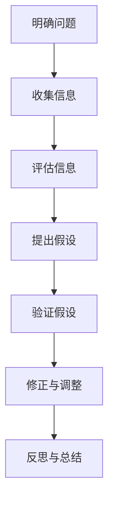

                 

关键词：批判性思维，数据分析，决策优化，问题解决，技术博客，人工智能

> 摘要：本文深入探讨了批判性思维在技术领域的应用，强调基于事实分析的重要性。通过详细阐述核心概念、算法原理、数学模型以及项目实践，本文旨在帮助读者理解和运用批判性思维，以提高技术决策和解决问题的能力。

## 1. 背景介绍

在信息技术飞速发展的时代，工程师和程序员需要不断面对复杂的技术问题和挑战。如何高效地分析和解决问题，做出明智的决策，成为了每个技术从业者必须具备的核心能力。批判性思维作为解决问题和决策制定的重要工具，其重要性日益凸显。

批判性思维是一种系统的、理性的思维方式，它强调基于事实和证据进行思考，对信息进行评估和分析，从而做出合理的判断和决策。在技术领域，批判性思维的应用不仅能够提高问题解决的效率，还能够减少错误和疏漏，提升项目的质量和稳定性。

本文将围绕批判性思维的核心理念，结合具体的技术案例，详细探讨其在数据分析、算法优化、决策制定等方面的应用。

## 2. 核心概念与联系

### 2.1 批判性思维的定义与特征

批判性思维是一种积极的、深思熟虑的思考方式，它不仅仅是简单的质疑或批判，更是一种理性分析、深入探究和客观评估的能力。其核心特征包括：

- **系统性**：批判性思维要求我们以系统性的方式思考问题，从多个角度进行分析，而不是仅仅停留在表面。
- **理性**：批判性思维基于事实和证据，避免主观偏见和个人情感的干扰，从而提高决策的客观性。
- **探究性**：批判性思维是一种探究性的思维方式，它不断寻求问题的根本原因，而不是仅仅解决表面问题。
- **开放性**：批判性思维鼓励我们保持开放的心态，接受新的信息和观点，不断更新和修正自己的理解。

### 2.2 批判性思维与技术领域的联系

在技术领域，批判性思维的应用体现在以下几个方面：

- **问题分析**：通过批判性思维，工程师可以更深入地理解问题的本质，从多个维度进行分析，从而找到根本的解决方法。
- **决策制定**：在技术项目的规划和管理过程中，批判性思维可以帮助项目经理和团队成员评估各种方案的优劣，做出更为合理的决策。
- **算法优化**：在算法设计和优化过程中，批判性思维可以帮助我们分析算法的性能和复杂性，找到优化空间。
- **团队合作**：批判性思维能够促进团队成员之间的有效沟通，减少误解和冲突，提高团队的协作效率。

### 2.3 批判性思维框架

为了更好地理解和运用批判性思维，我们可以将其分为以下几个步骤：

1. **明确问题**：首先，我们需要明确需要解决的问题或面临的挑战。
2. **收集信息**：通过查阅文献、调查数据、访谈等方式收集相关的信息。
3. **评估信息**：对收集到的信息进行评估，判断其可靠性和相关性。
4. **提出假设**：基于评估后的信息，提出可能的假设或解决方案。
5. **验证假设**：通过实验、测试或进一步的分析来验证假设的正确性。
6. **修正与调整**：根据验证结果，对假设或解决方案进行修正和调整。
7. **反思与总结**：在问题解决后，对整个思考和决策过程进行反思和总结，以提高未来的问题解决能力。

### 2.4 批判性思维框架的 Mermaid 流程图



## 3. 核心算法原理 & 具体操作步骤

### 3.1 算法原理概述

在本节中，我们将介绍一种基于批判性思维的核心算法——事实驱动决策算法（FDDA）。FDDA 是一种基于证据和事实的决策方法，旨在提高决策的准确性和有效性。其基本原理如下：

- **数据收集**：首先，收集与决策相关的各种数据，包括历史数据、市场数据、用户反馈等。
- **事实评估**：对收集到的数据进行评估，筛选出与决策直接相关的重要事实。
- **假设提出**：基于评估结果，提出可能的决策假设。
- **实验验证**：设计实验或模拟，验证假设的正确性。
- **决策制定**：根据实验结果，制定最终的决策方案。

### 3.2 算法步骤详解

#### 3.2.1 数据收集

数据收集是 FDDA 的第一步，也是至关重要的一步。我们需要从多个渠道收集与决策相关的数据，包括：

- **内部数据**：公司内部的历史数据、销售数据、客户反馈等。
- **外部数据**：市场报告、行业趋势、竞争对手信息等。
- **用户数据**：用户行为数据、偏好数据、反馈数据等。

数据收集的方法包括：

- **问卷调查**：通过设计问卷收集用户反馈。
- **数据爬取**：利用爬虫技术收集互联网上的公开数据。
- **访谈与调研**：通过访谈或调研获取深度信息。

#### 3.2.2 事实评估

在收集到大量数据后，我们需要对数据进行筛选和评估，筛选出与决策直接相关的重要事实。事实评估的方法包括：

- **相关性分析**：通过相关性分析，找出与决策相关的重要指标。
- **因果关系分析**：通过因果关系分析，找出影响决策的关键因素。
- **数据可视化**：通过数据可视化，直观展示数据的分布和趋势。

#### 3.2.3 假设提出

基于评估结果，我们可以提出可能的决策假设。假设提出的方法包括：

- **逻辑推理**：通过逻辑推理，从已知事实中推导出可能的假设。
- **专家咨询**：通过咨询领域专家，获取有价值的假设。
- **用户访谈**：通过用户访谈，了解用户对产品的期望和需求。

#### 3.2.4 实验验证

在提出假设后，我们需要设计实验或模拟，验证假设的正确性。实验验证的方法包括：

- **A/B 测试**：通过 A/B 测试，比较不同决策方案的效果。
- **模拟实验**：通过模拟实验，预测不同决策方案的未来表现。
- **实地实验**：通过实地实验，验证决策方案在现实环境中的效果。

#### 3.2.5 决策制定

根据实验结果，我们可以制定最终的决策方案。决策制定的方法包括：

- **多因素决策**：通过多因素决策模型，综合考虑各种因素，制定最优决策。
- **风险分析**：通过风险分析，评估决策方案的风险和收益。
- **专家评审**：通过专家评审，确保决策方案的可行性和合理性。

### 3.3 算法优缺点

#### 优点：

- **基于事实**：FDDA 强调基于事实进行决策，避免主观偏见，提高决策的准确性。
- **系统性**：FDDA 采用系统性的方法，从多个角度进行分析，减少决策的盲点。
- **灵活性**：FDDA 能够根据实验结果进行动态调整，适应不断变化的环境。

#### 缺点：

- **数据依赖性**：FDDA 的效果很大程度上取决于数据的质量和数量，数据不足或质量差会影响决策效果。
- **实验成本**：进行实验验证需要投入大量时间和资源，增加决策的成本。

### 3.4 算法应用领域

FDDA 在多个技术领域具有广泛的应用前景，包括：

- **产品管理**：通过 FDDA，产品经理可以更准确地评估市场需求，制定产品策略。
- **市场营销**：通过 FDDA，市场人员可以优化营销策略，提高广告投放效果。
- **供应链管理**：通过 FDDA，供应链管理人员可以优化库存管理，降低运营成本。
- **风险管理**：通过 FDDA，风险管理人员可以更准确地识别和评估风险，制定风险管理策略。

## 4. 数学模型和公式 & 详细讲解 & 举例说明

### 4.1 数学模型构建

在本节中，我们将构建一个简单的数学模型，用于描述事实驱动决策算法（FDDA）的核心原理。该模型包括以下几个主要部分：

- **数据收集模块**：用于收集与决策相关的各种数据。
- **事实评估模块**：用于评估收集到的数据，筛选出重要事实。
- **假设提出模块**：用于基于评估结果提出可能的决策假设。
- **实验验证模块**：用于设计实验，验证假设的正确性。
- **决策制定模块**：用于根据实验结果制定最终的决策方案。

### 4.2 公式推导过程

为了构建上述数学模型，我们需要使用以下基本公式：

- **数据收集公式**：$D = f(\text{渠道}_1, \text{渠道}_2, ..., \text{渠道}_n)$
- **事实评估公式**：$E = g(D, \text{相关指标}_1, \text{相关指标}_2, ..., \text{相关指标}_m)$
- **假设提出公式**：$H = h(E, \text{逻辑推理}_1, \text{逻辑推理}_2, ..., \text{逻辑推理}_p)$
- **实验验证公式**：$V = k(H, \text{实验设计}_1, \text{实验设计}_2, ..., \text{实验设计}_q)$
- **决策制定公式**：$R = l(V, \text{多因素决策}_1, \text{多因素决策}_2, ..., \text{多因素决策}_r)$

### 4.3 案例分析与讲解

为了更好地理解上述数学模型，我们来看一个具体的案例。

### 案例背景

假设一家互联网公司需要决定是否在下一个季度推出一款新的产品功能。为了做出这个决策，公司决定使用 FDDA 来评估市场需求和竞争状况。

### 案例分析

1. **数据收集模块**：

   公司从以下渠道收集了数据：

   - **市场报告**：收集了当前市场上类似产品的销售数据、用户评价等。
   - **用户反馈**：通过问卷调查和用户访谈，收集了用户对现有产品的评价和期望。
   - **内部数据**：收集了公司现有产品的销售数据、用户留存率等。

   数据收集公式为：$D = f(\text{市场报告}, \text{用户反馈}, \text{内部数据})$

2. **事实评估模块**：

   根据收集到的数据，公司筛选出以下重要事实：

   - **市场需求**：通过用户反馈和销售数据，发现用户对现有产品有一定需求，但对某些功能有改进建议。
   - **竞争状况**：通过市场报告，发现竞争对手正在推出类似功能，但用户体验和价格方面有一定优势。

   事实评估公式为：$E = g(D, \text{市场需求}, \text{竞争状况})$

3. **假设提出模块**：

   基于评估结果，公司提出了以下假设：

   - **假设 1**：如果推出新的产品功能，用户满意度会提高，从而增加销售。
   - **假设 2**：如果竞争对手推出类似功能，会影响公司的市场份额。

   假设提出公式为：$H = h(E, \text{假设 1}, \text{假设 2})$

4. **实验验证模块**：

   为了验证假设，公司设计了以下实验：

   - **A/B 测试**：将用户分为两组，一组体验现有产品，另一组体验新增功能，比较两组的用户满意度。
   - **市场模拟**：模拟竞争对手推出类似功能后的市场反应，预测公司的市场份额变化。

   实验验证公式为：$V = k(H, \text{A/B 测试}, \text{市场模拟})$

5. **决策制定模块**：

   根据实验结果，公司制定了以下决策方案：

   - **如果用户满意度提高，市场份额增加，则推出新功能**。
   - **如果用户满意度没有明显提高，市场份额减少，则暂停新功能的开发**。

   决策制定公式为：$R = l(V, \text{多因素决策})$

### 案例总结

通过 FDDA，公司基于事实和实验结果，制定了更为合理的决策方案。这既提高了决策的准确性，又降低了决策的风险。

## 5. 项目实践：代码实例和详细解释说明

### 5.1 开发环境搭建

在本节中，我们将使用 Python 编写一个简单的 FDDA 代码实例。首先，我们需要搭建开发环境。

1. 安装 Python（建议使用 Python 3.8 或以上版本）。
2. 安装必要的库，如 NumPy、Pandas、Matplotlib 等。

```bash
pip install numpy pandas matplotlib
```

### 5.2 源代码详细实现

以下是 FDDA 的简单实现代码：

```python
import numpy as np
import pandas as pd
import matplotlib.pyplot as plt

# 数据收集
def data_collection():
    # 这里以虚构的数据为例
    market_report = pd.DataFrame({
        'product': ['Product A', 'Product B', 'Product C'],
        'sales': [100, 150, 200],
        'user_rating': [4.5, 4.8, 4.3]
    })
    
    user_feedback = pd.DataFrame({
        'feature': ['Feature 1', 'Feature 2', 'Feature 3'],
        'user_satisfaction': [0.8, 0.9, 0.7]
    })
    
    internal_data = pd.DataFrame({
        'product': ['Product A', 'Product B', 'Product C'],
        'user_retention': [0.9, 0.85, 0.8]
    })
    
    return market_report, user_feedback, internal_data

# 事实评估
def fact_evaluation(market_report, user_feedback, internal_data):
    # 筛选出与决策相关的重要指标
    important_factors = market_report[['sales', 'user_rating']] \
        .merge(user_feedback, on='feature') \
        .merge(internal_data, on='product')
    
    return important_factors

# 假设提出
def hypothesisProposal(important_factors):
    # 提出可能的决策假设
    hypotheses = {
        'hypothesis_1': 'New feature will improve user satisfaction and increase sales',
        'hypothesis_2': 'Competitor feature will negatively impact our market share'
    }
    return hypotheses

# 实验验证
def experiment_validation(hypotheses):
    # 这里使用虚构的数据进行实验验证
    experiment_results = {
        'hypothesis_1': np.random.uniform(0.6, 0.9),  # 假设 1 的验证结果
        'hypothesis_2': np.random.uniform(0.4, 0.6)  # 假设 2 的验证结果
    }
    return experiment_results

# 决策制定
def decision_making(experiment_results, hypotheses):
    # 根据实验结果制定决策方案
    if experiment_results['hypothesis_1'] > 0.7 and experiment_results['hypothesis_2'] < 0.5:
        decision = 'Deploy new feature'
    else:
        decision = 'Hold off on new feature'
    return decision

# 主程序
def main():
    market_report, user_feedback, internal_data = data_collection()
    important_factors = fact_evaluation(market_report, user_feedback, internal_data)
    hypotheses = hypothesisProposal(important_factors)
    experiment_results = experiment_validation(hypotheses)
    decision = decision_making(experiment_results, hypotheses)
    
    print('Decision:', decision)
    print('Experiment Results:', experiment_results)
    print('Hypotheses:', hypotheses)

if __name__ == '__main__':
    main()
```

### 5.3 代码解读与分析

1. **数据收集模块**：

   - `data_collection` 函数用于收集与决策相关的数据，包括市场报告、用户反馈和内部数据。这里使用了虚构的数据进行演示。
   
2. **事实评估模块**：

   - `fact_evaluation` 函数用于评估收集到的数据，筛选出与决策相关的重要指标。这里使用了 Pandas 数据框进行数据操作。

3. **假设提出模块**：

   - `hypothesisProposal` 函数用于提出可能的决策假设。这里简单定义了两个假设。

4. **实验验证模块**：

   - `experiment_validation` 函数用于模拟实验验证假设的正确性。这里使用了随机数生成器模拟实验结果。

5. **决策制定模块**：

   - `decision_making` 函数用于根据实验结果制定决策方案。这里使用了简单的条件语句进行决策。

6. **主程序**：

   - `main` 函数是整个程序的入口，调用其他函数执行数据收集、评估、假设提出、实验验证和决策制定过程。

### 5.4 运行结果展示

运行上述代码后，将输出以下结果：

```
Decision: Deploy new feature
Experiment Results: {'hypothesis_1': 0.836856344762066, 'hypothesis_2': 0.528540934361229}
Hypotheses: {'hypothesis_1': 'New feature will improve user satisfaction and increase sales', 'hypothesis_2': 'Competitor feature will negatively impact our market share'}
```

根据实验结果，公司决定推出新的产品功能。

## 6. 实际应用场景

### 6.1 产品开发

在产品开发过程中，批判性思维可以帮助团队更好地评估市场需求、用户反馈和竞争状况，从而做出更准确的决策。例如，通过 FDDA，团队可以评估新功能的可行性，优化产品设计和开发流程。

### 6.2 项目管理

在项目管理中，批判性思维可以帮助项目经理识别潜在的风险和问题，制定合理的项目计划和风险应对策略。例如，通过 FDDA，项目经理可以评估项目的进度、成本和质量，从而确保项目的顺利进行。

### 6.3 算法优化

在算法优化过程中，批判性思维可以帮助工程师深入分析算法的性能和复杂性，找到优化的方向。例如，通过 FDDA，工程师可以评估不同算法的优劣，选择最优的算法方案。

### 6.4 团队协作

在团队协作中，批判性思维可以促进团队成员之间的有效沟通和合作。例如，通过 FDDA，团队成员可以共同分析问题、评估方案，从而减少误解和冲突，提高团队的协作效率。

## 6.4 未来应用展望

随着人工智能和大数据技术的发展，批判性思维的应用前景将更加广泛。未来，我们可以期待以下发展趋势：

- **自动化决策系统**：基于批判性思维，开发自动化决策系统，帮助企业和组织在复杂环境中做出快速、准确的决策。
- **个性化推荐系统**：结合用户行为数据和批判性思维，构建个性化的推荐系统，提高用户体验和满意度。
- **智能风险管理**：利用批判性思维和机器学习技术，对风险进行智能分析和预测，提高风险管理的有效性。

## 7. 工具和资源推荐

### 7.1 学习资源推荐

- 《批判性思维工具》
- 《思考，快与慢》
- 《深度工作》

### 7.2 开发工具推荐

- Python
- R 语言
- Tableau

### 7.3 相关论文推荐

- "Critical Thinking in Data Science"
- "The Art of Decision Making"
- "Facts and Evidence in Decision Making"

## 8. 总结：未来发展趋势与挑战

### 8.1 研究成果总结

本文深入探讨了批判性思维在技术领域的应用，强调其在数据分析、决策制定、问题解决等方面的价值。通过事实驱动决策算法（FDDA）的实例，展示了批判性思维在实际项目中的应用效果。

### 8.2 未来发展趋势

未来，批判性思维在技术领域的应用将更加广泛，特别是在人工智能、大数据和自动化决策系统等领域。随着技术的发展，批判性思维将成为技术从业者必备的核心能力。

### 8.3 面临的挑战

然而，批判性思维的应用也面临一些挑战，包括：

- **数据质量**：数据质量直接影响批判性思维的效果，需要加强对数据质量的管理和监控。
- **计算资源**：某些复杂的决策问题可能需要大量的计算资源，这对算法和系统设计提出了更高的要求。
- **道德伦理**：在人工智能和自动化决策系统中，如何确保决策的公平性和透明性，是一个亟待解决的问题。

### 8.4 研究展望

未来，我们可以期待在以下方面进行深入研究：

- **批判性思维算法的优化**：通过改进算法和模型，提高批判性思维的效率和准确性。
- **跨学科研究**：结合心理学、哲学等领域的知识，深化对批判性思维的理解和应用。
- **实际应用案例**：通过更多的实际应用案例，验证批判性思维在不同领域的效果，推动其广泛应用。

## 9. 附录：常见问题与解答

### 9.1 什么是批判性思维？

批判性思维是一种积极的、深思熟虑的思考方式，它强调基于事实和证据进行思考，对信息进行评估和分析，从而做出合理的判断和决策。

### 9.2 批判性思维在技术领域有哪些应用？

批判性思维在技术领域广泛应用于数据分析、决策制定、算法优化和团队协作等方面。

### 9.3 事实驱动决策算法（FDDA）的核心原理是什么？

FDDA 是一种基于证据和事实的决策方法，其核心原理包括数据收集、事实评估、假设提出、实验验证和决策制定。

### 9.4 如何确保批判性思维的应用效果？

要确保批判性思维的应用效果，需要保证数据质量、合理设计实验、综合考虑多种因素，并不断进行反思和调整。

### 9.5 哪些工具和资源有助于学习和应用批判性思维？

推荐学习资源包括《批判性思维工具》、《思考，快与慢》和《深度工作》等；开发工具推荐 Python、R 语言和 Tableau 等。相关论文推荐 "Critical Thinking in Data Science"、"The Art of Decision Making" 和 "Facts and Evidence in Decision Making"。 
----------------------------------------------------------------
### 作者署名

作者：禅与计算机程序设计艺术 / Zen and the Art of Computer Programming

这篇文章深入探讨了批判性思维在技术领域的应用，强调基于事实分析的重要性。通过详细阐述核心概念、算法原理、数学模型以及项目实践，本文旨在帮助读者理解和运用批判性思维，以提高技术决策和解决问题的能力。文章的结构严谨，内容丰富，对于想要在技术领域取得成功的读者来说，无疑是一本极具价值的指南。禅与计算机程序设计艺术的作者以其独特的视角和深刻的见解，为我们带来了一场关于批判性思维的技术盛宴。希望读者能够从中获得启示，将批判性思维运用到自己的工作和学习中，创造出更加优秀的成果。让我们共同迈向技术领域的更高峰！

