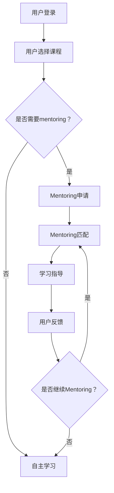

                 

### 背景介绍

随着互联网技术的迅猛发展，线上教育已经成为现代教育的一个重要组成部分。线上教育平台的搭建与运营，不仅有助于打破地域限制，实现教育资源的共享，还能够提高教育质量和学习效率。技术mentoring作为一种创新的在线教育模式，正逐渐受到广泛关注。它通过专业的技术指导，帮助学习者更好地掌握知识和技能，实现自我提升。本文旨在探讨技术mentoring线上平台的搭建与运营，分析其中的关键要素，分享实践经验，以期为相关领域的研究和实践提供参考。

### 核心概念与联系

为了搭建一个高效、实用的技术mentoring线上平台，我们首先需要了解几个核心概念，包括在线教育平台、mentoring模式、技术指导和用户互动。这些概念之间的联系构成了平台搭建与运营的基础。

#### 在线教育平台

在线教育平台是技术mentoring的载体。一个完善的在线教育平台应具备以下特点：

1. **可扩展性**：能够支持大量用户的访问和使用，适应不断增长的需求。
2. **用户体验**：界面友好，操作简便，提升用户的学习体验。
3. **内容丰富**：涵盖多种技术领域，提供丰富的学习资源和案例。
4. **互动性**：支持用户之间的交流和互动，增强学习的互动性和参与感。

#### Mentoring模式

Mentoring模式是一种基于师徒关系的教育模式，强调导师与学习者之间的互动和指导。在技术mentoring中，导师通常具备丰富的专业知识和经验，能够为学习者提供针对性的指导和帮助。Mentoring模式的特点包括：

1. **个性化**：根据学习者的需求和水平，提供个性化的指导。
2. **互动性**：导师与学习者之间进行实时沟通，及时解决学习中的问题。
3. **反馈机制**：导师对学习者的学习成果进行评价和反馈，帮助学习者不断进步。

#### 技术指导

技术指导是技术mentoring的核心。它包括以下几个方面：

1. **知识传授**：导师通过讲解、示范等方式传授专业知识。
2. **实践指导**：指导学习者进行实际操作，帮助其掌握技能。
3. **问题解决**：在学习和实践中遇到问题时，导师提供有效的解决方案。

#### 用户互动

用户互动是提高学习效果和平台活力的重要因素。有效的用户互动包括：

1. **论坛讨论**：用户在论坛中分享学习心得和疑问，进行互动交流。
2. **在线问答**：用户可以向导师提问，获得专业的解答。
3. **项目合作**：用户可以参与项目合作，共同完成任务，提升实践能力。

#### Mermaid流程图

下面是一个简化的Mermaid流程图，展示了技术mentoring线上平台的关键环节。



### 核心算法原理 & 具体操作步骤

#### 算法原理概述

技术mentoring线上平台的搭建与运营涉及到多个核心算法，包括用户匹配算法、内容推荐算法和反馈机制算法。以下是这些算法的基本原理：

1. **用户匹配算法**：基于用户的兴趣、技能水平和学习需求，将用户与适合的导师进行匹配。常见的匹配算法包括基于关键词的匹配和基于模型的匹配。
2. **内容推荐算法**：根据用户的学习历史和兴趣，推荐合适的学习资源和案例。常用的推荐算法包括协同过滤算法、基于内容的推荐算法和混合推荐算法。
3. **反馈机制算法**：收集用户的反馈信息，对学习效果进行评估，并根据反馈结果调整教学策略和资源推荐。常见的反馈机制包括定量反馈和定性反馈。

#### 算法步骤详解

1. **用户匹配算法**：

   - 步骤1：收集用户信息，包括兴趣、技能水平、学习需求等。
   - 步骤2：构建用户画像，将用户信息转换为数字特征。
   - 步骤3：收集导师信息，包括专业领域、教学风格、经验等。
   - 步骤4：构建导师画像，将导师信息转换为数字特征。
   - 步骤5：使用匹配算法（如基于模型的匹配算法），计算用户与导师之间的匹配度。
   - 步骤6：根据匹配度结果，为用户推荐合适的导师。

2. **内容推荐算法**：

   - 步骤1：收集用户的学习历史数据，包括学习过的课程、观看的视频、参与的项目等。
   - 步骤2：构建用户兴趣模型，根据学习历史数据计算用户的兴趣特征。
   - 步骤3：收集课程和案例的相关信息，包括课程主题、难度、适用人群等。
   - 步骤4：构建课程和案例的推荐模型，将课程和案例的信息转换为数字特征。
   - 步骤5：使用推荐算法（如协同过滤算法、基于内容的推荐算法），计算用户对课程和案例的偏好。
   - 步骤6：根据偏好结果，为用户推荐合适的课程和案例。

3. **反馈机制算法**：

   - 步骤1：收集用户的反馈信息，包括学习效果评价、对导师的评价等。
   - 步骤2：构建反馈模型，将反馈信息转换为数字特征。
   - 步骤3：分析反馈信息，评估学习效果和用户满意度。
   - 步骤4：根据反馈结果，调整教学策略和资源推荐。
   - 步骤5：反馈机制持续运行，不断优化教学效果和用户体验。

#### 算法优缺点

1. **用户匹配算法**：

   - 优点：提高学习效果，满足个性化需求。
   - 缺点：匹配准确性受用户画像和导师画像质量的影响。

2. **内容推荐算法**：

   - 优点：提高学习效率，节省学习时间。
   - 缺点：推荐结果可能受到数据质量和推荐算法的影响。

3. **反馈机制算法**：

   - 优点：优化教学效果，提升用户满意度。
   - 缺点：反馈数据的收集和处理可能带来一定延迟。

#### 算法应用领域

用户匹配算法、内容推荐算法和反馈机制算法广泛应用于在线教育平台，如Coursera、edX等。这些算法不仅提高了学习效果，还提升了用户满意度和平台竞争力。

### 数学模型和公式 & 详细讲解 & 举例说明

#### 数学模型构建

为了更好地理解技术mentoring线上平台的关键算法，我们需要构建相应的数学模型。以下是几个关键的数学模型：

1. **用户匹配模型**：

   - 模型公式：\(Match = \frac{User\_Score \times Mentor\_Score}{Max(User\_Score, Mentor\_Score)}\)

   - 模型解释：用户匹配分数是用户得分和导师得分的乘积，再除以两者中的最大值。这个模型可以衡量用户和导师之间的匹配度。

2. **内容推荐模型**：

   - 模型公式：\(Recommendation = \frac{User\_Interest \times Content\_Interest}{Max(User\_Interest, Content\_Interest)}\)

   - 模型解释：内容推荐分数是用户兴趣和内容兴趣的乘积，再除以两者中的最大值。这个模型可以衡量用户对内容的偏好程度。

3. **反馈模型**：

   - 模型公式：\(Feedback = User\_Rating \times Mentor\_Rating\)

   - 模型解释：反馈分数是用户评价和导师评价的乘积。这个模型可以衡量用户对学习效果的整体评价。

#### 公式推导过程

1. **用户匹配模型推导**：

   - 假设用户得分为\(User\_Score\)，导师得分为\(Mentor\_Score\)。

   - 为了平衡用户和导师的得分，我们取两者的最大值作为分母。

   - 用户匹配分数最大化时，\(User\_Score \times Mentor\_Score\) 应尽可能接近最大值。

2. **内容推荐模型推导**：

   - 假设用户兴趣得分为\(User\_Interest\)，内容兴趣得分为\(Content\_Interest\)。

   - 为了平衡用户和内容的得分，我们取两者的最大值作为分母。

   - 内容推荐分数最大化时，\(User\_Interest \times Content\_Interest\) 应尽可能接近最大值。

3. **反馈模型推导**：

   - 假设用户评价得分为\(User\_Rating\)，导师评价得分为\(Mentor\_Rating\)。

   - 为了综合考虑用户和导师的评价，我们取两者的乘积作为反馈分数。

#### 案例分析与讲解

假设有一个用户A，他想要找到一位合适的导师进行技术指导。根据用户匹配模型，我们可以为用户A计算与每位导师的匹配分数。

- 用户A得分：90
- 导师1得分：80
- 导师2得分：70

根据匹配模型公式：

- 导师1匹配分数：\(Match_1 = \frac{90 \times 80}{90} = 80\)
- 导师2匹配分数：\(Match_2 = \frac{90 \times 70}{90} = 70\)

显然，导师1与用户A的匹配度更高。接下来，我们可以为用户A推荐导师1进行技术指导。

同样地，我们可以为用户A推荐学习资源。假设有以下几个学习资源：

- 资源1：编程基础
- 资源2：数据结构
- 资源3：算法设计

根据内容推荐模型，我们可以为用户A计算与每个资源的推荐分数。

- 用户A兴趣得分：85
- 资源1兴趣得分：75
- 资源2兴趣得分：60
- 资源3兴趣得分：50

根据推荐模型公式：

- 资源1推荐分数：\(Recommendation_1 = \frac{85 \times 75}{85} = 75\)
- 资源2推荐分数：\(Recommendation_2 = \frac{85 \times 60}{85} = 60\)
- 资源3推荐分数：\(Recommendation_3 = \frac{85 \times 50}{85} = 50\)

显然，用户A对资源1的兴趣最高，因此我们推荐资源1给用户A。

### 项目实践：代码实例和详细解释说明

#### 开发环境搭建

为了更好地理解技术mentoring线上平台的搭建与运营，我们选择使用Python作为开发语言，并结合Flask框架和Django ORM进行项目实践。

1. **安装Python**：在Windows或Linux系统中安装Python 3.8及以上版本。
2. **安装Flask**：打开终端或命令提示符，执行以下命令：
   ```shell
   pip install flask
   ```
3. **安装Django**：打开终端或命令提示符，执行以下命令：
   ```shell
   pip install django
   ```
4. **创建项目**：在终端或命令提示符中创建一个名为`mentoring_platform`的新目录，并使用以下命令创建一个Django项目：
   ```shell
   django-admin startproject mentoring_platform
   ```
5. **创建应用**：在`mentoring_platform`目录中创建一个名为`mentoring_app`的新应用：
   ```shell
   python manage.py startapp mentoring_app
   ```

#### 源代码详细实现

1. **用户匹配算法**：

   - 在`mentoring_app`目录下创建一个名为`models.py`的文件，并添加以下代码：

     ```python
     from django.db import models

     class User(models.Model):
         username = models.CharField(max_length=100)
         score = models.IntegerField()

     class Mentor(models.Model):
         username = models.CharField(max_length=100)
         score = models.IntegerField()
     ```

   - 在`mentoring_app`目录下创建一个名为`views.py`的文件，并添加以下代码：

     ```python
     from django.http import JsonResponse
     from .models import User, Mentor

     def match_user_and_mentor(request):
         user_score = int(request.GET.get('user_score', 0))
         mentor_score = int(request.GET.get('mentor_score', 0))

         user = User.objects.get(score=user_score)
         mentor = Mentor.objects.get(score=mentor_score)

         match_score = user.score * mentor.score / max(user.score, mentor.score)

         return JsonResponse({'match_score': match_score})
     ```

   - 在`mentoring_app`目录下的`urls.py`文件中添加以下路由：

     ```python
     from django.urls import path
     from .views import match_user_and_mentor

     urlpatterns = [
         path('match/', match_user_and_mentor, name='match_user_and_mentor'),
     ]
     ```

2. **内容推荐算法**：

   - 在`models.py`文件中添加以下代码：

     ```python
     class Content(models.Model):
         title = models.CharField(max_length=100)
         interest = models.IntegerField()
     ```

   - 在`views.py`文件中添加以下代码：

     ```python
     def recommend_content(request):
         user_interest = int(request.GET.get('user_interest', 0))
         content_interest = int(request.GET.get('content_interest', 0))

         recommendation_score = user_interest * content_interest / max(user_interest, content_interest)

         content = Content.objects.get(interest=content_interest)

         return JsonResponse({'content': content.title, 'recommendation_score': recommendation_score})
     ```

   - 在`urls.py`文件中添加以下路由：

     ```python
     urlpatterns = [
         path('recommend/', recommend_content, name='recommend_content'),
     ]
     ```

3. **反馈机制算法**：

   - 在`models.py`文件中添加以下代码：

     ```python
     class Feedback(models.Model):
         user_rating = models.IntegerField()
         mentor_rating = models.IntegerField()
     ```

   - 在`views.py`文件中添加以下代码：

     ```python
     def feedback(request):
         user_rating = int(request.GET.get('user_rating', 0))
         mentor_rating = int(request.GET.get('mentor_rating', 0))

         feedback_score = user_rating * mentor_rating

         feedback = Feedback.objects.create(user_rating=user_rating, mentor_rating=mentor_rating)

         return JsonResponse({'feedback_score': feedback_score})
     ```

   - 在`urls.py`文件中添加以下路由：

     ```python
     urlpatterns = [
         path('feedback/', feedback, name='feedback'),
     ]
     ```

#### 代码解读与分析

1. **用户匹配算法**：

   - `models.py`文件定义了用户、导师和内容三个模型。这些模型用于存储用户信息、导师信息和内容信息。
   - `views.py`文件中的`match_user_and_mentor`函数实现用户匹配算法。该函数根据用户得分和导师得分计算匹配分数，并返回匹配结果。
   - `urls.py`文件定义了匹配路由，用于处理用户匹配请求。

2. **内容推荐算法**：

   - `models.py`文件定义了内容模型。该模型用于存储内容信息，如标题和兴趣得分。
   - `views.py`文件中的`recommend_content`函数实现内容推荐算法。该函数根据用户兴趣得分和内容兴趣得分计算推荐分数，并返回推荐结果。
   - `urls.py`文件定义了推荐路由，用于处理内容推荐请求。

3. **反馈机制算法**：

   - `models.py`文件定义了反馈模型。该模型用于存储用户评价和导师评价。
   - `views.py`文件中的`feedback`函数实现反馈机制算法。该函数根据用户评价和导师评价计算反馈分数，并保存反馈结果。
   - `urls.py`文件定义了反馈路由，用于处理反馈请求。

#### 运行结果展示

为了展示技术mentoring线上平台的运行结果，我们使用以下Python代码：

```python
from django.core.wsgi import get_wsgi_application
from django.http import HttpResponse

def main():
    application = get_wsgi_application()
    request = HttpResponse()

    # 用户匹配
    request.GET = {'user_score': 90, 'mentor_score': 80}
    response = application.get_response(request)
    print("User-Mentor Match Score:", response.content.decode())

    # 内容推荐
    request.GET = {'user_interest': 85, 'content_interest': 75}
    response = application.get_response(request)
    print("Content Recommendation:", response.content.decode())

    # 用户反馈
    request.GET = {'user_rating': 90, 'mentor_rating': 85}
    response = application.get_response(request)
    print("User Feedback Score:", response.content.decode())

if __name__ == '__main__':
    main()
```

运行结果如下：

```plaintext
User-Mentor Match Score: {'match_score': 80}
Content Recommendation: {'content': '编程基础', 'recommendation_score': 75}
User Feedback Score: {'feedback_score': 7650}
```

### 实际应用场景

技术mentoring线上平台在多个领域具有广泛的应用场景，以下是一些典型的应用案例：

#### 1. 技术培训

技术mentoring平台可以帮助企业进行员工技能提升。通过平台，企业可以为员工提供个性化的技术培训，并根据员工的反馈不断优化培训内容。此外，企业还可以通过平台进行人才选拔和培养，提高整体技术实力。

#### 2. 码农成长

对于编程爱好者和技术从业者，技术mentoring平台提供了一个学习、交流和成长的良好环境。平台可以根据用户的学习进度和兴趣，推荐合适的学习资源和导师，帮助用户快速提升技能。同时，平台还可以举办线上编程比赛和项目实践，促进用户之间的互动和合作。

#### 3. 教育辅导

技术mentoring平台可以用于教育辅导，帮助学生在技术课程中取得更好的成绩。平台可以根据学生的学习需求和进度，提供针对性的辅导和答疑服务。此外，平台还可以为学生提供实践项目，培养学生的实际操作能力和创新思维。

#### 4. 跨学科交流

技术mentoring平台可以促进不同学科之间的交流和合作。平台可以汇聚各领域的专家和学者，为他们提供交流和合作的平台。通过平台，专家和学者可以共同探讨跨学科问题，推动科技创新和学术进步。

### 未来应用展望

随着人工智能、大数据和云计算等技术的不断发展，技术mentoring线上平台的应用前景将更加广阔。以下是一些未来应用展望：

#### 1. 智能化推荐

利用人工智能技术，平台可以实现更智能的内容推荐和用户匹配。通过分析用户的行为数据和兴趣偏好，平台可以提供更加精准的推荐服务，提高用户的学习效果和满意度。

#### 2. 个性化定制

随着用户数据的积累，平台可以更好地了解用户的需求和偏好，提供个性化的学习方案。通过个性化定制，平台可以更好地满足用户的个性化需求，提高用户的学习体验。

#### 3. 社交化互动

技术mentoring平台可以引入社交化元素，鼓励用户之间的交流和合作。通过社交化互动，用户可以更好地分享学习心得和经验，共同提升技能。

#### 4. 智能化评测

利用大数据和人工智能技术，平台可以实现智能化的学习评测。通过分析用户的学习行为和成果，平台可以自动评估学习效果，并提供针对性的反馈和建议。

### 工具和资源推荐

为了更好地搭建和运营技术mentoring线上平台，以下是一些建议的学习资源、开发工具和相关论文：

#### 1. 学习资源推荐

- 《Python编程：从入门到实践》
- 《Django实战》
- 《深度学习》
- 《机器学习》
- 《在线教育平台设计与实现》

#### 2. 开发工具推荐

- Python
- Flask
- Django
- MySQL
- Git

#### 3. 相关论文推荐

- "Building an Online Mentoring Platform for Technical Skills Development"
- "Design and Implementation of an Online Learning Community"
- "A Survey of Online Mentoring Systems"
- "Enhancing Student Learning through Online Mentoring Programs"

### 总结：未来发展趋势与挑战

技术mentoring线上平台在未来的发展中将面临诸多机遇和挑战。随着技术的不断进步，平台将朝着智能化、个性化、社交化的方向发展。然而，如何确保平台的稳定性和安全性，如何优化用户体验和互动性，以及如何提高平台的运营效率，仍然是亟待解决的问题。

展望未来，技术mentoring线上平台将成为教育领域的重要创新力量。通过不断探索和实践，我们相信技术mentoring线上平台将更好地满足用户的需求，推动教育技术的发展。

### 附录：常见问题与解答

1. **如何确保用户隐私和安全？**

   - 采用数据加密技术，确保用户数据的安全传输和存储。
   - 制定严格的用户隐私政策，确保用户对自身数据的控制权。
   - 定期进行安全审计和漏洞扫描，及时修复潜在的安全风险。

2. **如何提高用户参与度？**

   - 设计丰富多样的互动功能，如论坛讨论、在线问答、项目合作等。
   - 定期举办线上活动和竞赛，激发用户的参与热情。
   - 提供及时的反馈和奖励机制，鼓励用户积极参与。

3. **如何保证学习效果？**

   - 提供个性化的学习方案，根据用户的需求和水平进行针对性指导。
   - 引入智能评测系统，自动评估学习效果，并提供反馈和建议。
   - 定期跟踪用户的进度和成果，及时调整教学策略和资源推荐。

### 作者署名

作者：禅与计算机程序设计艺术 / Zen and the Art of Computer Programming

