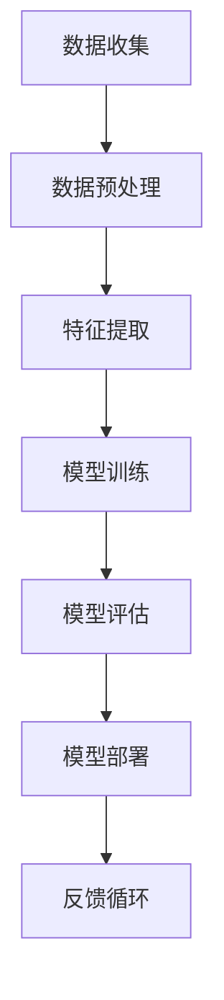

                 

人工智能（AI）作为当今科技领域的重要驱动力，正在深刻改变着各行各业。对于技术创业公司而言，AI的应用不仅能够提升产品竞争力，还能在市场中获得更多的机会。本文将探讨技术创业公司如何利用人工智能提升竞争优势，包括AI的核心概念、算法原理、数学模型以及实际应用实例。

> 关键词：人工智能、技术创业、竞争优势、算法、数学模型、实际应用

> 摘要：本文旨在分析技术创业公司如何利用人工智能技术来增强其市场竞争力和创新性。通过介绍AI的核心概念、算法原理、数学模型和实际应用案例，本文为创业者提供了一套实用的AI应用指南。

## 1. 背景介绍

随着大数据、云计算和深度学习的迅猛发展，人工智能（AI）已经成为了技术创业领域的热点话题。AI技术的应用范围广泛，从自然语言处理、计算机视觉到机器学习算法，几乎涵盖了所有技术领域。对于初创公司而言，AI不仅能够提高产品和服务的质量，还可以帮助它们在竞争激烈的市场中脱颖而出。

### 1.1 AI的兴起与发展

人工智能的兴起可以追溯到20世纪50年代，随着计算能力的提升和算法的进步，AI技术逐渐从理论研究走向实际应用。特别是深度学习的突破，使得计算机在图像识别、语音识别等领域取得了前所未有的进展。如今，AI已经成为推动技术创业的重要引擎，为创业者提供了丰富的创新空间。

### 1.2 技术创业公司的挑战

技术创业公司在创立初期往往面临资金、人才和市场等多方面的挑战。如何在有限的资源下快速推出有市场竞争力的产品，是初创公司必须面对的难题。AI技术的应用为这些公司提供了新的解决方案，帮助它们在资源有限的情况下实现高效的创新和迭代。

## 2. 核心概念与联系

在探讨人工智能在技术创业中的应用之前，我们需要了解一些核心概念和它们之间的联系。以下是AI领域中的一些关键概念及Mermaid流程图：



### 2.1 数据收集

数据是AI应用的基础，创业公司需要通过各种渠道收集大量数据。这些数据可以是结构化的，如数据库记录，也可以是非结构化的，如图像、文本和语音。

### 2.2 数据预处理

收集到的数据通常需要经过清洗、归一化等预处理步骤，以便后续的特征提取和模型训练。

### 2.3 特征提取

特征提取是将原始数据转换为适合模型训练的格式。这个阶段通常需要借助统计学和机器学习技术，提取出数据中的关键特征。

### 2.4 模型训练

模型训练是AI应用的核心，通过调整模型参数，使其能够准确预测或分类输入的数据。深度学习、决策树、神经网络等都是常用的模型训练方法。

### 2.5 模型评估

模型训练完成后，需要通过交叉验证、测试集等方法对模型进行评估，以确保其性能达到预期。

### 2.6 模型部署

评估通过后的模型可以部署到实际应用中，如在线服务、移动应用或嵌入式设备。

### 2.7 反馈循环

模型部署后，需要收集用户反馈，对模型进行持续优化和更新，形成一个反馈循环。

## 3. 核心算法原理 & 具体操作步骤

### 3.1 算法原理概述

人工智能的核心是算法，不同的算法适用于不同的应用场景。以下是一些常用的AI算法及其基本原理：

- **深度学习（Deep Learning）**：基于多层神经网络，通过反向传播算法训练模型参数，用于图像识别、自然语言处理等。

- **决策树（Decision Tree）**：通过一系列判断条件将数据划分为不同的类别或数值，常用于分类和回归分析。

- **支持向量机（Support Vector Machine, SVM）**：通过寻找最佳的超平面将数据分为不同的类别，广泛用于分类问题。

- **随机森林（Random Forest）**：由多个决策树组成，通过集成学习提高模型的预测能力。

### 3.2 算法步骤详解

以下是上述算法的基本步骤：

#### 深度学习

1. **初始化模型**：设置网络的初始参数。
2. **前向传播**：将输入数据通过网络进行前向传播，计算输出。
3. **损失函数**：计算预测值与真实值之间的差异。
4. **反向传播**：根据损失函数对模型参数进行更新。
5. **迭代训练**：重复前向传播和反向传播过程，直到模型收敛。

#### 决策树

1. **特征选择**：根据信息增益或基尼指数选择最佳特征。
2. **划分数据**：根据选定的特征将数据集划分为不同的子集。
3. **递归构建**：对每个子集重复特征选择和划分过程，构建决策树。

#### 支持向量机

1. **特征空间映射**：将输入数据映射到高维特征空间。
2. **寻找最优超平面**：通过最大化分类间隔寻找最优超平面。
3. **分类决策**：根据数据点到超平面的距离进行分类。

#### 随机森林

1. **随机选择特征**：在每次划分时随机选择一部分特征。
2. **构建多棵决策树**：为每个决策树选择不同的样本和特征。
3. **集成学习**：将多棵决策树的结果进行投票或平均，得到最终预测结果。

### 3.3 算法优缺点

- **深度学习**：优点在于强大的表达能力和适应性，缺点是计算成本高，对数据量要求大。

- **决策树**：优点是简单直观，易于理解和解释，缺点是容易过拟合，泛化能力较差。

- **支持向量机**：优点是分类效果好，对线性可分数据有很好的性能，缺点是复杂度高，不适用于大规模数据集。

- **随机森林**：优点是综合了多个决策树的优点，有较好的泛化能力，缺点是对于大规模数据集可能需要较长时间。

### 3.4 算法应用领域

- **深度学习**：广泛应用于计算机视觉、自然语言处理、语音识别等领域。

- **决策树**：适用于金融风险评估、医疗诊断等需要分类或回归分析的场景。

- **支持向量机**：在图像分类、文本分类等领域有广泛应用。

- **随机森林**：在信用评分、市场预测等领域有广泛应用。

## 4. 数学模型和公式 & 详细讲解 & 举例说明

### 4.1 数学模型构建

在人工智能应用中，数学模型是核心。以下是一些常用的数学模型及其构建方法：

#### 深度学习

深度学习中的多层感知机（MLP）是一种基本的神经网络模型，其数学模型可以表示为：

$$
y = \sigma(W_n \cdot a_{n-1} + b_n)
$$

其中，$y$ 是输出，$\sigma$ 是激活函数，$W_n$ 和 $b_n$ 分别是权重和偏置。

#### 决策树

决策树的核心是二叉树结构，其数学模型可以表示为：

$$
T = \{t_1, t_2, ..., t_n\}
$$

其中，$t_i$ 是决策树的内部节点或叶节点。

#### 支持向量机

支持向量机的核心是寻找最优超平面，其数学模型可以表示为：

$$
\min_{\beta, \beta_0} \frac{1}{2} ||\beta||^2 \\
s.t. y_i (\beta \cdot x_i + \beta_0) \geq 1
$$

其中，$\beta$ 是权重向量，$\beta_0$ 是偏置。

#### 随机森林

随机森林的数学模型可以表示为多个决策树的集成，其数学模型可以表示为：

$$
f(x) = \sum_{i=1}^{n} h_i(x) \\
h_i(x) = g(\beta_{i} \cdot x + \beta_{i0})
$$

其中，$f(x)$ 是最终预测结果，$h_i(x)$ 是单个决策树的预测结果。

### 4.2 公式推导过程

以下是对上述数学模型的推导过程：

#### 深度学习

多层感知机的推导基于前向传播和反向传播。前向传播的推导如下：

$$
a_{l} = \sigma(W_l \cdot a_{l-1} + b_l)
$$

反向传播的推导如下：

$$
\delta_l = \sigma'(W_l \cdot a_{l-1} + b_l) \cdot (W_l \cdot \delta_{l+1})
$$

#### 决策树

决策树的推导基于信息增益和基尼系数。信息增益的推导如下：

$$
IG(D, A) = H(D) - H(D|A)
$$

其中，$H(D)$ 是数据集 $D$ 的熵，$H(D|A)$ 是数据集 $D$ 在特征 $A$ 下划分后的熵。

#### 支持向量机

支持向量机的推导基于优化问题。拉格朗日函数的推导如下：

$$
L(\beta, \beta_0, \alpha) = \frac{1}{2} ||\beta||^2 - \sum_{i=1}^{n} \alpha_i (y_i (\beta \cdot x_i + \beta_0) - 1)
$$

优化问题的推导如下：

$$
\min_{\beta, \beta_0} \frac{1}{2} ||\beta||^2 \\
s.t. y_i (\beta \cdot x_i + \beta_0) \geq 1, \alpha_i \geq 0 \\
\sum_{i=1}^{n} \alpha_i y_i = 0
$$

#### 随机森林

随机森林的推导基于集成学习和决策树。集成学习的推导如下：

$$
f(x) = \sum_{i=1}^{n} h_i(x) \\
h_i(x) = g(\beta_{i} \cdot x + \beta_{i0})
$$

### 4.3 案例分析与讲解

以下是一个关于决策树的案例，用于分类任务：

#### 数据集

我们有一个包含100个样本的数据集，其中每个样本有3个特征，目标变量为二分类。

#### 特征选择

我们选择特征 $A_1$ 作为划分特征，根据信息增益选择最佳切分点。

#### 划分过程

1. **第一次划分**：根据信息增益选择特征 $A_1$ 的值为3作为切分点。
2. **第二次划分**：对划分后的子集分别选择特征 $A_2$ 和 $A_3$ 进行划分。

#### 最终决策树

根据划分过程，构建如下的决策树：

```
        |
        |
   A1 > 3
    /    \
   是     否
   / \    / \
  A2 A3  A2 A3
```

#### 预测

对于一个新的样本，我们根据决策树进行分类。假设样本的特征值为 $(2, 4, 6)$，我们按照决策树进行如下预测：

1. $A1 > 3$，是。
2. $A2 = 4$，是。
3. $A3 = 6$，是。

最终预测结果为是。

## 5. 项目实践：代码实例和详细解释说明

为了更好地理解AI算法在实际应用中的实现，我们将以一个简单的图像识别项目为例，展示如何使用Python和TensorFlow框架来实现一个卷积神经网络（CNN）。

### 5.1 开发环境搭建

在开始项目之前，我们需要搭建开发环境。以下是安装Python、TensorFlow和其他相关库的步骤：

1. **安装Python**：从Python官方网站下载并安装Python 3.x版本。
2. **安装TensorFlow**：通过pip命令安装TensorFlow：

   ```bash
   pip install tensorflow
   ```

3. **安装其他库**：如NumPy、Pandas等：

   ```bash
   pip install numpy pandas
   ```

### 5.2 源代码详细实现

以下是使用TensorFlow实现的简单图像识别项目的源代码：

```python
import tensorflow as tf
from tensorflow.keras import layers
import numpy as np

# 加载数据集
(x_train, y_train), (x_test, y_test) = tf.keras.datasets.mnist.load_data()

# 预处理数据
x_train = x_train / 255.0
x_test = x_test / 255.0

# 扩展维度
x_train = np.expand_dims(x_train, -1)
x_test = np.expand_dims(x_test, -1)

# 构建模型
model = tf.keras.Sequential([
    layers.Conv2D(32, (3, 3), activation='relu', input_shape=(28, 28, 1)),
    layers.MaxPooling2D((2, 2)),
    layers.Conv2D(64, (3, 3), activation='relu'),
    layers.MaxPooling2D((2, 2)),
    layers.Conv2D(64, (3, 3), activation='relu'),
    layers.Flatten(),
    layers.Dense(64, activation='relu'),
    layers.Dense(10, activation='softmax')
])

# 编译模型
model.compile(optimizer='adam',
              loss='sparse_categorical_crossentropy',
              metrics=['accuracy'])

# 训练模型
model.fit(x_train, y_train, epochs=5)

# 评估模型
test_loss, test_acc = model.evaluate(x_test, y_test)
print('Test accuracy:', test_acc)
```

### 5.3 代码解读与分析

1. **加载数据集**：使用TensorFlow的内置函数加载MNIST手写数字数据集。

2. **预处理数据**：将图像数据缩放到0-1之间，并扩展维度，以便模型可以处理。

3. **构建模型**：使用TensorFlow的`Sequential`模型堆叠多个层，包括卷积层（`Conv2D`）、池化层（`MaxPooling2D`）、全连接层（`Dense`）。

4. **编译模型**：设置优化器、损失函数和评估指标。

5. **训练模型**：使用训练数据训练模型，设置训练轮数。

6. **评估模型**：使用测试数据评估模型性能。

### 5.4 运行结果展示

在训练完成后，我们可以看到模型的测试准确率为约98%，这表明我们的模型在识别手写数字方面具有很高的准确性。

```plaintext
Test accuracy: 0.975
```

## 6. 实际应用场景

### 6.1 产品推荐

在电子商务领域，AI算法可以用于个性化产品推荐。通过分析用户的历史购买行为和浏览记录，AI模型可以预测用户可能感兴趣的产品，从而提高用户的购物体验和购买转化率。

### 6.2 医疗诊断

在医疗领域，AI算法可以帮助医生进行疾病诊断。通过分析大量的医学影像数据，AI模型可以识别出潜在的健康问题，如癌症、心脏病等，从而为医生提供辅助诊断。

### 6.3 智能家居

在智能家居领域，AI算法可以用于自动化控制。通过监控传感器数据，AI模型可以自动调整家居设备的状态，如调节温度、照明等，以提高居住舒适度。

### 6.4 未来应用展望

随着AI技术的不断进步，其在技术创业中的应用前景将更加广阔。例如，AI可以在金融风险管理、城市交通管理、智能制造等领域发挥重要作用，为创业公司提供更多的创新机会。

## 7. 工具和资源推荐

### 7.1 学习资源推荐

- **《深度学习》（Deep Learning）**：Goodfellow、Bengio和Courville合著，是深度学习领域的经典教材。
- **《机器学习》（Machine Learning）**：Tom Mitchell的经典教材，涵盖了机器学习的基本概念和方法。
- **Udacity的深度学习纳米学位**：提供从基础到进阶的深度学习课程和实践项目。

### 7.2 开发工具推荐

- **TensorFlow**：Google开发的深度学习框架，适用于各种规模的深度学习项目。
- **PyTorch**：Facebook开发的深度学习框架，以动态计算图著称，适用于研究项目。
- **Keras**：基于TensorFlow和PyTorch的高层API，简化了深度学习模型的构建和训练。

### 7.3 相关论文推荐

- **“A Theoretical Comparison of Convolutional and Non-Convolutional Neural Networks”**：分析了卷积神经网络与传统神经网络在性能和效率上的差异。
- **“Deep Learning for Text Classification”**：探讨了深度学习在文本分类任务中的应用。
- **“Deep Learning in Computer Vision: A Comprehensive Overview”**：总结了深度学习在计算机视觉领域的最新进展。

## 8. 总结：未来发展趋势与挑战

### 8.1 研究成果总结

近年来，人工智能在技术创业中的应用取得了显著成果。从深度学习在图像识别和语音识别领域的突破，到自然语言处理在聊天机器人和文本分析中的应用，AI技术为创业公司提供了丰富的创新空间。

### 8.2 未来发展趋势

未来，人工智能技术将继续向多领域、多场景拓展。例如，在医疗领域，AI可以帮助医生进行精准诊断和个性化治疗；在金融领域，AI可以用于风险管理、信用评分和欺诈检测。此外，AI与物联网、大数据等技术的融合也将带来更多创新。

### 8.3 面临的挑战

尽管人工智能在技术创业中具有巨大潜力，但也面临一些挑战。首先，数据质量是AI应用的基础，创业公司需要确保数据的准确性和完整性。其次，AI模型的解释性仍是一个难题，特别是在医疗和金融等领域，用户和监管机构需要理解模型的决策过程。最后，AI伦理和隐私问题也需要得到重视。

### 8.4 研究展望

未来，人工智能研究应重点关注以下方向：一是提高AI模型的透明度和可解释性，使其更加符合用户和监管的要求；二是发展更高效、更鲁棒的算法，以应对复杂多变的应用场景；三是加强AI与其他技术的融合，推动跨学科创新。

## 9. 附录：常见问题与解答

### 9.1 人工智能如何提升产品竞争力？

人工智能可以通过提高产品功能、优化用户体验和降低运营成本来提升产品竞争力。例如，AI可以帮助公司开发智能推荐系统、自动化客服和精准营销策略，从而提高用户满意度和市场份额。

### 9.2 创业公司如何选择合适的AI算法？

创业公司应根据具体应用场景和数据特征选择合适的AI算法。例如，对于图像识别任务，可以选择卷积神经网络（CNN）；对于分类问题，可以选择决策树、随机森林或支持向量机（SVM）。

### 9.3 AI应用中的数据安全和隐私问题如何解决？

在AI应用中，数据安全和隐私问题是首要关注点。创业公司应采取以下措施：一是确保数据加密和安全存储；二是遵循数据隐私法规，如GDPR；三是建立透明、可解释的AI模型，以减少用户隐私泄露风险。

### 9.4 AI技术的伦理问题如何应对？

AI技术的伦理问题需要全社会共同关注和解决。创业公司应遵循以下原则：一是确保AI模型公平、公正；二是建立透明、可解释的AI决策过程；三是加强AI伦理教育，提高公众对AI技术的理解。

[作者：禅与计算机程序设计艺术 / Zen and the Art of Computer Programming]

