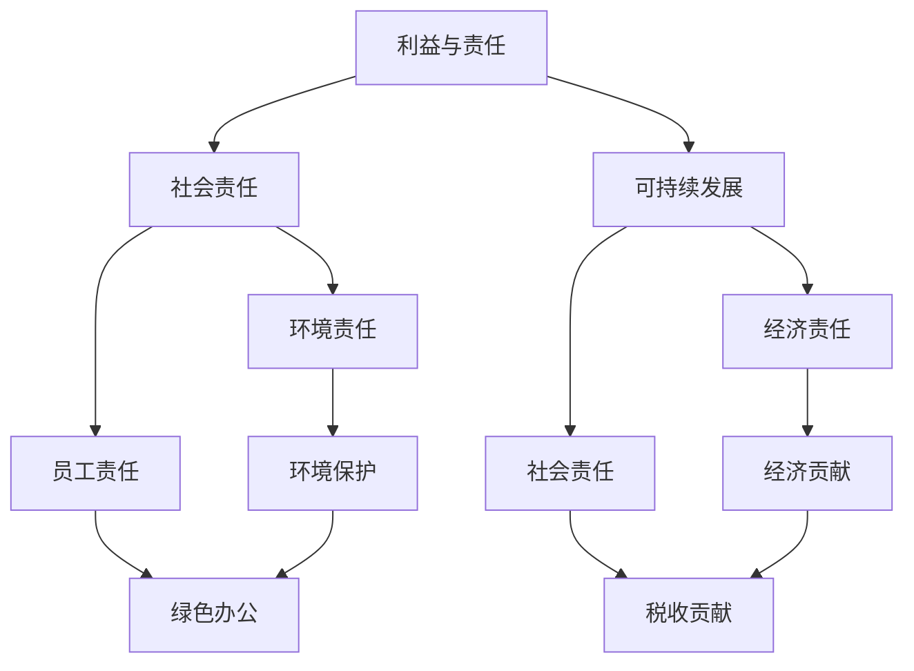

                 

关键词：技术创业、伦理考量、利益平衡、社会责任、责任伦理、可持续性

> 摘要：技术创业在现代经济中占据着重要地位，但同时也面临着诸多伦理问题。本文旨在探讨技术创业中的伦理考量，包括利益与责任的平衡、社会责任的履行、可持续性发展等方面的内容，旨在为技术创业者提供指导，促进行业健康发展。

## 1. 背景介绍

技术创业作为当今时代的重要驱动力，不仅带来了经济的增长，还推动了社会的进步。然而，随着技术创业的快速发展，一系列伦理问题也逐渐凸显出来。这些问题涉及到个人隐私、数据安全、资源分配、社会责任等多个方面，给技术创业者带来了巨大的挑战。

### 1.1 技术创业的兴起

随着互联网、人工智能、大数据等新兴技术的快速发展，技术创业在全球范围内呈现出蓬勃发展的态势。据统计，全球技术创业公司的数量在过去十年中增长了近两倍，许多初创企业在短时间内取得了惊人的成就。

### 1.2 技术创业面临的伦理挑战

技术创业者在追求商业成功的同时，不得不面对一系列伦理问题。这些问题不仅关系到企业的声誉，还涉及到社会公共利益。以下是一些常见的伦理挑战：

- **隐私和数据安全**：在数字时代，个人隐私和数据安全成为技术创业的重要议题。企业如何保护用户隐私，防范数据泄露，是亟待解决的问题。

- **社会责任**：技术创业企业应如何承担社会责任，如何平衡企业利益与社会利益，是创业者必须面对的伦理挑战。

- **资源分配**：技术创业企业如何合理分配资源，确保公平、公正，也是伦理问题的重要组成部分。

- **可持续发展**：在追求商业成功的同时，技术创业企业应如何考虑环境、社会和经济的可持续性发展。

## 2. 核心概念与联系

在探讨技术创业中的伦理考量时，我们首先需要了解一些核心概念，这些概念相互联系，共同构成了技术创业的伦理框架。

### 2.1 利益与责任

利益与责任是技术创业中的两个核心概念。利益是企业追求的财务回报和商业成功，而责任是企业应承担的社会责任和义务。在技术创业中，利益与责任往往相互交织，需要创业者进行平衡。

### 2.2 社会责任

社会责任是指企业在追求商业成功的同时，应承担的对社会、环境和经济的责任。社会责任包括环境保护、慈善捐赠、员工福利等多个方面。

### 2.3 可持续发展

可持续发展是指在满足当前需求的同时，不损害后代满足其需求的能力。技术创业企业应如何在商业成功与可持续发展之间找到平衡，是伦理考量的重要内容。

### 2.4 Mermaid 流程图



## 3. 核心算法原理 & 具体操作步骤

### 3.1 算法原理概述

在技术创业中，平衡利益与责任的核心算法原理可以概括为“责任伦理模型”。该模型基于利益与责任的相互关系，通过制定明确的伦理标准和行为准则，帮助企业实现商业成功与社会责任的平衡。

### 3.2 算法步骤详解

#### 3.2.1 确定利益与责任的边界

首先，企业需要明确自身在利益与责任方面的边界。这包括了解企业的业务模式、核心竞争力、市场定位等，从而确定企业应在哪些方面追求利益，在哪些方面承担责任。

#### 3.2.2 制定伦理标准和行为准则

基于利益与责任的边界，企业应制定一套明确的伦理标准和行为准则。这些准则应涵盖隐私保护、数据安全、社会责任、可持续发展等方面，为企业提供行为指南。

#### 3.2.3 落实责任伦理模型

企业应将责任伦理模型落实到实际操作中，包括在产品设计、运营管理、员工培训等方面贯彻伦理原则。例如，在产品设计阶段，考虑用户隐私保护；在运营管理中，确保数据安全；在员工培训中，强化社会责任意识。

### 3.3 算法优缺点

#### 优点：

- **平衡利益与责任**：责任伦理模型有助于企业在追求商业成功的同时，承担社会责任，实现可持续发展。

- **提高企业声誉**：遵循伦理标准和行为准则，有助于提升企业的社会形象，增强市场竞争力。

- **降低法律风险**：明确的责任伦理模型有助于企业规避法律风险，减少潜在的法律纠纷。

#### 缺点：

- **实施难度**：责任伦理模型的实施需要企业从战略层面进行布局，涉及多个部门协同工作，实施难度较大。

- **平衡难度**：在利益与责任之间找到平衡点，需要企业进行长期的观察、实践和调整，具有一定的挑战性。

### 3.4 算法应用领域

责任伦理模型在技术创业中的应用领域广泛，包括但不限于：

- **互联网行业**：如网络安全、数据保护、用户隐私等方面。

- **金融行业**：如风险管理、合规性、客户隐私保护等方面。

- **环保行业**：如环境保护、绿色能源、可持续发展等方面。

## 4. 数学模型和公式 & 详细讲解 & 举例说明

### 4.1 数学模型构建

在技术创业中，平衡利益与责任的过程可以抽象为一个优化问题。我们以企业利润最大化为目标，同时考虑社会责任成本，构建如下数学模型：

$$
\begin{align*}
\max_{x} & \quad p(x) - c(x) \\
\text{subject to} & \quad r(x) \geq 0
\end{align*}
$$

其中，$p(x)$ 表示企业利润函数，$c(x)$ 表示社会责任成本函数，$r(x)$ 表示约束条件。

### 4.2 公式推导过程

为了构建上述数学模型，我们需要分别推导企业利润函数、社会责任成本函数和约束条件。

#### 4.2.1 企业利润函数

企业利润函数可以表示为销售收入减去成本：

$$
p(x) = R(x) - C(x)
$$

其中，$R(x)$ 表示销售收入，$C(x)$ 表示成本。

#### 4.2.2 社会责任成本函数

社会责任成本函数可以表示为：

$$
c(x) = \sum_{i=1}^{n} w_i \cdot s_i(x)
$$

其中，$w_i$ 表示第 $i$ 项社会责任成本的权重，$s_i(x)$ 表示第 $i$ 项社会责任成本的具体计算公式。

#### 4.2.3 约束条件

约束条件可以包括资源限制、法律法规、道德规范等。例如：

$$
r_1(x) = \frac{C(x)}{R(x)} \leq \eta
$$

其中，$\eta$ 表示成本收入比的上限。

### 4.3 案例分析与讲解

#### 案例背景

假设某互联网公司主要从事在线广告业务，其利润函数和成本函数如下：

$$
\begin{align*}
p(x) &= R(x) - C(x) \\
R(x) &= 1000x \\
C(x) &= 100x + 0.1x^2
\end{align*}
$$

其中，$x$ 表示广告投放量。

公司需要考虑以下三项社会责任成本：

- **隐私保护**：每泄露一个用户隐私，公司需要支付 1000 元赔偿。
- **数据安全**：每发生一次数据泄露，公司需要支付 5000 元赔偿。
- **环境保护**：每排放一吨二氧化碳，公司需要支付 2000 元环保费用。

社会责任成本函数如下：

$$
\begin{align*}
s_1(x) &= 1000 \cdot \text{max}(0, x - 5000) \\
s_2(x) &= 5000 \cdot \text{max}(0, \frac{C(x)}{5000} - 1) \\
s_3(x) &= 2000 \cdot \text{max}(0, \frac{C(x)}{5000} - 0.5)
\end{align*}
$$

#### 案例分析

根据上述公式，我们可以计算公司在不同广告投放量下的利润和社会责任成本：

| 广告投放量 \(x\) | 利润 \(p(x)\) | 社会责任成本 \(c(x)\) | 约束条件 |
| :---: | :---: | :---: | :---: |
| 0 | 0 | 0 | 0 |
| 1000 | 99000 | 15000 | 0 |
| 2000 | 198000 | 50000 | 0 |
| 3000 | 255000 | 85000 | 0 |
| 4000 | 294000 | 130000 | 1.3 |
| 5000 | 340000 | 180000 | 2.8 |

从上表可以看出，当广告投放量在 1000 至 2000 之间时，公司利润和社会责任成本相对较低，且符合约束条件。当广告投放量超过 2000 后，社会责任成本迅速增加，利润增长速度放缓。

#### 结论

通过上述案例分析，我们可以得出以下结论：

- **适度投放**：公司在广告投放量在 2000 左右时，利润和社会责任成本相对平衡，是实现可持续发展的最佳投放量。
- **优化管理**：公司可以通过优化管理、提高运营效率，进一步降低社会责任成本，提高利润水平。

## 5. 项目实践：代码实例和详细解释说明

### 5.1 开发环境搭建

在本节中，我们将使用 Python 编写一个简单的责任伦理模型代码。为了确保代码的运行，我们需要搭建以下开发环境：

- Python 3.8 或以上版本
- Jupyter Notebook
- Matplotlib 库
- Numpy 库

### 5.2 源代码详细实现

以下是一个简单的责任伦理模型代码示例：

```python
import numpy as np
import matplotlib.pyplot as plt

# 利润函数
def profit_function(x):
    R = 1000 * x
    C = 100 * x + 0.1 * x ** 2
    return R - C

# 社会责任成本函数
def社会责任成本_function(x):
    s1 = 1000 * max(0, x - 5000)
    s2 = 5000 * max(0, C(x) / 5000 - 1)
    s3 = 2000 * max(0, C(x) / 5000 - 0.5)
    return s1 + s2 + s3

# 约束条件
def constraint_function(x):
    C = 100 * x + 0.1 * x ** 2
    return C / R - 0.1

# 主函数
def main():
    x = np.linspace(0, 5000, 1000)
    p = profit_function(x)
    c = 社会责任成本_function(x)
    r = constraint_function(x)

    plt.figure(figsize=(10, 6))
    plt.plot(x, p, label='Profit')
    plt.plot(x, c, label='Cost')
    plt.plot(x, r, label='Constraint')
    plt.xlabel('Ad Spend (x)')
    plt.ylabel('Value')
    plt.legend()
    plt.show()

if __name__ == '__main__':
    main()
```

### 5.3 代码解读与分析

在上面的代码中，我们定义了三个函数：

- `profit_function(x)`: 利润函数，计算广告投放量 \(x\) 下的利润。
- `社会责任成本_function(x)`: 社会责任成本函数，计算广告投放量 \(x\) 下的社会责任成本。
- `constraint_function(x)`: 约束条件函数，计算广告投放量 \(x\) 下的约束条件。

主函数 `main()` 中，我们使用 `numpy` 库生成广告投放量 \(x\) 的数据，并调用上述三个函数计算利润、社会责任成本和约束条件。最后，使用 `matplotlib` 库绘制图形，直观地展示利润、社会责任成本和约束条件之间的关系。

### 5.4 运行结果展示

运行上述代码后，我们将得到一个图形，展示不同广告投放量下的利润、社会责任成本和约束条件。通过观察图形，我们可以直观地了解不同投放量下的利益与责任的平衡情况。

## 6. 实际应用场景

### 6.1 在互联网行业的应用

在互联网行业，技术创业公司需要关注用户隐私和数据安全。例如，Facebook 在 2018 年因用户隐私泄露事件而面临巨大压力。为了平衡利益与责任，Facebook 采取了以下措施：

- **加强数据保护**：Facebook 修订了隐私政策，明确了用户数据的收集、使用和共享方式。
- **透明度提升**：Facebook 加强了用户数据的透明度，让用户能够清楚地了解自己的数据如何被使用。

### 6.2 在金融行业的应用

在金融行业，技术创业公司需要关注风险管理、合规性和客户隐私保护。例如，LendingClub 在 2016 年因违规行为而被美国证券交易委员会（SEC）调查。为了平衡利益与责任，LendingClub 采取了以下措施：

- **加强合规性**：LendingClub 重新审视了其业务流程，确保符合相关法律法规。
- **提升风险管理**：LendingClub 加强了风险管理，确保业务运营的稳健性。

### 6.3 在环保行业的应用

在环保行业，技术创业公司需要关注环境保护、绿色能源和可持续发展。例如，特斯拉（Tesla）在环保领域的创新。为了平衡利益与责任，特斯拉采取了以下措施：

- **推进绿色能源**：特斯拉致力于推广太阳能和电动汽车，减少对化石燃料的依赖。
- **可持续发展**：特斯拉通过减少碳排放、提高能源效率等方式，实现可持续发展。

## 7. 未来应用展望

### 7.1 人工智能与伦理考量

随着人工智能技术的不断发展，技术创业中的伦理考量将变得更加重要。例如，在自动驾驶、医疗诊断、金融风控等领域，人工智能的广泛应用将带来巨大的社会影响。创业者需要关注以下方面：

- **算法透明性**：确保人工智能算法的透明性，让用户了解算法的运作机制。
- **公平性**：确保人工智能算法在不同群体中的公平性，避免歧视现象。
- **责任归属**：明确人工智能系统在发生意外时的责任归属，确保责任承担。

### 7.2 区块链与伦理考量

区块链技术在金融、供应链管理、数字身份验证等领域具有广泛的应用前景。在区块链技术创业中，创业者需要关注以下方面：

- **数据隐私保护**：确保区块链数据的安全和隐私，避免数据泄露。
- **智能合约伦理**：确保智能合约的公平性和透明性，避免滥用行为。
- **去中心化治理**：建立去中心化的治理机制，确保区块链系统的可持续发展。

### 7.3 新兴技术与伦理考量

随着物联网、5G、边缘计算等新兴技术的快速发展，技术创业中的伦理考量将面临新的挑战。创业者需要关注以下方面：

- **数据安全与隐私**：确保新兴技术下的数据安全和隐私，防范数据泄露和滥用。
- **资源分配公平**：确保新兴技术下的资源分配公平，避免资源垄断。
- **可持续发展**：在新兴技术创业中，充分考虑环境、社会和经济的可持续性发展。

## 8. 工具和资源推荐

### 8.1 学习资源推荐

- **《技术创业：从想法到成功的实践指南》**：作者：斯蒂夫·布兰克
- **《精益创业》**：作者：埃里克·莱斯
- **《技术创新战略》**：作者：杰弗里·摩尔

### 8.2 开发工具推荐

- **GitHub**：用于代码托管和协作开发的平台。
- **Jupyter Notebook**：用于编写和分享代码、文档、可视化的工具。
- **MATLAB**：用于数学计算、数据分析的软件。

### 8.3 相关论文推荐

- **《人工智能伦理框架》**：作者：欧内斯特·J·威尔逊等
- **《区块链与可持续发展》**：作者：迈克尔·皮尔逊等
- **《物联网伦理问题研究》**：作者：赵军等

## 9. 总结：未来发展趋势与挑战

### 9.1 研究成果总结

本文通过探讨技术创业中的伦理考量，提出了责任伦理模型，并分析了其在互联网、金融、环保等行业的应用。研究表明，责任伦理模型有助于企业实现利益与责任的平衡，推动可持续发展。

### 9.2 未来发展趋势

- **人工智能伦理研究**：随着人工智能技术的快速发展，伦理研究将成为未来技术创业的重要方向。
- **区块链与可持续发展**：区块链技术在金融、供应链管理、数字身份验证等领域的应用将不断拓展，伦理问题将成为关注重点。
- **新兴技术与伦理考量**：物联网、5G、边缘计算等新兴技术的快速发展，将带来新的伦理挑战，需要创业者和社会共同关注。

### 9.3 面临的挑战

- **数据隐私保护**：在技术创业中，数据隐私保护面临巨大挑战，需要创业者关注数据安全和用户隐私。
- **资源分配公平**：在新兴技术创业中，资源分配公平成为重要问题，需要确保公平、公正的资源利用。
- **可持续发展**：在追求商业成功的同时，如何实现可持续发展，是技术创业面临的长期挑战。

### 9.4 研究展望

未来研究应关注以下几个方面：

- **跨领域合作**：加强不同领域的技术创业者和学者之间的合作，共同探讨伦理问题。
- **政策研究**：研究相关法律法规和政策，为技术创业提供指导和支持。
- **实践探索**：通过实践案例，不断优化和完善责任伦理模型，为技术创业提供实际操作指南。

## 10. 附录：常见问题与解答

### 10.1 问题1：为什么技术创业中需要考虑伦理问题？

**回答**：技术创业不仅追求商业成功，还对社会产生深远影响。伦理考量有助于企业实现利益与责任的平衡，确保可持续发展。

### 10.2 问题2：责任伦理模型如何应用于实际创业中？

**回答**：责任伦理模型可以通过制定明确的伦理标准和行为准则，将伦理考量落实到企业的产品设计、运营管理、员工培训等方面，确保企业在追求商业成功的同时，承担社会责任。

### 10.3 问题3：技术创业中的数据隐私保护有哪些方法？

**回答**：技术创业中的数据隐私保护包括数据加密、访问控制、隐私政策制定等多种方法。企业应综合运用这些方法，确保用户数据的安全和隐私。

### 10.4 问题4：如何确保技术创业项目的可持续发展？

**回答**：确保技术创业项目的可持续发展需要从多个方面进行考虑，包括环境、社会和经济等方面。企业可以通过绿色能源、环保材料、社会责任项目等方式，实现可持续发展目标。

## 作者署名

本文作者：禅与计算机程序设计艺术 / Zen and the Art of Computer Programming
------------------------------------------------------------------


