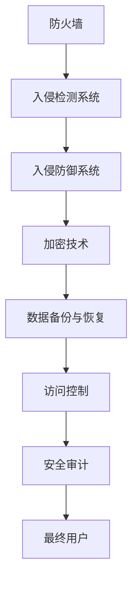

                 

关键词：网络安全、数据保护、创业、技术策略、数据资产

> 摘要：本文深入探讨了技术创业过程中网络安全的重要性，并提出了保护数据资产的策略。文章首先介绍了网络安全的基本概念，然后分析了技术创业中的主要网络安全风险，最后提出了具体的保护数据资产的策略，包括技术、管理和法律手段。通过本文的阅读，读者可以全面了解网络安全在技术创业中的关键作用，并学会如何有效保护其数据资产。

## 1. 背景介绍

随着互联网技术的快速发展，创业公司如雨后春笋般涌现。这些公司依靠技术创新和数据分析来迅速占领市场，但同时也面临着前所未有的网络安全挑战。技术创业公司通常规模较小，资源有限，但其数据资产却往往至关重要，包括用户信息、知识产权和商业机密等。这些数据一旦泄露，不仅会对公司造成巨大的经济损失，还可能导致声誉受损，甚至引发法律诉讼。

网络安全是指在网络环境中保护系统、数据和资源免受未经授权的访问、破坏、篡改和泄露的过程。它涵盖了多种技术和策略，包括防火墙、加密、身份验证、入侵检测等。网络安全不仅仅是技术问题，更是一个涉及组织文化、管理流程和法律合规的综合挑战。

本文将首先介绍网络安全的基本概念，然后分析技术创业中的主要网络安全风险，最后提出一系列保护数据资产的策略，旨在帮助创业公司建立有效的网络安全防御体系。

### 1.1 网络安全的重要性

网络安全对技术创业公司的重要性不言而喻。首先，数据是现代企业的核心资产，无论是用户信息、商业策略还是开发过程中的代码，都是公司竞争力的体现。保护这些数据资产不仅能够保障公司的持续运营，还能够提升用户信任度，增强品牌价值。

其次，随着网络安全威胁的不断升级，技术创业公司面临的潜在风险也越来越大。网络攻击的手段层出不穷，包括钓鱼攻击、分布式拒绝服务攻击（DDoS）、恶意软件、数据泄露等。这些攻击可能导致公司系统瘫痪、数据丢失，甚至影响业务运营，对公司的财务状况和声誉造成致命打击。

最后，网络安全问题还涉及到法律合规的层面。在全球范围内，数据保护法规日益严格，如欧盟的《通用数据保护条例》（GDPR）和美国的《加州消费者隐私法案》（CCPA）。技术创业公司如果不遵守这些法规，可能会面临巨额罚款和诉讼风险。

综上所述，网络安全是技术创业公司成功的关键因素之一，必须引起足够的重视。在接下来的章节中，我们将详细探讨网络安全的基本概念、技术创业中的主要风险以及具体的保护策略。

## 2. 核心概念与联系

### 2.1 网络安全的基本概念

网络安全是一个多层次的、多维度的概念，它涉及到系统、网络、应用和数据等多个层面。以下是网络安全中几个关键的基本概念：

- **威胁**：指对系统或数据的潜在危害。威胁可以来自内部或外部，包括恶意软件、黑客攻击、物理入侵等。
- **漏洞**：指系统或网络中存在的弱点，这些弱点可能被威胁利用。漏洞可能是设计缺陷、配置错误或软件漏洞等。
- **攻击**：指对系统或数据的实际入侵或破坏行为。攻击可以是漏洞利用、拒绝服务攻击（DoS）、数据篡改等。
- **防御**：指采取的措施来阻止或减轻威胁和攻击。防御措施包括防火墙、入侵检测系统（IDS）、加密技术等。
- **监控**：指实时监控网络活动，以检测潜在的威胁和攻击。监控可以通过日志分析、流量分析等方式进行。

### 2.2 数据资产的分类与保护

数据资产是技术创业公司最重要的资产之一，根据其重要性、敏感性和用途，可以分为以下几类：

- **用户数据**：包括用户的个人信息、行为数据等，如电子邮件地址、密码、浏览历史等。用户数据通常是攻击者最感兴趣的目标，因为它们可以用来进行身份盗窃、诈骗等。
- **知识产权**：包括专利、商标、版权和商业秘密等。这些数据不仅代表公司的技术实力，还涉及公司的核心竞争优势。
- **业务数据**：包括客户信息、交易数据、市场调研数据等，这些数据对于公司的业务运营和战略决策至关重要。
- **内部数据**：包括公司内部的管理信息、财务数据等，这些数据可能对外部来说不太敏感，但对公司内部来说却至关重要。

保护数据资产需要根据数据类型和风险等级采取相应的保护措施。以下是一些常见的保护措施：

- **数据加密**：对敏感数据进行加密，确保数据在传输和存储过程中不被未授权访问。
- **访问控制**：通过身份验证和授权机制限制对数据的访问，确保只有授权用户才能访问敏感数据。
- **备份与恢复**：定期备份数据，并在数据丢失或损坏时能够迅速恢复，以减少损失。
- **安全培训与意识**：对员工进行网络安全培训，提高他们对安全威胁的认识和应对能力。
- **漏洞扫描与修复**：定期进行漏洞扫描，及时发现和修复系统中的漏洞，减少被攻击的风险。

### 2.3 数据保护的法律与法规

在全球范围内，数据保护法规日益严格。以下是一些主要的法规：

- **欧盟的《通用数据保护条例》（GDPR）**：规定了数据处理者的义务和权利，包括数据主体（用户）的知情权、访问权、删除权等。
- **美国的《加州消费者隐私法案》（CCPA）**：规定了消费者对其个人数据的权利，包括知情权、访问权、删除权和不同意权。
- **中国的《网络安全法》**：规定了网络运营者的安全保护义务和用户个人信息保护的基本原则。

遵守这些法规对于技术创业公司至关重要，不仅可以避免法律风险，还能提高用户信任度，增强市场竞争力。

### 2.4 网络安全架构

网络安全架构是确保系统、网络和数据安全的整体框架。一个典型的网络安全架构包括以下组件：

- **防火墙**：监控进出网络的数据包，阻止未经授权的访问。
- **入侵检测系统（IDS）和入侵防御系统（IPS）**：检测和防御网络攻击。
- **加密技术**：保护数据在传输和存储过程中的机密性。
- **数据备份与恢复**：确保数据的安全性和可用性。
- **访问控制**：管理对系统和数据的访问权限。
- **安全审计**：记录和审查系统活动，确保合规性。

以上组件共同构成了一个多层次、多角度的网络安全防御体系，能够有效应对各种网络威胁。

### 2.5 Mermaid 流程图

为了更直观地展示网络安全架构，我们使用 Mermaid 流程图来描述各个组件之间的关系：



这个流程图展示了网络安全架构的核心组件及其相互关系，为读者提供了一个清晰的网络安全全景视图。

## 3. 核心算法原理 & 具体操作步骤

### 3.1 算法原理概述

在网络安全领域，核心算法的原理和操作步骤至关重要。这些算法不仅是防御网络攻击的基础，也是保护数据资产的关键手段。以下是几个重要的网络安全算法及其基本原理：

1. **加密算法**：加密算法通过将明文转换为密文来保护数据的机密性。常见的加密算法有对称加密（如AES）和非对称加密（如RSA）。对称加密算法使用相同的密钥进行加密和解密，而非对称加密算法使用一对密钥，其中公钥加密，私钥解密。
2. **身份认证算法**：身份认证算法用于验证用户或系统的身份。常见的身份认证算法有密码学哈希函数（如SHA-256）和基于证书的公钥基础设施（PKI）。密码学哈希函数通过将输入数据转换为一个固定长度的字符串来确保数据的完整性，而PKI则通过数字证书来验证实体身份。
3. **访问控制算法**：访问控制算法用于管理对系统和资源的访问权限。常见的访问控制算法包括基于角色的访问控制（RBAC）和基于属性的访问控制（ABAC）。RBAC通过将用户与角色关联，并根据角色分配权限来管理访问，而ABAC则根据用户属性（如部门、职位等）来动态调整权限。
4. **入侵检测算法**：入侵检测算法用于监控网络流量和系统活动，以识别潜在的攻击。常见的入侵检测算法包括基于特征的检测和基于异常的检测。基于特征的检测通过识别已知的攻击模式来检测入侵，而基于异常的检测则通过分析网络行为中的异常模式来识别入侵。

### 3.2 算法步骤详解

以下是这些算法的具体步骤：

#### 3.2.1 加密算法

**对称加密（AES）**：

1. 选择密钥长度（如128位、192位或256位）。
2. 选择加密模式（如CBC、CTR等）。
3. 初始化向量（IV）。
4. 对数据进行分块加密。
5. 将密文输出。

**非对称加密（RSA）**：

1. 选择两个大素数p和q。
2. 计算n=p*q。
3. 计算欧拉函数φ(n)=(p-1)*(q-1)。
4. 选择一个小于φ(n)的整数e，使得gcd(e,φ(n))=1。
5. 计算私钥d，使得d*e≡1 mod φ(n)。
6. 对数据进行加密。
7. 将密文输出。

#### 3.2.2 身份认证算法

**密码学哈希函数（SHA-256）**：

1. 将输入数据分组（每次处理512位）。
2. 初始化哈希值。
3. 对每个分组进行压缩。
4. 将压缩结果与上一步的哈希值合并。
5. 输出最终的哈希值。

**基于证书的公钥基础设施（PKI）**：

1. 生成公钥和私钥。
2. 使用CA（证书颁发机构）为实体生成数字证书。
3. 客户端使用证书来验证实体身份。
4. 实体使用私钥来签署数据。

#### 3.2.3 访问控制算法

**基于角色的访问控制（RBAC）**：

1. 定义角色和权限。
2. 将用户与角色关联。
3. 为每个角色分配权限。
4. 验证用户的角色，并根据角色权限进行访问控制。

**基于属性的访问控制（ABAC）**：

1. 定义属性（如部门、职位等）。
2. 定义访问策略，包括属性值和权限。
3. 验证用户的属性。
4. 根据访问策略和用户属性决定访问权限。

#### 3.2.4 入侵检测算法

**基于特征的检测**：

1. 收集网络流量数据。
2. 定义已知的攻击特征。
3. 搜索流量数据中的攻击特征。
4. 报警并阻止攻击。

**基于异常的检测**：

1. 收集网络流量数据。
2. 训练正常行为的模型。
3. 分析流量数据，识别异常行为。
4. 报警并阻止异常行为。

### 3.3 算法优缺点

**加密算法**：

- **优点**：保护数据的机密性，防止未授权访问。
- **缺点**：加密和解密过程需要计算资源，可能影响性能。

**身份认证算法**：

- **优点**：确保用户身份的真实性，防止身份盗窃。
- **缺点**：可能受到密码泄露或证书伪造的攻击。

**访问控制算法**：

- **优点**：管理对系统和资源的访问，防止未授权访问。
- **缺点**：可能导致权限过于严格，影响系统可用性。

**入侵检测算法**：

- **优点**：及时发现和阻止网络攻击。
- **缺点**：可能误报正常行为，影响系统性能。

### 3.4 算法应用领域

这些算法广泛应用于网络安全领域，如：

- **加密**：保护数据在传输和存储过程中的机密性。
- **身份认证**：确保用户身份的真实性，防止未经授权的访问。
- **访问控制**：管理对系统和资源的访问权限，确保系统的安全。
- **入侵检测**：监控网络流量和系统活动，识别和阻止潜在的攻击。

通过了解这些算法的原理和操作步骤，技术创业公司可以更好地保护其数据资产，确保系统的安全性。

## 4. 数学模型和公式 & 详细讲解 & 举例说明

### 4.1 数学模型构建

在网络安全领域，数学模型是分析和设计安全策略的重要工具。以下是一个简单的数学模型，用于评估系统遭受网络攻击的风险。

#### 4.1.1 模型假设

假设系统面临以下几种类型的攻击：

- **漏洞利用攻击**：利用系统中的漏洞进行攻击。
- **暴力破解攻击**：尝试通过猜测密码等手段非法访问系统。
- **拒绝服务攻击（DoS）**：通过大量无效请求使系统瘫痪。

我们定义以下参数：

- \( V \)：系统中的漏洞数量。
- \( P_V \)：每个漏洞被利用的概率。
- \( P_B \)：暴力破解成功的概率。
- \( P_{DoS} \)：DoS 攻击成功的概率。
- \( R \)：每次攻击成功的损失金额。

#### 4.1.2 数学模型

根据上述假设，我们可以构建以下数学模型来计算系统遭受攻击的风险：

\[ R_{total} = R_V \cdot P_V + R_B \cdot P_B + R_{DoS} \cdot P_{DoS} \]

其中：

- \( R_V \)：每个漏洞利用攻击的损失金额。
- \( R_B \)：每次暴力破解成功的损失金额。
- \( R_{DoS} \)：每次 DoS 攻击成功的损失金额。

### 4.2 公式推导过程

为了推导上述公式，我们需要分析每种攻击类型对系统的损失。

#### 漏洞利用攻击

漏洞利用攻击的损失金额可以通过以下公式计算：

\[ R_V = V \cdot P_V \cdot R \]

其中，\( V \cdot P_V \) 表示系统中的漏洞数量乘以每个漏洞被利用的概率，表示可能发生的漏洞利用攻击次数。每次漏洞利用攻击的损失金额为 \( R \)，因此总损失金额为 \( R_V \)。

#### 暴力破解攻击

暴力破解攻击的损失金额可以通过以下公式计算：

\[ R_B = P_B \cdot R \]

其中，\( P_B \) 表示暴力破解成功的概率，每次暴力破解成功的损失金额为 \( R \)，因此总损失金额为 \( R_B \)。

#### 拒绝服务攻击（DoS）

DoS 攻击的损失金额可以通过以下公式计算：

\[ R_{DoS} = P_{DoS} \cdot R \]

其中，\( P_{DoS} \) 表示 DoS 攻击成功的概率，每次 DoS 攻击成功的损失金额为 \( R \)，因此总损失金额为 \( R_{DoS} \)。

#### 总损失金额

将上述三个部分相加，即可得到系统遭受攻击的总损失金额：

\[ R_{total} = R_V \cdot P_V + R_B \cdot P_B + R_{DoS} \cdot P_{DoS} \]

### 4.3 案例分析与讲解

为了更好地理解上述数学模型，我们来看一个具体的案例。

#### 案例背景

一家创业公司开发了一款在线办公软件，系统面临以下风险：

- **漏洞利用攻击**：系统中有10个已知的漏洞，每个漏洞被利用的概率为0.1，每次漏洞利用攻击的损失金额为5000元。
- **暴力破解攻击**：攻击者尝试每天猜测1000次密码，每次成功的概率为0.01，每次暴力破解成功的损失金额为2000元。
- **DoS 攻击**：每次 DoS 攻击成功的概率为0.05，每次 DoS 攻击成功的损失金额为10000元。

#### 模型计算

根据上述参数，我们可以计算出公司系统遭受攻击的总风险：

\[ R_{total} = (10 \cdot 0.1 \cdot 5000) + (0.01 \cdot 2000) + (0.05 \cdot 10000) \]
\[ R_{total} = 5000 + 20 + 500 \]
\[ R_{total} = 5520 \]

因此，该公司系统每天遭受攻击的总损失金额为5520元。

#### 结果分析

通过这个案例，我们可以看到公司系统面临的风险，并根据这些风险采取相应的安全措施。例如，公司可以加强漏洞修复工作，提高密码安全性，并部署 DoS 防御措施，以降低总损失金额。

### 4.4 模型应用范围

这个数学模型可以应用于各种技术创业公司的网络安全风险评估。通过调整模型中的参数，公司可以评估不同类型攻击的风险，并采取相应的防护措施。

总之，数学模型为技术创业公司提供了一个有力的工具，帮助它们理解和应对网络安全风险，确保系统的安全运营。

## 5. 项目实践：代码实例和详细解释说明

### 5.1 开发环境搭建

为了演示如何实现网络安全策略中的加密和访问控制功能，我们将使用 Python 编写一个简单的后端服务。以下是基于 Flask 框架的搭建步骤：

#### 步骤1：安装 Python 和 Flask

确保已经安装了 Python 3.x 版本。然后，通过以下命令安装 Flask：

```bash
pip install flask
```

#### 步骤2：创建 Flask 应用

在终端中创建一个新的文件夹，并使用以下命令初始化 Flask 应用：

```bash
flask init myapp
```

这个命令会自动生成 `myapp.py` 文件，以及一些配置文件和模板文件。

#### 步骤3：设置数据库

我们使用 SQLite 作为数据库。首先，安装 Flask-SQLAlchemy：

```bash
pip install flask_sqlalchemy
```

然后在 `myapp.py` 文件中设置数据库连接：

```python
from flask import Flask
from flask_sqlalchemy import SQLAlchemy

app = Flask(__name__)
app.config['SQLALCHEMY_DATABASE_URI'] = 'sqlite:///users.db'
db = SQLAlchemy(app)
```

接下来，创建用户模型：

```python
class User(db.Model):
    id = db.Column(db.Integer, primary_key=True)
    username = db.Column(db.String(80), unique=True, nullable=False)
    password_hash = db.Column(db.String(120), nullable=False)
```

运行以下命令创建数据库和表：

```bash
flask db init
flask db migrate
flask db upgrade
```

### 5.2 源代码详细实现

在 `myapp.py` 文件中，实现以下功能：

- 用户注册和登录
- 数据加密和解密
- 基于角色的访问控制

#### 步骤1：用户注册和登录

用户注册时，我们将用户名和密码加密存储在数据库中。使用 Flask-Login 来管理用户登录状态。

首先，安装 Flask-Login：

```bash
pip install flask-login
```

然后在 `myapp.py` 文件中初始化 Flask-Login：

```python
from flask_login import LoginManager, login_user, logout_user, login_required

login_manager = LoginManager()
login_manager.init_app(app)
login_manager.login_view = 'login'

@login_manager.user_loader
def load_user(user_id):
    return User.query.get(int(user_id))
```

用户注册和登录的实现如下：

```python
from flask import request, redirect, url_for, render_template
from werkzeug.security import generate_password_hash, check_password_hash

@app.route('/register', methods=['GET', 'POST'])
def register():
    if request.method == 'POST':
        username = request.form['username']
        password = request.form['password']
        if not username or not password:
            return '用户名或密码不能为空！'
        user = User.query.filter_by(username=username).first()
        if user:
            return '用户已存在！'
        new_user = User(username=username, password_hash=generate_password_hash(password))
        db.session.add(new_user)
        db.session.commit()
        return redirect(url_for('login'))
    return render_template('register.html')

@app.route('/login', methods=['GET', 'POST'])
def login():
    if request.method == 'POST':
        username = request.form['username']
        password = request.form['password']
        user = User.query.filter_by(username=username).first()
        if user and check_password_hash(user.password_hash, password):
            login_user(user)
            return redirect(url_for('protected'))
        return '用户名或密码错误！'
    return render_template('login.html')
```

#### 步骤2：数据加密和解密

我们使用 `cryptography` 库来实现数据加密和解密。

首先，安装 `cryptography`：

```bash
pip install cryptography
```

然后，实现加密和解密函数：

```python
from cryptography.fernet import Fernet

def generate_key():
    return Fernet.generate_key()

def encrypt_data(key, data):
    f = Fernet(key)
    return f.encrypt(data.encode())

def decrypt_data(key, encrypted_data):
    f = Fernet(key)
    return f.decrypt(encrypted_data).decode()
```

#### 步骤3：基于角色的访问控制

我们使用 `Flask-Principal` 来实现基于角色的访问控制。

首先，安装 `Flask-Principal`：

```bash
pip install flask-principal
```

然后在 `myapp.py` 文件中初始化 `Flask-Principal`：

```python
from flask_principal import Principal, Permission, RoleNeed

principal = Principal(app)
permission_policy = Permission(RoleNeed('admin'), RoleNeed('user'))
```

为用户分配角色，并实现访问控制：

```python
def role_required(role):
    def wrapper(f):
        @wraps(f)
        def wrapped(*args, **kwargs):
            if principal.identity.has_role(role):
                return f(*args, **kwargs)
            return '无权访问！'
        return wrapped
    return wrapper

@app.route('/protected')
@login_required
@role_required('user')
def protected():
    return '欢迎用户！'

@app.route('/admin')
@login_required
@role_required('admin')
def admin():
    return '欢迎管理员！'
```

### 5.3 代码解读与分析

上述代码实现了用户注册、登录、数据加密和解密以及基于角色的访问控制。以下是关键部分的解读：

- **用户注册和登录**：用户注册时，使用 `generate_password_hash` 函数将密码加密存储在数据库中。登录时，使用 `check_password_hash` 函数验证用户输入的密码是否正确。
- **数据加密和解密**：使用 `cryptography` 库的 `Fernet` 类实现数据加密和解密。`generate_key` 函数生成加密密钥，`encrypt_data` 函数加密数据，`decrypt_data` 函数解密数据。
- **基于角色的访问控制**：使用 `Flask-Principal` 库实现基于角色的访问控制。`role_required` 装饰器用于检查用户是否拥有指定角色，如果没有权限则返回无权访问提示。

### 5.4 运行结果展示

运行 Flask 应用后，访问 `http://127.0.0.1:5000/register` 可以进行用户注册，访问 `http://127.0.0.1:5000/login` 可以进行用户登录。成功注册和登录后，访问 `http://127.0.0.1:5000/protected` 将显示欢迎用户页面，而访问 `http://127.0.0.1:5000/admin` 将显示无权访问提示。

通过这个示例，我们可以看到如何在实际项目中实现网络安全策略中的加密和访问控制功能。这些功能对于保护用户数据和确保系统安全至关重要。

## 6. 实际应用场景

在技术创业公司的实际应用场景中，网络安全策略的实践和效果可以显著影响公司的成功与否。以下是几个具体的实际应用场景，展示如何在实际环境中实施和评估网络安全策略。

### 6.1 用户数据保护

用户数据是技术创业公司最宝贵的资产之一。例如，一家提供在线教育服务的创业公司需要确保学生的个人信息和学习记录安全。在实际应用中，公司可以采取以下措施：

- **数据加密存储**：将用户的个人信息和学习记录进行加密存储，确保数据在数据库中即使被未授权访问也难以读取。
- **严格访问控制**：通过角色和权限管理，确保只有授权员工可以访问用户数据，并记录所有访问日志。
- **数据备份和恢复**：定期备份数据，并确保在数据丢失或损坏时能够迅速恢复，以减少潜在损失。

### 6.2 知识产权保护

知识产权包括专利、商标和版权等，它们是技术创业公司的核心竞争力。例如，一家开发人工智能算法的创业公司需要保护其算法模型和源代码。

- **代码加密和混淆**：将源代码进行加密和混淆处理，使得攻击者难以理解和修改代码。
- **分布式存储**：将知识产权数据分散存储在不同的地理位置，提高数据安全性。
- **实时监控**：通过监控系统和入侵检测，及时发现和阻止对知识产权的非法访问和盗用行为。

### 6.3 业务数据保护

业务数据包括客户信息、交易数据和财务数据等，对于公司的业务运营至关重要。例如，一家电子商务公司需要确保客户订单数据和支付信息的安全。

- **安全传输协议**：使用 HTTPS 等安全传输协议，确保数据在传输过程中不被窃取或篡改。
- **多因素认证**：在关键业务操作（如支付）中使用多因素认证，增加账户的安全性。
- **实时审计**：实时监控系统活动，确保所有交易记录可追溯，以便在出现问题时进行审计。

### 6.4 安全审计与合规性

在技术创业公司中，安全审计和合规性检查是确保网络安全策略有效性的重要手段。例如，一家公司需要遵守GDPR等数据保护法规。

- **定期安全审计**：定期进行安全审计，检查系统漏洞、访问控制和加密措施等是否符合安全标准和法规要求。
- **合规性检查**：确保公司操作符合相关法规要求，如数据收集、存储、处理和传输等环节。
- **培训和教育**：对员工进行安全意识和合规性培训，确保他们了解和遵守公司安全政策和法规要求。

### 6.5 风险评估与应对

在技术创业公司的实际应用中，网络安全风险评估是预防潜在威胁的重要步骤。以下是一个风险评估和应对的示例：

- **风险评估**：通过对公司系统的漏洞扫描、威胁分析和历史攻击数据，评估系统面临的风险。
- **应急响应**：制定详细的应急响应计划，包括攻击检测、响应和恢复步骤。
- **安全培训**：定期组织安全培训，提高员工对网络威胁的认识和应对能力。

### 6.6 成功案例

以一家成功的技术创业公司为例，该公司通过实施全面的网络安全策略，成功保护了其数据资产，并实现了业务的快速增长。以下是该公司的一些成功实践：

- **数据加密**：公司对用户数据进行全面加密，确保数据在存储和传输过程中安全。
- **多因素认证**：公司采用多因素认证，防止未经授权的访问。
- **实时监控**：公司部署了实时监控系统，确保能够及时发现和应对潜在的威胁。
- **合规性管理**：公司严格遵守相关数据保护法规，确保合规性。

通过这些实践，该公司成功保护了其数据资产，赢得了用户的信任，并实现了业务的快速增长。

### 6.7 总结

在技术创业公司的实际应用场景中，网络安全策略的实施效果直接关系到公司的成功与否。通过采取数据加密、严格访问控制、实时监控、多因素认证和安全审计等措施，公司可以有效保护其数据资产，确保业务的持续健康发展。同时，定期进行风险评估和培训，提高员工的安全意识和技能，也是保障网络安全的重要环节。

## 7. 工具和资源推荐

### 7.1 学习资源推荐

为了深入了解网络安全和数据保护，以下是几个推荐的学习资源：

- **《网络安全基础教程》**：这是一本适合初学者的入门书籍，涵盖了网络安全的各个方面，包括基础概念、加密技术、入侵检测等。
- **《黑客攻防技术宝典：系统实战篇》**：这本书详细介绍了黑客攻击的技术和防御方法，对于了解攻击手段和防御策略非常有帮助。
- **《Python网络编程》**：这本书介绍了如何在Python中实现网络编程，包括TCP/IP协议、网络通信和网络安全等内容。
- **《OWASP Top 10》**：OWASP Top 10 是一个关于网络应用安全的重要列表，列出了最常见和最危险的漏洞类型，是网络安全人员必读的资源。

### 7.2 开发工具推荐

以下是一些常用的网络安全和数据保护工具：

- **Wireshark**：这是一个强大的网络协议分析工具，可以帮助你捕获和分析网络数据包，了解网络通信的细节。
- **Nmap**：这是一个网络映射工具，用于扫描网络上的主机和端口，识别系统漏洞和开放端口。
- **Burp Suite**：这是一个综合性的网络攻击和漏洞扫描工具，用于进行安全测试和漏洞分析。
- **Kali Linux**：这是一个专门用于网络安全的Linux发行版，内置了多种网络攻击和安全测试工具。

### 7.3 相关论文推荐

以下是一些关于网络安全和数据保护的优秀论文，供进一步研究：

- **"A Systematic Review of Cloud Security Issues and Challenges"**：这篇论文详细分析了云计算环境中的安全问题，包括数据泄露、服务中断和隐私保护等。
- **"A Comprehensive Survey on Cyber-Physical Systems Security"**：这篇论文讨论了物联网和工业控制系统中的安全问题，以及相应的防护策略。
- **"On the Security of Deep Learning"**：这篇论文探讨了深度学习在网络安全中的应用，以及如何保护深度学习模型免受攻击。
- **"Privacy-Preserving Deep Learning in Federated Learning"**：这篇论文介绍了如何在联邦学习环境中实现隐私保护，以确保数据隐私的同时进行深度学习训练。

通过这些工具和资源，读者可以更深入地了解网络安全和数据保护的相关知识，提升自身在技术创业中的网络安全防护能力。

## 8. 总结：未来发展趋势与挑战

### 8.1 研究成果总结

随着网络安全威胁的不断升级，技术创业公司在网络安全方面的研究成果也日益丰富。近年来，以下几个方面的研究取得了显著进展：

1. **加密算法的优化与应用**：加密算法是网络安全的核心技术，近年来出现了许多优化和改进的加密算法，如量子加密、同态加密和基于椭圆曲线的加密算法。这些算法在保护数据隐私和安全方面具有巨大的潜力。
2. **人工智能与网络安全**：人工智能技术被广泛应用于网络安全领域，包括入侵检测、恶意软件识别和威胁预测等。通过机器学习和深度学习算法，可以实现对网络流量的实时监控和异常检测，提高网络安全防护能力。
3. **分布式系统与区块链**：分布式系统和区块链技术在提高数据安全性和透明性方面具有显著优势。通过分布式存储和去中心化网络，可以减少单点故障和攻击风险。区块链技术的不可篡改性为数据完整性提供了有力保障。
4. **云计算与边缘计算**：随着云计算和边缘计算的普及，网络安全面临新的挑战。如何在云环境和边缘设备中实现高效安全的数据处理和传输，成为当前研究的热点。

### 8.2 未来发展趋势

在未来的网络安全领域，以下趋势值得关注：

1. **量子计算与量子安全**：量子计算具有巨大的计算能力，但同时也带来了新的安全挑战。如何在量子计算时代确保数据安全，成为未来研究的重要方向。量子安全协议和量子密钥分发技术有望成为解决这一问题的关键。
2. **边缘安全与物联网**：随着物联网设备的增多，边缘安全成为一个重要课题。如何保护海量物联网设备的数据安全，确保网络边缘的设备安全，是未来网络安全研究的重要方向。
3. **人工智能与自动化**：人工智能技术在网络安全中的应用将越来越广泛，包括自动化威胁检测、响应和防御。通过自动化技术，可以提高网络安全的效率和效果。
4. **零信任架构**：零信任架构是一种全新的安全理念，强调不再依赖内部网络的安全边界，而是通过身份验证和访问控制确保所有访问请求的安全。这种架构有望在未来得到更广泛的应用。

### 8.3 面临的挑战

尽管网络安全领域取得了许多进展，但技术创业公司仍然面临一系列挑战：

1. **数据隐私与合规性**：随着数据保护法规的日益严格，技术创业公司需要在数据收集、存储和处理过程中确保合规性。如何在保护用户隐私的同时满足法规要求，是公司面临的重大挑战。
2. **安全人才短缺**：网络安全领域的人才需求快速增长，但高质量的安全人才却供不应求。技术创业公司难以招聘和留住专业安全人员，影响网络安全防护能力。
3. **攻击手段多样化**：网络攻击手段日益多样化，包括勒索软件、钓鱼攻击、分布式拒绝服务（DDoS）等。技术创业公司需要不断更新和改进安全策略，以应对不断变化的攻击手段。
4. **资源有限**：技术创业公司通常资源有限，难以投入大量资金和人力进行网络安全防护。如何在有限的资源下实现高效的安全防护，是公司需要解决的重要问题。

### 8.4 研究展望

未来，网络安全领域的研究将更加深入和多元化。以下是一些建议的研究方向：

1. **跨领域协同研究**：结合人工智能、物联网、量子计算等领域的最新进展，开展跨领域的协同研究，以应对新兴的网络安全挑战。
2. **安全架构与设计**：深入研究网络安全架构和设计原则，提高系统的安全性和可维护性。
3. **安全教育与培训**：加强网络安全教育和培训，提高全社会对网络安全的认知和意识，培养更多专业的网络安全人才。
4. **安全技术与法规的融合**：推动安全技术与法规的深度融合，确保技术创业公司在遵守法规的同时实现高效的安全防护。

总之，网络安全是技术创业公司成功的关键因素之一。通过不断的研究和创新，技术创业公司可以应对未来的网络安全挑战，保护其数据资产，实现可持续发展。

## 9. 附录：常见问题与解答

### 9.1 网络安全基本概念

**Q1：什么是网络安全？**

A1：网络安全是指保护计算机系统和网络不受未经授权的访问、破坏、篡改或泄露的过程。它涵盖了多种技术和策略，如防火墙、加密、身份验证、入侵检测等。

**Q2：网络安全包括哪些方面？**

A2：网络安全包括多个层面，如物理安全、网络安全、应用安全、数据安全和管理安全。物理安全涉及保护硬件和设备，网络安全涉及保护网络基础设施，应用安全涉及保护软件和应用程序，数据安全涉及保护数据完整性，管理安全涉及制定和执行安全策略。

### 9.2 数据保护

**Q3：什么是数据保护？**

A3：数据保护是指确保数据在存储、传输和处理过程中不被未授权访问、泄露或破坏的一系列措施。它包括加密、访问控制、备份和恢复等。

**Q4：如何保护用户数据？**

A4：保护用户数据的方法包括：

- **数据加密**：使用加密技术保护数据在存储和传输过程中的机密性。
- **访问控制**：通过身份验证和权限管理确保只有授权用户才能访问敏感数据。
- **备份与恢复**：定期备份数据，确保在数据丢失或损坏时能够迅速恢复。
- **数据脱敏**：对敏感数据进行脱敏处理，以防止信息泄露。

### 9.3 网络安全策略

**Q5：什么是网络安全策略？**

A5：网络安全策略是一套指导和规范，用于定义组织在网络安全方面的目标和行动。它包括风险评估、安全控制、应急响应、安全审计等。

**Q6：如何制定网络安全策略？**

A6：制定网络安全策略的步骤包括：

- **风险评估**：识别系统中的安全漏洞和潜在威胁。
- **确定安全目标**：根据风险评估结果，制定明确的安全目标和措施。
- **制定安全控制措施**：选择和实施合适的安全控制措施，如防火墙、入侵检测系统、加密等。
- **培训与意识**：对员工进行网络安全培训，提高安全意识和应对能力。
- **监控与审计**：定期监控网络安全状态，进行安全审计，确保策略的有效实施。

### 9.4 法律与法规

**Q7：什么是《通用数据保护条例》（GDPR）？**

A7：GDPR是欧盟于2018年实施的《通用数据保护条例》，旨在加强个人数据的保护。它规定了数据处理者的义务和权利，包括数据主体（用户）的知情权、访问权、删除权等。

**Q8：如何遵守GDPR？**

A8：遵守GDPR的方法包括：

- **数据最小化**：仅收集必要的数据，并确保数据被正确处理。
- **透明度**：向数据主体明确告知数据处理的目的、方式、范围等。
- **数据访问与删除**：数据主体有权访问和删除其个人信息。
- **安全措施**：采取适当的安全措施保护个人数据，防止数据泄露、篡改或丢失。
- **记录和报告**：记录数据处理活动，并在发生数据泄露时及时报告。

通过这些常见问题的解答，技术创业公司可以更好地理解网络安全和数据保护的基本概念、方法和法规要求，从而制定和实施有效的安全策略。

