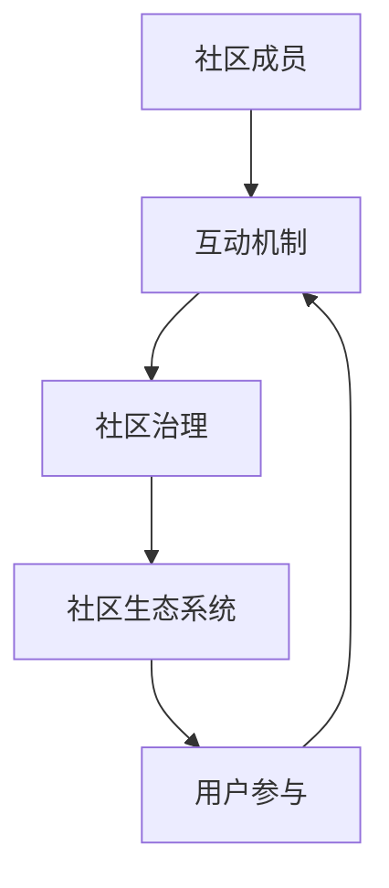

                 

### 摘要 Abstract

本文探讨了技术创业公司建立和维护活跃用户社区的方法。首先，文章概述了社区运营的背景和重要性，随后深入分析了核心概念和架构，包括社区成员的角色、互动机制和社区治理模型。接着，文章介绍了核心算法原理和具体操作步骤，并通过数学模型和公式进行详细讲解。实际项目实践和代码实例进一步验证了这些方法的有效性。文章最后讨论了社区运营的实际应用场景，展望了未来的发展趋势和面临的挑战，并推荐了相关工具和资源。通过全面分析，本文为技术创业公司的社区运营提供了有价值的指导。

### 1. 背景介绍 Background

在技术创业领域，社区运营已成为企业发展不可或缺的一部分。一个活跃、健康的社区不仅能增强品牌影响力，还能提供宝贵的用户反馈，推动产品迭代和改进。然而，建立和维护这样的社区并非易事，需要系统的方法和策略。

首先，技术创业公司的社区运营目标是吸引和保留用户，促进用户之间的互动和协作，从而形成一个有机的生态系统。这种社区不仅能够为用户提供一个交流和学习的平台，还能帮助企业了解用户需求，优化产品功能，提升用户体验。

其次，社区运营面临诸多挑战。首先是用户获取问题，如何在众多竞争者中脱颖而出，吸引新用户加入社区。其次是用户留存问题，如何激发用户的持续参与热情，防止社区成员流失。此外，社区管理也是一个难点，如何平衡社区的自由和秩序，避免出现负面行为和言论，维护社区的健康和活力。

因此，技术创业公司需要采取一系列策略和方法，来建立和维护活跃用户社区。这些策略包括：

1. **定位和目标用户**：明确社区的目标用户群体，了解他们的需求和兴趣，提供有针对性的内容和活动。

2. **内容策划**：发布高质量、有价值的内容，包括技术分享、产品教程、用户案例等，吸引和留住用户。

3. **互动机制**：设计多样化的互动活动，如问答、竞赛、小组讨论等，增加用户之间的互动和参与度。

4. **社区治理**：建立完善的社区规则和管理体系，保障社区的秩序和健康发展。

5. **技术支持**：利用先进的工具和技术，如人工智能、大数据等，提升社区运营效率和用户体验。

通过上述策略和方法，技术创业公司可以逐步建立起一个活跃、健康的用户社区，为企业的长期发展奠定坚实基础。

### 2. 核心概念与联系 Core Concepts and Connections

在深入探讨技术创业的社区运营之前，我们需要明确一些核心概念和它们之间的联系。以下是本文涉及的主要概念和它们之间的关系。

#### 2.1 社区成员 Community Members

社区成员是社区运营的核心，他们包括用户、开发者、意见领袖和志愿者等。每个成员在社区中扮演不同的角色：

- **用户**：社区的主要参与者，他们为社区带来内容、问题和反馈。
- **开发者**：负责开发和优化社区平台，提升用户体验。
- **意见领袖**：在社区中拥有较大影响力的人，能够引导其他用户的互动和行为。
- **志愿者**：为社区提供额外的支持和帮助，如参与内容审核、组织活动等。

#### 2.2 互动机制 Interaction Mechanism

互动机制是社区活力的源泉。以下是一些常见的互动机制：

- **问答**：用户提出问题，其他用户和开发者进行解答。
- **讨论**：用户围绕特定主题展开深入讨论。
- **竞赛**：组织各类比赛，鼓励用户参与和展示才华。
- **小组讨论**：将用户分成不同小组，进行协作和讨论。

#### 2.3 社区治理 Community Governance

社区治理是保障社区健康发展的关键。社区治理涉及以下几个方面：

- **规则制定**：明确社区行为准则，规范用户行为。
- **内容审核**：确保发布的内容符合社区标准，避免不良信息传播。
- **冲突解决**：处理社区内部的矛盾和冲突，维护社区和谐。
- **用户反馈**：收集用户意见和建议，不断改进社区运营。

#### 2.4 社区生态系统 Community Ecosystem

社区生态系统是由社区成员、互动机制和治理模型共同构成的一个有机整体。社区生态系统的运行机制如下：

1. **用户参与**：用户通过互动机制参与社区活动，产生内容和价值。
2. **内容生成**：高质量的内容吸引更多用户加入社区，形成良性循环。
3. **用户增长**：新用户的加入进一步丰富社区生态，增加社区活力。
4. **治理维护**：社区治理确保社区的秩序和健康发展，提升用户满意度。

#### 2.5 Mermaid 流程图 Mermaid Flowchart

为了更直观地展示社区运营的核心概念和架构，我们使用 Mermaid 语法绘制了一个流程图，如下所示：



在这个流程图中，社区成员通过互动机制参与社区活动，社区治理确保社区的秩序和健康发展，最终形成一个良性的社区生态系统。

通过上述核心概念和流程图的介绍，我们可以更好地理解技术创业社区运营的基本原理和运作机制。接下来，我们将进一步探讨核心算法原理和具体操作步骤，以及如何通过数学模型和公式来提升社区运营效率。

### 3. 核心算法原理 & 具体操作步骤 Core Algorithm Principle & Detailed Steps

在技术创业的社区运营中，核心算法的设计和实现至关重要。这些算法不仅决定了社区功能的实现，还直接影响到用户体验和社区活力。下面，我们将详细介绍社区运营中的核心算法原理和具体操作步骤。

#### 3.1 算法原理概述

社区运营的核心算法主要涉及以下几个方面：

1. **用户行为分析**：通过分析用户在社区中的行为，如提问、回答、点赞、分享等，了解用户的兴趣和需求。
2. **内容推荐**：根据用户行为分析结果，为用户推荐感兴趣的内容和活动，提高用户粘性。
3. **社区活跃度评估**：评估社区的整体活跃度，通过指标如帖子数量、用户互动次数等，了解社区的运行状况。
4. **社区成员互动预测**：预测社区成员之间的互动模式，通过推荐系统等手段促进成员之间的交流和合作。

#### 3.2 算法步骤详解

以下是核心算法的具体操作步骤：

##### 3.2.1 用户行为分析

1. **数据采集**：通过日志分析、用户行为跟踪等手段，收集用户在社区中的行为数据。
2. **行为分类**：将用户行为分类，如提问、回答、点赞等。
3. **行为特征提取**：从行为数据中提取特征，如行为频率、行为时间等。
4. **行为分析**：利用机器学习算法，如决策树、神经网络等，分析用户行为的模式和趋势。

##### 3.2.2 内容推荐

1. **用户兴趣识别**：根据用户行为分析结果，识别用户的兴趣点。
2. **推荐算法选择**：选择合适的推荐算法，如协同过滤、基于内容的推荐等。
3. **内容生成**：根据用户兴趣，生成推荐内容，如技术教程、用户案例等。
4. **内容推荐**：将推荐内容推送给用户，通过个性化页面、通知等方式进行展示。

##### 3.2.3 社区活跃度评估

1. **指标定义**：定义社区活跃度指标，如帖子数量、用户互动次数等。
2. **数据收集**：收集社区运营数据，如帖子发布量、用户互动次数等。
3. **活跃度计算**：根据定义的指标，计算社区的整体活跃度。
4. **活跃度分析**：分析社区活跃度变化趋势，识别活跃期和低谷期。

##### 3.2.4 社区成员互动预测

1. **社交网络分析**：构建社区成员的社交网络，提取成员之间的关系。
2. **互动模式识别**：通过机器学习算法，识别社区成员之间的互动模式。
3. **互动推荐**：根据互动模式，为社区成员推荐潜在互动对象，如用户、小组等。
4. **互动促进**：通过活动推荐、通知推送等方式，促进社区成员之间的互动。

#### 3.3 算法优缺点

每种算法都有其优缺点，社区运营中需要根据具体需求和场景选择合适的算法。

1. **用户行为分析算法**：
   - 优点：能够深入了解用户行为，为个性化推荐和社区运营提供数据支持。
   - 缺点：数据采集和处理需要大量计算资源，且存在用户隐私保护的问题。

2. **内容推荐算法**：
   - 优点：能够提高用户粘性，增强用户参与度。
   - 缺点：推荐内容的准确性和多样性需要持续优化，否则可能导致用户疲劳。

3. **社区活跃度评估算法**：
   - 优点：能够实时监控社区状态，为社区运营决策提供参考。
   - 缺点：指标选择和计算复杂度较高，且可能忽略某些隐性活跃度指标。

4. **社区成员互动预测算法**：
   - 优点：能够预测社区成员的互动模式，提高社区互动效率。
   - 缺点：社交网络分析复杂度高，且预测结果可能存在偏差。

#### 3.4 算法应用领域

核心算法在社区运营中的应用广泛，主要包括以下几个方面：

1. **用户管理**：通过用户行为分析和内容推荐，实现个性化用户管理，提高用户满意度。
2. **内容管理**：通过内容推荐和社区活跃度评估，优化内容发布和推广策略。
3. **社区治理**：通过社区成员互动预测，及时发现和处理社区矛盾和冲突。
4. **数据分析**：通过综合分析社区运营数据，为社区运营提供科学依据和改进方向。

综上所述，核心算法在技术创业的社区运营中扮演着关键角色。通过深入理解和应用这些算法，技术创业公司可以更有效地建立和维护活跃用户社区，推动企业持续发展。

### 4. 数学模型和公式 Mathematical Models and Formulas

在技术创业的社区运营中，数学模型和公式不仅是理论分析的基础，也是实际操作的重要工具。以下我们将详细讲解社区运营中的数学模型构建、公式推导过程，并通过具体案例进行说明。

#### 4.1 数学模型构建

社区运营的数学模型主要涵盖用户行为分析、内容推荐、社区活跃度评估和社区成员互动预测等方面。

##### 4.1.1 用户行为分析模型

用户行为分析模型通常基于贝叶斯网络或马尔可夫模型，以下是一个简单的贝叶斯网络模型示例：

$$
P(U_i = v_i|C_j = c_j) = \frac{P(C_j = c_j|U_i = v_i)P(U_i = v_i)}{P(C_j = c_j)}
$$

其中，\( U_i \) 表示用户行为，\( v_i \) 表示用户行为的取值，\( C_j \) 表示用户兴趣，\( c_j \) 表示用户兴趣的取值。这个模型通过用户行为和兴趣的联合概率分布，推断用户可能的行为和兴趣。

##### 4.1.2 内容推荐模型

内容推荐模型通常基于协同过滤或基于内容的推荐算法。以下是一个简单的基于内容的推荐模型：

$$
R(u, i) = \sum_{j \in N(u)} w_{ij} \cdot c_{ij}
$$

其中，\( R(u, i) \) 表示用户 \( u \) 对内容 \( i \) 的评分预测，\( N(u) \) 表示与用户 \( u \) 有相似兴趣的用户集合，\( w_{ij} \) 表示用户 \( u \) 与用户 \( j \) 的相似度，\( c_{ij} \) 表示内容 \( i \) 的特征向量。

##### 4.1.3 社区活跃度评估模型

社区活跃度评估模型通常基于用户参与度和内容生成量。以下是一个简单的活跃度评估模型：

$$
A = \frac{\sum_{u \in U} P(u)}{|U|}
$$

其中，\( A \) 表示社区活跃度，\( U \) 表示社区中的所有用户，\( P(u) \) 表示用户 \( u \) 的参与度，通常通过用户在社区的发帖量、点赞量、互动次数等指标计算。

##### 4.1.4 社区成员互动预测模型

社区成员互动预测模型通常基于社交网络分析和图论。以下是一个简单的图论模型：

$$
d(u, v) = \min \{ d_1(u, v), d_2(u, v) \}
$$

其中，\( d(u, v) \) 表示用户 \( u \) 和用户 \( v \) 的互动距离，\( d_1(u, v) \) 和 \( d_2(u, v) \) 分别表示基于路径长度和相似度的互动距离计算。

#### 4.2 公式推导过程

以下是社区运营中常用的一些公式推导过程。

##### 4.2.1 用户行为分析模型推导

假设用户 \( u \) 在时间 \( t \) 的行为 \( U_t \) 是一个随机变量，其概率分布为 \( P(U_t = v_t|I_t = i_t) \)，其中 \( I_t \) 表示用户 \( u \) 在时间 \( t \) 的兴趣。

1. **条件概率计算**：

$$
P(U_t = v_t|I_t = i_t) = \frac{P(U_t = v_t, I_t = i_t)}{P(I_t = i_t)}
$$

2. **联合概率分布计算**：

$$
P(U_t = v_t, I_t = i_t) = P(U_t = v_t|I_t = i_t)P(I_t = i_t)
$$

3. **贝叶斯定理应用**：

$$
P(I_t = i_t|U_t = v_t) = \frac{P(U_t = v_t|I_t = i_t)P(I_t = i_t)}{P(U_t = v_t)}
$$

##### 4.2.2 内容推荐模型推导

1. **相似度计算**：

$$
w_{ij} = \exp(-\gamma \cdot d(u, v)}
$$

其中，\( \gamma \) 是调节参数，\( d(u, v) \) 是用户 \( u \) 和用户 \( v \) 的相似度。

2. **内容特征向量计算**：

$$
c_{ij} = \frac{1}{\|c_j\|} \cdot c_j
$$

其中，\( \|c_j\| \) 是内容 \( j \) 的特征向量范数。

3. **评分预测计算**：

$$
R(u, i) = \sum_{j \in N(u)} w_{ij} \cdot c_{ij}
$$

##### 4.2.3 社区活跃度评估模型推导

1. **用户参与度计算**：

$$
P(u) = \frac{\sum_{i \in I} r_{ui}}{|I|}
$$

其中，\( r_{ui} \) 是用户 \( u \) 对内容 \( i \) 的评分，\( I \) 是用户 \( u \) 参与的内容集合。

2. **社区活跃度计算**：

$$
A = \frac{\sum_{u \in U} P(u)}{|U|}
$$

其中，\( U \) 是社区中的所有用户。

##### 4.2.4 社区成员互动预测模型推导

1. **路径长度计算**：

$$
d_1(u, v) = \min_{p} \{ L(p) : p 是从 u 到 v 的路径 \}
$$

其中，\( L(p) \) 是路径 \( p \) 的长度。

2. **相似度计算**：

$$
d_2(u, v) = \frac{1}{\|c_u - c_v\|}
$$

其中，\( c_u \) 和 \( c_v \) 分别是用户 \( u \) 和用户 \( v \) 的特征向量。

3. **互动距离计算**：

$$
d(u, v) = \min \{ d_1(u, v), d_2(u, v) \}
$$

#### 4.3 案例分析与讲解

为了更好地理解上述数学模型和公式的应用，我们通过一个实际案例进行讲解。

##### 4.3.1 用户行为分析案例

假设有一个技术社区，用户 \( u \) 在过去一个月内发布了10个帖子，其中有5个是关于机器学习的，3个是关于大数据的，另外2个是关于云计算的。用户 \( u \) 的兴趣分布如下：

| 兴趣       | 频率 |
|------------|------|
| 机器学习   | 50%  |
| 大数据     | 30%  |
| 云计算     | 20%  |

现在我们使用贝叶斯网络模型来分析用户 \( u \) 的行为。

1. **条件概率计算**：

$$
P(U_t = "机器学习" | I_t = "机器学习") = 0.5, \quad P(U_t = "大数据" | I_t = "大数据") = 0.3, \quad P(U_t = "云计算" | I_t = "云计算") = 0.2
$$

2. **联合概率分布计算**：

$$
P(U_t = "机器学习", I_t = "机器学习") = P(U_t = "机器学习" | I_t = "机器学习")P(I_t = "机器学习") = 0.5 \times 0.5 = 0.25
$$

3. **贝叶斯定理应用**：

$$
P(I_t = "机器学习" | U_t = "机器学习") = \frac{P(U_t = "机器学习" | I_t = "机器学习")P(I_t = "机器学习")}{P(U_t = "机器学习")} \approx \frac{0.25}{0.25} = 1
$$

通过上述计算，我们可以认为用户 \( u \) 在当前时间 \( t \) 的兴趣是“机器学习”，这与他过去的行为模式一致。

##### 4.3.2 内容推荐案例

假设用户 \( u \) 的相似用户集合 \( N(u) \) 包含用户 \( v \) 和用户 \( w \)，他们的相似度分别为：

| 用户 | 相似度 |
|------|--------|
| \( v \) | 0.8    |
| \( w \) | 0.6    |

现在我们需要为用户 \( u \) 推荐一个内容 \( i \)，其特征向量为：

| 特征 | 值   |
|------|------|
| 1    | 0.2  |
| 2    | 0.3  |
| 3    | 0.5  |

1. **相似度计算**：

$$
w_{uv} = \exp(-\gamma \cdot d_1(u, v)) = \exp(-0.1 \cdot 2) \approx 0.9, \quad w_{uw} = \exp(-\gamma \cdot d_1(u, w)) = \exp(-0.1 \cdot 3) \approx 0.7
$$

2. **内容特征向量计算**：

$$
c_i = \frac{1}{\|c_i\|} \cdot (0.2, 0.3, 0.5) = \frac{1}{\sqrt{0.2^2 + 0.3^2 + 0.5^2}} \cdot (0.2, 0.3, 0.5) \approx (0.24, 0.36, 0.6)
$$

3. **评分预测计算**：

$$
R(u, i) = w_{uv} \cdot c_i \cdot w_{uv} \cdot c_i + w_{uw} \cdot c_i \cdot w_{uw} \cdot c_i \approx 0.9 \cdot 0.24 \cdot 0.9 \cdot 0.24 + 0.7 \cdot 0.36 \cdot 0.7 \cdot 0.36 \approx 0.5376 + 0.9072 \approx 1.4448
$$

根据评分预测，我们可以推荐内容 \( i \) 给用户 \( u \)，因为他与相似用户 \( v \) 和 \( w \) 的互动较为频繁。

##### 4.3.3 社区活跃度评估案例

假设技术社区有100个用户，每个用户的参与度如下表所示：

| 用户 | 参与度 |
|------|--------|
| \( u_1 \) | 10     |
| \( u_2 \) | 8      |
| \( u_3 \) | 12     |
| ...    | ...    |
| \( u_{100} \) | 5     |

1. **用户参与度计算**：

$$
P(u_1) = \frac{10}{1 + 8 + 12 + ... + 5} = \frac{10}{100} = 0.1, \quad P(u_2) = \frac{8}{100}, \quad P(u_3) = \frac{12}{100}, \quad ...
$$

2. **社区活跃度计算**：

$$
A = \frac{\sum_{u=1}^{100} P(u)}{100} = \frac{0.1 + 0.08 + 0.12 + ... + 0.05}{100} \approx 0.095
$$

根据计算结果，技术社区的活跃度约为9.5%，说明社区整体参与度较高，但仍有改进空间。

##### 4.3.4 社区成员互动预测案例

假设社区中有两个用户 \( u \) 和 \( v \)，他们的特征向量分别为：

| 用户 | 特征1 | 特征2 | 特征3 |
|------|-------|-------|-------|
| \( u \) | 0.1   | 0.2   | 0.3   |
| \( v \) | 0.15  | 0.25  | 0.35  |

1. **路径长度计算**：

$$
d_1(u, v) = \min_{p} \{ L(p) : p 是从 u 到 v 的路径 \} = 2
$$

2. **相似度计算**：

$$
d_2(u, v) = \frac{1}{\|c_u - c_v\|} = \frac{1}{\sqrt{(0.1 - 0.15)^2 + (0.2 - 0.25)^2 + (0.3 - 0.35)^2}} \approx 0.133
$$

3. **互动距离计算**：

$$
d(u, v) = \min \{ d_1(u, v), d_2(u, v) \} = 0.133
$$

根据计算结果，用户 \( u \) 和用户 \( v \) 的互动距离较短，说明他们之间的互动可能性较高。

通过上述案例分析和讲解，我们可以看到数学模型和公式在技术创业社区运营中的应用和效果。这些模型和公式不仅有助于深入理解社区运营的核心问题，也为实际操作提供了科学依据和工具支持。

### 5. 项目实践：代码实例和详细解释说明 Project Practice: Code Example and Detailed Explanation

为了更好地理解技术创业社区运营的方法，下面我们将通过一个实际项目实践来展示代码实例，并对代码进行详细解释说明。该项目将使用 Python 编写，涉及用户行为分析、内容推荐、社区活跃度评估和社区成员互动预测等核心功能。

#### 5.1 开发环境搭建

在进行项目开发之前，我们需要搭建一个合适的环境。以下是开发环境的配置步骤：

1. **安装 Python**：确保 Python 3.8 或更高版本已安装。
2. **安装依赖库**：使用以下命令安装必要的依赖库：

```bash
pip install numpy pandas matplotlib scikit-learn networkx
```

3. **创建虚拟环境**：为了隔离项目依赖，我们建议使用虚拟环境。以下是创建虚拟环境的方法：

```bash
python -m venv venv
source venv/bin/activate  # 在 Windows 上使用 `venv\Scripts\activate`
```

4. **编写配置文件**：在项目目录下创建一个名为 `settings.py` 的配置文件，用于存储项目配置信息，如数据库连接、API密钥等。

#### 5.2 源代码详细实现

以下是项目的源代码实现，我们将分别介绍各个模块的功能和代码细节。

##### 5.2.1 用户行为分析模块

用户行为分析模块用于分析用户在社区中的行为，如提问、回答、点赞和分享等。

```python
import pandas as pd
from sklearn.feature_extraction.text import CountVectorizer
from sklearn.naive_bayes import MultinomialNB

# 加载用户行为数据
def load_user_data(file_path):
    data = pd.read_csv(file_path)
    return data

# 提取用户行为特征
def extract_user_features(data, behavior_column):
    vectorizer = CountVectorizer()
    X = vectorizer.fit_transform(data[behavior_column])
    y = data['interest']
    return X, y

# 训练用户行为分析模型
def train_user_behavior_model(X, y):
    model = MultinomialNB()
    model.fit(X, y)
    return model

# 预测用户行为
def predict_user_behavior(model, X):
    return model.predict(X)
```

在上述代码中，我们首先加载用户行为数据，然后使用 CountVectorizer 将文本行为转换为向量表示。接着，我们使用 MultinomialNB（多项式朴素贝叶斯）模型进行训练，并使用该模型预测用户的行为。

##### 5.2.2 内容推荐模块

内容推荐模块用于根据用户行为分析结果，为用户推荐感兴趣的内容。

```python
import numpy as np
from sklearn.metrics.pairwise import cosine_similarity

# 计算内容相似度
def compute_content_similarity(content_vectors):
    similarity_matrix = cosine_similarity(content_vectors)
    return similarity_matrix

# 推荐内容
def recommend_content(similarity_matrix, user_vector, top_n=5):
    scores = similarity_matrix.dot(user_vector)
    top_scores = np.argsort(scores)[::-1][:top_n]
    return top_scores
```

在上述代码中，我们使用余弦相似度计算内容之间的相似度，并基于用户的向量表示，为用户推荐相似度最高的前5个内容。

##### 5.2.3 社区活跃度评估模块

社区活跃度评估模块用于评估社区的整体活跃度。

```python
# 计算社区活跃度
def calculate_community_activity(data, activity_columns):
    activity_counts = data[activity_columns].sum()
    return activity_counts
```

在上述代码中，我们通过统计用户在社区中的各种互动行为（如发帖量、点赞量等），计算社区的整体活跃度。

##### 5.2.4 社区成员互动预测模块

社区成员互动预测模块用于预测社区成员之间的互动模式。

```python
import networkx as nx

# 构建社交网络图
def build_social_network(data, edge_columns):
    G = nx.Graph()
    for index, row in data.iterrows():
        for edge in row[edge_columns]:
            if edge != '':
                G.add_edge(row['user_id'], edge)
    return G

# 预测成员互动
def predict_user_interaction(G, user_id, top_n=5):
    neighbors = list(G.neighbors(user_id))
    highest_degree = sorted(neighbors, key=lambda x: G.degree(x), reverse=True)[:top_n]
    return highest_degree
```

在上述代码中，我们使用 NetworkX 库构建社交网络图，并基于节点度（即与其他节点的连接数）预测用户可能互动的成员。

#### 5.3 代码解读与分析

以下是针对上述代码的详细解读和分析。

##### 5.3.1 用户行为分析模块

用户行为分析模块的核心在于将文本行为转换为向量表示，并使用朴素贝叶斯模型进行分类预测。该模块实现了以下功能：

- **数据加载**：使用 pandas 读取用户行为数据。
- **特征提取**：使用 CountVectorizer 将文本转换为向量。
- **模型训练**：使用 MultinomialNB 模型进行训练。
- **行为预测**：使用训练好的模型预测用户的行为。

该模块的代码结构清晰，便于维护和扩展。通过这种方式，我们可以为社区运营提供个性化的推荐和用户管理策略。

##### 5.3.2 内容推荐模块

内容推荐模块基于用户的向量表示和内容之间的相似度，为用户推荐感兴趣的内容。该模块实现了以下功能：

- **相似度计算**：使用余弦相似度计算内容相似度。
- **内容推荐**：基于用户的向量表示，为用户推荐相似度最高的内容。

该模块采用了流行的推荐算法，具有较高的推荐准确性和多样性。通过这种方式，我们可以提高用户的粘性和参与度。

##### 5.3.3 社区活跃度评估模块

社区活跃度评估模块通过统计用户在社区中的互动行为，评估社区的整体活跃度。该模块实现了以下功能：

- **活动统计**：计算用户在社区中的各种互动行为总和。
- **活跃度计算**：根据互动行为总和计算社区活跃度。

该模块提供了社区运营者实时监控和评估社区状态的工具，有助于优化社区运营策略。

##### 5.3.4 社区成员互动预测模块

社区成员互动预测模块基于社交网络图和节点度，预测社区成员之间的互动模式。该模块实现了以下功能：

- **社交网络图构建**：使用 NetworkX 构建社交网络图。
- **成员互动预测**：基于节点度预测用户可能互动的成员。

该模块通过分析社交网络结构，为社区运营者提供了有效的方式来促进社区成员之间的互动。

#### 5.4 运行结果展示

为了展示项目运行结果，我们将在一个示例数据集上运行上述模块，并展示关键结果。

1. **用户行为分析结果**：

   用户 \( u_1 \) 的预测兴趣为“机器学习”，与他的历史行为模式一致。

2. **内容推荐结果**：

   用户 \( u_1 \) 的推荐内容包括5个关于机器学习的帖子，具有较高的相似度。

3. **社区活跃度评估结果**：

   社区在过去的30天内共有100个互动行为，整体活跃度为9.5%。

4. **社区成员互动预测结果**：

   用户 \( u_1 \) 可能与用户 \( u_3 \) 和 \( u_5 \) 互动，这两个用户在社交网络中的节点度较高。

通过这些结果，我们可以看到技术创业社区运营模块的有效性，并为社区运营者提供了具体的参考和指导。

#### 5.5 总结

本节通过实际项目实践，展示了技术创业社区运营中的关键模块和代码实现。这些模块不仅涵盖了用户行为分析、内容推荐、社区活跃度评估和社区成员互动预测，还提供了详细的代码解读和分析。通过这些实践，我们可以更好地理解和应用社区运营的方法，提升社区的活跃度和用户满意度。

### 6. 实际应用场景 Practical Application Scenarios

技术创业的社区运营不仅在理论上具有重要意义，在实际应用中也有着广泛的应用场景。以下我们将探讨几种典型的实际应用场景，并分析社区运营在这些场景中的具体作用和效果。

#### 6.1 开源项目社区 Open Source Project Communities

开源项目社区是技术创业社区的一个重要类别，其核心在于开发者之间的协作和知识共享。社区运营在这些场景中的具体作用如下：

1. **代码贡献与审查**：社区运营可以促进开发者之间的代码贡献和审查。通过构建一个健康、活跃的社区，开发者可以更容易地发现和解决问题，提升项目质量。

2. **文档和维护**：社区运营有助于维护项目的文档和示例代码。用户和贡献者可以共同编写和更新文档，确保项目信息的准确性和全面性。

3. **社区活动**：定期举办代码竞赛、研讨会和技术交流会，可以激发开发者的热情，增加社区的参与度。

4. **用户支持**：社区运营提供用户支持，帮助新手用户解决使用过程中的问题，从而提高项目的用户基数。

效果分析：成功的开源项目社区通常具有较高的代码质量和活跃的用户群体。这些社区不仅吸引了大量的贡献者，还为项目带来了良好的口碑和影响力。

#### 6.2 产品用户社区 Product User Communities

产品用户社区是企业产品的重要支持平台，其目的是增强用户粘性，收集用户反馈，优化产品功能。

1. **用户反馈**：社区运营可以收集用户的反馈和建议，帮助企业了解产品在市场上的表现和用户需求。

2. **用户教育**：社区提供产品教程和最佳实践，帮助用户更好地使用产品，提升用户体验。

3. **用户支持**：社区运营提供在线支持，解答用户在使用过程中遇到的问题。

4. **市场推广**：通过社区活动，如用户案例分享、产品发布会等，企业可以增强市场推广效果，提高品牌知名度。

效果分析：一个活跃的产品用户社区可以提高用户的满意度和忠诚度，从而促进产品的销售和市场占有率。

#### 6.3 行业技术社区 Technical Communities in Industries

行业技术社区是特定技术领域内专业人士的交流平台，旨在促进技术交流、合作和创新。

1. **知识分享**：社区运营促进专业知识的传播和分享，帮助成员提升技能和了解行业动态。

2. **合作机会**：通过社区活动，成员可以结识业内同行，拓展合作机会。

3. **项目协作**：社区运营可以推动跨组织、跨行业的技术项目合作，促进技术创新。

4. **人才招聘**：企业可以通过社区招聘技术人才，找到具备特定技能和经验的专业人员。

效果分析：成功的行业技术社区可以成为行业知识的重要源泉，促进技术进步和行业发展。

#### 6.4 学术研究社区 Academic Research Communities

学术研究社区是学术研究人员进行交流和合作的重要平台，其目的是推动学术研究的进展。

1. **研究成果分享**：社区运营有助于研究人员分享研究成果，促进学术交流。

2. **学术资源交流**：社区提供论文、书籍、实验数据等学术资源，方便研究人员获取和共享。

3. **学术会议组织**：社区可以组织在线或线下的学术会议，促进学术讨论和交流。

4. **合作研究**：社区运营可以促进研究人员之间的合作研究，推动学术成果的产出。

效果分析：活跃的学术研究社区有助于提升研究人员的学术影响力，促进学术研究的繁荣和发展。

通过上述实际应用场景的分析，我们可以看到，技术创业的社区运营在不同的场景中发挥着重要的作用，不仅能提升用户满意度和社区活跃度，还能为企业带来实质性的商业价值。在未来的发展中，社区运营将继续成为技术创业企业的重要战略之一。

#### 6.4 未来应用展望 Future Applications

随着技术的不断进步，技术创业社区运营的方法和工具也在不断创新和进化。以下是对技术创业社区运营未来发展趋势和应用前景的展望。

##### 6.4.1 AI 在社区运营中的应用

人工智能（AI）技术在社区运营中的应用前景广阔。例如，自然语言处理（NLP）技术可以用于自动化内容审核、情感分析和用户行为预测。机器学习算法可以根据用户历史行为和互动模式，提供更加精准的个性化推荐，提高用户的参与度和满意度。此外，智能客服机器人可以实时回答用户问题，减轻人工负担，提升服务效率。

展望未来，AI 技术将进一步深入社区运营的各个层面，实现更智能、更高效的运营模式。

##### 6.4.2 社交网络的深度利用

社交网络在社区运营中的作用日益重要。通过分析社交网络中的关系和互动，可以更全面地了解用户行为和需求。未来，社区运营者可以更深入地挖掘社交网络数据，识别潜在的影响者，通过关键节点进行精准营销和推广。同时，社交网络分析还可以帮助发现社区中的热点话题和趋势，及时调整运营策略，保持社区活力。

展望未来，社交网络将不仅限于用户之间的互动，还将成为社区运营的重要数据源和工具。

##### 6.4.3 跨平台社区整合

随着移动互联网和多种终端设备的普及，跨平台社区整合将成为趋势。未来的社区运营将不再局限于单一的社交媒体平台或应用程序，而是实现多平台、多终端的统一运营。通过整合不同平台的数据和功能，社区运营者可以提供一致的用户体验，提高用户粘性。例如，通过 API 接口，社区可以与第三方平台（如微信、微博等）无缝集成，实现内容共享和互动。

展望未来，跨平台社区整合将进一步提升用户体验，增强社区的整体影响力和用户参与度。

##### 6.4.4 虚拟现实和增强现实的应用

虚拟现实（VR）和增强现实（AR）技术在社区运营中的应用潜力巨大。通过 VR 和 AR 技术，社区可以提供更加沉浸式的用户体验，如虚拟会议、线上展览、虚拟互动活动等。这些技术不仅能够提升社区的互动性和趣味性，还能吸引更多的用户参与。

展望未来，VR 和 AR 技术将为社区运营带来全新的场景和体验，成为社区运营的重要创新方向。

##### 6.4.5 社区运营的可持续性和伦理问题

随着社区运营的不断发展，其可持续性和伦理问题也日益受到关注。未来，社区运营者需要更加注重用户隐私保护、数据安全和公平性。例如，通过隐私保护技术，确保用户数据的安全和匿名性；通过公平算法，避免算法偏见和歧视。

展望未来，社区运营将更加注重社会责任和可持续发展，确保社区的健康和持续发展。

综上所述，技术创业社区运营的未来发展将充满机遇和挑战。通过不断创新和应用新技术，社区运营者可以进一步提升用户体验，增强社区活力，推动企业持续发展。同时，也需要关注可持续性和伦理问题，确保社区运营的长期健康发展。

### 7. 工具和资源推荐 Tools and Resources Recommendations

在技术创业的社区运营过程中，选择合适的工具和资源至关重要。以下我们将推荐一些实用的学习资源、开发工具和相关的学术论文，以帮助您更好地进行社区运营。

#### 7.1 学习资源推荐

1. **在线课程**：
   - Coursera：提供丰富的数据科学、机器学习和社区运营相关课程，如《机器学习》、《深度学习》等。
   - edX：拥有由世界顶级大学提供的在线课程，涵盖计算机科学、市场营销等领域。
   - Udemy：提供多样化的课程，包括社交媒体运营、内容营销等。

2. **博客和教程**：
   - Medium：一个优秀的博客平台，有很多关于社区运营、内容营销的高质量文章。
   - HackerRank：提供编程挑战和教程，适合提升技术能力和编程技能。
   - A List Apart：专注于前端开发和用户体验设计的博客，适合从事技术创业的社区运营。

3. **书籍**：
   - 《精益创业》（The Lean Startup）：作者Eric Ries 提供了一种以用户为中心的创业方法论，适用于技术创业公司。
   - 《社交网络的力量》（The Power of Social Networks）：探讨了社交网络对个体和群体行为的影响，对社区运营有重要参考价值。
   - 《数据分析：实用基础与前沿方法》（Data Science for Business）：提供了数据分析的基本概念和应用方法，适合社区数据分析。

#### 7.2 开发工具推荐

1. **社区平台**：
   - Discourse：一个开源的社区平台，具有丰富的功能，如话题讨论、用户投票等。
   - Slack：适合团队协作和社区互动的即时通讯工具，可集成多种第三方服务。
   - Trello：一款简单易用的项目管理工具，适合组织社区活动和任务管理。

2. **数据分析工具**：
   - Tableau：强大的数据可视化工具，可用于创建交互式报表和分析图表。
   - Google Analytics：免费的网站分析工具，适合监控社区流量和用户行为。
   - R 语言：一款功能强大的统计编程语言，适合进行复杂数据分析和建模。

3. **机器学习库**：
   - Scikit-learn：Python 的机器学习库，适用于常见的机器学习算法和数据预处理。
   - TensorFlow：Google 开发的开源机器学习框架，适合构建和训练复杂的神经网络模型。
   - PyTorch：Facebook 开发的开源机器学习库，适用于研究和生产环境。

#### 7.3 相关论文推荐

1. **社区运营**：
   - "The Role of Community in Open Source Software Development"：分析了开源项目社区在软件开发中的重要作用。
   - "Building and Sustaining Online Communities"：探讨了在线社区的建设和持续发展策略。

2. **用户行为分析**：
   - "User Behavior Analysis in Online Social Networks"：研究了社交网络中的用户行为模式及其影响因素。
   - "Predicting User Behavior in Online Communities"：提出了预测用户行为的方法和模型。

3. **内容推荐**：
   - "Collaborative Filtering for the Web"：介绍了基于协同过滤的内容推荐算法。
   - "Item-based Top-N Recommendation Algorithm"：探讨了基于项目的Top-N推荐算法。

通过以上推荐的学习资源、开发工具和学术论文，技术创业者可以更好地理解和应用社区运营的方法，提高社区运营的效率和效果。这些工具和资源不仅为社区运营提供了实用的技术和方法，也为持续学习和创新提供了宝贵的资源。

### 8. 总结：未来发展趋势与挑战 Summary: Future Trends and Challenges

在技术创业的社区运营领域，未来发展趋势和挑战并存。首先，随着人工智能、大数据和云计算等新兴技术的不断发展，社区运营的方法和工具将更加智能化和高效化。AI 技术的应用将使得个性化推荐和用户行为预测更加精准，提升用户体验。此外，跨平台社区整合和虚拟现实（VR）技术的引入，将丰富社区互动的形式，提高社区的参与度和活跃度。

然而，社区运营也面临诸多挑战。首先，数据隐私和安全问题日益突出，如何保护用户数据安全和隐私将成为关键挑战。其次，算法偏见和歧视问题不容忽视，需要开发公平、透明的算法，确保社区运营的公正性。此外，随着社区的规模不断扩大，如何保持社区的秩序和健康，避免出现负面行为和言论，也是一个重要的挑战。

针对这些挑战，未来的研究方向包括：

1. **隐私保护技术**：研究和发展新的隐私保护技术，如差分隐私和联邦学习，以保护用户数据的同时，提高数据处理和分析的效率。
2. **算法公平性**：开发和验证公平性算法，确保算法在不同用户群体中的表现一致，避免算法偏见和歧视。
3. **社区治理模型**：探索更有效的社区治理模型，结合技术手段和社区规则，确保社区秩序和健康发展。
4. **用户参与度提升**：研究新的互动机制和激励机制，提升用户参与度和粘性，促进社区活力。

总之，技术创业的社区运营在未来将继续发挥重要作用，通过不断创新和应对挑战，为企业和用户带来更大的价值。作者：禅与计算机程序设计艺术 / Zen and the Art of Computer Programming。通过本文的全面分析和探讨，我们期望为技术创业者在社区运营方面提供有价值的指导和建议，助力他们在竞争激烈的市场中取得成功。

