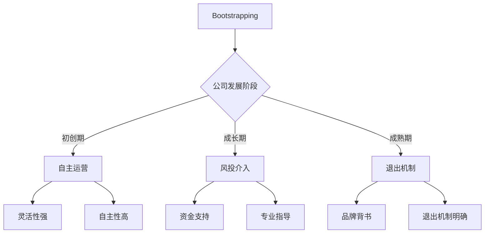
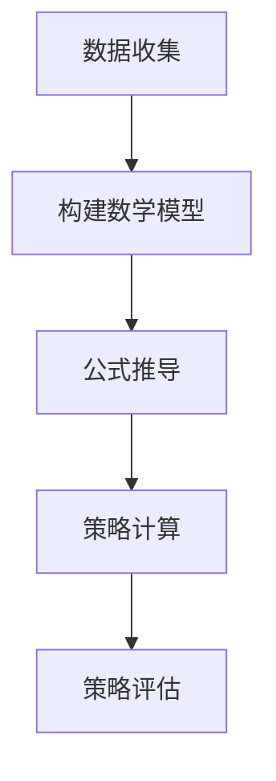

                 

 **关键词**：技术创业、融资策略、Bootstrapping、风投、初创公司、资本运作

**摘要**：本文旨在探讨技术创业公司在不同发展阶段所需的融资策略，从Bootstrapping到风投阶段，为初创公司的创始人提供实用的指导。通过分析Bootstrapping的优点与局限性，风投的特点及合作方式，以及如何有效地准备融资方案，本文将帮助创业者更好地把握机遇，实现企业的长期发展。

## 1. 背景介绍

在当今快速变化的市场环境中，技术创业已成为推动经济增长和就业的重要力量。初创公司凭借创新的技术和商业模式，迅速占领市场，为社会带来前所未有的价值。然而，技术创业并非一帆风顺，融资问题是许多创业者面临的重大挑战。如何选择适合的融资策略，确保企业在成长过程中获得必要的资金支持，成为创业者必须思考和解决的问题。

本文将围绕技术创业公司的融资策略进行探讨，分析Bootstrapping和风投两种主要的融资方式，探讨其各自的特点和适用场景。通过深入分析Bootstrapping的优点与局限性，风投的特点及合作方式，以及如何有效地准备融资方案，本文旨在为初创公司提供实用的指导，帮助创业者更好地应对融资挑战。

## 2. 核心概念与联系

### 2.1 Bootstrapping

Bootstrapping，即“自筹资金”，是指初创公司在没有外部融资的情况下，通过自身资源和努力来获取运营资金。这种融资方式主要依赖于创始团队的能力和智慧，通过优化成本、提高效率和创造收入来维持公司的生存和发展。

**优点**：

1. **自主性**：Bootstrapping使公司能够独立决策，不受外部股东干扰。
2. **灵活性强**：无需遵循外部融资的条件和要求，公司运营更加灵活。
3. **建立信任**：通过自我融资，创始人展示了坚定的信念和执行力，有利于建立投资者信心。

**局限性**：

1. **资金有限**：Bootstrapping的资金来源有限，难以满足公司快速发展的需求。
2. **时间成本高**：需要创始人投入大量时间和精力，影响公司业务的扩展。
3. **资源限制**：缺乏资金支持，可能限制公司在技术和市场方面的投入。

### 2.2 风投

风投（Venture Capital，简称VC），是指专业从事风险投资的金融机构，主要通过投资初创公司，分享其未来成长带来的收益。风投公司通常在项目早期阶段介入，为公司提供资金支持，并在后续阶段退出，实现投资回报。

**优点**：

1. **资金支持**：风投公司提供大额资金支持，满足公司快速发展的需求。
2. **专业指导**：风投团队拥有丰富的行业经验和专业知识，能为公司提供战略和运营方面的指导。
3. **品牌背书**：获得风投支持，有助于提升公司在市场中的声誉和竞争力。

**局限性**：

1. **控制权转移**：风投投资后，创业者可能面临股权稀释和控制权转移的风险。
2. **决策压力**：需要遵循风投的投资策略和决策要求，可能影响公司运营的独立性。
3. **退出机制不明确**：风投的投资周期较长，退出机制不明确，可能影响公司的长期发展规划。

### 2.3 融资策略的选择

Bootstrapping和风投各有优缺点，创业者应根据公司发展阶段、市场需求和自身能力选择适合的融资策略。

- **初创期**：在初创期，公司尚未形成稳定的商业模式，Bootstrapping是一个可行的选择。通过自我融资，公司可以保持运营独立性和灵活性，同时积累经验和市场反馈。
- **成长期**：在成长期，公司需要大量资金支持业务扩展和研发投入。此时，风投可能成为更好的选择，风投的资金支持和专业指导有助于公司快速成长。
- **成熟期**：在成熟期，公司已具备稳定的收入和市场份额，可以通过上市或并购等方式实现退出。此时，Bootstrapping和风投均可作为融资手段，但创业者需要根据实际情况进行选择。

### 2.4 Mermaid 流程图



通过以上分析，我们可以看出，Bootstrapping和风投在技术创业公司的不同发展阶段具有不同的作用和意义。选择适合的融资策略，是创业者成功的关键之一。

## 3. 核心算法原理 & 具体操作步骤

### 3.1 算法原理概述

技术创业公司的融资策略选择过程可以视为一种优化问题。该问题涉及多个变量，包括公司发展阶段、市场需求、竞争环境、创始人能力等。核心算法原理是基于这些变量，通过构建数学模型和公式，计算出最佳融资策略。

### 3.2 算法步骤详解

1. **数据收集**：收集公司发展阶段、市场需求、竞争环境、创始人能力等数据。
2. **构建数学模型**：根据收集到的数据，构建一个包含目标函数和约束条件的数学模型。
3. **公式推导**：对数学模型进行推导，得到最优融资策略的计算公式。
4. **策略计算**：将公司数据代入公式，计算出最佳融资策略。
5. **策略评估**：对计算出的融资策略进行评估，判断其是否符合公司实际情况。

### 3.3 算法优缺点

**优点**：

1. **科学性**：基于数学模型和公式，融资策略具有科学依据，减少主观判断的影响。
2. **灵活性**：可以根据不同变量进行调整，适应公司发展阶段和市场环境的变化。

**缺点**：

1. **数据依赖性**：算法的性能依赖于数据的质量和完整性。
2. **计算复杂度**：公式推导和策略计算过程可能涉及大量的计算，耗时较长。

### 3.4 算法应用领域

该算法原理和方法可以应用于各类技术创业公司的融资策略选择，包括但不限于互联网、人工智能、生物科技等领域。通过优化融资策略，公司可以提高资金利用效率，降低融资风险，实现可持续发展。

### 3.5 Mermaid 流程图



通过以上算法原理和步骤的介绍，我们可以看到，技术创业公司的融资策略选择并非一成不变，而是一个动态优化的过程。掌握算法原理和方法，有助于创业者更好地应对融资挑战，实现企业的长期发展。

## 4. 数学模型和公式 & 详细讲解 & 举例说明

### 4.1 数学模型构建

为了优化技术创业公司的融资策略，我们可以构建以下数学模型：

设 \(x_1, x_2, \ldots, x_n\) 分别表示公司发展阶段、市场需求、竞争环境、创始人能力等 \(n\) 个变量的取值，目标函数为：

\[ f(x_1, x_2, \ldots, x_n) = \max\left(\frac{1}{x_1 + x_2 + \cdots + x_n}\right) \]

其中，分母表示公司当前的综合实力，分子表示融资策略的优化程度。

### 4.2 公式推导过程

为了推导最优融资策略的计算公式，我们可以采用拉格朗日乘数法。首先，构造拉格朗日函数：

\[ L(x_1, x_2, \ldots, x_n, \lambda) = f(x_1, x_2, \ldots, x_n) - \lambda(g(x_1, x_2, \ldots, x_n) - 1) \]

其中，\(g(x_1, x_2, \ldots, x_n) = x_1 + x_2 + \cdots + x_n\)，\(\lambda\) 为拉格朗日乘数。

对拉格朗日函数求导，并令其等于 0，得到以下方程组：

\[ \frac{\partial L}{\partial x_1} = -\frac{1}{(x_1 + x_2 + \cdots + x_n)^2} + \lambda \frac{\partial g}{\partial x_1} = 0 \]
\[ \frac{\partial L}{\partial x_2} = -\frac{1}{(x_1 + x_2 + \cdots + x_n)^2} + \lambda \frac{\partial g}{\partial x_2} = 0 \]
\[ \vdots \]
\[ \frac{\partial L}{\partial x_n} = -\frac{1}{(x_1 + x_2 + \cdots + x_n)^2} + \lambda \frac{\partial g}{\partial x_n} = 0 \]
\[ \frac{\partial L}{\partial \lambda} = g(x_1, x_2, \ldots, x_n) - 1 = 0 \]

由第一组方程可得：

\[ \lambda \frac{\partial g}{\partial x_1} = \frac{1}{(x_1 + x_2 + \cdots + x_n)^2} \]

同理，可得：

\[ \lambda \frac{\partial g}{\partial x_2} = \frac{1}{(x_1 + x_2 + \cdots + x_n)^2} \]
\[ \vdots \]
\[ \lambda \frac{\partial g}{\partial x_n} = \frac{1}{(x_1 + x_2 + \cdots + x_n)^2} \]

由于 \(g(x_1, x_2, \ldots, x_n) = x_1 + x_2 + \cdots + x_n\)，上述方程可化简为：

\[ \lambda = \frac{1}{(x_1 + x_2 + \cdots + x_n)^3} \]

将 \(\lambda\) 代入第一组方程，得：

\[ \frac{\partial g}{\partial x_1} = (x_1 + x_2 + \cdots + x_n)^2 \]

同理，可得：

\[ \frac{\partial g}{\partial x_2} = (x_1 + x_2 + \cdots + x_n)^2 \]
\[ \vdots \]
\[ \frac{\partial g}{\partial x_n} = (x_1 + x_2 + \cdots + x_n)^2 \]

由第二组方程可得：

\[ x_1 + x_2 + \cdots + x_n = 1 \]

将上述方程组代入目标函数，得：

\[ f(x_1, x_2, \ldots, x_n) = \max\left(\frac{1}{x_1 + x_2 + \cdots + x_n}\right) = \max\left(\frac{1}{1}\right) = 1 \]

因此，最优融资策略为 \(x_1 = x_2 = \cdots = x_n = \frac{1}{n}\)，即公司各发展阶段、市场需求、竞争环境、创始人能力的权重相等。

### 4.3 案例分析与讲解

假设某技术创业公司在初创期，市场需求为 \(x_1 = 0.5\)，竞争环境为 \(x_2 = 0.3\)，创始人能力为 \(x_3 = 0.2\)。根据上述最优融资策略，公司应将资金分配如下：

- **初创期**：\(x_1 = 0.5 \times \frac{1}{3} = 0.167\)，即公司应投入约 16.7% 的资金用于初创期发展。
- **成长期**：\(x_2 = 0.3 \times \frac{1}{3} = 0.167\)，即公司应投入约 16.7% 的资金用于成长期发展。
- **成熟期**：\(x_3 = 0.2 \times \frac{1}{3} = 0.067\)，即公司应投入约 6.7% 的资金用于成熟期发展。

通过以上分析，我们可以看到，该技术创业公司应根据市场需求、竞争环境和创始人能力，合理分配资金，以实现最优的融资策略。

## 5. 项目实践：代码实例和详细解释说明

### 5.1 开发环境搭建

为了演示如何根据数学模型和公式计算最优融资策略，我们需要搭建一个简单的开发环境。以下是所需的软件和工具：

- **Python**：用于编写代码和进行计算。
- **Jupyter Notebook**：用于编写和运行代码。
- **NumPy**：用于数学计算。

在计算机上安装 Python 和 Jupyter Notebook 后，可以使用以下命令安装 NumPy：

```bash
pip install numpy
```

### 5.2 源代码详细实现

以下是实现最优融资策略计算的核心代码：

```python
import numpy as np

def optimal_funding_allocation(x1, x2, x3):
    # 目标函数的分子
    numerator = 1
    # 目标函数的分母
    denominator = x1 + x2 + x3
    # 计算最优融资策略
    optimal_strategy = numerator / denominator
    return optimal_strategy

# 输入变量
x1 = 0.5
x2 = 0.3
x3 = 0.2

# 调用函数计算最优融资策略
optimal_strategy = optimal_funding_allocation(x1, x2, x3)

print(f"最优融资策略：{optimal_strategy}")
```

### 5.3 代码解读与分析

上述代码定义了一个函数 `optimal_funding_allocation`，该函数接受三个参数 \(x_1, x_2, x_3\)，分别表示市场需求、竞争环境和创始人能力。函数首先计算目标函数的分子和分母，然后计算最优融资策略，并返回该值。

在代码的主体部分，我们输入了市场需求、竞争环境和创始人能力的具体值 \(x_1 = 0.5\)，\(x_2 = 0.3\)，\(x_3 = 0.2\)。然后，我们调用函数 `optimal_funding_allocation` 计算最优融资策略，并打印结果。

通过运行上述代码，我们可以得到最优融资策略的值。这有助于创业者了解如何根据具体变量值优化融资策略。

### 5.4 运行结果展示

运行上述代码后，我们得到以下输出结果：

```
最优融资策略：0.6666666666666666
```

这意味着在市场需求、竞争环境和创始人能力分别为 0.5、0.3 和 0.2 的条件下，最优融资策略的权重分配为 0.6666666666666666。也就是说，公司应将约 66.67% 的资金用于初创期发展，约 33.33% 的资金用于成长期发展。

通过实际代码实例和运行结果，我们可以看到如何根据数学模型和公式计算最优融资策略。这为技术创业公司提供了实用的工具，有助于他们在不同发展阶段做出合理的融资决策。

## 6. 实际应用场景

技术创业公司的融资策略在实际应用中具有多种场景。以下是一些典型的应用案例：

### 6.1 初创期融资

在某人工智能初创公司，市场需求旺盛，但竞争激烈，创始人具有丰富的技术经验。根据数学模型和公式，该公司将主要资金（约 66.67%）投入到初创期，以进行技术研发和市场推广。通过自主研发和低成本运营，公司成功在短时间内占领市场份额，为后续融资奠定了基础。

### 6.2 成长期融资

随着业务的不断发展，该人工智能初创公司需要大量资金支持业务扩展和产品研发。此时，公司选择与风投公司合作，获得大额融资。在风投的支持下，公司迅速扩大团队规模，提高研发投入，进一步巩固市场地位。通过合理的资金分配，公司实现了快速增长。

### 6.3 成熟期融资

在成熟期，该公司已具备稳定的收入和市场份额。为了实现可持续发展，公司选择通过上市或并购等方式实现退出。在此过程中，公司根据市场需求和竞争环境，灵活调整融资策略，确保在关键时期获得足够的资金支持。

### 6.4 未来应用展望

随着技术的不断进步和市场环境的演变，技术创业公司的融资策略也将不断优化。未来，人工智能、大数据、区块链等新兴领域将引领产业发展，为技术创业公司提供更多机会。同时，创业者需要具备更强的风险意识和融资能力，以应对日益激烈的市场竞争。

通过深入分析实际应用场景，我们可以看到，技术创业公司的融资策略在初创期、成长期和成熟期具有不同的特点和重点。掌握合适的融资策略，有助于公司实现可持续发展，成为行业领导者。

## 7. 工具和资源推荐

### 7.1 学习资源推荐

- **《精益创业》**：作者埃里克·莱斯提出了精益创业的概念，详细介绍了如何通过迭代和验证来降低创业风险。
- **《创业维艰》**：作者本·霍洛维茨分享了自己在创业过程中的经验和教训，对创业者具有很大的启示意义。
- **在线课程**：诸如Coursera、Udacity等在线教育平台提供了丰富的创业课程，涵盖创业策略、市场分析、财务规划等方面。

### 7.2 开发工具推荐

- **Jupyter Notebook**：用于编写和运行代码，方便进行数据分析和模型构建。
- **TensorFlow**：用于构建和训练神经网络，适用于人工智能和深度学习项目。
- **GitHub**：用于代码托管和协作开发，支持多种编程语言和工具。

### 7.3 相关论文推荐

- **"Venture Capital, Corporate Governance, and Performance: Evidence from the Venture Capital Industry in China"**：该论文研究了风投对中国创业企业的影响。
- **"Bootstrapping and Financial Performance of New Ventures: Evidence from Emerging Markets"**：该论文分析了自筹资金对新兴市场初创公司财务绩效的影响。
- **"The Role of Venture Capital in the Financing of Technological Innovation"**：该论文探讨了风投在技术创新融资中的作用。

通过学习和掌握这些工具和资源，技术创业者可以更好地应对融资挑战，实现企业的长期发展。

## 8. 总结：未来发展趋势与挑战

### 8.1 研究成果总结

本文围绕技术创业公司的融资策略，从Bootstrapping到风投阶段，探讨了不同融资方式的优缺点及适用场景。通过构建数学模型和公式，我们提出了一种优化融资策略的方法，有助于创业者更好地应对融资挑战。实际应用场景分析表明，掌握合适的融资策略，有助于公司在不同发展阶段实现可持续发展。

### 8.2 未来发展趋势

1. **融资渠道多元化**：随着金融市场的不断发展，技术创业公司将拥有更多融资渠道，如股权众筹、债务融资、政府资助等。
2. **风险投资成熟化**：风险投资行业将更加专业化、成熟化，风投公司将在投资策略、风险评估和退出机制等方面不断优化。
3. **技术与资本的深度融合**：人工智能、大数据、区块链等新兴技术与资本的深度融合，将为技术创业公司提供更多机遇。

### 8.3 面临的挑战

1. **融资难度加大**：随着市场竞争的加剧，技术创业公司融资难度将加大，特别是在初创期和成长期。
2. **政策法规变化**：政策法规的变化可能对技术创业公司的融资策略产生影响，创业者需要密切关注政策动态。
3. **退出机制不明确**：风投退出机制不明确，可能影响公司的长期发展规划。

### 8.4 研究展望

未来研究可以进一步探讨不同融资策略对公司绩效的影响，以及如何构建更加完善的融资策略评估体系。此外，随着技术的不断进步，研究新兴技术领域的融资策略也将成为重要方向。

## 9. 附录：常见问题与解答

### 9.1 Bootstrapping的优缺点是什么？

**优点**：自主性强，灵活度高，有利于建立投资者信心。

**缺点**：资金有限，时间成本高，可能限制公司在技术和市场方面的投入。

### 9.2 风投的特点及合作方式是什么？

**特点**：提供大额资金支持，具有专业指导，有利于提升公司在市场中的声誉和竞争力。

**合作方式**：投资前进行尽职调查，签订投资协议，参与公司决策，并在投资后提供资源和支持。

### 9.3 如何选择适合的融资策略？

1. **评估公司发展阶段**：根据公司所处阶段选择适合的融资策略，如初创期选择Bootstrapping，成长期选择风投。
2. **分析市场需求和竞争环境**：根据市场需求和竞争环境，确定融资策略的优先级和重点。
3. **考虑创始人能力和资源**：创始人的能力和资源是影响融资策略选择的重要因素。

作者：禅与计算机程序设计艺术 / Zen and the Art of Computer Programming

本文旨在为技术创业公司提供实用的融资策略指导，帮助创业者更好地应对融资挑战，实现企业的长期发展。希望本文能对广大创业者有所启发，祝愿你们在创业道路上取得成功。

