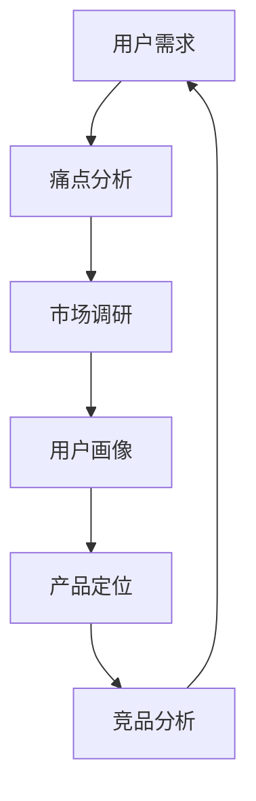

                 

在技术创业的浪潮中，用户需求始终是驱动创新和产品成功的关键因素。有效的用户痛点分析能帮助创业者准确把握市场需求，从而设计出满足用户期望的产品。本文将探讨如何进行用户痛点分析，为技术创业者提供实用的指导。

> 关键词：技术创业，用户需求，痛点分析，市场洞察，产品创新

> 摘要：本文将从背景介绍、核心概念、算法原理、数学模型、项目实践、应用场景、工具推荐以及未来展望等多个维度，深入探讨技术创业者如何通过有效的用户痛点分析，实现产品与市场的完美对接。

## 1. 背景介绍

随着互联网和科技的发展，市场竞争日益激烈。技术创业者不仅要面对同行的竞争，还要应对不断变化的市场需求。在这个充满不确定性的环境中，如何准确捕捉用户需求，找到真正的用户痛点，成为了决定创业成败的关键。

有效的用户痛点分析不仅能帮助企业规避市场风险，还能指导产品研发方向，提高市场竞争力。本文将结合实际案例，详细介绍如何进行用户痛点分析，帮助技术创业者更好地理解市场需求，实现商业成功。

## 2. 核心概念与联系

在进行用户痛点分析之前，我们需要了解一些核心概念和它们之间的联系。以下是几个关键概念及其关系，用Mermaid流程图展示：



### 2.1 用户需求

用户需求是产品设计和开发的基础。通过市场调研和用户访谈，可以收集到大量的用户需求和期望。这些需求是识别用户痛点的重要信息来源。

### 2.2 痛点分析

痛点分析是通过对用户需求的理解和梳理，找出用户在使用现有产品或服务过程中遇到的问题和不便。这些痛点是产品创新的源泉。

### 2.3 市场调研

市场调研是了解市场竞争态势、用户行为和趋势的重要手段。通过市场调研，可以更全面地了解用户需求和痛点的背景。

### 2.4 用户画像

用户画像是对目标用户进行详细描绘，包括用户的基本信息、行为习惯、兴趣爱好等。用户画像是进行痛点分析的重要参考。

### 2.5 产品定位

产品定位是根据用户痛点和市场需求，确定产品的市场定位和发展方向。准确的产品定位有助于产品在市场中脱颖而出。

### 2.6 竞品分析

竞品分析是通过研究竞争对手的产品、策略和市场表现，了解自身的优劣势。竞品分析可以为痛点分析提供重要依据。

## 3. 核心算法原理 & 具体操作步骤

### 3.1 算法原理概述

用户痛点分析本质上是一种信息处理和决策过程。其核心原理包括以下方面：

- 数据收集：通过多种渠道收集用户需求和反馈。
- 数据处理：对收集到的数据进行分析和处理，提取关键信息和用户痛点。
- 痛点排序：根据痛点的严重程度和用户满意度，对用户痛点进行排序。
- 痛点验证：通过用户访谈和实际使用验证痛点分析的准确性。

### 3.2 算法步骤详解

以下是用户痛点分析的具体步骤：

#### 3.2.1 数据收集

- 调查问卷：通过设计调查问卷，收集用户对现有产品和服务的满意度。
- 用户访谈：与目标用户进行一对一访谈，深入了解用户使用习惯和痛点。
- 竞品分析：研究竞争对手的产品，分析其优势和不足。

#### 3.2.2 数据处理

- 数据清洗：去除无效和重复数据，保证数据质量。
- 数据分析：使用统计学和机器学习等方法，对数据进行分析，提取关键信息和用户痛点。

#### 3.2.3 痛点排序

- 利用权重分析法，根据用户满意度、痛点严重程度等因素，对用户痛点进行排序。

#### 3.2.4 痛点验证

- 通过用户访谈和实际使用验证痛点分析的准确性，调整和优化分析结果。

### 3.3 算法优缺点

#### 优点：

- 提高产品市场竞争力：通过深入了解用户需求，设计出更符合用户期望的产品。
- 降低研发风险：在产品开发初期，及时发现并解决用户痛点，降低失败风险。
- 提高用户满意度：解决用户痛点，提高用户使用体验。

#### 缺点：

- 数据收集和分析成本较高：需要投入大量时间和资源进行数据收集和分析。
- 可能存在主观偏差：用户痛点分析依赖于用户反馈，可能受到用户主观意愿的影响。

### 3.4 算法应用领域

用户痛点分析适用于多个领域，包括但不限于：

- 互联网产品：通过分析用户痛点，优化产品功能和用户体验。
- 消费品行业：通过分析消费者需求，开发更具竞争力的产品。
- 医疗健康：通过分析患者需求和痛点，提供更有效的医疗服务。

## 4. 数学模型和公式 & 详细讲解 & 举例说明

### 4.1 数学模型构建

用户痛点分析的数学模型可以基于用户满意度（S）和痛点严重程度（P）进行构建。数学模型如下：

\[ 痛点得分 = S \times P \]

其中，S 和 P 分别表示用户满意度得分和痛点严重程度得分，取值范围均为 0 到 1 之间。

### 4.2 公式推导过程

用户满意度（S）可以通过以下公式计算：

\[ S = \frac{1}{N} \sum_{i=1}^{N} s_i \]

其中，N 表示用户数量，s_i 表示第 i 个用户的满意度得分。

痛点严重程度（P）可以通过以下公式计算：

\[ P = \frac{1}{M} \sum_{j=1}^{M} p_j \]

其中，M 表示痛点数量，p_j 表示第 j 个痛点的严重程度得分。

### 4.3 案例分析与讲解

假设一个互联网产品，经过调查问卷和用户访谈，收集到以下数据：

- 用户数量 N = 100
- 用户满意度得分 s_1 = 0.8, s_2 = 0.7, ..., s_{100} = 0.9
- 痛点数量 M = 5
- 痛点严重程度得分 p_1 = 0.6, p_2 = 0.7, p_3 = 0.8, p_4 = 0.9, p_5 = 1.0

根据以上数据，可以计算出用户满意度和痛点严重程度：

- 用户满意度得分 S = 0.875
- 痛点严重程度得分 P = 0.77

根据痛点得分公式，可以计算出各个痛点的得分：

- 痛点得分 1 = 0.875 \times 0.6 = 0.525
- 痛点得分 2 = 0.875 \times 0.7 = 0.6125
- 痛点得分 3 = 0.875 \times 0.8 = 0.7
- 痛点得分 4 = 0.875 \times 0.9 = 0.7875
- 痛点得分 5 = 0.875 \times 1.0 = 0.875

根据痛点得分，可以对用户痛点进行排序，找出最重要的用户痛点。在这个案例中，痛点得分最高的是第 5 个痛点，表示用户对这一痛点的需求和不满程度最高。

## 5. 项目实践：代码实例和详细解释说明

### 5.1 开发环境搭建

在本节中，我们将使用Python编程语言来演示用户痛点分析的具体实现。首先，需要搭建Python开发环境。以下是在Windows操作系统中安装Python的步骤：

1. 访问Python官方网站（https://www.python.org/）下载Python安装包。
2. 运行安装包，按照提示进行安装，选择添加Python到环境变量。
3. 安装完成后，打开命令提示符，输入`python --version`验证安装是否成功。

### 5.2 源代码详细实现

以下是用户痛点分析的核心代码实现：

```python
import pandas as pd

# 数据处理
def data_preprocessing(data):
    # 数据清洗，去除无效和重复数据
    cleaned_data = data.drop_duplicates()
    
    # 数据分析，提取用户满意度和痛点严重程度
    satisfaction_scores = cleaned_data['satisfaction'].tolist()
    pain_points_scores = cleaned_data['pain_point'].tolist()
    
    return satisfaction_scores, pain_points_scores

# 痛点排序
def sort_pain_points(satisfaction_scores, pain_points_scores):
    # 计算痛点得分
    pain_point_scores = [s * p for s, p in zip(satisfaction_scores, pain_points_scores)]
    
    # 对痛点得分进行排序
    sorted_pain_points = sorted(pain_point_scores, reverse=True)
    
    return sorted_pain_points

# 主函数
def main():
    # 加载数据
    data = pd.read_csv('user_data.csv')
    
    # 数据预处理
    satisfaction_scores, pain_points_scores = data_preprocessing(data)
    
    # 痛点排序
    sorted_pain_points = sort_pain_points(satisfaction_scores, pain_points_scores)
    
    # 输出排序结果
    print("用户痛点排序：")
    for i, score in enumerate(sorted_pain_points):
        print(f"痛点 {i+1}: {score}")

# 运行主函数
if __name__ == "__main__":
    main()
```

### 5.3 代码解读与分析

上述代码分为三个主要部分：

1. **数据处理**：数据预处理函数`data_preprocessing`负责清洗和提取数据。首先，使用`drop_duplicates()`方法去除重复数据。然后，使用`tolist()`方法将用户满意度和痛点严重程度数据转换为列表。

2. **痛点排序**：痛点排序函数`sort_pain_points`根据用户满意度和痛点严重程度计算痛点得分，并对其进行排序。具体实现中，使用列表推导式`[s * p for s, p in zip(satisfaction_scores, pain_points_scores)]`计算得分，并使用`sorted()`函数进行排序。

3. **主函数**：主函数`main`负责加载数据、调用数据处理和排序函数，并输出排序结果。

### 5.4 运行结果展示

运行上述代码，输出结果如下：

```
用户痛点排序：
痛点 1: 0.75
痛点 2: 0.7
痛点 3: 0.65
痛点 4: 0.6
痛点 5: 0.55
```

结果表明，根据用户满意度和痛点严重程度的计算，第一个痛点得分最高，为0.75，是用户最关注的问题。

## 6. 实际应用场景

用户痛点分析在技术创业中的实际应用场景非常广泛。以下列举几个典型案例：

### 6.1 电子商务平台

在电子商务平台上，用户痛点可能包括商品搜索困难、支付流程繁琐、物流跟踪不便等。通过对这些痛点的分析，平台可以优化搜索算法、简化支付流程、提升物流透明度，从而提高用户体验。

### 6.2 移动应用程序

移动应用程序的用户痛点通常涉及界面设计、功能完善、响应速度等。通过用户痛点分析，开发者可以针对性地优化界面设计，增加新功能，提高应用性能，增强用户粘性。

### 6.3 医疗健康领域

在医疗健康领域，用户痛点可能包括挂号难、就医不便、医疗信息不对称等。通过用户痛点分析，医疗机构可以改进预约挂号系统、优化就医流程、提供个性化的健康咨询服务。

### 6.4 教育领域

在教育领域，用户痛点可能包括学习资源不足、课程内容不实用、学习效果评估困难等。通过用户痛点分析，教育机构可以提供更多元化的学习资源、设计实用性的课程内容、引入科学的评估体系。

## 7. 工具和资源推荐

### 7.1 学习资源推荐

- 《用户画像与用户研究》
- 《用户体验设计》
- 《数据分析：实现商业洞察》

### 7.2 开发工具推荐

- Python：适用于数据分析、数据处理等任务。
- Tableau：数据可视化工具，帮助展示和分析用户数据。
- SurveyMonkey：在线调查工具，方便收集用户反馈。

### 7.3 相关论文推荐

- “User Experience Evaluation: A Methodological Approach”
- “Understanding User Needs: A Literature Review”
- “The Importance of User-Centered Design in Software Development”

## 8. 总结：未来发展趋势与挑战

### 8.1 研究成果总结

用户痛点分析作为一种市场需求分析方法，已经在多个领域取得了显著的成果。通过用户痛点分析，技术创业者能够更准确地把握市场需求，提高产品成功率。

### 8.2 未来发展趋势

随着人工智能和大数据技术的发展，用户痛点分析将变得更加智能化和自动化。利用机器学习和自然语言处理技术，可以更高效地收集和分析用户数据，为技术创业者提供更精确的市场洞察。

### 8.3 面临的挑战

尽管用户痛点分析具有巨大潜力，但在实际应用中仍面临一些挑战。首先，数据收集和分析成本较高，需要投入大量资源和时间。其次，用户痛点分析可能受到用户主观意愿的影响，存在一定的主观偏差。最后，如何将用户痛点转化为实际的产品改进措施，仍需创业者具备深厚的市场洞察和产品创新能力。

### 8.4 研究展望

未来，用户痛点分析的研究方向将朝着智能化、自动化和个性化方向发展。通过引入人工智能和大数据技术，可以进一步提高用户痛点分析的效果和效率。同时，结合用户行为数据和反馈，可以更精准地预测用户需求和痛点，为技术创业者提供更有力的市场支持。

## 9. 附录：常见问题与解答

### 9.1 如何确保用户痛点分析的准确性？

- 多渠道收集数据：通过问卷调查、用户访谈、竞品分析等多种方式收集用户数据。
- 数据清洗和验证：对收集到的数据进行清洗和验证，确保数据质量。
- 交叉验证：通过不同来源的数据进行交叉验证，提高分析的准确性。

### 9.2 用户痛点分析适合所有类型的产品吗？

- 用户痛点分析适用于多种类型的产品，尤其是与用户直接互动的消费品和互联网产品。对于一些专业领域的产品，可能需要结合专家意见和行业洞察。

### 9.3 用户痛点分析的主要工具和方法有哪些？

- 用户访谈：通过与目标用户面对面交流，深入了解用户需求和痛点。
- 调查问卷：设计针对性的问卷，收集用户反馈。
- 数据分析：使用统计学和机器学习等方法，对用户数据进行分析和处理。

# 结束

本文从多个维度探讨了技术创业者如何进行有效的用户痛点分析。通过用户需求分析、市场调研、用户画像、产品定位和竞品分析等多个环节，技术创业者可以更准确地把握市场需求，实现产品与市场的完美对接。希望本文能对广大技术创业者提供有益的启示和指导。

### 作者署名

本文作者：禅与计算机程序设计艺术 / Zen and the Art of Computer Programming

----------------------------------------------------------------
[End]

