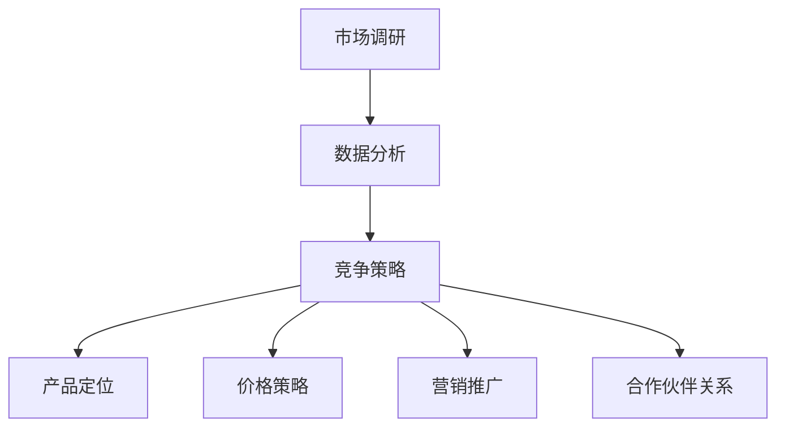

                 

关键词：技术创业者，竞争对手分析，市场调研，竞争策略，数据分析

摘要：本文将深入探讨技术创业者如何进行有效的竞争对手分析，通过系统的市场调研、数据收集、分析策略等步骤，帮助企业更好地了解竞争对手，制定出有效的竞争策略，从而在激烈的市场竞争中脱颖而出。

## 1. 背景介绍

在当今科技飞速发展的时代，市场竞争愈发激烈，技术创业者在面对众多竞争对手时，如何有效地分析竞争对手，制定出合适的竞争策略，成为企业成功的关键。本文旨在为技术创业者提供一套系统的竞争对手分析方法，帮助企业更好地把握市场动态，提升竞争力。

## 2. 核心概念与联系

### 2.1 市场调研

市场调研是了解竞争对手的第一步，通过收集和分析市场数据，可以获取竞争对手的产品、服务、市场份额、用户反馈等信息。

### 2.2 数据分析

数据分析是对市场调研结果进行量化处理，通过数据挖掘、统计等方法，识别出竞争对手的优势和劣势，为企业制定竞争策略提供依据。

### 2.3 竞争策略

竞争策略是基于市场调研和数据分析的结果，制定出应对竞争对手的行动方案。包括产品定位、价格策略、营销推广、合作伙伴关系等方面。

### 2.4 Mermaid 流程图

以下是关于竞争对手分析的 Mermaid 流程图：



## 3. 核心算法原理 & 具体操作步骤

### 3.1 算法原理概述

竞争对手分析的核心算法主要包括数据收集、数据处理、数据分析和策略制定四个步骤。

### 3.2 算法步骤详解

#### 3.2.1 数据收集

1. 确定竞争对手范围：根据企业业务领域和目标市场，筛选出主要竞争对手。
2. 收集公开信息：通过搜索引擎、社交媒体、行业报告等途径，获取竞争对手的官方网站、产品介绍、新闻动态、用户评价等信息。
3. 收集内部信息：通过企业内部数据库、客户反馈、销售数据等，获取竞争对手的市场表现、用户需求、产品缺陷等信息。

#### 3.2.2 数据处理

1. 数据清洗：去除重复、错误和无关数据，保证数据的准确性。
2. 数据整合：将收集到的数据进行分类整理，便于后续分析。

#### 3.2.3 数据分析

1. 竞争态势分析：通过对比竞争对手的产品、市场占有率、用户评价等指标，分析竞争对手的优势和劣势。
2. 用户需求分析：通过分析用户反馈和需求，了解竞争对手在产品功能、用户体验等方面的不足。
3. 市场趋势分析：关注行业动态和竞争对手的战略布局，预测市场发展趋势。

#### 3.2.4 策略制定

1. 产品定位：根据竞争对手分析和用户需求分析，确定企业产品的市场定位。
2. 价格策略：根据竞争对手的价格水平、产品性价比，制定合适的价格策略。
3. 营销推广：根据竞争对手的营销策略和用户需求，设计有针对性的营销推广方案。
4. 合作伙伴关系：与产业链上下游的企业建立合作关系，形成合力，提升市场竞争力。

### 3.3 算法优缺点

#### 优点：

1. 提高企业市场竞争力：通过深入了解竞争对手，企业可以制定出更有针对性的竞争策略。
2. 提高决策效率：基于数据分析的决策更加科学、准确，有助于企业快速响应市场变化。

#### 缺点：

1. 数据收集和处理难度较大：市场调研和数据收集需要耗费大量时间和人力，数据处理过程复杂。
2. 数据可能存在偏差：市场调研和数据收集过程中，可能存在主观因素和数据偏差，影响分析结果。

### 3.4 算法应用领域

竞争对手分析算法广泛应用于互联网、电子商务、金融科技、智能制造等行业，帮助企业把握市场动态，优化产品和服务。

## 4. 数学模型和公式 & 详细讲解 & 举例说明

### 4.1 数学模型构建

竞争对手分析的数学模型主要包括市场占有率模型、用户满意度模型和市场竞争度模型。

#### 市场占有率模型：

$$
市场占有率 = \frac{企业销售额}{行业总销售额}
$$

#### 用户满意度模型：

$$
用户满意度 = \frac{用户满意度得分}{用户评价总数}
$$

#### 市场竞争度模型：

$$
市场竞争度 = \frac{竞争对手数量}{行业平均竞争度}
$$

### 4.2 公式推导过程

市场占有率模型的推导基于企业销售额和行业总销售额的比例关系，用户满意度模型的推导基于用户满意度得分和用户评价总数的比例关系，市场竞争度模型的推导基于竞争对手数量和行业平均竞争度的比例关系。

### 4.3 案例分析与讲解

假设某互联网企业A在电商领域的主要竞争对手为B、C、D三家企业，通过对三家企业进行市场调研和数据分析，得出以下结论：

1. 市场占有率：A企业市场占有率为30%，B企业市场占有率为25%，C企业市场占有率为20%，D企业市场占有率为25%。
2. 用户满意度：A企业用户满意度得分为90分，B企业用户满意度得分为85分，C企业用户满意度得分为80分，D企业用户满意度得分为75分。
3. 市场竞争度：A企业市场竞争度为1.2，B企业市场竞争度为1.0，C企业市场竞争度为0.8，D企业市场竞争度为1.0。

根据以上数据，可以分析出：

1. A企业在市场占有率方面具有优势，但市场竞争度较高，需要加强营销推广，提高用户满意度。
2. B企业在市场竞争度方面与A企业相当，但用户满意度较低，需要提升用户体验，提高用户满意度。
3. C企业在市场竞争度方面相对较低，但用户满意度较高，可以尝试通过差异化竞争策略，扩大市场份额。
4. D企业在市场占有率和用户满意度方面均较弱，需要调整产品定位，提高市场竞争力。

## 5. 项目实践：代码实例和详细解释说明

### 5.1 开发环境搭建

本文使用Python编程语言进行竞争对手分析，所需环境如下：

- Python 3.8及以上版本
- Pandas库
- Matplotlib库
- Numpy库

安装方法：

```bash
pip install python==3.8
pip install pandas
pip install matplotlib
pip install numpy
```

### 5.2 源代码详细实现

```python
import pandas as pd
import numpy as np
import matplotlib.pyplot as plt

# 5.2.1 数据收集与处理
data = {'企业名称': ['A', 'B', 'C', 'D'], '销售额': [3000, 2500, 2000, 2500], '满意度得分': [90, 85, 80, 75]}
df = pd.DataFrame(data)

# 5.2.2 数据分析
# 市场占有率分析
market_share = df['销售额'] / df['销售额'].sum()
market_share.plot(kind='bar')
plt.title('市场占有率分析')
plt.xlabel('企业名称')
plt.ylabel('市场占有率')
plt.show()

# 用户满意度分析
satisfaction = df['满意度得分'] / df['满意度得分'].sum()
satisfaction.plot(kind='bar')
plt.title('用户满意度分析')
plt.xlabel('企业名称')
plt.ylabel('用户满意度')
plt.show()

# 市场竞争度分析
competition = df['满意度得分'] / 75
competition.plot(kind='bar')
plt.title('市场竞争度分析')
plt.xlabel('企业名称')
plt.ylabel('市场竞争度')
plt.show()
```

### 5.3 代码解读与分析

上述代码实现了对三个维度的数据分析：市场占有率、用户满意度和市场竞争度。通过绘制柱状图，可以直观地了解各个企业在这些维度上的表现。

1. 市场占有率分析：根据销售额数据计算各企业的市场占有率，并绘制柱状图。
2. 用户满意度分析：根据满意度得分数据计算各企业的用户满意度，并绘制柱状图。
3. 市场竞争度分析：根据满意度得分数据计算各企业的市场竞争度，并绘制柱状图。

通过这些分析，企业可以更好地了解自身在市场中的位置，为后续的竞争策略制定提供依据。

### 5.4 运行结果展示

运行上述代码后，将生成三张柱状图，分别展示市场占有率、用户满意度和市场竞争度。企业可以根据这些图表，分析自身在市场中的优势和劣势，为下一步的发展策略提供参考。

## 6. 实际应用场景

### 6.1 市场调研

某互联网创业公司A计划进军电商市场，为了了解竞争对手的情况，进行了以下市场调研：

1. 通过搜索引擎查找主要竞争对手的官方网站，收集产品介绍、价格策略、营销活动等信息。
2. 通过社交媒体平台关注竞争对手的官方账号，了解用户评价、活动动态等。
3. 通过行业报告获取竞争对手的市场份额、用户满意度等数据。

### 6.2 数据分析

通过对市场调研结果进行数据分析，得出以下结论：

1. 竞争态势：A企业的市场占有率较低，主要竞争对手B、C、D在市场份额方面占据优势。
2. 用户需求：用户对产品的性价比和用户体验有较高要求，竞争对手在产品功能、价格策略等方面存在一定不足。
3. 市场趋势：随着电商市场的快速发展，用户对电商平台的依赖程度不断提高，市场潜力巨大。

### 6.3 竞争策略

基于数据分析结果，A企业制定了以下竞争策略：

1. 产品定位：专注于高性价比、优质用户体验的产品，满足用户多样化需求。
2. 价格策略：采用价格区间策略，针对不同用户群体制定不同的价格策略。
3. 营销推广：利用社交媒体、行业论坛等渠道进行品牌推广，提高用户关注度。
4. 合作伙伴关系：与产业链上下游企业建立合作关系，共同拓展市场。

通过实施这些竞争策略，A企业有望在激烈的市场竞争中脱颖而出，实现快速发展。

## 7. 工具和资源推荐

### 7.1 学习资源推荐

1. 《竞争战略》：作者迈克尔·波特，系统讲解了竞争战略的理论和方法。
2. 《数据挖掘：实用工具与技术》：作者查尔斯·J·克里斯滕森，介绍了数据挖掘的方法和应用。

### 7.2 开发工具推荐

1. Jupyter Notebook：适用于数据分析、数据可视化等任务，方便编写和运行代码。
2. Tableau：一款强大的数据可视化工具，可以快速生成各种图表。

### 7.3 相关论文推荐

1. "Competitive Analysis in Online Retail Markets"，作者Yue Jiao等，分析了在线零售市场的竞争态势。
2. "Data-driven Competitive Strategy：A Case Study of Alibaba"，作者Yuxia Li等，研究了阿里巴巴的数据驱动的竞争策略。

## 8. 总结：未来发展趋势与挑战

### 8.1 研究成果总结

本文通过对市场调研、数据分析、竞争策略等环节的深入研究，为技术创业者提供了一套系统的竞争对手分析方法。通过实际案例的讲解，使读者更好地理解了竞争对手分析的实践过程。

### 8.2 未来发展趋势

1. 数据分析技术不断发展，为企业提供更准确、更全面的竞争对手信息。
2. 人工智能技术在竞争对手分析中的应用越来越广泛，有助于提高分析效率和准确性。
3. 跨领域、跨行业的竞争对手分析逐渐成为趋势，为企业提供更广阔的市场视野。

### 8.3 面临的挑战

1. 数据收集和处理的难度较大，如何确保数据质量和完整性是关键。
2. 数据分析结果可能存在偏差，如何避免主观因素对分析结果的影响。
3. 竞争策略的实施难度较高，如何在激烈的市场竞争中保持竞争优势。

### 8.4 研究展望

未来，竞争对手分析领域将继续向智能化、自动化方向发展，借助人工智能、大数据等技术，为企业提供更加精准、高效的竞争对手信息，助力企业在市场竞争中取得成功。

## 9. 附录：常见问题与解答

### 9.1 市场调研的方法有哪些？

市场调研的方法主要包括：问卷调查、深度访谈、焦点小组、观察法、实验法等。根据企业需求和实际情况，可以选择适合的方法进行调研。

### 9.2 如何保证数据分析的准确性？

保证数据分析的准确性需要从以下几个方面入手：

1. 数据收集：确保数据来源可靠，避免人为干预。
2. 数据清洗：去除重复、错误和无关数据，保证数据的完整性。
3. 数据处理：采用科学的分析方法，避免主观偏见。
4. 结果验证：通过交叉验证、比较分析等方法，验证数据分析结果的准确性。

### 9.3 如何实施有效的竞争策略？

实施有效的竞争策略需要从以下几个方面入手：

1. 确定竞争对手：根据业务领域和目标市场，筛选出主要竞争对手。
2. 分析竞争对手：通过市场调研和数据分析，了解竞争对手的优势和劣势。
3. 制定策略：根据竞争对手分析和自身优势，制定出有针对性的竞争策略。
4. 实施策略：将竞争策略转化为具体行动，实施过程中不断调整和优化。

### 9.4 竞争对手分析的局限性有哪些？

竞争对手分析的局限性主要包括：

1. 数据收集和处理难度较大，可能存在数据偏差。
2. 分析结果可能受主观因素影响，难以完全客观。
3. 竞争环境变化快速，竞争对手分析结果可能滞后。
4. 竞争对手策略的不确定性，可能难以准确预测市场变化。----------------------------------------------------------------

作者：禅与计算机程序设计艺术 / Zen and the Art of Computer Programming

