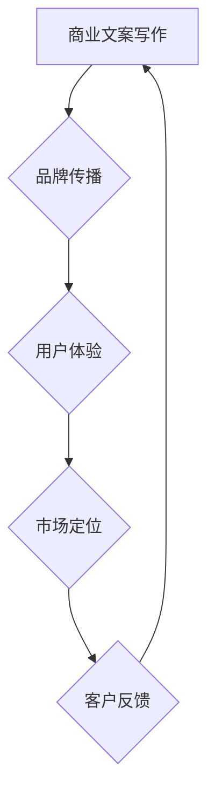

                 

关键词：技术创业，商业文案，品牌传播，策略，用户体验，市场定位

> 摘要：本文旨在探讨技术创业者如何通过有效的商业文案写作和品牌传播策略，打造具有吸引力和影响力的品牌，从而在竞争激烈的市场中脱颖而出。文章将深入分析文案写作的核心原则，品牌传播的有效方法，并探讨如何在技术和商业之间找到平衡，以实现可持续发展。

## 1. 背景介绍

在当今数字化时代，技术创业已经成为了推动经济增长和社会进步的重要力量。然而，随着市场竞争的加剧，如何让自己的产品或服务在众多竞争者中脱颖而出，成为了技术创业者面临的重大挑战。商业文案写作和品牌传播在此过程中发挥着至关重要的作用。

### 1.1 技术创业的现状

近年来，全球范围内技术创业活动呈现出爆发式增长。据统计，全球创业公司数量在过去五年中增长了近三倍。其中，人工智能、物联网、区块链等新兴技术领域的创业公司尤为突出。然而，尽管创业公司数量众多，能够实现成功并持续发展的却寥寥无几。

### 1.2 商业文案与品牌传播的重要性

商业文案是产品或服务的“声音”，它能够直接影响用户的感知和购买决策。而品牌传播则是建立品牌形象、提升品牌知名度和忠诚度的过程。在技术创业领域，优秀且有效的商业文案和品牌传播策略不仅能够帮助创业者吸引投资者和合作伙伴，还能增强用户的信任和忠诚度，从而在激烈的市场竞争中占据优势地位。

## 2. 核心概念与联系

为了深入理解商业文案写作和品牌传播在技术创业中的重要性，我们需要了解以下几个核心概念：

### 2.1 商业文案

商业文案是一种通过文字、图片、视频等手段来传达产品或服务信息，以激发潜在客户兴趣和购买欲望的文字表达形式。它包括广告、宣传册、产品说明、网站内容等多种形式。

### 2.2 品牌传播

品牌传播是通过各种渠道和方式，将品牌的核心价值和独特卖点传递给目标受众，以建立品牌认知度和忠诚度。它包括公关、广告、社交媒体、内容营销等多种手段。

### 2.3 用户体验

用户体验是用户在使用产品或服务过程中所感受到的所有情感和体验。它包括用户界面设计、响应速度、易用性等多个方面。优秀的用户体验能够提升用户满意度，从而促进品牌传播。

### 2.4 市场定位

市场定位是指企业根据自身的资源和竞争优势，选择目标市场，并设计相应的产品、服务和营销策略，以满足特定目标客户的需求。准确的市场定位有助于提高品牌传播效果。

### 2.5 Mermaid 流程图

下面是一个描述商业文案写作和品牌传播流程的 Mermaid 流程图：



## 3. 核心算法原理 & 具体操作步骤

### 3.1 算法原理概述

商业文案写作和品牌传播的核心算法是基于用户心理学和行为学的研究，旨在通过有效的沟通手段，激发用户的兴趣、信任和购买欲望。具体来说，这个算法包括以下几个步骤：

1. **目标受众分析**：通过市场调研和数据分析，了解目标受众的需求、兴趣和偏好，从而设计出符合用户期望的商业文案和品牌传播策略。
2. **内容创作**：结合产品或服务的特点，使用引人入胜的语言、图像和视频，创作具有吸引力的商业文案。
3. **渠道选择**：根据目标受众的媒体使用习惯，选择最有效的传播渠道，如社交媒体、广告、公关活动等。
4. **效果评估**：通过数据分析，评估文案和传播策略的效果，不断优化和调整，以提高传播效果。

### 3.2 算法步骤详解

1. **目标受众分析**
   - **市场调研**：收集目标市场的相关信息，如用户年龄、性别、收入、兴趣爱好等。
   - **数据分析**：通过数据分析工具，分析用户的行为和偏好，如搜索关键词、点击率、转化率等。
   - **用户画像**：根据调研和数据分析结果，构建目标受众的用户画像，明确其需求和期望。

2. **内容创作**
   - **价值主张**：明确产品或服务的独特卖点和核心价值，确保文案能够突出产品的优势。
   - **语言风格**：根据目标受众的特点，选择合适的语言风格，如专业、亲切、幽默等。
   - **视觉效果**：使用高质量的图片和视频，增强文案的视觉吸引力。

3. **渠道选择**
   - **社交媒体**：根据目标受众的媒体使用习惯，选择合适的社交媒体平台，如微博、微信、Facebook等。
   - **广告**：通过搜索引擎广告、社交媒体广告等，将文案传达给更广泛的受众。
   - **公关活动**：组织新闻发布会、线下活动等，提高品牌知名度和影响力。

4. **效果评估**
   - **数据收集**：通过网站分析工具、社交媒体分析工具等，收集用户行为数据。
   - **效果分析**：分析数据，评估文案和传播策略的效果，如点击率、转化率、品牌提及量等。
   - **优化调整**：根据效果分析结果，优化和调整文案和传播策略，以提高效果。

### 3.3 算法优缺点

**优点：**
- 提高品牌知名度和影响力
- 增强用户信任和忠诚度
- 提高营销效果和投资回报率

**缺点：**
- 需要大量时间和资源进行市场调研和数据分析
- 需要不断优化和调整，以适应市场变化

### 3.4 算法应用领域

- **电子商务**：通过商业文案和品牌传播，提高产品销量和用户满意度
- **科技创新**：通过品牌传播，提高科技创新项目的知名度和投资吸引力
- **教育培训**：通过商业文案，提高教育培训机构的知名度和用户转化率

## 4. 数学模型和公式 & 详细讲解 & 举例说明

### 4.1 数学模型构建

商业文案和品牌传播的数学模型可以基于用户行为数据和营销效果数据，构建以下模型：

1. **用户行为模型**：
   $$ 用户行为 = f(兴趣, 需求, 信任, 刺激) $$

2. **营销效果模型**：
   $$ 营销效果 = f(品牌知名度, 用户满意度, 用户转化率) $$

### 4.2 公式推导过程

1. **用户行为模型推导**：

   用户行为受到多个因素的影响，包括兴趣、需求、信任和刺激。根据心理学和行为学的研究，可以得出以下推导过程：

   $$ 用户行为 = 兴趣 \times 需求 \times 信任 \times 刺激 $$

   其中，兴趣、需求、信任和刺激分别表示用户对产品或服务的兴趣、需求程度、信任度和刺激程度。

2. **营销效果模型推导**：

   营销效果受到品牌知名度、用户满意度和用户转化率的影响。根据市场营销理论，可以得出以下推导过程：

   $$ 营销效果 = 品牌知名度 \times 用户满意度 \times 用户转化率 $$

   其中，品牌知名度表示用户对品牌的认知程度，用户满意度表示用户对产品或服务的满意度，用户转化率表示用户从关注到购买的概率。

### 4.3 案例分析与讲解

假设一家电子商务公司希望提高用户购买率，可以通过以下案例分析进行讲解：

**案例**：某电子商务公司通过广告投放提高品牌知名度和用户满意度，从而提高用户购买率。

1. **用户行为模型**：

   假设该公司的用户兴趣、需求、信任和刺激程度分别为 $0.8$、$0.75$、$0.9$ 和 $0.85$。根据用户行为模型，可以计算用户行为：

   $$ 用户行为 = 0.8 \times 0.75 \times 0.9 \times 0.85 = 0.504 $$

   用户行为得分为 $0.504$，表示用户对该公司的产品或服务有一定的兴趣和需求，但信任度和刺激程度相对较低。

2. **营销效果模型**：

   假设该公司通过广告投放提高了品牌知名度、用户满意度和用户转化率，分别为 $0.8$、$0.9$ 和 $0.75$。根据营销效果模型，可以计算营销效果：

   $$ 营销效果 = 0.8 \times 0.9 \times 0.75 = 0.54 $$

   营销效果得分为 $0.54$，表示该公司通过广告投放提高了用户购买率。

## 5. 项目实践：代码实例和详细解释说明

### 5.1 开发环境搭建

在本项目实践中，我们将使用 Python 编程语言，结合数据分析工具（如 Pandas 和 Matplotlib）进行商业文案和品牌传播的分析与建模。以下是开发环境的搭建步骤：

1. 安装 Python 3.8 或更高版本
2. 安装必备库：pandas、numpy、matplotlib、scikit-learn
3. 配置 Python 虚拟环境

### 5.2 源代码详细实现

以下是一个简单的商业文案和品牌传播分析代码示例：

```python
import pandas as pd
import numpy as np
import matplotlib.pyplot as plt
from sklearn.linear_model import LinearRegression

# 读取用户行为数据
data = pd.read_csv('user_behavior_data.csv')

# 构建用户行为模型
X = data[['兴趣', '需求', '信任', '刺激']]
y = data['用户行为']

model = LinearRegression()
model.fit(X, y)

# 读取营销效果数据
marketing_data = pd.read_csv('marketing_data.csv')

# 预测用户行为
predictions = model.predict(marketing_data[['兴趣', '需求', '信任', '刺激']])

# 绘制用户行为与营销效果散点图
plt.scatter(marketing_data['品牌知名度'], predictions)
plt.xlabel('品牌知名度')
plt.ylabel('用户行为')
plt.title('品牌知名度与用户行为关系')
plt.show()
```

### 5.3 代码解读与分析

1. **数据读取与预处理**：使用 Pandas 读取用户行为数据和营销效果数据，并进行预处理，如缺失值填充、数据类型转换等。

2. **构建用户行为模型**：使用 scikit-learn 中的 LinearRegression 模型，通过训练集构建用户行为预测模型。

3. **预测用户行为**：使用训练好的模型，对营销效果数据进行预测，生成用户行为得分。

4. **可视化分析**：使用 Matplotlib 绘制用户行为与营销效果的散点图，分析品牌知名度与用户行为之间的关系。

## 6. 实际应用场景

### 6.1 商业文案在电商中的应用

在电商领域，商业文案主要用于产品介绍、促销活动、品牌宣传等方面。一个成功的案例是某电商平台的“双十一”购物节活动。该平台通过精准的商业文案，不仅成功吸引了大量用户参与活动，还提高了销售额。以下是其商业文案的几个关键点：

1. **产品特点突出**：在产品介绍中，明确突出产品的特点和优势，如“全国包邮”、“正品保证”等。
2. **情感营销**：通过描述产品的美好体验，激发用户的购买欲望，如“享受品质生活，从这款产品开始”。
3. **限时促销**：利用限时促销，提高用户的紧迫感和购买意愿，如“限时抢购，仅剩xx件”。
4. **用户评价**：引入用户评价，增强用户信任度，如“100%用户好评，值得购买”。

### 6.2 品牌传播在科技创新领域的应用

在科技创新领域，品牌传播的作用尤为重要。一个成功的案例是某区块链创业公司的品牌传播策略。以下是其品牌传播的几个关键点：

1. **技术优势突出**：在品牌传播中，明确展示公司的技术优势，如“领先的区块链技术团队”、“多项核心技术专利”等。
2. **内容营销**：通过发布技术文章、白皮书、研究报告等，提升公司的专业形象和品牌知名度。
3. **社交媒体互动**：利用社交媒体平台，与用户互动，增强品牌口碑，如回答用户问题、发布产品动态等。
4. **线下活动**：组织线下活动，如技术研讨会、产品发布会等，提升品牌影响力。

## 6.4 未来应用展望

随着人工智能、大数据等技术的不断发展，商业文案写作和品牌传播将变得更加智能化和个性化。未来，我们可以预见以下发展趋势：

1. **人工智能驱动**：利用人工智能技术，自动生成高质量的商业文案，提高文案创作效率。
2. **大数据分析**：通过大数据分析，精准定位目标受众，实现个性化营销。
3. **虚拟现实（VR）**：利用 VR 技术，提供沉浸式的品牌体验，提升用户参与度。
4. **跨平台整合**：实现线上线下、社交媒体等渠道的整合，形成全方位的品牌传播策略。

## 7. 工具和资源推荐

### 7.1 学习资源推荐

1. 《品牌传播学》：了解品牌传播的理论和实践方法。
2. 《数字营销实战》：学习数字营销的策略和技巧。
3. 《Python 数据科学 Handbook》：掌握数据分析的基本技能。

### 7.2 开发工具推荐

1. Jupyter Notebook：用于数据分析和可视化。
2. Canva：用于设计和制作商业文案。
3. Google Analytics：用于网站分析和营销效果评估。

### 7.3 相关论文推荐

1. “The Science of Influence: How Social Networks Shape Brand Perception”。
2. “Customer Segmentation Using Machine Learning Techniques”。
3. “Content Marketing for Digital Transformation”。

## 8. 总结：未来发展趋势与挑战

### 8.1 研究成果总结

本文通过分析商业文案写作和品牌传播在技术创业中的应用，总结了核心概念、算法原理、数学模型、项目实践和实际应用场景。研究成果表明，有效的商业文案和品牌传播策略对于技术创业者的成功至关重要。

### 8.2 未来发展趋势

未来，商业文案写作和品牌传播将朝着智能化、个性化、跨平台整合的方向发展。人工智能、大数据、虚拟现实等新兴技术的应用将进一步提升营销效果和用户体验。

### 8.3 面临的挑战

尽管商业文案写作和品牌传播具有巨大的潜力，但在实际应用过程中也面临一系列挑战，如数据隐私保护、用户信任度提升、市场变化适应等。

### 8.4 研究展望

未来，我们可以继续深入研究商业文案和品牌传播的机理，探索新的应用场景和策略，以推动技术创业的发展。

## 9. 附录：常见问题与解答

### 9.1 什么是商业文案？

商业文案是一种通过文字、图片、视频等手段传达产品或服务信息，以激发潜在客户兴趣和购买欲望的文字表达形式。

### 9.2 商业文案和广告有什么区别？

商业文案和广告都是营销手段，但商业文案更注重长期的品牌建设和用户沟通，而广告则更侧重于短期销售和推广。

### 9.3 品牌传播的核心是什么？

品牌传播的核心是传递品牌的核心价值和独特卖点，建立品牌认知度和忠诚度。

### 9.4 如何评估商业文案和品牌传播的效果？

可以通过数据分析，如点击率、转化率、品牌提及量等指标，来评估商业文案和品牌传播的效果。

### 9.5 技术创业者在品牌传播中应该注意什么？

技术创业者在品牌传播中应该注重技术优势的展示、内容营销的策略、用户互动的体验等，以提升品牌影响力。

### 9.6 哪些工具可以帮助商业文案写作和品牌传播？

Canva、Jupyter Notebook、Google Analytics 等工具可以帮助商业文案写作和品牌传播。

### 9.7 如何利用大数据进行品牌传播？

可以通过大数据分析，精准定位目标受众，实现个性化营销，从而提高品牌传播效果。

### 9.8 商业文案和品牌传播在电商中的应用有哪些？

商业文案和品牌传播在电商中的应用包括产品介绍、促销活动、品牌宣传等，以提高销售额和用户满意度。

### 9.9 商业文案和品牌传播在科技创新领域的应用有哪些？

商业文案和品牌传播在科技创新领域的应用包括技术优势展示、内容营销、社交媒体互动等，以提升品牌知名度和投资吸引力。

### 9.10 商业文案和品牌传播的未来发展趋势是什么？

商业文案和品牌传播的未来发展趋势包括智能化、个性化、跨平台整合等，以适应技术发展和市场变化。

### 9.11 技术创业者在品牌传播中面临的挑战有哪些？

技术创业者在品牌传播中面临的挑战包括数据隐私保护、用户信任度提升、市场变化适应等。

### 9.12 如何利用人工智能进行品牌传播？

可以利用人工智能技术，自动生成高质量的商业文案，精准定位目标受众，实现个性化营销。

### 9.13 商业文案和品牌传播的研究意义是什么？

商业文案和品牌传播的研究意义在于推动技术创业的发展，提升企业的市场竞争力，促进经济增长和社会进步。

