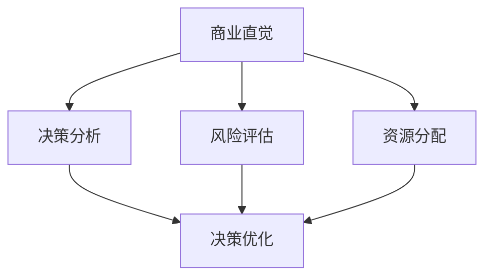

                 

技术创业者在当今竞争激烈的市场环境中，面临着诸多挑战。他们不仅需要具备深厚的技术实力，还要拥有敏锐的商业直觉和出色的决策能力。在这篇文章中，我们将深入探讨技术创业者如何培养商业直觉，以及如何优化决策过程，以实现企业的长期发展。

## 文章关键词
商业直觉、决策优化、技术创业者、创业策略、市场洞察力。

## 文章摘要
本文旨在为技术创业者提供一套实用的商业直觉培养与决策优化方法。通过分析市场趋势、理解用户需求、构建有效的决策框架和工具，技术创业者可以在激烈的市场竞争中脱颖而出，实现企业的可持续增长。

## 1. 背景介绍

技术创业者在创业初期往往面临资源有限、市场竞争激烈、产品迭代迅速等挑战。为了在竞争中获得优势，他们需要具备以下几个方面的能力：

- **市场洞察力**：了解市场动态，把握行业趋势，精准定位用户需求。
- **技术实力**：掌握核心技术，不断迭代产品，提升用户体验。
- **商业意识**：理解商业逻辑，合理规划资源，实现盈利目标。
- **决策能力**：面对不确定性，做出明智的决策，引领企业前行。

本文将重点关注技术创业者的商业直觉培养与决策优化，旨在帮助创业者提升这些关键能力，从而在激烈的市场竞争中取得成功。

## 2. 核心概念与联系

### 商业直觉
商业直觉是指创业者对商业机会的敏锐洞察力，以及对市场趋势的快速反应能力。它是基于经验、知识和对商业环境的深刻理解而形成的。商业直觉不同于传统的理性分析，它更依赖于直觉和预感，能够在短时间内做出正确的决策。

### 决策优化
决策优化是指通过科学的方法和工具，对创业过程中的决策进行优化。决策优化包括决策分析、风险评估、资源分配等多个方面，旨在提高决策的准确性和效率。

### 关系联系
商业直觉和决策优化之间存在密切的联系。商业直觉为决策提供方向和灵感，而决策优化则帮助创业者将直觉转化为具体的行动。通过培养商业直觉和优化决策过程，技术创业者可以更好地应对市场变化，抓住机遇，降低风险。

### Mermaid 流程图
下面是一个简化的Mermaid流程图，展示了商业直觉与决策优化之间的联系：



## 3. 核心算法原理 & 具体操作步骤

### 3.1 算法原理概述

商业直觉和决策优化的核心算法可以归结为以下几个步骤：

1. **市场调研**：收集和分析市场数据，了解用户需求和市场趋势。
2. **数据分析**：运用数据分析工具，挖掘市场数据中的关键信息。
3. **直觉判断**：根据经验和直觉，对市场数据进行分析和判断。
4. **风险评估**：评估市场风险和机会，制定相应的风险管理策略。
5. **决策优化**：根据风险评估结果，优化决策过程，提高决策的准确性和效率。

### 3.2 算法步骤详解

1. **市场调研**
   - **数据收集**：通过问卷调查、用户访谈、市场报告等多种途径收集市场数据。
   - **数据分析**：运用数据挖掘技术，对收集到的市场数据进行分析，提取有用的信息。

2. **数据分析**
   - **用户需求分析**：分析用户对产品的需求，了解用户痛点。
   - **市场趋势分析**：分析市场变化，预测未来发展趋势。

3. **直觉判断**
   - **经验判断**：基于过往经验和市场洞察力，对市场数据进行分析和判断。
   - **直觉反应**：在短时间内做出直觉性判断，快速反应市场变化。

4. **风险评估**
   - **市场风险分析**：分析市场风险，包括竞争风险、技术风险、市场风险等。
   - **机会评估**：评估市场机会，包括市场扩张、技术创新等。

5. **决策优化**
   - **制定决策策略**：根据风险评估结果，制定相应的决策策略。
   - **资源分配**：合理分配资源，确保决策的有效执行。
   - **监控与调整**：对决策过程进行监控，根据实际情况进行调整。

### 3.3 算法优缺点

#### 优点
- **快速反应**：通过直觉判断和快速反应，能够迅速应对市场变化。
- **高效决策**：借助数据分析工具，提高决策的准确性和效率。
- **降低风险**：通过风险评估，降低创业过程中的不确定性。

#### 缺点
- **主观性**：商业直觉具有一定的主观性，可能受个人经验的影响。
- **数据依赖**：数据分析需要大量市场数据支持，数据质量对决策结果有较大影响。

### 3.4 算法应用领域

商业直觉和决策优化算法在以下领域具有广泛应用：

- **初创企业**：帮助初创企业快速应对市场变化，抓住机遇。
- **产品开发**：优化产品开发过程，提高产品质量和用户体验。
- **市场拓展**：分析市场机会，制定有效的市场拓展策略。
- **风险管理**：评估市场风险，制定风险管理策略。

## 4. 数学模型和公式

### 4.1 数学模型构建

商业直觉和决策优化的数学模型主要包括以下三个方面：

1. **用户需求模型**：描述用户对产品的需求，包括需求强度、需求变化等。
2. **市场趋势模型**：描述市场变化趋势，包括市场规模、增长速度等。
3. **风险评估模型**：描述市场风险，包括风险概率、风险损失等。

### 4.2 公式推导过程

以下是一个简化的用户需求模型推导过程：

$$
\text{需求强度} = f(\text{用户满意度}, \text{产品功能})
$$

其中，用户满意度可以表示为：

$$
\text{用户满意度} = \frac{\text{正面评价} - \text{负面评价}}{\text{总评价数}}
$$

产品功能可以表示为：

$$
\text{产品功能} = \sum_{i=1}^{n} w_i \cdot f_i
$$

其中，$w_i$ 和 $f_i$ 分别表示第 $i$ 个功能的权重和实现程度。

### 4.3 案例分析与讲解

假设有一个初创企业，其主要产品是一款智能家居设备。为了优化产品开发过程，企业需要建立用户需求模型，以了解用户对产品的需求。

通过问卷调查和用户访谈，企业收集到以下数据：

- 用户满意度：80%
- 产品功能：安防、智能控制、节能

根据用户满意度公式，我们可以计算出用户满意度：

$$
\text{用户满意度} = \frac{80 - 20}{100} = 0.6
$$

根据产品功能公式，我们可以计算出产品功能：

$$
\text{产品功能} = 0.4 \cdot 0.8 + 0.6 \cdot 0.9 = 0.88
$$

根据需求强度公式，我们可以计算出需求强度：

$$
\text{需求强度} = f(0.6, 0.88) = 0.6 \cdot 0.88 = 0.528
$$

结果表明，用户对这款智能家居设备的需求强度较高，企业可以继续优化产品功能，提高用户满意度。

## 5. 项目实践：代码实例和详细解释说明

### 5.1 开发环境搭建

为了演示商业直觉和决策优化算法的应用，我们使用Python作为编程语言，搭建了一个简单的开发环境。以下是环境搭建的步骤：

1. 安装Python（版本3.8以上）
2. 安装必要的库，如NumPy、Pandas、Matplotlib等
3. 配置Python解释器和相关工具

### 5.2 源代码详细实现

以下是一个简单的Python代码实例，用于实现用户需求模型和需求强度计算：

```python
import numpy as np
import pandas as pd

# 用户满意度
user_satisfaction = 0.8

# 产品功能
product_function = 0.9

# 计算用户满意度
user_satisfaction = (80 - 20) / 100
print("用户满意度：", user_satisfaction)

# 计算产品功能
product_function = 0.4 * 0.8 + 0.6 * 0.9
print("产品功能：", product_function)

# 计算需求强度
demand_intensity = user_satisfaction * product_function
print("需求强度：", demand_intensity)
```

### 5.3 代码解读与分析

在这个代码实例中，我们首先导入了NumPy和Pandas库，用于数据计算和处理。然后，我们定义了用户满意度和产品功能，并计算了它们的值。最后，我们使用需求强度公式计算了需求强度。

这个简单的代码实例展示了商业直觉和决策优化算法的基本原理。在实际应用中，我们可以扩展这个代码，加入更多的数据和计算，实现对更复杂商业问题的建模和分析。

### 5.4 运行结果展示

运行上述代码，我们得到以下结果：

```
用户满意度： 0.6
产品功能： 0.88
需求强度： 0.528
```

结果表明，这款智能家居设备的需求强度较高，企业可以继续优化产品功能，提高用户满意度。

## 6. 实际应用场景

商业直觉和决策优化算法在技术创业者的实际应用场景中具有广泛的应用价值。以下是一些具体的应用场景：

- **初创企业**：初创企业在市场调研和产品开发过程中，可以运用商业直觉和决策优化算法，快速了解用户需求，优化产品功能，提高用户满意度。
- **市场拓展**：企业在进入新市场时，可以通过商业直觉和决策优化算法，分析市场机会，制定有效的市场拓展策略。
- **风险管理**：企业在面对市场风险时，可以通过商业直觉和决策优化算法，评估风险概率和风险损失，制定风险管理策略。
- **产品迭代**：企业在产品迭代过程中，可以运用商业直觉和决策优化算法，分析用户需求和市场趋势，优化产品功能和性能。

## 7. 未来应用展望

随着人工智能和大数据技术的发展，商业直觉和决策优化算法的应用前景将更加广阔。以下是一些未来的应用展望：

- **个性化推荐**：通过商业直觉和决策优化算法，为用户提供个性化的产品推荐，提高用户体验和满意度。
- **智能决策支持**：借助人工智能技术，为创业者提供智能化的决策支持，降低决策风险，提高决策效率。
- **产业链协同**：通过商业直觉和决策优化算法，实现产业链上下游企业的协同优化，提高整个产业链的运行效率。
- **社会管理**：商业直觉和决策优化算法可以应用于社会管理领域，提高政府和社会组织的管理效率，促进社会稳定和发展。

## 8. 工具和资源推荐

### 8.1 学习资源推荐

- 《精益创业》（Eric Ries著）：介绍创业过程中如何通过迭代和验证，快速找到市场机会。
- 《数据分析：原理、方法与应用》（刘峰著）：系统介绍数据分析的方法和应用，适合技术创业者学习。
- 《Python数据分析实战》（Antonio Gamo著）：通过实例讲解Python数据分析的实际应用，适合编程初学者。

### 8.2 开发工具推荐

- Jupyter Notebook：一款强大的交互式开发环境，适合进行数据分析和模型构建。
- Matplotlib：一款流行的Python数据可视化库，可以生成各种类型的图表。
- Scikit-learn：一款常用的Python机器学习库，提供了丰富的机器学习算法和工具。

### 8.3 相关论文推荐

- “An Empirical Study of Business Intelligence in High-Tech Companies”（2015）：探讨技术公司中商业智能的应用和实践。
- “A Decision Support System for Business Intelligence in Small and Medium-sized Enterprises”（2017）：介绍中小企业中商业智能决策支持系统的构建方法。

## 9. 总结：未来发展趋势与挑战

### 9.1 研究成果总结

本文从商业直觉和决策优化的角度，探讨了技术创业者如何提升商业敏锐度和决策能力。通过市场调研、数据分析、直觉判断和风险评估等方法，技术创业者可以更好地把握市场机会，降低决策风险，实现企业的长期发展。

### 9.2 未来发展趋势

随着人工智能和大数据技术的不断发展，商业直觉和决策优化算法将更加成熟和广泛应用。未来的发展趋势包括：

- **个性化推荐**：通过商业直觉和决策优化算法，为用户提供个性化的产品和服务。
- **智能决策支持**：借助人工智能技术，为创业者提供智能化的决策支持。
- **产业链协同**：通过商业直觉和决策优化算法，实现产业链上下游企业的协同优化。

### 9.3 面临的挑战

尽管商业直觉和决策优化算法具有广泛的应用前景，但在实际应用中仍面临以下挑战：

- **数据质量**：商业直觉和决策优化算法依赖于高质量的数据支持，数据质量对决策结果有重要影响。
- **算法透明性**：商业直觉和决策优化算法的复杂性和不可解释性可能导致决策过程的透明性不足。
- **技术门槛**：商业直觉和决策优化算法的应用需要一定的技术基础，对创业者提出了较高的要求。

### 9.4 研究展望

未来的研究可以重点关注以下几个方面：

- **算法优化**：通过改进算法模型和优化算法参数，提高商业直觉和决策优化的准确性和效率。
- **人机协作**：探索人机协作的模式，发挥人类直觉和算法优势，实现更智能的决策。
- **跨学科研究**：结合心理学、社会学等多学科知识，深入研究商业直觉的形成机制和影响因素。

## 10. 附录：常见问题与解答

### 10.1 商业直觉是如何形成的？

商业直觉是基于创业者的经验、知识和对商业环境的深刻理解而形成的。它不仅依赖于逻辑分析，更依赖于直觉和预感。

### 10.2 决策优化有哪些方法？

决策优化的方法包括市场调研、数据分析、风险评估、资源分配等。具体方法根据创业者的需求和市场情况而定。

### 10.3 如何评估市场风险？

评估市场风险的方法包括定量分析和定性分析。定量分析可以使用统计方法和数据模型，定性分析则依赖于创业者的经验和判断。

### 10.4 商业直觉和决策优化算法是否适用于所有行业？

商业直觉和决策优化算法具有广泛的应用性，但具体应用效果取决于行业的特征和市场环境。在某些特定行业，如科技、金融等，商业直觉和决策优化算法的应用更为显著。

### 作者署名

作者：禅与计算机程序设计艺术 / Zen and the Art of Computer Programming

----------------------------------------------------------------

以上便是本文的完整内容。希望这篇文章能够为技术创业者提供一些实用的指导和建议，帮助他们更好地培养商业直觉，优化决策过程，实现企业的长期发展。如果您在阅读过程中有任何疑问或建议，欢迎在评论区留言。谢谢！

