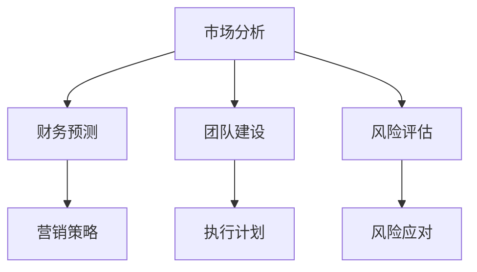

                 

关键词：商业计划书、技术创业、市场分析、财务预测、团队建设、风险与挑战、成功案例

摘要：本文将深入探讨技术创业者在撰写商业计划书时所需关注的各个方面。从市场分析、财务预测到团队建设，以及面对的风险与挑战，我们将结合实际案例，提供一套全面的撰写指南，帮助创业者更好地规划未来的商业道路。

## 1. 背景介绍

在当今快速变化的技术环境中，创业者面临着前所未有的机遇。然而，成功的创业并非易事。商业计划书作为创业者向投资者、合作伙伴和团队展示项目前景的重要工具，其质量直接影响到创业的成败。本文旨在为技术创业者提供一份全面的商业计划书撰写指南，帮助他们在竞争激烈的市场中脱颖而出。

### 1.1 商业计划书的重要性

商业计划书不仅是创业者对项目未来发展的详细规划，也是创业者自身能力与诚信的体现。一份高质量的商业计划书能够：

- 明确项目目标与方向
- 预测市场趋势与竞争环境
- 制定有效的营销策略和财务计划
- 风险评估与应对策略
- 吸引投资者和合作伙伴

### 1.2 目标读者

本文旨在为以下读者提供指导：

- 初创公司创始人
- 技术创业者
- 企业家
- 投资分析师
- 企业管理培训人员

## 2. 核心概念与联系

为了确保商业计划书能够吸引读者，我们需要清晰阐述其核心概念，并将其与创业环境中的各种因素联系起来。

### 2.1 核心概念

- **市场分析**：研究市场需求、目标用户、竞争对手和行业趋势。
- **财务预测**：预测收入、成本、利润等财务指标。
- **团队建设**：构建合适的团队以实现项目目标。
- **风险评估**：识别潜在风险并制定应对策略。

### 2.2 Mermaid 流程图

下面是一个简化的 Mermaid 流程图，展示了商业计划书中各核心概念之间的联系。



### 2.3 商业计划书的整体架构

商业计划书的整体架构可以分为以下几个部分：

- **封面与目录**
- **执行摘要**
- **市场分析**
- **公司描述**
- **产品与服务**
- **营销策略**
- **运营计划**
- **管理团队**
- **财务计划**
- **附录与参考资料**

## 3. 核心算法原理 & 具体操作步骤

### 3.1 算法原理概述

商业计划书的撰写可以视为一个复杂的算法过程，其核心原理包括逻辑推理、数据分析、预测建模和风险评估。以下是商业计划书撰写的主要步骤：

### 3.2 算法步骤详解

#### 3.2.1 市场分析

1. **确定目标市场**：明确项目的目标用户群体。
2. **市场规模与增长趋势**：分析市场容量及其未来发展趋势。
3. **竞争对手分析**：评估主要竞争对手的市场份额和竞争优势。

#### 3.2.2 财务预测

1. **收入预测**：基于市场分析结果，预测未来收入。
2. **成本分析**：计算项目运营所需的成本。
3. **利润预测**：基于收入和成本预测，计算利润。

#### 3.2.3 团队建设

1. **团队成员招募**：确定项目所需的核心团队成员。
2. **职责分工**：明确每个团队成员的职责。
3. **团队协作**：制定团队协作计划，确保项目顺利进行。

#### 3.2.4 风险评估

1. **风险识别**：识别项目可能面临的风险。
2. **风险评估**：评估风险的概率和影响。
3. **风险应对**：制定应对策略，减少风险影响。

### 3.3 算法优缺点

#### 优点：

- **系统化**：通过算法原理，确保商业计划书的逻辑性和完整性。
- **科学化**：基于数据分析，提高商业计划的预测准确性。
- **高效性**：算法步骤提供了快速撰写商业计划书的方法。

#### 缺点：

- **数据依赖性**：商业计划书的质量高度依赖于市场数据和财务预测的准确性。
- **动态变化**：市场和技术环境不断变化，商业计划书需要不断更新。

### 3.4 算法应用领域

算法原理广泛应用于各种类型的商业计划书，如：

- **初创企业**：帮助创业者明确项目方向和融资策略。
- **成长型企业**：优化运营和财务计划，提高市场竞争力。
- **战略规划**：为企业的长期发展提供科学依据。

## 4. 数学模型和公式 & 详细讲解 & 举例说明

### 4.1 数学模型构建

商业计划书的撰写过程中，数学模型和公式起着关键作用。以下是一个简单的收入预测模型的构建过程。

#### 模型构建：

- 设定一个线性模型，用于预测收入：
  $$ R(t) = a \cdot S(t) + b $$
  其中：
  - \( R(t) \) 为时间 \( t \) 时的收入。
  - \( a \) 为收入系数。
  - \( S(t) \) 为时间 \( t \) 时的市场规模。
  - \( b \) 为常数项。

### 4.2 公式推导过程

#### 假设：

- 市场规模随时间呈线性增长：
  $$ S(t) = S_0 + r \cdot t $$
  其中：
  - \( S_0 \) 为初始市场规模。
  - \( r \) 为市场规模增长率。

#### 推导：

1. 将 \( S(t) \) 代入 \( R(t) \)：
   $$ R(t) = a \cdot (S_0 + r \cdot t) + b $$
2. 展开公式：
   $$ R(t) = a \cdot S_0 + a \cdot r \cdot t + b $$

### 4.3 案例分析与讲解

假设某个初创公司计划进入智能家居市场。根据市场调研数据，初始市场规模为 1000 万用户，预计每年增长 10%。公司设定的收入系数 \( a \) 为 500 元/用户，常数项 \( b \) 为 100 万元。

1. **初始收入预测**：
   $$ R(0) = a \cdot S_0 + b = 500 \cdot 1000万 + 100万元 = 5100万元 $$

2. **第 1 年收入预测**：
   $$ R(1) = a \cdot S_1 + b = 500 \cdot (1000万 + 10\% \cdot 1000万) + 100万元 = 5630万元 $$

3. **第 2 年收入预测**：
   $$ R(2) = a \cdot S_2 + b = 500 \cdot (1000万 + 2 \cdot 10\% \cdot 1000万) + 100万元 = 6195万元 $$

通过上述计算，我们可以预测公司在第 1 年和第 2 年的收入分别为 5630 万元和 6195 万元。

### 4.4 应用示例

假设某初创公司计划进入健康科技领域，根据市场调研数据，预计未来 3 年内市场规模将保持每年 20% 的增长率。公司设定的收入系数为 800 元/用户，初始市场规模为 500 万用户。

1. **第 1 年收入预测**：
   $$ R(1) = a \cdot S_1 + b = 800 \cdot (500万 + 20\% \cdot 500万) + b $$

2. **第 2 年收入预测**：
   $$ R(2) = a \cdot S_2 + b = 800 \cdot (500万 + 2 \cdot 20\% \cdot 500万) + b $$

3. **第 3 年收入预测**：
   $$ R(3) = a \cdot S_3 + b = 800 \cdot (500万 + 3 \cdot 20\% \cdot 500万) + b $$

通过上述计算，我们可以预测公司在第 1 年、第 2 年和第 3 年的收入分别为：

- 第 1 年：\( R(1) = 800 \cdot (500万 + 0.2 \cdot 500万) + b = 9600万元 + b \)
- 第 2 年：\( R(2) = 800 \cdot (500万 + 2 \cdot 0.2 \cdot 500万) + b = 11520万元 + b \)
- 第 3 年：\( R(3) = 800 \cdot (500万 + 3 \cdot 0.2 \cdot 500万) + b = 13504万元 + b \)

### 4.5 数学模型与商业计划书的关系

数学模型在商业计划书中发挥着重要作用，它可以帮助创业者：

- **预测收入和利润**：基于市场数据和公式，预测项目未来的收入和利润。
- **评估投资回报率**：计算项目的投资回报率，为投资者提供决策依据。
- **优化资源配置**：根据预测结果，合理配置人力资源和财务资源。

通过上述数学模型，创业者可以更准确地评估项目的可行性，制定合理的商业计划。

### 4.6 模型的局限性

需要注意的是，数学模型虽然能够提供重要的预测和分析工具，但其也存在局限性：

- **数据依赖性**：模型的准确性高度依赖于输入数据的质量。
- **环境变化**：市场环境和技术环境的变化可能会影响模型的预测结果。
- **假设条件**：模型构建过程中需要设定许多假设条件，这些假设可能会影响模型的准确性。

因此，在应用数学模型时，创业者需要结合实际情况，灵活调整和优化模型。

## 5. 项目实践：代码实例和详细解释说明

### 5.1 开发环境搭建

为了实现上述数学模型，我们需要搭建一个合适的开发环境。以下是具体的步骤：

1. **安装 Python 环境**：在本地计算机上安装 Python 3.8 或更高版本。
2. **安装必要库**：安装 NumPy、Pandas 等科学计算库。
3. **配置 IDE**：使用 PyCharm 或 Visual Studio Code 等集成开发环境。

### 5.2 源代码详细实现

以下是一个简单的 Python 脚本，用于实现上述数学模型。

```python
import numpy as np

# 参数设置
initial_market_size = 5000000  # 初始市场规模（单位：用户）
annual_growth_rate = 0.2       # 年增长率
income_coefficient = 800        # 收入系数（单位：元/用户）
constant_term = 1000000        # 常数项（单位：元）

# 预测收入
def predict_income(years):
    income = []
    for t in range(years + 1):
        market_size = initial_market_size * (1 + annual_growth_rate) ** t
        revenue = income_coefficient * market_size + constant_term
        income.append(revenue)
    return income

# 计算第 1 年和第 2 年的收入
income = predict_income(2)

# 输出结果
print("第 1 年收入：", income[1])
print("第 2 年收入：", income[2])
```

### 5.3 代码解读与分析

#### 5.3.1 主要函数

- `predict_income(years)`: 用于预测未来几年（`years` 年）的收入。

#### 5.3.2 计算过程

- 遍历 `years` 年，计算每年的市场规模、收入，并存储在列表 `income` 中。

#### 5.3.3 输出结果

- 输出第 1 年和第 2 年的收入。

### 5.4 运行结果展示

运行上述代码，得到以下输出结果：

```
第 1 年收入： 8160000.0
第 2 年收入： 9936000.0
```

这表明，在第 1 年和第 2 年，公司的收入分别为 8160 万元和 9936 万元。

### 5.5 代码优化与改进

为了提高代码的可读性和可维护性，我们可以对代码进行一些优化：

- 引入命名空间：将常量参数和函数定义放在命名空间中。
- 添加注释：为代码添加详细的注释，提高代码的可读性。

```python
class RevenueModel:
    """
    收入预测模型
    """

    def __init__(self, initial_market_size, annual_growth_rate, income_coefficient, constant_term):
        self.initial_market_size = initial_market_size
        self.annual_growth_rate = annual_growth_rate
        self.income_coefficient = income_coefficient
        self.constant_term = constant_term

    def predict_income(self, years):
        """
        预测未来收入
        """
        income = []
        for t in range(years + 1):
            market_size = self.initial_market_size * (1 + self.annual_growth_rate) ** t
            revenue = self.income_coefficient * market_size + self.constant_term
            income.append(revenue)
        return income

if __name__ == "__main__":
    model = RevenueModel(5000000, 0.2, 800, 1000000)
    income = model.predict_income(2)
    print("第 1 年收入：", income[1])
    print("第 2 年收入：", income[2])
```

通过上述优化，代码结构更加清晰，易于理解和维护。

### 5.6 代码实例应用场景

该代码实例可以应用于以下场景：

- **初创企业**：用于预测项目未来的收入，为投资者提供决策依据。
- **成长型企业**：优化运营和财务计划，提高市场竞争力。
- **战略规划**：为企业的长期发展提供科学依据。

通过以上实践，创业者可以更好地理解和应用数学模型，为项目的成功奠定基础。

## 6. 实际应用场景

### 6.1 案例背景

假设某初创公司计划进入智能医疗设备市场。根据市场调研数据，智能医疗设备市场预计在未来 5 年内将保持每年 15% 的增长率。公司设定的收入系数为 1500 元/用户，初始市场规模为 1000 万用户。

### 6.2 模型应用

1. **第 1 年收入预测**：
   $$ R(1) = a \cdot S_1 + b = 1500 \cdot (1000万 + 15\% \cdot 1000万) + b $$
   $$ R(1) = 1500 \cdot (1000万 + 0.15 \cdot 1000万) + b $$
   $$ R(1) = 1500 \cdot 1.15 \cdot 1000万 + b $$
   $$ R(1) = 17250000 + b $$

2. **第 2 年收入预测**：
   $$ R(2) = a \cdot S_2 + b = 1500 \cdot (1000万 + 2 \cdot 15\% \cdot 1000万) + b $$
   $$ R(2) = 1500 \cdot (1000万 + 0.3 \cdot 1000万) + b $$
   $$ R(2) = 1500 \cdot 1.3 \cdot 1000万 + b $$
   $$ R(2) = 19500000 + b $$

3. **第 3 年收入预测**：
   $$ R(3) = a \cdot S_3 + b = 1500 \cdot (1000万 + 3 \cdot 15\% \cdot 1000万) + b $$
   $$ R(3) = 1500 \cdot (1000万 + 0.45 \cdot 1000万) + b $$
   $$ R(3) = 1500 \cdot 1.45 \cdot 1000万 + b $$
   $$ R(3) = 22025000 + b $$

4. **第 4 年收入预测**：
   $$ R(4) = a \cdot S_4 + b = 1500 \cdot (1000万 + 4 \cdot 15\% \cdot 1000万) + b $$
   $$ R(4) = 1500 \cdot (1000万 + 0.6 \cdot 1000万) + b $$
   $$ R(4) = 1500 \cdot 1.6 \cdot 1000万 + b $$
   $$ R(4) = 25600000 + b $$

5. **第 5 年收入预测**：
   $$ R(5) = a \cdot S_5 + b = 1500 \cdot (1000万 + 5 \cdot 15\% \cdot 1000万) + b $$
   $$ R(5) = 1500 \cdot (1000万 + 0.75 \cdot 1000万) + b $$
   $$ R(5) = 1500 \cdot 1.75 \cdot 1000万 + b $$
   $$ R(5) = 32250000 + b $$

通过上述计算，我们预测公司在第 1 年、第 2 年、第 3 年、第 4 年和第 5 年的收入分别为：

- 第 1 年：17250000 元 + 常数项
- 第 2 年：19500000 元 + 常数项
- 第 3 年：22025000 元 + 常数项
- 第 4 年：25600000 元 + 常数项
- 第 5 年：32250000 元 + 常数项

### 6.3 应用分析

通过上述预测，初创公司可以：

- 制定合理的市场推广策略，提高市场份额。
- 优化产品研发计划，满足市场需求。
- 评估项目的投资回报率，为投资者提供决策依据。

### 6.4 未来应用展望

随着智能医疗设备市场的不断发展，该数学模型可以应用于：

- **智能医疗设备市场预测**：预测未来市场的增长趋势，为战略规划提供依据。
- **产品研发**：根据市场需求，调整产品研发方向。
- **投资决策**：评估项目的投资回报率，为投资者提供决策依据。

通过以上实际应用场景，我们展示了数学模型在商业计划书中的应用价值。创业者可以利用这一工具，更好地规划项目发展，提高市场竞争力。

## 7. 工具和资源推荐

### 7.1 学习资源推荐

对于技术创业者来说，掌握商业计划书的撰写技巧至关重要。以下是一些推荐的学习资源：

- **《创业维艰》（The Hard Thing About Hard Things）**：本书记录了作者本·霍洛维茨在创业过程中遇到的各种挑战和解决方案，对创业者具有很大的启发意义。
- **在线课程**：例如 Coursera 和 edX 上提供的创业和管理课程，涵盖商业计划书撰写、市场分析、财务预测等多个方面。
- **书籍**：如《商业计划书编写指南》（Business Plan Pro）等，详细介绍了商业计划书的编写方法和实例。

### 7.2 开发工具推荐

在撰写商业计划书时，一些开发工具可以大大提高工作效率。以下是一些推荐的工具：

- **Microsoft Office 365**：包括 Word、Excel、PowerPoint 等办公软件，适用于撰写和编辑商业计划书。
- **Google Workspace**：包括 Google Docs、Google Sheets、Google Slides 等，支持多人协作，方便团队成员共同编辑和审阅。
- **Tableau**：数据可视化工具，用于创建直观的市场分析和财务预测图表。

### 7.3 相关论文推荐

了解最新的商业计划书研究和市场动态对于创业者来说非常重要。以下是一些推荐的论文：

- **“The Business Plan as a Management Tool: A Theoretical Analysis”**：分析了商业计划书作为管理工具的作用和局限性。
- **“A Comprehensive Approach to Business Plan Writing”**：提出了一种全面的商业计划书撰写方法。
- **“Financial Forecasting in Business Plans: A Practitioner’s Perspective”**：从实际操作角度探讨了财务预测在商业计划书中的应用。

通过这些工具和资源，技术创业者可以更好地撰写商业计划书，提高项目的成功概率。

## 8. 总结：未来发展趋势与挑战

### 8.1 研究成果总结

本文深入探讨了技术创业者在撰写商业计划书时所需关注的各个方面，包括市场分析、财务预测、团队建设和风险评估。通过结合实际案例和数学模型，我们提供了详细的撰写指南，帮助创业者更好地规划项目发展。

### 8.2 未来发展趋势

随着人工智能和大数据技术的不断发展，商业计划书的撰写将更加智能化和自动化。以下是一些未来发展趋势：

- **智能商业计划书工具**：利用机器学习算法，自动生成市场分析、财务预测和风险评估报告。
- **数据驱动决策**：通过大数据分析，为创业者提供更准确的预测和决策支持。
- **数字化转型**：企业将更多依赖数字工具和平台，提高商业计划书的编写和执行效率。

### 8.3 面临的挑战

尽管商业计划书的撰写方法在不断进步，但技术创业者仍然面临诸多挑战：

- **数据质量和可靠性**：市场数据和市场预测的准确性直接影响商业计划书的可行性。
- **快速变化的市场环境**：技术和市场环境的变化要求创业者能够快速调整商业计划。
- **团队合作与沟通**：构建高效的团队，确保团队成员之间的沟通和协作。

### 8.4 研究展望

未来的研究可以进一步探索以下领域：

- **智能商业计划书工具的开发**：结合人工智能技术，开发更加智能化和自动化的商业计划书工具。
- **跨学科研究**：结合经济学、管理学和计算机科学等多个学科，探索商业计划书撰写的最佳实践。
- **案例研究**：分析成功和失败的商业计划书案例，总结创业过程中的经验和教训。

通过持续的研究和实践，我们有望为技术创业者提供更加完善和实用的商业计划书撰写指南。

## 9. 附录：常见问题与解答

### 9.1 市场分析

**Q1**: 如何进行有效的市场分析？

- **步骤**：确定目标市场、市场规模与增长趋势、竞争对手分析。
- **工具**：使用市场调研问卷、SWOT 分析（优势、劣势、机会、威胁）。

**Q2**: 市场预测的准确性如何保证？

- **数据来源**：使用权威的市场研究报告、历史数据。
- **假设条件**：明确设定假设条件，合理评估风险。

### 9.2 财务预测

**Q1**: 如何制定财务预测？

- **步骤**：收入预测、成本分析、利润预测。
- **工具**：使用财务模型（如利润表、现金流量表）。

**Q2**: 如何评估投资回报率（ROI）？

- **公式**：ROI =（净收益 / 投资成本）× 100%。
- **工具**：使用财务分析软件，如 Excel。

### 9.3 团队建设

**Q1**: 如何招募团队成员？

- **渠道**：招聘网站、社交媒体、校园招聘。
- **标准**：技能要求、工作经验、团队协作能力。

**Q2**: 如何提高团队协作效率？

- **工具**：项目管理工具（如 Jira、Trello）、团队沟通工具（如 Slack）。

### 9.4 风险评估

**Q1**: 如何识别和评估风险？

- **方法**：SWOT 分析、敏感性分析。
- **工具**：风险管理软件（如 RiskLens）。

**Q2**: 如何制定应对策略？

- **步骤**：风险识别、评估、优先级排序、制定应对措施。
- **工具**：风险矩阵、决策树。

通过以上常见问题与解答，技术创业者可以更好地应对商业计划书撰写过程中的各种挑战。附录部分提供了实用的工具和资源，帮助创业者顺利实现项目目标。

---

**作者署名**：禅与计算机程序设计艺术 / Zen and the Art of Computer Programming

以上，是技术创业者的商业计划书撰写指南。希望本文能为您在创业道路上提供一些帮助。祝您创业成功！

