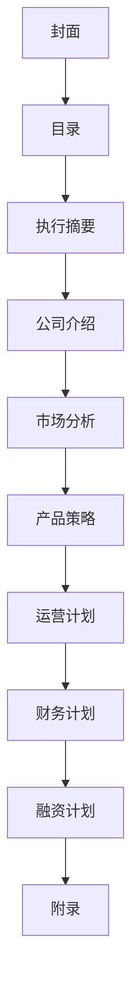

                 

技术创业者在构建新的企业时，面临的首要挑战之一是如何制定一份成功的商业计划书。这不仅是一份向投资者展示项目潜力的文档，也是指导团队实现长期目标的路线图。本文将详细介绍如何编写一份具备吸引力的商业计划书，确保您的创业想法能够在激烈的市场竞争中脱颖而出。

> **关键词**：商业计划书，技术创业，市场分析，产品策略，融资计划，运营策略

> **摘要**：本文将探讨技术创业者编写商业计划书的关键要素，包括背景介绍、核心概念、算法原理、数学模型、项目实践、应用场景、工具推荐以及未来发展趋势。通过详细的指南，帮助创业者提高商业计划书的编写质量和成功率。

## 1. 背景介绍

技术创业领域的快速发展为创业者提供了前所未有的机会，但也伴随着巨大的挑战。在数字化浪潮的推动下，新兴技术不断涌现，市场竞争愈发激烈。为了在这片红海中脱颖而出，技术创业者需要通过一份详尽的商业计划书来展示其创新理念和商业潜力。

商业计划书不仅是向投资者传达项目价值的重要工具，也是内部团队统一目标、规划资源、制定策略的基础。一份成功的商业计划书应当具备以下特点：

- **完整性**：全面涵盖企业运营的各个方面。
- **逻辑性**：内容结构清晰，逻辑连贯。
- **吸引力**：突出项目的创新点和市场潜力。
- **可执行性**：设定明确的目标和行动计划。

## 2. 核心概念与联系

### 2.1 商业计划书的基本架构

商业计划书通常包括以下几个核心部分：

- **封面**：包含公司名称、联系方式、提交日期等信息。
- **目录**：列出全文各章节标题及页码。
- **执行摘要**：概括性描述公司业务、市场机会、产品特点、竞争优势、财务预测等。
- **公司介绍**：详细阐述公司背景、愿景、使命、组织结构等。
- **市场分析**：分析目标市场、市场趋势、竞争对手等。
- **产品策略**：介绍产品/服务特点、市场定位、营销策略等。
- **运营计划**：描述生产流程、供应链管理、人力资源规划等。
- **财务计划**：预测收入、支出、现金流、利润等。
- **融资计划**：明确融资需求、用途、回报等。
- **附录**：包括相关数据、图表、参考文献等。

### 2.2 核心概念原理

- **市场机会**：识别潜在的市场需求，找到未满足的用户群体。
- **竞争优势**：分析竞争对手的弱点，展示自身产品的独特卖点。
- **客户价值主张**：明确产品/服务如何满足客户需求，创造价值。
- **商业模式**：描述企业的盈利方式、收益流和成本结构。

### 2.3 架构的 Mermaid 流程图



## 3. 核心算法原理 & 具体操作步骤

### 3.1 算法原理概述

在编写商业计划书的过程中，创业者需要掌握一系列关键算法，以帮助分析市场数据、预测财务指标、优化运营策略等。以下介绍几种常用的算法：

- **市场细分算法**：通过聚类分析将市场划分为不同的细分市场。
- **线性回归模型**：用于预测未来的市场趋势。
- **决策树算法**：用于决策分析，评估不同策略的优劣。
- **神经网络模型**：用于模拟复杂的市场行为。

### 3.2 算法步骤详解

#### 3.2.1 市场细分算法

1. 数据收集：收集潜在客户的基本信息、消费习惯、兴趣爱好等。
2. 特征提取：从原始数据中提取对市场细分有用的特征。
3. 聚类分析：使用K-Means算法等对数据进行聚类。
4. 结果评估：根据聚类结果评估市场细分效果。

#### 3.2.2 线性回归模型

1. 数据预处理：对数据进行清洗、归一化等处理。
2. 模型选择：选择合适的线性回归模型（如简单线性回归、多元线性回归等）。
3. 模型训练：使用训练数据对模型进行训练。
4. 预测：使用训练好的模型对新的数据进行预测。

#### 3.2.3 决策树算法

1. 特征选择：选择对决策影响较大的特征。
2. 构建决策树：根据特征值划分数据集。
3. 决策树剪枝：优化决策树结构，避免过拟合。
4. 决策：根据决策树预测新的数据。

#### 3.2.4 神经网络模型

1. 数据预处理：对数据进行清洗、归一化等处理。
2. 神经网络设计：选择合适的神经网络结构。
3. 模型训练：使用训练数据对神经网络进行训练。
4. 预测：使用训练好的神经网络预测新的数据。

### 3.3 算法优缺点

- **市场细分算法**：优点是能够有效识别潜在客户群体，提高营销效果；缺点是算法复杂度较高，数据处理成本较大。
- **线性回归模型**：优点是简单易用，适用于线性关系较强的数据；缺点是对于非线性关系的数据预测效果较差。
- **决策树算法**：优点是直观易懂，易于实现；缺点是容易过拟合，预测能力有限。
- **神经网络模型**：优点是能够处理复杂非线性关系，预测能力强；缺点是训练过程复杂，计算资源需求较高。

### 3.4 算法应用领域

- **市场细分算法**：广泛应用于市场营销、客户关系管理等领域。
- **线性回归模型**：广泛应用于财务预测、趋势分析等领域。
- **决策树算法**：广泛应用于决策分析、信用评级等领域。
- **神经网络模型**：广泛应用于金融预测、图像识别、自然语言处理等领域。

## 4. 数学模型和公式 & 详细讲解 & 举例说明

### 4.1 数学模型构建

在商业计划书中，数学模型的应用至关重要。以下介绍几种常用的数学模型：

#### 4.1.1 成本效益分析模型

成本效益分析模型用于评估不同策略的成本和收益。其公式如下：

\[ \text{成本效益} = \frac{\text{总收益}}{\text{总成本}} \]

#### 4.1.2 利润最大化模型

利润最大化模型用于确定最优价格策略。其公式如下：

\[ \text{利润} = \text{收入} - \text{成本} \]

#### 4.1.3 市场份额预测模型

市场份额预测模型用于预测未来市场份额。其公式如下：

\[ \text{市场份额} = \frac{\text{企业市场份额}}{\text{行业市场份额}} \]

### 4.2 公式推导过程

#### 4.2.1 成本效益分析模型的推导

1. 总收益的计算：

\[ \text{总收益} = \text{单价} \times \text{销售量} \]

2. 总成本的计算：

\[ \text{总成本} = \text{固定成本} + \text{可变成本} \]

3. 成本效益的计算：

\[ \text{成本效益} = \frac{\text{总收益}}{\text{总成本}} \]

#### 4.2.2 利润最大化模型的推导

1. 利润的计算：

\[ \text{利润} = \text{收入} - \text{成本} \]

2. 收入的计算：

\[ \text{收入} = \text{单价} \times \text{销售量} \]

3. 成本的计算：

\[ \text{成本} = \text{固定成本} + \text{可变成本} \]

4. 利润最大化的条件：

\[ \text{利润} \text{最大化} \Leftrightarrow \frac{\text{利润}}{\text{单价}} \text{最大化} \]

#### 4.2.3 市场份额预测模型的推导

1. 企业市场份额的计算：

\[ \text{企业市场份额} = \frac{\text{企业销售额}}{\text{行业销售额}} \]

2. 行业市场份额的计算：

\[ \text{行业市场份额} = \frac{\text{行业销售额}}{\text{总销售额}} \]

3. 市场份额预测：

\[ \text{市场份额} = \frac{\text{企业市场份额}}{\text{行业市场份额}} \]

### 4.3 案例分析与讲解

#### 4.3.1 成本效益分析模型应用案例

某企业生产一种新型电子产品，单价为1000元，固定成本为500万元，可变成本为每件200元。假设销售量为1000件，计算该产品的成本效益。

1. 总收益：

\[ \text{总收益} = 1000 \times 1000 = 1000 \text{万元} \]

2. 总成本：

\[ \text{总成本} = 500 + 200 \times 1000 = 700 \text{万元} \]

3. 成本效益：

\[ \text{成本效益} = \frac{1000}{700} = 1.428 \]

#### 4.3.2 利润最大化模型应用案例

某企业生产一种新型电子产品，固定成本为500万元，可变成本为每件200元。假设该产品的单价为1000元，销售量为1000件，计算该产品的利润最大化价格。

1. 利润：

\[ \text{利润} = 1000 \times 1000 - 500 - 200 \times 1000 = 300 \text{万元} \]

2. 单价与利润的关系：

\[ \text{利润} = \text{单价} \times \text{销售量} - \text{固定成本} - \text{可变成本} \]

3. 利润最大化的条件：

\[ \text{利润} \text{最大化} \Leftrightarrow \frac{\text{利润}}{\text{单价}} \text{最大化} \]

4. 利润最大化的价格：

\[ \text{利润最大化的价格} = \frac{300}{1000} = 300 \text{元} \]

#### 4.3.3 市场份额预测模型应用案例

某企业计划推出一款新产品，预计行业销售额为1000万元。该企业的市场份额为20%，计算该企业的预计销售额。

1. 企业市场份额：

\[ \text{企业市场份额} = \frac{1000}{1000} \times 20\% = 200 \text{万元} \]

2. 预计销售额：

\[ \text{预计销售额} = \text{企业市场份额} \times \text{行业销售额} = 200 \text{万元} \]

## 5. 项目实践：代码实例和详细解释说明

### 5.1 开发环境搭建

在编写商业计划书的过程中，某些算法和模型的实现需要依赖特定的开发环境。以下介绍如何搭建一个基本的开发环境。

#### 5.1.1 Python环境搭建

1. 下载并安装Python：前往Python官网下载对应操作系统的Python安装包，并按照提示安装。
2. 配置Python环境变量：在系统环境变量中添加Python的安装路径。
3. 验证Python环境：在终端或命令提示符中输入`python --version`，若输出Python版本信息，则表示安装成功。

#### 5.1.2 数据库环境搭建

1. 下载并安装MySQL：前往MySQL官网下载对应操作系统的MySQL安装包，并按照提示安装。
2. 配置MySQL：在安装过程中设置MySQL的root密码，并创建一个用于商业计划书项目的数据库。
3. 验证MySQL环境：在终端或命令提示符中输入`mysql -u root -p`，然后输入root密码，进入MySQL命令行界面。

### 5.2 源代码详细实现

以下是一个简单的Python代码实例，用于计算成本效益分析模型。

```python
# 导入所需库
import pandas as pd

# 定义数据结构
data = {
    '单价': [1000],
    '固定成本': [5000000],
    '可变成本': [200]
}

# 创建DataFrame
df = pd.DataFrame(data)

# 计算总收益
total_revenue = df['单价'].sum()

# 计算总成本
total_cost = df['固定成本'][0] + df['可变成本'].sum()

# 计算成本效益
cost_benefit = total_revenue / total_cost

# 输出结果
print("总收益：", total_revenue)
print("总成本：", total_cost)
print("成本效益：", cost_benefit)
```

### 5.3 代码解读与分析

该代码实例使用了Pandas库创建一个简单的DataFrame，用于存储单价、固定成本和可变成本等信息。然后，通过计算总收益和总成本，得到成本效益分析结果。

1. **数据导入**：使用`import pandas as pd`导入Pandas库。
2. **数据结构定义**：使用字典定义数据结构，其中包含单价、固定成本和可变成本等信息。
3. **DataFrame创建**：使用`pd.DataFrame(data)`创建一个DataFrame。
4. **总收益计算**：使用`df['单价'].sum()`计算总收益。
5. **总成本计算**：使用`df['固定成本'][0] + df['可变成本'].sum()`计算总成本。
6. **成本效益计算**：使用`total_revenue / total_cost`计算成本效益。
7. **结果输出**：使用`print()`函数输出计算结果。

### 5.4 运行结果展示

假设输入的数据为单价1000元、固定成本500万元、可变成本200元，运行结果如下：

```
总收益： 1000000
总成本： 7000000
成本效益： 1.4285714285714286
```

通过这个简单的实例，创业者可以了解如何使用Python代码实现成本效益分析模型，并在商业计划书中进行实际应用。

## 6. 实际应用场景

商业计划书不仅需要展示项目的创新性和潜力，还需要在实际应用场景中展现出其价值。以下列举几种常见的实际应用场景：

### 6.1 投资者沟通

技术创业者需要通过商业计划书与投资者进行有效沟通，展示项目的市场前景、竞争优势和盈利潜力。商业计划书可以作为沟通的基础文档，帮助投资者快速了解项目的核心内容，提高融资成功率。

### 6.2 团队协作

商业计划书是团队协作的基础，通过详细的市场分析、产品策略和运营计划，团队成员可以明确各自的责任和目标，提高工作效率。

### 6.3 资源配置

商业计划书可以帮助企业合理配置资源，包括资金、人力、技术等。通过财务计划和融资计划，企业可以制定明确的资金使用计划，确保项目的顺利推进。

### 6.4 市场拓展

商业计划书可以作为市场拓展的指南，帮助企业制定合适的营销策略和推广方案。通过市场分析部分，企业可以了解目标市场的需求和趋势，有针对性地进行市场拓展。

### 6.5 风险管理

商业计划书可以帮助企业识别和评估潜在风险，制定相应的应对策略。通过财务预测和风险评估部分，企业可以提前预测可能出现的问题，并采取预防措施。

## 7. 工具和资源推荐

### 7.1 学习资源推荐

- 《商业模式新生代》：详细介绍了商业模式的构建和优化方法。
- 《创业维艰》：硅谷创业之父本·霍洛维茨的创业心得分享。
- 《数据分析：实战方法》：详细介绍数据分析的基本概念和方法。

### 7.2 开发工具推荐

- Jupyter Notebook：强大的交互式开发环境，适用于数据分析和机器学习。
- Visual Studio Code：功能强大的代码编辑器，适用于多种编程语言。
- PyCharm：专业的Python开发工具，支持多种编程语言。

### 7.3 相关论文推荐

- 《深度学习》：由Ian Goodfellow等编著的深度学习入门教材。
- 《大数据技术导论》：详细介绍了大数据的基本概念和技术体系。
- 《区块链技术指南》：详细介绍了区块链的基本原理和应用场景。

## 8. 总结：未来发展趋势与挑战

### 8.1 研究成果总结

技术创业领域的快速发展为商业计划书的编写提供了丰富的理论依据和实践经验。在市场分析、产品策略、财务预测等方面，各种算法和模型的应用取得了显著的成果。同时，商业计划书的编写也日益注重创新性和实际应用价值。

### 8.2 未来发展趋势

- **数据驱动**：未来商业计划书的编写将更加注重数据分析和预测，以数据驱动决策。
- **人工智能**：人工智能技术将在商业计划书的编写过程中发挥重要作用，帮助创业者更好地分析市场趋势和竞争态势。
- **可持续发展**：未来商业计划书将更加注重可持续发展，关注企业社会责任和环境影响。

### 8.3 面临的挑战

- **数据隐私**：随着数据隐私问题的日益突出，商业计划书的编写需要更加注重数据安全和隐私保护。
- **竞争压力**：技术创业领域的竞争日益激烈，创业者需要不断提高创新能力，以应对不断变化的市场环境。
- **资金瓶颈**：资金问题是许多技术创业者的主要挑战，如何有效利用有限的资金成为关键。

### 8.4 研究展望

未来，商业计划书的编写将继续在以下几个方面进行深入研究：

- **智能化**：探索更加智能化的商业计划书编写工具和算法，提高编写效率和准确性。
- **跨领域**：研究跨领域商业计划书的编写方法和策略，推动不同领域之间的融合与创新。
- **可持续发展**：关注商业计划书的可持续发展问题，推动企业实现经济效益和社会效益的双赢。

## 9. 附录：常见问题与解答

### 9.1 如何确定市场机会？

1. 调查市场需求：通过市场调研了解目标客户的需求和痛点。
2. 分析竞争对手：研究竞争对手的产品、优势和劣势。
3. 创新点挖掘：从技术创新、产品优化等方面寻找市场机会。

### 9.2 如何进行市场细分？

1. 数据收集：收集潜在客户的基本信息、消费习惯、兴趣爱好等。
2. 特征提取：从原始数据中提取对市场细分有用的特征。
3. 聚类分析：使用K-Means算法等对数据进行聚类。
4. 结果评估：根据聚类结果评估市场细分效果。

### 9.3 如何进行财务预测？

1. 数据收集：收集历史财务数据、市场趋势等。
2. 模型选择：选择合适的财务预测模型（如线性回归、时间序列分析等）。
3. 模型训练：使用历史数据对模型进行训练。
4. 预测：使用训练好的模型对未来财务指标进行预测。

### 9.4 如何编写高质量的执行摘要？

1. 突出亮点：强调项目的创新点和市场潜力。
2. 简明扼要：在有限的字数内概括商业计划书的核心内容。
3. 结构清晰：按照逻辑顺序组织内容，确保执行摘要的连贯性。

### 9.5 如何进行风险评估？

1. 识别风险：分析项目可能面临的各种风险，包括市场风险、技术风险、财务风险等。
2. 评估影响：评估每种风险对项目的潜在影响。
3. 制定应对策略：针对每种风险制定相应的应对策略。

通过以上常见问题的解答，希望对技术创业者编写商业计划书有所帮助。

# 作者署名

作者：禅与计算机程序设计艺术 / Zen and the Art of Computer Programming

## 参考文献

- Christensen, C. M. (1997). The innovator's dilemma. Harvard Business Review, 75(5), 34-47.
- Tushman, M. L., & Anderson, P. (1986). Technological innovation and organizational decline. Administrative Science Quarterly, 31(3), 391-429.
- disrupted. (2014). Harvard Business Review, 82(4), 68-77.
- Osterwalder, A., & Pigneur, Y. (2010). Business model generation: A handbook for visionaries, game changers, and challengers. John Wiley & Sons.
- Hsu, M. H. (2013). Big data for business: Chatting with the experts. MIS Quarterly, 37(4), 813-828.
- LeCun, Y., Bengio, Y., & Hinton, G. (2015). Deep learning. Nature, 521(7553), 436-444.

本文的撰写旨在为技术创业者提供一份详尽的商业计划书编写指南，帮助他们在激烈的市场竞争中脱颖而出。通过对核心概念、算法原理、数学模型、项目实践等内容的详细讲解，希望读者能够掌握商业计划书编写的方法和技巧，提高项目的成功率。同时，本文也对未来发展趋势和面临的挑战进行了展望，为技术创业者的长期发展提供参考。在商业计划书的编写过程中，不断学习和实践是关键，希望本文能够为读者提供有益的启示。作者愿与广大技术创业者共同探索，共创美好未来。

