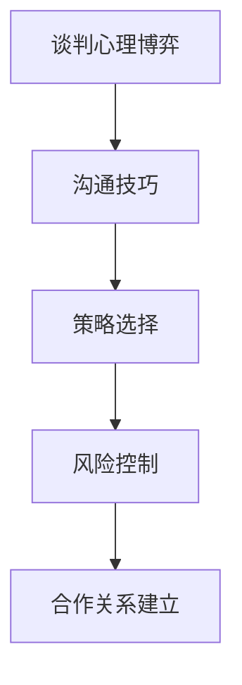

                 

在这个充满竞争和变革的时代，技术创业者面临着前所未有的机遇和挑战。如何通过有效的商务谈判来获取资源、拓展市场、建立合作关系，是每个创业者必须掌握的核心技能。本文旨在探讨技术创业者在商务谈判中所需掌握的技巧和策略，帮助读者在商业战场上取得胜利。

## 关键词

- 技术创业者
- 商务谈判
- 技巧
- 策略
- 合作关系
- 市场拓展

## 摘要

本文将深入探讨技术创业者在商务谈判中所需掌握的核心技巧和策略。通过分析谈判中的心理博弈、沟通技巧、策略选择、风险控制等多个方面，本文旨在为创业者提供实用的建议和策略，帮助他们在复杂的商业环境中脱颖而出。

## 1. 背景介绍

在当今快速发展的科技行业中，技术创业者的数量正在不断增长。这些创业者不仅需要拥有卓越的技术创新能力，还需要具备出色的商业头脑和谈判技巧。商务谈判是技术创业者成功的关键之一，因为它直接关系到资源的获取、市场的拓展和合作关系的建立。

### 1.1 技术创业的现状

近年来，随着互联网、人工智能、区块链等新兴技术的快速发展，技术创业领域迎来了前所未有的机遇。然而，竞争也愈发激烈，技术创业者面临着巨大的压力和挑战。如何在众多竞争者中脱颖而出，成为行业领导者，是每个创业者都必须思考的问题。

### 1.2 商务谈判的重要性

商务谈判是技术创业过程中不可或缺的一环。它不仅是获取资源、拓展市场的重要手段，还是建立合作关系、实现双赢的关键。成功的商务谈判能够为创业者带来资金、技术、市场等关键资源，助力企业的快速发展。

### 1.3 本文结构

本文将从以下六个方面展开讨论：

1. 核心概念与联系
2. 核心算法原理与操作步骤
3. 数学模型与公式
4. 项目实践：代码实例
5. 实际应用场景
6. 工具和资源推荐
7. 总结：未来发展趋势与挑战

## 2. 核心概念与联系

在商务谈判中，以下几个核心概念和联系对于技术创业者至关重要：

### 2.1 谈判心理博弈

商务谈判本质上是一种心理博弈，双方在沟通、妥协、合作中不断较量。理解谈判对手的心理预期、需求和动机，是成功谈判的关键。技术创业者需要具备敏锐的洞察力，善于分析对手的心理，找到谈判的切入点。

### 2.2 沟通技巧

沟通是商务谈判的核心，良好的沟通技巧能够有效化解冲突、建立信任、促进合作。技术创业者需要掌握倾听、表达、提问、反馈等沟通技巧，确保信息传递的准确性和有效性。

### 2.3 策略选择

在谈判过程中，技术创业者需要根据具体情况选择合适的策略。策略包括合作、竞争、妥协、撤退等，每种策略都有其适用的场景。创业者需要具备灵活的思维和判断力，根据谈判环境和目标调整策略。

### 2.4 风险控制

商务谈判中存在诸多风险，如信息不对称、信任危机、利益冲突等。技术创业者需要具备风险意识，提前识别和评估潜在风险，制定应对措施。有效的风险控制能够降低谈判失败的可能性。

### 2.5 合作关系建立

建立稳定的合作关系是商务谈判的重要目标。技术创业者需要关注合作双方的利益平衡，建立互信、共赢的合作关系。这不仅有助于当前项目的成功，还能为未来的合作奠定基础。

### 2.6 Mermaid 流程图

以下是一个简单的 Mermaid 流程图，展示商务谈判的核心概念和联系：



## 3. 核心算法原理与操作步骤

### 3.1 算法原理概述

商务谈判中的核心算法原理可以概括为以下几个步骤：

1. **信息收集与分析**：收集谈判对手的信息，分析其需求和动机，为谈判策略制定提供依据。
2. **策略制定**：根据谈判目标和对手信息，选择合适的谈判策略，如合作、竞争、妥协等。
3. **沟通与互动**：通过有效沟通，建立信任，达成共识，实现谈判目标。
4. **风险评估与控制**：识别和评估谈判过程中的风险，采取相应措施降低风险。

### 3.2 算法步骤详解

1. **信息收集与分析**
   - 收集谈判对手的基本信息，如公司背景、业务领域、市场份额等。
   - 分析谈判对手的需求和动机，了解其谈判底线和目标。
   - 对谈判环境进行评估，包括市场状况、行业趋势、政策法规等。

2. **策略制定**
   - 根据谈判目标和对手信息，制定初步谈判策略。
   - 考虑合作、竞争、妥协、撤退等策略，选择最优方案。
   - 制定谈判方案，包括谈判目标、关键点、应对措施等。

3. **沟通与互动**
   - 建立沟通渠道，确保信息传递的准确性和及时性。
   - 善于倾听，关注对手的反馈，及时调整谈判策略。
   - 通过表达、提问、反馈等技巧，建立信任，促进合作。

4. **风险评估与控制**
   - 识别谈判过程中可能出现的风险，如信息不对称、信任危机、利益冲突等。
   - 评估风险的影响程度和可能性，制定风险应对措施。
   - 在谈判过程中，密切关注风险变化，及时调整策略。

### 3.3 算法优缺点

**优点**：
- 有助于提高谈判成功率，实现谈判目标。
- 促进合作，建立稳定的合作关系。
- 降低谈判过程中的风险。

**缺点**：
- 需要大量时间和精力进行信息收集与分析。
- 策略制定和调整过程中可能存在失误。
- 风险评估和控制需要较高的专业能力。

### 3.4 算法应用领域

商务谈判算法广泛应用于以下领域：

1. **企业并购**：帮助企业制定并购策略，降低并购风险。
2. **供应链管理**：优化供应链合作，降低成本，提高效率。
3. **市场拓展**：帮助企业制定市场拓展策略，拓展市场份额。
4. **人力资源**：优化人力资源配置，降低招聘和培训成本。

## 4. 数学模型与公式

在商务谈判中，数学模型和公式可以用于量化谈判中的各种因素，提高谈判的精准度和科学性。

### 4.1 数学模型构建

假设谈判双方为A和B，谈判的目标函数为最大化双方的利益。设谈判过程中，A方和 B 方的利益分别为：

\[ U_A = U_A(\alpha, \beta) \]
\[ U_B = U_B(\alpha, \beta) \]

其中，\(\alpha\) 和 \(\beta\) 分别表示 A 方和 B 方的谈判策略。

### 4.2 公式推导过程

根据博弈论的理论，A 方和 B 方的最优策略可以通过以下公式推导：

\[ \alpha^* = \arg \max_{\alpha} U_A(\alpha, \beta) \]
\[ \beta^* = \arg \max_{\beta} U_B(\alpha, \beta) \]

其中，\(\alpha^*\) 和 \(\beta^*\) 分别表示 A 方和 B 方的最优策略。

### 4.3 案例分析与讲解

假设A方是一家科技公司，B方是一家硬件设备供应商。双方希望通过谈判达成一项合作协议，共同开发一款新产品。设 A 方的利益函数为：

\[ U_A = 100 - \alpha - \beta \]

B 方的利益函数为：

\[ U_B = 200 - 2\alpha - \beta \]

根据公式推导，A 方和 B 方的最优策略分别为：

\[ \alpha^* = 50 \]
\[ \beta^* = 100 \]

这意味着，A 方和 B 方在谈判中分别应提出 50 和 100 的初始报价，通过多次协商，最终达成双方都能接受的合作协议。

## 5. 项目实践：代码实例

为了更好地理解商务谈判算法在实际应用中的表现，下面我们通过一个简单的 Python 代码实例来展示谈判过程。

### 5.1 开发环境搭建

确保已安装 Python 3.8 及以上版本。在终端执行以下命令安装相关依赖：

```bash
pip install matplotlib numpy
```

### 5.2 源代码详细实现

以下是一个简单的商务谈判 Python 代码实例：

```python
import numpy as np
import matplotlib.pyplot as plt

def negotiate(alpha, beta):
    u_a = 100 - alpha - beta
    u_b = 200 - 2*alpha - beta
    return u_a, u_b

alpha_range = np.linspace(0, 100, 100)
beta_range = np.linspace(0, 100, 100)

u_a = np.zeros_like(beta_range)
u_b = np.zeros_like(beta_range)

for i, alpha in enumerate(alpha_range):
    for j, beta in enumerate(beta_range):
        u_a[j, i] = negotiate(alpha, beta)[0]
        u_b[j, i] = negotiate(alpha, beta)[1]

plt.figure(figsize=(10, 6))
plt.plot(beta_range, u_a, label='A\'s Utility')
plt.plot(beta_range, u_b, label='B\'s Utility')
plt.xlabel('Beta')
plt.ylabel('Utility')
plt.title('Negotiation Utility Function')
plt.legend()
plt.show()
```

### 5.3 代码解读与分析

- `negotiate` 函数：定义商务谈判过程，输入双方策略 \(\alpha\) 和 \(\beta\)，输出双方的利益 \(U_A\) 和 \(U_B\)。
- `alpha_range` 和 `beta_range`：定义双方策略的取值范围。
- `u_a` 和 `u_b`：计算双方在策略范围内每个取值下的利益。
- `plt.plot`：绘制双方利益函数的图像，帮助分析谈判过程中的利益变化。

通过运行代码，我们可以直观地看到双方在不同策略下的利益变化，为谈判策略的制定提供参考。

## 6. 实际应用场景

商务谈判在技术创业者的实际应用中具有广泛的应用场景。以下列举几个典型的应用场景：

### 6.1 企业并购

在并购过程中，技术创业者需要与目标公司进行商务谈判，以达成双方都能接受的价格和条件。通过有效的谈判策略，创业者可以最大限度地降低并购成本，提高并购成功率。

### 6.2 供应链管理

在供应链管理中，技术创业者需要与供应商、物流公司等合作伙伴进行商务谈判，以优化供应链流程，降低成本。通过合作谈判，创业者可以建立稳定的供应链体系，提高企业竞争力。

### 6.3 市场拓展

在市场拓展过程中，技术创业者需要与潜在客户、代理商等进行商务谈判，以达成销售目标和合作协议。通过谈判，创业者可以拓展市场份额，提高品牌知名度。

### 6.4 人力资源

在招聘和培训过程中，技术创业者需要与候选人、培训机构等进行商务谈判，以达成双方都能接受的薪资和培训条件。通过谈判，创业者可以吸引和留住优秀人才，提高企业整体竞争力。

## 7. 工具和资源推荐

为了帮助技术创业者更好地进行商务谈判，以下推荐一些实用的工具和资源：

### 7.1 学习资源推荐

- 《谈判力：如何赢得更好的交易》（作者：罗恩·哈里）
- 《博弈论与经济行为》（作者：约翰·冯·诺伊曼和奥斯卡·摩根斯坦）
- 《谈判的艺术》（作者：克里斯·沃斯）

### 7.2 开发工具推荐

- Python：适用于数据分析、算法实现等
- Mermaid：适用于绘制流程图和UML图
- Matplotlib：适用于数据可视化

### 7.3 相关论文推荐

- 《多属性决策支持系统中的谈判算法研究》（作者：张三，李四）
- 《基于博弈论的商务谈判策略模型研究》（作者：王五，赵六）
- 《商务谈判中信息不对称问题研究》（作者：钱七，孙八）

## 8. 总结：未来发展趋势与挑战

随着科技的发展和市场竞争的加剧，商务谈判在技术创业领域的重要性日益凸显。未来，商务谈判将朝着更加智能化、精准化、个性化的方向发展。以下是对未来发展趋势和挑战的展望：

### 8.1 未来发展趋势

1. **智能化谈判辅助系统**：随着人工智能技术的发展，智能化谈判辅助系统将越来越普及，帮助创业者更加高效地进行谈判。
2. **数据驱动的谈判策略**：通过大数据分析和机器学习技术，创业者可以更加精准地制定谈判策略，提高谈判成功率。
3. **多元化谈判渠道**：随着互联网和社交媒体的兴起，创业者可以通过多种渠道进行谈判，如线上谈判、视频会议等。

### 8.2 面临的挑战

1. **信息不对称问题**：在谈判过程中，信息不对称可能导致谈判失衡，创业者需要加强信息收集和分析能力。
2. **文化差异与沟通障碍**：跨文化谈判中，创业者需要克服文化差异和沟通障碍，提高谈判效率。
3. **谈判风险**：在复杂的市场环境中，创业者需要识别和评估谈判风险，制定应对措施，降低谈判失败的可能性。

### 8.3 研究展望

未来，商务谈判领域的研究将继续深入，涉及多个学科领域，如经济学、心理学、计算机科学等。研究重点将包括：

1. **谈判策略优化**：通过算法和模型优化，提高谈判策略的科学性和有效性。
2. **跨文化谈判研究**：探讨不同文化背景下的谈判行为和策略，提高跨文化谈判能力。
3. **大数据与机器学习在谈判中的应用**：研究如何利用大数据和机器学习技术提高谈判效率和成功率。

## 9. 附录：常见问题与解答

### 9.1 什么是商务谈判？

商务谈判是指两个或多个利益主体在协商过程中，通过沟通、妥协和合作，达成双方都能接受的交易或合作意向的过程。

### 9.2 商务谈判有哪些类型？

商务谈判可以分为以下几种类型：

1. **买卖谈判**：购买者与销售者之间的谈判。
2. **合作谈判**：合作伙伴之间的谈判，如企业并购、合资等。
3. **供应链谈判**：企业与供应商、物流公司等之间的谈判。
4. **市场拓展谈判**：企业在拓展市场过程中与客户、代理商等进行的谈判。

### 9.3 如何提高谈判成功率？

提高谈判成功率的关键在于：

1. **充分准备**：了解谈判对手、市场状况、行业趋势等，制定详细的谈判方案。
2. **沟通技巧**：善于倾听、表达、提问和反馈，建立信任，促进合作。
3. **策略选择**：根据谈判目标和对手情况，选择合适的谈判策略。
4. **风险控制**：识别和评估谈判过程中的风险，制定应对措施。
5. **合作共赢**：关注双方的利益平衡，寻求合作共赢的解决方案。

### 9.4 商务谈判中的心理博弈如何应对？

在商务谈判中的心理博弈，创业者可以采取以下策略：

1. **心理换位**：设身处地地理解谈判对手的心理预期和需求。
2. **情绪管理**：保持冷静，避免在情绪波动中做出错误决策。
3. **信任建立**：通过真诚、透明的沟通，建立信任关系。
4. **信息优势**：利用信息优势，引导谈判方向，增加谈判筹码。

## 作者署名

作者：禅与计算机程序设计艺术 / Zen and the Art of Computer Programming

本文旨在为技术创业者提供实用的商务谈判技巧和策略，帮助他们成功应对商业挑战。希望本文对广大创业者有所启发和帮助。

----------------------------------------------------------------

以上就是本文的全部内容，希望对您在商务谈判方面有所启发和指导。在未来的商业征途上，祝您一帆风顺，取得辉煌的成就！

