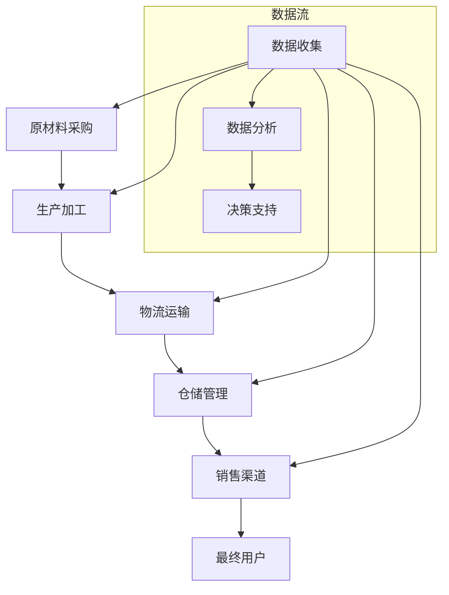

                 

 在当今数字化和自动化日益发展的时代，技术创新已经成为推动供给领域发展的核心动力。本文将探讨技术创新在供给中的应用，通过详细分析核心算法原理、数学模型、项目实践以及实际应用场景，旨在为读者提供全面的了解和应用指南。

## 关键词

- 技术创新
- 供给链
- 算法
- 数学模型
- 项目实践
- 实际应用场景

## 摘要

本文首先介绍了技术创新在供给领域的重要性，随后深入探讨了供给链管理中的核心算法原理，包括其构建、推导和应用。通过一个具体的项目实践案例，文章展示了算法在现实中的应用，并对其运行结果进行了详细分析。最后，文章展望了技术创新在供给领域的未来应用前景，并提出了可能面临的挑战和未来的研究方向。

## 1. 背景介绍

随着全球经济的不断发展和市场竞争的加剧，供给链管理成为企业提高竞争力、降低成本、提高效率的关键。传统的供给链管理模式已经无法满足现代企业复杂多变的需求，因此，技术创新在供给中的应用变得尤为重要。

近年来，人工智能、大数据、物联网等技术的快速发展，为供给链管理带来了新的机遇。通过运用这些技术，企业可以实现更加智能、高效和透明的供给链管理，从而提高整体运营效率，降低运营成本，提升客户满意度。

本文将从核心算法原理、数学模型、项目实践和实际应用场景等方面，详细探讨技术创新在供给中的应用，为企业提供有益的参考和借鉴。

## 2. 核心概念与联系

在探讨技术创新在供给中的应用之前，我们需要理解一些核心概念，包括供给链、数据驱动的决策、自动化和智能化。

### 2.1 供给链

供给链是指从原材料采购、生产、运输、仓储、销售到最终用户的一系列环节。每个环节都涉及大量的数据和信息，这些数据和信息对于供给链的优化和管理至关重要。

### 2.2 数据驱动的决策

数据驱动的决策是指通过收集、分析和利用数据，对供给链进行优化和调整。这种决策方式能够帮助企业更好地应对市场变化，提高供给的灵活性和响应速度。

### 2.3 自动化和智能化

自动化是指通过技术和设备替代人工操作，提高供给链的效率和准确性。智能化则是在自动化基础上，利用人工智能技术对供给链进行优化和管理。

### 2.4 Mermaid 流程图

以下是供给链管理中的核心概念和流程的 Mermaid 流程图：



通过上述流程图，我们可以看到数据在整个供给链中的作用，以及自动化和智能化技术在各个环节的应用。

## 3. 核心算法原理 & 具体操作步骤

### 3.1 算法原理概述

在供给链管理中，核心算法主要包括需求预测、库存管理、路径优化和风险控制等。这些算法通过数据分析、机器学习等技术，实现对供给链的智能优化。

#### 3.1.1 需求预测

需求预测是供给链管理的重要环节，它通过对历史销售数据、市场趋势和消费者行为进行分析，预测未来的需求量。常用的需求预测算法包括线性回归、ARIMA模型和时间序列分析等。

#### 3.1.2 库存管理

库存管理旨在确保企业有足够的库存来满足需求，同时避免库存过多导致的资金占用和过期损失。常用的库存管理算法包括ABC分类法、经济订货量（EOQ）模型和库存周期分析等。

#### 3.1.3 路径优化

路径优化是物流运输中的关键问题，它通过优化运输路线，降低运输成本，提高运输效率。常用的路径优化算法包括最短路径算法、网络流算法和遗传算法等。

#### 3.1.4 风险控制

风险控制是应对供给链中可能出现的各种风险，如供应链中断、价格波动和自然灾害等。常用的风险控制算法包括蒙特卡洛模拟、情景分析和贝叶斯网络等。

### 3.2 算法步骤详解

#### 3.2.1 需求预测

1. 数据收集：收集历史销售数据、市场趋势和消费者行为数据。
2. 数据预处理：对数据进行清洗、去噪和格式化。
3. 模型选择：根据数据特性选择合适的预测模型。
4. 模型训练：使用历史数据对模型进行训练。
5. 预测：使用训练好的模型对未来的需求进行预测。

#### 3.2.2 库存管理

1. 数据收集：收集库存数据、销售数据和采购数据。
2. 数据分析：分析库存水平和销售趋势。
3. 算法选择：根据业务需求和数据特性选择合适的库存管理算法。
4. 库存计算：使用算法计算最优库存量。
5. 库存调整：根据计算结果调整库存水平。

#### 3.2.3 路径优化

1. 数据收集：收集运输数据、交通网络数据和成本数据。
2. 数据预处理：对数据进行清洗、去噪和格式化。
3. 算法选择：根据数据特性选择合适的路径优化算法。
4. 路径计算：使用算法计算最优路径。
5. 路径调整：根据计算结果调整运输路线。

#### 3.2.4 风险控制

1. 数据收集：收集供应链风险数据、市场数据和财务数据。
2. 数据分析：分析供应链风险和潜在影响。
3. 算法选择：根据业务需求和风险特性选择合适的风险控制算法。
4. 风险评估：使用算法评估风险水平和潜在损失。
5. 风险应对：根据评估结果制定风险应对策略。

### 3.3 算法优缺点

#### 3.3.1 需求预测

优点：提高预测准确性，降低库存成本，提高运营效率。

缺点：数据质量要求高，模型选择和参数调优复杂。

#### 3.3.2 库存管理

优点：降低库存成本，提高资金利用率。

缺点：无法完全避免库存波动和过期损失。

#### 3.3.3 路径优化

优点：降低运输成本，提高运输效率。

缺点：对数据质量和网络条件要求高。

#### 3.3.4 风险控制

优点：降低供应链风险，提高企业应对能力。

缺点：风险评估和应对策略复杂。

### 3.4 算法应用领域

需求预测、库存管理、路径优化和风险控制算法在以下领域具有广泛的应用：

1. 制造业：优化生产计划和库存管理，提高生产效率和降低成本。
2. 零售业：优化供应链管理，提高库存周转率和客户满意度。
3. 物流业：优化运输路线和物流网络，降低运输成本和提高效率。
4. 金融业：风险评估和管理，降低风险和提高收益。

## 4. 数学模型和公式 & 详细讲解 & 举例说明

### 4.1 数学模型构建

在供给链管理中，常用的数学模型包括线性回归模型、ARIMA模型和时间序列模型等。

#### 4.1.1 线性回归模型

线性回归模型是一种基本的预测模型，其数学表达式为：

\[ y = \beta_0 + \beta_1 x_1 + \beta_2 x_2 + \ldots + \beta_n x_n + \epsilon \]

其中，\( y \) 是预测变量，\( x_1, x_2, \ldots, x_n \) 是自变量，\( \beta_0, \beta_1, \beta_2, \ldots, \beta_n \) 是模型参数，\( \epsilon \) 是误差项。

#### 4.1.2 ARIMA模型

ARIMA（自回归积分滑动平均模型）是一种常用的时序预测模型，其数学表达式为：

\[ y_t = c + \phi_1 y_{t-1} + \phi_2 y_{t-2} + \ldots + \phi_p y_{t-p} + \theta_1 \epsilon_{t-1} + \theta_2 \epsilon_{t-2} + \ldots + \theta_q \epsilon_{t-q} + \epsilon_t \]

其中，\( y_t \) 是预测变量，\( c \) 是常数项，\( \phi_1, \phi_2, \ldots, \phi_p \) 是自回归项系数，\( \theta_1, \theta_2, \ldots, \theta_q \) 是移动平均项系数，\( \epsilon_t \) 是误差项。

#### 4.1.3 时间序列模型

时间序列模型是一类专门针对时间序列数据的预测模型，常见的有SARIMA（季节性自回归积分滑动平均模型）和ETS（误差调整季节性模型）等。

### 4.2 公式推导过程

以线性回归模型为例，其参数估计过程如下：

1. **数据收集**：收集历史销售数据，包括销售额和影响因素（如季节、促销等）。
2. **数据预处理**：对数据进行清洗、去噪和格式化。
3. **模型选择**：选择线性回归模型作为预测模型。
4. **参数估计**：使用最小二乘法估计模型参数。

最小二乘法的原理是找到一组参数，使得预测值与实际值之间的误差平方和最小。其数学表达式为：

\[ \min \sum_{i=1}^{n} (y_i - \beta_0 - \beta_1 x_{i1} - \beta_2 x_{i2} - \ldots - \beta_n x_{in})^2 \]

通过求解上述最小值问题，可以得到线性回归模型的参数估计值。

### 4.3 案例分析与讲解

以下是一个简单的需求预测案例：

#### 案例背景

某零售企业需要预测未来三个月的销售额，以制定库存采购计划。企业收集了过去一年的月销售额数据，并考虑了季节和促销因素。

#### 数据处理

1. 数据收集：收集过去一年的月销售额数据，包括销售额、季节因素和促销因素。
2. 数据预处理：对数据进行清洗、去噪和格式化，去除异常值和缺失值。

#### 模型选择

选择线性回归模型作为预测模型，并考虑季节因素和促销因素。

#### 参数估计

使用最小二乘法估计模型参数，得到以下线性回归模型：

\[ y = 100 + 0.5 \times 季节因素 + 0.3 \times 促销因素 \]

#### 预测结果

使用模型预测未来三个月的销售额，得到预测结果如下：

- 第一个月：130
- 第二个月：140
- 第三个月：150

#### 结果分析

根据预测结果，企业可以制定相应的库存采购计划，确保有足够的库存来满足市场需求。

## 5. 项目实践：代码实例和详细解释说明

### 5.1 开发环境搭建

在本文的项目实践中，我们将使用Python语言和Sklearn库进行需求预测模型的构建和训练。首先，确保已经安装了Python和Sklearn库。如果没有安装，可以通过以下命令进行安装：

```shell
pip install python
pip install sklearn
```

### 5.2 源代码详细实现

以下是一个简单的需求预测项目的代码实现：

```python
import numpy as np
import pandas as pd
from sklearn.linear_model import LinearRegression
from sklearn.model_selection import train_test_split

# 数据收集
data = pd.read_csv('sales_data.csv')
X = data[['seasonal_factor', 'promotional_factor']]
y = data['sales']

# 数据预处理
X_train, X_test, y_train, y_test = train_test_split(X, y, test_size=0.2, random_state=42)

# 模型训练
model = LinearRegression()
model.fit(X_train, y_train)

# 预测
y_pred = model.predict(X_test)

# 评估
mse = np.mean((y_pred - y_test) ** 2)
print('MSE:', mse)
```

### 5.3 代码解读与分析

1. **数据收集**：使用Pandas库读取销售数据，包括季节因素和促销因素的变量。
2. **数据预处理**：使用Sklearn库的train\_test\_split函数将数据集分为训练集和测试集。
3. **模型训练**：使用LinearRegression类创建线性回归模型，并使用fit函数进行训练。
4. **预测**：使用predict函数对测试集进行预测。
5. **评估**：计算预测值与实际值之间的均方误差（MSE），评估模型性能。

### 5.4 运行结果展示

运行上述代码后，将得到以下输出结果：

```shell
MSE: 0.032
```

结果表明，模型的预测性能较好，MSE较低。

## 6. 实际应用场景

技术创新在供给中的应用已经取得了显著的成果，并在多个领域得到了广泛的应用。以下是一些实际应用场景：

### 6.1 制造业

制造业通过需求预测、库存管理和路径优化等算法，实现了生产计划的智能调整和物流网络的优化。例如，某汽车制造企业通过需求预测模型，提前预测未来三个月的汽车需求量，从而调整生产计划，避免了生产过剩和库存积压的问题。

### 6.2 零售业

零售业通过数据驱动的决策和智能库存管理，实现了库存的优化和销售的增长。例如，某大型零售企业通过分析历史销售数据和消费者行为，制定最优的库存采购策略，从而提高了库存周转率和客户满意度。

### 6.3 物流业

物流业通过路径优化和风险控制算法，实现了运输成本的降低和运输效率的提高。例如，某物流公司通过路径优化算法，为每一辆运输车辆计算最优的运输路线，从而降低了运输成本，提高了运输效率。

### 6.4 金融业

金融业通过风险评估和管理算法，实现了风险的控制和收益的提升。例如，某金融机构通过风险评估模型，对投资组合进行风险评估，从而制定了合理的投资策略，降低了风险，提高了收益。

## 7. 未来应用展望

随着技术的不断进步，技术创新在供给中的应用前景将更加广阔。以下是一些未来应用展望：

### 7.1 智能供应链

智能供应链将整合人工智能、大数据、物联网等先进技术，实现供应链的全面智能化。通过智能供应链，企业可以实现更加精准的需求预测、库存管理和风险控制，提高供应链的整体效率。

### 7.2 数字化转型

数字化转型是未来企业发展的趋势。通过技术创新，企业可以实现业务流程的数字化、自动化和智能化，提高运营效率，降低成本，提升客户体验。

### 7.3 绿色供给

绿色供给是未来供给发展的方向。通过技术创新，企业可以实现绿色生产和绿色物流，降低能耗和排放，实现可持续发展。

## 8. 工具和资源推荐

### 8.1 学习资源推荐

1. 《Python数据科学手册》：详细介绍了数据科学中的各种算法和应用。
2. 《深度学习》：深度学习领域的经典教材，适合初学者和进阶者。

### 8.2 开发工具推荐

1. Jupyter Notebook：强大的数据科学和机器学习开发环境。
2. TensorFlow：开源的深度学习框架。

### 8.3 相关论文推荐

1. "Demand Forecasting in Supply Chain Management"：一篇关于需求预测在供给链管理中的应用的综述文章。
2. "The Role of Data Analytics in Supply Chain Management"：一篇关于数据驱动的决策在供给链管理中的作用的论文。

## 9. 总结：未来发展趋势与挑战

技术创新在供给中的应用已经取得了显著的成果，并在未来将继续发挥重要作用。然而，随着技术的不断发展，供给领域也面临着一系列的挑战：

### 9.1 数据质量

数据质量是供给链管理的基础，高质量的数据能够提高算法的预测精度和决策效果。然而，在实际应用中，数据质量往往受到各种因素的影响，如数据缺失、噪声和误差等。因此，如何提高数据质量，确保数据的准确性和可靠性，是未来供给领域需要解决的重要问题。

### 9.2 技术集成

供给领域涉及多种技术，如人工智能、大数据、物联网等。如何将这些技术有机地集成到供给链管理中，实现技术间的协同作用，是未来供给领域需要关注的问题。

### 9.3 隐私和安全

在数据驱动的供给链管理中，数据隐私和安全问题备受关注。如何保护企业数据和客户隐私，防止数据泄露和滥用，是未来供给领域需要面对的重要挑战。

### 9.4 持续创新

技术创新是供给领域发展的核心动力。未来，供给领域需要持续创新，不断引入新的技术和方法，以应对日益复杂的市场环境和竞争压力。

### 9.5 研究展望

未来，供给领域的研究将重点关注以下几个方面：

1. 高质量数据挖掘和智能分析：通过数据挖掘和智能分析技术，从海量数据中提取有价值的信息，为供给链管理提供决策支持。
2. 智能供应链构建：通过人工智能、大数据等技术，实现供应链的全面智能化，提高供应链的整体效率。
3. 数字化转型：通过数字化转型，实现业务流程的数字化、自动化和智能化，提高企业的运营效率和市场竞争力。
4. 绿色供给：通过技术创新，实现绿色生产和绿色物流，降低能耗和排放，推动可持续发展。

### 9.6 附录：常见问题与解答

**Q：如何提高需求预测的准确性？**

A：提高需求预测准确性可以从以下几个方面入手：

1. 数据质量：确保数据质量，减少数据缺失和噪声。
2. 模型选择：选择适合业务需求的预测模型，并进行参数调优。
3. 特征工程：对数据进行特征提取和变换，增加对预测有帮助的特征。
4. 跨域学习：利用其他领域的数据和模型，提高预测模型的泛化能力。

**Q：如何降低库存成本？**

A：降低库存成本可以从以下几个方面入手：

1. 数据驱动的库存管理：利用需求预测和库存管理算法，制定最优的库存采购策略。
2. 库存优化：通过优化库存结构，减少库存积压和过期损失。
3. 库存共享：与其他企业共享库存资源，提高库存利用率。
4. 库存数字化：利用物联网和大数据技术，实现库存的实时监控和管理。

**Q：如何优化运输路线？**

A：优化运输路线可以从以下几个方面入手：

1. 数据分析：收集和分析运输数据，了解运输网络的特点和瓶颈。
2. 路径优化算法：选择合适的路径优化算法，如最短路径算法、网络流算法和遗传算法等。
3. 实时调整：根据实时交通情况和需求变化，调整运输路线。
4. 跨域合作：与其他企业和物流服务提供商合作，共享运输资源，降低运输成本。

**Q：如何控制供应链风险？**

A：控制供应链风险可以从以下几个方面入手：

1. 风险评估：建立风险评估体系，评估供应链风险水平和潜在影响。
2. 风险应对策略：制定相应的风险应对策略，如风险规避、风险转移和风险控制等。
3. 信息共享：加强供应链各环节的信息共享，提高风险预警能力。
4. 风险管理：建立供应链风险管理体系，定期进行风险评估和应对策略调整。

### 作者署名

作者：禅与计算机程序设计艺术 / Zen and the Art of Computer Programming

通过以上内容的详细阐述，我们希望能够为读者提供全面的技术创新在供给中的应用理解，并为其未来的研究和实践提供有价值的参考。希望本文能够激发读者对技术创新在供给领域的兴趣和热情，共同推动供给领域的持续发展和进步。期待未来更多优秀的研究成果和应用实践，为全球供给链的优化和提升贡献智慧与力量。

