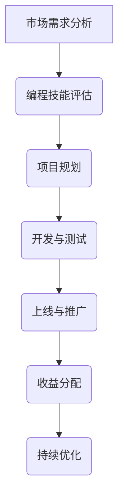

                 

关键词：技术副业、被动收入、程序员、增长策略、软件项目、编程技能、人工智能、云计算

> 摘要：本文将探讨程序员的被动收入增长策略，通过构建软件项目、利用云计算和人工智能技术，实现持续的收入增长。文章将详细介绍核心概念、算法原理、项目实践、数学模型以及未来应用展望，旨在为程序员提供实用的副业发展路径。

## 1. 背景介绍

在当前信息化时代，程序员作为技术人才的核心，面临着激烈的职场竞争。除了追求职业晋升和薪资增长，越来越多的程序员开始关注如何通过技术副业实现被动收入的增长。被动收入，即不需要持续投入时间和劳动，仍能获得持续收益的收入来源。对于程序员而言，技术副业不仅能够提高个人收入，还能够丰富工作经验，拓宽职业视野。

本文将围绕技术副业的构建，探讨程序员的被动收入增长策略。我们将从核心概念、算法原理、项目实践、数学模型等多个方面展开讨论，旨在为程序员提供一种切实可行的副业发展路径。

### 1.1 技术副业的定义

技术副业，指的是程序员在业余时间通过编程和技术手段，开发出具有商业价值的软件项目或服务，从而获得收益的行为。技术副业不同于传统的兼职工作，它更强调项目的长期价值和可持续性，而非短期的劳动力投入。

### 1.2 被动收入的优点

被动收入具有以下几个优点：

1. **时间自由**：程序员可以在不影响主要职业的情况下，自由安排时间进行技术副业开发。
2. **持续收益**：一旦项目上线，便能持续获得收益，而不需要持续投入时间和精力。
3. **技能提升**：通过技术副业，程序员可以不断学习新技术，提升自身技能。
4. **财务自由**：随着副业收入的增加，程序员可以逐步实现财务自由，减少对主要职业的依赖。

## 2. 核心概念与联系

### 2.1 技术副业的构成要素

技术副业主要由以下几个构成要素组成：

1. **编程技能**：程序员的核心竞争力，是实现技术副业的基础。
2. **市场需求**：了解市场需求，能够帮助程序员开发出具有商业价值的软件项目。
3. **商业模式**：技术副业的盈利模式，决定了项目的可持续性和收益水平。
4. **团队协作**：技术副业往往需要团队成员的协作，高效的团队协作能够提高项目开发效率。

### 2.2 技术副业的流程图



### 2.3 技术副业与核心概念的关联

1. **云计算**：云计算为技术副业提供了强大的计算和存储能力，降低了项目的成本和门槛。
2. **人工智能**：人工智能技术可以提升软件项目的智能化水平，提高用户体验，增强项目竞争力。
3. **区块链**：区块链技术可以用于技术副业的财务管理，确保交易的透明和安全性。

## 3. 核心算法原理 & 具体操作步骤

### 3.1 算法原理概述

技术副业的构建离不开算法的支撑。算法原理主要包括以下几个方面：

1. **需求分析算法**：通过数据分析，确定市场需求，为项目规划提供依据。
2. **编程算法**：利用编程语言和框架，实现软件项目的功能。
3. **优化算法**：对软件项目进行性能优化，提高用户体验和收益。

### 3.2 算法步骤详解

1. **需求分析**：
   - 数据收集：通过市场调研，收集用户需求数据。
   - 数据分析：使用统计分析方法，分析用户需求，确定项目定位。

2. **编程实现**：
   - 选择合适的编程语言和框架。
   - 根据需求分析，设计软件项目的架构和功能模块。
   - 编写代码，实现软件项目的核心功能。

3. **优化算法**：
   - 性能优化：对软件项目的性能进行评估，找出瓶颈并进行优化。
   - 用户体验优化：通过用户反馈，不断改进软件项目的用户体验。

### 3.3 算法优缺点

1. **优点**：
   - **高效性**：算法能够快速分析市场需求，提高项目规划的科学性。
   - **灵活性**：程序员可以根据市场需求，灵活调整项目方向。
   - **可扩展性**：算法可以支持软件项目的扩展和升级。

2. **缺点**：
   - **复杂性**：算法设计和实现过程相对复杂，需要较高的编程技能。
   - **数据依赖性**：算法的性能受到数据质量的影响，数据不准确可能导致误判。

### 3.4 算法应用领域

1. **电子商务**：通过算法分析用户行为，推荐商品，提高销售转化率。
2. **金融科技**：利用算法进行风险评估，优化投资策略。
3. **智能医疗**：通过算法分析医疗数据，提供个性化治疗方案。

## 4. 数学模型和公式 & 详细讲解 & 举例说明

### 4.1 数学模型构建

在技术副业的构建过程中，数学模型发挥着重要作用。以下是一个简单的数学模型示例：

```latex
收益 = (用户数量 × 每用户收入) - 成本
```

其中，用户数量和每用户收入可以通过市场需求分析得到，成本包括开发成本、运营成本等。

### 4.2 公式推导过程

为了推导上述收益公式，我们需要考虑以下几个因素：

1. **用户数量**：假设用户数量为 \(N\)。
2. **每用户收入**：假设每用户收入为 \(R\)。
3. **成本**：假设总成本为 \(C\)。

根据市场需求分析，我们可以得到用户数量和每用户收入的预测值。成本则包括固定成本和可变成本。固定成本不随用户数量变化，如服务器租赁费用；可变成本则与用户数量成正比，如服务器带宽费用。

### 4.3 案例分析与讲解

假设一个程序员开发了一个在线教育平台，通过广告和课程销售获得收益。根据市场分析，预计每月新增用户数为 1000，每用户收入为 50 元。开发成本和运营成本总计为 10000 元。

根据上述公式，我们可以计算该平台的月度收益：

```latex
收益 = (1000 × 50) - 10000 = 5000 - 10000 = -5000
```

从这个例子中，我们可以看到，尽管每用户收入较高，但由于成本过高，平台在初期是亏损的。这提示我们在项目规划阶段，需要充分考虑成本因素，确保项目能够实现盈利。

## 5. 项目实践：代码实例和详细解释说明

### 5.1 开发环境搭建

在开始项目实践之前，我们需要搭建一个合适的开发环境。以下是一个简单的步骤：

1. **安装 Python**：下载并安装 Python 3.x 版本。
2. **安装数据库**：选择合适的数据库（如 MySQL、PostgreSQL），并安装。
3. **安装开发工具**：安装 Python 开发环境（如 PyCharm、VS Code），以及数据库管理工具。

### 5.2 源代码详细实现

以下是一个简单的在线教育平台代码实例：

```python
# -*- coding: utf-8 -*-

from flask import Flask, request, jsonify

app = Flask(__name__)

# 数据库连接代码（此处省略）

@app.route('/register', methods=['POST'])
def register():
    # 注册用户逻辑（此处省略）
    return jsonify({"status": "success"})

@app.route('/login', methods=['POST'])
def login():
    # 登录用户逻辑（此处省略）
    return jsonify({"status": "success"})

@app.route('/course', methods=['GET'])
def get_course():
    # 获取课程列表逻辑（此处省略）
    return jsonify({"courses": ["课程 1", "课程 2", "课程 3"]})

if __name__ == '__main__':
    app.run(debug=True)
```

### 5.3 代码解读与分析

上述代码是一个简单的 Flask Web 应用，主要实现了用户注册、登录和获取课程列表的功能。代码结构清晰，便于维护和扩展。

1. **注册功能**：通过 `/register` 接口接收用户注册信息，并保存到数据库。
2. **登录功能**：通过 `/login` 接口验证用户身份，并返回登录状态。
3. **课程列表功能**：通过 `/course` 接口获取课程列表，供用户选择学习。

### 5.4 运行结果展示

在开发环境中，我们可以通过以下命令启动应用：

```bash
$ python app.py
```

启动成功后，我们可以在浏览器中访问 `http://127.0.0.1:5000/`，查看应用运行结果。

## 6. 实际应用场景

技术副业在多个领域有着广泛的应用场景，以下是一些典型应用：

1. **电子商务**：通过技术副业，程序员可以开发电商平台，实现商品推荐、订单处理等功能，提高销售转化率。
2. **在线教育**：程序员可以开发在线教育平台，提供课程销售、直播授课等功能，满足用户的学习需求。
3. **金融科技**：程序员可以开发金融科技产品，如智能投资顾问、信用评估系统，提高金融服务效率。

## 7. 未来应用展望

随着技术的不断进步，技术副业有望在更多领域得到应用。以下是一些未来应用展望：

1. **物联网**：利用物联网技术，程序员可以开发智能家居、智能穿戴设备等应用，实现物联网设备的互联互通。
2. **大数据**：大数据技术的不断发展，将为技术副业提供更多数据驱动的发展机会。
3. **人工智能**：人工智能技术的深入应用，将使技术副业更加智能化，提高用户体验和收益。

## 8. 工具和资源推荐

### 8.1 学习资源推荐

1. **《Python 编程：从入门到实践》**：适合初学者入门 Python 编程。
2. **《深度学习》**：适合学习人工智能和机器学习基础知识。
3. **《敏捷软件开发》**：适合学习敏捷开发方法和团队协作技巧。

### 8.2 开发工具推荐

1. **PyCharm**：强大的 Python 开发环境。
2. **GitHub**：优秀的代码托管平台。
3. **Jenkins**：持续集成和持续部署工具。

### 8.3 相关论文推荐

1. **"Recommender Systems Handbook"**：推荐系统领域的经典论文集。
2. **"Deep Learning"**：深度学习领域的权威论文。
3. **"Big Data: A Revolution That Will Transform How We Live, Work, and Think"**：大数据领域的综述论文。

## 9. 总结：未来发展趋势与挑战

### 9.1 研究成果总结

技术副业作为程序员实现被动收入的一种方式，已逐渐受到关注。通过市场需求分析、算法原理、项目实践等多方面的研究，程序员可以更好地构建技术副业，实现收入增长。

### 9.2 未来发展趋势

1. **云计算与大数据**：随着云计算和大数据技术的发展，技术副业的构建将更加便捷和高效。
2. **人工智能**：人工智能技术的深入应用，将为技术副业带来更多创新和机会。
3. **区块链**：区块链技术的应用，将提高技术副业的透明度和安全性。

### 9.3 面临的挑战

1. **技术门槛**：技术副业的构建需要较高的技术能力，程序员需要不断学习新技术。
2. **市场竞争**：技术副业市场日益竞争激烈，程序员需要不断创新，提高项目竞争力。
3. **项目管理**：技术副业往往需要团队协作，程序员需要具备良好的项目管理能力。

### 9.4 研究展望

未来，技术副业将继续成为程序员实现被动收入的重要途径。随着技术的不断发展，程序员可以积极探索新的应用领域，推动技术副业的创新和进步。

## 9. 附录：常见问题与解答

### 9.1 如何选择技术副业的领域？

选择技术副业的领域时，可以从以下几个方面考虑：

1. **兴趣**：选择自己感兴趣且具备一定基础的领域，提高开发动力。
2. **市场需求**：关注市场热点，选择市场需求较大的领域，提高项目成功率。
3. **技术难度**：结合自身技术能力，选择适合的技术难度，避免项目进展受阻。

### 9.2 技术副业如何保持盈利？

保持技术副业的盈利可以从以下几个方面着手：

1. **持续优化**：定期对项目进行性能优化，提高用户体验，降低运营成本。
2. **拓展功能**：根据市场需求，不断拓展项目功能，增加用户粘性。
3. **数据分析**：利用数据分析，优化运营策略，提高收益转化率。

### 9.3 技术副业如何进行风险管理？

技术副业的风险管理可以从以下几个方面进行：

1. **风险评估**：在项目启动前，对项目进行风险评估，制定应对措施。
2. **分散投资**：不要将所有资源集中在单一项目上，降低风险。
3. **合规经营**：遵守相关法律法规，确保项目合规性，降低法律风险。

---

作者：禅与计算机程序设计艺术 / Zen and the Art of Computer Programming

本文通过详细介绍技术副业的构建过程，包括市场需求分析、算法原理、项目实践、数学模型等，为程序员提供了实现被动收入增长的策略。随着技术的不断进步，技术副业将继续成为程序员的重要发展路径，为程序员创造更多价值。希望本文能为您的技术副业发展提供有益的启示。

