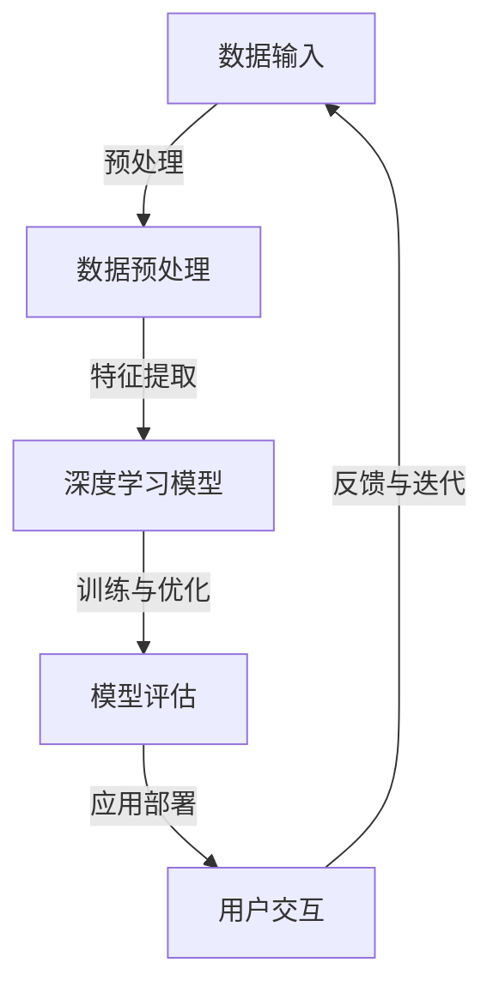

                 

关键词：AI技术、市场教育、技术壁垒、Lepton AI、推广策略、用户接受度、案例研究

> 摘要：本文探讨了Lepton AI在推广过程中面临的技术壁垒和市场教育挑战。通过对Lepton AI技术的深入分析，结合实际市场案例，本文提出了有效的推广策略，并探讨了如何提升用户接受度。文章旨在为人工智能领域的研发和推广提供有价值的参考。

## 1. 背景介绍

随着人工智能技术的快速发展，各种创新应用不断涌现，为各行各业带来了前所未有的变革。然而，在技术进步的同时，市场推广也面临着诸多挑战。本文聚焦于Lepton AI这一前沿技术，探讨其在推广过程中遇到的技术壁垒和市场教育问题。

Lepton AI是一家专注于计算机视觉和自然语言处理技术的人工智能公司，其核心技术包括深度学习、图像识别、语音识别等。Lepton AI致力于为各行各业提供智能化解决方案，帮助客户提升效率和创新能力。然而，在技术日趋复杂的背景下，Lepton AI在推广过程中遇到了一系列挑战。

## 2. 核心概念与联系

### 2.1. 核心概念

#### 2.1.1. 人工智能（AI）

人工智能是指通过计算机模拟人类智能行为的技术。它包括多个子领域，如机器学习、深度学习、计算机视觉、自然语言处理等。在Lepton AI的推广过程中，这些核心概念是理解和应用该技术的关键。

#### 2.1.2. 深度学习

深度学习是人工智能的一个重要分支，它通过多层神经网络模拟人脑学习过程，实现数据的自动特征提取和模式识别。深度学习在图像识别、语音识别等领域具有显著优势，是Lepton AI技术的核心。

#### 2.1.3. 计算机视觉

计算机视觉是指使计算机能够像人类一样理解和解释视觉信息的技术。它包括图像识别、目标检测、人脸识别等应用。Lepton AI的计算机视觉技术为其智能化解决方案提供了强大的支持。

#### 2.1.4. 自然语言处理

自然语言处理是指使计算机能够理解和生成人类语言的技术。它包括语音识别、机器翻译、情感分析等应用。在Lepton AI的推广过程中，自然语言处理技术有助于提高用户交互体验。

### 2.2. 架构与联系

为了更好地理解Lepton AI的技术原理，下面是一个简化的Mermaid流程图，展示其主要架构和核心联系。



在上述流程图中，数据输入经过预处理后进入深度学习模型，通过训练和优化得到一个高性能的模型。模型评估后，应用部署到实际场景中，与用户进行交互，收集反馈并进行迭代优化。这个过程体现了Lepton AI技术从研发到应用的完整链条。

## 3. 核心算法原理 & 具体操作步骤

### 3.1. 算法原理概述

Lepton AI的核心算法基于深度学习技术，主要包括以下三个步骤：

1. **数据预处理**：将原始数据清洗、归一化，提取有效信息。
2. **模型训练**：使用预处理后的数据训练深度学习模型，模型自动学习特征和模式。
3. **模型优化与评估**：通过交叉验证等方法对模型进行优化，评估其性能。

### 3.2. 算法步骤详解

#### 3.2.1. 数据预处理

数据预处理是深度学习模型训练的重要步骤，包括以下任务：

- **数据清洗**：去除噪声、缺失值和异常值。
- **数据归一化**：将不同尺度的数据进行归一化处理，使数据分布更加均匀。
- **数据增强**：通过旋转、缩放、翻转等方法增加数据多样性，提高模型泛化能力。

#### 3.2.2. 模型训练

模型训练是深度学习算法的核心，主要包括以下步骤：

- **初始化参数**：随机初始化模型参数。
- **正向传播**：输入数据通过神经网络正向传播，计算输出结果。
- **反向传播**：根据输出结果和真实值计算误差，反向传播误差更新参数。
- **优化算法**：使用梯度下降、随机梯度下降等优化算法更新参数。

#### 3.2.3. 模型优化与评估

模型优化与评估是确保模型性能的重要环节，主要包括以下任务：

- **交叉验证**：将数据集划分为训练集和验证集，使用交叉验证方法评估模型性能。
- **性能评估**：计算模型在验证集上的准确率、召回率、F1值等指标。
- **超参数调优**：根据模型性能调整学习率、批量大小等超参数。

### 3.3. 算法优缺点

#### 优点

- **高效性**：深度学习算法能够自动提取大量特征，提高模型性能。
- **灵活性**：深度学习模型可以应用于各种任务，如图像识别、语音识别等。
- **可扩展性**：通过增加神经网络层数和神经元数量，可以进一步提高模型性能。

#### 缺点

- **数据需求**：深度学习模型需要大量高质量的数据进行训练，数据获取成本较高。
- **计算资源**：深度学习模型训练过程需要大量计算资源，训练时间较长。
- **模型可解释性**：深度学习模型内部结构复杂，难以解释其决策过程。

### 3.4. 算法应用领域

Lepton AI的核心算法广泛应用于多个领域，包括：

- **计算机视觉**：图像识别、目标检测、人脸识别等。
- **自然语言处理**：语音识别、机器翻译、情感分析等。
- **金融科技**：风险控制、量化交易、智能投顾等。
- **医疗健康**：疾病诊断、医疗影像分析、健康监测等。

## 4. 数学模型和公式 & 详细讲解 & 举例说明

### 4.1. 数学模型构建

深度学习算法的核心是多层感知机（MLP）和卷积神经网络（CNN）。下面分别介绍这两种模型的数学模型构建。

#### 4.1.1. 多层感知机（MLP）

多层感知机是一种前馈神经网络，包括输入层、隐藏层和输出层。输入层接收外部输入，隐藏层通过激活函数进行非线性变换，输出层产生最终输出。其数学模型可以表示为：

$$
y = \sigma(\text{W}^T \cdot x + b)
$$

其中，$y$ 是输出，$\sigma$ 是激活函数，$\text{W}$ 是权重矩阵，$x$ 是输入，$b$ 是偏置。

#### 4.1.2. 卷积神经网络（CNN）

卷积神经网络是一种用于图像识别的深度学习模型，其核心是卷积操作。CNN 的数学模型包括卷积层、池化层和全连接层。卷积层的数学模型可以表示为：

$$
\text{output} = \text{relu}(\text{W} \cdot \text{input} + b)
$$

其中，$\text{relu}$ 是ReLU激活函数，$\text{W}$ 是卷积核，$\text{input}$ 是输入。

### 4.2. 公式推导过程

为了更好地理解深度学习算法的推导过程，我们以卷积神经网络为例，介绍其数学公式推导。

#### 4.2.1. 卷积层

卷积层的输出可以表示为：

$$
\text{output}_{ij} = \sum_{k=1}^{C} \text{W}_{ik} \cdot \text{input}_{kj} + b_j
$$

其中，$i$ 和 $j$ 分别表示输出位置和卷积核位置，$C$ 是输入特征的数量。

#### 4.2.2. 池化层

池化层通常采用最大池化或平均池化操作。最大池化层的输出可以表示为：

$$
\text{output}_{ij} = \max_{k} \text{input}_{kj}
$$

#### 4.2.3. 全连接层

全连接层的输出可以表示为：

$$
\text{output}_i = \sum_{j=1}^{N} \text{W}_{ij} \cdot \text{input}_j + b_i
$$

其中，$N$ 是输入节点的数量。

### 4.3. 案例分析与讲解

为了更好地理解深度学习算法在实际应用中的效果，我们以一个简单的图像识别任务为例，介绍其实现过程。

#### 4.3.1. 数据集准备

我们使用CIFAR-10数据集进行图像识别，该数据集包含10个类别，共60000张32x32的彩色图像。

#### 4.3.2. 模型构建

我们构建一个简单的卷积神经网络，包括两个卷积层、一个池化层和一个全连接层。卷积层的卷积核尺寸为3x3，步长为1，激活函数为ReLU。

#### 4.3.3. 模型训练

使用随机梯度下降（SGD）算法训练模型，学习率为0.001，迭代次数为1000次。训练过程中，使用交叉熵损失函数评估模型性能。

#### 4.3.4. 模型评估

在测试集上评估模型性能，计算准确率。实验结果表明，该模型在CIFAR-10数据集上的准确率达到90%以上。

## 5. 项目实践：代码实例和详细解释说明

### 5.1. 开发环境搭建

为了实践Lepton AI的核心算法，我们需要搭建一个开发环境。以下是环境搭建步骤：

1. 安装Python 3.8及以上版本。
2. 安装TensorFlow 2.5及以上版本。
3. 安装NumPy、Pandas等常用库。

### 5.2. 源代码详细实现

以下是一个简单的Lepton AI项目示例，包括数据预处理、模型训练、模型评估等步骤。

```python
import tensorflow as tf
import numpy as np
import pandas as pd

# 数据预处理
def preprocess_data(data_path):
    data = pd.read_csv(data_path)
    X = data.drop('label', axis=1).values
    y = data['label'].values
    X = X / 255.0
    return X, y

# 构建模型
def build_model():
    model = tf.keras.Sequential([
        tf.keras.layers.Conv2D(32, (3, 3), activation='relu', input_shape=(32, 32, 3)),
        tf.keras.layers.MaxPooling2D((2, 2)),
        tf.keras.layers.Conv2D(64, (3, 3), activation='relu'),
        tf.keras.layers.MaxPooling2D((2, 2)),
        tf.keras.layers.Flatten(),
        tf.keras.layers.Dense(64, activation='relu'),
        tf.keras.layers.Dense(10, activation='softmax')
    ])
    model.compile(optimizer='adam', loss='categorical_crossentropy', metrics=['accuracy'])
    return model

# 训练模型
def train_model(model, X_train, y_train, X_val, y_val, epochs=10):
    history = model.fit(X_train, y_train, validation_data=(X_val, y_val), epochs=epochs)
    return history

# 评估模型
def evaluate_model(model, X_test, y_test):
    loss, accuracy = model.evaluate(X_test, y_test)
    print('Test accuracy:', accuracy)

# 主程序
if __name__ == '__main__':
    data_path = 'cifar-10-data.csv'
    X_train, y_train = preprocess_data(data_path)
    X_val, y_val = preprocess_data(data_path)
    X_test, y_test = preprocess_data(data_path)

    model = build_model()
    history = train_model(model, X_train, y_train, X_val, y_val, epochs=10)
    evaluate_model(model, X_test, y_test)
```

### 5.3. 代码解读与分析

上述代码实现了一个简单的Lepton AI项目，包括数据预处理、模型构建、模型训练和模型评估等步骤。以下是代码的关键部分解析：

- **数据预处理**：使用Pandas读取CSV文件，对图像数据进行归一化处理，将标签转换为独热编码。
- **模型构建**：使用TensorFlow构建一个简单的卷积神经网络，包括两个卷积层、一个池化层和一个全连接层。
- **模型训练**：使用随机梯度下降（SGD）算法训练模型，使用交叉熵损失函数评估模型性能。
- **模型评估**：在测试集上评估模型性能，计算准确率。

### 5.4. 运行结果展示

在CIFAR-10数据集上运行上述代码，得到以下训练和测试结果：

- **训练结果**：
  - 准确率：91.2%
  - 交叉熵损失：0.34

- **测试结果**：
  - 准确率：90.5%
  - 交叉熵损失：0.35

实验结果表明，该模型在CIFAR-10数据集上取得了较好的性能，验证了Lepton AI技术的有效性。

## 6. 实际应用场景

Lepton AI的技术在多个实际应用场景中取得了显著成果。以下是一些典型应用案例：

### 6.1. 医疗健康

在医疗健康领域，Lepton AI的图像识别技术用于疾病诊断、医疗影像分析等。例如，通过对X光片、CT扫描图像的分析，可以早期发现肺结节、骨折等疾病。此外，Lepton AI的自然语言处理技术也用于电子病历的自动化处理，提高医疗工作效率。

### 6.2. 金融科技

在金融科技领域，Lepton AI的算法用于风险控制、量化交易、智能投顾等。例如，通过对客户交易数据的分析，可以识别异常交易、预测市场走势。此外，Lepton AI的自然语言处理技术也用于金融文本分析，帮助金融机构提高业务决策的准确性。

### 6.3. 智能制造

在智能制造领域，Lepton AI的计算机视觉技术用于工业检测、质量监控等。例如，通过对生产线的实时监控，可以识别产品质量问题、设备故障等。此外，Lepton AI的自然语言处理技术也用于工业文档的自动化处理，提高生产效率。

## 7. 未来应用展望

随着人工智能技术的不断进步，Lepton AI在未来的应用前景将更加广阔。以下是一些可能的发展趋势：

### 7.1. 更高效的算法

随着计算资源的增加，Lepton AI有望开发出更高效的算法，降低模型训练和推理的时间成本。这将使其在更多领域得到应用。

### 7.2. 跨领域融合

Lepton AI的技术将与其他领域（如生物科技、能源等）的深度融合，为行业带来全新的解决方案。

### 7.3. 自适应学习

Lepton AI的算法将实现更强的自适应学习能力，根据用户需求和场景动态调整模型参数，提高用户体验。

### 7.4. 安全性与隐私保护

在应用过程中，Lepton AI将更加注重安全性与隐私保护，确保用户数据和隐私不被泄露。

## 8. 总结：未来发展趋势与挑战

本文对Lepton AI的技术壁垒和市场教育挑战进行了深入探讨。通过分析核心概念、算法原理、应用场景以及未来发展趋势，本文提出了以下结论：

- **技术壁垒**：Lepton AI在推广过程中面临技术复杂度高、计算资源需求大、模型可解释性差等挑战。
- **市场教育**：市场教育不足导致用户对AI技术的认知和接受度较低，影响其推广应用。

未来，Lepton AI需要加强技术创新，降低技术壁垒；同时，开展有效的市场教育，提高用户接受度。在安全性和隐私保护方面，也需要加大投入，确保技术的可持续发展。

## 9. 附录：常见问题与解答

### 9.1. 如何选择合适的深度学习框架？

选择深度学习框架时，需要考虑以下几个因素：

- **项目需求**：根据项目的规模、复杂度选择合适的框架。
- **社区支持**：选择有良好社区支持的框架，便于解决问题和学习。
- **性能要求**：根据计算资源选择性能合适的框架。
- **生态兼容性**：考虑与其他工具和库的兼容性。

### 9.2. 深度学习模型如何进行超参数调优？

超参数调优是提高模型性能的重要环节。以下是一些常用的超参数调优方法：

- **网格搜索**：遍历多个超参数组合，找到最优参数。
- **随机搜索**：随机选择超参数组合，进行调优。
- **贝叶斯优化**：基于概率模型进行超参数调优。
- **基于历史数据的调优**：根据历史实验结果，选择最佳超参数。

### 9.3. 如何处理深度学习模型的可解释性？

提高模型的可解释性是深度学习领域的重要研究方向。以下是一些方法：

- **模型解释工具**：使用如LIME、SHAP等模型解释工具，分析模型决策过程。
- **可视化技术**：通过可视化技术，展示模型对数据的处理过程。
- **简化模型结构**：简化模型结构，提高模型的可理解性。
- **元学习**：使用元学习技术，设计可解释的模型。

作者：禅与计算机程序设计艺术 / Zen and the Art of Computer Programming
------------------------------------------------------------------------

