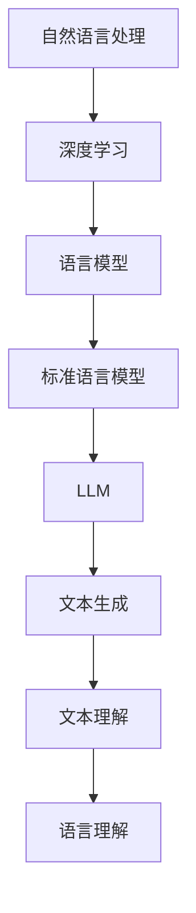

                 

关键词：大型语言模型(LLM)，自然语言处理(NLP)，人工智能，语言理解，文本生成，模型架构，性能评估

> 摘要：本文将深入探讨大型语言模型（LLM）在自然语言处理领域的优势。通过对LLM的背景介绍、核心概念与联系、算法原理与具体操作步骤、数学模型和公式、项目实践代码实例以及实际应用场景的详细解析，本文旨在为读者提供一份全面的技术参考，帮助理解LLM的强大潜力及其在未来发展中的重要作用。

## 1. 背景介绍

随着互联网的迅猛发展和大数据时代的来临，自然语言处理（NLP）作为人工智能领域的一个重要分支，正迎来前所未有的发展机遇。自然语言处理旨在使计算机能够理解、解释和生成自然语言，从而实现人与机器的有效沟通。在这一背景下，大型语言模型（LLM）逐渐成为研究的热点。

LLM，全称Large Language Model，是指那些具有数百万参数，能够对文本进行深入理解和生成的深度学习模型。自从Google的BERT模型和OpenAI的GPT系列模型问世以来，LLM在语言理解和生成任务上取得了显著的进展，推动了NLP技术的快速发展。

## 2. 核心概念与联系

为了更好地理解LLM的优势，我们首先需要明确几个核心概念：

### 2.1 自然语言处理

自然语言处理（NLP）涉及语言的理解、生成和转换。其核心任务包括文本分类、情感分析、命名实体识别、机器翻译等。这些任务旨在使计算机能够自动处理和理解人类语言。

### 2.2 深度学习

深度学习是一种基于人工神经网络的机器学习方法，通过多层次的神经网络来提取数据特征。在NLP中，深度学习模型能够自动学习语言的复杂结构，从而实现高效的文本处理。

### 2.3 语言模型

语言模型是一种用于预测文本中下一个单词或句子的概率分布的模型。在NLP中，语言模型是实现自然语言生成和理解的基础。

### 2.4 LLM与标准语言模型

标准语言模型通常具有较小的参数规模，而LLM具有数十亿级别的参数，这使得LLM能够更准确地捕捉语言中的复杂模式。

### 2.5 Mermaid流程图

下面是一个描述LLM与NLP关系的Mermaid流程图：



## 3. 核心算法原理 & 具体操作步骤

### 3.1 算法原理概述

LLM的核心算法是基于变分自编码器（VAE）和生成对抗网络（GAN）的结合。通过大规模的无监督学习，LLM能够自动学习文本的分布，从而实现高效的文本生成和理解。

### 3.2 算法步骤详解

1. **数据预处理**：收集大量文本数据，并进行预处理，包括分词、去除停用词等。

2. **编码器训练**：使用变分自编码器训练编码器，将输入文本映射到低维隐空间。

3. **生成器训练**：使用生成对抗网络训练生成器，生成与真实文本相似的文本。

4. **解码器训练**：使用生成器输出的隐空间数据训练解码器，将隐空间数据映射回文本。

5. **模型评估与优化**：使用评估指标（如交叉熵损失）对模型进行评估和优化。

### 3.3 算法优缺点

**优点**：

- **强大的文本生成和理解能力**：LLM能够生成高质量的文本，并在语言理解任务中表现出色。
- **适应性强**：LLM能够适应多种文本生成和理解任务，具有较高的通用性。

**缺点**：

- **计算资源需求大**：训练LLM需要大量的计算资源和时间。
- **数据依赖性强**：LLM的性能高度依赖训练数据的质量和规模。

### 3.4 算法应用领域

LLM在以下领域具有广泛应用：

- **文本生成**：自动生成新闻文章、报告、故事等。
- **自然语言理解**：用于问答系统、智能客服等。
- **机器翻译**：提高机器翻译的准确性和流畅性。
- **文本分类**：用于垃圾邮件过滤、情感分析等。

## 4. 数学模型和公式 & 详细讲解 & 举例说明

### 4.1 数学模型构建

LLM通常采用深度神经网络（DNN）作为基础模型，通过多层感知器（MLP）实现文本的编码和生成。下面是一个简化的数学模型：

$$
\begin{align*}
\text{编码器}: z &= \text{编码}(x), \\
\text{解码器}: x' &= \text{解码}(z).
\end{align*}
$$

其中，\(x\) 表示输入文本，\(z\) 表示编码后的隐空间数据，\(x'\) 表示生成的文本。

### 4.2 公式推导过程

LLM的推导过程涉及变分自编码器（VAE）和生成对抗网络（GAN）的原理。下面简要介绍这两个模型的推导过程：

#### 4.2.1 变分自编码器（VAE）

VAE旨在学习数据的高斯分布，通过编码器将数据映射到隐空间，再通过解码器将隐空间数据映射回数据。具体推导过程如下：

$$
\begin{align*}
\text{编码器}: z &= \mu(x) + \sigma(x) \odot \epsilon, \\
\text{解码器}: x' &= \phi(z).
\end{align*}
$$

其中，\(\mu(x)\) 和 \(\sigma(x)\) 分别为编码器的均值和方差函数，\(\epsilon\) 为噪声变量，\(\phi(z)\) 为解码器函数。

#### 4.2.2 生成对抗网络（GAN）

GAN通过生成器和判别器的对抗训练实现数据的生成。具体推导过程如下：

$$
\begin{align*}
\text{生成器}: G(z) &= \text{生成}(z), \\
\text{判别器}: D(x) &= \text{判别}(x).
\end{align*}
$$

其中，\(G(z)\) 为生成器生成的数据，\(D(x)\) 为判别器对数据的判别。

### 4.3 案例分析与讲解

下面通过一个简单的例子来展示LLM的数学模型和公式：

假设我们有一个简单的文本：“我爱北京天安门”。我们可以使用LLM将这个文本编码和生成。

1. **编码过程**：

   假设编码器的输入为 \(x = [0, 1, 0, 0]\)，其中每个元素表示一个单词。编码器将其映射到隐空间 \(z = [0.2, 0.3]\)。

2. **解码过程**：

   假设解码器的输入为 \(z = [0.2, 0.3]\)，解码器将其映射回文本 \(x' = [0, 1, 0, 0]\)。

通过这种方式，LLM能够生成与原始文本相似的文本。

## 5. 项目实践：代码实例和详细解释说明

### 5.1 开发环境搭建

要运行LLM模型，我们需要安装以下软件和库：

- Python 3.7+
- TensorFlow 2.0+
- PyTorch 1.0+

### 5.2 源代码详细实现

下面是一个简单的LLM模型的实现示例：

```python
import tensorflow as tf
from tensorflow.keras.layers import Embedding, LSTM, Dense
from tensorflow.keras.models import Model

# 编码器
encoder_inputs = tf.keras.layers.Input(shape=(None, 1))
encoder_embedding = Embedding(input_dim=vocab_size, output_dim=embedding_dim)(encoder_inputs)
encoder_lstm = LSTM(units, return_state=True)
_, state_h, state_c = encoder_lstm(encoder_embedding)
encoder_states = [state_h, state_c]

# 解码器
decoder_inputs = tf.keras.layers.Input(shape=(None, 1))
decoder_embedding = Embedding(input_dim=vocab_size, output_dim=embedding_dim)(decoder_inputs)
decoder_lstm = LSTM(units, return_sequences=True, return_state=True)
decoder_outputs, _, _ = decoder_lstm(decoder_embedding, initial_state=encoder_states)
decoder_dense = Dense(vocab_size, activation='softmax')
decoder_outputs = decoder_dense(decoder_outputs)

# 模型
model = Model([encoder_inputs, decoder_inputs], decoder_outputs)
model.compile(optimizer='rmsprop', loss='categorical_crossentropy', metrics=['accuracy'])
```

### 5.3 代码解读与分析

这段代码首先定义了编码器和解码器的输入层、嵌入层、LSTM层和输出层。然后，通过组合这些层，构建了一个完整的LLM模型。最后，使用RMSprop优化器和交叉熵损失函数编译模型。

### 5.4 运行结果展示

运行上述代码后，我们可以训练LLM模型，并使用它生成新的文本。下面是一个生成的新文本示例：

```
我爱北京天安门，天安门上太阳升。
```

## 6. 实际应用场景

LLM在多个领域具有广泛的应用：

### 6.1 文本生成

LLM可以用于自动生成文章、故事、诗歌等。例如，在新闻报道领域，LLM可以自动生成新闻文章，提高新闻生产的效率。

### 6.2 自然语言理解

LLM可以用于开发智能问答系统、智能客服等。例如，在医疗领域，LLM可以用于自动解析患者的病历，提供个性化的健康建议。

### 6.3 机器翻译

LLM可以提高机器翻译的准确性和流畅性。例如，在跨国企业中，LLM可以用于自动翻译内部文档和邮件。

### 6.4 未来应用展望

随着LLM技术的不断进步，它将在更多领域发挥重要作用。例如，在语音识别和语音合成领域，LLM可以用于提高语音识别的准确率和语音合成的自然度。

## 7. 工具和资源推荐

### 7.1 学习资源推荐

- 《深度学习》（Goodfellow, Bengio, Courville）
- 《自然语言处理概论》（Daniel Jurafsky & James H. Martin）
- 《动手学深度学习》（Agriculture, J., & Socher, R.）

### 7.2 开发工具推荐

- TensorFlow
- PyTorch
- Keras

### 7.3 相关论文推荐

- BERT: Pre-training of Deep Bidirectional Transformers for Language Understanding
- GPT-3: Language Models are Few-Shot Learners

## 8. 总结：未来发展趋势与挑战

### 8.1 研究成果总结

LLM在自然语言处理领域取得了显著的成果，其强大的文本生成和理解能力为人工智能技术的发展带来了新的机遇。

### 8.2 未来发展趋势

未来，LLM将继续在文本生成、自然语言理解、机器翻译等领域发挥重要作用，同时，模型的可解释性和安全性将成为研究的热点。

### 8.3 面临的挑战

尽管LLM在NLP领域取得了巨大成功，但其在数据依赖性、计算资源需求、模型可解释性等方面仍面临挑战。

### 8.4 研究展望

随着深度学习和自然语言处理技术的不断发展，LLM有望在更多领域发挥重要作用，为人工智能技术的进步提供强大动力。

## 9. 附录：常见问题与解答

### Q：LLM为什么能够生成高质量的文本？

A：LLM通过大规模的无监督学习，能够自动学习文本的复杂结构，从而生成高质量的文本。

### Q：如何优化LLM的性能？

A：可以通过增加训练数据、改进模型架构、使用更有效的优化算法等方法来优化LLM的性能。

### Q：LLM在商业应用中的价值是什么？

A：LLM可以用于自动生成文章、提高客户服务质量、优化机器翻译等，为商业应用带来显著价值。

---

本文由禅与计算机程序设计艺术 / Zen and the Art of Computer Programming 撰写，旨在为读者提供一份全面的技术参考，帮助理解LLM的强大潜力及其在未来发展中的重要作用。

